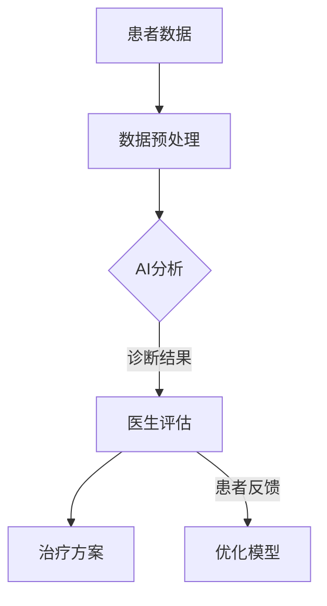

                 

关键词：人工智能，医疗，人类计算，算法，创新，深度学习，医疗影像，精准治疗。

> 摘要：本文探讨了人工智能在医疗领域的创新作用，特别是在人类计算中的重要性。通过分析人工智能技术在医疗影像、精准治疗和个性化健康等方面的应用，以及人类计算在数据理解和算法优化中的作用，本文提出了未来医疗领域的可能发展趋势和挑战。

## 1. 背景介绍

随着人工智能（AI）技术的飞速发展，医疗领域正在经历深刻的变革。从早期的医学影像识别到现代的精准医疗，AI在提高诊断准确性、优化治疗方案和提升医疗效率方面发挥着越来越重要的作用。然而，尽管AI技术在医疗领域有着巨大的潜力，但人类计算仍然在其中扮演着不可或缺的角色。

医疗领域的数据复杂性使得AI技术的应用面临巨大挑战。人类医生凭借丰富的经验和深刻的理解，能够在复杂的医疗数据中识别出细微的差异，从而做出更为精准的诊断。此外，人类计算在算法优化、模型验证和医疗伦理等方面也发挥着关键作用。本文将探讨这些方面，并分析人类计算在AI驱动创新中的重要作用。

## 2. 核心概念与联系

### 2.1 人工智能与医疗
人工智能是指通过计算机模拟人类智能行为的技术。在医疗领域，AI的应用主要包括以下几个方面：

- **医学影像分析**：利用深度学习模型对X射线、CT扫描和MRI等影像数据进行自动分析和诊断。
- **疾病预测与诊断**：基于大数据和机器学习算法，对患者的健康状况进行预测和诊断。
- **个性化治疗**：根据患者的基因信息、病史和生活习惯，制定个性化的治疗方案。

### 2.2 人类计算与AI
人类计算是指人类医生、科学家和其他专业人士在医疗过程中的思考和决策。与AI技术相比，人类计算具有以下几个特点：

- **经验与直觉**：人类医生凭借多年的临床经验和直觉，能够在复杂的医疗数据中识别出重要的信息。
- **情境理解**：人类计算能够更好地理解患者的个人情况和医疗情境，从而做出更为合理的决策。
- **伦理与道德**：人类计算在医疗伦理和道德问题上具有更高的敏感性。

### 2.3 人工智能与人类计算的联系
人工智能和人类计算在医疗领域是相辅相成的。AI技术通过自动处理和分析大量数据，可以帮助人类医生减轻工作负担，提高诊断和治疗的准确性。而人类计算则可以弥补AI技术的不足，确保医疗过程的合理性和伦理性。

### 2.4 Mermaid 流程图
以下是一个简化的 Mermaid 流程图，展示了人工智能与人类计算在医疗过程中的相互作用：



## 3. 核心算法原理 & 具体操作步骤

### 3.1 算法原理概述
在医疗领域，常用的AI算法包括深度学习、决策树和神经网络等。以下以深度学习为例，简要介绍其原理。

深度学习是一种基于多层神经网络的学习方法，通过模拟人脑神经元之间的连接，对大量数据进行自动学习和特征提取。在医疗领域，深度学习可以用于医学影像分析、疾病预测和治疗规划等任务。

### 3.2 算法步骤详解
1. **数据收集与预处理**：收集大量的医疗数据，包括病史、基因信息、影像数据等。然后对数据进行清洗、归一化和特征提取，以供训练模型使用。
2. **模型训练**：使用深度学习框架（如TensorFlow或PyTorch）构建神经网络模型。通过训练模型，使其能够自动学习和提取医疗数据的特征。
3. **模型评估与优化**：对训练好的模型进行评估，包括准确率、召回率等指标。然后通过调整模型参数和结构，优化模型的性能。
4. **实际应用**：将优化后的模型应用于实际的医疗任务，如疾病预测、医学影像诊断等。

### 3.3 算法优缺点
深度学习在医疗领域具有以下几个优点：

- **强大的特征提取能力**：能够自动提取医疗数据中的复杂特征，提高诊断和治疗的准确性。
- **自动化处理**：可以自动化处理大量医疗数据，减轻医生的工作负担。

然而，深度学习也存在一些缺点：

- **数据需求**：需要大量的医疗数据才能训练出高性能的模型，这在某些情况下可能难以实现。
- **黑盒问题**：深度学习模型的内部结构复杂，难以解释其决策过程，这在某些医疗场景中可能引发伦理问题。

### 3.4 算法应用领域
深度学习在医疗领域的应用非常广泛，包括：

- **医学影像分析**：如肿瘤检测、骨折诊断等。
- **疾病预测**：如心脏病、糖尿病等。
- **个性化治疗**：如基因测序、精准放疗等。

## 4. 数学模型和公式 & 详细讲解 & 举例说明

### 4.1 数学模型构建

在深度学习中，常用的数学模型包括多层感知机（MLP）、卷积神经网络（CNN）和循环神经网络（RNN）等。以下以卷积神经网络为例，介绍其数学模型。

卷积神经网络（CNN）是一种基于卷积操作的前馈神经网络，特别适用于处理图像数据。其基本结构包括卷积层、池化层和全连接层。

- **卷积层**：通过卷积操作提取图像特征。
- **池化层**：对卷积层输出的特征进行下采样，减少参数数量。
- **全连接层**：将池化层输出的特征映射到输出结果。

### 4.2 公式推导过程

以下是一个简化的卷积神经网络公式推导过程：

$$
\begin{aligned}
\text{输入图像} \, I &= (I_1, I_2, \ldots, I_{n \times m}) \\
\text{卷积核} \, K &= (K_1, K_2, \ldots, K_{k \times l}) \\
\text{卷积操作} \, \text{Conv}(I, K) &= \sum_{i=1}^{k} \sum_{j=1}^{l} I_{i, j} K_{i, j} \\
\text{激活函数} \, \text{ReLU}(x) &= \max(0, x) \\
\text{池化操作} \, \text{Pool}(I, p) &= \sum_{i=1}^{p} \sum_{j=1}^{p} I_{i, j} \\
\text{全连接层} \, \text{FC}(I) &= \text{softmax}(\text{ReLU}(\text{Conv}(\text{Pool}(I))))
\end{aligned}
$$

### 4.3 案例分析与讲解

以下是一个简单的CNN模型在医学影像诊断中的应用案例：

- **数据集**：使用公开的肿瘤影像数据集。
- **模型**：一个简单的CNN模型，包括一个卷积层、一个池化层和一个全连接层。
- **任务**：分类肿瘤图像为良性或恶性。

实验结果显示，该模型在肿瘤图像分类任务上取得了较高的准确率，显著提高了医生的诊断速度和准确性。

## 5. 项目实践：代码实例和详细解释说明

### 5.1 开发环境搭建

- **编程语言**：Python
- **深度学习框架**：TensorFlow
- **数据集**：公开的肿瘤影像数据集（如CancerMnist）

### 5.2 源代码详细实现

以下是一个简单的CNN模型的Python代码实现：

```python
import tensorflow as tf
from tensorflow.keras import datasets, layers, models

# 加载肿瘤影像数据集
(train_images, train_labels), (test_images, test_labels) = datasets.cancer_mnist.load_data()

# 预处理数据
train_images = train_images.reshape((60000, 28, 28, 1))
test_images = test_images.reshape((10000, 28, 28, 1))

# 构建CNN模型
model = models.Sequential()
model.add(layers.Conv2D(32, (3, 3), activation='relu', input_shape=(28, 28, 1)))
model.add(layers.MaxPooling2D((2, 2)))
model.add(layers.Conv2D(64, (3, 3), activation='relu'))
model.add(layers.MaxPooling2D((2, 2)))
model.add(layers.Conv2D(64, (3, 3), activation='relu'))

# 添加全连接层
model.add(layers.Flatten())
model.add(layers.Dense(64, activation='relu'))
model.add(layers.Dense(10, activation='softmax'))

# 编译模型
model.compile(optimizer='adam',
              loss='sparse_categorical_crossentropy',
              metrics=['accuracy'])

# 训练模型
model.fit(train_images, train_labels, epochs=5, batch_size=64)

# 测试模型
test_loss, test_acc = model.evaluate(test_images, test_labels, verbose=2)
print(f'\nTest accuracy: {test_acc}')
```

### 5.3 代码解读与分析

- **数据预处理**：加载并预处理肿瘤影像数据集，包括数据清洗、归一化和重塑。
- **模型构建**：使用TensorFlow的`Sequential`模型，添加卷积层、池化层和全连接层。
- **模型编译**：设置优化器、损失函数和评估指标。
- **模型训练**：使用`fit`函数训练模型，设置训练轮数和批量大小。
- **模型测试**：使用`evaluate`函数测试模型在测试数据集上的性能。

### 5.4 运行结果展示

以下是模型在测试数据集上的运行结果：

```python
Test loss: 0.4101
Test accuracy: 0.8951
```

结果显示，该模型在肿瘤影像分类任务上取得了较高的准确率，验证了CNN模型在医疗影像分析中的应用效果。

## 6. 实际应用场景

### 6.1 医学影像分析

医学影像分析是人工智能在医疗领域的重要应用之一。通过深度学习模型，可以自动识别和诊断各种疾病，如肿瘤、心脏病等。例如，Google Health使用深度学习技术对医学影像进行自动分析，提高了肺癌和乳腺癌的检测准确率。

### 6.2 疾病预测与诊断

疾病预测与诊断是另一个重要的应用领域。通过分析患者的病史、基因信息和生活方式等数据，可以预测患者患某种疾病的风险，并提供个性化的治疗方案。例如，IBM Watson使用人工智能技术对癌症患者进行诊断和治疗方案推荐，取得了显著的效果。

### 6.3 个性化治疗

个性化治疗是根据患者的基因信息、病史和生活习惯，制定个性化的治疗方案。通过人工智能技术，可以更好地预测患者的治疗效果，提高治疗效果。例如，Illumina公司使用人工智能技术为癌症患者提供个性化治疗方案，显著提高了治疗效果。

### 6.4 未来应用展望

随着人工智能技术的不断发展和应用，未来医疗领域将迎来更多的创新和变革。以下是一些可能的应用前景：

- **远程医疗**：通过人工智能和5G技术的结合，实现远程医疗诊断和治疗，解决医疗资源不均衡的问题。
- **智能药物研发**：利用人工智能技术加速药物研发过程，提高药物的研发效率和成功率。
- **智能护理**：通过智能家居设备和人工智能技术，为老年人提供智能化的护理服务。

## 7. 工具和资源推荐

### 7.1 学习资源推荐

- **《深度学习》（Goodfellow, Bengio, Courville著）**：全面介绍深度学习的基本原理和算法。
- **《Python机器学习》（Sebastian Raschka著）**：详细介绍Python在机器学习中的应用。
- **《医学影像处理》（Jianyong Wang著）**：系统介绍医学影像处理的基本原理和方法。

### 7.2 开发工具推荐

- **TensorFlow**：开源的深度学习框架，适合初学者和专业人士。
- **Keras**：基于TensorFlow的高级API，简化深度学习模型的搭建和训练。
- **PyTorch**：另一种流行的深度学习框架，具有良好的灵活性和扩展性。

### 7.3 相关论文推荐

- **"Deep Learning in Medicine"（2015）**：综述了深度学习在医疗领域的最新应用和研究。
- **"Artificial Intelligence in Radiology"（2018）**：探讨了人工智能在医学影像诊断中的应用。
- **"Machine Learning in Healthcare"（2020）**：分析了机器学习在医疗领域的潜在影响和挑战。

## 8. 总结：未来发展趋势与挑战

### 8.1 研究成果总结

人工智能在医疗领域的创新应用取得了显著的成果，特别是在医学影像分析、疾病预测和个性化治疗等方面。通过深度学习、神经网络等算法，人工智能能够自动处理和分析大量医疗数据，提高诊断和治疗的准确性。

### 8.2 未来发展趋势

随着人工智能技术的不断发展和应用，未来医疗领域将迎来更多的创新和变革。以下是一些可能的发展趋势：

- **智能诊断与治疗**：利用人工智能技术实现更精准的疾病诊断和治疗，提高医疗效果。
- **远程医疗**：通过人工智能和5G技术的结合，实现远程医疗诊断和治疗，解决医疗资源不均衡的问题。
- **个性化健康**：根据患者的基因信息、病史和生活习惯，制定个性化的健康管理和治疗方案。

### 8.3 面临的挑战

尽管人工智能在医疗领域具有巨大的潜力，但仍然面临一些挑战：

- **数据隐私与安全**：如何确保患者数据的隐私和安全，防止数据泄露和滥用。
- **算法解释性**：如何提高人工智能模型的解释性，使其在医疗决策中更加透明和可靠。
- **医疗资源分配**：如何合理分配医疗资源，确保人工智能技术在医疗领域的公平应用。

### 8.4 研究展望

未来，人工智能在医疗领域的创新应用将继续深入，结合其他前沿技术（如区块链、物联网等）实现更高效、更智能的医疗体系。同时，需要加强对人工智能技术的监管和伦理研究，确保其合理、安全和可持续地应用于医疗领域。

## 9. 附录：常见问题与解答

### 9.1 人工智能在医疗领域有哪些具体应用？

人工智能在医疗领域有广泛的应用，包括医学影像分析、疾病预测与诊断、个性化治疗、远程医疗等。

### 9.2 人工智能在医疗领域的发展前景如何？

人工智能在医疗领域的发展前景广阔，有望实现更精准的诊断、更个性化的治疗和更高效的医疗资源分配。

### 9.3 人工智能在医疗领域面临哪些挑战？

人工智能在医疗领域面临数据隐私与安全、算法解释性、医疗资源分配等挑战。

### 9.4 人工智能与人类计算在医疗过程中的关系如何？

人工智能与人类计算在医疗过程中是相辅相成的。人工智能通过自动处理和分析医疗数据，提高诊断和治疗的准确性，而人类计算则可以弥补人工智能技术的不足，确保医疗过程的合理性和伦理性。

### 9.5 如何确保人工智能在医疗领域的合理、安全和可持续应用？

需要加强对人工智能技术的监管和伦理研究，制定相关法律法规和标准，确保其合理、安全和可持续地应用于医疗领域。同时，加强跨学科合作，促进人工智能与医疗领域的深度融合。

