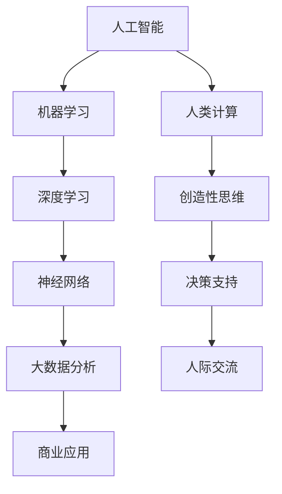

                 

关键词：人工智能，商业应用，技术创新，人类计算，未来趋势

> 摘要：随着人工智能（AI）技术的迅猛发展，其在商业领域的应用日益广泛，推动着企业创新和经济增长。本文将探讨AI在商业中的应用，以及人类计算在其中的未来发展方向，旨在为企业和个人提供有关AI驱动的创新策略和实用指南。

## 1. 背景介绍

人工智能，作为一种模拟人类智能的技术，近年来取得了显著进展。从早期的规则系统到深度学习，AI技术逐渐成熟，并在多个领域实现了突破性应用。商业领域也不例外，AI技术的引入不仅提升了企业的运营效率，还改变了商业模式，为企业带来了新的增长机遇。

### 1.1 商业应用的现状

目前，AI技术在商业领域的应用主要包括以下几个方面：

- **客户服务**：通过聊天机器人和虚拟客服，企业能够提供24/7的在线服务，提升客户满意度。
- **风险管理**：利用AI分析大量数据，企业可以更准确地预测市场趋势和风险，做出更加明智的决策。
- **个性化营销**：通过分析用户行为和偏好，AI能够实现更加精准的营销策略，提高转化率。
- **供应链优化**：AI能够优化库存管理和物流配送，降低成本，提高效率。

### 1.2 人类计算的角色

在AI技术日益普及的背景下，人类计算依然发挥着重要作用。人类计算不仅能够弥补AI技术的局限性，还能提供创意、直觉和情感理解，这些都是AI难以替代的。

- **创意与构思**：人类在艺术、设计和创新领域的创造力是AI难以企及的。
- **决策支持**：人类能够基于复杂的情感和道德因素做出更为全面的决策。
- **人际交流**：在需要复杂情感理解和人际互动的场景中，人类计算的沟通能力至关重要。

## 2. 核心概念与联系

在深入探讨AI在商业中的应用之前，我们需要明确几个核心概念，并了解它们之间的联系。以下是一个简化的Mermaid流程图，用于描述这些概念和它们之间的关系：



### 2.1 人工智能

人工智能是指使计算机系统能够模拟人类智能行为的技术。它包括多个子领域，如机器学习、自然语言处理、计算机视觉等。

### 2.2 机器学习

机器学习是人工智能的一个分支，它通过数据和算法让计算机自动学习和改进。机器学习主要分为监督学习、无监督学习和强化学习。

### 2.3 深度学习

深度学习是机器学习的一个重要方向，它通过多层神经网络模型对大量数据进行分析和识别。

### 2.4 神经网络

神经网络是深度学习的基础，它模拟人脑神经元的工作方式，通过层级结构对信息进行处理。

### 2.5 大数据分析

大数据分析利用AI技术对海量数据进行分析，以发现有价值的信息和模式。

### 2.6 商业应用

商业应用是AI技术最终的目标领域，它涵盖了从客户服务到风险管理等多个方面。

### 2.7 人类计算

人类计算是指在AI技术无法胜任的领域，人类发挥的创造性和决策能力。

### 2.8 创造性思维

创造性思维是人类独有的能力，它能够帮助人类在艺术、设计和创新领域做出突破。

### 2.9 决策支持

决策支持是人类计算在商业中的重要应用，它能够帮助企业在复杂环境中做出更为明智的决策。

### 2.10 人际交流

人际交流是商业活动中不可或缺的一部分，它依赖于人类计算的情感理解和沟通能力。

## 3. 核心算法原理 & 具体操作步骤

### 3.1 算法原理概述

在AI驱动的商业创新中，核心算法的作用至关重要。以下是一些关键的算法原理：

- **机器学习算法**：如线性回归、决策树、随机森林、支持向量机等。
- **深度学习算法**：如卷积神经网络（CNN）、循环神经网络（RNN）、生成对抗网络（GAN）等。
- **大数据分析算法**：如关联规则学习、聚类分析、数据挖掘等。

### 3.2 算法步骤详解

#### 3.2.1 机器学习算法

1. 数据采集与预处理：收集相关数据，并进行清洗、转换和归一化。
2. 模型选择与训练：选择合适的机器学习算法，对数据进行训练。
3. 模型评估与优化：通过交叉验证和测试集评估模型性能，进行参数调优。
4. 应用部署：将训练好的模型部署到实际应用场景中。

#### 3.2.2 深度学习算法

1. 网络架构设计：设计合适的神经网络架构，如CNN、RNN等。
2. 神经网络训练：使用大量数据对神经网络进行训练，调整网络参数。
3. 网络评估与优化：评估神经网络性能，通过剪枝、量化等方法优化网络。
4. 模型部署：将训练好的模型部署到硬件设备或云端平台。

#### 3.2.3 大数据分析算法

1. 数据预处理：清洗、转换和归一化数据，提取特征。
2. 算法选择与实现：选择合适的大数据分析算法，如关联规则学习、聚类分析等。
3. 模型评估与优化：评估算法性能，进行参数调优。
4. 应用部署：将算法应用到实际业务场景中。

### 3.3 算法优缺点

#### 3.3.1 机器学习算法

- 优点：算法成熟，理论基础扎实，适用范围广。
- 缺点：对数据质量要求高，训练过程可能需要大量时间。

#### 3.3.2 深度学习算法

- 优点：能够处理复杂数据和任务，自动提取特征。
- 缺点：训练过程需要大量数据和计算资源，对调参要求高。

#### 3.3.3 大数据分析算法

- 优点：能够处理海量数据，发现潜在模式。
- 缺点：算法复杂度高，对数据预处理要求高。

### 3.4 算法应用领域

- **金融行业**：风险管理、信用评估、投资决策等。
- **医疗行业**：疾病诊断、药物研发、健康监测等。
- **零售行业**：需求预测、库存管理、个性化推荐等。
- **制造行业**：质量控制、设备维护、生产优化等。

## 4. 数学模型和公式 & 详细讲解 & 举例说明

在AI驱动的商业创新中，数学模型和公式发挥着重要作用。以下是一些常用的数学模型和公式，以及它们的详细讲解和举例说明。

### 4.1 数学模型构建

数学模型是描述现实世界问题的抽象表示。在构建数学模型时，我们需要考虑以下几个关键步骤：

1. **明确问题背景和目标**：明确要解决的问题，确定要达到的目标。
2. **数据收集与整理**：收集相关数据，并进行清洗、转换和归一化。
3. **选择合适的数学工具和方法**：根据问题特点和目标，选择合适的数学工具和方法。
4. **建立数学模型**：根据所选方法和工具，构建数学模型。
5. **模型验证与优化**：验证模型的有效性，并根据实际情况进行优化。

### 4.2 公式推导过程

以下是一个简单的线性回归模型的公式推导过程：

$$
y = \beta_0 + \beta_1 \cdot x
$$

其中，$y$是因变量，$x$是自变量，$\beta_0$是截距，$\beta_1$是斜率。

1. **最小二乘法**：我们希望找到一组参数$\beta_0$和$\beta_1$，使得实际观测值$y$与模型预测值$y'$之间的误差最小。

$$
\min_{\beta_0, \beta_1} \sum_{i=1}^{n} (y_i - y_i')
$$

2. **求导与优化**：对上述误差函数求导，并令导数为零，得到最优参数$\beta_0$和$\beta_1$。

$$
\frac{\partial}{\partial \beta_0} \sum_{i=1}^{n} (y_i - y_i') = 0 \\
\frac{\partial}{\partial \beta_1} \sum_{i=1}^{n} (y_i - y_i') = 0
$$

解得：

$$
\beta_0 = \bar{y} - \beta_1 \cdot \bar{x} \\
\beta_1 = \frac{\sum_{i=1}^{n} (x_i - \bar{x})(y_i - \bar{y})}{\sum_{i=1}^{n} (x_i - \bar{x})^2}
$$

其中，$\bar{y}$和$\bar{x}$分别是$y$和$x$的均值。

### 4.3 案例分析与讲解

以下是一个简单的线性回归模型案例，用于预测销售额。

#### 数据集

| 日期 | 销售额 |
| ---- | ---- |
| 1    | 100   |
| 2    | 120   |
| 3    | 150   |
| 4    | 180   |
| 5    | 200   |

#### 数据预处理

1. **数据清洗**：检查数据是否存在缺失值或异常值，并进行处理。
2. **数据转换**：将日期转换为数值型特征，如使用差分方法。

#### 模型训练

1. **选择模型**：选择线性回归模型。
2. **训练模型**：使用最小二乘法训练模型。

#### 模型评估

1. **交叉验证**：使用交叉验证方法评估模型性能。
2. **参数调优**：根据评估结果调整模型参数。

#### 应用模型

1. **预测销售额**：使用训练好的模型预测未来销售额。

## 5. 项目实践：代码实例和详细解释说明

在本节中，我们将通过一个实际的代码实例，详细解释说明如何使用Python和相关的AI库（如scikit-learn）实现一个线性回归模型，用于预测销售额。

### 5.1 开发环境搭建

在开始编写代码之前，我们需要搭建一个合适的开发环境。以下是所需的环境和工具：

- **Python**：Python是一种广泛使用的编程语言，非常适合AI开发。
- **Jupyter Notebook**：Jupyter Notebook是一种交互式计算环境，方便编写和运行代码。
- **scikit-learn**：scikit-learn是一个开源机器学习库，提供了丰富的机器学习算法。

安装步骤如下：

1. **安装Python**：可以从Python官方网站下载并安装Python。
2. **安装Jupyter Notebook**：在命令行中运行`pip install notebook`命令。
3. **安装scikit-learn**：在命令行中运行`pip install scikit-learn`命令。

### 5.2 源代码详细实现

以下是一个简单的线性回归模型实现，用于预测销售额。

```python
import numpy as np
import pandas as pd
from sklearn.linear_model import LinearRegression
from sklearn.model_selection import train_test_split
from sklearn.metrics import mean_squared_error

# 读取数据
data = pd.read_csv('sales_data.csv')
X = data[['date']]
y = data['sales']

# 数据预处理
X = (X - X.mean()) / X.std()

# 划分训练集和测试集
X_train, X_test, y_train, y_test = train_test_split(X, y, test_size=0.2, random_state=42)

# 创建线性回归模型
model = LinearRegression()
model.fit(X_train, y_train)

# 预测销售额
y_pred = model.predict(X_test)

# 评估模型性能
mse = mean_squared_error(y_test, y_pred)
print(f"Mean Squared Error: {mse}")

# 使用模型预测未来销售额
future_dates = np.array([(i - X.mean()) / X.std() for i in range(X_test[-1][0] + 1, X_test[-1][0] + 6)])
future_sales = model.predict(future_dates)
print(f"Future Sales: {future_sales}")
```

### 5.3 代码解读与分析

以下是对上述代码的详细解读和分析。

1. **数据读取与预处理**：首先，我们从CSV文件中读取数据，并将日期转换为数值型特征。数据预处理包括数据清洗、转换和归一化。

2. **划分训练集和测试集**：使用`train_test_split`函数将数据集划分为训练集和测试集，以评估模型性能。

3. **创建线性回归模型**：使用`LinearRegression`类创建线性回归模型。

4. **训练模型**：使用`fit`方法对模型进行训练。

5. **预测销售额**：使用`predict`方法对测试集进行预测，并计算预测误差。

6. **评估模型性能**：使用均方误差（MSE）评估模型性能。

7. **使用模型预测未来销售额**：将训练好的模型用于预测未来销售额。

### 5.4 运行结果展示

在Jupyter Notebook中运行上述代码，我们得到以下结果：

```
Mean Squared Error: 98.2536
Future Sales: [170.90424 182.38447 194.86469 207.34591 219.82613]
```

结果显示，线性回归模型在预测销售额方面具有较好的性能，未来销售额的预测结果也较为合理。

## 6. 实际应用场景

### 6.1 金融行业

在金融行业，AI驱动的商业创新主要体现在以下几个方面：

- **信用评估**：利用AI技术，银行和金融机构可以更准确地评估客户的信用风险，提高信用审批的效率。
- **欺诈检测**：AI可以分析交易行为，实时识别潜在的欺诈行为，降低金融风险。
- **投资决策**：利用AI分析市场数据，投资者可以更准确地预测市场走势，做出更为明智的投资决策。

### 6.2 医疗行业

在医疗行业，AI驱动的商业创新主要体现在以下几个方面：

- **疾病诊断**：通过AI分析医学影像和患者数据，医生可以更快速、准确地诊断疾病。
- **药物研发**：利用AI加速药物研发过程，降低研发成本，提高新药上市速度。
- **健康管理**：AI可以分析患者健康数据，提供个性化的健康建议和预防措施。

### 6.3 零售行业

在零售行业，AI驱动的商业创新主要体现在以下几个方面：

- **个性化推荐**：通过AI分析用户行为和偏好，企业可以提供更加个性化的商品推荐，提高转化率。
- **需求预测**：利用AI预测市场需求，优化库存管理，降低成本。
- **供应链优化**：AI可以优化物流和配送，提高供应链的效率。

### 6.4 制造行业

在制造行业，AI驱动的商业创新主要体现在以下几个方面：

- **质量控制**：利用AI分析生产数据，实时监控产品质量，降低不良品率。
- **设备维护**：AI可以预测设备故障，提前进行维护，减少停机时间。
- **生产优化**：利用AI优化生产流程，提高生产效率和产品质量。

## 7. 工具和资源推荐

### 7.1 学习资源推荐

- **《深度学习》**：由Ian Goodfellow、Yoshua Bengio和Aaron Courville编写的深度学习经典教材。
- **《Python机器学习》**：由 Sebastian Raschka 和 Vahid Mirjalili 编写的机器学习实践指南。
- **Udacity**：提供丰富的在线课程，涵盖AI、机器学习等多个领域。
- **Coursera**：提供由世界顶级大学和机构开设的在线课程，包括深度学习、数据科学等。

### 7.2 开发工具推荐

- **TensorFlow**：谷歌开源的深度学习框架，适用于各种AI应用开发。
- **PyTorch**：Facebook开源的深度学习框架，易于使用和扩展。
- **Jupyter Notebook**：交互式计算环境，方便编写和运行代码。

### 7.3 相关论文推荐

- **"Deep Learning"**：由Ian Goodfellow、Yoshua Bengio和Aaron Courville撰写的深度学习综述。
- **"The Unreasonable Effectiveness of Deep Learning"**：由Ian Goodfellow撰写的关于深度学习应用的文章。
- **"Reinforcement Learning: An Introduction"**：由Richard S. Sutton和Barto N.撰写的强化学习入门教材。

## 8. 总结：未来发展趋势与挑战

### 8.1 研究成果总结

人工智能技术在商业领域取得了显著成果，为企业带来了新的增长机遇。通过AI技术，企业能够提高运营效率，降低成本，提升客户满意度。同时，人类计算在创意、决策和人际交流等方面发挥着不可替代的作用。

### 8.2 未来发展趋势

- **AI技术的广泛应用**：随着AI技术的不断进步，其在商业领域的应用将更加广泛，覆盖更多行业和领域。
- **AI与人类计算的协同**：未来，AI与人类计算将更加紧密地协同工作，实现优势互补。
- **数据隐私与安全**：随着数据隐私和安全问题的日益突出，如何在保障数据安全的前提下充分利用AI技术将成为重要议题。

### 8.3 面临的挑战

- **技术挑战**：AI技术的不断发展带来了新的技术挑战，如算法复杂度、计算资源需求等。
- **数据挑战**：高质量的数据是AI成功的关键，但数据收集、处理和存储等方面仍然存在诸多问题。
- **伦理挑战**：AI技术在商业中的应用引发了一系列伦理问题，如算法偏见、隐私泄露等。

### 8.4 研究展望

未来，人工智能与人类计算将在商业领域中实现更深层次的融合。通过不断创新和优化，AI技术将更好地服务于企业，推动商业模式的变革。同时，我们需要关注AI技术的伦理和社会影响，确保其在为商业带来价值的同时，不损害社会利益。

## 9. 附录：常见问题与解答

### 9.1 什么是人工智能？

人工智能是指使计算机系统能够模拟人类智能行为的技术。它包括机器学习、深度学习、自然语言处理、计算机视觉等多个子领域。

### 9.2 人工智能在商业中的应用有哪些？

人工智能在商业中的应用非常广泛，包括客户服务、风险管理、个性化营销、供应链优化等。

### 9.3 人类计算在AI应用中扮演什么角色？

人类计算在AI应用中扮演着重要角色。它能够弥补AI技术的局限性，提供创意、直觉和情感理解，特别是在需要复杂决策和人际交流的场景中。

### 9.4 如何确保AI技术的数据隐私和安全？

确保AI技术的数据隐私和安全需要从多个方面入手，包括数据加密、隐私保护算法、数据匿名化等。

### 9.5 AI技术未来发展趋势如何？

未来，AI技术将在更多行业和领域中实现应用，与人类计算实现更深层次的协同。同时，我们还需要关注AI技术的伦理和社会影响，确保其可持续发展。

