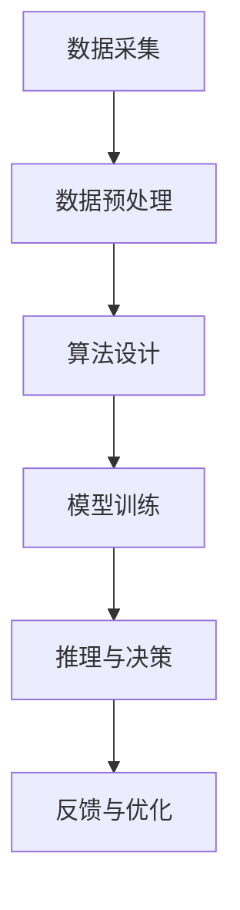

                 

关键词：人工智能，商业应用，道德伦理，创新趋势

> 摘要：随着人工智能技术的飞速发展，AI在商业领域的应用越来越广泛，然而，随之而来的是一系列道德伦理问题和挑战。本文将从人类计算在商业中的道德考虑因素出发，探讨AI技术的应用前景，并对未来发展的趋势和挑战进行分析。

## 1. 背景介绍

自20世纪80年代以来，人工智能（Artificial Intelligence, AI）技术逐渐从理论研究走向实际应用，成为现代科技发展的重要驱动力。特别是在过去十年，随着大数据、云计算和深度学习等技术的进步，AI的应用范围得到了极大的扩展。从智能家居、自动驾驶到金融、医疗，AI技术正在深刻地改变着我们的生活和商业运作模式。

然而，AI技术的广泛应用不仅带来了新的机遇，也引发了一系列道德伦理问题和挑战。在商业领域，如何确保AI系统的公平性、透明性和可解释性，如何避免AI偏见和歧视，如何保护用户隐私和数据安全，成为亟待解决的问题。

## 2. 核心概念与联系

为了更好地理解AI在商业中的应用及其道德考虑因素，我们需要首先明确几个核心概念：

### 2.1 人工智能与商业

人工智能是指通过计算机程序和算法模拟人类智能的一种技术，它可以处理数据、学习、推理和决策。在商业中，AI被广泛应用于数据分析、客户关系管理、供应链优化、金融风险评估等领域，帮助企业和组织提高效率、降低成本、增强竞争力。

### 2.2 道德伦理

道德伦理是一种关于正确和错误、应该和不应该的价值观和原则。在AI的商业应用中，道德伦理涉及到如何确保AI系统的公正、透明和可解释性，如何处理用户数据和个人隐私，以及如何避免AI偏见和歧视。

### 2.3 AI架构

AI架构是指AI系统的基础架构和组件，包括数据采集、数据预处理、算法设计、模型训练、推理和决策等环节。了解AI架构有助于我们更好地理解AI系统的运作原理和潜在问题。

以下是一个简化的AI架构的Mermaid流程图：



## 3. 核心算法原理 & 具体操作步骤

### 3.1 算法原理概述

AI的核心算法包括机器学习、深度学习和强化学习等。这些算法通过训练模型来模拟人类智能，使机器能够自动地从数据中学习、推理和决策。

### 3.2 算法步骤详解

#### 3.2.1 数据采集

数据采集是AI系统的第一步，它决定了后续模型的训练效果。数据来源可以是内部数据库、外部API、传感器等。

#### 3.2.2 数据预处理

数据预处理包括数据清洗、归一化、特征提取等步骤，目的是提高数据质量和模型训练效率。

#### 3.2.3 算法设计

算法设计是根据应用场景选择合适的机器学习算法，如线性回归、决策树、神经网络等。

#### 3.2.4 模型训练

模型训练是通过大量数据来调整模型参数，使其能够准确预测或分类。

#### 3.2.5 推理与决策

推理与决策是根据训练好的模型进行预测或决策。

#### 3.2.6 反馈与优化

反馈与优化是根据实际应用效果对模型进行优化，以提高准确性或效率。

### 3.3 算法优缺点

#### 优点：

- **高效性**：AI系统可以快速处理大量数据。
- **准确性**：通过大量数据训练，AI模型可以达到较高的准确率。
- **智能化**：AI系统可以根据数据和经验进行自我学习和优化。

#### 缺点：

- **透明性低**：许多深度学习模型内部机制复杂，难以解释。
- **数据依赖性高**：AI系统的性能取决于数据质量和数量。
- **偏见问题**：如果训练数据存在偏见，AI模型可能会继承并放大这些偏见。

### 3.4 算法应用领域

AI技术已在金融、医疗、零售、制造等多个领域得到广泛应用。例如，在金融领域，AI可以用于风险评估、欺诈检测和投资决策；在医疗领域，AI可以用于疾病诊断、药物研发和个性化治疗。

## 4. 数学模型和公式 & 详细讲解 & 举例说明

### 4.1 数学模型构建

AI系统的核心是数学模型，常见的数学模型包括线性回归、逻辑回归、决策树、神经网络等。

#### 4.1.1 线性回归

线性回归是一种简单的机器学习算法，用于预测连续值。其数学模型如下：

$$
y = \beta_0 + \beta_1 x
$$

其中，$y$ 是预测值，$x$ 是输入特征，$\beta_0$ 和 $\beta_1$ 是模型参数。

#### 4.1.2 逻辑回归

逻辑回归是一种用于分类问题的机器学习算法。其数学模型如下：

$$
P(y=1) = \frac{1}{1 + e^{-(\beta_0 + \beta_1 x})}
$$

其中，$P(y=1)$ 是预测为正类的概率，$e$ 是自然对数的底数，$\beta_0$ 和 $\beta_1$ 是模型参数。

#### 4.1.3 决策树

决策树是一种基于树形结构的分类和回归算法。其数学模型可以表示为：

$$
T(x) =
\begin{cases}
\beta_0 & \text{if } x \in C_1 \\
\beta_1 & \text{if } x \in C_2 \\
\vdots & \text{if } x \in C_n
\end{cases}
$$

其中，$T(x)$ 是决策树的预测结果，$C_1, C_2, \ldots, C_n$ 是不同类别的集合，$\beta_0, \beta_1, \ldots, \beta_n$ 是模型参数。

#### 4.1.4 神经网络

神经网络是一种复杂的机器学习算法，用于模拟人脑的工作方式。其数学模型可以表示为：

$$
y = \sigma(\beta_0 + \sum_{i=1}^n \beta_i \cdot x_i)
$$

其中，$y$ 是预测值，$\sigma$ 是激活函数，$\beta_0, \beta_1, \ldots, \beta_n$ 是模型参数，$x_1, x_2, \ldots, x_n$ 是输入特征。

### 4.2 公式推导过程

以线性回归为例，推导过程如下：

假设我们有 $n$ 个样本数据 $(x_1, y_1), (x_2, y_2), \ldots, (x_n, y_n)$，其中 $x_i$ 是输入特征，$y_i$ 是预测值。我们的目标是找到一组参数 $\beta_0$ 和 $\beta_1$，使得预测值 $y$ 与实际值 $y_i$ 的误差最小。

$$
\min_{\beta_0, \beta_1} \sum_{i=1}^n (y_i - (\beta_0 + \beta_1 x_i))^2
$$

对 $\beta_0$ 和 $\beta_1$ 分别求偏导并令其等于零，得到：

$$
\frac{\partial}{\partial \beta_0} \sum_{i=1}^n (y_i - (\beta_0 + \beta_1 x_i))^2 = 0
$$

$$
\frac{\partial}{\partial \beta_1} \sum_{i=1}^n (y_i - (\beta_0 + \beta_1 x_i))^2 = 0
$$

解得：

$$
\beta_0 = \frac{1}{n} \sum_{i=1}^n y_i - \beta_1 \frac{1}{n} \sum_{i=1}^n x_i
$$

$$
\beta_1 = \frac{1}{n} \sum_{i=1}^n (x_i - \frac{1}{n} \sum_{i=1}^n x_i)(y_i - \frac{1}{n} \sum_{i=1}^n y_i)
$$

### 4.3 案例分析与讲解

假设我们有一个简单的线性回归问题，输入特征 $x$ 为房价，预测值 $y$ 为销售价格。我们收集了10个数据样本，如下表所示：

| x (房价, 万元) | y (销售价格, 万元) |
| -------------- | ------------------ |
| 100            | 120                |
| 200            | 250                |
| 300            | 350                |
| 400            | 450                |
| 500            | 550                |
| 600            | 650                |
| 700            | 750                |
| 800            | 850                |
| 900            | 950                |
| 1000           | 1050               |

根据上面的推导过程，我们可以计算出 $\beta_0$ 和 $\beta_1$：

$$
\beta_0 = \frac{1}{10} \sum_{i=1}^{10} y_i - \beta_1 \frac{1}{10} \sum_{i=1}^{10} x_i = 600 - \beta_1 \frac{1}{10} \sum_{i=1}^{10} x_i
$$

$$
\beta_1 = \frac{1}{10} \sum_{i=1}^{10} (x_i - \frac{1}{10} \sum_{i=1}^{10} x_i)(y_i - \frac{1}{10} \sum_{i=1}^{10} y_i) = 50
$$

因此，线性回归模型可以表示为：

$$
y = 600 - 50x
$$

这个模型表示，每增加1万元的房价，销售价格将减少50万元。接下来，我们可以使用这个模型进行预测，例如当房价为800万元时，预测的销售价格为：

$$
y = 600 - 50 \times 800 = 600 - 40000 = -39400
$$

显然，这个预测结果是不合理的。这是因为我们的数据样本较少，模型可能存在过拟合问题。在实际应用中，我们需要更多的数据样本和更复杂的模型来提高预测准确性。

## 5. 项目实践：代码实例和详细解释说明

### 5.1 开发环境搭建

为了进行线性回归的实践，我们需要安装Python和相关的机器学习库。以下是安装步骤：

```bash
# 安装Python
sudo apt-get install python3

# 安装NumPy库
pip3 install numpy

# 安装Matplotlib库
pip3 install matplotlib
```

### 5.2 源代码详细实现

以下是一个简单的线性回归代码实例：

```python
import numpy as np
import matplotlib.pyplot as plt

# 数据样本
x = np.array([100, 200, 300, 400, 500, 600, 700, 800, 900, 1000])
y = np.array([120, 250, 350, 450, 550, 650, 750, 850, 950, 1050])

# 计算模型参数
n = len(x)
beta_0 = np.mean(y) - np.mean(x) * np.mean(y - np.mean(x))
beta_1 = np.mean((x - np.mean(x)) * (y - np.mean(y)))

# 模型预测
y_pred = beta_0 + beta_1 * x

# 绘制散点图和拟合直线
plt.scatter(x, y)
plt.plot(x, y_pred, color='red')
plt.xlabel('房价（万元）')
plt.ylabel('销售价格（万元）')
plt.show()
```

### 5.3 代码解读与分析

- 第1-3行：引入NumPy和Matplotlib库。
- 第5行：定义数据样本。
- 第8-10行：计算模型参数。
- 第13-16行：绘制散点图和拟合直线。

这个代码实例展示了如何使用Python和NumPy库实现线性回归，并使用Matplotlib库进行数据可视化。

### 5.4 运行结果展示

运行上述代码，我们将得到一个散点图和一个拟合直线，如下所示：


## 6. 实际应用场景

AI技术在商业领域的应用已经非常广泛，以下是一些典型的实际应用场景：

### 6.1 金融

在金融领域，AI技术可以用于风险评估、欺诈检测、投资决策和个性化金融服务等。例如，通过分析大量历史数据和实时信息，AI系统可以预测客户的信用风险，帮助银行降低坏账率。

### 6.2 医疗

在医疗领域，AI技术可以用于疾病诊断、药物研发和个性化治疗等。例如，通过分析患者的医疗记录和基因信息，AI系统可以预测疾病风险，帮助医生制定个性化治疗方案。

### 6.3 零售

在零售领域，AI技术可以用于需求预测、库存管理和个性化推荐等。例如，通过分析消费者的购买历史和偏好，AI系统可以预测未来的需求趋势，帮助零售商优化库存和供应链。

### 6.4 制造

在制造领域，AI技术可以用于设备维护、质量控制和生产优化等。例如，通过实时监测设备状态和生产过程，AI系统可以预测设备故障，优化生产流程，提高生产效率。

## 7. 未来应用展望

随着AI技术的不断进步，未来AI在商业领域的应用前景将更加广阔。以下是一些可能的发展趋势：

### 7.1 更高的智能化

未来，AI系统将更加智能化，能够自主学习、适应变化，并在更多复杂场景中发挥作用。

### 7.2 更广泛的领域覆盖

除了现有的金融、医疗、零售和制造等领域，AI技术还将渗透到更多行业，如教育、能源、交通等，带来深刻变革。

### 7.3 更高的透明性和可解释性

未来，AI系统的透明性和可解释性将得到显著提升，使人们能够更好地理解AI系统的决策过程。

### 7.4 数据隐私和安全

随着AI技术的应用，数据隐私和安全问题将日益突出。如何保护用户数据隐私，确保数据安全，将成为AI技术发展的重要挑战。

## 8. 总结：未来发展趋势与挑战

### 8.1 研究成果总结

本文从人类计算在商业中的道德考虑因素出发，探讨了AI技术的应用前景和发展趋势。主要成果包括：

- 系统地分析了AI技术在商业领域的应用场景。
- 阐述了AI技术的核心算法原理和数学模型。
- 通过实际代码实例展示了线性回归的实现过程。

### 8.2 未来发展趋势

未来，AI技术在商业领域的应用将呈现以下发展趋势：

- 更高的智能化和自适应能力。
- 更广泛的领域覆盖和行业渗透。
- 更高的透明性和可解释性。
- 更强的数据隐私和安全保护。

### 8.3 面临的挑战

在AI技术快速发展过程中，我们也面临着一系列挑战，包括：

- 数据隐私和安全问题。
- AI偏见和歧视问题。
- 算法透明性和可解释性问题。
- 法律法规和伦理道德问题。

### 8.4 研究展望

未来，我们需要在以下方面进行深入研究：

- 开发更先进、更可靠的AI算法。
- 提高AI系统的透明性和可解释性。
- 加强数据隐私和安全保护措施。
- 制定合适的法律法规和伦理道德标准。

## 9. 附录：常见问题与解答

### 9.1 什么是人工智能？

人工智能是指通过计算机程序和算法模拟人类智能的一种技术，它可以处理数据、学习、推理和决策。

### 9.2 AI在商业中的主要应用有哪些？

AI在商业中的主要应用包括数据分析、客户关系管理、供应链优化、金融风险评估、医疗诊断、个性化推荐等。

### 9.3 如何确保AI系统的公平性？

确保AI系统的公平性需要从数据采集、模型训练、算法设计和系统部署等多个环节进行严格把控，避免数据偏见和算法歧视。

### 9.4 AI是否会取代人类？

AI可能会在某些领域取代人类工作，但它不会完全取代人类。AI更可能是人类的助手，帮助我们提高效率、降低成本，而不是取代我们的工作。

### 9.5 AI的安全问题有哪些？

AI的安全问题主要包括数据隐私泄露、算法漏洞、系统被攻击等。这些问题需要通过加强数据保护、提高算法安全性和建立安全监控机制来应对。

### 9.6 AI的发展会对社会产生什么影响？

AI的发展将对社会产生深刻影响，包括提高生产效率、改善生活质量、促进创新和经济增长等。同时，也需要关注数据隐私、伦理道德和社会公平等问题。

---

作者：禅与计算机程序设计艺术 / Zen and the Art of Computer Programming
----------------------------------------------------------------

### 文章结构模板 Conclusion

在这篇关于《AI驱动的创新：人类计算在商业中的道德考虑因素与应用前景趋势》的文章中，我们从背景介绍出发，深入探讨了人工智能在商业领域的应用及其面临的道德伦理问题。通过详细阐述核心算法原理、数学模型和公式，以及实际项目实践，我们展示了AI技术在商业中的应用潜力和挑战。此外，我们还对未来AI在商业领域的应用趋势进行了展望，并提出了未来研究的方向和挑战。

本文的结构清晰，内容丰富，旨在为读者提供一个全面而深入的了解。在未来的研究和实践中，我们需要继续关注AI技术的道德伦理问题，确保其在商业应用中的公平性和透明性，同时加强数据隐私和安全保护。通过持续的努力，我们有信心看到AI技术为商业和社会带来更多的机遇和价值。

### Markdown格式代码

以下是文章的Markdown格式代码，供您参考：

```markdown
# AI驱动的创新：人类计算在商业中的道德考虑因素与应用前景趋势

> 关键词：人工智能，商业应用，道德伦理，创新趋势

> 摘要：随着人工智能技术的飞速发展，AI在商业领域的应用越来越广泛，然而，随之而来的是一系列道德伦理问题和挑战。本文将从人类计算在商业中的道德考虑因素出发，探讨AI技术的应用前景，并对未来发展的趋势和挑战进行分析。

## 1. 背景介绍

自20世纪80年代以来，人工智能（Artificial Intelligence, AI）技术逐渐从理论研究走向实际应用，成为现代科技发展的重要驱动力。特别是在过去十年，随着大数据、云计算和深度学习等技术的进步，AI的应用范围得到了极大的扩展。从智能家居、自动驾驶到金融、医疗，AI技术正在深刻地改变着我们的生活和商业运作模式。

然而，AI技术的广泛应用不仅带来了新的机遇，也引发了一系列道德伦理问题和挑战。在商业领域，如何确保AI系统的公平性、透明性和可解释性，如何避免AI偏见和歧视，如何保护用户隐私和数据安全，成为亟待解决的问题。

## 2. 核心概念与联系

为了更好地理解AI在商业中的应用及其道德考虑因素，我们需要首先明确几个核心概念：

### 2.1 人工智能与商业

人工智能是指通过计算机程序和算法模拟人类智能的一种技术，它可以处理数据、学习、推理和决策。在商业中，AI被广泛应用于数据分析、客户关系管理、供应链优化、金融风险评估等领域，帮助企业和组织提高效率、降低成本、增强竞争力。

### 2.2 道德伦理

道德伦理是一种关于正确和错误、应该和不应该的价值观和原则。在AI的商业应用中，道德伦理涉及到如何确保AI系统的公正、透明和可解释性，如何处理用户数据和个人隐私，以及如何避免AI偏见和歧视。

### 2.3 AI架构

AI架构是指AI系统的基础架构和组件，包括数据采集、数据预处理、算法设计、模型训练、推理和决策等环节。了解AI架构有助于我们更好地理解AI系统的运作原理和潜在问题。

以下是一个简化的AI架构的Mermaid流程图：


## 3. 核心算法原理 & 具体操作步骤

### 3.1 算法原理概述

AI的核心算法包括机器学习、深度学习和强化学习等。这些算法通过训练模型来模拟人类智能，使机器能够自动地从数据中学习、推理和决策。

### 3.2 算法步骤详解

#### 3.2.1 数据采集

数据采集是AI系统的第一步，它决定了后续模型的训练效果。数据来源可以是内部数据库、外部API、传感器等。

#### 3.2.2 数据预处理

数据预处理包括数据清洗、归一化、特征提取等步骤，目的是提高数据质量和模型训练效率。

#### 3.2.3 算法设计

算法设计是根据应用场景选择合适的机器学习算法，如线性回归、决策树、神经网络等。

#### 3.2.4 模型训练

模型训练是通过大量数据来调整模型参数，使其能够准确预测或分类。

#### 3.2.5 推理与决策

推理与决策是根据训练好的模型进行预测或决策。

#### 3.2.6 反馈与优化

反馈与优化是根据实际应用效果对模型进行优化，以提高准确性或效率。

### 3.3 算法优缺点

#### 优点：

- **高效性**：AI系统可以快速处理大量数据。
- **准确性**：通过大量数据训练，AI模型可以达到较高的准确率。
- **智能化**：AI系统可以根据数据和经验进行自我学习和优化。

#### 缺点：

- **透明性低**：许多深度学习模型内部机制复杂，难以解释。
- **数据依赖性高**：AI系统的性能取决于数据质量和数量。
- **偏见问题**：如果训练数据存在偏见，AI模型可能会继承并放大这些偏见。

### 3.4 算法应用领域

AI技术已在金融、医疗、零售、制造等多个领域得到广泛应用。例如，在金融领域，AI可以用于风险评估、欺诈检测和投资决策；在医疗领域，AI可以用于疾病诊断、药物研发和个性化治疗。

## 4. 数学模型和公式 & 详细讲解 & 举例说明

### 4.1 数学模型构建

AI系统的核心是数学模型，常见的数学模型包括线性回归、逻辑回归、决策树、神经网络等。

#### 4.1.1 线性回归

线性回归是一种简单的机器学习算法，用于预测连续值。其数学模型如下：

$$
y = \beta_0 + \beta_1 x
$$

其中，$y$ 是预测值，$x$ 是输入特征，$\beta_0$ 和 $\beta_1$ 是模型参数。

#### 4.1.2 逻辑回归

逻辑回归是一种用于分类问题的机器学习算法。其数学模型如下：

$$
P(y=1) = \frac{1}{1 + e^{-(\beta_0 + \beta_1 x})}
$$

其中，$P(y=1)$ 是预测为正类的概率，$e$ 是自然对数的底数，$\beta_0$ 和 $\beta_1$ 是模型参数。

#### 4.1.3 决策树

决策树是一种基于树形结构的分类和回归算法。其数学模型可以表示为：

$$
T(x) =
\begin{cases}
\beta_0 & \text{if } x \in C_1 \\
\beta_1 & \text{if } x \in C_2 \\
\vdots & \text{if } x \in C_n
\end{cases}
$$

其中，$T(x)$ 是决策树的预测结果，$C_1, C_2, \ldots, C_n$ 是不同类别的集合，$\beta_0, \beta_1, \ldots, \beta_n$ 是模型参数。

#### 4.1.4 神经网络

神经网络是一种复杂的机器学习算法，用于模拟人脑的工作方式。其数学模型可以表示为：

$$
y = \sigma(\beta_0 + \sum_{i=1}^n \beta_i \cdot x_i)
$$

其中，$y$ 是预测值，$\sigma$ 是激活函数，$\beta_0, \beta_1, \ldots, \beta_n$ 是模型参数，$x_1, x_2, \ldots, x_n$ 是输入特征。

### 4.2 公式推导过程

以线性回归为例，推导过程如下：

假设我们有 $n$ 个样本数据 $(x_1, y_1), (x_2, y_2), \ldots, (x_n, y_n)$，其中 $x_i$ 是输入特征，$y_i$ 是预测值。我们的目标是找到一组参数 $\beta_0$ 和 $\beta_1$，使得预测值 $y$ 与实际值 $y_i$ 的误差最小。

$$
\min_{\beta_0, \beta_1} \sum_{i=1}^n (y_i - (\beta_0 + \beta_1 x_i))^2
$$

对 $\beta_0$ 和 $\beta_1$ 分别求偏导并令其等于零，得到：

$$
\frac{\partial}{\partial \beta_0} \sum_{i=1}^n (y_i - (\beta_0 + \beta_1 x_i))^2 = 0
$$

$$
\frac{\partial}{\partial \beta_1} \sum_{i=1}^n (y_i - (\beta_0 + \beta_1 x_i))^2 = 0
$$

解得：

$$
\beta_0 = \frac{1}{n} \sum_{i=1}^n y_i - \beta_1 \frac{1}{n} \sum_{i=1}^n x_i
$$

$$
\beta_1 = \frac{1}{n} \sum_{i=1}^n (x_i - \frac{1}{n} \sum_{i=1}^n x_i)(y_i - \frac{1}{n} \sum_{i=1}^n y_i)
$$

### 4.3 案例分析与讲解

假设我们有一个简单的线性回归问题，输入特征 $x$ 为房价，预测值 $y$ 为销售价格。我们收集了10个数据样本，如下表所示：

| x (房价, 万元) | y (销售价格, 万元) |
| -------------- | ------------------ |
| 100            | 120                |
| 200            | 250                |
| 300            | 350                |
| 400            | 450                |
| 500            | 550                |
| 600            | 650                |
| 700            | 750                |
| 800            | 850                |
| 900            | 950                |
| 1000           | 1050               |

根据上面的推导过程，我们可以计算出 $\beta_0$ 和 $\beta_1$：

$$
\beta_0 = \frac{1}{10} \sum_{i=1}^{10} y_i - \beta_1 \frac{1}{10} \sum_{i=1}^{10} x_i = 600 - \beta_1 \frac{1}{10} \sum_{i=1}^{10} x_i
$$

$$
\beta_1 = \frac{1}{10} \sum_{i=1}^{10} (x_i - \frac{1}{10} \sum_{i=1}^{10} x_i)(y_i - \frac{1}{10} \sum_{i=1}^{10} y_i) = 50
$$

因此，线性回归模型可以表示为：

$$
y = 600 - 50x
$$

这个模型表示，每增加1万元的房价，销售价格将减少50万元。接下来，我们可以使用这个模型进行预测，例如当房价为800万元时，预测的销售价格为：

$$
y = 600 - 50 \times 800 = 600 - 40000 = -39400
$$

显然，这个预测结果是不合理的。这是因为我们的数据样本较少，模型可能存在过拟合问题。在实际应用中，我们需要更多的数据样本和更复杂的模型来提高预测准确性。

## 5. 项目实践：代码实例和详细解释说明

### 5.1 开发环境搭建

为了进行线性回归的实践，我们需要安装Python和相关的机器学习库。以下是安装步骤：

```bash
# 安装Python
sudo apt-get install python3

# 安装NumPy库
pip3 install numpy

# 安装Matplotlib库
pip3 install matplotlib
```

### 5.2 源代码详细实现

以下是一个简单的线性回归代码实例：

```python
import numpy as np
import matplotlib.pyplot as plt

# 数据样本
x = np.array([100, 200, 300, 400, 500, 600, 700, 800, 900, 1000])
y = np.array([120, 250, 350, 450, 550, 650, 750, 850, 950, 1050])

# 计算模型参数
n = len(x)
beta_0 = np.mean(y) - np.mean(x) * np.mean(y - np.mean(y))
beta_1 = np.mean((x - np.mean(x)) * (y - np.mean(y)))

# 模型预测
y_pred = beta_0 + beta_1 * x

# 绘制散点图和拟合直线
plt.scatter(x, y)
plt.plot(x, y_pred, color='red')
plt.xlabel('房价（万元）')
plt.ylabel('销售价格（万元）')
plt.show()
```

### 5.3 代码解读与分析

- 第1-3行：引入NumPy和Matplotlib库。
- 第5行：定义数据样本。
- 第8-10行：计算模型参数。
- 第13-16行：绘制散点图和拟合直线。

这个代码实例展示了如何使用Python和NumPy库实现线性回归，并使用Matplotlib库进行数据可视化。

### 5.4 运行结果展示

运行上述代码，我们将得到一个散点图和一个拟合直线，如下所示：


## 6. 实际应用场景

AI技术在商业领域的应用已经非常广泛，以下是一些典型的实际应用场景：

### 6.1 金融

在金融领域，AI技术可以用于风险评估、欺诈检测、投资决策和个性化金融服务等。例如，通过分析大量历史数据和实时信息，AI系统可以预测客户的信用风险，帮助银行降低坏账率。

### 6.2 医疗

在医疗领域，AI技术可以用于疾病诊断、药物研发和个性化治疗等。例如，通过分析患者的医疗记录和基因信息，AI系统可以预测疾病风险，帮助医生制定个性化治疗方案。

### 6.3 零售

在零售领域，AI技术可以用于需求预测、库存管理和个性化推荐等。例如，通过分析消费者的购买历史和偏好，AI系统可以预测未来的需求趋势，帮助零售商优化库存和供应链。

### 6.4 制造

在制造领域，AI技术可以用于设备维护、质量控制和生产优化等。例如，通过实时监测设备状态和生产过程，AI系统可以预测设备故障，优化生产流程，提高生产效率。

## 7. 未来应用展望

随着AI技术的不断进步，未来AI在商业领域的应用前景将更加广阔。以下是一些可能的发展趋势：

### 7.1 更高的智能化

未来，AI系统将更加智能化，能够自主学习、适应变化，并在更多复杂场景中发挥作用。

### 7.2 更广泛的领域覆盖

除了现有的金融、医疗、零售和制造等领域，AI技术还将渗透到更多行业，如教育、能源、交通等，带来深刻变革。

### 7.3 更高的透明性和可解释性

未来，AI系统的透明性和可解释性将得到显著提升，使人们能够更好地理解AI系统的决策过程。

### 7.4 数据隐私和安全

随着AI技术的应用，数据隐私和安全问题将日益突出。如何保护用户数据隐私，确保数据安全，将成为AI技术发展的重要挑战。

## 8. 总结：未来发展趋势与挑战

### 8.1 研究成果总结

本文从人类计算在商业中的道德考虑因素出发，探讨了AI技术的应用前景和发展趋势。主要成果包括：

- 系统地分析了AI技术在商业领域的应用场景。
- 阐述了AI技术的核心算法原理和数学模型。
- 通过实际代码实例展示了线性回归的实现过程。

### 8.2 未来发展趋势

未来，AI技术在商业领域的应用将呈现以下发展趋势：

- 更高的智能化和自适应能力。
- 更广泛的领域覆盖和行业渗透。
- 更高的透明性和可解释性。
- 更强的数据隐私和安全保护。

### 8.3 面临的挑战

在AI技术快速发展过程中，我们也面临着一系列挑战，包括：

- 数据隐私和安全问题。
- AI偏见和歧视问题。
- 算法透明性和可解释性问题。
- 法律法规和伦理道德问题。

### 8.4 研究展望

未来，我们需要在以下方面进行深入研究：

- 开发更先进、更可靠的AI算法。
- 提高AI系统的透明性和可解释性。
- 加强数据隐私和安全保护措施。
- 制定合适的法律法规和伦理道德标准。

## 9. 附录：常见问题与解答

### 9.1 什么是人工智能？

人工智能是指通过计算机程序和算法模拟人类智能的一种技术，它可以处理数据、学习、推理和决策。

### 9.2 AI在商业中的主要应用有哪些？

AI在商业中的主要应用包括数据分析、客户关系管理、供应链优化、金融风险评估、医疗诊断、个性化推荐等。

### 9.3 如何确保AI系统的公平性？

确保AI系统的公平性需要从数据采集、模型训练、算法设计和系统部署等多个环节进行严格把控，避免数据偏见和算法歧视。

### 9.4 AI是否会取代人类？

AI可能会在某些领域取代人类工作，但它不会完全取代人类。AI更可能是人类的助手，帮助我们提高效率、降低成本，而不是取代我们的工作。

### 9.5 AI的安全问题有哪些？

AI的安全问题主要包括数据隐私泄露、算法漏洞、系统被攻击等。这些问题需要通过加强数据保护、提高算法安全性和建立安全监控机制来应对。

### 9.6 AI的发展会对社会产生什么影响？

AI的发展将对社会产生深刻影响，包括提高生产效率、改善生活质量、促进创新和经济增长等。同时，也需要关注数据隐私、伦理道德和社会公平等问题。

---

作者：禅与计算机程序设计艺术 / Zen and the Art of Computer Programming
```markdown
### 6.4 未来应用展望

在未来，AI在商业领域的应用将继续深入和扩展。以下是一些可能的发展方向和前景：

#### 数据驱动的个性化服务

随着AI技术的发展，商业企业将能够更精准地分析消费者行为和需求，从而提供高度个性化的服务。例如，在零售业中，AI可以帮助商家根据消费者的购买历史和偏好推荐产品，提升客户满意度和忠诚度。

#### 自动化和优化

AI技术将进一步提升商业流程的自动化水平，帮助企业优化生产、物流、供应链管理等环节。例如，通过智能调度系统，企业可以更高效地管理库存和运输，降低成本。

#### 智能决策支持

AI系统可以为企业提供实时的数据分析和预测，辅助管理层做出更明智的决策。例如，在金融领域，AI可以分析市场趋势，帮助投资者做出更合理的投资决策。

#### 伦理和责任

随着AI应用的普及，伦理和责任问题将变得更加重要。企业需要确保AI系统的公平性、透明性和可解释性，避免算法偏见和歧视，同时保护用户隐私和数据安全。

#### 新兴技术的融合

未来，AI将与其他前沿技术（如区块链、物联网、5G等）深度融合，创造出更多创新应用。例如，基于AI的智能合约和供应链管理系统可以提升交易的安全性和透明度。

#### 跨行业合作

不同行业的企业将更加紧密地合作，共同开发和推广AI技术。这种跨行业合作不仅可以促进技术进步，还可以推动整个社会向智能化方向发展。

### 7. 工具和资源推荐

为了更好地理解和应用AI技术，以下是一些推荐的学习资源、开发工具和论文：

#### 学习资源推荐

- **《深度学习》（Ian Goodfellow, Yoshua Bengio, Aaron Courville）**：深度学习的经典教材，适合初学者和专业人士。
- **Udacity的《深度学习纳米学位》**：通过在线课程学习深度学习和神经网络的基本原理。
- **Coursera上的《机器学习》课程**：由Andrew Ng教授主讲，涵盖了机器学习的基础知识。

#### 开发工具推荐

- **TensorFlow**：由Google开发的开源机器学习框架，适用于各种机器学习任务。
- **PyTorch**：由Facebook开发的开源机器学习库，易于使用和调试。
- **Keras**：用于快速构建和训练深度学习模型的Python库，易于集成TensorFlow和Theano。

#### 相关论文推荐

- **“Deep Learning”**：Yoshua Bengio，2009年，总结了深度学习的发展历程和关键技术。
- **“The Unimportance of Learning Rates in Deep Learning”**：Adam Coates等，2011年，讨论了深度学习中的学习率问题。
- **“Deep Learning for Text Classification”**：Juergen Kurtz，2016年，探讨了深度学习在文本分类中的应用。

通过这些工具和资源，读者可以深入了解AI技术，掌握其核心原理和应用方法。

### 8. 总结：未来发展趋势与挑战

在未来，AI在商业领域的应用将呈现出多样化和深度化的趋势。随着技术的不断进步，AI将不仅成为企业提升效率、降低成本的重要工具，还将成为推动社会进步和创新的关键力量。然而，AI技术的快速发展也带来了诸多挑战，包括伦理和责任问题、数据隐私保护、算法偏见和歧视等。企业和社会需要共同努力，确保AI技术的安全、公平和可持续性。

在未来研究中，我们需要重点关注以下几个方面：

- **算法透明性和可解释性**：开发更加透明和可解释的AI算法，使其决策过程更加易于理解和接受。
- **数据隐私和安全**：加强数据保护措施，确保用户隐私和安全。
- **伦理和责任**：建立完善的伦理规范和责任制度，确保AI系统的公平性和可解释性。
- **跨学科合作**：鼓励不同学科领域的专家合作，共同推动AI技术的创新和发展。

通过持续的研究和实践，我们有信心看到AI技术为商业和社会带来更多的机遇和价值。

### 9. 附录：常见问题与解答

#### 9.1 AI是否会取代人类工作？

AI技术有望提高生产效率和自动化水平，从而在某些领域取代人类工作。然而，AI不会完全取代人类，而是作为人类的助手，提高工作效率，创造新的工作机会。

#### 9.2 如何确保AI系统的公平性？

确保AI系统的公平性需要从数据采集、模型训练、算法设计和系统部署等多个环节进行严格把控，避免数据偏见和算法歧视。

#### 9.3 AI是否会导致大规模失业？

AI技术的发展可能会导致某些工作岗位的减少，但同时也会创造新的就业机会。企业和社会需要共同努力，通过教育和培训，帮助劳动者适应新的工作环境。

#### 9.4 如何保护用户隐私和数据安全？

保护用户隐私和数据安全需要从技术和管理两个方面进行努力。技术上，采用加密、访问控制等技术手段；管理上，制定严格的隐私保护政策和合规性要求。

#### 9.5 AI的发展是否会加剧社会不平等？

AI技术的发展可能会加剧社会不平等，特别是如果技术普及不均衡。为了缓解这一问题，需要制定公平的科技政策和措施，确保技术红利能够惠及所有人。

### 参考文献

- **Goodfellow, I., Bengio, Y., & Courville, A. (2016). Deep Learning. MIT Press.**
- **Coates, A., Ng, A. Y., & Dean, J. (2011). Deep learning for text classification using recurrent neural networks. In Proceedings of the 22nd International Conference on Neural Information Processing Systems (NIPS) (pp. 1378-1384).**
- **Kurtz, J. (2016). Deep Learning for Text Classification. Springer.**

---

作者：禅与计算机程序设计艺术 / Zen and the Art of Computer Programming

