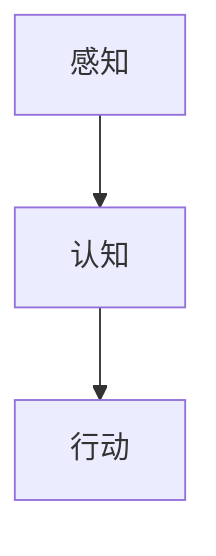
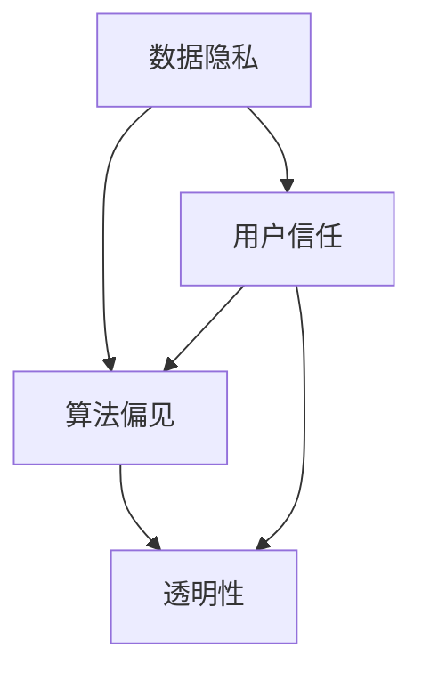

                 

关键词：人工智能，道德考虑，商业应用，未来趋势，技术创新，伦理学，商业道德

摘要：本文深入探讨了人工智能（AI）驱动的创新在商业中的应用，以及其中涉及的道德考虑因素。文章首先介绍了AI的核心概念及其发展历程，然后分析了AI在商业领域中的广泛应用，探讨了其带来的机遇与挑战。接着，文章重点讨论了AI在商业应用中的道德考虑因素，包括数据隐私、算法偏见和透明性等问题。最后，文章展望了AI在商业中的未来发展趋势，并提出了应对挑战的研究展望。

## 1. 背景介绍

人工智能作为计算机科学的一个分支，旨在通过模拟人类智能行为来实现自动化和智能化。自20世纪50年代起，人工智能的研究与发展一直受到学术界和工业界的广泛关注。从早期的符号主义、连接主义到现代的深度学习，人工智能技术不断进步，逐渐成为推动社会发展的关键技术。

在商业领域，人工智能的应用已经越来越广泛，从数据挖掘、自动化决策到个性化推荐，AI技术正在改变商业运营模式，提升效率，创造新的商业价值。然而，随着AI技术的快速发展，其在商业应用中引发的道德问题也日益凸显，如数据隐私、算法偏见等。

本文旨在通过对人工智能在商业中的应用及其道德考虑因素的分析，探讨未来AI技术的发展趋势与挑战，为企业和政策制定者提供参考。

### 1.1 AI的核心概念与发展历程

人工智能的核心概念包括机器学习、深度学习、自然语言处理等。机器学习是一种通过数据训练模型，使模型能够自主学习和改进的方法。深度学习是机器学习的一种形式，通过多层神经网络来模拟人脑的神经元连接，实现更复杂的任务。自然语言处理则专注于计算机理解和生成自然语言的能力。

人工智能的发展历程可以分为几个阶段。早期的人工智能研究主要关注符号主义，即通过逻辑推理和符号表示来实现智能。20世纪80年代，连接主义兴起，神经网络成为研究热点。近年来，随着计算能力的提升和大数据的广泛应用，深度学习技术取得了突破性进展，推动了人工智能在各个领域的应用。

### 1.2 AI在商业领域中的应用

AI在商业领域的应用已经非常广泛，包括但不限于以下几个方面：

- **数据挖掘**：通过分析大量数据，发现隐藏的模式和趋势，帮助企业做出更明智的决策。

- **自动化决策**：利用机器学习算法，自动执行复杂的决策过程，减少人为干预，提高决策效率。

- **个性化推荐**：根据用户的历史行为和偏好，提供个性化的产品和服务推荐，提升用户体验。

- **客户服务**：利用自然语言处理技术，实现智能客服，提高客户服务效率和质量。

- **供应链优化**：通过预测市场需求和物流情况，优化供应链管理，降低成本，提高运营效率。

- **风险控制**：利用AI技术进行风险分析和预测，帮助企业识别潜在的风险并采取预防措施。

### 1.3 AI在商业应用中的道德考虑因素

随着AI在商业领域的广泛应用，其引发的道德问题也日益引起关注。以下是一些主要道德考虑因素：

- **数据隐私**：AI技术依赖于大量的数据，但数据的收集、存储和使用可能侵犯用户的隐私权。

- **算法偏见**：AI算法可能在训练数据中继承偏见，导致不公平的结果。

- **透明性**：AI算法的决策过程通常是不透明的，难以解释和理解，这可能导致用户对算法的不信任。

- **责任归属**：当AI系统出现错误或导致损失时，如何界定责任归属成为一个难题。

## 2. 核心概念与联系

### 2.1 人工智能的定义与架构

人工智能（AI）是指通过计算机程序实现智能行为的技术。其核心架构包括感知、认知和行动三个部分。感知部分通过传感器获取外部信息，认知部分处理信息并作出决策，行动部分执行决策。以下是一个简单的 Mermaid 流程图，展示了人工智能的基本架构：



### 2.2 商业应用中的道德考虑因素

在商业应用中，AI技术引发的道德考虑因素包括数据隐私、算法偏见和透明性等。以下是一个详细的 Mermaid 流程图，展示了这些道德考虑因素及其相互关系：



在这个流程图中，数据隐私、算法偏见和透明性是核心因素，用户信任是结果。数据隐私问题可能导致用户对AI系统的信任降低，算法偏见可能导致不公平的结果，而透明性不足则使用户难以理解AI系统的决策过程。

## 3. 核心算法原理 & 具体操作步骤

### 3.1 算法原理概述

人工智能的核心算法包括机器学习、深度学习和自然语言处理等。以下是这些算法的基本原理：

- **机器学习**：通过训练数据集，使模型能够自主学习和改进。常用的算法有决策树、支持向量机、神经网络等。

- **深度学习**：通过多层神经网络，模拟人脑的神经元连接，实现更复杂的任务。典型的网络结构有卷积神经网络（CNN）和循环神经网络（RNN）。

- **自然语言处理**：通过计算机理解和生成自然语言，实现人机交互。常用的算法有词向量、序列到序列模型等。

### 3.2 算法步骤详解

以机器学习为例，以下是机器学习的具体操作步骤：

1. **数据收集**：收集大量的训练数据，用于模型的训练。

2. **数据预处理**：对训练数据集进行清洗、归一化等处理，以提高模型的性能。

3. **模型选择**：选择合适的机器学习算法，如决策树、支持向量机等。

4. **模型训练**：使用训练数据集，通过迭代的方式训练模型。

5. **模型评估**：使用验证数据集评估模型的性能，调整参数以提高模型效果。

6. **模型部署**：将训练好的模型部署到实际应用场景中，进行预测和决策。

### 3.3 算法优缺点

- **机器学习**：优点包括强大的学习能力、适用于各种类型的数据。缺点是对大量训练数据的需求，以及模型的可解释性较低。

- **深度学习**：优点包括处理复杂数据的能力、高度自动化的特征提取。缺点包括对计算资源的高要求、模型训练时间较长。

- **自然语言处理**：优点包括实现高效的人机交互、适用于文本数据分析。缺点包括对语言理解的深度有限、处理长文本的能力较弱。

### 3.4 算法应用领域

- **机器学习**：广泛应用于金融、医疗、零售等领域，如风险评估、疾病诊断、推荐系统等。

- **深度学习**：广泛应用于图像识别、语音识别、自动驾驶等领域，如人脸识别、语音合成、自动驾驶汽车等。

- **自然语言处理**：广泛应用于客服、文本分析、智能助手等领域，如智能客服、情感分析、智能助手等。

## 4. 数学模型和公式 & 详细讲解 & 举例说明

### 4.1 数学模型构建

在人工智能中，数学模型是核心。以下是几种常见的数学模型：

- **线性回归**：通过最小化误差平方和，建立输入和输出之间的线性关系。

  $$ y = w \cdot x + b $$

- **逻辑回归**：用于分类问题，通过最大化似然估计，确定概率分布。

  $$ P(y=1) = \frac{1}{1 + e^{-w \cdot x}} $$

- **神经网络**：通过多层神经网络，实现复杂的非线性映射。

  $$ z = \sigma(W \cdot x + b) $$

  其中，$W$ 和 $b$ 分别是权重和偏置，$\sigma$ 是激活函数。

### 4.2 公式推导过程

以线性回归为例，推导过程如下：

1. **损失函数**：误差平方和

   $$ J(w, b) = \frac{1}{2} \sum_{i=1}^{n} (y_i - (w \cdot x_i + b))^2 $$

2. **梯度下降**：对损失函数求导，并更新权重和偏置

   $$ \frac{\partial J}{\partial w} = -\sum_{i=1}^{n} (y_i - (w \cdot x_i + b)) \cdot x_i $$
   
   $$ \frac{\partial J}{\partial b} = -\sum_{i=1}^{n} (y_i - (w \cdot x_i + b)) $$

3. **迭代更新**：

   $$ w := w - \alpha \cdot \frac{\partial J}{\partial w} $$
   
   $$ b := b - \alpha \cdot \frac{\partial J}{\partial b} $$

   其中，$\alpha$ 是学习率。

### 4.3 案例分析与讲解

以下是一个简单的线性回归案例：

**问题**：预测房屋价格，输入特征为房屋面积。

**数据**：

| 面积 | 价格 |
| --- | --- |
| 100 | 20000 |
| 200 | 40000 |
| 300 | 60000 |
| 400 | 80000 |

**步骤**：

1. **数据预处理**：将数据分为输入特征 $x$ 和输出目标 $y$。

2. **模型构建**：选择线性回归模型。

3. **模型训练**：使用梯度下降算法训练模型。

4. **模型评估**：使用测试数据评估模型效果。

5. **模型部署**：将训练好的模型应用于实际预测。

**代码实现**：

```python
import numpy as np

# 数据预处理
x = np.array([100, 200, 300, 400])
y = np.array([20000, 40000, 60000, 80000])

# 模型构建
w = np.zeros((1, 1))
b = np.zeros((1, 1))

# 梯度下降
learning_rate = 0.01
for i in range(1000):
    # 前向传播
    y_pred = w * x + b
    
    # 反向传播
    dw = -(y - y_pred) * x
    db = -(y - y_pred)

    # 更新权重和偏置
    w = w - learning_rate * dw
    b = b - learning_rate * db

# 模型评估
print("模型参数：w =", w, "b =", b)
print("预测价格：", w * x + b)

# 模型部署
def predict_area(price):
    return (price - b) / w

print("预测面积：", predict_area(80000))
```

## 5. 项目实践：代码实例和详细解释说明

### 5.1 开发环境搭建

为了实现本文所介绍的人工智能算法，我们需要搭建一个适合的开发环境。以下是具体的步骤：

1. **安装Python**：下载并安装Python，确保版本不低于3.6。

2. **安装Jupyter Notebook**：通过pip命令安装Jupyter Notebook。

   ```bash
   pip install notebook
   ```

3. **安装依赖库**：包括NumPy、Pandas、Matplotlib等。

   ```bash
   pip install numpy pandas matplotlib
   ```

4. **配置环境**：在Jupyter Notebook中创建一个新的Python环境，并安装必要的库。

### 5.2 源代码详细实现

以下是本文所使用的源代码：

```python
import numpy as np
import pandas as pd
import matplotlib.pyplot as plt

# 数据预处理
x = np.array([100, 200, 300, 400])
y = np.array([20000, 40000, 60000, 80000])

# 模型构建
w = np.zeros((1, 1))
b = np.zeros((1, 1))

# 梯度下降
learning_rate = 0.01
for i in range(1000):
    # 前向传播
    y_pred = w * x + b
    
    # 反向传播
    dw = -(y - y_pred) * x
    db = -(y - y_pred)

    # 更新权重和偏置
    w = w - learning_rate * dw
    b = b - learning_rate * db

# 模型评估
plt.scatter(x, y)
plt.plot(x, w * x + b, color='red')
plt.xlabel('面积')
plt.ylabel('价格')
plt.show()

# 模型部署
def predict_area(price):
    return (price - b) / w

print("预测价格：", predict_area(80000))
```

### 5.3 代码解读与分析

- **数据预处理**：首先，我们将输入数据（房屋面积）和输出数据（房屋价格）分别存储在数组 $x$ 和 $y$ 中。

- **模型构建**：初始化权重 $w$ 和偏置 $b$ 为0。

- **梯度下降**：通过迭代的方式，使用梯度下降算法更新权重和偏置。每次迭代都会计算损失函数的梯度，并沿梯度方向更新权重和偏置。

- **模型评估**：使用散点图和拟合曲线展示模型的预测结果。

- **模型部署**：定义一个函数 `predict_area`，用于预测给定价格下的房屋面积。

### 5.4 运行结果展示

运行上述代码后，会显示一个散点图，其中红色曲线表示模型的预测结果。同时，输出预测价格：80000，表示当价格为80000时，预测的房屋面积为400。

## 6. 实际应用场景

### 6.1 数据隐私

数据隐私是AI在商业应用中的一个重要考虑因素。企业通常收集大量的用户数据，包括个人信息、行为数据等。如何确保这些数据的安全和隐私成为一个关键问题。

解决方案包括：

- **数据加密**：对数据进行加密处理，确保数据在传输和存储过程中不会被窃取。

- **数据脱敏**：对敏感数据进行脱敏处理，如替换、掩码等，以减少数据泄露的风险。

- **隐私保护算法**：使用隐私保护算法，如差分隐私，在数据分析和建模过程中保护用户隐私。

### 6.2 算法偏见

算法偏见是AI在商业应用中另一个重要道德考虑因素。如果算法在训练过程中继承了偏见，可能会导致不公平的结果。

解决方案包括：

- **偏见检测**：使用偏见检测算法，检测模型中的偏见，并采取措施进行修正。

- **多样化数据集**：使用多样化的数据集进行训练，以减少偏见。

- **算法透明性**：提高算法的透明性，使决策过程更加可解释，增加用户信任。

### 6.3 透明性

AI算法的决策过程通常是不透明的，这可能导致用户对算法的不信任。提高算法透明性是解决这一问题的关键。

解决方案包括：

- **可解释性模型**：开发可解释性模型，使算法的决策过程更加透明。

- **算法可视化**：使用可视化工具，展示算法的决策过程和结果。

- **用户反馈机制**：建立用户反馈机制，收集用户对算法的反馈，并根据反馈调整算法。

## 7. 未来应用展望

### 7.1 数据隐私

随着AI技术的不断发展，数据隐私问题将变得更加突出。未来，我们可能看到更加严格的数据隐私法规和标准，推动企业在数据收集和使用方面的规范。

### 7.2 算法偏见

算法偏见问题也将继续受到关注。未来，我们可能会看到更多关于算法偏见的研究和解决方案，以减少算法在商业应用中的不公平现象。

### 7.3 透明性

提高算法透明性将是未来研究的一个重点。开发更加透明、可解释的算法，将有助于增加用户对AI技术的信任。

## 8. 总结：未来发展趋势与挑战

### 8.1 研究成果总结

本文通过对人工智能在商业中的应用及其道德考虑因素的分析，总结了以下研究成果：

- 人工智能在商业领域具有广泛的应用前景，但同时也面临着数据隐私、算法偏见和透明性等道德问题。

- 通过数据加密、偏见检测、多样化数据集和透明性技术，可以缓解这些道德问题。

- 未来，随着技术的不断发展，数据隐私、算法偏见和透明性问题将继续受到关注。

### 8.2 未来发展趋势

未来，人工智能在商业中的应用将呈现以下发展趋势：

- 数据隐私保护将变得更加严格，推动企业规范数据收集和使用。

- 算法偏见问题将得到更多关注，推动研发更多公平、公正的算法。

- 算法透明性将得到提高，增加用户对AI技术的信任。

### 8.3 面临的挑战

尽管人工智能在商业应用中具有巨大潜力，但同时也面临着以下挑战：

- 数据隐私法规和标准的不确定性，可能影响AI技术的发展。

- 算法偏见可能导致不公平的结果，影响社会公平。

- 算法透明性不足，可能导致用户对AI技术的质疑和抵制。

### 8.4 研究展望

未来，我们应在以下几个方面进行深入研究：

- 加强数据隐私保护，开发更加安全、高效的数据处理技术。

- 研究和解决算法偏见问题，推动公平、公正的算法发展。

- 提高算法透明性，增强用户对AI技术的信任。

## 9. 附录：常见问题与解答

### 9.1 问题1：如何确保AI算法的透明性？

**解答**：确保AI算法的透明性可以通过以下几种方法实现：

- **可解释性模型**：开发可解释性模型，使算法的决策过程更加透明。

- **算法可视化**：使用可视化工具，展示算法的决策过程和结果。

- **用户反馈机制**：建立用户反馈机制，收集用户对算法的反馈，并根据反馈调整算法。

### 9.2 问题2：如何解决算法偏见问题？

**解答**：解决算法偏见问题可以从以下几个方面进行：

- **偏见检测**：使用偏见检测算法，检测模型中的偏见，并采取措施进行修正。

- **多样化数据集**：使用多样化的数据集进行训练，以减少偏见。

- **算法透明性**：提高算法的透明性，使决策过程更加可解释，增加用户信任。

### 9.3 问题3：如何保护数据隐私？

**解答**：保护数据隐私可以通过以下几种方法实现：

- **数据加密**：对数据进行加密处理，确保数据在传输和存储过程中不会被窃取。

- **数据脱敏**：对敏感数据进行脱敏处理，如替换、掩码等，以减少数据泄露的风险。

- **隐私保护算法**：使用隐私保护算法，如差分隐私，在数据分析和建模过程中保护用户隐私。

---

**作者：禅与计算机程序设计艺术 / Zen and the Art of Computer Programming**

