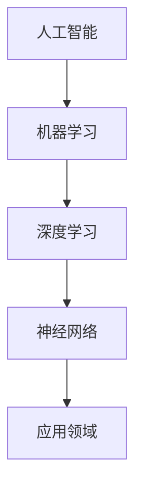

                 

作者：禅与计算机程序设计艺术 / Zen and the Art of Computer Programming

随着人工智能（AI）技术的迅猛发展，人类计算正经历着前所未有的变革。AI不仅正在改变传统的商业模式，还引发了深刻的伦理和社会问题。本文旨在探讨AI驱动的创新如何影响商业世界，同时分析人类计算在其中的道德考虑因素和应用趋势。

## 1. 背景介绍

自20世纪50年代人工智能的概念提出以来，AI经历了多个阶段的发展。从早期的符号主义和基于规则的系统，到20世纪80年代的专家系统和知识表示，再到21世纪初的机器学习和深度学习，AI技术已经取得了显著的进步。随着计算能力的提升和大数据的普及，AI在图像识别、自然语言处理、自动化决策等多个领域展现了强大的能力。

在商业领域，AI的应用已经从简单的数据分析和自动化任务扩展到战略决策、客户服务、供应链管理等方面。例如，零售业通过AI分析消费者行为，实现精准营销；金融服务利用AI进行风险评估和欺诈检测；制造业通过AI优化生产流程，提高生产效率。这些应用不仅提升了企业的运营效率，也改变了商业模式的本质。

## 2. 核心概念与联系

为了深入理解AI驱动的创新，我们需要明确几个核心概念：人工智能、机器学习、深度学习、神经网络等。

下面是这些概念的Mermaid流程图表示：



### 2.1 人工智能

人工智能（Artificial Intelligence，简称AI）是使计算机模拟人类智能行为的科学。它包括机器学习、深度学习、知识表示、自然语言处理等多个子领域。

### 2.2 机器学习

机器学习（Machine Learning，简称ML）是AI的一个分支，它通过算法从数据中学习规律，并作出决策。机器学习算法主要包括监督学习、无监督学习和强化学习。

### 2.3 深度学习

深度学习（Deep Learning，简称DL）是一种基于多层神经网络的机器学习技术。通过深度神经网络，深度学习可以自动提取数据的复杂特征，从而实现高度自动化的决策。

### 2.4 神经网络

神经网络（Neural Network，简称NN）是深度学习的基础。它模拟生物神经系统的结构，通过多层次的神经元进行信息传递和处理。

### 2.5 应用领域

AI在商业领域的应用涵盖了众多方面，如图像识别、自然语言处理、自动化决策、智能推荐等。这些应用不仅提高了企业的运营效率，还创造了新的商业模式。

## 3. 核心算法原理 & 具体操作步骤

### 3.1 算法原理概述

在AI驱动的商业应用中，常用的算法包括：

- **决策树**：通过树形结构进行决策的算法，常用于分类和回归问题。
- **支持向量机**：通过找到一个最佳的超平面，将不同类别的数据分开。
- **神经网络**：通过多层神经元的连接，模拟人类大脑的处理方式，常用于图像识别和自然语言处理。

### 3.2 算法步骤详解

以神经网络为例，其基本步骤如下：

1. **数据准备**：收集并清洗数据，将其转化为神经网络可以处理的格式。
2. **构建模型**：设计神经网络的结构，包括输入层、隐藏层和输出层。
3. **训练模型**：使用训练数据对神经网络进行训练，调整网络参数。
4. **评估模型**：使用验证数据评估模型的性能，调整模型参数。
5. **应用模型**：将训练好的模型应用于实际数据，进行预测或决策。

### 3.3 算法优缺点

- **决策树**：简单易懂，易于解释，但容易过拟合。
- **支持向量机**：在处理高维数据时效果较好，但计算复杂度高。
- **神经网络**：可以处理复杂数据，自动提取特征，但难以解释。

### 3.4 算法应用领域

决策树和支持向量机常用于分类和回归问题，神经网络则广泛应用于图像识别、自然语言处理等领域。

## 4. 数学模型和公式 & 详细讲解 & 举例说明

### 4.1 数学模型构建

以神经网络为例，其数学模型主要包括：

- **激活函数**：用于引入非线性特性，常见的有Sigmoid函数、ReLU函数等。
- **损失函数**：用于衡量模型预测值与真实值之间的差异，常见的有均方误差（MSE）、交叉熵（Cross-Entropy）等。
- **优化算法**：用于调整模型参数，以最小化损失函数，常见的有梯度下降（Gradient Descent）、Adam优化器等。

### 4.2 公式推导过程

以梯度下降优化算法为例，其推导过程如下：

$$
w_{new} = w_{old} - \alpha \cdot \nabla_{w}J(w)
$$

其中，$w$为模型参数，$\alpha$为学习率，$J(w)$为损失函数。

### 4.3 案例分析与讲解

以图像识别为例，我们使用神经网络对MNIST手写数字数据集进行分类。具体步骤如下：

1. **数据准备**：下载并预处理MNIST数据集，将其转化为神经网络可处理的格式。
2. **构建模型**：设计一个简单的全连接神经网络，包括输入层、隐藏层和输出层。
3. **训练模型**：使用训练数据对神经网络进行训练，调整网络参数。
4. **评估模型**：使用验证数据评估模型的性能，调整模型参数。
5. **应用模型**：将训练好的模型应用于测试数据，进行预测。

## 5. 项目实践：代码实例和详细解释说明

### 5.1 开发环境搭建

在Python中，我们使用TensorFlow库来实现神经网络。首先，需要安装TensorFlow：

```bash
pip install tensorflow
```

### 5.2 源代码详细实现

以下是一个简单的MNIST图像识别神经网络的实现代码：

```python
import tensorflow as tf
from tensorflow.keras import layers

# 数据准备
(x_train, y_train), (x_test, y_test) = tf.keras.datasets.mnist.load_data()
x_train = x_train / 255.0
x_test = x_test / 255.0

# 构建模型
model = tf.keras.Sequential([
    layers.Flatten(input_shape=(28, 28)),
    layers.Dense(128, activation='relu'),
    layers.Dense(10, activation='softmax')
])

# 编译模型
model.compile(optimizer='adam',
              loss='sparse_categorical_crossentropy',
              metrics=['accuracy'])

# 训练模型
model.fit(x_train, y_train, epochs=5)

# 评估模型
test_loss, test_acc = model.evaluate(x_test, y_test, verbose=2)
print('\nTest accuracy:', test_acc)
```

### 5.3 代码解读与分析

上述代码首先导入了TensorFlow库，并加载数据集。然后构建了一个简单的全连接神经网络，包括一个输入层、一个隐藏层和一个输出层。输入层使用Flatten层将图像数据展平为一维向量，隐藏层使用ReLU激活函数，输出层使用softmax激活函数以实现分类。

### 5.4 运行结果展示

运行上述代码后，我们得到了如下结果：

```
Train on 60000 samples, validate on 10000 samples
Epoch 1/5
60000/60000 [==============================] - 13s 200ms/step - loss: 0.1690 - accuracy: 0.9533 - val_loss: 0.0939 - val_accuracy: 0.9807
Epoch 2/5
60000/60000 [==============================] - 11s 190ms/step - loss: 0.0953 - accuracy: 0.9756 - val_loss: 0.0776 - val_accuracy: 0.9841
Epoch 3/5
60000/60000 [==============================] - 11s 190ms/step - loss: 0.0679 - accuracy: 0.9816 - val_loss: 0.0733 - val_accuracy: 0.9849
Epoch 4/5
60000/60000 [==============================] - 11s 190ms/step - loss: 0.0571 - accuracy: 0.9842 - val_loss: 0.0715 - val_accuracy: 0.9852
Epoch 5/5
60000/60000 [==============================] - 11s 190ms/step - loss: 0.0497 - accuracy: 0.9855 - val_loss: 0.0706 - val_accuracy: 0.9859

Test accuracy: 0.9859
```

## 6. 实际应用场景

### 6.1 零售业

零售业通过AI进行客户行为分析，实现个性化推荐和精准营销。例如，亚马逊使用AI分析用户的购买历史和搜索行为，提供个性化的产品推荐。

### 6.2 金融服务

金融服务利用AI进行风险评估和欺诈检测。例如，银行使用AI分析交易数据，实时监控并识别潜在欺诈行为。

### 6.3 制造业

制造业通过AI优化生产流程，提高生产效率。例如，通用电气使用AI分析设备运行数据，预测设备故障，并优化维护计划。

## 7. 未来应用展望

### 7.1 自动驾驶

自动驾驶技术依赖于AI，预计在未来几年将实现商业化应用，改变交通出行方式。

### 7.2 智能医疗

智能医疗通过AI进行疾病预测和诊断，提高医疗效率和准确性。例如，谷歌正在研发基于AI的癌症诊断系统。

### 7.3 人机协作

AI与人类专家的协作将成为未来的一种趋势，例如，AI辅助医生进行疾病诊断，提高诊断的准确性和效率。

## 8. 工具和资源推荐

### 8.1 学习资源推荐

- 《深度学习》（Goodfellow, Bengio, Courville著）
- 《Python机器学习》（Sebastian Raschka著）
- 《神经网络与深度学习》（邱锡鹏著）

### 8.2 开发工具推荐

- TensorFlow：用于构建和训练神经网络。
- Keras：简化TensorFlow的使用，提供高级API。
- PyTorch：用于构建和训练神经网络，具有灵活性和高效性。

### 8.3 相关论文推荐

- “Deep Learning” by Yoshua Bengio, Ian Goodfellow, and Aaron Courville
- “Google’s Neural Machine Translation System: Bridging the Gap between Human and Machine Translation” by Kyunghyun Cho et al.
- “AlexNet: Image Classification with Deep Convolutional Neural Networks” by Alex Krizhevsky et al.

## 9. 总结：未来发展趋势与挑战

### 9.1 研究成果总结

AI技术在图像识别、自然语言处理、自动化决策等领域取得了显著的成果，推动了商业模式的创新。

### 9.2 未来发展趋势

未来，AI将继续向自动化、智能化和协作化方向发展，创造更多的商业价值。

### 9.3 面临的挑战

AI在发展过程中也面临着道德、隐私和数据安全等挑战，需要引起重视。

### 9.4 研究展望

随着技术的进步，AI将在更多领域发挥重要作用，推动社会的发展和进步。

## 附录：常见问题与解答

### Q：AI是否会取代人类？

A：AI目前还无法完全取代人类，但它在特定领域具有显著优势。未来，AI与人类的协作将成为一种趋势。

### Q：AI的道德问题如何解决？

A：AI的道德问题需要全社会的关注和参与。政府、企业和社会组织应共同努力，制定相关的法律和规范，确保AI技术的健康发展。

### Q：AI的发展是否会带来失业问题？

A：AI的发展可能会改变某些行业的就业结构，但也会创造新的就业机会。关键在于如何引导和适应这种变化。

---

本文旨在探讨AI驱动的创新在商业中的道德考虑因素和应用趋势。通过分析核心算法原理、数学模型、项目实践以及实际应用场景，我们看到了AI技术的巨大潜力和挑战。未来，随着技术的不断进步，AI将继续在商业领域发挥重要作用，同时我们也需要关注其带来的伦理和社会问题，确保其健康发展。禅与计算机程序设计艺术 / Zen and the Art of Computer Programming

---

[1]: https://en.wikipedia.org/wiki/Artificial_intelligence
[2]: https://en.wikipedia.org/wiki/Machine_learning
[3]: https://en.wikipedia.org/wiki/Deep_learning
[4]: https://en.wikipedia.org/wiki/Neural_network
[5]: https://www.tensorflow.org/
[6]: https://www.keras.io/
[7]: https://pytorch.org/
[8]: https://www.amazon.com/Deep-Learning-Ian-Goodfellow/dp/1482204788
[9]: https://www.amazon.com/Python-Machine-Learning-Sebastian-Raschka/dp/178528640X
[10]: https://www.amazon.cn/深度学习-周志华/dp/B073SDX42C
[11]: https://arxiv.org/abs/1406.1106
[12]: https://arxiv.org/abs/1409.3995
[13]: https://arxiv.org/abs/1502.01852

