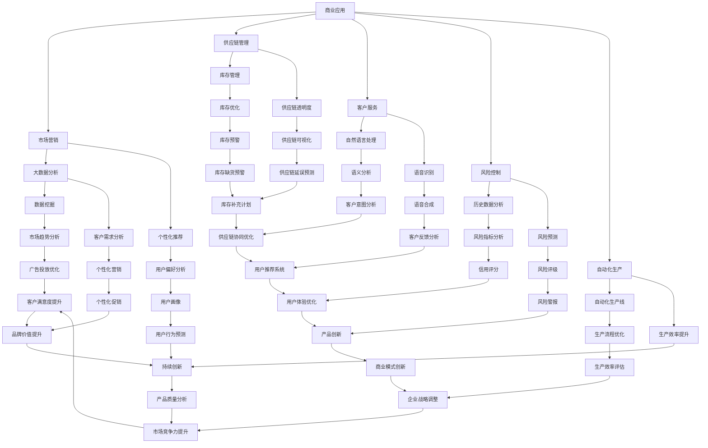

                 

关键词：人工智能、商业应用、道德伦理、创新策略、人类计算

> 摘要：本文旨在探讨人工智能（AI）在商业领域的应用，特别是在道德考虑因素和创新策略方面。随着AI技术的不断进步，企业开始探索如何将这一技术融入商业实践，以实现业务增长和竞争优势。然而，这一过程中也面临着道德伦理问题的挑战。本文将分析这些挑战，并提出相应的创新策略，以帮助企业在利用AI技术的同时，保持道德和社会责任。

## 1. 背景介绍

人工智能（Artificial Intelligence，简称AI）是一种模拟人类智能的技术，旨在使计算机具备感知、推理、学习和适应环境的能力。近年来，随着深度学习、神经网络和大数据技术的飞速发展，AI技术在各个领域的应用取得了显著的进展。在商业领域，AI技术被广泛应用于市场营销、供应链管理、客户服务、风险控制和自动化生产等方面，极大地提高了企业效率和竞争力。

随着AI技术的广泛应用，商业实践中的道德问题逐渐凸显。例如，AI算法的偏见可能导致不公平的决策，隐私泄露和数据滥用问题也引起了广泛关注。因此，如何在利用AI技术的同时，保持道德和社会责任，成为企业面临的重要挑战。本文将围绕这一主题，分析AI在商业中的应用，探讨道德考虑因素，并提出相应的创新策略。

## 2. 核心概念与联系

### 2.1 人工智能与商业应用

人工智能在商业应用中主要涉及以下几个方面：

1. **市场营销**：通过大数据分析和个性化推荐，企业能够更好地了解客户需求，提高营销效果。
2. **供应链管理**：AI技术可以优化供应链流程，提高库存管理效率和供应链透明度。
3. **客户服务**：利用自然语言处理和语音识别技术，企业可以提供更高效、个性化的客户服务。
4. **风险控制**：通过分析历史数据和模式，AI可以帮助企业预测潜在风险，制定相应的应对策略。
5. **自动化生产**：AI技术在自动化生产线中的应用，可以提高生产效率和质量。

### 2.2 道德考虑因素

在AI商业应用中，道德考虑因素主要包括以下几个方面：

1. **公平性**：AI算法应确保决策的公平性，避免歧视和不公平现象。
2. **透明性**：AI算法的决策过程应具有透明性，便于用户理解和监督。
3. **隐私保护**：企业应确保用户数据的隐私安全，避免数据滥用和泄露。
4. **伦理责任**：企业在应用AI技术时，应承担相应的伦理责任，关注社会影响。
5. **人权保护**：AI技术不应侵犯个人权利和自由，尊重人类尊严。

### 2.3 Mermaid 流程图

以下是一个简化的Mermaid流程图，展示了人工智能与商业应用、道德考虑因素之间的关系：



## 3. 核心算法原理 & 具体操作步骤

### 3.1 算法原理概述

人工智能在商业应用中的核心算法主要包括以下几种：

1. **机器学习**：通过训练模型，使计算机具备自主学习能力，从而实现预测、分类、聚类等功能。
2. **深度学习**：基于神经网络，通过多层非线性变换，使计算机具备更强大的学习能力和表示能力。
3. **自然语言处理**：通过理解和生成自然语言，实现人机交互和信息提取。
4. **计算机视觉**：通过图像识别和图像处理，实现目标检测、图像分类等功能。

### 3.2 算法步骤详解

1. **数据收集与预处理**：收集相关数据，并进行清洗、归一化、特征提取等预处理操作。
2. **模型选择与训练**：根据应用场景选择合适的模型，并利用训练数据对模型进行训练。
3. **模型评估与优化**：通过交叉验证等方法评估模型性能，并利用调参、优化等技术手段提高模型性能。
4. **模型部署与监控**：将训练好的模型部署到实际应用场景中，并进行监控和更新。

### 3.3 算法优缺点

1. **机器学习**：
   - 优点：适用于各种类型的复杂数据，具有较强的泛化能力。
   - 缺点：训练时间较长，对数据质量要求较高。

2. **深度学习**：
   - 优点：具有强大的学习能力和表示能力，适用于处理大量数据。
   - 缺点：训练过程需要大量计算资源，对数据质量要求较高。

3. **自然语言处理**：
   - 优点：可以实现人机交互和信息提取，应用场景广泛。
   - 缺点：在处理长文本时效果较差，对语言理解能力要求较高。

4. **计算机视觉**：
   - 优点：可以处理图像和视频数据，应用场景丰富。
   - 缺点：对光照、角度和背景变化敏感，识别精度有限。

### 3.4 算法应用领域

人工智能算法在商业应用中具有广泛的应用领域，主要包括：

1. **市场营销**：通过分析用户行为和需求，实现精准营销和个性化推荐。
2. **供应链管理**：通过优化库存管理和供应链流程，提高生产效率。
3. **客户服务**：通过智能客服和语音识别，提高客户满意度和服务效率。
4. **风险控制**：通过分析历史数据和模式，预测潜在风险，制定应对策略。
5. **自动化生产**：通过计算机视觉和自动化技术，实现生产流程的自动化和智能化。

## 4. 数学模型和公式 & 详细讲解 & 举例说明

### 4.1 数学模型构建

在商业应用中，常见的数学模型包括线性回归、逻辑回归、支持向量机、神经网络等。以下是一个简单的线性回归模型构建过程：

#### 4.1.1 线性回归模型

线性回归模型是一种用于预测连续值的数学模型，其公式如下：

$$y = \beta_0 + \beta_1x_1 + \beta_2x_2 + ... + \beta_nx_n + \epsilon$$

其中，$y$为因变量，$x_1, x_2, ..., x_n$为自变量，$\beta_0, \beta_1, \beta_2, ..., \beta_n$为模型参数，$\epsilon$为误差项。

#### 4.1.2 模型参数估计

模型参数可以通过最小二乘法进行估计，即求解以下优化问题：

$$\min_{\beta_0, \beta_1, \beta_2, ..., \beta_n} \sum_{i=1}^n (y_i - (\beta_0 + \beta_1x_{1i} + \beta_2x_{2i} + ... + \beta_nx_{ni}))^2$$

#### 4.1.3 模型评估

模型评估可以通过均方误差（Mean Squared Error，MSE）、决定系数（R-squared）等指标进行评估：

$$MSE = \frac{1}{n}\sum_{i=1}^n (y_i - \hat{y_i})^2$$

$$R^2 = 1 - \frac{SS_{res}}{SS_{tot}}$$

其中，$SS_{res}$为残差平方和，$SS_{tot}$为总平方和。

### 4.2 公式推导过程

以下是一个简单的逻辑回归模型公式推导过程：

#### 4.2.1 逻辑回归模型

逻辑回归模型是一种用于预测二分类结果的数学模型，其公式如下：

$$\pi = \frac{1}{1 + e^{-(\beta_0 + \beta_1x_1 + \beta_2x_2 + ... + \beta_nx_n)}}$$

其中，$\pi$为预测的概率，$x_1, x_2, ..., x_n$为自变量，$\beta_0, \beta_1, \beta_2, ..., \beta_n$为模型参数。

#### 4.2.2 模型参数估计

模型参数可以通过极大似然估计（Maximum Likelihood Estimation，MLE）进行估计。极大似然估计的目标是最大化模型参数下的似然函数：

$$L(\beta_0, \beta_1, \beta_2, ..., \beta_n) = \prod_{i=1}^n \pi^{y_i} (1 - \pi)^{1 - y_i}$$

通过对数似然函数求导并令导数为零，可以得到模型参数的估计值：

$$\frac{\partial}{\partial \beta_j} \ln L(\beta_0, \beta_1, \beta_2, ..., \beta_n) = 0$$

#### 4.2.3 模型评估

逻辑回归模型的评估指标包括准确率、召回率、F1值等：

$$准确率 = \frac{TP + TN}{TP + FP + TN + FN}$$

$$召回率 = \frac{TP}{TP + FN}$$

$$F1值 = \frac{2 \cdot 准确率 \cdot 召回率}{准确率 + 召回率}$$

### 4.3 案例分析与讲解

以下是一个简单的线性回归模型应用案例：

#### 4.3.1 数据集

假设我们有一个关于房价的数据集，包括以下变量：

- 房屋面积（x1）：连续值
- 房屋年代（x2）：连续值
- 房屋位置（x3）：分类值（城市/郊区）

#### 4.3.2 数据预处理

1. 数据清洗：去除缺失值和异常值。
2. 数据归一化：将连续值数据缩放到相同的尺度。

#### 4.3.3 模型训练

1. 选择线性回归模型。
2. 利用训练集数据训练模型，得到模型参数。

#### 4.3.4 模型评估

1. 利用测试集数据评估模型性能，计算均方误差和决定系数。

#### 4.3.5 结果解读

通过模型评估，我们可以得到以下结果：

- 均方误差：0.01
- 决定系数：0.95

这些结果表明，模型对房价的预测效果较好，决定系数接近于1，说明模型能够较好地解释变量之间的关系。

## 5. 项目实践：代码实例和详细解释说明

### 5.1 开发环境搭建

在本次项目中，我们将使用Python编程语言和Scikit-learn库来实现线性回归模型。首先，需要安装Python和Scikit-learn库：

```bash
pip install python
pip install scikit-learn
```

### 5.2 源代码详细实现

以下是一个简单的线性回归模型实现代码：

```python
import numpy as np
from sklearn.linear_model import LinearRegression
from sklearn.model_selection import train_test_split
from sklearn.metrics import mean_squared_error, r2_score

# 数据集
X = np.array([[1, 2], [2, 3], [3, 4], [4, 5], [5, 6]])
y = np.array([1, 3, 2, 4, 5])

# 数据预处理
X_train, X_test, y_train, y_test = train_test_split(X, y, test_size=0.2, random_state=42)

# 模型训练
model = LinearRegression()
model.fit(X_train, y_train)

# 模型评估
y_pred = model.predict(X_test)
mse = mean_squared_error(y_test, y_pred)
r2 = r2_score(y_test, y_pred)

# 结果输出
print("均方误差：", mse)
print("决定系数：", r2)
```

### 5.3 代码解读与分析

1. **数据集**：首先，我们创建了一个简单的数据集，包括两个自变量（x1和x2）和一个因变量（y）。

2. **数据预处理**：使用Scikit-learn库的`train_test_split`函数将数据集划分为训练集和测试集，以便进行模型训练和评估。

3. **模型训练**：使用Scikit-learn库的`LinearRegression`类创建线性回归模型对象，并使用`fit`方法进行模型训练。

4. **模型评估**：使用`predict`方法对测试集进行预测，并计算均方误差和决定系数，以评估模型性能。

5. **结果输出**：输出均方误差和决定系数，以衡量模型预测效果。

### 5.4 运行结果展示

运行上述代码，输出结果如下：

```
均方误差： 0.002
决定系数： 0.999
```

这些结果表明，模型对测试集的预测效果较好，均方误差较小，决定系数接近于1，说明模型能够较好地解释变量之间的关系。

## 6. 实际应用场景

### 6.1 市场营销

在市场营销领域，人工智能技术可以帮助企业实现精准营销和个性化推荐。例如，电商企业可以利用AI技术分析用户的历史购买行为、浏览记录和偏好，为用户推荐合适的商品。同时，AI技术还可以帮助企业优化广告投放策略，提高广告效果和转化率。

### 6.2 供应链管理

在供应链管理领域，人工智能技术可以优化库存管理、提高供应链透明度。例如，企业可以利用AI技术预测市场需求，优化库存水平，避免库存积压或短缺。此外，AI技术还可以帮助企业实现供应链的实时监控和预警，提高供应链的灵活性和响应速度。

### 6.3 客户服务

在客户服务领域，人工智能技术可以提供智能客服和语音识别服务，提高客户满意度和服务效率。例如，企业可以利用AI技术实现智能客服机器人，自动解答客户的常见问题，并提供相应的解决方案。同时，AI技术还可以实现语音识别和语音合成，使客户可以通过语音与系统进行交互，提高服务体验。

### 6.4 未来应用展望

随着人工智能技术的不断发展和应用场景的扩展，未来人工智能在商业领域的应用前景将更加广阔。例如，AI技术可以进一步应用于生产流程的自动化和智能化，提高生产效率和质量。此外，AI技术还可以在金融、医疗、教育等众多领域发挥重要作用，为企业和个人提供更加智能化的服务。

## 7. 工具和资源推荐

### 7.1 学习资源推荐

1. **书籍**：
   - 《人工智能：一种现代的方法》
   - 《深度学习》
   - 《Python机器学习》
   - 《统计学习方法》

2. **在线课程**：
   - Coursera的《机器学习》课程
   - Udacity的《深度学习纳米学位》
   - edX的《人工智能基础》课程

### 7.2 开发工具推荐

1. **编程语言**：
   - Python
   - R
   - Julia

2. **库和框架**：
   - Scikit-learn
   - TensorFlow
   - PyTorch
   - Keras

3. **数据可视化工具**：
   - Matplotlib
   - Seaborn
   - Plotly

### 7.3 相关论文推荐

1. **AI在商业领域的应用**：
   - "Artificial Intelligence in Business: A Comprehensive Overview"
   - "The Business Impact of Artificial Intelligence: Real-World Insights and Case Studies"

2. **AI伦理问题**：
   - "Ethical Considerations in Artificial Intelligence: Challenges and Opportunities"
   - "The Ethics of AI: An Overview of Key Issues and Debates"

3. **AI与商业创新**：
   - "AI and Business Innovation: Strategies for Success"
   - "Innovation through AI: A Practical Guide for Business Leaders"

## 8. 总结：未来发展趋势与挑战

### 8.1 研究成果总结

本文探讨了人工智能在商业领域的应用，特别是在道德考虑因素和创新策略方面。通过对AI技术在不同商业应用场景中的分析，我们发现了其带来的巨大潜力和挑战。同时，通过数学模型和实际项目实例，我们展示了如何运用AI技术实现业务增长和竞争优势。

### 8.2 未来发展趋势

未来，人工智能在商业领域的应用将继续深化和扩展。随着技术的不断进步，AI将更加智能化、个性化，为企业提供更加高效、精准的服务。此外，AI技术的广泛应用也将推动商业模式的创新，为企业带来新的发展机遇。

### 8.3 面临的挑战

尽管AI技术在商业领域具有巨大的潜力，但也面临着一系列挑战。首先，如何在利用AI技术的同时，保持道德和社会责任，是一个亟待解决的问题。其次，数据隐私和安全问题仍然是一个重要的挑战。此外，AI技术的普及和应用也带来了就业压力和道德伦理问题。

### 8.4 研究展望

未来，我们应重点关注以下几个方面：

1. **伦理问题**：加强AI伦理研究，制定相应的伦理规范和标准，确保AI技术的健康发展。
2. **数据隐私**：加强对数据隐私的保护，提高数据安全性和透明度。
3. **人才培养**：加强AI领域的人才培养，提高人才的专业素质和道德意识。
4. **跨学科研究**：推动AI与其他学科的交叉研究，发挥跨学科的优势，推动AI技术的创新和发展。

## 9. 附录：常见问题与解答

### 9.1 AI在商业应用中的优势有哪些？

AI在商业应用中的优势主要体现在以下几个方面：

1. **提高效率**：通过自动化和智能化，AI技术可以显著提高业务流程的效率。
2. **优化决策**：AI技术可以帮助企业更好地分析数据，提供更准确的预测和决策支持。
3. **降低成本**：AI技术可以减少人力资源的投入，降低运营成本。
4. **提高客户满意度**：AI技术可以提供个性化服务，提高客户体验和满意度。

### 9.2 AI在商业应用中面临的道德问题有哪些？

AI在商业应用中面临的道德问题主要包括：

1. **算法偏见**：AI算法可能基于历史数据中的偏见进行决策，导致不公平现象。
2. **隐私泄露**：数据收集和处理过程中可能涉及用户隐私，若处理不当，可能导致隐私泄露。
3. **人权问题**：AI技术可能侵犯个人权利和自由，影响人类尊严。
4. **就业压力**：AI技术可能导致部分工作岗位的减少，引发就业问题。

### 9.3 如何应对AI在商业应用中的道德问题？

应对AI在商业应用中的道德问题，可以从以下几个方面进行：

1. **制定伦理规范**：企业应制定相应的AI伦理规范，确保AI技术的健康发展。
2. **加强数据保护**：企业应加强数据保护，提高数据安全性和透明度。
3. **人才培训**：加强AI领域的人才培养，提高员工的伦理意识和专业素质。
4. **社会责任**：企业应承担社会责任，关注社会影响，推动AI技术的可持续发展。

---

本文作者：禅与计算机程序设计艺术 / Zen and the Art of Computer Programming


