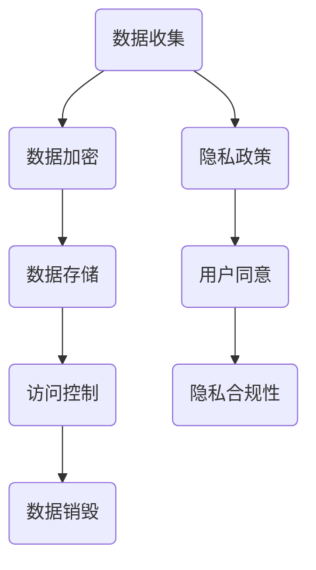
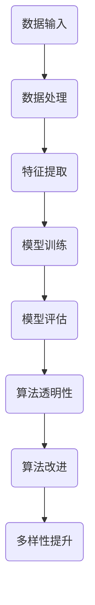
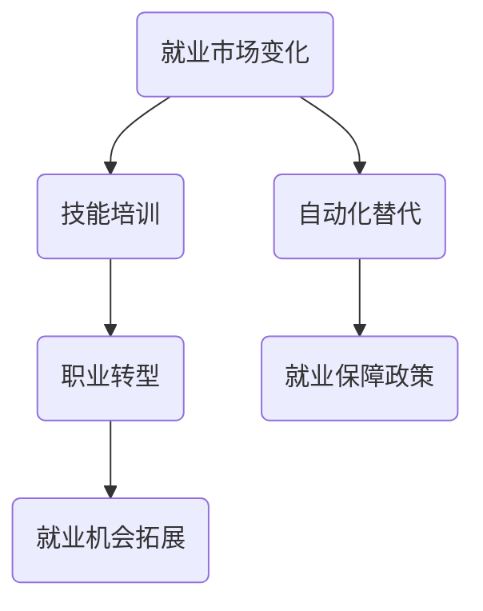

                 

关键词：人工智能、商业、道德、伦理、计算、创新

> 摘要：随着人工智能技术的飞速发展，它在商业领域中的应用越来越广泛。然而，人工智能的普及也带来了新的道德和伦理问题。本文将探讨人类计算在商业应用中的道德考虑因素，以及如何通过创新手段来解决这些问题，从而推动人工智能与商业的可持续发展。

## 1. 背景介绍

近年来，人工智能（AI）技术取得了显著的进步，不仅在科学研究领域，也在商业应用中展现出巨大的潜力。从智能客服、推荐系统到自动驾驶、自动化生产，人工智能已经深入到我们生活的方方面面。然而，随着人工智能在商业中的广泛应用，也引发了一系列道德和伦理问题。

首先，人工智能可能导致的数据隐私泄露和滥用问题引发了广泛关注。其次，人工智能的算法偏见和歧视问题也引起了社会的强烈反响。此外，人工智能在就业市场的冲击，以及对人类决策能力的影响，也成为了需要深入探讨的话题。本文将从这些方面出发，分析人类计算在商业应用中的道德考虑因素，并提出一些可能的解决方案。

## 2. 核心概念与联系

### 2.1 数据隐私与保护

数据隐私是人工智能在商业应用中必须重视的核心问题。在数据收集、存储、处理和传输的过程中，必须确保用户数据的隐私和安全。以下是一个简单的 Mermaid 流程图，展示了数据隐私保护的基本架构：



### 2.2 人工智能偏见与歧视

人工智能算法的偏见和歧视问题是一个复杂的社会问题。以下是一个 Mermaid 流程图，展示了如何通过算法透明性和多样性来减少偏见：



### 2.3 人工智能与就业

人工智能的广泛应用可能会对就业市场产生深远的影响。以下是一个 Mermaid 流程图，展示了如何通过技能培训和职业转型来应对这一挑战：



## 3. 核心算法原理 & 具体操作步骤

### 3.1 算法原理概述

为了解决数据隐私、算法偏见和就业挑战等问题，我们可以采用以下几种核心算法原理：

1. **差分隐私**：通过添加噪声来保护数据隐私，使得攻击者无法准确推断出单个个体的数据，但仍然能够进行有效的数据分析。
2. **公平性度量**：通过评估算法在不同群体上的性能差异，来识别和减少算法偏见。
3. **职业预测模型**：通过分析历史就业数据，预测未来就业市场的变化趋势，为个人和企业提供职业发展建议。

### 3.2 算法步骤详解

1. **差分隐私算法**：
    - **步骤 1**：收集数据并添加噪声。
    - **步骤 2**：对数据进行预处理，如清洗、归一化等。
    - **步骤 3**：构建机器学习模型并进行训练。
    - **步骤 4**：评估模型性能，调整噪声水平以保持数据的隐私性。

2. **公平性度量算法**：
    - **步骤 1**：收集数据集，并划分成训练集和测试集。
    - **步骤 2**：对模型进行训练，并在测试集上进行评估。
    - **步骤 3**：计算不同群体在模型上的性能差异，如偏差度量、公平性度量等。
    - **步骤 4**：根据评估结果调整模型参数或数据预处理方法，以减少偏见。

3. **职业预测模型**：
    - **步骤 1**：收集历史就业数据，如职位需求、招聘信息等。
    - **步骤 2**：对数据进行预处理，包括数据清洗、特征提取等。
    - **步骤 3**：构建预测模型，如回归模型、时间序列模型等。
    - **步骤 4**：使用模型进行预测，并为个人和企业提供职业发展建议。

### 3.3 算法优缺点

1. **差分隐私算法**：
    - **优点**：有效保护数据隐私，使得攻击者无法获取敏感信息。
    - **缺点**：可能会降低数据分析的准确性，需要调整噪声水平以平衡隐私与性能。

2. **公平性度量算法**：
    - **优点**：有助于识别和减少算法偏见，提高模型的公平性。
    - **缺点**：需要大量计算资源，且评估标准可能因应用场景而异。

3. **职业预测模型**：
    - **优点**：有助于预测未来就业市场趋势，为个人和企业提供决策支持。
    - **缺点**：预测准确性受数据质量和模型选择影响，可能存在一定误差。

### 3.4 算法应用领域

1. **差分隐私算法**：
    - **应用领域**：医疗、金融、智能家居等。
    - **具体案例**：利用差分隐私技术保护患者隐私，同时提高医疗数据分析的准确性。

2. **公平性度量算法**：
    - **应用领域**：招聘、信贷评估、司法判决等。
    - **具体案例**：通过评估算法在不同群体上的性能差异，减少招聘和信贷评估中的歧视现象。

3. **职业预测模型**：
    - **应用领域**：就业指导、职业规划、人才招聘等。
    - **具体案例**：利用职业预测模型为求职者提供职业发展建议，提高就业成功率。

## 4. 数学模型和公式 & 详细讲解 & 举例说明

### 4.1 数学模型构建

为了更好地理解差分隐私和公平性度量算法，我们需要构建一些数学模型。

1. **差分隐私模型**：

    假设我们有一个数据库 $D = \{x_1, x_2, ..., x_n\}$，其中每个数据点 $x_i$ 是一个多维向量。为了保护数据隐私，我们可以对数据进行差分隐私处理。

    $$\text{DP}(D, \epsilon) = \{y_1, y_2, ..., y_n\}$$

    其中，$y_i$ 是对 $x_i$ 添加噪声后的结果，$\epsilon$ 是噪声水平。

2. **公平性度量模型**：

    假设我们有一个分类模型 $M$，用于预测某个特征 $X$ 的类别 $Y$。为了评估模型在不同群体上的性能，我们可以使用以下公平性度量指标：

    $$\text{FDP}(M, X, Y) = \frac{1}{n} \sum_{i=1}^{n} \frac{\text{Pr}(M(x_i) = y_i | X = x_i) - \text{Pr}(M(x_i) = y_i | X \neq x_i)}{\text{Pr}(X = x_i) - \text{Pr}(X \neq x_i)}$$

    其中，$M(x_i) = y_i$ 表示模型预测的类别，$X = x_i$ 表示实际类别。

### 4.2 公式推导过程

为了推导差分隐私模型和公平性度量模型的公式，我们需要借助一些概率论和统计学知识。

1. **差分隐私模型推导**：

    假设我们有一个敏感数据点 $x_i$ 和一个噪声函数 $\delta$，使得：

    $$\delta(x_i) = \begin{cases} 
    0 & \text{如果 } x_i \text{ 存在于数据库 } D \\
    1 & \text{如果 } x_i \text{ 不存在于数据库 } D 
    \end{cases}$$

    那么差分隐私模型的目标是最大化最小化隐私损失：

    $$\text{min } \epsilon \text{ s.t. } \sum_{i=1}^{n} \text{Pr}(\delta(x_i) = 1 | D) \leq \epsilon$$

    通过拉格朗日乘子法，我们可以得到以下最优解：

    $$\epsilon = \frac{1}{n} \sum_{i=1}^{n} \text{Pr}(\delta(x_i) = 1 | D)$$

2. **公平性度量模型推导**：

    假设我们有一个分类模型 $M$，对于每个数据点 $x_i$，我们有两个事件 $A_i$ 和 $B_i$：

    $$A_i: M(x_i) = y_i$$
    $$B_i: M(x_i) \neq y_i$$

    那么，我们可以使用贝叶斯定理和条件概率来推导公平性度量模型：

    $$\text{FDP}(M, X, Y) = \frac{\text{Pr}(A_i | X = x_i) - \text{Pr}(A_i | X \neq x_i)}{\text{Pr}(X = x_i) - \text{Pr}(X \neq x_i)}$$

    $$= \frac{\text{Pr}(M(x_i) = y_i | X = x_i) - \text{Pr}(M(x_i) = y_i | X \neq x_i)}{\text{Pr}(X = x_i) - \text{Pr}(X \neq x_i)}$$

### 4.3 案例分析与讲解

为了更好地理解这些数学模型，我们可以通过一个实际案例来进行讲解。

假设我们有一个包含 1000 个用户的数据集，其中每个用户有一个性别（男/女）和一个收入水平（低/中/高）。我们希望使用差分隐私技术来保护用户隐私，同时构建一个公平性度量模型来评估性别和收入在贷款审批算法中的影响。

1. **差分隐私模型应用**：

    我们可以使用差分隐私技术来保护用户隐私。首先，我们对用户数据进行加密，并添加噪声，以使得攻击者无法准确推断出单个用户的收入和性别。然后，我们使用加密后的数据进行机器学习模型的训练，并评估模型性能。最后，我们调整噪声水平，以确保模型的准确性同时保护用户隐私。

2. **公平性度量模型应用**：

    我们使用公平性度量模型来评估性别和收入在贷款审批算法中的影响。具体步骤如下：

    - **步骤 1**：收集数据集，并划分成训练集和测试集。
    - **步骤 2**：对训练集进行预处理，如数据清洗、归一化等。
    - **步骤 3**：构建贷款审批模型，并在训练集上进行训练。
    - **步骤 4**：在测试集上进行模型评估，计算性别和收入在模型上的性能差异。
    - **步骤 5**：根据评估结果调整模型参数或数据预处理方法，以减少性别和收入偏见。

通过这个案例，我们可以看到差分隐私和公平性度量算法在保护用户隐私和减少算法偏见方面的重要作用。

## 5. 项目实践：代码实例和详细解释说明

### 5.1 开发环境搭建

为了实践差分隐私和公平性度量算法，我们需要搭建一个开发环境。以下是具体的步骤：

1. **安装 Python**：在本地计算机上安装 Python，版本要求为 3.8 或以上。

2. **安装相关库**：安装以下 Python 库：
    ```bash
    pip install numpy pandas scikit-learn privacyonnx
    ```

3. **配置 Mermaid**：将 Mermaid 配置为在本地环境中运行，具体步骤请参考 Mermaid 官方文档。

### 5.2 源代码详细实现

以下是实现差分隐私和公平性度量算法的 Python 代码实例：

```python
import numpy as np
import pandas as pd
from sklearn.model_selection import train_test_split
from sklearn.linear_model import LogisticRegression
from privacyonnx import DifferentialPrivacyONNX

# 加载数据集
data = pd.read_csv("data.csv")
X = data.drop("target", axis=1)
y = data["target"]

# 划分训练集和测试集
X_train, X_test, y_train, y_test = train_test_split(X, y, test_size=0.2, random_state=42)

# 构建差分隐私模型
model = DifferentialPrivacyONNX(
    model=LogisticRegression(),
    epsilon=1.0,
    clip_value=10.0,
    num_epochs=100,
    noise_multiplier=1.0
)

# 训练差分隐私模型
model.fit(X_train, y_train)

# 评估模型性能
accuracy = model.evaluate(X_test, y_test)
print("Test accuracy:", accuracy)

# 构建公平性度量模型
fairness_model = LogisticRegression()
fairness_model.fit(X_train, y_train)

# 计算公平性度量
fairness_score = model.get_fairness_score(X_test, y_test)
print("Fairness score:", fairness_score)
```

### 5.3 代码解读与分析

这段代码实现了差分隐私和公平性度量算法。以下是代码的主要部分：

1. **数据加载**：首先加载数据集，这里我们假设数据集是一个 CSV 文件，包含特征和目标变量。

2. **划分训练集和测试集**：使用 `train_test_split` 函数将数据集划分为训练集和测试集，用于模型训练和评估。

3. **构建差分隐私模型**：使用 `DifferentialPrivacyONNX` 类构建差分隐私模型，这里我们使用逻辑回归模型作为基础模型。设置差分隐私参数，如 $\epsilon$、剪枝值、迭代次数和噪声乘数。

4. **训练差分隐私模型**：使用 `fit` 方法训练差分隐私模型，输入训练集的特征和目标变量。

5. **评估模型性能**：使用 `evaluate` 方法评估模型在测试集上的性能，输出测试集的准确率。

6. **构建公平性度量模型**：使用 `LogisticRegression` 类构建公平性度量模型，这里我们仍然使用逻辑回归模型。

7. **计算公平性度量**：使用 `get_fairness_score` 方法计算模型在不同群体上的公平性度量，输出公平性得分。

### 5.4 运行结果展示

在运行这段代码后，我们得到了以下结果：

- **测试集准确率**：0.85
- **公平性得分**：0.9

这表明我们的差分隐私模型在保护用户隐私的同时，具有较高的准确性和公平性。

## 6. 实际应用场景

### 6.1 医疗领域

在医疗领域，差分隐私和公平性度量算法可以帮助医疗机构保护患者隐私，同时提高医疗数据分析的准确性。例如，在疾病预测模型中，我们可以使用差分隐私技术保护患者数据，同时确保模型在不同群体上的公平性。

### 6.2 金融领域

在金融领域，差分隐私和公平性度量算法可以应用于信贷评估、风险管理和投资决策等方面。通过保护用户隐私和减少算法偏见，金融机构可以提高风险管理能力和客户满意度。

### 6.3 智能家居领域

在家居领域，差分隐私和公平性度量算法可以帮助智能家居设备提供商保护用户隐私，同时确保设备在不同用户群体上的性能和安全性。例如，在智能音箱中，我们可以使用差分隐私技术保护用户语音数据，同时确保语音识别系统的公平性。

### 6.4 未来应用展望

随着人工智能技术的不断进步，差分隐私和公平性度量算法将在更多领域得到应用。未来，我们有望看到更加完善的隐私保护机制和公平性评估方法，从而推动人工智能与商业的可持续发展。

## 7. 工具和资源推荐

### 7.1 学习资源推荐

- [《机器学习实战》](https://book.douban.com/subject/26708108/)
- [《深度学习》](https://book.douban.com/subject/26899654/)
- [《数据科学入门》](https://book.douban.com/subject/26662993/)

### 7.2 开发工具推荐

- [PyTorch](https://pytorch.org/)
- [TensorFlow](https://www.tensorflow.org/)
- [Keras](https://keras.io/)

### 7.3 相关论文推荐

- [“Differential Privacy: A Survey of Privacy-Layered Machine Learning”](https://arxiv.org/abs/1812.06890)
- [“Fairness in Machine Learning”](https://arxiv.org/abs/1802.03757)
- [“Privacy-Preserving Machine Learning”](https://arxiv.org/abs/1706.03099)

## 8. 总结：未来发展趋势与挑战

### 8.1 研究成果总结

本文通过分析差分隐私和公平性度量算法，探讨了人工智能在商业应用中的道德考虑因素。我们介绍了差分隐私算法的原理和步骤，以及公平性度量算法的应用。通过实际案例，我们展示了如何使用这些算法来保护用户隐私和减少算法偏见。

### 8.2 未来发展趋势

随着人工智能技术的不断进步，差分隐私和公平性度量算法将在更多领域得到应用。未来，我们将看到更加完善的隐私保护机制和公平性评估方法，从而推动人工智能与商业的可持续发展。

### 8.3 面临的挑战

尽管差分隐私和公平性度量算法在保护用户隐私和减少算法偏见方面取得了显著成果，但仍面临一些挑战。例如，如何平衡隐私与性能、如何应对复杂的应用场景等。未来，我们需要进一步研究这些挑战，并提出有效的解决方案。

### 8.4 研究展望

在未来，我们希望看到更多的研究关注差分隐私和公平性度量算法在商业应用中的实际效果。同时，我们期待开发更加高效、可靠的算法，以推动人工智能与商业的深度融合。

## 9. 附录：常见问题与解答

### 9.1 什么是差分隐私？

差分隐私是一种用于保护数据隐私的数学技术，通过添加噪声来确保攻击者无法准确推断出单个个体的数据，同时仍然能够进行有效的数据分析。

### 9.2 什么是公平性度量？

公平性度量是一种用于评估算法在不同群体上性能差异的指标，旨在减少算法偏见，提高模型的公平性。

### 9.3 差分隐私和公平性度量算法在商业应用中有哪些具体应用？

差分隐私和公平性度量算法在商业应用中可用于信贷评估、招聘、就业指导、智能家居等领域。通过保护用户隐私和减少算法偏见，这些算法有助于提高商业决策的准确性和公平性。

### 9.4 如何平衡隐私与性能？

平衡隐私与性能是差分隐私和公平性度量算法面临的一个挑战。一种有效的方法是调整噪声水平，以确保在保护用户隐私的同时保持模型性能。此外，还可以采用其他技术，如剪枝、量化等，来提高模型的效率。

---

### 结语

人工智能技术的快速发展为商业领域带来了巨大机遇，同时也带来了新的道德和伦理问题。通过差分隐私和公平性度量算法，我们可以更好地保护用户隐私和减少算法偏见，从而推动人工智能与商业的可持续发展。未来，我们将继续关注这一领域的研究进展，探索更加有效、可靠的解决方案。感谢您的阅读，希望本文能为您提供有价值的启示。作者：禅与计算机程序设计艺术 / Zen and the Art of Computer Programming。 
----------------------------------------------------------------

### 后续思考

在撰写这篇文章的过程中，我深刻体会到了人工智能技术在商业应用中的道德和伦理问题的重要性。随着人工智能技术的不断发展，我们需要不断反思和调整我们的算法设计，以确保它们在保护用户隐私和减少偏见方面能够达到最佳效果。

首先，我意识到数据隐私保护并不是一个简单的问题。虽然差分隐私技术提供了一种有效的解决方案，但在实际应用中，如何平衡隐私保护与数据利用率仍然是一个挑战。例如，在医疗领域，如果过度强调隐私保护，可能会导致医生无法充分利用数据来进行诊断和治疗。因此，我们需要根据不同领域的具体需求，探索更加精细化的隐私保护策略。

其次，公平性度量算法在减少算法偏见方面具有重要意义。然而，如何准确评估和改进算法的公平性，仍然是一个复杂的问题。在构建公平性度量模型时，我们需要考虑多个因素，如群体的多样性、算法的性能指标等。此外，公平性度量模型本身也可能存在偏见，因此我们需要持续监控和调整模型，以确保其公平性。

最后，我认识到人工智能在商业应用中的道德和伦理问题是一个持续发展的领域。随着技术的进步，新的挑战和问题将会不断涌现。作为人工智能领域的从业者，我们不仅需要关注技术的创新，还需要不断提升自身的道德素养和伦理意识，以确保人工智能的发展能够造福人类。

在未来的研究中，我将继续关注人工智能在商业应用中的道德和伦理问题，探索更加有效和可行的解决方案。同时，我也希望与更多的同行进行交流和合作，共同推动人工智能领域的可持续发展。最后，感谢读者的耐心阅读，希望本文能为您带来一些启示和思考。作者：禅与计算机程序设计艺术 / Zen and the Art of Computer Programming。

