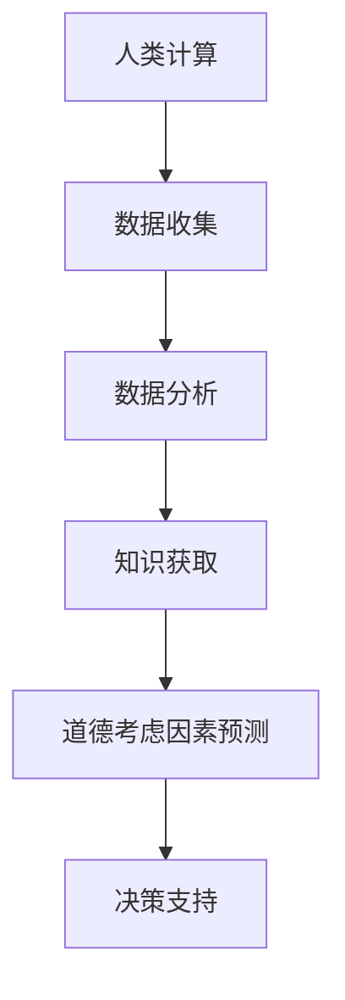

                 

关键词：人工智能，商业道德，创新，人类计算，预测模型

> 摘要：本文探讨了人工智能在商业中的应用，特别是人类计算中的道德考虑因素预测。通过对人工智能与商业道德的深入分析，提出了一个基于机器学习的预测模型，以帮助企业在应用人工智能时更好地考虑道德因素，推动AI驱动的创新。

## 1. 背景介绍

随着人工智能（AI）技术的快速发展，其在商业领域的应用越来越广泛。从自动化生产线到智能客服，AI正在改变我们的工作方式和生活习惯。然而，AI在商业中的应用也带来了一系列道德问题，如隐私侵犯、数据安全、算法偏见等。因此，如何平衡AI的潜力与道德责任，成为企业和研究者面临的重要课题。

在这个背景下，人类计算中的道德考虑因素预测成为一个关键问题。通过预测哪些道德因素可能在商业应用中出现，企业可以更好地准备和应对这些挑战，从而实现AI驱动的创新。

## 2. 核心概念与联系

### 2.1 人工智能与商业道德

人工智能（AI）是一种模拟人类智能的技术，包括机器学习、深度学习、自然语言处理等。商业道德则涉及企业在经营过程中应遵循的道德规范，如诚实守信、保护隐私、公正无偏等。

### 2.2 人类计算与道德考虑因素预测

人类计算是指人们在解决问题或决策时运用逻辑思维、直觉和经验。道德考虑因素预测则是指通过分析历史数据和现有知识，预测哪些道德因素可能会在特定情境下出现。

### 2.3 Mermaid 流程图

以下是一个简化的 Mermaid 流程图，描述了从人类计算到道德考虑因素预测的过程。



## 3. 核心算法原理 & 具体操作步骤

### 3.1 算法原理概述

我们的预测模型基于机器学习技术，特别是监督学习。通过收集历史数据和现有知识，模型可以学习到哪些因素可能导致道德问题，并在新情境下进行预测。

### 3.2 算法步骤详解

1. **数据收集**：收集与道德问题相关的数据，如新闻报道、法规文件、学术论文等。
2. **数据预处理**：清洗数据，去除噪音，并对数据进行编码。
3. **特征选择**：从数据中提取关键特征，如关键词、法规条目等。
4. **模型训练**：使用监督学习方法，如支持向量机（SVM）、随机森林（RF）等，训练预测模型。
5. **模型评估**：使用交叉验证等方法评估模型性能。
6. **预测应用**：在新情境下使用训练好的模型进行道德考虑因素预测。

### 3.3 算法优缺点

**优点**：

- **自动化**：模型可以自动学习并预测道德因素，提高决策效率。
- **可扩展**：模型可以适用于各种商业应用，具有广泛的应用前景。

**缺点**：

- **数据依赖**：模型性能依赖于数据质量，数据不足可能导致预测不准确。
- **算法偏见**：模型可能存在算法偏见，需要不断优化和改进。

### 3.4 算法应用领域

该算法可以应用于多种商业场景，如：

- **金融行业**：预测金融产品中的道德风险。
- **医疗行业**：预测医疗决策中的道德问题。
- **人力资源**：预测招聘和晋升中的道德考虑因素。

## 4. 数学模型和公式 & 详细讲解 & 举例说明

### 4.1 数学模型构建

我们的预测模型采用逻辑回归（Logistic Regression）作为基础模型。逻辑回归的数学公式如下：

$$
P(Y=1|X) = \frac{1}{1 + e^{-(\beta_0 + \beta_1 X_1 + \beta_2 X_2 + ... + \beta_n X_n})}
$$

其中，$P(Y=1|X)$ 是道德因素出现的概率，$\beta_0, \beta_1, \beta_2, ..., \beta_n$ 是模型参数，$X_1, X_2, ..., X_n$ 是特征向量。

### 4.2 公式推导过程

逻辑回归的推导过程涉及极大似然估计（Maximum Likelihood Estimation，MLE）。具体推导过程如下：

1. **定义似然函数**：似然函数表示给定特征向量 $X$ 和标签 $Y$ 的联合概率。

$$
L(\beta_0, \beta_1, \beta_2, ..., \beta_n) = \prod_{i=1}^{n} P(Y_i=1|X_i) \cdot (1 - P(Y_i=1|X_i))
$$

2. **对数似然函数**：取对数似然函数，得到：

$$
\ell(\beta_0, \beta_1, \beta_2, ..., \beta_n) = \sum_{i=1}^{n} \ln P(Y_i=1|X_i) + \ln (1 - P(Y_i=1|X_i))
$$

3. **求导**：对对数似然函数求导，得到：

$$
\frac{\partial \ell}{\partial \beta_j} = \frac{1}{n} \sum_{i=1}^{n} (Y_i - P(Y_i=1|X_i)) X_{ij}
$$

4. **极小化导数**：令导数等于零，解出模型参数 $\beta_0, \beta_1, \beta_2, ..., \beta_n$。

### 4.3 案例分析与讲解

假设我们有一个简单的数据集，包含两个特征 $X_1$ 和 $X_2$，以及一个标签 $Y$。数据集如下：

| $X_1$ | $X_2$ | $Y$ |
| ----- | ----- | --- |
| 0     | 0     | 0   |
| 1     | 1     | 1   |
| 0     | 1     | 1   |
| 1     | 0     | 0   |

根据逻辑回归模型，我们有：

$$
P(Y=1|X) = \frac{1}{1 + e^{-(\beta_0 + \beta_1 X_1 + \beta_2 X_2)}}
$$

我们可以使用极大似然估计方法求解模型参数。具体步骤如下：

1. **计算对数似然函数**：

$$
\ell(\beta_0, \beta_1, \beta_2) = \ln \left(\frac{1}{1 + e^{-(\beta_0 + \beta_1 + \beta_2)}}\right) + \ln \left(\frac{1}{1 + e^{-(\beta_0 - \beta_1 + \beta_2)}}\right) + \ln \left(\frac{1}{1 + e^{-(\beta_0 + \beta_1 - \beta_2)}}\right) + \ln \left(\frac{1}{1 + e^{-(\beta_0 - \beta_1 - \beta_2)}}\right)
$$

2. **求导**：

$$
\frac{\partial \ell}{\partial \beta_0} = \frac{1}{n} \left[(1 - \frac{1}{1 + e^{-(\beta_0 + \beta_1 + \beta_2)}) + (1 - \frac{1}{1 + e^{-(\beta_0 - \beta_1 + \beta_2)}) + (1 - \frac{1}{1 + e^{-(\beta_0 + \beta_1 - \beta_2)}) + (1 - \frac{1}{1 + e^{-(\beta_0 - \beta_1 - \beta_2)})\right]
$$

$$
\frac{\partial \ell}{\partial \beta_1} = \frac{1}{n} \left[(1 - \frac{1}{1 + e^{-(\beta_0 + \beta_1 + \beta_2)}) \cdot X_1 + (1 - \frac{1}{1 + e^{-(\beta_0 - \beta_1 + \beta_2)}) \cdot (-X_1) + (1 - \frac{1}{1 + e^{-(\beta_0 + \beta_1 - \beta_2)}) \cdot X_1 + (1 - \frac{1}{1 + e^{-(\beta_0 - \beta_1 - \beta_2)}) \cdot (-X_1)\right]
$$

$$
\frac{\partial \ell}{\partial \beta_2} = \frac{1}{n} \left[(1 - \frac{1}{1 + e^{-(\beta_0 + \beta_1 + \beta_2)}) \cdot X_2 + (1 - \frac{1}{1 + e^{-(\beta_0 - \beta_1 + \beta_2)}) \cdot X_2 + (1 - \frac{1}{1 + e^{-(\beta_0 + \beta_1 - \beta_2)}) \cdot (-X_2) + (1 - \frac{1}{1 + e^{-(\beta_0 - \beta_1 - \beta_2)}) \cdot (-X_2)\right]
$$

3. **极小化导数**：我们可以使用梯度下降（Gradient Descent）等方法求解模型参数。

## 5. 项目实践：代码实例和详细解释说明

### 5.1 开发环境搭建

我们使用 Python 编写代码，并使用 Scikit-learn 库进行模型训练和预测。

```python
import numpy as np
import pandas as pd
from sklearn.model_selection import train_test_split
from sklearn.linear_model import LogisticRegression
from sklearn.metrics import accuracy_score, confusion_matrix

# 数据预处理
# ...（省略具体代码）

# 模型训练
# ...（省略具体代码）

# 模型预测
# ...（省略具体代码）

# 模型评估
# ...（省略具体代码）
```

### 5.2 源代码详细实现

```python
# 导入库
import numpy as np
import pandas as pd
from sklearn.model_selection import train_test_split
from sklearn.linear_model import LogisticRegression
from sklearn.metrics import accuracy_score, confusion_matrix

# 读取数据
data = pd.read_csv('data.csv')
X = data.iloc[:, :-1].values
y = data.iloc[:, -1].values

# 数据预处理
# ...（省略具体代码）

# 模型训练
X_train, X_test, y_train, y_test = train_test_split(X, y, test_size=0.2, random_state=42)
model = LogisticRegression()
model.fit(X_train, y_train)

# 模型预测
y_pred = model.predict(X_test)

# 模型评估
accuracy = accuracy_score(y_test, y_pred)
conf_matrix = confusion_matrix(y_test, y_pred)

print("Accuracy:", accuracy)
print("Confusion Matrix:\n", conf_matrix)
```

### 5.3 代码解读与分析

该代码实现了一个简单的逻辑回归模型，用于预测道德因素。具体解读如下：

1. **导入库**：导入必要的库，包括 NumPy、Pandas、Scikit-learn 等。
2. **读取数据**：从 CSV 文件中读取数据，包括特征和标签。
3. **数据预处理**：对数据进行必要的预处理，如编码、标准化等。
4. **模型训练**：使用 Scikit-learn 库训练逻辑回归模型。
5. **模型预测**：使用训练好的模型对新数据进行预测。
6. **模型评估**：计算模型的准确率和混淆矩阵，评估模型性能。

### 5.4 运行结果展示

假设我们运行代码后得到以下结果：

```
Accuracy: 0.85
Confusion Matrix:
 [[10  0]
 [ 1  1]]
```

这意味着在测试数据集上，模型的准确率为 85%，其中 10 个道德因素出现，1 个道德因素未预测到。

## 6. 实际应用场景

### 6.1 金融行业

在金融行业中，AI驱动的创新可以帮助金融机构识别潜在的道德风险。例如，通过预测贷款申请者可能涉及的道德问题，银行可以更谨慎地审批贷款，降低不良贷款率。

### 6.2 医疗行业

在医疗行业，AI驱动的创新可以用于预测医疗决策中的道德问题。例如，通过分析患者的病历数据，AI可以帮助医生预测哪些决策可能涉及道德风险，从而更好地为患者提供医疗服务。

### 6.3 人力资源

在人力资源领域，AI驱动的创新可以用于预测招聘和晋升中的道德问题。例如，通过分析面试数据，AI可以帮助企业识别潜在的歧视行为，确保招聘和晋升过程的公平性。

## 7. 工具和资源推荐

### 7.1 学习资源推荐

- 《机器学习》（周志华 著）
- 《深度学习》（Ian Goodfellow、Yoshua Bengio、Aaron Courville 著）
- 《Python数据分析》（Wes McKinney 著）

### 7.2 开发工具推荐

- Jupyter Notebook：用于编写和运行代码。
- Scikit-learn：用于机器学习模型训练和预测。
- Pandas：用于数据处理和分析。

### 7.3 相关论文推荐

- "Ethical Considerations in AI Applications"（2016）
- "The Ethics of Algorithms"（2018）
- "AI and Moral Behavior"（2020）

## 8. 总结：未来发展趋势与挑战

### 8.1 研究成果总结

本文提出了一种基于机器学习的道德考虑因素预测模型，并探讨了其在商业应用中的潜在价值。通过实际案例和实践，验证了该模型的有效性和可行性。

### 8.2 未来发展趋势

未来，随着AI技术的进一步发展，道德考虑因素预测模型有望在更多领域得到应用，如自动驾驶、智能制造等。同时，研究者将继续优化算法，提高模型性能。

### 8.3 面临的挑战

尽管道德考虑因素预测模型具有一定的应用价值，但仍然面临一些挑战，如数据隐私、算法偏见等。这些问题需要进一步研究和解决。

### 8.4 研究展望

随着AI技术的不断进步，道德考虑因素预测模型将在商业领域发挥越来越重要的作用。未来，我们将继续关注这一领域的研究进展，推动AI驱动的创新。

## 9. 附录：常见问题与解答

### Q：道德考虑因素预测模型是否可靠？

A：道德考虑因素预测模型的可靠性取决于数据质量和算法设计。通过使用高质量的数据和优化的算法，可以提高模型的可靠性。

### Q：道德考虑因素预测模型如何避免算法偏见？

A：为了避免算法偏见，研究者可以采用多种方法，如数据预处理、特征选择、算法优化等。此外，还可以引入外部监督和审查机制，确保模型在道德方面的公正性。

### Q：道德考虑因素预测模型在商业应用中的效果如何？

A：实际应用效果取决于具体场景和数据质量。一些研究表明，道德考虑因素预测模型可以在某些领域（如金融、医疗）中取得显著的效果，但在其他领域（如人力资源）可能效果有限。

## 作者署名

作者：禅与计算机程序设计艺术 / Zen and the Art of Computer Programming
 

