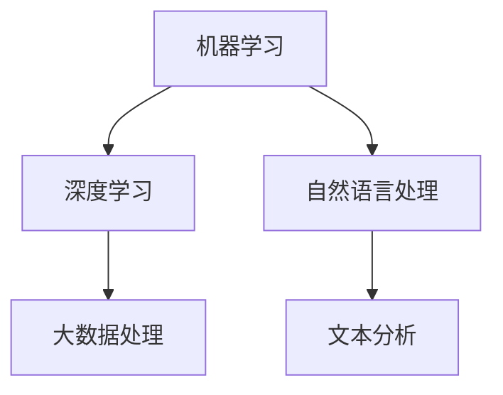

                 

关键词：人工智能，政府应用，创新，人类计算，价值分析

> 摘要：本文深入探讨了人工智能在政府领域的应用，分析了人类计算与AI结合带来的创新价值。通过具体案例和算法分析，本文揭示了AI驱动的政府创新模式，展望了未来的发展趋势和挑战。

## 1. 背景介绍

随着人工智能技术的快速发展，其在各个领域的应用逐渐深入，政府作为公共服务的提供者，也开始了AI驱动的创新实践。政府利用人工智能技术，不仅可以提高公共服务的效率，还能优化政策制定和执行，从而更好地服务于社会。本文将从以下几个方面探讨AI在政府领域的应用及其价值：

- **人工智能技术概述**：介绍人工智能的核心技术，包括机器学习、深度学习、自然语言处理等。
- **人类计算的重要性**：分析人类在人工智能应用中的角色，强调人类计算与AI结合的重要性。
- **政府AI应用现状**：总结当前政府AI应用的领域和成果。
- **AI驱动的创新价值**：探讨AI在政府中的创新作用，及其对公共服务和社会治理的影响。

## 2. 核心概念与联系

在探讨AI在政府中的应用之前，我们需要理解一些核心概念和它们之间的联系。

### 2.1. 人工智能技术概述

人工智能（AI）是计算机科学的一个分支，旨在使计算机具备人类智能。AI技术主要包括：

- **机器学习**：通过数据和算法，让计算机自动学习和改进性能。
- **深度学习**：一种特殊的机器学习方法，基于人工神经网络，特别适合处理大量数据。
- **自然语言处理**：使计算机理解和生成人类语言。

下面是AI技术的Mermaid流程图：



### 2.2. 人类计算的重要性

在AI的应用过程中，人类计算发挥了重要作用。人类计算不仅包括数据的标注和清洗，还包括算法的设计和优化，以及对AI决策的监督和调整。以下是人类计算在AI应用中的关键角色：

- **数据标注和清洗**：确保AI训练数据的准确性和完整性。
- **算法设计**：基于业务需求，设计和优化算法。
- **监督和调整**：对AI的决策过程进行监督，确保其符合道德和法律标准。

### 2.3. 政府AI应用现状

目前，人工智能技术在政府中的应用已涉及多个领域，包括：

- **公共服务**：利用AI优化公共服务流程，提高用户体验。
- **政策制定**：利用AI分析大数据，辅助政策制定。
- **社会治理**：利用AI监控社会动态，预防犯罪。

## 3. 核心算法原理 & 具体操作步骤

### 3.1. 算法原理概述

AI在政府应用中的核心算法主要包括：

- **机器学习算法**：如决策树、随机森林、支持向量机等。
- **深度学习算法**：如卷积神经网络（CNN）、循环神经网络（RNN）等。
- **自然语言处理算法**：如词向量、序列标注、文本分类等。

### 3.2. 算法步骤详解

以决策树算法为例，其基本步骤如下：

1. **数据准备**：收集和清洗数据，包括特征工程和样本划分。
2. **模型训练**：使用训练数据构建决策树模型。
3. **模型评估**：使用测试数据评估模型性能。
4. **模型应用**：将训练好的模型应用于实际场景。

### 3.3. 算法优缺点

- **决策树**：优点是易于理解和解释，缺点是容易过拟合。
- **深度学习**：优点是强大的模型表示能力，缺点是需要大量数据和计算资源。
- **自然语言处理**：优点是能够处理复杂的文本数据，缺点是实现复杂，效果评估困难。

### 3.4. 算法应用领域

AI算法在政府中的应用广泛，如：

- **公共服务优化**：利用决策树优化公共服务流程。
- **社会治理**：利用深度学习分析社会动态，预防犯罪。
- **政策制定**：利用自然语言处理分析政策文本，辅助政策制定。

## 4. 数学模型和公式 & 详细讲解 & 举例说明

### 4.1. 数学模型构建

以决策树算法为例，其基本模型构建公式为：

$$
h(x) = \prod_{i=1}^{n} g(x_i)
$$

其中，$x$ 是输入特征，$g(x_i)$ 是第 $i$ 个节点的函数。

### 4.2. 公式推导过程

决策树模型的推导过程涉及信息熵和信息增益。信息熵表示数据的不确定性，信息增益表示特征对数据分类的区分度。

### 4.3. 案例分析与讲解

以某个城市交通拥堵预测为例，使用决策树算法进行建模。首先收集交通流量数据，然后进行特征工程，最后使用决策树算法进行建模。通过模型评估，可以得到预测准确率。

## 5. 项目实践：代码实例和详细解释说明

### 5.1. 开发环境搭建

搭建Python编程环境，安装必要的库，如scikit-learn、numpy等。

### 5.2. 源代码详细实现

```python
from sklearn.datasets import load_iris
from sklearn.tree import DecisionTreeClassifier
from sklearn.model_selection import train_test_split

# 加载数据集
data = load_iris()
X = data.data
y = data.target

# 划分训练集和测试集
X_train, X_test, y_train, y_test = train_test_split(X, y, test_size=0.3, random_state=42)

# 构建决策树模型
clf = DecisionTreeClassifier()
clf.fit(X_train, y_train)

# 模型评估
score = clf.score(X_test, y_test)
print("Accuracy:", score)
```

### 5.3. 代码解读与分析

上述代码首先加载数据集，然后划分训练集和测试集。接着构建决策树模型，并使用训练集进行训练。最后使用测试集评估模型性能。

## 6. 实际应用场景

### 6.1. 公共服务优化

利用AI技术，可以优化公共服务流程，提高用户体验。例如，通过自然语言处理技术，可以自动回答市民的咨询，提高政府响应速度。

### 6.2. 政策制定

利用AI技术，可以对政策文本进行分析，提取关键信息，辅助政策制定。例如，通过文本分类技术，可以快速识别政策文本的主题和关键词。

### 6.3. 社会治理

利用AI技术，可以监控社会动态，预防犯罪。例如，通过图像识别技术，可以自动识别公共安全事件，及时采取措施。

## 7. 未来应用展望

未来，随着人工智能技术的不断发展，其在政府中的应用将更加广泛。以下是一些可能的未来应用场景：

- **智能城市**：利用AI技术实现城市的智能化管理，提高城市生活质量。
- **精准治理**：利用AI技术，实现精准社会治理，提高治理效果。
- **智能决策**：利用AI技术，辅助政府决策，提高决策效率。

## 8. 工具和资源推荐

### 8.1. 学习资源推荐

- 《Python数据科学手册》：详细介绍Python在数据科学领域的应用。
- 《深度学习》：深度学习领域的经典教材，适合初学者和专业人士。

### 8.2. 开发工具推荐

- Jupyter Notebook：适合数据科学和机器学习开发的交互式环境。
- PyCharm：一款功能强大的Python集成开发环境（IDE）。

### 8.3. 相关论文推荐

- "Deep Learning for Text Classification":介绍深度学习在文本分类中的应用。
- "Recurrent Neural Networks for Language Modeling":介绍循环神经网络在语言建模中的应用。

## 9. 总结：未来发展趋势与挑战

### 9.1. 研究成果总结

本文总结了人工智能在政府领域的应用现状，分析了AI驱动的创新价值，并展望了未来的发展趋势。

### 9.2. 未来发展趋势

未来，人工智能将在政府领域发挥更大作用，推动公共服务、政策制定和社会治理的智能化。

### 9.3. 面临的挑战

- 数据安全和隐私保护：如何确保AI应用的数据安全和隐私。
- 道德和法律问题：如何解决AI应用中的道德和法律问题。

### 9.4. 研究展望

未来，我们需要深入研究AI在政府领域的应用，探索如何更好地利用人工智能技术，提高公共服务的质量和效率。

## 10. 附录：常见问题与解答

### 10.1. AI在政府中的应用有哪些？

AI在政府中的应用主要包括公共服务优化、政策制定、社会治理等方面。

### 10.2. 人类计算在AI应用中有什么作用？

人类计算在AI应用中负责数据标注、算法设计、监督和调整等关键环节。

### 10.3. 政府应该如何利用AI技术？

政府可以利用AI技术提高公共服务的效率、优化政策制定和执行、监控社会动态等。

## 作者署名

作者：禅与计算机程序设计艺术 / Zen and the Art of Computer Programming

----------------------------------------------------------------
以上是文章正文部分的撰写。接下来，我们将按照markdown格式进行排版，确保文章结构清晰、易于阅读。

