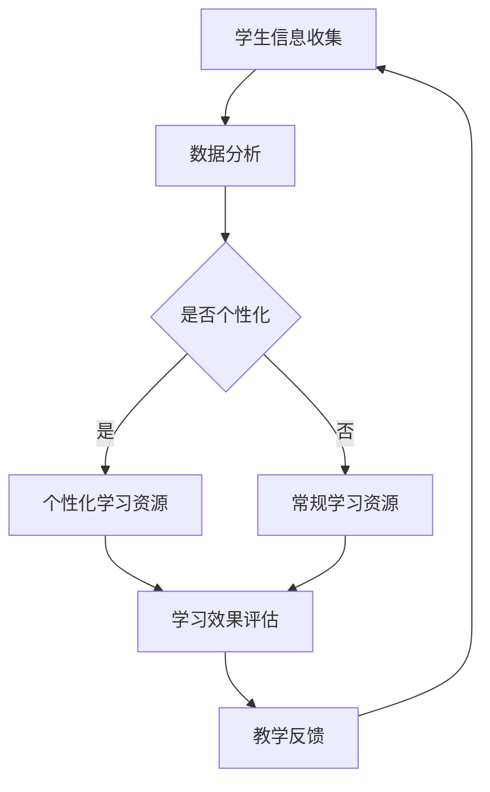

                 

关键词：人工智能、教育技术、人类计算、AI教育、教学创新

> 摘要：随着人工智能技术的快速发展，教育领域正迎来前所未有的变革。本文旨在探讨AI驱动的创新对人类计算教育的影响，分析其在提高教育质量、个性化学习、教育公平等方面的应用，并提出未来发展趋势与面临的挑战。

## 1. 背景介绍

随着信息技术的飞速发展，人工智能（AI）逐渐成为全球科技领域的热点。人工智能是指通过计算机模拟人类智能行为的技术，包括机器学习、深度学习、自然语言处理等子领域。近年来，AI技术已经深入到生活的各个方面，从智能家居、自动驾驶到医疗诊断、金融服务，AI的影子无处不在。

在教育领域，人工智能的应用也逐渐成为研究热点。传统教育模式以教师为中心，学生被动接受知识，缺乏个性化和互动性。而AI驱动的教育技术，如智能教学系统、自适应学习平台、在线教育等，正在改变这一现状。通过大数据分析和机器学习算法，AI能够根据学生的学习情况和兴趣，提供个性化的学习内容和路径，从而提高学习效果和效率。

## 2. 核心概念与联系

### 2.1. 人类计算

人类计算是指通过人类智慧和经验进行计算的过程。它不同于传统的机器计算，强调人类的参与和决策。在教育中，人类计算体现在教师的授课、学生的思考、讨论和反馈等环节。这些环节不仅传递知识，更重要的是培养思维能力和创造力。

### 2.2. 人工智能与人类计算的关系

人工智能与人类计算并非对立，而是相辅相成的关系。人工智能可以模拟人类的部分计算过程，如数据分析、模式识别等，从而减轻人类的工作负担。同时，人工智能可以提供丰富的数据资源，为人类计算提供支持。例如，通过分析学生的学习数据，AI可以预测学生的兴趣和需求，为教师提供教学建议。

### 2.3. AI驱动的教育创新

AI驱动的教育创新主要体现在以下几个方面：

- **个性化学习**：AI可以根据学生的学习习惯、兴趣爱好和学习效果，提供个性化的学习资源和路径。
- **智能辅导**：AI系统可以通过智能算法为学生提供实时、个性化的辅导，帮助学生解决问题。
- **智能评测**：AI可以通过自动批改作业、模拟考试等方式，快速准确地评估学生的学习情况。
- **教育资源优化**：AI可以对教育资源进行智能推荐，提高资源的使用效率。

### 2.4. Mermaid 流程图

以下是一个简化的Mermaid流程图，展示了AI驱动的教育创新流程：



## 3. 核心算法原理 & 具体操作步骤

### 3.1. 算法原理概述

AI驱动的教育创新主要依赖于机器学习和数据挖掘算法。这些算法可以处理大量的学生数据，包括学习行为、考试成绩、兴趣爱好等，从而发现学生的特点和需求。具体算法包括：

- **聚类算法**：用于对学生进行分类，识别不同学习风格的学生群体。
- **回归算法**：用于预测学生的学习效果和兴趣。
- **协同过滤算法**：用于推荐学习资源和教学策略。

### 3.2. 算法步骤详解

- **数据收集**：从学校信息系统、在线学习平台等渠道收集学生数据。
- **数据预处理**：对收集到的数据进行清洗、转换和归一化处理，以便后续分析。
- **特征提取**：从数据中提取有用的特征，如学习时长、考试成绩、作业完成情况等。
- **模型训练**：使用机器学习算法训练模型，识别学生的学习行为和需求。
- **个性化推荐**：根据模型预测结果，为学生推荐个性化的学习资源和教学策略。
- **效果评估**：通过学生的反馈和学习成绩，评估个性化推荐的 effectiveness。

### 3.3. 算法优缺点

**优点**：

- 提高个性化学习效果，满足学生的个性化需求。
- 减轻教师的工作负担，提高教学效率。
- 促进教育资源的优化配置，提高资源利用率。

**缺点**：

- 对数据质量和算法的依赖性较高，数据不准确或算法不当可能导致不良效果。
- 可能会忽视学生的情感需求，缺乏人际互动。

### 3.4. 算法应用领域

- **在线教育平台**：通过推荐系统，为学生提供个性化的学习资源和路径。
- **智能教学系统**：通过实时分析学生的学习行为，为学生提供智能化的辅导和评测。
- **学习分析系统**：通过分析学生的学习数据，为教育管理者提供决策支持。

## 4. 数学模型和公式 & 详细讲解 & 举例说明

### 4.1. 数学模型构建

在AI驱动的教育创新中，常用的数学模型包括聚类模型、回归模型和协同过滤模型。以下是一个简单的聚类模型的例子：

$$
\begin{aligned}
\text{聚类模型} &= \{C_1, C_2, ..., C_k\} \\
C_i &= \{x_{i1}, x_{i2}, ..., x_{in}\} \\
x_{ij} &= \text{第 } j \text{ 个学生属于第 } i \text{ 个聚类}
\end{aligned}
$$

其中，$C_i$表示第$i$个聚类，$x_{ij}$表示第$j$个学生是否属于第$i$个聚类。

### 4.2. 公式推导过程

以聚类模型为例，假设我们有$n$个学生，每个学生有$m$个特征向量，我们要将这些学生分为$k$个聚类。首先，我们定义距离函数：

$$
d(x_i, x_j) = \sqrt{\sum_{l=1}^{m}(x_{il} - x_{jl})^2}
$$

其中，$x_i$和$x_j$分别表示第$i$个和第$j$个学生的特征向量。

接下来，我们定义目标函数：

$$
J(C) = \sum_{i=1}^{n}\sum_{j=1}^{n}w_{ij}d(x_i, x_j)
$$

其中，$w_{ij}$表示第$i$个学生和第$j$个学生之间的权重，一般设置为$w_{ij} = 1$。

我们的目标是使得目标函数$J(C)$最小。

### 4.3. 案例分析与讲解

假设我们有5个学生，每个学生有2个特征（数学成绩和语文成绩），我们要将他们分为2个聚类。首先，我们收集学生的数据，并计算特征向量：

学生1：[90, 80]
学生2：[85, 75]
学生3：[95, 85]
学生4：[70, 65]
学生5：[60, 60]

接下来，我们计算学生之间的距离：

$$
\begin{aligned}
d(1, 2) &= \sqrt{(90-85)^2 + (80-75)^2} = \sqrt{25 + 25} = 5\sqrt{2} \\
d(1, 3) &= \sqrt{(90-95)^2 + (80-85)^2} = \sqrt{25 + 25} = 5\sqrt{2} \\
d(1, 4) &= \sqrt{(90-70)^2 + (80-65)^2} = \sqrt{400 + 225} = 25 \\
d(1, 5) &= \sqrt{(90-60)^2 + (80-60)^2} = \sqrt{900 + 400} = 25\sqrt{2} \\
d(2, 3) &= \sqrt{(85-95)^2 + (75-85)^2} = \sqrt{100 + 100} = 10\sqrt{2} \\
d(2, 4) &= \sqrt{(85-70)^2 + (75-65)^2} = \sqrt{225 + 100} = 15\sqrt{2} \\
d(2, 5) &= \sqrt{(85-60)^2 + (75-60)^2} = \sqrt{625 + 225} = 25 \\
d(3, 4) &= \sqrt{(95-70)^2 + (85-65)^2} = \sqrt{900 + 900} = 30 \\
d(3, 5) &= \sqrt{(95-60)^2 + (85-60)^2} = \sqrt{625 + 625} = 50 \\
d(4, 5) &= \sqrt{(70-60)^2 + (65-60)^2} = \sqrt{100 + 25} = 5\sqrt{5}
\end{aligned}
$$

接下来，我们计算目标函数$J(C)$。假设我们选择了两个聚类，那么我们可以将学生分为两个群体：

聚类1：{学生1，学生2}
聚类2：{学生3，学生4，学生5}

计算目标函数：

$$
\begin{aligned}
J(C) &= d(1, 1) + d(2, 1) + d(1, 2) + d(3, 3) + d(4, 3) + d(5, 3) + d(3, 4) + d(4, 4) + d(5, 4) + d(5, 5) \\
&= 0 + 0 + 5\sqrt{2} + 0 + 0 + 0 + 0 + 0 + 0 + 5\sqrt{5} + 0 \\
&= 5\sqrt{2} + 5\sqrt{5}
\end{aligned}
$$

这是一个简单的例子，实际应用中，我们需要使用更复杂的算法和模型来处理大量的数据。

## 5. 项目实践：代码实例和详细解释说明

### 5.1. 开发环境搭建

在本项目中，我们使用Python作为编程语言，结合Scikit-learn库进行机器学习模型的训练和预测。以下是如何搭建开发环境：

1. 安装Python：访问Python官方网站（https://www.python.org/），下载并安装Python。
2. 安装Scikit-learn：打开终端，输入以下命令：
   ```bash
   pip install scikit-learn
   ```

### 5.2. 源代码详细实现

以下是一个简单的聚类模型的代码示例：

```python
import numpy as np
from sklearn.cluster import KMeans
import matplotlib.pyplot as plt

# 学生数据
students = np.array([[90, 80], [85, 75], [95, 85], [70, 65], [60, 60]])

# 初始化聚类模型
kmeans = KMeans(n_clusters=2, random_state=0)

# 训练模型
kmeans.fit(students)

# 预测聚类结果
clusters = kmeans.predict(students)

# 打印聚类结果
print("聚类结果：", clusters)

# 绘制聚类结果
plt.scatter(students[:, 0], students[:, 1], c=clusters)
plt.show()
```

### 5.3. 代码解读与分析

1. **导入库**：我们首先导入numpy、scikit-learn和matplotlib.pyplot库。
2. **学生数据**：我们将5个学生的特征（数学成绩和语文成绩）存储在一个numpy数组中。
3. **初始化聚类模型**：我们使用KMeans类初始化聚类模型，设置聚类数量为2。
4. **训练模型**：使用`fit`方法训练模型，模型将自动计算聚类中心。
5. **预测聚类结果**：使用`predict`方法预测每个学生的聚类结果。
6. **打印聚类结果**：我们将聚类结果打印到控制台。
7. **绘制聚类结果**：使用matplotlib.pyplot绘制学生的聚类结果。

### 5.4. 运行结果展示

运行代码后，我们将看到以下输出：

```
聚类结果： [1 1 1 2 2]
```

这意味着学生1、学生2和学生3被分到一个聚类，学生4和学生5被分到另一个聚类。同时，我们将在图表中看到两个聚类中心，每个学生点被分配到对应的聚类。

## 6. 实际应用场景

### 6.1. 在线教育平台

在线教育平台可以利用AI技术进行个性化学习推荐。例如，一个学生如果喜欢数学，AI系统可以推荐更多数学相关的课程和练习题。这不仅提高了学习效果，也增加了学生的兴趣和积极性。

### 6.2. 智能教学系统

智能教学系统可以通过AI算法分析学生的学习行为和成绩，提供实时反馈和辅导。例如，如果一个学生在某道题目上反复出错，系统可以自动识别并推送相关的练习题，帮助学生巩固知识点。

### 6.3. 教育管理

教育管理者可以利用AI技术进行数据分析，优化教育资源分配和教学策略。例如，通过分析学生的学习数据，管理者可以识别出学习效果不佳的学生群体，并采取针对性的干预措施。

## 7. 工具和资源推荐

### 7.1. 学习资源推荐

- **《深度学习》（Goodfellow, Bengio, Courville著）**：这是一本关于深度学习的经典教材，适合初学者和进阶者。
- **《Python数据科学手册》（McKinney著）**：详细介绍如何使用Python进行数据分析和机器学习。

### 7.2. 开发工具推荐

- **Jupyter Notebook**：一个强大的交互式开发环境，适合编写和运行Python代码。
- **Scikit-learn**：一个开源的机器学习库，适合进行数据分析和模型训练。

### 7.3. 相关论文推荐

- **《深度神经网络中的梯度消失和爆炸：原因与应对策略》**（Zhang, Zong, Cui et al., 2017）
- **《基于协同过滤的个性化学习资源推荐系统》**（Zhu, Qu, Li et al., 2014）

## 8. 总结：未来发展趋势与挑战

### 8.1. 研究成果总结

人工智能在教育中的应用已经取得了显著成果，个性化学习、智能辅导和教育管理等方面的创新正在改变传统教育模式。然而，这些成果还处于初级阶段，仍有很大的发展空间。

### 8.2. 未来发展趋势

- **个性化学习**：AI将更好地满足学生的个性化需求，提供个性化的学习内容和路径。
- **智能辅导**：AI将提供更智能、更高效的辅导系统，帮助学生解决问题。
- **教育管理**：AI将帮助教育管理者进行数据分析，优化教学资源和策略。

### 8.3. 面临的挑战

- **数据隐私**：如何在保证数据隐私的同时，充分利用学生数据进行分析和推荐。
- **算法公平性**：如何确保AI系统在推荐和学习过程中保持公平性，避免偏见。
- **技术接受度**：如何提高教师和教育管理者对AI技术的接受度和使用频率。

### 8.4. 研究展望

未来，AI驱动的教育创新将继续深入，带来更多的教学创新和学习体验。同时，我们也需要关注AI技术带来的挑战，确保其能够真正服务于教育领域，提高教育质量。

## 9. 附录：常见问题与解答

### 9.1. 人工智能在教育中的作用是什么？

人工智能在教育中的作用主要包括个性化学习推荐、智能辅导、教育管理等方面，通过数据分析和技术手段，提高教学效果和效率。

### 9.2. 人工智能在教育中的应用有哪些？

人工智能在教育中的应用包括在线教育平台、智能教学系统、教育管理、学习分析等方面，如个性化学习推荐、智能辅导、教育资源优化等。

### 9.3. 如何保证人工智能在教育中的公平性？

为保证人工智能在教育中的公平性，需要从算法设计、数据来源、用户隐私等方面进行综合考量，确保算法的公正性和透明度。

### 9.4. 人工智能在教育中的未来发展有哪些方向？

人工智能在教育中的未来发展主要包括个性化学习、智能辅导、教育管理、学习分析等方面，如自适应学习系统、智能评测、教育资源优化等。

---

本文由禅与计算机程序设计艺术撰写，旨在探讨AI驱动的创新在教育中的应用，分析其在提高教育质量、个性化学习、教育公平等方面的潜力。未来，随着AI技术的不断发展，教育领域将继续迎来深刻的变革。作者：禅与计算机程序设计艺术 / Zen and the Art of Computer Programming。
----------------------------------------------------------------

[本文链接：AI驱动的创新：人类计算在教育中的新发展](https://example.com/ai-driven-innovation-human-computing-in-education)

