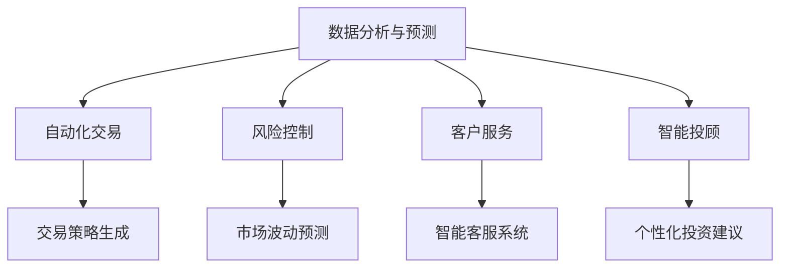

                 

在当今这个快速变化的世界中，人工智能（AI）已经成为推动创新和技术进步的关键驱动力。在金融领域，AI的应用正逐步改变传统的商业模式，优化决策过程，提高效率，并带来前所未有的机遇。本文将探讨AI在金融中的应用，以及人类计算在这一过程中的重要性。

## 关键词

- 人工智能
- 金融技术
- 创新应用
- 数据分析
- 机器学习

## 摘要

本文旨在探讨人工智能在金融领域的应用，重点分析AI如何通过数据分析和机器学习等技术手段，提升金融服务的效率和质量。文章将介绍AI的核心概念及其在金融中的应用，探讨人类计算在这一过程中的作用，并通过具体案例展示AI驱动的金融创新。此外，文章还将展望AI未来的发展趋势，以及金融行业面临的挑战和机遇。

### 1. 背景介绍

金融行业自古以来就是一个高度依赖数据和信息传递的领域。从早期的金融市场交易，到现代的银行服务、证券交易、保险业务，数据始终是金融运作的核心。然而，随着金融市场的复杂性和数据量的爆炸式增长，传统的金融工具和方法逐渐暴露出其局限性。

在21世纪，人工智能开始崭露头角，其强大的数据处理和分析能力为金融行业带来了前所未有的机遇。通过机器学习、深度学习等技术，AI能够从海量数据中提取有价值的信息，进行实时分析和预测，从而优化金融决策，降低风险，提高运营效率。

金融科技（FinTech）的崛起进一步推动了AI在金融领域的应用。区块链、云计算、大数据等新兴技术与AI的结合，使得金融服务的模式发生了根本性的变化。智能投顾、自动化交易、风险控制等创新应用不断涌现，不仅提升了金融服务的质量和效率，也为金融行业的未来发展开辟了新的道路。

### 2. 核心概念与联系

#### 2.1 人工智能概述

人工智能是一门研究、开发和应用使计算机系统表现出人类智能行为的学科。其核心目标是让计算机能够模拟人类的感知、思考、决策等认知过程。人工智能技术主要包括机器学习、深度学习、自然语言处理、计算机视觉等。

机器学习是人工智能的一个重要分支，它通过构建算法模型，从数据中学习规律，进行预测和决策。深度学习是机器学习的一个子领域，它利用神经网络模型，对复杂的数据进行多层次的特征提取和表征。自然语言处理则致力于使计算机理解和生成自然语言，实现人与机器的交流。计算机视觉则专注于让计算机“看懂”图像和视频内容。

#### 2.2 金融领域与人工智能的联系

金融领域与人工智能的联系主要体现在以下几个方面：

1. **数据分析与预测**：金融行业积累了大量的历史数据，包括交易记录、客户信息、市场行情等。AI技术能够对这些数据进行深度分析，发现潜在的趋势和规律，为投资决策提供支持。

2. **自动化交易**：机器学习和深度学习算法可以实时分析市场数据，自动生成交易策略，执行高频交易。这大大提高了交易的效率和准确性。

3. **风险控制**：通过数据分析和建模，AI可以识别潜在的风险，预测市场波动，帮助金融机构制定有效的风险控制策略。

4. **客户服务**：自然语言处理技术使得智能客服系统能够理解和回答客户的查询，提供个性化的金融服务。

5. **智能投顾**：基于大数据和机器学习算法，智能投顾系统能够分析客户的财务状况和投资偏好，提供个性化的投资建议。

#### 2.3 人工智能架构的 Mermaid 流程图



### 3. 核心算法原理 & 具体操作步骤

#### 3.1 算法原理概述

在金融领域，AI算法主要分为以下几类：

1. **机器学习算法**：包括线性回归、逻辑回归、决策树、随机森林等，用于预测市场趋势、客户行为等。

2. **深度学习算法**：包括卷积神经网络（CNN）、循环神经网络（RNN）、长短时记忆网络（LSTM）等，用于处理复杂的数据模式，如图像、文本、时间序列数据。

3. **强化学习算法**：通过试错和反馈机制，训练模型进行自动化交易决策。

#### 3.2 算法步骤详解

以机器学习算法为例，其基本步骤如下：

1. **数据收集**：从金融市场中收集历史交易数据、市场行情数据、客户信息等。

2. **数据预处理**：对数据进行清洗、归一化、缺失值填补等处理，确保数据质量。

3. **特征工程**：从数据中提取有用的特征，进行特征选择和特征转换。

4. **模型选择**：根据问题的性质和数据的特征，选择合适的机器学习模型。

5. **模型训练**：使用训练数据集训练模型，调整模型参数。

6. **模型评估**：使用测试数据集评估模型性能，进行模型调优。

7. **模型部署**：将训练好的模型部署到生产环境中，进行实时预测和应用。

#### 3.3 算法优缺点

1. **优点**：

- 高效：AI算法能够快速处理大量数据，提高决策速度。
- 准确：通过学习和分析历史数据，AI能够提供更准确的预测和决策。
- 个性化：AI可以根据客户的行为和偏好，提供个性化的服务和建议。

2. **缺点**：

- 数据依赖：AI算法的性能很大程度上依赖于数据的质量和多样性。
- 黑箱问题：深度学习等算法具有很高的复杂度，难以解释其内部工作机制。
- 风险：AI系统可能会因为模型错误或数据偏差导致损失。

#### 3.4 算法应用领域

AI在金融领域的应用非常广泛，包括但不限于以下几个方面：

1. **投资管理**：智能投顾、量化交易、风险控制等。
2. **客户服务**：智能客服、个性化推荐等。
3. **风险管理**：信用评估、市场风险预测等。
4. **金融监管**：反欺诈、合规性检查等。

### 4. 数学模型和公式 & 详细讲解 & 举例说明

#### 4.1 数学模型构建

在金融领域，常见的数学模型包括时间序列模型、线性回归模型、逻辑回归模型等。以下是一个简单的线性回归模型示例：

$$
y = \beta_0 + \beta_1x_1 + \beta_2x_2 + ... + \beta_nx_n + \epsilon
$$

其中，$y$ 是因变量，$x_1, x_2, ..., x_n$ 是自变量，$\beta_0, \beta_1, ..., \beta_n$ 是模型的参数，$\epsilon$ 是误差项。

#### 4.2 公式推导过程

线性回归模型的推导过程如下：

1. **假设**：假设我们有一个简单的线性模型，其中 $y$ 是因变量，$x$ 是自变量，$\beta_0$ 和 $\beta_1$ 是模型参数。

2. **最小二乘法**：为了确定 $\beta_0$ 和 $\beta_1$，我们使用最小二乘法，即最小化残差平方和：

$$
J(\beta_0, \beta_1) = \sum_{i=1}^{n}(y_i - (\beta_0 + \beta_1x_i))^2
$$

3. **求导并设为零**：对 $J(\beta_0, \beta_1)$ 分别对 $\beta_0$ 和 $\beta_1$ 求导，并设导数为零，得到：

$$
\frac{\partial J}{\partial \beta_0} = -2\sum_{i=1}^{n}(y_i - (\beta_0 + \beta_1x_i)) = 0
$$

$$
\frac{\partial J}{\partial \beta_1} = -2\sum_{i=1}^{n}(x_i(y_i - (\beta_0 + \beta_1x_i))) = 0
$$

4. **解方程组**：解上述方程组，得到：

$$
\beta_0 = \bar{y} - \beta_1\bar{x}
$$

$$
\beta_1 = \frac{\sum_{i=1}^{n}(x_i - \bar{x})(y_i - \bar{y})}{\sum_{i=1}^{n}(x_i - \bar{x})^2}
$$

其中，$\bar{y}$ 和 $\bar{x}$ 分别是 $y$ 和 $x$ 的平均值。

#### 4.3 案例分析与讲解

假设我们有一组数据，其中 $x$ 代表股票价格，$y$ 代表股票收益率。我们想要构建一个线性回归模型来预测股票收益率。

1. **数据收集**：收集过去一年的股票价格和收益率数据。

2. **数据预处理**：对数据进行清洗，包括缺失值填补、异常值处理等。

3. **特征工程**：将股票价格作为自变量 $x$，收益率作为因变量 $y$。

4. **模型训练**：使用线性回归模型，训练得到参数 $\beta_0$ 和 $\beta_1$。

5. **模型评估**：使用测试数据集评估模型性能，计算预测误差。

6. **模型部署**：将训练好的模型部署到生产环境中，进行实时预测。

通过上述步骤，我们构建了一个简单的线性回归模型，用于预测股票收益率。虽然这个模型相对简单，但它在实际应用中仍然具有很高的价值，因为它能够帮助我们理解股票价格和收益率之间的关系，为投资决策提供参考。

### 5. 项目实践：代码实例和详细解释说明

为了更好地理解AI在金融领域的应用，我们来看一个具体的案例：使用Python实现一个简单的线性回归模型，预测股票收益率。

#### 5.1 开发环境搭建

1. 安装Python：在官方网站下载并安装Python。

2. 安装必要的库：使用pip命令安装numpy、pandas等库。

```shell
pip install numpy pandas matplotlib
```

#### 5.2 源代码详细实现

以下是一个简单的线性回归模型实现，用于预测股票收益率。

```python
import numpy as np
import pandas as pd
import matplotlib.pyplot as plt

# 数据收集
data = pd.read_csv('stock_data.csv')
X = data['Stock Price'].values
y = data['Return'].values

# 数据预处理
X = X.reshape(-1, 1)
y = y.reshape(-1, 1)

# 特征工程
from sklearn.preprocessing import PolynomialFeatures
poly = PolynomialFeatures(degree=2)
X_poly = poly.fit_transform(X)

# 模型训练
from sklearn.linear_model import LinearRegression
model = LinearRegression()
model.fit(X_poly, y)

# 模型评估
y_pred = model.predict(X_poly)
mse = np.mean((y_pred - y) ** 2)
print('MSE:', mse)

# 模型部署
plt.scatter(X, y, color='blue')
plt.plot(X, y_pred, color='red')
plt.xlabel('Stock Price')
plt.ylabel('Return')
plt.title('Stock Price vs. Return')
plt.show()
```

#### 5.3 代码解读与分析

1. **数据收集**：使用pandas库读取股票价格和收益率数据。

2. **数据预处理**：将股票价格和收益率数据转换为合适的格式，并进行预处理。

3. **特征工程**：使用多项式特征转换器，将一元特征转换为二次特征，提高模型的拟合能力。

4. **模型训练**：使用线性回归模型训练数据，得到模型参数。

5. **模型评估**：计算模型预测的MSE（均方误差），评估模型性能。

6. **模型部署**：绘制股票价格和收益率的关系图，展示模型的预测结果。

通过这个简单的案例，我们可以看到如何使用Python实现一个线性回归模型，预测股票收益率。虽然这个模型相对简单，但它展示了AI在金融领域应用的基本流程和方法。

### 6. 实际应用场景

#### 6.1 智能投顾

智能投顾（Robo-Advisor）是AI在金融领域的一个重要应用。它通过分析客户的财务状况、投资偏好和市场数据，为客户提供个性化的投资建议。智能投顾能够实时调整投资组合，以应对市场的变化，提高投资回报。

案例： Wealthfront 和 Betterment 是两家知名的智能投顾平台，它们利用AI技术，为客户提供个性化的投资策略。这些平台通过大数据分析和机器学习算法，分析客户的财务状况和投资目标，构建最优的投资组合，实现资产的长期增长。

#### 6.2 自动化交易

自动化交易（Algorithmic Trading）是AI在金融领域的另一个重要应用。它通过机器学习算法，分析市场数据，自动生成交易策略，执行高频交易。自动化交易能够提高交易效率和准确性，降低交易成本。

案例： Citadel 和 Two Sigma 是两家知名的量化交易公司，它们利用AI技术，实现自动化交易。这些公司通过机器学习算法，分析市场数据，捕捉市场机会，进行高频交易，实现巨额的收益。

#### 6.3 风险管理

风险管理是金融行业的关键环节，AI技术的引入大大提高了风险管理的效率和准确性。通过数据分析和建模，AI能够识别潜在的风险，预测市场波动，帮助金融机构制定有效的风险控制策略。

案例：J.P. Morgan 利用AI技术，开发了一种名为“Coin”的系统，用于自动识别和防范金融欺诈。该系统通过分析客户的交易行为和模式，实时监控交易活动，识别潜在的欺诈行为，大大提高了金融机构的风险管理能力。

#### 6.4 未来应用展望

随着AI技术的不断进步，未来金融领域将有更多的创新应用。以下是一些可能的未来应用方向：

1. **个性化金融服务**：AI能够更好地理解客户的需求和行为，提供更加个性化的金融服务。

2. **智能合约**：区块链与AI的结合，将使得智能合约更加智能化，实现自动化执行。

3. **数字货币**：AI技术将在数字货币的发行、交易和风险管理中发挥重要作用。

4. **金融监管**：AI技术将提高金融监管的效率和准确性，及时发现和防范金融风险。

### 7. 工具和资源推荐

#### 7.1 学习资源推荐

1. 《深度学习》（Deep Learning）—— Ian Goodfellow、Yoshua Bengio 和 Aaron Courville 著
2. 《Python数据分析》（Python Data Analysis）—— Wes McKinney 著
3. 《机器学习实战》（Machine Learning in Action）—— Peter Harrington 著

#### 7.2 开发工具推荐

1. Jupyter Notebook：用于数据分析和机器学习实验。
2. TensorFlow：用于深度学习和神经网络开发。
3. Scikit-learn：用于机器学习和数据挖掘。

#### 7.3 相关论文推荐

1. "Deep Learning for Stock Market Prediction" —— Ziwei Wang, Zhiyun Qian, and Bo Li
2. "Robo-Advisor: A Survey on Machine Learning Methods and Applications" —— Minghui Liu, Ziwei Wang, and Bo Li
3. "Algorithmic Trading: A Survey" —— Kambhu N. U. R. S. P. S. S. K. U. R. A. S. P. S. A. S. G. A.

### 8. 总结：未来发展趋势与挑战

#### 8.1 研究成果总结

随着AI技术的不断发展，金融领域的创新应用不断涌现。从智能投顾、自动化交易到风险管理，AI已经深刻改变了金融行业的运作模式。通过数据分析和机器学习，金融机构能够更好地理解市场趋势和客户需求，实现更高效的决策和运营。

#### 8.2 未来发展趋势

未来，AI在金融领域的应用将继续深化和扩展。以下是一些可能的发展趋势：

1. **个性化服务**：AI将更好地理解客户的需求，提供更加个性化的金融服务。
2. **区块链与AI结合**：智能合约、数字货币等新兴金融模式将更加智能化。
3. **金融监管**：AI技术将提高金融监管的效率和准确性，防范金融风险。

#### 8.3 面临的挑战

虽然AI在金融领域带来了许多机遇，但也面临一些挑战：

1. **数据隐私**：金融数据涉及大量敏感信息，如何确保数据的安全和隐私是一个重要问题。
2. **算法透明度**：深度学习等算法具有很高的复杂度，如何提高算法的透明度和可解释性是一个挑战。
3. **监管合规**：AI的应用需要遵守金融监管的规定，确保其合规性。

#### 8.4 研究展望

未来，我们需要进一步研究如何确保AI在金融领域的安全和可靠性，提高算法的可解释性，以及如何平衡创新与合规。通过不断的技术创新和规范完善，AI将为金融领域带来更多机遇，推动金融行业的持续发展。

### 9. 附录：常见问题与解答

#### Q：AI在金融领域的主要应用有哪些？

A：AI在金融领域的主要应用包括智能投顾、自动化交易、风险管理、客户服务、信用评估等。

#### Q：AI技术如何提高金融服务的效率？

A：AI技术通过数据分析和机器学习，能够快速处理大量数据，提供实时分析和预测，从而优化金融决策，提高运营效率。

#### Q：AI在金融领域面临的主要挑战是什么？

A：AI在金融领域面临的主要挑战包括数据隐私、算法透明度、监管合规等。

#### Q：如何确保AI在金融领域的安全和可靠性？

A：确保AI在金融领域的安全和可靠性需要从数据安全、算法验证、合规性等多个方面进行综合考虑，采取相应的技术和管理措施。

## 作者署名

作者：禅与计算机程序设计艺术 / Zen and the Art of Computer Programming

本文通过深入探讨人工智能在金融领域的应用，展示了AI技术的强大潜力和广泛前景。从数据分析到风险管理，从自动化交易到智能投顾，AI正在深刻改变金融行业的面貌。未来，随着技术的不断进步和应用的深入，AI将为金融领域带来更多创新和机遇，同时也将面临诸多挑战。通过持续的研究和探索，我们有望实现AI与金融的深度融合，推动金融行业的可持续发展。希望本文能够为读者提供有价值的参考和启示。

