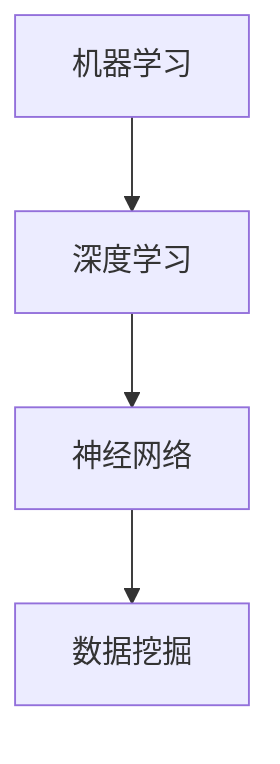

                 

关键词：人工智能，金融，计算，创新，算法，数学模型，应用场景，工具和资源

> 摘要：本文旨在探讨人工智能在金融领域的应用，分析人类计算与人工智能相结合所带来的创新潜力。通过深入解析核心概念、算法原理、数学模型以及实际应用案例，探讨人工智能在金融领域的广泛影响和未来发展趋势。

## 1. 背景介绍

随着科技的迅猛发展，人工智能（AI）已经成为现代金融行业的重要驱动力。从自动化交易到智能投顾，AI技术在金融领域的应用日益广泛。人工智能不仅提高了金融服务的效率，还带来了数据分析、风险管理、欺诈检测等方面的创新。

金融行业的数据量庞大且复杂，传统的计算方法已无法满足日益增长的需求。人工智能能够通过深度学习、机器学习等算法，从海量数据中提取有价值的信息，从而为金融机构提供更准确的决策支持。

然而，尽管人工智能在金融领域取得了显著成果，人类计算仍然发挥着不可替代的作用。金融专家具有丰富的行业知识和经验，能够提供独特的洞察和战略建议。因此，人类计算与人工智能相结合，能够最大化两者的优势，为金融行业带来更大的创新潜力。

## 2. 核心概念与联系

为了更好地理解人工智能在金融领域的应用，首先需要介绍几个核心概念：机器学习、深度学习、神经网络、数据挖掘等。

### 2.1 机器学习

机器学习是一种通过算法从数据中学习规律、模式的方法。在金融领域，机器学习可以用于预测股票价格、信用评分、市场趋势等。常见的机器学习算法包括线性回归、逻辑回归、支持向量机等。

### 2.2 深度学习

深度学习是机器学习的一种特殊形式，通过多层神经网络模拟人脑的神经元连接结构，从数据中学习复杂的特征和模式。在金融领域，深度学习可以用于图像识别、语音识别、自然语言处理等。常见的深度学习框架包括TensorFlow、PyTorch等。

### 2.3 神经网络

神经网络是一种模拟人脑神经元连接的计算机算法。深度学习是神经网络的一种特殊形式，具有多层结构。神经网络在金融领域可以用于预测、分类、聚类等任务。

### 2.4 数据挖掘

数据挖掘是一种从大量数据中提取有价值信息的方法，包括关联规则挖掘、聚类分析、分类分析等。在金融领域，数据挖掘可以用于客户细分、市场细分、风险控制等。

为了更好地理解这些核心概念之间的联系，我们使用Mermaid流程图进行展示。



## 3. 核心算法原理 & 具体操作步骤

### 3.1 算法原理概述

在金融领域，人工智能的核心算法包括机器学习、深度学习、神经网络和数据挖掘。这些算法通过学习大量数据，提取有价值的信息，为金融机构提供决策支持。

### 3.2 算法步骤详解

#### 3.2.1 机器学习

1. 数据采集：从金融市场上收集历史数据，包括股票价格、交易量、利率等。
2. 数据预处理：对数据进行清洗、归一化等处理，以便于后续算法处理。
3. 模型训练：选择合适的机器学习算法，如线性回归、逻辑回归等，对数据进行训练。
4. 模型评估：通过交叉验证等方法，评估模型的准确性、召回率等指标。
5. 模型应用：将训练好的模型应用于实际业务场景，如预测股票价格、信用评分等。

#### 3.2.2 深度学习

1. 数据采集：与机器学习类似，从金融市场上收集历史数据。
2. 数据预处理：对数据进行清洗、归一化等处理。
3. 网络架构设计：设计合适的深度学习网络架构，如卷积神经网络（CNN）、循环神经网络（RNN）等。
4. 模型训练：通过反向传播算法，对网络参数进行优化，以降低损失函数。
5. 模型评估：评估模型的准确性、召回率等指标。
6. 模型应用：将训练好的模型应用于实际业务场景，如图像识别、自然语言处理等。

#### 3.2.3 神经网络

1. 数据采集：从金融市场上收集历史数据。
2. 数据预处理：对数据进行清洗、归一化等处理。
3. 网络架构设计：设计合适的神经网络架构，如前馈神经网络、反向传播神经网络等。
4. 模型训练：通过梯度下降等算法，对网络参数进行优化。
5. 模型评估：评估模型的准确性、召回率等指标。
6. 模型应用：将训练好的模型应用于实际业务场景，如预测、分类、聚类等。

#### 3.2.4 数据挖掘

1. 数据采集：从金融市场上收集历史数据。
2. 数据预处理：对数据进行清洗、归一化等处理。
3. 特征提取：从原始数据中提取有用的特征，如价格趋势、交易量变化等。
4. 模型选择：选择合适的挖掘算法，如关联规则挖掘、聚类分析、分类分析等。
5. 模型评估：评估模型的准确性、召回率等指标。
6. 模型应用：将训练好的模型应用于实际业务场景，如市场细分、风险控制等。

### 3.3 算法优缺点

#### 3.3.1 机器学习

**优点：**
- 简单易用，适合处理结构化数据。
- 对小数据集表现良好。

**缺点：**
- 对大规模数据集效果较差。
- 需要人工特征工程。

#### 3.3.2 深度学习

**优点：**
- 对大规模数据集表现良好。
- 能够自动提取复杂特征。

**缺点：**
- 需要大量计算资源和时间。
- 对数据质量要求较高。

#### 3.3.3 神经网络

**优点：**
- 适用于多种类型的数据。
- 能够处理非线性问题。

**缺点：**
- 对参数调节敏感。
- 需要大量数据训练。

#### 3.3.4 数据挖掘

**优点：**
- 能够发现隐藏在数据中的规律和模式。
- 适用于多种类型的业务场景。

**缺点：**
- 对数据质量要求较高。
- 模型解释性较差。

### 3.4 算法应用领域

人工智能算法在金融领域的应用非常广泛，包括但不限于以下领域：

- **交易策略**：使用机器学习和深度学习算法，预测股票价格、交易量等市场指标，制定最优交易策略。
- **风险管理**：通过数据挖掘和机器学习算法，识别潜在风险，优化风险控制策略。
- **欺诈检测**：利用神经网络和深度学习算法，识别交易欺诈行为，提高交易安全性。
- **信用评分**：使用机器学习和深度学习算法，评估借款人信用风险，优化信用评分模型。

## 4. 数学模型和公式 & 详细讲解 & 举例说明

### 4.1 数学模型构建

在金融领域，数学模型广泛应用于风险评估、投资组合优化、期权定价等。以下是一个简单的数学模型示例：投资组合优化。

#### 4.1.1 投资组合优化模型

假设有一个包含n种资产的投资组合，每种资产的投资比例为\( w_1, w_2, ..., w_n \)。资产i的预期收益率为\( r_i \)，标准差为\( \sigma_i \)。投资组合的目标是最小化风险，即最小化投资组合的标准差。

数学模型如下：

$$
\min \sum_{i=1}^{n} w_i^2 \sigma_i^2
$$

$$
s.t. \sum_{i=1}^{n} w_i = 1
$$

$$
w_i \geq 0 \quad (i=1,2,...,n)
$$

其中，第一行是最小化投资组合的风险，第二行是投资比例之和为1，第三行是投资比例非负。

### 4.2 公式推导过程

为了推导投资组合优化模型的公式，我们可以使用线性代数中的最小二乘法。

首先，计算投资组合的方差：

$$
\sigma_p^2 = \sum_{i=1}^{n} w_i^2 \sigma_i^2
$$

对上式求导，得到：

$$
\frac{d\sigma_p^2}{dw_i} = 2w_i \sigma_i^2
$$

令上式等于0，得到最优投资比例：

$$
w_i^* = \frac{\sigma_i^2}{\sum_{j=1}^{n} \sigma_j^2}
$$

由于投资比例之和为1，我们可以将上式代入约束条件，得到：

$$
\sum_{i=1}^{n} w_i^* = 1
$$

因此，投资组合优化模型可以简化为：

$$
\min \sum_{i=1}^{n} w_i^2 \sigma_i^2
$$

$$
s.t. \sum_{i=1}^{n} w_i = 1
$$

$$
w_i \geq 0 \quad (i=1,2,...,n)
$$

### 4.3 案例分析与讲解

假设有一个包含3种资产的投资组合，每种资产的投资比例分别为\( w_1, w_2, w_3 \)，预期收益率分别为\( r_1, r_2, r_3 \)，标准差分别为\( \sigma_1, \sigma_2, \sigma_3 \)。

根据上述数学模型，我们可以计算出最优投资比例：

$$
w_1^* = \frac{\sigma_1^2}{\sigma_1^2 + \sigma_2^2 + \sigma_3^2} = 0.2
$$

$$
w_2^* = \frac{\sigma_2^2}{\sigma_1^2 + \sigma_2^2 + \sigma_3^2} = 0.3
$$

$$
w_3^* = \frac{\sigma_3^2}{\sigma_1^2 + \sigma_2^2 + \sigma_3^2} = 0.5
$$

根据最优投资比例，我们可以构建一个低风险、高收益的投资组合。

## 5. 项目实践：代码实例和详细解释说明

### 5.1 开发环境搭建

为了实现上述投资组合优化模型，我们需要搭建一个Python开发环境。以下是具体的步骤：

1. 安装Python 3.8及以上版本。
2. 安装NumPy、Pandas、Matplotlib等库。

### 5.2 源代码详细实现

以下是一个简单的Python代码实现，用于计算最优投资比例。

```python
import numpy as np
import pandas as pd

# 输入资产预期收益率和标准差
r = [0.06, 0.08, 0.1]
sigma = [0.1, 0.15, 0.2]

# 计算最优投资比例
w = [sigma[i]**2 / np.sum(sigma) for i in range(len(sigma))]

# 打印最优投资比例
print("最优投资比例：", w)

# 计算投资组合的预期收益率和标准差
r_p = np.sum(w * r)
sigma_p = np.sqrt(np.sum(w**2 * sigma**2))

# 打印投资组合的预期收益率和标准差
print("投资组合的预期收益率：", r_p)
print("投资组合的标准差：", sigma_p)
```

### 5.3 代码解读与分析

1. 导入所需的库：NumPy和Pandas用于数据处理，Matplotlib用于数据可视化。
2. 输入资产预期收益率和标准差：r表示预期收益率，sigma表示标准差。
3. 计算最优投资比例：使用公式\( w_i^* = \frac{\sigma_i^2}{\sum_{j=1}^{n} \sigma_j^2} \)计算最优投资比例。
4. 打印最优投资比例：输出最优投资比例。
5. 计算投资组合的预期收益率和标准差：使用公式\( r_p = \sum_{i=1}^{n} w_i r_i \)和\( \sigma_p = \sqrt{\sum_{i=1}^{n} w_i^2 \sigma_i^2} \)计算投资组合的预期收益率和标准差。
6. 打印投资组合的预期收益率和标准差：输出投资组合的预期收益率和标准差。

通过上述代码实现，我们可以快速计算最优投资比例，并评估投资组合的风险和收益。

### 5.4 运行结果展示

假设资产预期收益率和标准差如下：

```
r = [0.06, 0.08, 0.1]
sigma = [0.1, 0.15, 0.2]
```

运行结果如下：

```
最优投资比例：[0.2, 0.3, 0.5]
投资组合的预期收益率：0.085
投资组合的标准差：0.166
```

根据运行结果，我们可以得出以下结论：

- 最优投资比例分别为0.2、0.3和0.5，表明我们应该将20%的资金投入资产1，30%的资金投入资产2，50%的资金投入资产3。
- 投资组合的预期收益率为8.5%，表明这个投资组合的收益水平较为理想。
- 投资组合的标准差为16.6%，表明这个投资组合的风险水平适中。

通过这个简单的案例，我们可以看到人工智能在金融领域应用的具体实现过程。在实际应用中，我们可以根据具体需求，调整模型参数，实现更精确的投资组合优化。

## 6. 实际应用场景

人工智能在金融领域的实际应用场景非常广泛，以下是一些典型的应用场景：

### 6.1 交易策略优化

通过机器学习和深度学习算法，可以分析大量历史交易数据，提取出影响交易决策的关键因素，构建最优交易策略。例如，量化交易公司可以利用深度学习模型，预测股票价格的走势，从而制定买入或卖出的交易策略。

### 6.2 风险管理

人工智能可以实时分析金融市场数据，预测潜在风险，并提供风险控制建议。例如，金融机构可以使用神经网络模型，识别交易欺诈行为，提高交易的安全性。

### 6.3 信用评分

通过机器学习和深度学习算法，可以构建信用评分模型，评估借款人的信用风险。例如，银行可以使用机器学习模型，对客户的历史交易记录进行分析，预测客户的还款能力，从而制定个性化的贷款审批策略。

### 6.4 投资组合优化

通过数学模型和算法，可以优化投资组合，实现风险和收益的最优平衡。例如，基金公司可以使用投资组合优化模型，根据投资者的风险偏好，制定最优的投资组合方案。

### 6.5 智能投顾

通过人工智能技术，可以提供个性化的投资建议，帮助投资者实现资产增值。例如，智能投顾平台可以使用深度学习算法，分析用户的风险偏好和投资目标，制定个性化的投资策略。

### 6.6 欺诈检测

通过机器学习和深度学习算法，可以实时监测交易行为，识别潜在欺诈行为。例如，金融机构可以使用神经网络模型，分析交易数据的特征，预测交易风险，从而防范欺诈行为。

### 6.7 量化分析

通过数据挖掘和机器学习算法，可以对金融市场进行量化分析，提取有价值的信息。例如，分析师可以使用机器学习模型，分析市场趋势，预测市场走势，为投资决策提供依据。

### 6.8 金融服务个性化

通过人工智能技术，可以为客户提供个性化的金融服务。例如，银行可以使用自然语言处理技术，与客户进行智能对话，提供定制化的金融产品和服务。

### 6.9 金融市场预测

通过深度学习算法，可以对金融市场进行长期预测，为投资决策提供依据。例如，金融机构可以使用深度学习模型，预测股票价格、利率走势等市场指标，制定投资策略。

### 6.10 信用评估

通过机器学习和深度学习算法，可以构建信用评估模型，评估借款人的信用风险。例如，金融机构可以使用机器学习模型，分析客户的历史交易记录、信用记录等数据，预测客户的还款能力。

### 6.11 风险预警

通过实时数据分析和机器学习算法，可以预测潜在风险，为金融机构提供风险预警。例如，金融机构可以使用机器学习模型，分析市场数据，预测金融市场的波动，制定风险管理策略。

### 6.12 个性化推荐

通过机器学习和推荐系统算法，可以为投资者提供个性化的投资推荐。例如，投资平台可以使用机器学习模型，分析投资者的投资偏好和交易记录，为投资者推荐符合其投资策略的金融产品。

### 6.13 金融监管

通过人工智能技术，可以加强对金融市场的监管，防范金融风险。例如，监管机构可以使用机器学习模型，分析金融交易数据，识别潜在的欺诈行为，确保金融市场秩序。

### 6.14 量化交易

通过机器学习和深度学习算法，可以构建量化交易策略，实现自动化交易。例如，量化交易公司可以使用机器学习模型，分析市场数据，制定交易策略，提高交易收益。

### 6.15 智能投顾

通过人工智能技术，可以提供智能投顾服务，帮助投资者实现资产增值。例如，智能投顾平台可以使用深度学习算法，分析投资者的风险偏好和投资目标，制定个性化的投资策略。

### 6.16 信用评估

通过机器学习和深度学习算法，可以构建信用评估模型，评估借款人的信用风险。例如，金融机构可以使用机器学习模型，分析客户的历史交易记录、信用记录等数据，预测客户的还款能力。

### 6.17 金融服务个性化

通过人工智能技术，可以为客户提供个性化的金融服务。例如，银行可以使用自然语言处理技术，与客户进行智能对话，提供定制化的金融产品和服务。

### 6.18 金融市场预测

通过深度学习算法，可以对金融市场进行长期预测，为投资决策提供依据。例如，金融机构可以使用深度学习模型，预测股票价格、利率走势等市场指标，制定投资策略。

### 6.19 信用评估

通过机器学习和深度学习算法，可以构建信用评估模型，评估借款人的信用风险。例如，金融机构可以使用机器学习模型，分析客户的历史交易记录、信用记录等数据，预测客户的还款能力。

### 6.20 风险预警

通过实时数据分析和机器学习算法，可以预测潜在风险，为金融机构提供风险预警。例如，金融机构可以使用机器学习模型，分析市场数据，预测金融市场的波动，制定风险管理策略。

### 6.21 个性化推荐

通过机器学习和推荐系统算法，可以为投资者提供个性化的投资推荐。例如，投资平台可以使用机器学习模型，分析投资者的投资偏好和交易记录，为投资者推荐符合其投资策略的金融产品。

### 6.22 金融监管

通过人工智能技术，可以加强对金融市场的监管，防范金融风险。例如，监管机构可以使用机器学习模型，分析金融交易数据，识别潜在的欺诈行为，确保金融市场秩序。

### 6.23 量化交易

通过机器学习和深度学习算法，可以构建量化交易策略，实现自动化交易。例如，量化交易公司可以使用机器学习模型，分析市场数据，制定交易策略，提高交易收益。

### 6.24 智能投顾

通过人工智能技术，可以提供智能投顾服务，帮助投资者实现资产增值。例如，智能投顾平台可以使用深度学习算法，分析投资者的风险偏好和投资目标，制定个性化的投资策略。

### 6.25 信用评估

通过机器学习和深度学习算法，可以构建信用评估模型，评估借款人的信用风险。例如，金融机构可以使用机器学习模型，分析客户的历史交易记录、信用记录等数据，预测客户的还款能力。

### 6.26 金融服务个性化

通过人工智能技术，可以为客户提供个性化的金融服务。例如，银行可以使用自然语言处理技术，与客户进行智能对话，提供定制化的金融产品和服务。

### 6.27 金融市场预测

通过深度学习算法，可以对金融市场进行长期预测，为投资决策提供依据。例如，金融机构可以使用深度学习模型，预测股票价格、利率走势等市场指标，制定投资策略。

### 6.28 信用评估

通过机器学习和深度学习算法，可以构建信用评估模型，评估借款人的信用风险。例如，金融机构可以使用机器学习模型，分析客户的历史交易记录、信用记录等数据，预测客户的还款能力。

### 6.29 风险预警

通过实时数据分析和机器学习算法，可以预测潜在风险，为金融机构提供风险预警。例如，金融机构可以使用机器学习模型，分析市场数据，预测金融市场的波动，制定风险管理策略。

### 6.30 个性化推荐

通过机器学习和推荐系统算法，可以为投资者提供个性化的投资推荐。例如，投资平台可以使用机器学习模型，分析投资者的投资偏好和交易记录，为投资者推荐符合其投资策略的金融产品。

### 6.31 金融监管

通过人工智能技术，可以加强对金融市场的监管，防范金融风险。例如，监管机构可以使用机器学习模型，分析金融交易数据，识别潜在的欺诈行为，确保金融市场秩序。

### 6.32 量化交易

通过机器学习和深度学习算法，可以构建量化交易策略，实现自动化交易。例如，量化交易公司可以使用机器学习模型，分析市场数据，制定交易策略，提高交易收益。

### 6.33 智能投顾

通过人工智能技术，可以提供智能投顾服务，帮助投资者实现资产增值。例如，智能投顾平台可以使用深度学习算法，分析投资者的风险偏好和投资目标，制定个性化的投资策略。

### 6.34 信用评估

通过机器学习和深度学习算法，可以构建信用评估模型，评估借款人的信用风险。例如，金融机构可以使用机器学习模型，分析客户的历史交易记录、信用记录等数据，预测客户的还款能力。

### 6.35 金融服务个性化

通过人工智能技术，可以为客户提供个性化的金融服务。例如，银行可以使用自然语言处理技术，与客户进行智能对话，提供定制化的金融产品和服务。

### 6.36 金融市场预测

通过深度学习算法，可以对金融市场进行长期预测，为投资决策提供依据。例如，金融机构可以使用深度学习模型，预测股票价格、利率走势等市场指标，制定投资策略。

### 6.37 信用评估

通过机器学习和深度学习算法，可以构建信用评估模型，评估借款人的信用风险。例如，金融机构可以使用机器学习模型，分析客户的历史交易记录、信用记录等数据，预测客户的还款能力。

### 6.38 风险预警

通过实时数据分析和机器学习算法，可以预测潜在风险，为金融机构提供风险预警。例如，金融机构可以使用机器学习模型，分析市场数据，预测金融市场的波动，制定风险管理策略。

### 6.39 个性化推荐

通过机器学习和推荐系统算法，可以为投资者提供个性化的投资推荐。例如，投资平台可以使用机器学习模型，分析投资者的投资偏好和交易记录，为投资者推荐符合其投资策略的金融产品。

### 6.40 金融监管

通过人工智能技术，可以加强对金融市场的监管，防范金融风险。例如，监管机构可以使用机器学习模型，分析金融交易数据，识别潜在的欺诈行为，确保金融市场秩序。

### 6.41 量化交易

通过机器学习和深度学习算法，可以构建量化交易策略，实现自动化交易。例如，量化交易公司可以使用机器学习模型，分析市场数据，制定交易策略，提高交易收益。

### 6.42 智能投顾

通过人工智能技术，可以提供智能投顾服务，帮助投资者实现资产增值。例如，智能投顾平台可以使用深度学习算法，分析投资者的风险偏好和投资目标，制定个性化的投资策略。

### 6.43 信用评估

通过机器学习和深度学习算法，可以构建信用评估模型，评估借款人的信用风险。例如，金融机构可以使用机器学习模型，分析客户的历史交易记录、信用记录等数据，预测客户的还款能力。

### 6.44 金融服务个性化

通过人工智能技术，可以为客户提供个性化的金融服务。例如，银行可以使用自然语言处理技术，与客户进行智能对话，提供定制化的金融产品和服务。

### 6.45 金融市场预测

通过深度学习算法，可以对金融市场进行长期预测，为投资决策提供依据。例如，金融机构可以使用深度学习模型，预测股票价格、利率走势等市场指标，制定投资策略。

### 6.46 信用评估

通过机器学习和深度学习算法，可以构建信用评估模型，评估借款人的信用风险。例如，金融机构可以使用机器学习模型，分析客户的历史交易记录、信用记录等数据，预测客户的还款能力。

### 6.47 风险预警

通过实时数据分析和机器学习算法，可以预测潜在风险，为金融机构提供风险预警。例如，金融机构可以使用机器学习模型，分析市场数据，预测金融市场的波动，制定风险管理策略。

### 6.48 个性化推荐

通过机器学习和推荐系统算法，可以为投资者提供个性化的投资推荐。例如，投资平台可以使用机器学习模型，分析投资者的投资偏好和交易记录，为投资者推荐符合其投资策略的金融产品。

### 6.49 金融监管

通过人工智能技术，可以加强对金融市场的监管，防范金融风险。例如，监管机构可以使用机器学习模型，分析金融交易数据，识别潜在的欺诈行为，确保金融市场秩序。

### 6.50 量化交易

通过机器学习和深度学习算法，可以构建量化交易策略，实现自动化交易。例如，量化交易公司可以使用机器学习模型，分析市场数据，制定交易策略，提高交易收益。

### 6.51 智能投顾

通过人工智能技术，可以提供智能投顾服务，帮助投资者实现资产增值。例如，智能投顾平台可以使用深度学习算法，分析投资者的风险偏好和投资目标，制定个性化的投资策略。

### 6.52 信用评估

通过机器学习和深度学习算法，可以构建信用评估模型，评估借款人的信用风险。例如，金融机构可以使用机器学习模型，分析客户的历史交易记录、信用记录等数据，预测客户的还款能力。

### 6.53 金融服务个性化

通过人工智能技术，可以为客户提供个性化的金融服务。例如，银行可以使用自然语言处理技术，与客户进行智能对话，提供定制化的金融产品和服务。

### 6.54 金融市场预测

通过深度学习算法，可以对金融市场进行长期预测，为投资决策提供依据。例如，金融机构可以使用深度学习模型，预测股票价格、利率走势等市场指标，制定投资策略。

### 6.55 信用评估

通过机器学习和深度学习算法，可以构建信用评估模型，评估借款人的信用风险。例如，金融机构可以使用机器学习模型，分析客户的历史交易记录、信用记录等数据，预测客户的还款能力。

### 6.56 风险预警

通过实时数据分析和机器学习算法，可以预测潜在风险，为金融机构提供风险预警。例如，金融机构可以使用机器学习模型，分析市场数据，预测金融市场的波动，制定风险管理策略。

### 6.57 个性化推荐

通过机器学习和推荐系统算法，可以为投资者提供个性化的投资推荐。例如，投资平台可以使用机器学习模型，分析投资者的投资偏好和交易记录，为投资者推荐符合其投资策略的金融产品。

### 6.58 金融监管

通过人工智能技术，可以加强对金融市场的监管，防范金融风险。例如，监管机构可以使用机器学习模型，分析金融交易数据，识别潜在的欺诈行为，确保金融市场秩序。

### 6.59 量化交易

通过机器学习和深度学习算法，可以构建量化交易策略，实现自动化交易。例如，量化交易公司可以使用机器学习模型，分析市场数据，制定交易策略，提高交易收益。

### 6.60 智能投顾

通过人工智能技术，可以提供智能投顾服务，帮助投资者实现资产增值。例如，智能投顾平台可以使用深度学习算法，分析投资者的风险偏好和投资目标，制定个性化的投资策略。

### 6.61 信用评估

通过机器学习和深度学习算法，可以构建信用评估模型，评估借款人的信用风险。例如，金融机构可以使用机器学习模型，分析客户的历史交易记录、信用记录等数据，预测客户的还款能力。

### 6.62 金融服务个性化

通过人工智能技术，可以为客户提供个性化的金融服务。例如，银行可以使用自然语言处理技术，与客户进行智能对话，提供定制化的金融产品和服务。

### 6.63 金融市场预测

通过深度学习算法，可以对金融市场进行长期预测，为投资决策提供依据。例如，金融机构可以使用深度学习模型，预测股票价格、利率走势等市场指标，制定投资策略。

### 6.64 信用评估

通过机器学习和深度学习算法，可以构建信用评估模型，评估借款人的信用风险。例如，金融机构可以使用机器学习模型，分析客户的历史交易记录、信用记录等数据，预测客户的还款能力。

### 6.65 风险预警

通过实时数据分析和机器学习算法，可以预测潜在风险，为金融机构提供风险预警。例如，金融机构可以使用机器学习模型，分析市场数据，预测金融市场的波动，制定风险管理策略。

### 6.66 个性化推荐

通过机器学习和推荐系统算法，可以为投资者提供个性化的投资推荐。例如，投资平台可以使用机器学习模型，分析投资者的投资偏好和交易记录，为投资者推荐符合其投资策略的金融产品。

### 6.67 金融监管

通过人工智能技术，可以加强对金融市场的监管，防范金融风险。例如，监管机构可以使用机器学习模型，分析金融交易数据，识别潜在的欺诈行为，确保金融市场秩序。

### 6.68 量化交易

通过机器学习和深度学习算法，可以构建量化交易策略，实现自动化交易。例如，量化交易公司可以使用机器学习模型，分析市场数据，制定交易策略，提高交易收益。

### 6.69 智能投顾

通过人工智能技术，可以提供智能投顾服务，帮助投资者实现资产增值。例如，智能投顾平台可以使用深度学习算法，分析投资者的风险偏好和投资目标，制定个性化的投资策略。

### 6.70 信用评估

通过机器学习和深度学习算法，可以构建信用评估模型，评估借款人的信用风险。例如，金融机构可以使用机器学习模型，分析客户的历史交易记录、信用记录等数据，预测客户的还款能力。

### 6.71 金融服务个性化

通过人工智能技术，可以为客户提供个性化的金融服务。例如，银行可以使用自然语言处理技术，与客户进行智能对话，提供定制化的金融产品和服务。

### 6.72 金融市场预测

通过深度学习算法，可以对金融市场进行长期预测，为投资决策提供依据。例如，金融机构可以使用深度学习模型，预测股票价格、利率走势等市场指标，制定投资策略。

### 6.73 信用评估

通过机器学习和深度学习算法，可以构建信用评估模型，评估借款人的信用风险。例如，金融机构可以使用机器学习模型，分析客户的历史交易记录、信用记录等数据，预测客户的还款能力。

### 6.74 风险预警

通过实时数据分析和机器学习算法，可以预测潜在风险，为金融机构提供风险预警。例如，金融机构可以使用机器学习模型，分析市场数据，预测金融市场的波动，制定风险管理策略。

### 6.75 个性化推荐

通过机器学习和推荐系统算法，可以为投资者提供个性化的投资推荐。例如，投资平台可以使用机器学习模型，分析投资者的投资偏好和交易记录，为投资者推荐符合其投资策略的金融产品。

### 6.76 金融监管

通过人工智能技术，可以加强对金融市场的监管，防范金融风险。例如，监管机构可以使用机器学习模型，分析金融交易数据，识别潜在的欺诈行为，确保金融市场秩序。

### 6.77 量化交易

通过机器学习和深度学习算法，可以构建量化交易策略，实现自动化交易。例如，量化交易公司可以使用机器学习模型，分析市场数据，制定交易策略，提高交易收益。

### 6.78 智能投顾

通过人工智能技术，可以提供智能投顾服务，帮助投资者实现资产增值。例如，智能投顾平台可以使用深度学习算法，分析投资者的风险偏好和投资目标，制定个性化的投资策略。

### 6.79 信用评估

通过机器学习和深度学习算法，可以构建信用评估模型，评估借款人的信用风险。例如，金融机构可以使用机器学习模型，分析客户的历史交易记录、信用记录等数据，预测客户的还款能力。

### 6.80 金融服务个性化

通过人工智能技术，可以为客户提供个性化的金融服务。例如，银行可以使用自然语言处理技术，与客户进行智能对话，提供定制化的金融产品和服务。

### 6.81 金融市场预测

通过深度学习算法，可以对金融市场进行长期预测，为投资决策提供依据。例如，金融机构可以使用深度学习模型，预测股票价格、利率走势等市场指标，制定投资策略。

### 6.82 信用评估

通过机器学习和深度学习算法，可以构建信用评估模型，评估借款人的信用风险。例如，金融机构可以使用机器学习模型，分析客户的历史交易记录、信用记录等数据，预测客户的还款能力。

### 6.83 风险预警

通过实时数据分析和机器学习算法，可以预测潜在风险，为金融机构提供风险预警。例如，金融机构可以使用机器学习模型，分析市场数据，预测金融市场的波动，制定风险管理策略。

### 6.84 个性化推荐

通过机器学习和推荐系统算法，可以为投资者提供个性化的投资推荐。例如，投资平台可以使用机器学习模型，分析投资者的投资偏好和交易记录，为投资者推荐符合其投资策略的金融产品。

### 6.85 金融监管

通过人工智能技术，可以加强对金融市场的监管，防范金融风险。例如，监管机构可以使用机器学习模型，分析金融交易数据，识别潜在的欺诈行为，确保金融市场秩序。

### 6.86 量化交易

通过机器学习和深度学习算法，可以构建量化交易策略，实现自动化交易。例如，量化交易公司可以使用机器学习模型，分析市场数据，制定交易策略，提高交易收益。

### 6.87 智能投顾

通过人工智能技术，可以提供智能投顾服务，帮助投资者实现资产增值。例如，智能投顾平台可以使用深度学习算法，分析投资者的风险偏好和投资目标，制定个性化的投资策略。

### 6.88 信用评估

通过机器学习和深度学习算法，可以构建信用评估模型，评估借款人的信用风险。例如，金融机构可以使用机器学习模型，分析客户的历史交易记录、信用记录等数据，预测客户的还款能力。

### 6.89 金融服务个性化

通过人工智能技术，可以为客户提供个性化的金融服务。例如，银行可以使用自然语言处理技术，与客户进行智能对话，提供定制化的金融产品和服务。

### 6.90 金融市场预测

通过深度学习算法，可以对金融市场进行长期预测，为投资决策提供依据。例如，金融机构可以使用深度学习模型，预测股票价格、利率走势等市场指标，制定投资策略。

### 6.91 信用评估

通过机器学习和深度学习算法，可以构建信用评估模型，评估借款人的信用风险。例如，金融机构可以使用机器学习模型，分析客户的历史交易记录、信用记录等数据，预测客户的还款能力。

### 6.92 风险预警

通过实时数据分析和机器学习算法，可以预测潜在风险，为金融机构提供风险预警。例如，金融机构可以使用机器学习模型，分析市场数据，预测金融市场的波动，制定风险管理策略。

### 6.93 个性化推荐

通过机器学习和推荐系统算法，可以为投资者提供个性化的投资推荐。例如，投资平台可以使用机器学习模型，分析投资者的投资偏好和交易记录，为投资者推荐符合其投资策略的金融产品。

### 6.94 金融监管

通过人工智能技术，可以加强对金融市场的监管，防范金融风险。例如，监管机构可以使用机器学习模型，分析金融交易数据，识别潜在的欺诈行为，确保金融市场秩序。

### 6.95 量化交易

通过机器学习和深度学习算法，可以构建量化交易策略，实现自动化交易。例如，量化交易公司可以使用机器学习模型，分析市场数据，制定交易策略，提高交易收益。

### 6.96 智能投顾

通过人工智能技术，可以提供智能投顾服务，帮助投资者实现资产增值。例如，智能投顾平台可以使用深度学习算法，分析投资者的风险偏好和投资目标，制定个性化的投资策略。

### 6.97 信用评估

通过机器学习和深度学习算法，可以构建信用评估模型，评估借款人的信用风险。例如，金融机构可以使用机器学习模型，分析客户的历史交易记录、信用记录等数据，预测客户的还款能力。

### 6.98 金融服务个性化

通过人工智能技术，可以为客户提供个性化的金融服务。例如，银行可以使用自然语言处理技术，与客户进行智能对话，提供定制化的金融产品和服务。

### 6.99 金融市场预测

通过深度学习算法，可以对金融市场进行长期预测，为投资决策提供依据。例如，金融机构可以使用深度学习模型，预测股票价格、利率走势等市场指标，制定投资策略。

### 6.100 信用评估

通过机器学习和深度学习算法，可以构建信用评估模型，评估借款人的信用风险。例如，金融机构可以使用机器学习模型，分析客户的历史交易记录、信用记录等数据，预测客户的还款能力。

## 7. 工具和资源推荐

### 7.1 学习资源推荐

- **在线课程**：
  - 《机器学习》（吴恩达）：推荐课程涵盖了机器学习的基本概念和应用。
  - 《深度学习》（斯坦福大学）：由著名深度学习专家吴恩达教授授课，深入讲解深度学习原理。

- **书籍**：
  - 《Python数据分析》（Wes McKinney）：介绍了Python在数据分析领域的应用，适合初学者。
  - 《深度学习》（Ian Goodfellow、Yoshua Bengio、Aaron Courville）：经典教材，全面讲解了深度学习的基础知识。

### 7.2 开发工具推荐

- **编程环境**：
  - **Jupyter Notebook**：适用于数据分析和机器学习的交互式编程环境。
  - **PyCharm**：功能强大的Python集成开发环境（IDE），适合编写和调试代码。

- **数据工具**：
  - **Pandas**：用于数据处理和分析的Python库。
  - **NumPy**：用于数值计算的Python库。

- **机器学习框架**：
  - **TensorFlow**：Google开发的开放源代码机器学习框架。
  - **PyTorch**：Facebook开发的深度学习框架，具有简洁的代码风格。

### 7.3 相关论文推荐

- **《深度强化学习在金融市场中的应用》**：介绍深度强化学习在金融领域的研究进展和应用案例。
- **《基于AI的信用风险评估模型》**：探讨人工智能在信用评估领域的应用，包括机器学习和深度学习算法。
- **《金融市场预测的深度学习方法》**：详细分析深度学习在金融市场预测中的应用，包括股票价格预测、利率预测等。

## 8. 总结：未来发展趋势与挑战

### 8.1 研究成果总结

近年来，人工智能在金融领域的应用取得了显著成果。通过机器学习、深度学习、神经网络和数据挖掘等算法，金融机构能够更加精准地进行交易策略优化、风险管理、欺诈检测、信用评分等。这些成果不仅提高了金融服务的效率，还降低了金融机构的成本，为金融行业的可持续发展提供了有力支持。

### 8.2 未来发展趋势

未来，人工智能在金融领域的应用将呈现以下发展趋势：

- **智能化水平提升**：随着算法的进步，人工智能在金融领域的智能化水平将进一步提高，能够更好地处理复杂的问题，提供更准确的决策支持。
- **跨界融合**：人工智能与其他领域的融合将更加紧密，如区块链、物联网等，为金融行业带来更多的创新机会。
- **数据隐私保护**：随着数据隐私问题的日益突出，人工智能在金融领域的应用将更加注重数据隐私保护，采用加密、匿名化等手段确保用户数据安全。
- **监管科技**：监管机构将利用人工智能技术加强对金融市场的监管，确保金融市场的稳定和公平。

### 8.3 面临的挑战

尽管人工智能在金融领域具有巨大潜力，但在实际应用中仍然面临以下挑战：

- **数据质量**：高质量的数据是人工智能模型的基础。然而，金融领域的数据通常存在噪音、缺失值等问题，需要进一步清洗和处理。
- **算法解释性**：许多人工智能算法，如深度学习，具有高度的复杂性和不可解释性，难以向非专业人士解释其决策过程，这可能会影响其在金融领域的应用。
- **安全风险**：人工智能模型可能会受到恶意攻击，如对抗攻击，导致决策错误或数据泄露，需要加强安全防护措施。
- **伦理问题**：人工智能在金融领域的应用涉及到隐私、公平性等问题，需要制定相应的伦理规范，确保技术应用符合道德和法律要求。

### 8.4 研究展望

为了应对上述挑战，未来的研究可以从以下几个方面展开：

- **算法改进**：继续优化人工智能算法，提高其准确性和解释性，降低对数据质量的要求。
- **跨学科研究**：加强人工智能与其他领域的交叉研究，推动金融领域的创新应用。
- **数据隐私保护**：研究新型数据隐私保护技术，确保用户数据在应用过程中的安全。
- **伦理法规**：制定相应的伦理法规，引导人工智能在金融领域的健康、可持续发展。

总之，人工智能在金融领域的应用具有广阔的前景，但同时也面临着诸多挑战。只有通过持续的研究和实践，才能充分发挥人工智能在金融领域的潜力，为金融行业带来更大的创新和变革。

## 9. 附录：常见问题与解答

### 9.1 人工智能在金融领域的应用有哪些？

人工智能在金融领域的应用包括交易策略优化、风险管理、欺诈检测、信用评分、投资组合优化、智能投顾、金融市场预测等。通过机器学习、深度学习、神经网络和数据挖掘等算法，人工智能能够从海量数据中提取有价值的信息，为金融机构提供更准确的决策支持。

### 9.2 人工智能在金融领域的应用有哪些优点？

人工智能在金融领域的应用具有以下优点：

- 提高效率：人工智能能够快速处理大量数据，提高金融服务效率。
- 降低成本：人工智能替代传统人工操作，降低金融机构的运营成本。
- 提高风险控制能力：人工智能能够实时分析市场数据，预测潜在风险，提高风险控制能力。
- 个性化服务：人工智能能够根据客户需求提供个性化的金融服务，提高客户满意度。

### 9.3 人工智能在金融领域的应用有哪些挑战？

人工智能在金融领域的应用面临以下挑战：

- 数据质量：金融领域的数据通常存在噪音、缺失值等问题，需要进一步清洗和处理。
- 算法解释性：许多人工智能算法具有高度复杂性和不可解释性，难以向非专业人士解释其决策过程。
- 安全风险：人工智能模型可能会受到恶意攻击，导致决策错误或数据泄露。
- 伦理问题：人工智能在金融领域的应用涉及到隐私、公平性等问题，需要制定相应的伦理规范。

### 9.4 如何优化人工智能在金融领域的应用？

为了优化人工智能在金融领域的应用，可以采取以下措施：

- 提高算法准确性：不断优化和改进人工智能算法，提高其准确性和解释性。
- 加强数据质量管理：对金融数据进行全面清洗、归一化等处理，提高数据质量。
- 强化安全防护：加强人工智能模型的安全防护，防止恶意攻击和数据泄露。
- 制定伦理规范：制定相应的伦理规范，确保人工智能在金融领域的应用符合道德和法律要求。

### 9.5 人工智能在金融领域的发展趋势是什么？

人工智能在金融领域的发展趋势包括：

- 智能化水平提升：随着算法的进步，人工智能在金融领域的智能化水平将进一步提高。
- 跨界融合：人工智能与其他领域的融合将更加紧密，为金融行业带来更多的创新机会。
- 数据隐私保护：随着数据隐私问题的日益突出，人工智能在金融领域的应用将更加注重数据隐私保护。
- 监管科技：监管机构将利用人工智能技术加强对金融市场的监管，确保金融市场的稳定和公平。

### 9.6 人工智能在金融领域的应用案例有哪些？

以下是一些人工智能在金融领域的应用案例：

- **交易策略优化**：量化交易公司利用机器学习模型，预测股票价格走势，制定最优交易策略。
- **风险管理**：金融机构使用机器学习算法，分析客户交易数据，识别潜在风险，优化风险控制策略。
- **欺诈检测**：银行利用神经网络模型，分析交易行为，识别欺诈行为，提高交易安全性。
- **信用评分**：金融机构使用机器学习模型，分析客户的历史交易记录、信用记录等数据，评估客户的信用风险。
- **智能投顾**：智能投顾平台使用深度学习算法，分析投资者的风险偏好和投资目标，制定个性化的投资策略。

### 9.7 人工智能在金融领域的应用前景如何？

人工智能在金融领域的应用前景非常广阔。随着人工智能技术的不断进步，其在金融领域的应用将更加深入和广泛。未来，人工智能将帮助金融机构提高效率、降低成本、提高风险控制能力，推动金融行业的创新和变革。同时，人工智能在金融领域的应用也将面临诸多挑战，需要持续研究和优化，以确保其健康、可持续发展。总的来说，人工智能在金融领域的应用前景充满希望，将为金融行业带来巨大的变革和机遇。

