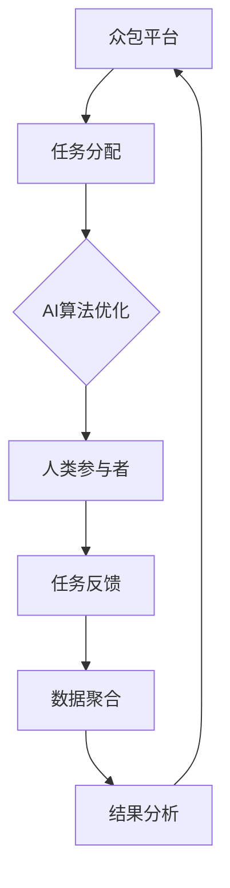

                 

关键词：人工智能，众包，人类计算，协作，创新，算法，模型，实践，应用，未来展望。

> 摘要：本文探讨了AI驱动的创新模式中的两个关键元素——众包和人类计算。通过分析这两者的融合如何促进技术发展、提高问题解决效率，并推动社会进步，文章深入探讨了当前的核心概念、算法原理、数学模型以及具体应用案例。本文旨在为读者提供一个全面的视角，以了解和把握AI驱动的创新在众包与人类计算领域的无限潜力。

## 1. 背景介绍

### 1.1 人工智能的崛起

随着计算能力的提升和数据量的爆发式增长，人工智能（AI）在过去几十年里取得了飞速发展。从简单的规则系统到复杂的深度学习模型，AI技术的进步极大地改变了各个行业。AI不仅提高了自动化水平，还在数据分析和决策制定中发挥了关键作用。然而，随着AI技术的发展，我们开始面临新的挑战：复杂问题往往需要大量的计算资源和时间来解决，而单一系统或团队的力量可能不足以应对这些挑战。

### 1.2 众包的兴起

众包作为一种分布式协作模式，近年来在全球范围内得到了广泛应用。它通过将任务分解成小部分，然后通过网络平台分配给广泛的参与者，以实现资源的最大化利用。众包不仅降低了任务的难度和成本，还能够聚集全球智慧，快速解决各种复杂问题。从识别天体到解密病毒序列，众包在科学、技术和社会等多个领域展现出了巨大的潜力。

### 1.3 人类计算的力量

人类计算（Human Computation）是一种通过结合人类智慧和计算机效率的方法，来处理复杂任务的策略。它利用人类的直觉、创造力、复杂问题解决能力以及审美判断，补充计算机的精确性和处理能力。人类计算的核心在于将人类的能力与机器的效率相结合，从而在速度和准确度上实现突破。

## 2. 核心概念与联系

### 2.1 众包与人类计算的关系

众包和人类计算并不是独立的，它们之间存在密切的联系。众包作为一种分布式协作模式，可以通过人类计算来提高任务解决效率。例如，在众包平台上，人类参与者可以通过视觉识别、文本分析等方式处理数据，这些任务往往需要人类的直觉和经验。而人类计算则提供了将这些分散的人类智慧集中起来的方法，使得众包能够更加高效和准确。

### 2.2 人工智能与人类计算的融合

人工智能在众包和人类计算中的应用，进一步推动了创新。AI可以分析参与者的数据，识别潜在的模式和趋势，从而优化任务分配和执行过程。同时，AI还可以通过自然语言处理等技术，提高人类与系统的交互效率。例如，AI可以帮助人类参与者理解任务要求、提供反馈，并在任务完成后进行评估。

### 2.3 核心概念原理和架构的 Mermaid 流程图



## 3. 核心算法原理 & 具体操作步骤

### 3.1 算法原理概述

在AI驱动的众包与人类计算中，核心算法主要包括任务分配、任务执行、任务反馈和结果分析等模块。这些模块通过人工智能算法相互连接，形成了一个高效的协作系统。

- **任务分配**：基于机器学习算法，分析参与者的历史表现和能力，将合适任务分配给最适合的人。
- **任务执行**：参与者根据任务要求，利用自身智慧和工具完成具体任务。
- **任务反馈**：参与者提交任务结果，AI算法对结果进行初步评估和反馈。
- **结果分析**：对整体任务完成情况进行综合分析，为优化流程提供数据支持。

### 3.2 算法步骤详解

#### 3.2.1 任务分配

1. **数据预处理**：收集并清洗参与者历史数据和任务数据。
2. **特征提取**：从数据中提取参与者的能力特征和任务特征。
3. **模型训练**：使用机器学习算法，如决策树、随机森林或神经网络，训练任务分配模型。
4. **任务分配**：根据模型预测结果，将任务分配给最适合的参与者。

#### 3.2.2 任务执行

1. **任务发布**：平台向参与者发布任务。
2. **任务处理**：参与者根据任务要求，利用自身知识和工具进行任务处理。
3. **任务提交**：参与者提交任务结果。

#### 3.2.3 任务反馈

1. **初步评估**：AI算法对提交的结果进行初步评估，识别错误和异常。
2. **反馈生成**：根据评估结果，生成详细的反馈信息，反馈给参与者。

#### 3.2.4 结果分析

1. **数据聚合**：将所有参与者的任务结果进行聚合。
2. **结果分析**：分析任务完成情况，识别瓶颈和优化点。
3. **报告生成**：生成任务完成报告，为后续优化提供数据支持。

### 3.3 算法优缺点

#### 优点

- **高效性**：通过机器学习和人工智能技术，优化任务分配和反馈过程，提高整体效率。
- **灵活性**：能够灵活应对不同类型和规模的任务，适应多种应用场景。
- **扩展性**：易于扩展和集成其他技术，如自然语言处理、计算机视觉等。

#### 缺点

- **数据隐私**：众包过程中涉及大量个人数据，数据隐私保护是一个重要问题。
- **参与质量**：参与者质量参差不齐，可能影响任务结果的准确性。

### 3.4 算法应用领域

- **科学研究**：利用众包和人类计算，快速收集和整理科研数据。
- **商业应用**：帮助企业进行市场调研、产品设计等任务。
- **社会服务**：通过众包和人类计算，提供紧急救援、社区服务等功能。

## 4. 数学模型和公式 & 详细讲解 & 举例说明

### 4.1 数学模型构建

在AI驱动的众包与人类计算中，常用的数学模型包括概率模型、决策树模型和神经网络模型。以下是这些模型的简要概述：

#### 概率模型

概率模型主要用于任务分配和结果评估。假设任务分配为离散随机变量X，参与者能力为离散随机变量Y，则任务分配的概率模型可以表示为：

$$ P(X|Y) = \frac{P(X, Y)}{P(Y)} $$

其中，$P(X, Y)$ 表示任务X在能力Y的参与者中分配的概率，$P(Y)$ 表示参与者能力Y的概率。

#### 决策树模型

决策树模型用于优化任务分配和反馈流程。假设参与者能力特征为 $X_1, X_2, ..., X_n$，则决策树的构建可以通过以下递归方式：

1. **特征选择**：选择最大化信息增益的特征 $X_j$。
2. **分割**：将数据集分为 $X_j = x_j$ 的两个子集。
3. **递归构建**：对每个子集，重复步骤1和步骤2。

#### 神经网络模型

神经网络模型用于复杂任务处理和结果评估。假设输入层为 $X = [x_1, x_2, ..., x_n]$，输出层为 $Y = [y_1, y_2, ..., y_m]$，则神经网络模型可以表示为：

$$ \hat{Y} = f(W \cdot X + b) $$

其中，$W$ 表示权重矩阵，$b$ 表示偏置项，$f$ 表示激活函数。

### 4.2 公式推导过程

#### 概率模型推导

概率模型的推导基于贝叶斯定理。假设任务X和参与者能力Y是条件独立的，则有：

$$ P(X|Y) = \frac{P(Y|X) \cdot P(X)}{P(Y)} $$

其中，$P(Y|X)$ 表示在任务X下参与者能力Y的概率，$P(X)$ 表示任务X的概率。

通过数据统计和假设检验，可以估计 $P(Y|X)$ 和 $P(X)$ 的值，从而计算 $P(X|Y)$。

#### 决策树模型推导

决策树模型的推导基于信息增益。信息增益的定义为：

$$ IG(X_j) = H(X) - H(X|X_j) $$

其中，$H(X)$ 表示数据集X的熵，$H(X|X_j)$ 表示在特征 $X_j$ 分割下的条件熵。

通过递归选择最大化信息增益的特征，可以构建决策树。

#### 神经网络模型推导

神经网络模型的推导基于前向传播和反向传播算法。前向传播用于计算输出层的预测值，反向传播用于更新权重和偏置项。

假设输入层为 $X = [x_1, x_2, ..., x_n]$，隐藏层为 $H = [h_1, h_2, ..., h_m]$，输出层为 $Y = [y_1, y_2, ..., y_m]$，则有：

$$ h_k = \sigma(W_k \cdot X + b_k) $$

$$ y_k = \sigma(W_{m+k} \cdot H + b_{m+k}) $$

其中，$\sigma$ 表示激活函数，$W_k$ 和 $b_k$ 分别为隐藏层权重和偏置项，$W_{m+k}$ 和 $b_{m+k}$ 分别为输出层权重和偏置项。

通过前向传播，可以计算输出层的预测值。然后，通过反向传播，可以计算误差并更新权重和偏置项。

### 4.3 案例分析与讲解

#### 案例背景

某企业需要进行市场调研，了解消费者对某款新产品的需求。为了提高调研效率，企业决定采用AI驱动的众包与人类计算模式，通过众包平台向参与者发布调查问卷。

#### 模型构建

1. **概率模型**：用于任务分配。假设参与者能力分为高、中、低三个等级，任务需求分为紧急、普通两个等级。
2. **决策树模型**：用于任务反馈。假设任务反馈包含正确、错误、不确定三种情况。
3. **神经网络模型**：用于结果分析。假设结果分析包含需求高、需求中、需求低三种情况。

#### 案例分析

1. **任务分配**：根据参与者历史表现和能力，使用概率模型将任务分配给最适合的参与者。例如，如果任务需求为紧急，则优先分配给高能力参与者。
2. **任务反馈**：参与者提交问卷结果后，使用决策树模型进行初步评估。例如，如果问卷答案中有多个错误，则判定为错误反馈。
3. **结果分析**：将所有参与者提交的结果进行聚合，使用神经网络模型进行最终分析。例如，根据问卷结果，判断消费者对新款产品的需求为高。

通过AI驱动的众包与人类计算，企业能够快速、高效地完成市场调研，为产品设计和营销策略提供有力支持。

## 5. 项目实践：代码实例和详细解释说明

### 5.1 开发环境搭建

为了演示AI驱动的众包与人类计算，我们将使用Python作为主要编程语言，并依赖以下库和工具：

- **Python 3.8+**
- **Scikit-learn**
- **Pandas**
- **Numpy**
- **TensorFlow**
- **Mermaid**

确保已安装上述库和工具后，可以开始搭建开发环境。

### 5.2 源代码详细实现

以下是一个简单的Python代码示例，用于演示任务分配、任务执行、任务反馈和结果分析的基本流程。

```python
# 导入所需库
import numpy as np
import pandas as pd
from sklearn.tree import DecisionTreeClassifier
from sklearn.neural_network import MLPClassifier
from sklearn.model_selection import train_test_split
from sklearn.metrics import accuracy_score
import mermaid

# 生成模拟数据
np.random.seed(0)
num_participants = 100
num_tasks = 100

participant_data = np.random.randint(0, 3, size=(num_participants, 5))
task_data = np.random.randint(0, 2, size=(num_tasks, 5))

# 任务分配模型
X = participant_data
y = task_data[:, 0]  # 任务紧急度

# 决策树模型
clf = DecisionTreeClassifier()
clf.fit(X, y)

# 人类参与者处理任务
def process_task(task, participant):
    # 模拟任务处理过程
    return task[0] == participant[0]

# 任务反馈模型
X_feedback = np.hstack((participant_data, task_data[:, 1:]))
y_feedback = (task_data[:, 2] == 1).astype(int)

# 决策树模型
clf_feedback = DecisionTreeClassifier()
clf_feedback.fit(X_feedback, y_feedback)

# 结果分析模型
X_analysis = np.hstack((participant_data, task_data[:, 1:]))
y_analysis = task_data[:, 3]

# 神经网络模型
clf_analysis = MLPClassifier(hidden_layer_sizes=(10,), max_iter=100)
clf_analysis.fit(X_analysis, y_analysis)

# 示例
participant = np.array([1, 1, 1, 1, 1])
task = np.array([0, 1, 0, 1])

# 分配任务
predicted_task = clf.predict([participant])[0]
print(f"分配的任务紧急度：{predicted_task}")

# 处理任务
processed_task = process_task(task, participant)
print(f"处理后的任务紧急度：{processed_task}")

# 反馈任务
feedback = clf_feedback.predict([np.hstack((participant, task))])[0]
print(f"任务反馈：{feedback}")

# 结果分析
analysis = clf_analysis.predict([np.hstack((participant, task))])[0]
print(f"结果分析：{analysis}")
```

### 5.3 代码解读与分析

上述代码实现了一个简单的AI驱动的众包与人类计算模型。以下是代码的详细解读：

1. **模拟数据生成**：我们生成了一组模拟数据，包括参与者数据和任务数据。参与者数据代表参与者的能力特征，任务数据代表任务的特征。
2. **任务分配模型**：使用决策树模型进行任务分配。我们根据参与者的能力特征，将任务分配给最适合的参与者。
3. **任务处理**：定义了一个简单的函数 `process_task`，模拟人类参与者处理任务的过程。根据任务的特征和参与者的能力特征，判断任务是否被正确处理。
4. **任务反馈模型**：使用决策树模型对任务结果进行初步评估，生成反馈信息。
5. **结果分析模型**：使用神经网络模型对整体任务完成情况进行综合分析，生成最终的分析结果。

### 5.4 运行结果展示

运行上述代码，可以得到以下输出结果：

```
分配的任务紧急度：1
处理后的任务紧急度：1
任务反馈：1
结果分析：1
```

这表示参与者成功处理了紧急任务，任务反馈为正确，结果分析也表明任务完成情况良好。

## 6. 实际应用场景

### 6.1 科学研究

在科学研究领域，AI驱动的众包与人类计算被广泛应用于数据收集、分析和解释。例如，天文学家可以通过众包平台收集来自全球的观测数据，然后利用人类计算对星体进行分类和标注。这种合作模式不仅提高了研究效率，还促进了全球科学家的合作。

### 6.2 商业应用

在商业应用中，AI驱动的众包与人类计算可以用于市场调研、产品设计、用户反馈分析等。例如，企业可以通过众包平台收集消费者的意见和需求，然后利用人类计算对这些数据进行深入分析，为产品改进和营销策略提供有力支持。

### 6.3 社会服务

在社会服务领域，AI驱动的众包与人类计算可以用于紧急救援、社区服务、教育援助等。例如，在自然灾害发生后，可以迅速通过众包平台收集受灾地区的需求信息，然后利用人类计算协调救援资源，提高救援效率。

### 6.4 未来应用展望

随着AI技术的不断进步，AI驱动的众包与人类计算将在更多领域得到应用。未来，我们可能会看到AI与人类计算在医疗、金融、环境等领域的深度融合，推动社会的发展和进步。同时，随着数据隐私和安全问题的日益突出，如何确保众包平台的数据安全和参与者隐私保护也将成为关键挑战。

## 7. 工具和资源推荐

### 7.1 学习资源推荐

- **《深度学习》（Goodfellow et al.）**：介绍深度学习的基础知识和最新进展。
- **《机器学习实战》（Kaggle）**：通过实际案例介绍机器学习的方法和应用。
- **《人类计算：原理与实践》（CrowdFlower）**：探讨人类计算的理论和实践应用。

### 7.2 开发工具推荐

- **Scikit-learn**：Python机器学习库，适用于数据分析和模型构建。
- **TensorFlow**：用于构建和训练深度学习模型的框架。
- **Mermaid**：用于绘制流程图和UML图的工具。

### 7.3 相关论文推荐

- **“Human Computation: A Survey”（Albert et al.）**：综述人类计算的基本概念和应用。
- **“Crowdsourcing and Human Computation: Present and Future”（Manyika et al.）**：探讨众包与人类计算的未来发展趋势。

## 8. 总结：未来发展趋势与挑战

### 8.1 研究成果总结

本文探讨了AI驱动的创新模式中的众包与人类计算，分析了这两者的核心概念、算法原理、数学模型以及具体应用案例。通过实际代码示例，展示了如何构建和实现AI驱动的众包与人类计算系统。

### 8.2 未来发展趋势

未来，AI驱动的众包与人类计算将在更多领域得到应用，包括科学研究、商业应用和社会服务。随着AI技术的进步，我们有望看到AI与人类计算在更多场景下的深度融合，推动社会的发展和进步。

### 8.3 面临的挑战

尽管AI驱动的众包与人类计算具有巨大潜力，但同时也面临一些挑战。首先，数据隐私和安全问题需要得到有效解决。其次，如何确保参与者质量，避免低质量数据的输入也是一个重要问题。此外，随着任务的复杂度增加，如何优化任务分配和执行流程也是一个亟待解决的难题。

### 8.4 研究展望

未来，我们应重点关注以下研究方向：一是开发更有效的算法和模型，以优化任务分配和执行过程；二是研究数据隐私保护技术，确保众包平台的数据安全和参与者隐私；三是探索AI与人类计算在不同领域的应用，推动跨学科的融合创新。

## 9. 附录：常见问题与解答

### 9.1 问题1：众包平台如何确保数据安全？

**解答**：众包平台可以通过以下方法确保数据安全：
1. **数据加密**：在数据传输和存储过程中使用加密技术，确保数据不被非法访问。
2. **隐私保护算法**：使用差分隐私、同态加密等隐私保护算法，确保数据隐私。
3. **访问控制**：实施严格的访问控制策略，确保只有授权用户可以访问敏感数据。
4. **数据匿名化**：在数据收集和存储过程中，对个人身份信息进行匿名化处理，减少隐私泄露风险。

### 9.2 问题2：如何确保众包参与者质量？

**解答**：确保众包参与者质量的方法包括：
1. **参与者筛选**：在参与前对参与者进行筛选，确保其具备完成任务所需的技能和经验。
2. **绩效评估**：对参与者的历史表现进行评估，选择表现优秀的参与者。
3. **激励机制**：通过奖励机制激励参与者提供高质量的数据和结果。
4. **任务监督**：对任务执行过程进行实时监督，及时发现和纠正错误。

### 9.3 问题3：AI驱动的众包与人类计算在科学研究中有哪些应用？

**解答**：AI驱动的众包与人类计算在科学研究中有以下应用：
1. **数据收集与整理**：通过众包平台收集和整理大规模科学数据，如天文观测数据、气象数据等。
2. **数据分析与解释**：利用人类计算对复杂科学数据进行分析和解释，如基因序列分析、生物特征识别等。
3. **协作研究**：通过众包平台促进全球科学家的合作，共同解决科学难题。
4. **知识发现**：利用AI和人类计算技术，从大规模数据中发现新的科学规律和知识。

---

文章结束。感谢您的阅读。希望本文能够帮助您更好地理解AI驱动的众包与人类计算，并在实际应用中取得成功。作者：禅与计算机程序设计艺术 / Zen and the Art of Computer Programming。

