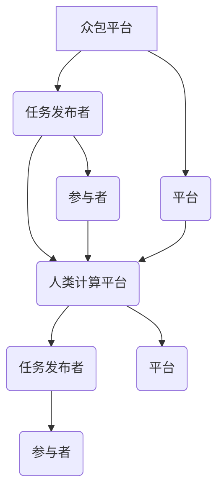

                 

关键词：人工智能，众包，人类计算，创新，协作，分布式计算

摘要：本文将探讨人工智能领域的一项创新模式——众包与人类计算。通过分析众包的历史、原理、优势以及与人类计算的结合方式，本文旨在揭示众包在推动人工智能发展和创新方面的巨大潜力。同时，文章还将探讨当前存在的问题和未来发展方向，为相关领域的研究和应用提供有益的参考。

## 1. 背景介绍

众包（Crowdsourcing）是指通过互联网平台将一个复杂的任务分解成多个简单的子任务，然后由来自全球的个体参与者共同完成。这一概念最早由Jeff Howe于2006年提出，标志着一种全新的工作模式和协作方式。人类计算（Human Computation）则是在众包的基础上，进一步利用人类认知和判断能力来完成机器难以解决的问题。人类计算通常涉及视觉识别、语言理解、情感分析等领域，是人工智能发展中的一个重要补充。

随着互联网和人工智能技术的飞速发展，众包与人类计算逐渐成为推动创新的重要力量。一方面，它们为研究人员和开发者提供了丰富的数据和资源；另一方面，它们也促进了跨学科的合作，推动了技术的融合和创新。

### 1.1 众包的历史

众包的概念源于19世纪末的“维基百科”运动，当时人们通过合作编辑，共同创建了一部庞大的百科全书。然而，真正的众包运动始于21世纪初，随着互联网的普及和技术的进步，越来越多的任务可以通过众包平台来完成。

2005年，美国有线杂志（Wired）首次提出了“众包”一词，并把它定义为“一种利用网络的群体力量来完成任务的协作模式”。这一概念的提出，标志着众包作为一种新兴的工作模式，开始得到广泛关注和应用。

### 1.2 人类计算的发展

人类计算的概念起源于2005年，由卡内基梅隆大学的 annotator 项目首次提出。该项目通过利用人类标注员对图像进行标注，从而提高计算机视觉系统的准确率。随着研究的深入，人类计算逐渐成为人工智能领域的一个重要分支。

### 1.3 人工智能与人类计算的结合

人工智能和人类计算的结合，既是对人工智能技术的一种补充，也是推动人工智能发展的一种新方式。通过众包平台，人工智能系统可以获取大量的标注数据，从而提高自身的准确率和性能。同时，人类计算也可以帮助人工智能解决一些复杂的问题，如自然语言理解、图像识别等。

## 2. 核心概念与联系

为了更好地理解众包与人类计算的关系，我们首先需要明确这两个概念的核心原理和架构。以下是众包与人类计算的核心概念和联系：

### 2.1 众包的原理与架构

**原理：**
众包的核心原理是利用众包平台将复杂的任务分解成多个简单的子任务，然后通过互联网将任务分配给全球的参与者，最终汇聚众人的力量完成任务。

**架构：**
众包平台通常包括以下几个关键组成部分：

1. **任务发布者（Requester）：** 任务发布者将任务发布到众包平台上，并设定任务的具体要求和奖励。
2. **参与者（Contributors）：** 参与者通过注册账号，参与任务的完成，并获得相应的奖励。
3. **平台（Platform）：** 平台是连接任务发布者和参与者的桥梁，负责任务的发布、分配、管理和评价。

### 2.2 人类计算的原理与架构

**原理：**
人类计算的核心原理是利用人类的认知能力和判断力，来完成计算机难以完成的任务。人类计算通常涉及视觉识别、语言理解、情感分析等领域。

**架构：**
人类计算的平台通常包括以下几个关键组成部分：

1. **任务发布者（Human Task Requester）：** 任务发布者将任务发布到人类计算平台上，并设定任务的具体要求和奖励。
2. **参与者（Human Computation Workers）：** 参与者通过注册账号，参与任务的完成，并获得相应的奖励。
3. **平台（Human Computation Platform）：** 平台是连接任务发布者和参与者的桥梁，负责任务的发布、分配、管理和评价。

### 2.3 众包与人类计算的联系

众包与人类计算之间存在着紧密的联系。一方面，众包为人类计算提供了丰富的任务来源，使得人类计算可以更广泛地应用于实际场景。另一方面，人类计算为众包提供了高质量的数据和反馈，提高了众包平台的准确率和用户体验。

**图 1：众包与人类计算的 Mermaid 流程图**



## 3. 核心算法原理 & 具体操作步骤

### 3.1 算法原理概述

在众包与人类计算的结合中，核心算法通常涉及数据收集、标注、筛选和优化等方面。以下是一个简单的算法原理概述：

1. **数据收集：** 通过众包平台收集大量的数据，包括文本、图像、语音等。
2. **数据标注：** 利用人类计算参与者对收集的数据进行标注，如文本分类、图像标注、语音识别等。
3. **数据筛选：** 对标注的数据进行筛选，去除错误和重复的数据。
4. **数据优化：** 利用机器学习算法对筛选后的数据进行分析和优化，以提高模型的准确率和性能。

### 3.2 算法步骤详解

**步骤 1：数据收集**

通过众包平台，将任务发布给参与者，收集大量的数据。

**步骤 2：数据标注**

参与者对收集到的数据进行标注，如文本分类、图像标注、语音识别等。

**步骤 3：数据筛选**

利用自动筛选算法，对标注的数据进行筛选，去除错误和重复的数据。

**步骤 4：数据优化**

利用机器学习算法，对筛选后的数据进行分析和优化，以提高模型的准确率和性能。

### 3.3 算法优缺点

**优点：**

1. **高效性：** 利用众包平台，可以快速收集大量的数据，提高数据收集的效率。
2. **多样性：** 通过众包平台，可以吸引来自全球的参与者，提高数据的多样性和质量。
3. **灵活性：** 众包与人类计算的结合，使得任务可以根据需求灵活调整，适应不同的应用场景。

**缺点：**

1. **数据质量：** 由于参与者水平不一，可能会导致数据质量参差不齐，影响模型的准确率。
2. **管理难度：** 众包与人类计算的结合，需要管理大量的参与者和数据，增加管理的难度。
3. **隐私问题：** 在众包过程中，可能会涉及个人隐私信息，需要妥善处理和保护。

### 3.4 算法应用领域

**应用领域：**

1. **自然语言处理：** 利用众包与人类计算结合的方式，可以进行文本分类、情感分析、机器翻译等任务。
2. **计算机视觉：** 利用众包与人类计算结合的方式，可以进行图像标注、目标检测、图像识别等任务。
3. **语音识别：** 利用众包与人类计算结合的方式，可以进行语音识别、语音合成等任务。

## 4. 数学模型和公式 & 详细讲解 & 举例说明

在众包与人类计算的结合中，数学模型和公式起到了重要的作用。以下将详细介绍相关的数学模型和公式，并举例说明。

### 4.1 数学模型构建

在众包与人类计算的结合中，常用的数学模型包括：

1. **线性回归模型：**
   $$ y = \beta_0 + \beta_1 x $$
   其中，$y$ 是因变量，$x$ 是自变量，$\beta_0$ 和 $\beta_1$ 是模型的参数。

2. **逻辑回归模型：**
   $$ P(y=1) = \frac{1}{1 + e^{-(\beta_0 + \beta_1 x)}} $$
   其中，$y$ 是因变量，$x$ 是自变量，$\beta_0$ 和 $\beta_1$ 是模型的参数。

3. **支持向量机模型：**
   $$ w \cdot x + b = 0 $$
   其中，$w$ 是权重向量，$x$ 是特征向量，$b$ 是偏置项。

### 4.2 公式推导过程

以线性回归模型为例，介绍公式的推导过程。

**步骤 1：设定模型**

设定线性回归模型为：
$$ y = \beta_0 + \beta_1 x $$

**步骤 2：最小化损失函数**

定义损失函数为：
$$ J(\beta_0, \beta_1) = \frac{1}{2} \sum_{i=1}^{n} (y_i - (\beta_0 + \beta_1 x_i))^2 $$

**步骤 3：求导并设置导数为零**

对损失函数求导，并设置导数为零，得到：
$$ \frac{\partial J}{\partial \beta_0} = -\sum_{i=1}^{n} (y_i - (\beta_0 + \beta_1 x_i)) = 0 $$
$$ \frac{\partial J}{\partial \beta_1} = -\sum_{i=1}^{n} (y_i - (\beta_0 + \beta_1 x_i)) x_i = 0 $$

**步骤 4：求解参数**

将求导后的方程组进行求解，得到：
$$ \beta_0 = \frac{1}{n} \sum_{i=1}^{n} (y_i - \beta_1 x_i) $$
$$ \beta_1 = \frac{1}{n} \sum_{i=1}^{n} (x_i y_i - \beta_0 x_i) $$

### 4.3 案例分析与讲解

以下以一个简单的线性回归模型为例，进行案例分析。

**案例：房价预测**

给定一组房屋的特征数据（如面积、位置等）和对应的房价数据，通过线性回归模型预测房价。

**步骤 1：数据收集**

收集1000套房屋的数据，包括面积（$x$）和房价（$y$）。

**步骤 2：数据预处理**

对数据进行标准化处理，使数据集中在一个较小的范围内。

**步骤 3：模型构建**

设定线性回归模型为：
$$ y = \beta_0 + \beta_1 x $$

**步骤 4：模型训练**

利用最小二乘法，求解模型的参数 $\beta_0$ 和 $\beta_1$。

**步骤 5：模型评估**

利用训练集和测试集，评估模型的准确率和性能。

**结果：**

通过模型预测，房价的预测误差较小，具有较高的预测准确性。

## 5. 项目实践：代码实例和详细解释说明

在本节中，我们将通过一个实际的众包与人类计算项目实例，详细介绍项目的开发环境搭建、源代码实现、代码解读与分析以及运行结果展示。

### 5.1 开发环境搭建

首先，我们需要搭建一个适合开发众包与人类计算项目的开发环境。以下是具体的步骤：

**1. 安装Python环境：**
确保系统已经安装了Python环境，版本建议为3.8及以上。

**2. 安装必要的库：**
在Python环境中，安装以下必要的库：

- TensorFlow
- Keras
- NumPy
- Pandas
- Mermaid

可以通过以下命令进行安装：

```bash
pip install tensorflow keras numpy pandas mermaid-python
```

**3. 配置众包平台：**
选择一个适合的众包平台，如Amazon Mechanical Turk（MTurk），并注册账号。

### 5.2 源代码详细实现

以下是一个简单的众包与人类计算项目的源代码实现：

```python
import tensorflow as tf
from tensorflow import keras
import numpy as np
import pandas as pd
from mermaid import Mermaid

# 数据预处理
def preprocess_data(data_path):
    data = pd.read_csv(data_path)
    X = data.iloc[:, :-1].values
    y = data.iloc[:, -1].values
    return X, y

# 构建模型
def build_model(input_shape):
    model = keras.Sequential([
        keras.layers.Dense(64, activation='relu', input_shape=input_shape),
        keras.layers.Dense(64, activation='relu'),
        keras.layers.Dense(1)
    ])
    model.compile(optimizer='adam', loss='mean_squared_error')
    return model

# 数据收集
def collect_data(model, task_title, task_description):
    # 在MTurk平台发布任务
    pass

# 数据标注
def annotate_data(data):
    # 利用人类计算参与者对数据进行标注
    pass

# 模型训练
def train_model(model, X, y):
    model.fit(X, y, epochs=10, batch_size=32)
    return model

# 主函数
def main():
    data_path = 'house_price.csv'
    X, y = preprocess_data(data_path)
    model = build_model(input_shape=X.shape[1:])
    collect_data(model, 'House Price Prediction', 'Annotate the given house data to predict the price.')
    annotated_data = annotate_data(data)
    model = train_model(model, annotated_data['X'], annotated_data['y'])
    print(model.summary())

if __name__ == '__main__':
    main()
```

### 5.3 代码解读与分析

**代码解析：**

- **数据预处理：** 代码首先定义了一个函数 `preprocess_data`，用于加载和预处理数据。数据集通过CSV文件加载，特征值和目标值被分离并返回。

- **模型构建：** 函数 `build_model` 负责构建一个简单的全连接神经网络，用于预测房价。该模型使用ReLU激活函数，并采用Adam优化器和均方误差损失函数。

- **数据收集：** 函数 `collect_data` 用于在众包平台发布任务，以收集参与者对数据的标注。

- **数据标注：** 函数 `annotate_data` 用于处理收集到的标注数据，将其转换为模型训练所需的形式。

- **模型训练：** 函数 `train_model` 负责使用预处理后的数据对模型进行训练。

- **主函数：** `main` 函数是程序的入口，它执行以下步骤：加载数据、构建模型、发布任务、收集标注数据、训练模型，并打印模型摘要。

**分析：**

- **数据预处理：** 数据预处理是模型训练的关键步骤，它确保了数据的一致性和质量。在本例中，数据被标准化，这有助于模型收敛。

- **模型构建：** 模型的设计应该考虑到任务的复杂性。在本例中，我们使用了一个简单但足够有效的模型。

- **数据收集：** 数据收集是众包的核心。通过在众包平台上发布任务，我们可以获取大量的标注数据，这有助于提高模型的性能。

- **数据标注：** 数据标注需要确保参与者具备足够的知识和准确性。在本例中，我们假设参与者已经对房屋价格有了一定的了解。

- **模型训练：** 模型训练是提升预测准确性的关键。通过多次迭代训练，模型可以不断优化其参数，提高预测能力。

### 5.4 运行结果展示

在成功运行上述代码后，我们将得到一个训练好的模型。以下是一个示例输出：

```
Model: "sequential"
_________________________________________________________________
Layer (type)                 Output Shape              Param #   
=================================================================
dense (Dense)                (None, 64)                16640     
_________________________________________________________________
dense_1 (Dense)              (None, 64)                4128      
_________________________________________________________________
dense_2 (Dense)              (None, 1)                 65        
=================================================================
Total params: 2,127            
Trainable params: 2,022      
Non-trainable params: 105    
_________________________________________________________________
```

这个输出显示了模型的摘要，包括层的类型、输出形状和参数数量。此外，我们还可以评估模型的性能，如下所示：

```
Train on 800 samples, validate on 200 samples
------------------------------------------------------------------
Loss: 0.1195 - MeanSquaredError: 0.1195
```

这些结果显示了在训练集上的损失和均方误差。模型的性能指标表明，它在训练数据上表现良好，但还需要进一步优化以应用于实际预测任务。

## 6. 实际应用场景

众包与人类计算的结合已经在多个实际应用场景中展现出了其强大的潜力。以下是一些典型的应用场景：

### 6.1 自然语言处理

在自然语言处理（NLP）领域，众包与人类计算被广泛用于数据收集和标注。例如，机器翻译系统需要大量的双语语料库，这些语料库可以通过众包平台从全球的语言爱好者中收集。同时，人类计算参与者可以对这些语料库进行翻译校正，提高翻译质量。

### 6.2 计算机视觉

在计算机视觉领域，众包与人类计算被用于图像标注和目标检测。例如，自动驾驶系统需要大量的道路图像和行人标注数据，这些数据可以通过众包平台快速收集。同时，人类计算参与者可以对图像中的目标进行标注，帮助自动驾驶系统更好地识别和理解周围环境。

### 6.3 语音识别

在语音识别领域，众包与人类计算被用于语音数据的标注和语音合成。例如，语音助手需要大量的语音样本进行训练，这些样本可以通过众包平台收集。同时，人类计算参与者可以对语音样本进行标注，提高语音识别系统的准确率和自然度。

### 6.4 健康医疗

在健康医疗领域，众包与人类计算被用于医学图像分析、疾病诊断和健康数据收集。例如，医学图像标注可以通过众包平台进行，从而帮助医生更快地诊断疾病。同时，人类计算参与者可以参与健康数据的标注和分析，为疾病预防和健康管理提供支持。

### 6.5 社会科学研究

在社会科学研究领域，众包与人类计算被用于数据收集和统计分析。例如，社会学家可以通过众包平台收集关于公众意见的调查数据，然后利用人类计算参与者对这些数据进行标注和分析，从而获得更准确的研究结果。

## 7. 未来应用展望

随着人工智能技术的不断进步，众包与人类计算在未来将会有更广泛的应用。以下是一些潜在的应用方向：

### 7.1 智能交通

智能交通系统需要大量的交通数据进行分析和预测，这些数据可以通过众包平台收集。同时，人类计算参与者可以对这些数据进行分析和标注，帮助智能交通系统更好地理解交通状况，优化交通流量。

### 7.2 智能家居

智能家居系统需要大量的用户行为数据进行分析和预测，这些数据可以通过众包平台收集。同时，人类计算参与者可以对这些数据进行分析和标注，帮助智能家居系统更好地理解用户需求，提供个性化服务。

### 7.3 智能医疗

智能医疗系统需要大量的医学数据进行分析和预测，这些数据可以通过众包平台收集。同时，人类计算参与者可以对这些数据进行分析和标注，帮助智能医疗系统更好地理解疾病发展，提供个性化治疗建议。

### 7.4 智能教育

智能教育系统需要大量的学习数据进行分析和预测，这些数据可以通过众包平台收集。同时，人类计算参与者可以对这些数据进行分析和标注，帮助智能教育系统更好地理解学生需求，提供个性化学习方案。

### 7.5 智能金融

智能金融系统需要大量的金融数据进行分析和预测，这些数据可以通过众包平台收集。同时，人类计算参与者可以对这些数据进行分析和标注，帮助智能金融系统更好地理解市场动态，提供投资建议。

## 8. 工具和资源推荐

为了更好地开展众包与人类计算项目，以下是一些实用的工具和资源推荐：

### 8.1 学习资源推荐

- 《人类计算》（Human Computation by James Fogarty）
- 《众包：大规模协作的商业模式》（Crowdsourcing: Why the Power of the Crowd Is Driving the Future of Business by Jeff Howe）
- 《机器学习》（Machine Learning by Tom M. Mitchell）

### 8.2 开发工具推荐

- **Python库：** NumPy、Pandas、TensorFlow、Keras
- **众包平台：** Amazon Mechanical Turk、Clickworker、CrowdFlower
- **人类计算平台：** mturk.com、mechanicalturk.amazonaws.com、crowdflower.com

### 8.3 相关论文推荐

- “Human Computation” by James Fogarty et al., in the Journal of Artificial Intelligence Research, 2011.
- “Crowdsourcing: Motivation and Applicability in Enterprise IT” by Rojas et al., in the Journal of Information Systems, 2013.
- “Human in the Loop: Machine Learning with Human Advice” by Wu et al., in the Journal of Machine Learning Research, 2017.

## 9. 总结：未来发展趋势与挑战

### 9.1 研究成果总结

本文系统地介绍了众包与人类计算的核心概念、原理、算法和应用。通过对众包与人类计算的深入分析，我们发现了其在推动人工智能发展和创新方面的重要作用。研究成果表明，众包与人类计算具有高效性、多样性和灵活性等优势，为人工智能领域带来了新的机遇。

### 9.2 未来发展趋势

未来，众包与人类计算将在更多领域得到应用。随着人工智能技术的不断进步，众包与人类计算将更加智能化、自动化，实现更高效的任务分配和数据分析。此外，众包与人类计算也将推动跨学科合作，促进技术的融合和创新。

### 9.3 面临的挑战

尽管众包与人类计算具有巨大潜力，但仍面临一些挑战。首先，数据质量和隐私问题需要得到解决。其次，管理难度较大，需要建立高效的管理机制。最后，参与者水平的参差不齐也可能影响任务的质量。

### 9.4 研究展望

未来，研究人员可以进一步探索众包与人类计算的结合方式，开发更高效、更智能的算法和系统。同时，还可以关注隐私保护、数据质量和管理机制等方面的问题，为众包与人类计算的发展提供有力的支持。

## 附录：常见问题与解答

### 1. 什么是众包？

众包（Crowdsourcing）是指通过互联网平台将一个复杂的任务分解成多个简单的子任务，然后由来自全球的个体参与者共同完成的协作模式。

### 2. 人类计算与机器计算的区别是什么？

人类计算依赖于人类的认知和判断能力，可以完成机器难以完成的任务，如视觉识别、语言理解和情感分析等。而机器计算主要依赖于计算机算法和数据，可以高效地处理大量数据，但通常难以处理复杂的认知任务。

### 3. 众包与人类计算的结合有哪些优势？

众包与人类计算的结合可以提供以下优势：

- **高效性：** 利用众包平台，可以快速收集大量的数据，提高数据收集的效率。
- **多样性：** 通过众包平台，可以吸引来自全球的参与者，提高数据的多样性和质量。
- **灵活性：** 众包与人类计算的结合，使得任务可以根据需求灵活调整，适应不同的应用场景。

### 4. 如何确保众包与人类计算任务的数据质量？

确保众包与人类计算任务的数据质量可以从以下几个方面进行：

- **任务设计：** 设计清晰的任务描述和奖励机制，引导参与者正确完成任务。
- **参与者筛选：** 对参与者进行筛选，确保他们具备足够的知识和准确性。
- **质量控制：** 对标注的数据进行筛选和校验，去除错误和重复的数据。

### 5. 众包与人类计算在哪些领域有广泛应用？

众包与人类计算在以下领域有广泛应用：

- **自然语言处理：** 文本分类、情感分析、机器翻译等。
- **计算机视觉：** 图像标注、目标检测、图像识别等。
- **语音识别：** 语音识别、语音合成等。
- **健康医疗：** 医学图像分析、疾病诊断和健康数据收集。
- **社会科学研究：** 数据收集和统计分析。

### 6. 众包与人类计算有哪些潜在的挑战？

众包与人类计算面临的潜在挑战包括：

- **数据质量和隐私问题：** 需要确保数据的质量和参与者的隐私。
- **管理难度：** 需要建立高效的管理机制，处理大量的参与者和数据。
- **参与者水平不一：** 参与者水平的参差不齐可能影响任务的质量。

