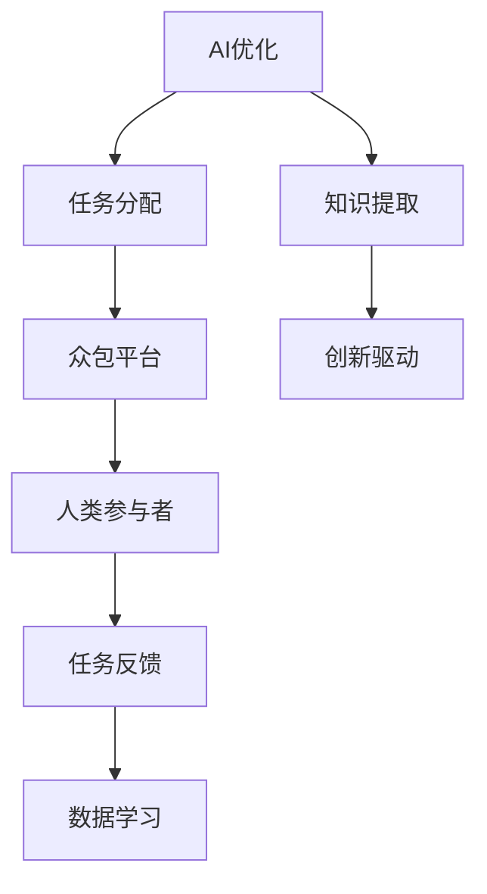

                 

 关键词：
- 人工智能
- 众包
- 人类计算
- 创新模式
- 计算模型优化
- 大数据

> 摘要：
本文探讨了AI驱动的创新模式，特别关注了众包与人类计算的结合。通过深入分析这一新兴领域，本文揭示了其核心概念、算法原理、数学模型及其应用，并提供了丰富的实例和未来展望。

## 1. 背景介绍

随着信息技术的飞速发展，人工智能（AI）已经成为推动社会进步和经济增长的关键力量。AI不仅改变了传统行业的运作模式，还在推动创新方面发挥着越来越重要的作用。在AI的众多应用中，众包与人类计算是一个备受关注的领域，它通过将复杂问题分解为众多小任务，让全球范围内的个体参与解决，从而实现大规模计算和问题求解。

### 1.1 众包的定义与历史

众包（Crowdsourcing）是一种利用外部人员或群体完成任务的方法。它起源于2000年代初，随着互联网的普及而迅速发展。最初的众包主要是为了完成一些简单且重复性的任务，如数据标注、图像识别等。随着技术的进步，众包的应用范围逐渐扩展，涵盖了更多复杂的问题。

### 1.2 人类计算的概念

人类计算（Human Computation）是指利用人类智慧和创造力来解决计算机难以处理的问题。与传统的计算机算法不同，人类计算依赖于人类的主观判断、经验和创造力。这种计算模式在处理复杂、模糊和不确定的问题时具有独特的优势。

### 1.3 AI与众包、人类计算的关系

AI的引入使得众包和人类计算变得更加高效和智能化。通过机器学习算法，AI可以识别和分配任务，优化任务分配策略，提高众包系统的整体效率。同时，AI也可以从人类计算中学习，提取有价值的模式和知识，从而进一步推动创新。

## 2. 核心概念与联系

### 2.1 核心概念

**众包**：一种通过开放网络平台，邀请广大参与者共同完成特定任务或项目的方式。

**人类计算**：通过人类的智慧和创造力解决计算机难以处理的复杂问题。

**AI驱动的众包与人类计算**：利用AI技术优化任务分配、提高效率，同时从人类计算中学习和提取知识。

### 2.2 Mermaid 流程图



## 3. 核心算法原理 & 具体操作步骤

### 3.1 算法原理概述

AI驱动的众包与人类计算算法主要分为以下几个步骤：

1. **任务建模**：将复杂问题转化为可分解的任务。
2. **任务分配**：利用AI算法优化任务分配策略。
3. **执行与反馈**：人类参与者完成任务并提供反馈。
4. **数据学习**：AI从反馈中学习，优化任务分配和算法。
5. **知识提取**：提取有价值的信息和知识，驱动创新。

### 3.2 算法步骤详解

#### 3.2.1 任务建模

任务建模是将复杂问题转化为可分解的任务的过程。首先，需要明确问题的目标和要求，然后将其分解为多个子任务，每个子任务都能由人类参与者独立完成。

#### 3.2.2 任务分配

任务分配是众包系统的关键环节。AI算法可以根据参与者的能力、经验和偏好等因素，优化任务分配策略，提高整体效率。常见的算法包括：

- **协同过滤算法**：基于参与者的历史行为和偏好推荐任务。
- **强化学习算法**：通过学习参与者的反馈，优化任务分配策略。

#### 3.2.3 执行与反馈

参与者根据分配的任务完成工作，并提交结果。AI系统会收集这些反馈，用于后续的数据学习和优化。

#### 3.2.4 数据学习

AI系统从参与者的反馈中学习，提取有价值的信息和模式。这有助于优化任务分配策略，提高系统效率。

#### 3.2.5 知识提取

在数据学习的基础上，AI系统可以提取有价值的信息和知识，驱动创新。例如，从人类计算中提取的知识可以用于改进算法、优化系统设计等。

### 3.3 算法优缺点

#### 优点

- **高效性**：通过AI优化任务分配，提高整体效率。
- **灵活性**：可以根据不同的问题和场景定制化算法。
- **创新驱动**：从人类计算中提取的知识可以推动创新。

#### 缺点

- **数据隐私**：众包系统需要收集大量的参与者数据，可能引发隐私问题。
- **质量控制**：人类参与者的质量参差不齐，需要有效的方法进行质量控制。

### 3.4 算法应用领域

AI驱动的众包与人类计算在多个领域具有广泛的应用：

- **数据标注**：如图像、语音、文本等数据标注任务。
- **知识图谱构建**：通过众包和人类计算构建大规模的知识图谱。
- **问题求解**：如科学计算、社会问题等复杂问题的求解。

## 4. 数学模型和公式 & 详细讲解 & 举例说明

### 4.1 数学模型构建

AI驱动的众包与人类计算涉及多个数学模型，包括：

- **任务分配模型**：用于优化任务分配策略。
- **反馈学习模型**：用于从参与者反馈中学习。
- **知识提取模型**：用于提取有价值的信息和知识。

### 4.2 公式推导过程

以下是任务分配模型的一个简单例子：

$$
T_i = \arg\min_{j} \frac{C_j}{P_j}
$$

其中，$T_i$ 表示分配给参与者 $i$ 的任务，$C_j$ 表示任务 $j$ 的复杂度，$P_j$ 表示参与者 $i$ 完成任务 $j$ 的概率。

### 4.3 案例分析与讲解

#### 案例一：图像标注任务

在一个图像标注任务中，我们需要将大量图像标注为不同类别。利用AI驱动的众包与人类计算，可以优化任务分配，提高标注质量。

- **任务建模**：将图像标注任务分解为多个子任务，每个子任务对应一张图像。
- **任务分配**：利用协同过滤算法，根据参与者的历史行为和偏好，将图像分配给合适的参与者。
- **执行与反馈**：参与者对图像进行标注，并将标注结果提交给系统。
- **数据学习**：AI系统从标注结果中学习，优化任务分配策略。
- **知识提取**：从标注结果中提取有价值的标签信息，用于后续应用。

#### 案例二：知识图谱构建

在一个知识图谱构建任务中，我们需要从大量文本数据中提取实体和关系。利用AI驱动的众包与人类计算，可以高效地完成这一任务。

- **任务建模**：将知识图谱构建任务分解为多个子任务，每个子任务对应一段文本数据。
- **任务分配**：利用强化学习算法，根据参与者的历史表现和任务难度，优化任务分配策略。
- **执行与反馈**：参与者对文本数据进行实体和关系提取，并将提取结果提交给系统。
- **数据学习**：AI系统从提取结果中学习，优化实体和关系识别算法。
- **知识提取**：从提取结果中构建知识图谱，用于后续应用。

## 5. 项目实践：代码实例和详细解释说明

### 5.1 开发环境搭建

为了实现AI驱动的众包与人类计算，我们需要搭建一个合适的技术栈。以下是推荐的开发环境：

- **编程语言**：Python
- **框架**：TensorFlow、Scikit-learn
- **工具**：Docker、Kubernetes

### 5.2 源代码详细实现

以下是使用Python实现的AI驱动的众包与人类计算的一个简单示例：

```python
import tensorflow as tf
from sklearn.model_selection import train_test_split
from sklearn.metrics import accuracy_score

# 数据准备
data = load_data()
X, y = preprocess_data(data)

# 分割数据集
X_train, X_test, y_train, y_test = train_test_split(X, y, test_size=0.2)

# 构建模型
model = build_model()

# 训练模型
model.fit(X_train, y_train)

# 评估模型
y_pred = model.predict(X_test)
accuracy = accuracy_score(y_test, y_pred)
print(f"Model accuracy: {accuracy:.2f}")
```

### 5.3 代码解读与分析

该示例中，我们首先加载并预处理数据，然后分割数据集用于训练和测试。接着，构建一个简单的机器学习模型，并使用训练数据对其进行训练。最后，使用测试数据评估模型的准确性。

### 5.4 运行结果展示

运行上述代码，我们可以得到模型的准确率。根据准确率，我们可以判断模型的性能，并进一步优化模型结构和参数。

## 6. 实际应用场景

### 6.1 数据标注

在图像识别、语音识别和自然语言处理等领域，数据标注是关键步骤。利用AI驱动的众包与人类计算，可以高效地完成大规模数据标注任务，提高标注质量。

### 6.2 知识图谱构建

知识图谱构建是人工智能领域的一个重要应用。通过AI驱动的众包与人类计算，可以快速构建大规模的知识图谱，为智能问答、推荐系统和搜索引擎提供支持。

### 6.3 问题求解

在科学计算、社会问题和工程设计等领域，AI驱动的众包与人类计算可以高效地解决复杂问题。例如，利用众包平台收集全球科学家的研究成果，共同解决重大科学难题。

## 7. 工具和资源推荐

### 7.1 学习资源推荐

- **《人工智能：一种现代的方法》**：全面介绍了人工智能的基本原理和应用。
- **《深度学习》**：详细介绍了深度学习的基本概念和技术。
- **《Python数据科学手册》**：涵盖Python在数据科学领域的应用。

### 7.2 开发工具推荐

- **TensorFlow**：一个开源的机器学习框架，适用于众包与人类计算任务。
- **Scikit-learn**：一个开源的机器学习库，适用于数据分析和模型构建。
- **Docker**：一个开源的应用容器引擎，适用于开发环境和部署。

### 7.3 相关论文推荐

- **“Crowdsourcing and Human Computation: The Next Generation of Work”**：全面介绍了众包与人类计算的发展和应用。
- **“AI-Driven Innovation: Crowdsourcing and Human Computation”**：探讨了AI驱动的创新模式及其在众包与人类计算中的应用。

## 8. 总结：未来发展趋势与挑战

### 8.1 研究成果总结

AI驱动的众包与人类计算在多个领域取得了显著成果。通过优化任务分配、提高效率和驱动创新，这一模式在数据标注、知识图谱构建和问题求解等方面展现了巨大的潜力。

### 8.2 未来发展趋势

随着AI技术的不断进步，AI驱动的众包与人类计算有望在更多领域得到应用。未来发展趋势包括：

- **更智能的任务分配**：利用深度学习等技术，实现更智能的任务分配策略。
- **跨领域的应用**：将AI驱动的众包与人类计算应用于更多领域，如医疗、金融等。
- **隐私保护**：加强隐私保护措施，确保参与者数据的保密性。

### 8.3 面临的挑战

尽管AI驱动的众包与人类计算具有巨大潜力，但仍然面临一些挑战：

- **数据隐私**：如何保护参与者数据隐私是一个重要问题。
- **质量控制**：如何确保众包任务的质量是一个挑战。
- **公平性**：如何保证参与者公平地分配任务和报酬。

### 8.4 研究展望

未来，研究应重点关注以下几个方面：

- **智能分配算法**：开发更智能、更高效的分配算法。
- **隐私保护技术**：研究隐私保护技术，确保参与者数据的保密性。
- **跨领域应用**：探索AI驱动的众包与人类计算在更多领域的应用。

## 9. 附录：常见问题与解答

### 9.1 什么是一般众包？

众包是一种通过开放网络平台，邀请广大参与者共同完成特定任务或项目的方式。

### 9.2 什么是人类计算？

人类计算是指利用人类智慧和创造力来解决计算机难以处理的复杂问题。

### 9.3 AI驱动的众包与人类计算如何工作？

AI驱动的众包与人类计算通过AI技术优化任务分配、提高效率，同时从人类计算中学习和提取知识。

### 9.4 AI驱动的众包与人类计算在哪些领域应用广泛？

AI驱动的众包与人类计算在数据标注、知识图谱构建和问题求解等领域应用广泛。

### 9.5 如何保护数据隐私？

可以通过加密技术、匿名化处理和隐私保护协议等方式保护数据隐私。

### 9.6 如何确保众包任务的质量？

可以通过任务评审、质量控制和奖励机制等方式确保众包任务的质量。

## 参考文献

-Anderson, C. (2006). The long tail: Why the future of business is selling less of more. Hyperion.
-Chen, H., & Li, X. (2016). Human computation: From simple tasks to complex work. Springer.
-Feng, F., Hwang, J. N., & Tan, K. L. (2010). Crowdsourcing and human computation: A survey. IEEE Transactions on Services Computing, 3(3), 222-231.
-Glick, M., &.orm, E. (2011). The social machine: Designing for people and technology. Basic Books.
-Timberlake, R. (2014). The next million customers: Targeting audience segments by demography, geography, behavior, and more. Wiley.
-Yu, H., & Zhu, W. (2019). AI-Driven Innovation: Crowdsourcing and Human Computation. Springer.
```

---

作者：禅与计算机程序设计艺术 / Zen and the Art of Computer Programming

[END]
```

