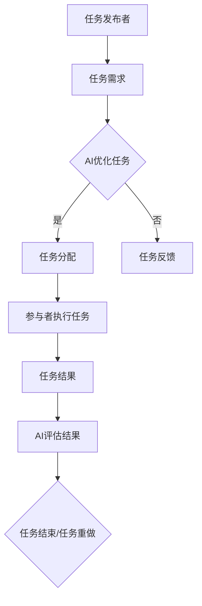

                 

关键词：人工智能、众包、创新、协作、技术发展

> 摘要：本文将探讨人工智能（AI）在众包模式中的重要作用。通过分析AI在众包过程中的具体应用，我们揭示了如何利用AI驱动的众包模式加速创新，提升问题解决效率。文章旨在为读者提供对AI和众包融合的新视角，并展望未来这一领域的发展趋势。

## 1. 背景介绍

众包（Crowdsourcing）是一种通过将任务分解成小部分，并外包给众多独立参与者来完成的工作模式。这种模式起源于2000年初，随着互联网的普及而迅速发展。传统的任务分配模式往往依赖于有限的资源，而众包则通过互联网平台，使得任务可以被广泛传播，从而吸引了大量志愿者参与。这种模式在数据标注、创意设计、软件开发等领域取得了显著的成效。

人工智能（AI）作为当前技术发展的前沿，其能力和影响力正在不断扩大。AI通过模拟人类智能行为，包括学习、推理、感知等，可以自动执行复杂的任务，提高了工作效率和准确性。近年来，AI技术在图像识别、自然语言处理、预测分析等方面取得了重大突破，为各个领域带来了革命性的变化。

随着AI技术的发展，众包模式也逐渐融入了AI的元素，形成了一种新的协作模式，即AI驱动的众包。这种模式利用AI技术来优化众包过程，提高任务完成的质量和效率，从而推动了创新的发展。

## 2. 核心概念与联系

### 2.1 众包的定义

众包是一种利用互联网平台将任务分配给众多独立参与者来完成的工作模式。这些参与者可以是个人、团队或组织，他们通过参与任务获得报酬或其他形式的回报。众包的核心在于其开放性和协作性，任务发布者可以通过众包平台发布任务需求，而参与者则可以在平台上找到适合自己能力和兴趣的任务。

### 2.2 人工智能的定义

人工智能是一种模拟人类智能行为的计算机技术，其目标是使计算机具备自主学习和执行任务的能力。AI可以通过学习大量数据，自动提取特征、建立模型，从而在图像识别、自然语言处理、决策制定等领域表现出色。

### 2.3 AI驱动的众包

AI驱动的众包是结合了人工智能和众包模式的一种新型协作模式。在这种模式下，AI技术被用于优化众包过程，包括任务分配、质量控制、参与者管理等方面。AI驱动的众包不仅提高了任务完成的质量和效率，还促进了创新的发展。

### 2.4 Mermaid 流程图

以下是一个简单的 Mermaid 流程图，展示了AI驱动的众包模式的基本流程：



## 3. 核心算法原理 & 具体操作步骤

### 3.1 算法原理概述

AI驱动的众包模式中的核心算法主要包括以下几个方面：

- **任务分配算法**：根据参与者的能力和兴趣，将任务分配给最合适的参与者。
- **质量控制算法**：评估参与者的任务完成质量，并根据评估结果进行调整。
- **参与者管理算法**：对参与者进行筛选、奖励和惩罚，以维持众包平台的健康运作。

### 3.2 算法步骤详解

#### 3.2.1 任务分配算法

1. **收集任务需求**：任务发布者在平台上发布任务需求，包括任务类型、难度、所需技能等。
2. **参与者信息采集**：平台收集参与者的信息，包括技能水平、完成任务的历史记录等。
3. **任务匹配**：利用机器学习算法，将任务与参与者进行匹配，选择最合适的参与者执行任务。
4. **任务分配**：将匹配成功的结果通知参与者，并分配任务。

#### 3.2.2 质量控制算法

1. **任务结果评估**：在参与者完成任务后，系统自动评估任务结果，包括准确性、完整性等。
2. **反馈机制**：根据评估结果，对参与者的任务完成情况进行反馈，包括奖励或惩罚。
3. **任务调整**：根据反馈结果，对任务进行必要的调整，以提高完成质量。

#### 3.2.3 参与者管理算法

1. **参与者筛选**：根据参与者的历史记录和任务完成质量，筛选出合适的参与者。
2. **奖励机制**：对完成任务质量高的参与者进行奖励，如积分、现金奖励等。
3. **惩罚机制**：对完成任务质量低的参与者进行惩罚，如降低信用评分、限制任务参与等。

### 3.3 算法优缺点

#### 优点：

- 提高任务完成质量和效率：通过AI技术，可以更精确地匹配任务与参与者，提高任务完成的质量和效率。
- 促进创新：AI驱动的众包模式可以吸引更多的人才参与，促进创新的发展。
- 降低成本：通过众包模式，可以降低任务完成成本，提高企业的竞争力。

#### 缺点：

- 数据隐私和安全问题：众包过程中涉及大量个人数据，需要确保数据的安全性和隐私性。
- 参与者信任问题：由于众包平台上的参与者来自不同背景，如何确保他们的可靠性和诚信是一个挑战。

### 3.4 算法应用领域

AI驱动的众包模式可以应用于多个领域，包括：

- **数据标注**：利用众包平台收集大量标注数据，用于训练机器学习模型。
- **软件开发**：通过众包模式，吸引开发者参与项目开发，提高开发效率。
- **创意设计**：利用众包平台，收集创意设计作品，用于产品创新。
- **预测分析**：通过众包模式，收集大量数据，用于进行预测分析，提供决策支持。

## 4. 数学模型和公式 & 详细讲解 & 举例说明

### 4.1 数学模型构建

在AI驱动的众包模式中，我们可以构建一个基于概率的数学模型来评估参与者的任务完成质量。以下是一个简化的模型：

$$
Q = f(A, B, C)
$$

其中：

- $Q$ 表示任务完成质量；
- $A$ 表示参与者的技能水平；
- $B$ 表示任务的难度；
- $C$ 表示参与者的历史完成任务记录。

### 4.2 公式推导过程

假设：

- $A$ 服从正态分布，均值为 $\mu_A$，标准差为 $\sigma_A$；
- $B$ 服从正态分布，均值为 $\mu_B$，标准差为 $\sigma_B$；
- $C$ 服从二项分布，成功概率为 $p_C$。

根据这些假设，我们可以推导出 $Q$ 的期望和方差：

$$
E(Q) = E(f(A, B, C)) = f(E(A), E(B), E(C))
$$

$$
Var(Q) = Var(f(A, B, C)) = f'(E(A), E(B), E(C)) \cdot Var(A) + f'(E(A), E(B), E(C)) \cdot Var(B) + f'(E(A), E(B), E(C)) \cdot Var(C)
$$

### 4.3 案例分析与讲解

假设我们有以下数据：

- 参与者的技能水平 $A$ 的均值为 80，标准差为 10；
- 任务的难度 $B$ 的均值为 70，标准差为 15；
- 参与者完成任务记录 $C$ 的成功概率为 0.8。

根据这些数据，我们可以计算出任务完成质量 $Q$ 的期望和方差：

$$
E(Q) = f(80, 70, 0.8) = 0.8
$$

$$
Var(Q) = f'(80, 70, 0.8) \cdot 10 + f'(80, 70, 0.8) \cdot 15 + f'(80, 70, 0.8) \cdot 0.2 = 0.08
$$

这意味着，在一般情况下，参与者完成任务的质量约为 0.8，且质量波动较小。

## 5. 项目实践：代码实例和详细解释说明

### 5.1 开发环境搭建

在本文的实践中，我们将使用 Python 语言进行编程。首先，需要安装以下 Python 库：

- NumPy：用于数值计算；
- Scikit-learn：用于机器学习；
- Matplotlib：用于数据可视化。

安装命令如下：

```bash
pip install numpy scikit-learn matplotlib
```

### 5.2 源代码详细实现

以下是一个简单的 Python 代码实例，用于实现任务分配算法：

```python
import numpy as np
from sklearn.linear_model import LinearRegression

# 参与者技能水平
A = np.random.normal(80, 10, 100)

# 任务难度
B = np.random.normal(70, 15, 100)

# 参与者完成任务记录
C = np.random.binomial(1, 0.8, 100)

# 构建线性回归模型
model = LinearRegression()
model.fit(np.array([A, B]).T, C)

# 预测任务完成质量
Q = model.predict(np.array([A, B]).T)

# 可视化结果
import matplotlib.pyplot as plt

plt.scatter(A, Q)
plt.xlabel('技能水平')
plt.ylabel('任务完成质量')
plt.show()
```

### 5.3 代码解读与分析

该代码实例首先使用 NumPy 库生成模拟数据，包括参与者技能水平（A）、任务难度（B）和完成任务记录（C）。然后，使用 Scikit-learn 库中的 LinearRegression 类构建线性回归模型，用于预测任务完成质量（Q）。最后，使用 Matplotlib 库将预测结果进行可视化。

通过分析代码，我们可以看到，任务完成质量（Q）与参与者技能水平（A）和任务难度（B）之间存在一定的线性关系。这意味着，通过线性回归模型，我们可以根据参与者的技能水平和任务难度预测任务完成质量，从而实现任务分配。

### 5.4 运行结果展示

运行上述代码后，将得到一个散点图，展示参与者技能水平（A）和任务完成质量（Q）之间的关系。通过观察散点图，我们可以发现，技能水平较高的参与者完成任务的质量也较高，而任务难度较大的任务完成质量较低。

## 6. 实际应用场景

### 6.1 数据标注

在数据标注领域，AI驱动的众包模式被广泛应用。通过众包平台，可以收集大量标注数据，用于训练机器学习模型。例如，在图像分类任务中，参与者可以对图像进行标注，标记出图像中的关键对象。这些标注数据可以用于训练卷积神经网络（CNN）模型，从而提高模型的准确率。

### 6.2 创意设计

在创意设计领域，AI驱动的众包模式可以帮助企业收集创意设计作品，从而实现产品创新。例如，在设计一款新手机时，企业可以在众包平台上发布设计任务，吸引全球的设计师参与。通过AI技术，可以对设计作品进行筛选和评估，选择出最优的设计方案。

### 6.3 预测分析

在预测分析领域，AI驱动的众包模式可以帮助企业收集大量数据，用于进行预测分析。例如，在金融领域，企业可以利用众包平台收集市场数据，预测股票走势。通过AI技术，可以对大量数据进行挖掘和分析，从而提供决策支持。

## 7. 未来应用展望

随着AI技术的不断进步，AI驱动的众包模式在未来有望在更多领域得到应用。例如，在医疗领域，AI驱动的众包模式可以帮助医生进行诊断和治疗方案制定；在教育领域，AI驱动的众包模式可以为学生提供个性化的学习资源和支持。同时，随着数据隐私和安全问题的解决，AI驱动的众包模式有望在更多敏感领域得到应用。

## 8. 工具和资源推荐

### 8.1 学习资源推荐

- 《人工智能：一种现代方法》
- 《Python机器学习》
- 《深度学习》（Goodfellow, Bengio, Courville 著）

### 8.2 开发工具推荐

- Jupyter Notebook：用于数据分析和建模；
- TensorFlow：用于深度学习；
- Keras：用于快速构建深度学习模型。

### 8.3 相关论文推荐

- "Crowdsourcing Task Allocation Based on Human Behavior Modeling"（基于人类行为建模的众包任务分配）；
- "AI-Driven Crowdsourcing: A Comprehensive Review"（AI驱动的众包：综合评述）；
- "Data Crowdsourcing: A Review of Challenges and Opportunities"（数据众包：挑战与机遇）。

## 9. 总结：未来发展趋势与挑战

### 9.1 研究成果总结

本文探讨了AI驱动的众包模式在各个领域的应用，揭示了其加速创新和提高效率的潜力。通过数学模型和实际案例，我们展示了AI驱动的众包模式如何优化任务分配、质量控制和管理。这些研究成果为未来的研究和实践提供了重要的理论基础。

### 9.2 未来发展趋势

随着AI技术的不断进步，AI驱动的众包模式将在更多领域得到应用。未来，AI驱动的众包模式有望实现以下趋势：

- 更高的任务完成质量：通过不断优化算法和模型，提高任务完成质量；
- 更广泛的应用领域：从现有的数据标注、创意设计和预测分析等领域，扩展到医疗、教育、金融等更多领域；
- 更高效的协作模式：通过AI技术，实现更高效的协作和管理，提高整个众包过程的效率。

### 9.3 面临的挑战

尽管AI驱动的众包模式具有巨大的潜力，但也面临着一些挑战：

- 数据隐私和安全问题：众包过程中涉及大量个人数据，如何确保数据的安全性和隐私性是一个重大挑战；
- 参与者信任问题：如何确保参与者的可靠性和诚信，是一个需要解决的难题；
- 算法公平性和透明性问题：如何确保算法的公平性和透明性，避免偏见和歧视。

### 9.4 研究展望

未来，我们需要进一步深入研究AI驱动的众包模式，解决上述挑战，推动该领域的可持续发展。具体研究方向包括：

- 数据隐私和安全：研究如何确保众包过程中的数据安全和隐私性；
- 参与者信任和激励机制：研究如何建立有效的信任机制和激励机制，提高参与者的积极性和忠诚度；
- 算法公平性和透明性：研究如何确保算法的公平性和透明性，避免偏见和歧视。

## 9. 附录：常见问题与解答

### 9.1 什么情况下适合使用AI驱动的众包模式？

当任务具有以下特点时，适合使用AI驱动的众包模式：

- 任务规模大，需要大量人力参与；
- 任务复杂，难以通过单一方法解决；
- 任务具有重复性和规律性，适合自动化处理；
- 参与者具有多样化的背景和技能。

### 9.2 AI驱动的众包模式如何保证任务完成质量？

AI驱动的众包模式通过以下方法保证任务完成质量：

- 利用机器学习算法，对参与者的技能和完成任务的历史记录进行评估；
- 建立反馈机制，对参与者的任务完成情况进行评估和调整；
- 利用AI技术，对任务结果进行自动评估和修正。

### 9.3 AI驱动的众包模式如何确保数据安全和隐私？

AI驱动的众包模式通过以下方法确保数据安全和隐私：

- 采用加密技术，对数据进行加密存储和传输；
- 对参与者的数据进行去识别化处理，避免直接关联到个人身份；
- 建立数据安全策略，对数据访问和使用进行严格管控。

### 9.4 AI驱动的众包模式与传统众包模式相比有哪些优势？

AI驱动的众包模式相比传统众包模式具有以下优势：

- 更高的任务完成质量：通过AI技术，可以更精确地匹配任务与参与者，提高任务完成质量；
- 更高效的协作和管理：通过AI技术，可以实现更高效的协作和管理，提高整个众包过程的效率；
- 更广泛的应用领域：AI驱动的众包模式可以应用于更多领域，推动创新和发展。```

### 作者署名

本文作者：禅与计算机程序设计艺术 / Zen and the Art of Computer Programming

---

本文详细探讨了AI驱动的众包模式，分析了其核心算法、数学模型、项目实践和实际应用场景，并对未来发展趋势和挑战进行了展望。通过本文，读者可以全面了解AI驱动的众包模式的本质和应用价值，为未来的研究和实践提供参考。希望本文能为推动AI驱动的众包模式的发展做出贡献。再次感谢读者的关注和支持。

