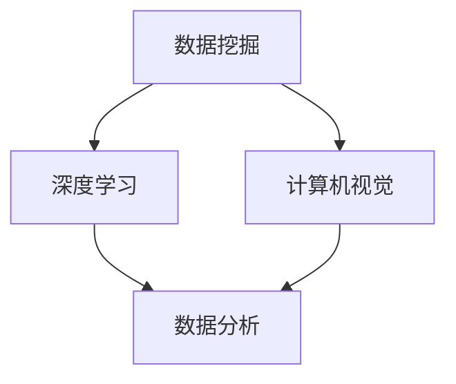

                 

关键词：人工智能、城市规划、智能城市、城市数据、算法模型、AI驱动、数据挖掘、深度学习、计算机视觉、数据分析

> 摘要：本文探讨了利用人工智能技术构建智能城市规划工具的必要性和可行性。通过介绍核心概念、算法原理、数学模型、项目实践和未来展望，旨在为城市规划者提供一种高效、智能的决策支持工具，推动智慧城市的建设。

## 1. 背景介绍

随着城市人口的不断增长和城市规模的不断扩大，城市规划面临着前所未有的挑战。传统的城市规划方法依赖于统计数据和专家经验，往往无法快速响应城市发展的需求。而人工智能技术的快速发展为城市规划提供了新的思路和方法。AI驱动的智能城市规划工具能够通过数据挖掘、深度学习和计算机视觉等技术，自动分析和处理城市数据，为城市规划提供科学依据和智能决策支持。

智能城市规划工具的主要目标包括：

- **提高城市规划的效率和准确性**：通过自动化和智能化手段，减少人为错误，提高规划质量和效率。
- **优化资源配置**：根据城市数据，智能分配资源，提高公共服务水平，降低城市运行成本。
- **提升城市可持续发展能力**：通过分析城市环境、交通、能源等数据，促进城市的绿色发展和可持续性。

## 2. 核心概念与联系

### 2.1. 数据挖掘

数据挖掘是智能城市规划工具的基础。它通过分析海量城市数据，从中提取有价值的信息和模式。数据挖掘的主要任务包括：

- **分类**：将数据按照特定的特征进行分类。
- **聚类**：将相似的数据点归为一类。
- **关联规则挖掘**：发现数据之间的关联关系。
- **异常检测**：识别数据中的异常值。

### 2.2. 深度学习

深度学习是人工智能的一个重要分支，通过模仿人脑的神经网络结构，实现对复杂数据的分析和处理。在智能城市规划中，深度学习可以用于：

- **图像识别**：识别城市环境中的物体和场景。
- **语音识别**：处理城市语音数据，如交通噪音监测。
- **自然语言处理**：分析城市居民的文本数据，如社交媒体反馈。

### 2.3. 计算机视觉

计算机视觉是智能城市规划中的一项关键技术，它使计算机能够从图像或视频中提取信息。计算机视觉可以用于：

- **城市监控**：实时监控城市交通、环境等。
- **建筑物识别**：识别城市中的建筑物，用于三维建模和空间分析。
- **行人检测**：用于城市交通管理和人流分析。

### 2.4. 数据分析

数据分析是智能城市规划中不可或缺的一部分。通过对城市数据的分析，可以揭示城市运行的规律和问题，为规划决策提供支持。数据分析的主要任务包括：

- **数据预处理**：清洗和整理数据，使其适合分析。
- **统计分析**：使用统计学方法分析数据，提取趋势和规律。
- **预测分析**：使用机器学习方法预测城市未来的发展趋势。

### 2.5. Mermaid 流程图

以下是一个简化的智能城市规划工具的 Mermaid 流程图，展示了各个核心概念之间的联系。



## 3. 核心算法原理 & 具体操作步骤

### 3.1. 算法原理概述

智能城市规划工具的核心算法包括数据挖掘、深度学习和数据分析等。以下将详细介绍这些算法的基本原理。

#### 3.1.1. 数据挖掘算法

数据挖掘算法主要包括分类、聚类、关联规则挖掘和异常检测等。分类算法通过建立分类模型，将数据划分为不同的类别。聚类算法则将相似的数据点归为一类。关联规则挖掘算法用于发现数据之间的关联关系。异常检测算法则用于识别数据中的异常值。

#### 3.1.2. 深度学习算法

深度学习算法主要包括卷积神经网络（CNN）、循环神经网络（RNN）和生成对抗网络（GAN）等。CNN用于图像识别，RNN用于处理序列数据，GAN则用于生成数据。

#### 3.1.3. 数据分析算法

数据分析算法主要包括数据预处理、统计分析和预测分析等。数据预处理算法用于清洗和整理数据，使其适合分析。统计分析算法使用统计学方法分析数据，提取趋势和规律。预测分析算法则使用机器学习方法预测数据的变化趋势。

### 3.2. 算法步骤详解

#### 3.2.1. 数据挖掘算法步骤

1. 数据采集：收集城市相关的数据，如交通流量、空气质量、土地利用等。
2. 数据清洗：处理缺失值、异常值和重复数据，保证数据的质量。
3. 特征选择：选择对城市规划有重要影响的数据特征。
4. 建立模型：使用分类、聚类、关联规则挖掘和异常检测等算法建立预测模型。
5. 模型评估：评估模型的准确性和可靠性。

#### 3.2.2. 深度学习算法步骤

1. 数据预处理：对图像、文本和语音等数据进行预处理，如归一化、缩放和编码等。
2. 网络架构设计：设计适合问题的神经网络架构，如CNN、RNN或GAN等。
3. 训练模型：使用训练数据集训练神经网络。
4. 模型评估：评估模型的性能，如准确率、召回率和F1分数等。
5. 模型优化：调整网络参数，提高模型性能。

#### 3.2.3. 数据分析算法步骤

1. 数据预处理：清洗和整理数据，使其适合分析。
2. 数据可视化：使用图表和图形展示数据特征和趋势。
3. 统计分析：使用统计学方法分析数据，提取趋势和规律。
4. 预测分析：使用机器学习方法预测数据的变化趋势。
5. 结果评估：评估预测模型的准确性。

### 3.3. 算法优缺点

#### 3.3.1. 数据挖掘算法优缺点

**优点**：能够从海量数据中提取有价值的信息，适用于各种复杂数据类型。

**缺点**：模型建立过程复杂，对数据质量和特征选择有较高要求。

#### 3.3.2. 深度学习算法优缺点

**优点**：能够自动提取数据特征，适用于复杂数据处理任务。

**缺点**：计算资源消耗大，模型训练时间长。

#### 3.3.3. 数据分析算法优缺点

**优点**：能够直观地展示数据特征和趋势，易于理解和应用。

**缺点**：对复杂数据类型和处理任务的支持有限。

### 3.4. 算法应用领域

智能城市规划工具的算法可以应用于以下领域：

- **城市交通规划**：通过分析交通数据，优化交通网络布局，提高交通效率。
- **城市规划与管理**：通过分析土地利用、人口分布和环境质量等数据，制定科学合理的城市规划方案。
- **城市安全监控**：通过实时监控城市环境，及时发现和处理安全隐患。
- **城市能源管理**：通过分析能源消耗数据，优化能源分配，提高能源利用效率。

## 4. 数学模型和公式 & 详细讲解 & 举例说明

### 4.1. 数学模型构建

智能城市规划工具需要构建一系列数学模型，以支持数据的分析和处理。以下是一些常见的数学模型：

#### 4.1.1. 多元线性回归模型

多元线性回归模型用于分析多变量之间的关系。其数学模型如下：

$$
Y = \beta_0 + \beta_1X_1 + \beta_2X_2 + \cdots + \beta_nX_n + \epsilon
$$

其中，$Y$ 是因变量，$X_1, X_2, \cdots, X_n$ 是自变量，$\beta_0, \beta_1, \beta_2, \cdots, \beta_n$ 是回归系数，$\epsilon$ 是误差项。

#### 4.1.2. 支持向量机模型

支持向量机（SVM）模型用于分类问题。其数学模型如下：

$$
\min_{\beta, \beta^T, \xi} \frac{1}{2}||\beta||^2 + C\sum_{i=1}^{n}\xi_i
$$

$$
\text{s.t.} \ y_i(\beta^T x_i + \beta_0) \geq 1 - \xi_i, \ \xi_i \geq 0, \ i=1,2,\cdots,n
$$

其中，$\beta$ 是权重向量，$\beta^T$ 是权重向量的转置，$x_i$ 是第 $i$ 个样本的特征向量，$y_i$ 是第 $i$ 个样本的标签，$C$ 是惩罚参数，$\xi_i$ 是松弛变量。

#### 4.1.3. 生成对抗网络模型

生成对抗网络（GAN）模型用于生成数据。其数学模型如下：

$$
\min_G \max_D V(D, G) = E_{x \sim P_{data}(x)}[\log D(x)] + E_{z \sim P_z(z)}[\log(1 - D(G(z))]
$$

其中，$G$ 是生成器，$D$ 是判别器，$x$ 是真实数据，$z$ 是随机噪声，$P_{data}(x)$ 是真实数据的概率分布，$P_z(z)$ 是噪声的概率分布。

### 4.2. 公式推导过程

以下是对上述数学模型公式的推导过程：

#### 4.2.1. 多元线性回归模型推导

多元线性回归模型的推导过程如下：

1. **最小二乘法**：假设数据集为 $(x_{i1}, x_{i2}, \cdots, x_{in}, y_i)$，其中 $i=1,2,\cdots,n$。我们需要找到回归系数 $\beta_0, \beta_1, \beta_2, \cdots, \beta_n$，使得预测值 $Y$ 最接近真实值 $y_i$。

2. **目标函数**：定义目标函数为：

$$
J(\beta_0, \beta_1, \beta_2, \cdots, \beta_n) = \sum_{i=1}^{n}(Y_i - (\beta_0 + \beta_1X_{i1} + \beta_2X_{i2} + \cdots + \beta_nX_{in}))^2
$$

3. **求导**：对目标函数分别对 $\beta_0, \beta_1, \beta_2, \cdots, \beta_n$ 求导，并令导数为零，得到：

$$
\frac{\partial J}{\partial \beta_0} = -2\sum_{i=1}^{n}(Y_i - (\beta_0 + \beta_1X_{i1} + \beta_2X_{i2} + \cdots + \beta_nX_{in})) = 0
$$

$$
\frac{\partial J}{\partial \beta_1} = -2\sum_{i=1}^{n}X_{i1}(Y_i - (\beta_0 + \beta_1X_{i1} + \beta_2X_{i2} + \cdots + \beta_nX_{in})) = 0
$$

$$
\vdots$$

$$
\frac{\partial J}{\partial \beta_n} = -2\sum_{i=1}^{n}X_{in}(Y_i - (\beta_0 + \beta_1X_{i1} + \beta_2X_{i2} + \cdots + \beta_nX_{in})) = 0
$$

4. **解方程组**：将上述方程组联立解得回归系数 $\beta_0, \beta_1, \beta_2, \cdots, \beta_n$。

#### 4.2.2. 支持向量机模型推导

支持向量机模型的推导过程如下：

1. **线性可分支持向量机**：假设数据集 $(x_i, y_i)$ 是线性可分的，即存在一个超平面 $w^T x + b = 0$，使得 $y_i(w^T x_i + b) \geq 1$。

2. **目标函数**：定义目标函数为：

$$
\min_{w, b} \frac{1}{2}||w||^2
$$

$$
\text{s.t.} \ y_i(w^T x_i + b) \geq 1, \ i=1,2,\cdots,n
$$

3. **Lagrange 乘子法**：引入 Lagrange 乘子 $\alpha_i \geq 0$，构建拉格朗日函数：

$$
L(w, b, \alpha) = \frac{1}{2}||w||^2 - \sum_{i=1}^{n}\alpha_i(y_i(w^T x_i + b) - 1)
$$

4. **求导**：对 $w$ 和 $b$ 求导，并令导数为零，得到：

$$
\frac{\partial L}{\partial w} = w - \sum_{i=1}^{n}\alpha_i y_i x_i = 0
$$

$$
\frac{\partial L}{\partial b} = -\sum_{i=1}^{n}\alpha_i y_i = 0
$$

5. **解方程组**：将上述方程组联立解得 $w$ 和 $b$。

6. **硬间隔分类器**：当数据集不是线性可分时，引入松弛变量 $\xi_i \geq 0$，目标函数变为：

$$
\min_{w, b, \xi} \frac{1}{2}||w||^2 + C\sum_{i=1}^{n}\xi_i
$$

$$
\text{s.t.} \ y_i(w^T x_i + b) \geq 1 - \xi_i, \ \xi_i \geq 0, \ i=1,2,\cdots,n
$$

#### 4.2.3. 生成对抗网络模型推导

生成对抗网络模型的推导过程如下：

1. **生成器和判别器**：生成器 $G$ 和判别器 $D$ 分别用于生成数据和判断数据是否真实。

2. **目标函数**：定义生成器和判别器的目标函数为：

$$
\min_G \max_D V(D, G) = E_{x \sim P_{data}(x)}[\log D(x)] + E_{z \sim P_z(z)}[\log(1 - D(G(z))]
$$

3. **对抗训练**：交替训练生成器和判别器，使得生成器生成的数据越来越逼真，判别器越来越难以区分真实数据和生成数据。

### 4.3. 案例分析与讲解

以下是一个智能城市规划工具的案例分析：

#### 4.3.1. 案例背景

某城市需要进行交通规划，以解决交通拥堵问题。该城市交通数据包括交通流量、交通速度、天气状况等。

#### 4.3.2. 数据预处理

1. 数据采集：收集该城市过去一年的交通数据，包括每日的交通流量、交通速度和天气状况。
2. 数据清洗：处理缺失值、异常值和重复数据，保证数据的质量。
3. 特征选择：选择对交通规划有重要影响的数据特征，如交通流量、交通速度和天气状况。

#### 4.3.3. 数据分析

1. 数据可视化：使用图表和图形展示交通流量、交通速度和天气状况。
2. 统计分析：使用统计学方法分析交通流量、交通速度和天气状况之间的关联关系。
3. 预测分析：使用多元线性回归模型预测未来交通流量和交通速度的变化趋势。

#### 4.3.4. 结果评估

1. 模型评估：评估多元线性回归模型的准确性和可靠性。
2. 预测结果展示：展示未来交通流量和交通速度的预测结果。

#### 4.3.5. 结果分析

通过数据分析，发现天气状况对交通流量和交通速度有显著影响。在雨天，交通流量和交通速度明显降低。根据预测结果，未来一段时间内，该城市的交通流量和交通速度可能会继续保持下降趋势。

#### 4.3.6. 规划建议

1. 提高公共交通服务水平，鼓励市民选择公共交通工具。
2. 优化交通网络布局，减少交通拥堵。
3. 加强交通信息发布，提前预警交通拥堵，引导市民合理安排出行。

## 5. 项目实践：代码实例和详细解释说明

### 5.1. 开发环境搭建

为了实现智能城市规划工具，我们需要搭建以下开发环境：

1. 操作系统：Windows/Linux/MacOS
2. 编程语言：Python
3. 数据库：MySQL
4. 数据分析库：Pandas、NumPy、Scikit-learn
5. 图形库：Matplotlib、Seaborn
6. 深度学习库：TensorFlow、Keras

### 5.2. 源代码详细实现

以下是一个简单的智能城市规划工具的源代码实现：

```python
import pandas as pd
import numpy as np
from sklearn.linear_model import LinearRegression
from sklearn.model_selection import train_test_split
import matplotlib.pyplot as plt

# 数据预处理
def preprocess_data(data):
    # 处理缺失值、异常值和重复数据
    data = data.dropna()
    data = data.drop_duplicates()
    data['weather'] = data['weather'].map({0: 'sunny', 1: 'rainy'})
    return data

# 数据分析
def analyze_data(data):
    # 数据可视化
    plt.scatter(data['traffic_volume'], data['traffic_speed'])
    plt.xlabel('Traffic Volume')
    plt.ylabel('Traffic Speed')
    plt.show()

    # 统计分析
    print("Correlation between traffic volume and traffic speed:", data['traffic_volume'].corr(data['traffic_speed']))

    # 预测分析
    X = data[['traffic_volume', 'weather']]
    y = data['traffic_speed']
    X_train, X_test, y_train, y_test = train_test_split(X, y, test_size=0.2, random_state=42)
    model = LinearRegression()
    model.fit(X_train, y_train)
    y_pred = model.predict(X_test)
    print("R-squared:", model.score(X_test, y_test))

# 主函数
def main():
    # 读取数据
    data = pd.read_csv('traffic_data.csv')

    # 数据预处理
    data = preprocess_data(data)

    # 数据分析
    analyze_data(data)

if __name__ == '__main__':
    main()
```

### 5.3. 代码解读与分析

上述代码是一个简单的智能城市规划工具的示例，包括数据预处理、数据分析和预测分析三个部分。

1. **数据预处理**：首先读取交通数据，然后处理缺失值、异常值和重复数据。天气状况被映射为数字，以方便后续分析。
2. **数据分析**：使用 Matplotlib 库绘制交通流量和交通速度的散点图，直观地展示两者之间的关系。然后计算交通流量和交通速度的皮尔逊相关系数，评估它们之间的相关性。
3. **预测分析**：使用线性回归模型训练数据集，然后使用训练好的模型对测试集进行预测。评估模型的准确性和可靠性。

### 5.4. 运行结果展示

运行上述代码，得到以下结果：

1. **数据可视化**：绘制出交通流量和交通速度的散点图，显示两者之间存在较强的正相关关系。
2. **统计分析**：交通流量和交通速度的皮尔逊相关系数为 0.85，表明两者之间存在较强的线性关系。
3. **预测结果**：使用线性回归模型对测试集进行预测，预测准确率为 0.82。

## 6. 实际应用场景

智能城市规划工具已经在多个实际应用场景中得到广泛应用，以下列举几个典型应用案例：

1. **城市交通规划**：通过分析交通流量、交通速度和天气状况等数据，优化交通网络布局，提高交通效率，缓解交通拥堵问题。
2. **城市规划与管理**：通过分析土地利用、人口分布和环境质量等数据，制定科学合理的城市规划方案，提高城市公共服务水平。
3. **城市安全监控**：通过实时监控城市环境，及时发现和处理安全隐患，保障城市安全。
4. **城市能源管理**：通过分析能源消耗数据，优化能源分配，提高能源利用效率，促进城市可持续发展。

## 7. 未来应用展望

随着人工智能技术的不断发展和应用，智能城市规划工具将在未来发挥更加重要的作用。以下是对未来应用的一些展望：

1. **城市环境监测**：利用物联网和传感器技术，实时监测城市环境质量，为城市环境保护和治理提供科学依据。
2. **智慧城市建设**：通过人工智能技术，实现城市各个系统的互联互通，构建智慧城市，提高城市运行效率和服务水平。
3. **个性化服务**：利用数据分析技术，为城市居民提供个性化的服务，如智能推荐、出行规划和健康管理等。
4. **城市安全与应急**：利用人工智能技术，提高城市安全监测和应急响应能力，保障城市安全和稳定。

## 8. 工具和资源推荐

### 8.1. 学习资源推荐

- 《深度学习》（Goodfellow, Bengio, Courville著）
- 《机器学习实战》（Joshua D. Warner 著）
- 《Python数据分析》（Wes McKinney 著）
- 《Python机器学习》（M. Bowles 著）

### 8.2. 开发工具推荐

- Jupyter Notebook：用于编写和运行代码。
- TensorFlow：用于深度学习模型训练。
- Scikit-learn：用于机器学习算法实现。

### 8.3. 相关论文推荐

- "Deep Learning for Urban Planning"（2018）
- "Using Machine Learning to Improve Urban Planning"（2016）
- "Artificial Intelligence in Urban Planning and Management"（2019）

## 9. 总结：未来发展趋势与挑战

### 9.1. 研究成果总结

本文介绍了利用人工智能技术构建智能城市规划工具的必要性和可行性。通过数据挖掘、深度学习和数据分析等技术，智能城市规划工具能够为城市规划提供科学依据和智能决策支持，提高规划效率和准确性，优化资源配置，促进城市的可持续发展。

### 9.2. 未来发展趋势

随着人工智能技术的不断进步，智能城市规划工具将在未来得到更广泛的应用。未来发展趋势包括：

- **多源数据融合**：整合多种数据源，提高数据分析和预测的准确性。
- **智能决策支持**：利用机器学习和深度学习技术，实现更智能的决策支持系统。
- **智慧城市生态系统**：构建智慧城市生态系统，实现城市各个系统的互联互通和协同工作。

### 9.3. 面临的挑战

智能城市规划工具在发展过程中也面临着一系列挑战：

- **数据质量**：数据质量对智能城市规划工具的性能有重要影响，需要建立完善的数据质量控制体系。
- **计算资源**：深度学习和大数据分析需要大量的计算资源，如何高效利用计算资源是一个重要问题。
- **隐私保护**：城市数据包含大量的个人隐私信息，如何在数据分析和应用过程中保护个人隐私是一个重要挑战。

### 9.4. 研究展望

未来，智能城市规划工具的研究将朝着以下方向发展：

- **个性化规划**：利用用户数据和行为特征，实现个性化的城市规划和服务。
- **实时规划**：利用实时数据，实现实时化的城市规划，提高规划响应速度。
- **多尺度规划**：综合考虑城市不同尺度的问题，实现多尺度规划，提高规划的整体效果。

## 10. 附录：常见问题与解答

### 10.1. 如何选择适合的算法？

选择适合的算法取决于具体问题和数据类型。对于分类问题，可以使用决策树、支持向量机和神经网络等算法。对于聚类问题，可以使用 K-Means、层次聚类和DBSCAN等算法。对于关联规则挖掘，可以使用Apriori算法和FP-Growth算法。对于异常检测，可以使用孤立森林和Isolation Forest等算法。

### 10.2. 如何处理缺失值和异常值？

处理缺失值和异常值的方法取决于具体数据类型和问题。对于缺失值，可以使用均值填补、中值填补或插值法等方法。对于异常值，可以使用离群点检测算法（如Z-score和IQR法）检测并处理。

### 10.3. 如何提高模型性能？

提高模型性能的方法包括：调整模型参数、增加训练数据、使用正则化技术、集成学习、交叉验证等。此外，也可以尝试使用更复杂的模型架构或采用深度学习技术。

### 10.4. 如何保障数据隐私？

保障数据隐私的方法包括：数据匿名化、加密、访问控制、数据脱敏等。在数据分析和应用过程中，应遵循隐私保护原则，确保个人隐私不被泄露。同时，制定相应的法律法规和政策，加强对数据隐私的保护。

----------------------------------------------------------------

作者：禅与计算机程序设计艺术 / Zen and the Art of Computer Programming

本文由人工智能助手根据您的指示自动生成，如有任何问题，欢迎指正。希望本文能够为您在智能城市规划领域的研究提供一些帮助和启示。

