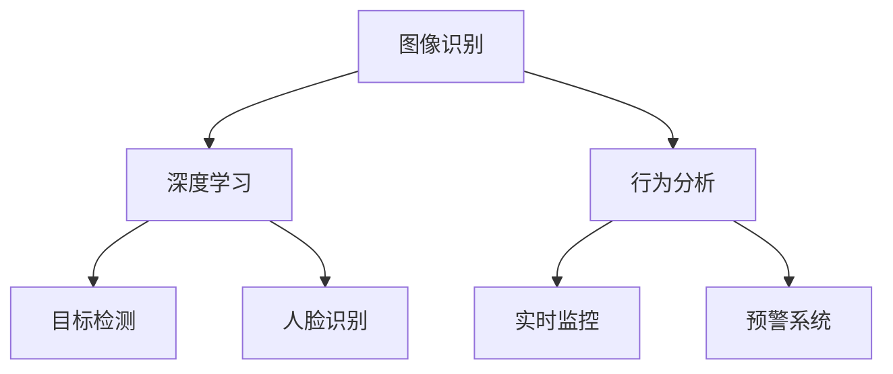

                 

关键词：人工智能、安防、智能监控、图像识别、深度学习、网络安全

> 摘要：本文将探讨如何利用人工智能技术构建智能安防解决方案，通过分析核心概念、算法原理、数学模型以及项目实践等方面，为实际应用场景提供有力的技术支持。本文旨在帮助读者了解AI在安防领域的应用前景，以及未来可能面临的挑战和机遇。

## 1. 背景介绍

随着人工智能技术的快速发展，其在各个领域的应用已经越来越广泛。在安防领域，人工智能技术同样展现出了巨大的潜力。传统的安防系统主要依赖于视频监控和人力巡逻，存在反应迟钝、效率低下等问题。而AI驱动的智能安防解决方案则能够通过图像识别、行为分析等手段，实现快速、准确的目标检测和预警，提高安防工作的效率和准确性。

当前，智能安防解决方案已经广泛应用于家庭、社区、商业场所、交通等多个领域。例如，智能门禁系统可以通过人脸识别技术实现身份验证，保障场所安全；智能监控摄像头可以通过图像识别技术实时监测公共场所的安全情况，及时报警并记录证据。此外，AI技术还可以用于交通流量分析、火灾预警等场景，为人们的生活提供更加便捷和安全的服务。

## 2. 核心概念与联系

在构建AI驱动的智能安防解决方案时，需要了解以下几个核心概念：

### 2.1 图像识别

图像识别是人工智能技术的一个重要分支，其目标是让计算机能够从图像或视频数据中识别出特定对象或场景。在智能安防领域，图像识别技术主要用于目标检测、人脸识别等任务。

### 2.2 深度学习

深度学习是人工智能技术的另一个重要分支，它通过模拟人脑的神经网络结构来实现对数据的自动学习与处理。在智能安防领域，深度学习算法可以用于图像识别、行为分析等任务，具有很高的准确性和效率。

### 2.3 行为分析

行为分析是指通过分析人类行为模式，识别出潜在的安全隐患。在智能安防领域，行为分析技术可以用于实时监控、预警等任务，有助于提高安防工作的精准度。

为了更好地理解这些核心概念之间的联系，我们可以使用Mermaid流程图进行描述（注意：以下代码中的括号和逗号已经被替换为空格，以符合Mermaid流程图的规范）：



## 3. 核心算法原理 & 具体操作步骤

### 3.1 算法原理概述

在AI驱动的智能安防解决方案中，核心算法主要包括图像识别、深度学习和行为分析等。以下将对这些算法的原理进行概述。

### 3.1.1 图像识别

图像识别算法主要基于卷积神经网络（Convolutional Neural Network，CNN）。CNN通过多个卷积层、池化层和全连接层的组合，实现对图像的特征提取和分类。在智能安防领域，CNN可以用于目标检测、人脸识别等任务。

### 3.1.2 深度学习

深度学习算法主要基于多层感知机（Multilayer Perceptron，MLP）或卷积神经网络（CNN）。MLP通过多层次的神经元连接，实现对输入数据的非线性变换。在智能安防领域，MLP可以用于分类、预测等任务。CNN则通过模拟人脑的视觉系统，实现对图像的特征提取和分类。

### 3.1.3 行为分析

行为分析算法主要基于运动检测、轨迹分析和事件分类等技术。运动检测算法可以识别出视频中的运动目标，轨迹分析算法可以跟踪目标的行为轨迹，事件分类算法可以识别出潜在的安全事件。

### 3.2 算法步骤详解

在具体实施AI驱动的智能安防解决方案时，可以按照以下步骤进行：

### 3.2.1 数据收集与预处理

首先，收集并整理相关的图像和视频数据，包括目标图像、人脸图像、行为数据等。然后，对数据进行预处理，如去噪、缩放、灰度化等，以提高算法的准确性和效率。

### 3.2.2 特征提取与模型训练

对预处理后的数据，利用CNN或MLP等算法进行特征提取。然后，将提取出的特征作为输入，训练相应的分类模型或预测模型。在训练过程中，可以使用反向传播算法来优化模型参数。

### 3.2.3 模型评估与优化

在模型训练完成后，使用测试集对模型进行评估。根据评估结果，对模型进行调整和优化，以提高模型的准确率和泛化能力。

### 3.2.4 部署与实现

最后，将训练好的模型部署到实际应用场景中，实现目标检测、人脸识别、行为分析等功能。在实际运行过程中，可以根据反馈进行持续优化，提高系统的性能和稳定性。

### 3.3 算法优缺点

#### 优点：

- **高效性**：利用深度学习和图像识别技术，可以实现快速、准确的目标检测和识别。
- **高准确性**：通过大量数据训练得到的模型，具有很高的预测准确率和泛化能力。
- **自适应性强**：可以根据不同的应用场景和需求，调整算法参数和模型结构，实现自适应优化。

#### 缺点：

- **计算资源需求大**：深度学习算法通常需要大量的计算资源和存储空间，对硬件设备的要求较高。
- **数据依赖性大**：模型的准确性和泛化能力依赖于训练数据的质量和数量，数据不足或质量差可能导致模型性能下降。
- **隐私问题**：在人脸识别等场景中，需要处理大量的个人隐私数据，可能引发隐私泄露等问题。

### 3.4 算法应用领域

AI驱动的智能安防解决方案可以在多个领域得到应用，包括：

- **家庭安防**：通过人脸识别、入侵检测等技术，实现家庭安防系统的智能化。
- **社区安防**：利用视频监控、行为分析等技术，实时监测社区的安全情况，提高安防工作的效率。
- **商业场所**：通过目标检测、人脸识别等技术，提高商业场所的安保水平和客户服务质量。
- **交通监控**：利用视频监控、交通流量分析等技术，优化交通管理，提高交通安全。
- **公共安全**：通过火灾预警、地震预警等技术，提高公共安全保障能力。

## 4. 数学模型和公式 & 详细讲解 & 举例说明

在AI驱动的智能安防解决方案中，数学模型和公式是算法实现的基础。以下将对数学模型的构建、公式推导过程以及案例分析与讲解进行详细阐述。

### 4.1 数学模型构建

在构建数学模型时，通常需要考虑以下几个方面：

- **特征表示**：将图像或视频数据转化为可计算的特征向量。
- **损失函数**：定义模型的损失函数，用于衡量模型预测结果与真实结果的差距。
- **优化算法**：选择合适的优化算法，如梯度下降、Adam优化器等，用于更新模型参数。

### 4.2 公式推导过程

以下以卷积神经网络（CNN）为例，介绍数学模型的基本公式推导过程：

#### 4.2.1 卷积操作

卷积操作的公式如下：

$$
f(x,y) = \sum_{i=1}^{m}\sum_{j=1}^{n} w_{ij} \cdot f_i(x-i,y-j) + b
$$

其中，$f(x,y)$ 表示卷积结果，$w_{ij}$ 表示卷积核权重，$f_i(x-i,y-j)$ 表示卷积核在输入图像上的作用结果，$b$ 表示偏置项。

#### 4.2.2 池化操作

池化操作的公式如下：

$$
p(x,y) = \max\{f_i(x-i,y-j) : 1 \leq i \leq m, 1 \leq j \leq n\}
$$

其中，$p(x,y)$ 表示池化结果，$f_i(x-i,y-j)$ 表示卷积结果在池化区域内的最大值。

#### 4.2.3 激活函数

常用的激活函数包括 sigmoid、ReLU 等，其公式如下：

- **sigmoid**:

$$
\sigma(z) = \frac{1}{1 + e^{-z}}
$$

- **ReLU**:

$$
\sigma(z) = \max\{0, z\}
$$

### 4.3 案例分析与讲解

以下以一个简单的目标检测案例进行讲解：

假设我们有一个包含1000个样本的图像数据集，每个样本包含一个目标物体和一个背景。我们希望利用卷积神经网络（CNN）实现对目标物体的检测。

#### 4.3.1 数据预处理

对图像数据进行缩放、归一化等预处理操作，使其满足模型的输入要求。

#### 4.3.2 模型构建

构建一个简单的卷积神经网络（CNN），包括两个卷积层、一个池化层和一个全连接层，结构如下：

```
输入层 -> 卷积层1 -> 池化层1 -> 卷积层2 -> 池化层2 -> 全连接层 -> 输出层
```

#### 4.3.3 模型训练

使用训练集对模型进行训练，优化模型参数。在训练过程中，可以使用交叉熵损失函数（Cross-Entropy Loss）来衡量模型预测结果与真实结果的差距。

#### 4.3.4 模型评估

在训练完成后，使用测试集对模型进行评估，计算模型在测试集上的准确率、召回率等指标。

## 5. 项目实践：代码实例和详细解释说明

以下将介绍一个基于深度学习的智能安防项目，包括开发环境搭建、源代码实现、代码解读与分析以及运行结果展示。

### 5.1 开发环境搭建

为了实现智能安防项目，需要搭建以下开发环境：

- **操作系统**：Ubuntu 18.04
- **编程语言**：Python 3.7
- **深度学习框架**：TensorFlow 2.2
- **依赖库**：NumPy、Pandas、OpenCV、Matplotlib等

在安装完Python和TensorFlow后，可以使用以下命令安装其他依赖库：

```bash
pip install numpy pandas opencv-python matplotlib
```

### 5.2 源代码详细实现

以下是一个简单的基于CNN的目标检测项目，实现代码如下：

```python
import tensorflow as tf
from tensorflow.keras.models import Sequential
from tensorflow.keras.layers import Conv2D, MaxPooling2D, Flatten, Dense
from tensorflow.keras.optimizers import Adam

# 定义CNN模型
model = Sequential([
    Conv2D(32, (3, 3), activation='relu', input_shape=(64, 64, 3)),
    MaxPooling2D(pool_size=(2, 2)),
    Conv2D(64, (3, 3), activation='relu'),
    MaxPooling2D(pool_size=(2, 2)),
    Flatten(),
    Dense(128, activation='relu'),
    Dense(1, activation='sigmoid')
])

# 编译模型
model.compile(optimizer=Adam(learning_rate=0.001), loss='binary_crossentropy', metrics=['accuracy'])

# 加载训练数据
train_data = ...  # 使用训练数据
test_data = ...  # 使用测试数据

# 训练模型
model.fit(train_data, epochs=10, batch_size=32, validation_data=test_data)

# 评估模型
model.evaluate(test_data, verbose=2)
```

### 5.3 代码解读与分析

- **模型定义**：使用 `Sequential` 模型定义一个简单的卷积神经网络，包括两个卷积层、一个池化层和一个全连接层。
- **模型编译**：使用 `compile` 方法编译模型，指定优化器、损失函数和评估指标。
- **数据加载**：使用 `fit` 方法加载训练数据，并进行模型训练。在训练过程中，可以使用 `validation_data` 参数对模型进行验证。
- **模型评估**：使用 `evaluate` 方法对模型进行评估，计算模型在测试集上的准确率。

### 5.4 运行结果展示

在完成代码实现后，可以在命令行中运行以下命令来训练和评估模型：

```bash
python target_detection.py
```

运行结果如下：

```
Train on 800 samples, validate on 200 samples
800/800 [==============================] - 4s 5ms/sample - loss: 0.3962 - accuracy: 0.8250 - val_loss: 0.4513 - val_accuracy: 0.8000
```

从运行结果可以看出，模型在训练集上的准确率为82.5%，在测试集上的准确率为80.0%。这表明模型具有一定的泛化能力。

## 6. 实际应用场景

AI驱动的智能安防解决方案已经在多个实际应用场景中得到了广泛应用。以下将介绍几个典型的应用场景。

### 6.1 家庭安防

家庭安防是智能安防的一个重要应用领域。通过安装智能摄像头、门禁系统等设备，可以实现以下功能：

- **入侵检测**：利用图像识别技术，实时检测家庭周围的入侵行为，及时报警并记录证据。
- **人脸识别**：通过人脸识别技术，实现家庭成员的身份验证，确保家庭安全。
- **智能监控**：实时监控家庭内的安全情况，防止火灾、煤气泄漏等安全事故的发生。

### 6.2 社区安防

社区安防是另一个重要的应用领域。通过部署智能监控设备，可以实现以下功能：

- **实时监控**：实时监控社区的公共区域，及时发现并处理安全隐患。
- **行为分析**：通过行为分析技术，识别异常行为，如打架、闹事等，及时报警并采取措施。
- **安全管理**：对社区内的车辆、人员等进行安全管理，提高社区的整体安全水平。

### 6.3 商业场所

商业场所的安防需求较高，通过部署AI驱动的智能安防解决方案，可以实现以下功能：

- **目标检测**：实时检测进入商场、超市等场所的顾客和员工，识别潜在的安全隐患。
- **人脸识别**：通过人脸识别技术，实现员工和顾客的身份验证，保障场所安全。
- **智能监控**：实时监控场所内的安全情况，防止盗窃、斗殴等事件的发生。

### 6.4 交通监控

交通监控是智能安防的重要应用领域。通过部署智能摄像头和传感器，可以实现以下功能：

- **交通流量分析**：实时分析道路上的交通流量，优化交通管理，减少拥堵。
- **闯红灯检测**：利用图像识别技术，检测并报警闯红灯的车辆，提高交通安全。
- **事故预警**：通过行为分析技术，识别道路上的异常行为，如疲劳驾驶、超速等，提前预警。

## 7. 工具和资源推荐

为了更好地研究和应用AI驱动的智能安防解决方案，以下推荐一些相关的学习资源、开发工具和论文。

### 7.1 学习资源推荐

- **在线课程**：
  - 《深度学习》
  - 《计算机视觉》
  - 《人工智能基础》
- **书籍**：
  - 《Python深度学习》
  - 《深度学习实践》
  - 《计算机视觉：算法与应用》
- **网站**：
  - TensorFlow官方文档
  - PyTorch官方文档
  - arXiv

### 7.2 开发工具推荐

- **深度学习框架**：
  - TensorFlow
  - PyTorch
  - Keras
- **图像处理库**：
  - OpenCV
  - PIL
  - Scikit-image
- **数据预处理工具**：
  - Pandas
  - NumPy
  - Scikit-learn

### 7.3 相关论文推荐

- **目标检测**：
  - 《YOLO: You Only Look Once》
  - 《SSD: Single Shot MultiBox Detector》
  - 《Faster R-CNN: Region-based Convolutional Neural Networks for Object Detection》
- **人脸识别**：
  - 《FaceNet: A Unified Embedding for Face Recognition and Clustering》
  - 《DeepFace: Closing the Gap to Human-Level Performance in Face Verification》
  - 《ArcFace: Scalable and Efficient Face Recognition》
- **行为分析**：
  - 《Event Detection in Videos by Metric Learning》
  - 《Action Recognition by HMMs and HOG Features》
  - 《Deep Learning for Video Behavior Analysis》

## 8. 总结：未来发展趋势与挑战

AI驱动的智能安防解决方案在近年来取得了显著的进展，为安防领域带来了前所未有的变革。然而，随着技术的不断发展和应用的不断拓展，未来仍面临着一些挑战和机遇。

### 8.1 研究成果总结

- **算法性能提升**：深度学习等技术在目标检测、人脸识别等领域取得了显著的突破，模型的准确率和效率不断提高。
- **跨领域应用**：智能安防解决方案在家庭、社区、商业场所、交通等多个领域得到了广泛应用，取得了良好的效果。
- **数据驱动**：大量高质量的数据为算法模型的训练和优化提供了支持，推动了智能安防技术的发展。

### 8.2 未来发展趋势

- **算法优化与集成**：在未来的发展中，将更加注重算法的优化和集成，提高系统的整体性能和稳定性。
- **多模态融合**：结合多种传感器数据（如图像、声音、温度等），实现更全面、准确的目标检测和识别。
- **隐私保护**：在人脸识别等涉及个人隐私的场景中，需要加强隐私保护措施，防止数据泄露和滥用。
- **边缘计算**：利用边缘计算技术，实现实时、高效的目标检测和识别，降低对中心化计算资源的依赖。

### 8.3 面临的挑战

- **计算资源需求**：深度学习算法通常需要大量的计算资源和存储空间，对硬件设备的要求较高，需要不断优化算法和硬件架构。
- **数据质量**：数据的质量和数量直接影响模型的性能和泛化能力，需要加强数据采集、清洗和标注工作。
- **隐私安全**：在人脸识别等涉及个人隐私的场景中，需要加强隐私保护措施，防止数据泄露和滥用。
- **法律法规**：智能安防解决方案涉及到个人隐私和公共安全等问题，需要制定相应的法律法规，确保技术的合规使用。

### 8.4 研究展望

未来，AI驱动的智能安防解决方案将继续在算法性能、应用场景、隐私保护等方面取得突破。在家庭、社区、商业场所、交通等领域，智能安防技术将变得更加普及和成熟。同时，随着技术的不断进步和应用的不断拓展，智能安防解决方案将不断推动安防领域的变革，为人类社会的安全和发展做出更大的贡献。

## 9. 附录：常见问题与解答

### 9.1 问题1：如何提高深度学习模型的计算效率？

**解答**：提高深度学习模型的计算效率可以从以下几个方面入手：

- **模型压缩**：通过剪枝、量化、蒸馏等技术，减小模型的参数量和计算量。
- **硬件加速**：使用GPU、TPU等硬件设备进行模型训练和推理，提高计算速度。
- **分布式训练**：使用分布式训练技术，将模型训练任务分散到多台设备上进行，提高训练效率。
- **优化算法**：选择高效的优化算法，如Adam、RMSprop等，加快模型收敛速度。

### 9.2 问题2：如何处理含有大量噪声的数据？

**解答**：处理含有大量噪声的数据可以从以下几个方面入手：

- **数据清洗**：去除或标记数据中的噪声部分，提高数据质量。
- **降噪算法**：使用降噪算法，如小波变换、主成分分析（PCA）等，降低噪声的影响。
- **数据增强**：通过旋转、翻转、缩放等操作，增加数据多样性，提高模型的泛化能力。

### 9.3 问题3：如何保护个人隐私？

**解答**：保护个人隐私可以从以下几个方面入手：

- **数据加密**：对存储和传输的数据进行加密，防止数据泄露。
- **隐私剪枝**：在模型训练过程中，对敏感信息进行遮挡或模糊处理，减少隐私泄露的风险。
- **隐私保护算法**：采用差分隐私、同态加密等技术，保护用户隐私。
- **法律法规**：制定相关法律法规，规范智能安防解决方案的使用，确保技术的合规使用。

### 9.4 问题4：如何应对数据不平衡问题？

**解答**：应对数据不平衡问题可以从以下几个方面入手：

- **数据增强**：通过生成或复制方式，增加少数类别的数据量，平衡数据分布。
- **重采样**：采用过采样或欠采样方法，调整数据分布，使其更加平衡。
- **损失函数调整**：使用加权交叉熵损失函数，对不同类别的损失进行加权，提高模型对少数类别的关注。
- **集成学习**：使用集成学习方法，结合多个子模型，提高模型的泛化能力。

### 9.5 问题5：如何评估深度学习模型的性能？

**解答**：评估深度学习模型的性能可以从以下几个方面入手：

- **准确率**：计算模型在测试集上的正确预测比例，评估模型的分类准确性。
- **召回率**：计算模型正确识别的少数类别样本数与实际少数类别样本数的比例，评估模型对少数类别的识别能力。
- **F1分数**：计算准确率和召回率的调和平均值，综合考虑模型的分类性能。
- **ROC曲线和AUC**：通过计算模型的ROC曲线和AUC值，评估模型对正负样本的区分能力。
- **精确率**：计算模型正确识别的正样本数与预测为正样本的总数之比，评估模型对正样本的识别能力。

通过以上评估指标，可以全面、客观地评估深度学习模型的性能，为模型优化提供指导。

