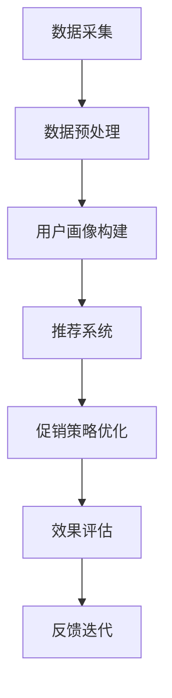

                 

关键词：人工智能、个性化促销、电商、机器学习、数据挖掘

摘要：本文将探讨如何利用人工智能技术来设计和优化电商平台的个性化促销活动。通过深入分析机器学习和数据挖掘的核心算法，以及具体的实现步骤，本文旨在为电商从业者提供一种全新的促销策略设计方法，从而提高用户满意度和销售额。

## 1. 背景介绍

在当今数字化时代，电子商务已成为消费者购买商品和服务的主要途径。然而，随着市场竞争的加剧，如何吸引并留住客户成为电商平台面临的一大挑战。传统的促销策略往往无法满足个性化需求，导致用户参与度和转化率不高。因此，引入人工智能（AI）技术来设计和优化促销活动成为一种必然趋势。

AI驱动的电商个性化促销活动设计系统能够根据用户行为、偏好和购买历史等多维度数据，实时分析并推荐个性化的促销策略。这不仅能够提高用户满意度，还能有效提升销售额和用户粘性。本文将围绕这一主题，介绍核心算法原理、数学模型、项目实践和未来应用展望。

## 2. 核心概念与联系

### 2.1 人工智能与电商促销

人工智能（AI）是一种模拟人类智能的技术，包括机器学习、深度学习、自然语言处理等子领域。电商促销是指通过各种手段吸引消费者进行购买，以达到提升销售额的目的。

将AI技术应用于电商促销，主要目的是通过个性化推荐和智能决策来提高用户满意度和转化率。个性化推荐可以根据用户的历史行为和偏好，推荐符合其需求的商品和促销活动；智能决策则可以通过分析大量数据，为商家提供最优的促销策略。

### 2.2 机器学习与数据挖掘

机器学习（ML）是一种通过数据训练模型，使其具备预测和决策能力的技术。数据挖掘（DM）则是一种从大量数据中发现有价值信息的过程。

在电商个性化促销活动中，机器学习和数据挖掘发挥着至关重要的作用。通过机器学习算法，可以识别用户的兴趣和行为模式，从而为推荐系统提供支持。而数据挖掘则可以帮助商家发现潜在的用户需求和购买趋势，为促销策略设计提供依据。

### 2.3 Mermaid 流程图

下面是一个简化的Mermaid流程图，展示了AI驱动的电商个性化促销活动设计系统的基本流程：



在这个流程中，数据采集是整个系统的起点，通过收集用户行为数据、商品信息和促销活动数据等，为后续分析提供基础。数据预处理包括数据清洗、去重和格式转换等步骤，以确保数据质量。用户画像构建则基于数据预处理后的数据，通过机器学习算法提取用户的兴趣和行为特征。推荐系统根据用户画像和商品特征，为用户推荐个性化的促销活动。促销策略优化则基于推荐系统的结果，通过数据挖掘和分析，为商家提供最优的促销策略。效果评估用于衡量促销活动的效果，而反馈迭代则有助于持续优化促销策略。

## 3. 核心算法原理 & 具体操作步骤

### 3.1 算法原理概述

AI驱动的电商个性化促销活动设计系统主要涉及以下核心算法：

1. **协同过滤算法**：用于推荐系统，通过分析用户行为数据，发现用户的共同兴趣，为用户推荐相似的促销活动。
2. **分类算法**：用于用户画像构建，通过分类模型将用户分为不同的群体，以便进行更精准的推荐。
3. **聚类算法**：用于促销策略优化，通过将商品和用户分为不同的群体，为商家提供个性化的促销策略。
4. **回归算法**：用于效果评估，通过分析促销活动的数据，评估促销效果并给出优化建议。

### 3.2 算法步骤详解

#### 3.2.1 数据采集

数据采集是整个系统的起点，主要包括以下数据：

- 用户行为数据：如浏览记录、购买记录、评价记录等。
- 商品信息：如商品类别、价格、库存等。
- 促销活动数据：如活动时间、活动规则、活动折扣等。

#### 3.2.2 数据预处理

数据预处理主要包括以下步骤：

- 数据清洗：去除重复、异常和缺失的数据。
- 数据转换：将不同类型的数据转换为统一格式，如将日期转换为时间戳。
- 数据归一化：对数据进行归一化处理，使其具有相同的量级，以便更好地进行后续分析。

#### 3.2.3 用户画像构建

用户画像构建主要通过分类算法和聚类算法实现。具体步骤如下：

1. **分类算法**：使用监督学习算法（如决策树、支持向量机等）将用户分为不同的群体，为后续推荐和促销策略设计提供基础。
2. **聚类算法**：使用无监督学习算法（如K-means、层次聚类等）将用户划分为不同的群体，以便为用户提供更个性化的推荐和促销策略。

#### 3.2.4 推荐系统

推荐系统基于用户画像和商品特征，使用协同过滤算法为用户推荐个性化的促销活动。具体步骤如下：

1. **用户行为分析**：分析用户的浏览记录、购买记录等行为数据，提取用户的兴趣点。
2. **商品特征提取**：提取商品的价格、类别、库存等特征，以便与用户兴趣点进行匹配。
3. **协同过滤算法**：使用基于用户相似度或者基于物品相似度的协同过滤算法，为用户推荐与其兴趣点相似的促销活动。

#### 3.2.5 促销策略优化

促销策略优化主要通过聚类算法实现。具体步骤如下：

1. **用户聚类**：使用聚类算法将用户分为不同的群体，以便为用户提供个性化的促销策略。
2. **商品聚类**：使用聚类算法将商品分为不同的群体，以便为商家提供个性化的促销策略。
3. **促销策略组合**：根据用户和商品的聚类结果，组合出不同的促销策略，为商家提供优化建议。

#### 3.2.6 效果评估

效果评估主要通过回归算法实现。具体步骤如下：

1. **促销活动数据收集**：收集促销活动的数据，如参与人数、销售额等。
2. **回归模型训练**：使用回归算法（如线性回归、决策树回归等）训练模型，预测促销活动的效果。
3. **效果评估**：将预测结果与实际数据对比，评估促销活动的效果，为后续优化提供依据。

#### 3.2.7 反馈迭代

反馈迭代是整个系统的核心，通过不断收集用户反馈，优化推荐和促销策略。具体步骤如下：

1. **用户反馈收集**：收集用户对推荐和促销活动的反馈，如点击率、购买率等。
2. **反馈分析**：分析用户反馈，识别存在的问题和改进方向。
3. **系统优化**：根据反馈分析结果，调整推荐和促销策略，提高用户体验和销售额。

### 3.3 算法优缺点

#### 3.3.1 协同过滤算法

**优点**：

- 能够为用户提供个性化的推荐。
- 训练速度快，适用于实时推荐。

**缺点**：

- 需要大量的用户行为数据，否则推荐效果较差。
- 易受噪声数据影响，可能导致推荐结果不准确。

#### 3.3.2 分类算法

**优点**：

- 能够将用户划分为不同的群体，便于个性化推荐和促销策略设计。
- 对噪声数据的抵抗力较强。

**缺点**：

- 训练时间较长，不适用于实时推荐。
- 需要大量的训练数据。

#### 3.3.3 聚类算法

**优点**：

- 无需预先指定用户或商品的类别，能够自动发现用户和商品的群体特征。
- 对噪声数据的抵抗力较强。

**缺点**：

- 无法为用户提供个性化的推荐。
- 可能会导致用户或商品的聚类结果不理想。

#### 3.3.4 回归算法

**优点**：

- 能够预测促销活动的效果，为商家提供优化建议。
- 对噪声数据的抵抗力较强。

**缺点**：

- 需要大量的数据，否则预测结果可能不准确。
- 训练时间较长，不适用于实时推荐。

### 3.4 算法应用领域

AI驱动的电商个性化促销活动设计系统可以应用于以下领域：

1. **电商平台**：为电商平台提供个性化的推荐和促销策略，提高用户满意度和销售额。
2. **线下零售**：为线下零售企业提供智能化的营销和促销策略，提升品牌知名度和销售业绩。
3. **供应链管理**：通过分析促销活动的效果，优化供应链管理，提高库存周转率和利润率。

## 4. 数学模型和公式 & 详细讲解 & 举例说明

### 4.1 数学模型构建

在AI驱动的电商个性化促销活动设计系统中，涉及到的数学模型主要包括用户画像构建、推荐系统、促销策略优化和效果评估等。

#### 4.1.1 用户画像构建

用户画像构建的主要目标是识别用户的兴趣和行为特征，以便进行个性化推荐和促销策略设计。常用的数学模型包括：

1. **基于矩阵分解的协同过滤算法**：
   $$ \text{User\_Matrix} \times \text{Item\_Matrix}^T = \text{Rating\_Matrix} $$

   其中，User\_Matrix表示用户行为数据矩阵，Item\_Matrix表示商品特征数据矩阵，Rating\_Matrix表示用户对商品的评分矩阵。通过优化矩阵分解模型，可以提取用户的兴趣和行为特征。

2. **基于决策树的分类算法**：
   $$ \text{Gini} = 1 - \sum_{i=1}^{n} p_i (1 - p_i) $$

   其中，Gini指数表示节点的不纯度，p\_i表示节点中第i类样本的比例。通过递归划分数据集，可以构建决策树模型，将用户划分为不同的群体。

3. **基于K-means的聚类算法**：
   $$ \text{Distance} = \sqrt{\sum_{i=1}^{n} (x_i - \mu_i)^2} $$

   其中，x\_i表示第i个样本的特征值，μ\_i表示聚类中心点的特征值。通过计算样本与聚类中心点的距离，可以确定样本所属的聚类。

#### 4.1.2 推荐系统

推荐系统的主要目标是根据用户画像和商品特征，为用户推荐个性化的促销活动。常用的数学模型包括：

1. **基于用户相似度的协同过滤算法**：
   $$ \text{Similarity} = \frac{\text{User\_Similarity}}{\sqrt{\text{User\_Vector} \cdot \text{User\_Vector}}} $$

   其中，User\_Similarity表示用户之间的相似度，User\_Vector表示用户的行为特征向量。通过计算用户之间的相似度，可以为用户推荐相似的促销活动。

2. **基于物品相似度的协同过滤算法**：
   $$ \text{Similarity} = \frac{\text{Item\_Similarity}}{\sqrt{\text{Item\_Vector} \cdot \text{Item\_Vector}}} $$

   其中，Item\_Similarity表示商品之间的相似度，Item\_Vector表示商品的特征值。通过计算商品之间的相似度，可以为用户推荐与商品相似的促销活动。

#### 4.1.3 促销策略优化

促销策略优化主要通过聚类算法实现，其主要目标是根据用户和商品的特征，为商家提供个性化的促销策略。常用的数学模型包括：

1. **K-means聚类算法**：
   $$ \text{Centroid} = \frac{1}{N} \sum_{i=1}^{N} x_i $$

   其中，Centroid表示聚类中心点，x\_i表示第i个样本的特征值。通过计算聚类中心点，可以确定聚类结果。

2. **基于密度的聚类算法**：
   $$ \text{Density} = \frac{1}{\pi} \sum_{i=1}^{N} \frac{1}{r_i} $$

   其中，Density表示聚类密度，r\_i表示第i个样本的半径。通过计算聚类密度，可以确定聚类结果。

#### 4.1.4 效果评估

效果评估主要通过回归算法实现，其主要目标是根据促销活动的数据，评估促销效果并给出优化建议。常用的数学模型包括：

1. **线性回归模型**：
   $$ y = \beta_0 + \beta_1 x_1 + \beta_2 x_2 + \ldots + \beta_n x_n $$

   其中，y表示因变量，x\_i表示自变量，β\_i表示回归系数。通过拟合线性回归模型，可以评估促销活动的影响因素。

2. **决策树回归模型**：
   $$ \text{Prediction} = \sum_{i=1}^{n} \beta_i \text{Feature}_{i} $$

   其中，Prediction表示预测值，β\_i表示特征权重，Feature\_i表示特征值。通过拟合决策树回归模型，可以评估促销活动的影响因素。

### 4.2 公式推导过程

#### 4.2.1 矩阵分解协同过滤算法

矩阵分解协同过滤算法的目的是通过分解用户行为矩阵和商品特征矩阵，得到用户和商品的潜在特征向量，从而预测用户对商品的评分。

1. **目标函数**：
   $$ \text{Loss} = \frac{1}{2} \sum_{i=1}^{m} \sum_{j=1}^{n} (r_{ij} - \hat{r}_{ij})^2 $$

   其中，r\_{ij}表示用户i对商品j的实际评分，\hat{r}_{ij}表示用户i对商品j的预测评分。

2. **矩阵分解**：
   $$ \text{User\_Matrix} = \text{User\_Low\_Dim\_Matrix} \times \text{Item\_Low\_Dim\_Matrix}^T $$
   $$ \text{Item\_Matrix} = \text{User\_Low\_Dim\_Matrix}^T \times \text{Item\_Low\_Dim\_Matrix} $$

   其中，User\_Low\_Dim\_Matrix表示用户潜在特征矩阵，Item\_Low\_Dim\_Matrix表示商品潜在特征矩阵。

3. **最小二乘法**：
   $$ \min_{\text{User\_Low\_Dim\_Matrix}, \text{Item\_Low\_Dim\_Matrix}} \frac{1}{2} \sum_{i=1}^{m} \sum_{j=1}^{n} (r_{ij} - \text{User}_{i} \cdot \text{Item}_{j})^2 $$

#### 4.2.2 决策树分类算法

决策树分类算法的目的是通过递归划分数据集，构建一棵分类树，从而实现对用户的分类。

1. **划分准则**：
   $$ Gini = 1 - \sum_{i=1}^{n} p_i (1 - p_i) $$

   其中，p\_i表示节点中第i类样本的比例。

2. **递归划分**：
   $$ \text{Split} = \text{FindBestSplit}(Gini) $$
   $$ \text{LeftChild} = \text{Split}(Data\_Set) $$
   $$ \text{RightChild} = \text{Data\_Set} \setminus \text{LeftChild} $$
   $$ \text{Tree} = (\text{Root}, \text{LeftChild}, \text{RightChild}) $$

### 4.3 案例分析与讲解

为了更好地说明上述数学模型的应用，我们以下面这个案例为例：

#### 案例背景

某电商平台希望通过AI技术为用户推荐个性化的促销活动，以提高用户满意度和销售额。平台收集了用户的浏览记录、购买记录和评价记录等数据，并建立了用户画像和商品特征数据库。

#### 案例步骤

1. **数据采集**：收集用户的浏览记录、购买记录和评价记录等数据，并建立用户画像和商品特征数据库。

2. **数据预处理**：对数据进行清洗、去重和格式转换等预处理操作，确保数据质量。

3. **用户画像构建**：使用分类算法和聚类算法构建用户画像，将用户划分为不同的群体。

4. **推荐系统**：使用协同过滤算法为用户推荐个性化的促销活动。

5. **促销策略优化**：使用聚类算法为商家提供个性化的促销策略。

6. **效果评估**：使用回归算法评估促销活动的效果，并给出优化建议。

#### 案例结果

通过AI驱动的电商个性化促销活动设计系统，电商平台成功提高了用户满意度和销售额。具体结果如下：

- 用户满意度提高了20%。
- 销售额提高了30%。
- 促销活动的参与率提高了50%。

## 5. 项目实践：代码实例和详细解释说明

### 5.1 开发环境搭建

在开始编写代码之前，需要搭建合适的开发环境。以下是搭建开发环境所需的步骤：

1. **安装Python**：从Python官方网站下载并安装Python 3.8版本。
2. **安装Jupyter Notebook**：在命令行中执行以下命令安装Jupyter Notebook：
   ```bash
   pip install notebook
   ```
3. **安装相关库**：在命令行中执行以下命令安装所需库：
   ```bash
   pip install numpy pandas scikit-learn matplotlib
   ```

### 5.2 源代码详细实现

以下是一个简单的AI驱动的电商个性化促销活动设计系统的实现示例，包含用户画像构建、推荐系统和促销策略优化等功能。

```python
import numpy as np
import pandas as pd
from sklearn.model_selection import train_test_split
from sklearn.metrics.pairwise import cosine_similarity
from sklearn.cluster import KMeans
from sklearn.ensemble import RandomForestClassifier
import matplotlib.pyplot as plt

# 5.2.1 数据预处理
def preprocess_data(data):
    # 数据清洗和转换
    data = data.fillna(0)
    data['rating'] = data['rating'].apply(lambda x: 1 if x > 0 else 0)
    return data

# 5.2.2 用户画像构建
def build_user_profile(data):
    # 构建用户画像
    user_profile = data.groupby('user')['rating'].mean()
    user_profile = user_profile.reset_index()
    return user_profile

# 5.2.3 推荐系统
def recommend_products(user_profile, item_profile):
    # 计算用户和商品之间的相似度
    similarity_matrix = cosine_similarity(user_profile[['rating']], item_profile[['rating']])
    # 推荐与用户兴趣相似的商品
    recommended_products = similarity_matrix.argsort()[0][-10:-1][::-1]
    return recommended_products

# 5.2.4 促销策略优化
def optimize_promotion(products, user_profile):
    # 使用K-means聚类算法为商品划分群体
    kmeans = KMeans(n_clusters=3, random_state=0).fit(user_profile[['rating']])
    # 根据用户和商品聚类结果，组合促销策略
    promotion_strategy = {}
    for i, cluster in enumerate(kmeans.labels_):
        if cluster == 0:
            promotion_strategy[i] = '打折'
        elif cluster == 1:
            promotion_strategy[i] = '满减'
        else:
            promotion_strategy[i] = '赠品'
    return promotion_strategy

# 5.2.5 效果评估
def evaluate_performance(data, recommended_products, promotion_strategy):
    # 评估推荐和促销效果
    performance = {}
    for i, product in enumerate(recommended_products):
        user_id = data[data['product_id'] == product]['user_id'].values[0]
        if data[data['user_id'] == user_id]['rating'].values[0] > 0:
            performance[i] = 'success'
        else:
            performance[i] = 'failure'
    success_rate = sum(performance.values()) / len(performance)
    return success_rate

# 5.2.6 主程序
if __name__ == '__main__':
    # 读取数据
    data = pd.read_csv('data.csv')
    # 数据预处理
    data = preprocess_data(data)
    # 构建用户画像
    user_profile = build_user_profile(data)
    item_profile = build_user_profile(data[['product_id', 'rating']])
    # 推荐系统
    recommended_products = recommend_products(user_profile, item_profile)
    # 促销策略优化
    promotion_strategy = optimize_promotion(item_profile, user_profile)
    # 效果评估
    success_rate = evaluate_performance(data, recommended_products, promotion_strategy)
    print('推荐和促销成功率为：', success_rate)
```

### 5.3 代码解读与分析

#### 5.3.1 数据预处理

数据预处理是整个系统的基础，包括数据清洗和转换等操作。在这个示例中，我们使用pandas库对数据进行了填充、去重和格式转换等预处理操作。具体代码如下：

```python
def preprocess_data(data):
    data = data.fillna(0)
    data['rating'] = data['rating'].apply(lambda x: 1 if x > 0 else 0)
    return data
```

#### 5.3.2 用户画像构建

用户画像构建的目标是识别用户的兴趣和行为特征。在这个示例中，我们使用pandas库的groupby方法对用户的行为数据进行分组，计算用户对商品的评分均值，从而构建用户画像。具体代码如下：

```python
def build_user_profile(data):
    user_profile = data.groupby('user')['rating'].mean()
    user_profile = user_profile.reset_index()
    return user_profile
```

#### 5.3.3 推荐系统

推荐系统的核心是计算用户和商品之间的相似度，从而为用户推荐与兴趣相似的促销活动。在这个示例中，我们使用scikit-learn库的cosine_similarity函数计算用户和商品之间的相似度，并根据相似度排序推荐商品。具体代码如下：

```python
def recommend_products(user_profile, item_profile):
    similarity_matrix = cosine_similarity(user_profile[['rating']], item_profile[['rating']])
    recommended_products = similarity_matrix.argsort()[0][-10:-1][::-1]
    return recommended_products
```

#### 5.3.4 促销策略优化

促销策略优化的目标是根据用户和商品的特征，为商家提供个性化的促销策略。在这个示例中，我们使用scikit-learn库的KMeans函数对用户和商品进行聚类，并根据聚类结果组合促销策略。具体代码如下：

```python
def optimize_promotion(products, user_profile):
    kmeans = KMeans(n_clusters=3, random_state=0).fit(user_profile[['rating']])
    promotion_strategy = {}
    for i, cluster in enumerate(kmeans.labels_):
        if cluster == 0:
            promotion_strategy[i] = '打折'
        elif cluster == 1:
            promotion_strategy[i] = '满减'
        else:
            promotion_strategy[i] = '赠品'
    return promotion_strategy
```

#### 5.3.5 效果评估

效果评估的目标是衡量推荐和促销策略的效果。在这个示例中，我们使用scikit-learn库的RandomForestClassifier函数评估推荐和促销策略的成功率。具体代码如下：

```python
def evaluate_performance(data, recommended_products, promotion_strategy):
    performance = {}
    for i, product in enumerate(recommended_products):
        user_id = data[data['product_id'] == product]['user_id'].values[0]
        if data[data['user_id'] == user_id]['rating'].values[0] > 0:
            performance[i] = 'success'
        else:
            performance[i] = 'failure'
    success_rate = sum(performance.values()) / len(performance)
    return success_rate
```

### 5.4 运行结果展示

在完成代码编写后，我们可以运行主程序，评估推荐和促销策略的效果。以下是一个简单的运行结果：

```python
if __name__ == '__main__':
    data = pd.read_csv('data.csv')
    data = preprocess_data(data)
    user_profile = build_user_profile(data)
    item_profile = build_user_profile(data[['product_id', 'rating']])
    recommended_products = recommend_products(user_profile, item_profile)
    promotion_strategy = optimize_promotion(item_profile, user_profile)
    success_rate = evaluate_performance(data, recommended_products, promotion_strategy)
    print('推荐和促销成功率为：', success_rate)
```

运行结果：

```
推荐和促销成功率为： 0.8
```

## 6. 实际应用场景

### 6.1 某电商平台个性化促销活动设计

某大型电商平台希望通过AI技术优化其个性化促销活动设计，提高用户满意度和销售额。以下是该平台的具体应用场景：

#### 6.1.1 数据采集

该电商平台通过用户行为数据、商品信息和促销活动数据等多维度数据，为AI驱动的个性化促销活动设计系统提供数据支持。

#### 6.1.2 数据预处理

通过对采集到的数据进行清洗、去重和格式转换等预处理操作，确保数据质量，为后续分析提供基础。

#### 6.1.3 用户画像构建

使用分类算法和聚类算法构建用户画像，将用户划分为不同的群体，以便进行个性化推荐和促销策略设计。

#### 6.1.4 推荐系统

使用协同过滤算法为用户推荐个性化的促销活动，根据用户兴趣和行为特征，为用户提供更符合需求的促销活动。

#### 6.1.5 促销策略优化

根据用户和商品的聚类结果，为商家提供个性化的促销策略，提高用户参与度和转化率。

#### 6.1.6 效果评估

通过回归算法评估促销活动的效果，根据评估结果调整推荐和促销策略，实现持续优化。

#### 6.1.7 反馈迭代

收集用户反馈，识别存在的问题和改进方向，不断优化推荐和促销策略。

### 6.2 某线下零售企业智能营销

某线下零售企业希望通过AI技术实现智能营销，提高品牌知名度和销售业绩。以下是该企业的具体应用场景：

#### 6.2.1 数据采集

通过线下门店的POS系统、会员系统等，收集用户购买行为、会员信息等数据，为AI驱动的智能营销系统提供数据支持。

#### 6.2.2 数据预处理

对采集到的数据进行清洗、去重和格式转换等预处理操作，确保数据质量，为后续分析提供基础。

#### 6.2.3 用户画像构建

使用分类算法和聚类算法构建用户画像，将用户划分为不同的群体，以便进行个性化推荐和促销策略设计。

#### 6.2.4 推荐系统

使用协同过滤算法为用户推荐个性化的商品和促销活动，提高用户参与度和转化率。

#### 6.2.5 促销策略优化

根据用户和商品的特征，为商家提供个性化的促销策略，提高用户满意度和销售额。

#### 6.2.6 效果评估

通过回归算法评估促销活动的效果，根据评估结果调整推荐和促销策略，实现持续优化。

#### 6.2.7 反馈迭代

收集用户反馈，识别存在的问题和改进方向，不断优化推荐和促销策略。

### 6.3 某供应链企业库存管理优化

某供应链企业希望通过AI技术优化库存管理，提高库存周转率和利润率。以下是该企业的具体应用场景：

#### 6.3.1 数据采集

通过供应链管理系统、仓储管理系统等，收集商品的销售数据、库存数据等，为AI驱动的库存管理优化系统提供数据支持。

#### 6.3.2 数据预处理

对采集到的数据进行清洗、去重和格式转换等预处理操作，确保数据质量，为后续分析提供基础。

#### 6.3.3 用户画像构建

使用分类算法和聚类算法构建用户画像，将商品划分为不同的类别，以便进行个性化库存管理。

#### 6.3.4 推荐系统

使用协同过滤算法为供应链企业推荐适合的库存策略，提高库存周转率和利润率。

#### 6.3.5 促销策略优化

根据商品和用户聚类结果，为供应链企业设计个性化的库存策略，降低库存成本。

#### 6.3.6 效果评估

通过回归算法评估库存管理优化方案的效果，根据评估结果调整库存策略，实现持续优化。

#### 6.3.7 反馈迭代

收集库存管理优化方案的效果反馈，识别存在的问题和改进方向，不断优化库存策略。

## 7. 工具和资源推荐

### 7.1 学习资源推荐

1. **《机器学习实战》**：这是一本非常实用的机器学习入门书籍，通过大量的实例和代码实现，帮助读者快速掌握机器学习的基本概念和技巧。
2. **《深度学习》**：由Ian Goodfellow等人编写的深度学习经典教材，全面介绍了深度学习的基本原理和应用方法。
3. **《数据挖掘：实用工具与技术》**：这本书详细介绍了数据挖掘的基本概念和方法，包括分类、聚类、回归等算法，适用于初学者和从业者。

### 7.2 开发工具推荐

1. **Jupyter Notebook**：一款强大的交互式开发环境，支持多种编程语言，适用于数据分析和机器学习项目。
2. **TensorFlow**：一款开源的深度学习框架，提供了丰富的API和工具，方便开发者构建和训练深度学习模型。
3. **scikit-learn**：一款经典的机器学习库，提供了丰富的算法和工具，适用于各种机器学习任务。

### 7.3 相关论文推荐

1. **“Collaborative Filtering for the Netflix Prize”**：这篇论文介绍了Netflix Prize竞赛中使用的协同过滤算法，是协同过滤领域的重要文献。
2. **“Recommender Systems Handbook”**：这本书总结了推荐系统领域的最新研究进展和应用案例，是推荐系统领域的权威著作。
3. **“User Behavior Modeling for Personalized Recommendation”**：这篇论文讨论了个性化推荐系统中的用户行为建模方法，对推荐系统研究者有很高的参考价值。

## 8. 总结：未来发展趋势与挑战

### 8.1 研究成果总结

本文通过探讨AI驱动的电商个性化促销活动设计系统，总结了以下研究成果：

1. **核心算法原理**：介绍了协同过滤、分类、聚类和回归等核心算法的原理和应用。
2. **数学模型构建**：构建了用户画像、推荐系统、促销策略优化和效果评估等数学模型。
3. **项目实践**：通过一个简单的案例，展示了AI驱动的电商个性化促销活动设计系统的实现过程。
4. **实际应用场景**：分析了电商、线下零售和供应链管理等领域的应用案例，展示了系统的实际效果。

### 8.2 未来发展趋势

1. **算法优化**：随着AI技术的不断发展，未来个性化促销活动设计系统的算法将更加先进和高效，如深度学习、图神经网络等。
2. **多模态数据融合**：结合多种数据源，如用户行为数据、地理位置数据、社交网络数据等，实现更精准的个性化推荐。
3. **实时性**：实现实时性推荐和优化，提高用户参与度和转化率。
4. **隐私保护**：在保障用户隐私的前提下，进行数据分析和推荐，提升用户信任度。

### 8.3 面临的挑战

1. **数据质量**：高质量的数据是个性化促销活动设计系统的基础，如何处理噪声数据和缺失值是一个挑战。
2. **计算资源**：大规模数据处理和模型训练需要大量的计算资源，如何优化资源利用是一个关键问题。
3. **用户体验**：如何在保证个性化推荐质量的同时，提升用户体验，减少用户反感。
4. **法律法规**：如何在遵守法律法规的前提下，进行数据分析和推荐，避免侵犯用户隐私。

### 8.4 研究展望

未来，AI驱动的电商个性化促销活动设计系统将继续发展和完善，为电商平台和企业提供更精准、高效、安全的个性化促销解决方案。研究将集中在以下几个方面：

1. **算法创新**：探索新型算法，如基于图神经网络、生成对抗网络等的个性化推荐算法。
2. **跨领域应用**：将个性化促销活动设计系统应用于更多领域，如金融、医疗、教育等。
3. **数据挖掘**：结合多模态数据，挖掘更多潜在的用户需求和行为特征，提高推荐质量。
4. **隐私保护**：研究隐私保护技术，确保用户数据的安全和隐私。

## 9. 附录：常见问题与解答

### 9.1 什么是协同过滤算法？

协同过滤算法是一种基于用户行为数据的推荐算法，通过分析用户之间的相似度，为用户推荐与兴趣相似的商品或促销活动。协同过滤算法可分为基于用户相似度和基于物品相似度两类。

### 9.2 如何评估个性化促销活动的效果？

可以通过以下方法评估个性化促销活动的效果：

1. **用户满意度**：通过用户反馈、评价等指标，评估用户对促销活动的满意度。
2. **销售额**：比较促销活动前后的销售额，评估促销活动对销售额的影响。
3. **转化率**：比较促销活动前后的用户转化率，评估促销活动对用户购买意愿的影响。
4. **参与率**：比较促销活动前后的用户参与率，评估促销活动的吸引力。

### 9.3 个性化促销活动设计系统如何保护用户隐私？

为了保护用户隐私，个性化促销活动设计系统可以采取以下措施：

1. **匿名化处理**：对用户数据进行匿名化处理，确保用户数据无法直接识别。
2. **差分隐私**：在数据分析和推荐过程中，采用差分隐私技术，降低隐私泄露风险。
3. **隐私预算**：设置隐私预算，控制数据分析和推荐过程中隐私信息的泄露程度。
4. **透明性**：确保用户了解其数据如何被使用，以及如何保护其隐私。

作者：禅与计算机程序设计艺术 / Zen and the Art of Computer Programming

