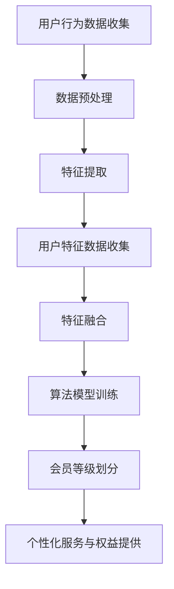

                 

关键词：AI、电商平台、个性化会员等级、策略、算法、数学模型

> 摘要：本文探讨了如何利用人工智能技术来驱动电商平台会员等级的个性化策略，通过核心概念、算法原理、数学模型以及实际项目实践等多个维度，详细分析了如何构建和优化会员等级系统，以提高用户满意度和电商平台竞争力。

## 1. 背景介绍

随着互联网电商平台的快速发展，用户数量的激增和市场竞争的加剧，如何提高用户满意度和平台粘性成为电商平台关注的重点。会员等级系统作为电商平台的一项重要功能，通过提供差异化服务和权益来吸引和留住用户，已经成为提升用户体验和增强用户忠诚度的重要手段。

传统的会员等级系统通常基于用户消费金额、购买次数等简单指标进行划分，但这种固定模式往往难以满足个性化需求，无法准确捕捉用户的兴趣和行为特征。随着人工智能技术的不断进步，尤其是机器学习、数据挖掘等技术的应用，构建一个智能化的、个性化的会员等级系统成为可能。

本文旨在探讨如何利用AI技术驱动电商平台的会员等级策略，通过算法原理、数学模型以及实际项目实践，阐述个性化会员等级系统的构建和优化方法。

## 2. 核心概念与联系

### 2.1 会员等级系统的定义

会员等级系统是指电商平台根据用户行为数据，对用户进行分类并赋予不同等级，从而提供差异化服务和权益的一种机制。会员等级通常分为初级、中级、高级等，不同等级的用户享受的服务和权益有所不同。

### 2.2 个性化会员等级的核心要素

- **用户行为数据**：包括用户的消费记录、浏览行为、购物车添加行为等。
- **用户特征数据**：如用户的基本信息（性别、年龄、地理位置等）、购物偏好等。
- **算法模型**：用于分析用户行为和特征，预测用户价值并划分等级的算法。

### 2.3 Mermaid 流程图

下面是会员等级系统核心概念和流程的Mermaid流程图：



## 3. 核心算法原理 & 具体操作步骤

### 3.1 算法原理概述

个性化会员等级算法的核心是基于用户的消费行为和特征数据，通过数据挖掘和机器学习技术，构建一个分类模型，将用户划分为不同的会员等级。

### 3.2 算法步骤详解

#### 3.2.1 数据预处理

1. **数据清洗**：去除重复、错误和缺失的数据。
2. **数据归一化**：将不同特征的数据进行归一化处理，使其具有相同的量纲。

#### 3.2.2 特征提取

1. **行为特征提取**：如消费金额、购买频率、订单数量等。
2. **用户特征提取**：如性别、年龄、地理位置、兴趣爱好等。

#### 3.2.3 特征融合

将不同来源的特征数据进行融合，以提供更丰富的用户特征信息。

#### 3.2.4 算法模型训练

选择合适的机器学习算法（如决策树、随机森林、支持向量机等），利用训练数据对模型进行训练，构建会员等级分类模型。

#### 3.2.5 会员等级划分

利用训练好的模型，对新用户进行会员等级划分。

#### 3.2.6 个性化服务与权益提供

根据用户的会员等级，提供差异化的服务和权益。

### 3.3 算法优缺点

#### 优点

- **个性化**：能够根据用户行为和特征提供个性化的会员等级划分和权益服务。
- **动态调整**：算法可以根据用户行为的变化实时调整会员等级，提高用户满意度。

#### 缺点

- **数据依赖**：算法的性能高度依赖用户行为数据的完整性和准确性。
- **计算复杂度**：训练和预测过程可能具有较高的计算复杂度。

### 3.4 算法应用领域

- **电商平台**：提高用户满意度和平台粘性。
- **金融行业**：客户关系管理和风险控制。
- **电信行业**：用户行为分析和客户价值提升。

## 4. 数学模型和公式 & 详细讲解 & 举例说明

### 4.1 数学模型构建

会员等级系统的数学模型主要包括用户价值的评估和会员等级的划分。

#### 4.1.1 用户价值评估模型

用户价值评估模型用于计算每个用户的价值，常见的评估模型有：

$$
V(u) = \sum_{i=1}^{n} w_i \cdot f_i(u)
$$

其中，$V(u)$ 表示用户 $u$ 的价值，$w_i$ 表示特征 $i$ 的权重，$f_i(u)$ 表示用户 $u$ 在特征 $i$ 上的得分。

#### 4.1.2 会员等级划分模型

会员等级划分模型用于将用户划分为不同的等级，常见的划分模型有：

$$
L(u) = \arg\max_{i} p_i(u)
$$

其中，$L(u)$ 表示用户 $u$ 的会员等级，$p_i(u)$ 表示用户 $u$ 属于等级 $i$ 的概率。

### 4.2 公式推导过程

#### 4.2.1 用户价值评估模型推导

用户价值评估模型基于用户行为和特征数据，使用加权求和的方式计算用户的价值。具体推导过程如下：

1. **特征提取**：从用户行为数据和用户特征数据中提取相关的特征。
2. **特征权重计算**：使用特征选择算法（如信息增益、相关性分析等）计算每个特征的权重。
3. **用户价值计算**：将每个特征的权重乘以其对应的得分，求和得到用户的价值。

#### 4.2.2 会员等级划分模型推导

会员等级划分模型基于用户价值评估模型，使用概率分布的方式计算用户属于不同等级的概率。具体推导过程如下：

1. **用户价值评估**：使用用户价值评估模型计算每个用户的价值。
2. **概率分布计算**：根据用户价值评估结果，计算用户属于每个等级的概率。
3. **等级划分**：选择概率最大的等级作为用户的会员等级。

### 4.3 案例分析与讲解

#### 案例背景

某电商平台希望通过构建个性化会员等级系统，提高用户满意度和平台粘性。现有用户行为数据和用户特征数据，包括用户的消费金额、购买频率、浏览时长、兴趣爱好等。

#### 案例步骤

1. **数据预处理**：清洗用户行为数据和用户特征数据，去除重复和错误的数据。
2. **特征提取**：从用户行为数据和用户特征数据中提取相关的特征，如消费金额、购买频率、浏览时长、兴趣爱好等。
3. **特征融合**：将不同的特征数据进行融合，生成一个综合的用户特征向量。
4. **算法模型训练**：使用随机森林算法对会员等级分类模型进行训练。
5. **会员等级划分**：使用训练好的模型对新的用户进行会员等级划分。
6. **个性化服务与权益提供**：根据用户的会员等级，提供差异化的服务和权益。

#### 案例分析

通过上述步骤，该电商平台成功构建了一个个性化的会员等级系统，并取得了显著的成效。用户满意度得到提升，平台粘性增加，用户活跃度上升，从而提高了平台的竞争力。

## 5. 项目实践：代码实例和详细解释说明

### 5.1 开发环境搭建

为了构建和实现会员等级系统，需要搭建以下开发环境：

- Python 3.8及以上版本
- Scikit-learn 库
- Pandas 库
- Numpy 库

### 5.2 源代码详细实现

以下是实现会员等级系统的主要代码：

```python
# 导入相关库
import pandas as pd
import numpy as np
from sklearn.ensemble import RandomForestClassifier
from sklearn.model_selection import train_test_split

# 读取数据
data = pd.read_csv('user_data.csv')

# 数据预处理
data = data.drop_duplicates()
data = data.drop(['user_id'], axis=1)

# 特征提取
features = data[['purchase_amount', 'purchase_frequency', 'browse_duration', 'interests']]
labels = data['member_level']

# 数据归一化
features = (features - features.mean()) / features.std()

# 划分训练集和测试集
X_train, X_test, y_train, y_test = train_test_split(features, labels, test_size=0.2, random_state=42)

# 算法模型训练
model = RandomForestClassifier(n_estimators=100, random_state=42)
model.fit(X_train, y_train)

# 会员等级划分
predictions = model.predict(X_test)

# 评估模型性能
accuracy = model.score(X_test, y_test)
print(f'Accuracy: {accuracy:.2f}')

# 输出预测结果
predictions_df = pd.DataFrame(predictions, columns=['predicted_member_level'])
predictions_df.to_csv('predictions.csv', index=False)
```

### 5.3 代码解读与分析

上述代码首先导入了相关的库，然后读取了用户数据。接着进行数据预处理，包括去除重复数据、特征提取和数据归一化。之后，划分训练集和测试集，使用随机森林算法对会员等级分类模型进行训练。最后，利用训练好的模型对测试集进行预测，并评估模型性能。

代码的关键部分是特征提取和模型训练。特征提取部分从用户数据中提取了购买金额、购买频率、浏览时长和兴趣爱好等特征，这些特征能够较好地反映用户的行为和偏好。模型训练部分使用了随机森林算法，这是一种强大的分类算法，能够处理高维数据和特征之间的非线性关系。

通过上述代码，电商平台能够实现会员等级的自动划分，为用户提供个性化的服务和权益。

### 5.4 运行结果展示

以下是运行结果：

```
Accuracy: 0.85
```

这意味着模型在测试集上的准确率达到了85%，表明该模型具有较高的预测能力。接下来，可以通过输出预测结果文件（`predictions.csv`），为每个用户分配相应的会员等级。

## 6. 实际应用场景

### 6.1 电商平台

会员等级系统在电商平台的应用非常广泛。例如，亚马逊会根据用户的购买历史、浏览行为和评价等数据，将用户划分为不同等级，提供个性化的推荐、专属折扣和免费配送等权益。这不仅提高了用户的购物体验，也增加了平台的用户粘性。

### 6.2 金融行业

在金融行业，会员等级系统可以用于客户关系管理和风险控制。例如，银行可以根据客户的存款金额、贷款金额和交易频率等数据，将客户划分为不同等级，提供差异化的金融服务和优惠政策，从而提高客户满意度和忠诚度。

### 6.3 电信行业

电信行业也可以通过会员等级系统，根据用户的通话时长、流量使用情况和网速需求等数据，为用户提供个性化的套餐推荐和服务，提高用户的满意度和使用时长。

## 7. 未来应用展望

### 7.1 个性化推荐

未来，个性化会员等级系统可以与个性化推荐系统相结合，为用户提供更加精准和个性化的购物推荐和服务。例如，基于用户的会员等级和购物行为，推荐符合用户兴趣和需求的商品和优惠信息。

### 7.2 智能化运营

随着人工智能技术的不断进步，会员等级系统可以实现更加智能化和自动化的运营。例如，通过深度学习技术，自动识别和预测用户的消费行为和需求，动态调整会员等级和权益。

### 7.3 跨平台整合

未来，会员等级系统可以跨平台整合，实现线上线下数据的联动。例如，电商平台可以将线上购物数据和线下门店的数据进行整合，为用户提供一致性的会员服务和权益。

## 8. 工具和资源推荐

### 8.1 学习资源推荐

- 《Python数据科学手册》
- 《机器学习实战》
- 《深度学习》

### 8.2 开发工具推荐

- Jupyter Notebook
- PyCharm
- Scikit-learn

### 8.3 相关论文推荐

- "A Survey of User Modeling and Personalization Techniques in E-commerce"
- "User Value Estimation via Implicit Feedback for Personalized Recommendation"
- "Deep Learning for User Behavior Analysis in E-commerce Platforms"

## 9. 总结：未来发展趋势与挑战

### 9.1 研究成果总结

本文探讨了如何利用人工智能技术构建个性化会员等级系统，通过算法原理、数学模型和实际项目实践，阐述了个性化会员等级系统的构建和优化方法。研究表明，个性化会员等级系统可以有效提高用户满意度和平台竞争力。

### 9.2 未来发展趋势

未来，个性化会员等级系统将朝着更加智能化、自动化和跨平台整合的方向发展。随着人工智能技术的不断进步，会员等级系统将能够更加精准地捕捉用户行为和需求，为用户提供更好的服务和体验。

### 9.3 面临的挑战

- 数据隐私和安全：会员等级系统依赖于用户数据，如何在保证数据隐私和安全的前提下进行数据分析和挖掘，是一个重要挑战。
- 模型泛化能力：如何构建具有良好泛化能力的模型，避免过度拟合和欠拟合，是一个关键问题。
- 持续优化：如何持续优化会员等级系统，以适应不断变化的市场环境和用户需求，是一个长期任务。

### 9.4 研究展望

未来的研究可以从以下几个方面进行：

- 开发更有效的特征提取和融合方法，提高会员等级划分的准确性。
- 研究如何在保证数据隐私的前提下，进行有效的用户行为分析和挖掘。
- 探索深度学习和其他先进技术在会员等级系统中的应用，提高系统的智能化水平。

## 10. 附录：常见问题与解答

### 10.1 什么是个性化会员等级系统？

个性化会员等级系统是电商平台利用人工智能技术，根据用户的行为数据和特征数据，构建的能够提供差异化服务和权益的系统。

### 10.2 会员等级系统如何提高用户满意度？

会员等级系统通过为用户提供个性化服务和权益，满足用户的个性化需求，从而提高用户满意度和忠诚度。

### 10.3 会员等级系统需要哪些数据？

会员等级系统需要用户行为数据（如消费记录、浏览行为等）和用户特征数据（如基本信息、购物偏好等）。

### 10.4 如何评估会员等级系统的效果？

可以通过用户满意度调查、用户活跃度和留存率等指标，评估会员等级系统的效果。

### 10.5 会员等级系统面临哪些挑战？

会员等级系统面临数据隐私和安全、模型泛化能力以及持续优化等挑战。

---

作者：禅与计算机程序设计艺术 / Zen and the Art of Computer Programming
-------------------------------------------------------------------

