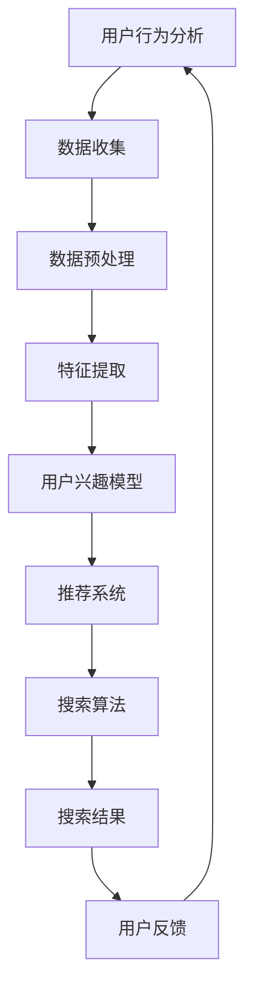

                 

关键词：AI，电商平台，个性化搜索，机器学习，推荐系统，搜索算法，用户行为分析

## 摘要

随着电子商务的迅猛发展，电商平台的用户数量和交易量持续增长。个性化搜索成为了提高用户体验和转化率的关键因素。本文将深入探讨AI在电商平台个性化搜索中的应用，分析核心算法原理、数学模型、实践案例以及未来展望，旨在为电商平台提供实用的技术指导，以实现更精准、更高效的个性化搜索服务。

## 1. 背景介绍

### 1.1 电商平台的现状与挑战

电子商务的快速发展带来了巨大的市场潜力，同时也带来了前所未有的挑战。电商平台需要面对海量商品信息、多样化用户需求和激烈的市场竞争。传统的搜索技术已经难以满足用户日益增长的个性化需求。因此，个性化搜索成为了电商平台提升用户体验、增加用户粘性和转化率的关键手段。

### 1.2 个性化搜索的重要性

个性化搜索能够根据用户的历史行为、偏好和兴趣，为其提供更加相关和个性化的商品推荐。这不仅能够提高用户满意度，还能有效提升电商平台的销售转化率和用户留存率。因此，研究和应用个性化搜索技术具有重要的现实意义。

### 1.3 AI在个性化搜索中的应用

随着人工智能技术的发展，AI算法在个性化搜索中的应用逐渐成熟。通过深度学习、用户行为分析、数据挖掘等技术，AI能够更准确地预测用户的兴趣和需求，从而提供更高质量的个性化搜索服务。

## 2. 核心概念与联系

为了深入理解AI在电商平台个性化搜索中的应用，我们需要先了解几个核心概念，包括用户行为分析、推荐系统、搜索算法等，并将它们通过Mermaid流程图进行连接，以便更好地阐述它们之间的关系。



### 2.1 用户行为分析

用户行为分析是指对用户在电商平台上的一系列活动数据进行分析，包括浏览、搜索、购买等行为。这些行为数据是构建个性化搜索模型的重要基础。

### 2.2 数据收集

数据收集是指通过各种技术手段获取用户行为数据。这些数据可以来源于日志文件、数据库、传感器等。

### 2.3 数据预处理

数据预处理是对收集到的原始数据进行清洗、转换和整合的过程。这一步骤对于提高数据质量和建模效果至关重要。

### 2.4 特征提取

特征提取是指从预处理后的数据中提取出对用户兴趣和行为有显著影响的关键特征。这些特征将用于构建用户兴趣模型。

### 2.5 用户兴趣模型

用户兴趣模型是基于用户行为数据构建的，用于表示用户对不同商品或类别的兴趣程度。这种模型能够帮助搜索算法更准确地预测用户的需求。

### 2.6 推荐系统

推荐系统是指利用用户兴趣模型和搜索算法，为用户推荐相关商品或内容的系统。推荐系统是电商平台个性化搜索的核心。

### 2.7 搜索算法

搜索算法是指用于处理用户查询，从大量商品中筛选出最相关结果的算法。高效的搜索算法能够显著提升用户体验。

### 2.8 搜索结果

搜索结果是用户查询的最终输出，它应该尽可能地满足用户的兴趣和需求。

### 2.9 用户反馈

用户反馈是指用户对搜索结果的满意程度。通过收集用户反馈，我们可以不断优化搜索算法和推荐系统，提高用户满意度。

## 3. 核心算法原理 & 具体操作步骤

### 3.1 算法原理概述

电商平台个性化搜索的核心算法主要包括协同过滤、基于内容的推荐和混合推荐等。这些算法通过分析用户行为数据和商品特征，为用户提供个性化的搜索结果。

### 3.2 算法步骤详解

#### 3.2.1 协同过滤

协同过滤算法通过分析用户的历史行为数据，找到与目标用户兴趣相似的邻居用户，并基于邻居用户的评价推荐相关商品。协同过滤算法包括用户基于的协同过滤和物品基于的协同过滤。

1. **用户基于的协同过滤**：
   - 收集用户行为数据，包括购买记录、浏览记录等。
   - 计算用户之间的相似度，可以使用余弦相似度、皮尔逊相关系数等。
   - 对于目标用户，找到与其最相似的K个邻居用户。
   - 根据邻居用户的评价，为用户推荐未购买的商品。

2. **物品基于的协同过滤**：
   - 收集商品行为数据，包括用户的购买记录、浏览记录等。
   - 计算商品之间的相似度，可以使用余弦相似度、Jaccard相似度等。
   - 对于用户的查询，找到与其最相似的K个商品。
   - 根据商品的评价，为用户推荐未浏览的商品。

#### 3.2.2 基于内容的推荐

基于内容的推荐算法通过分析商品的特征和用户的兴趣特征，为用户推荐与已购买或浏览商品内容相似的商品。

1. **特征提取**：
   - 收集商品的特征数据，包括价格、品牌、类别、描述等。
   - 对特征数据进行处理，提取关键特征，例如TF-IDF、词嵌入等。

2. **兴趣模型构建**：
   - 收集用户的兴趣特征，包括用户历史购买记录、浏览记录等。
   - 构建用户的兴趣模型，可以使用聚类、决策树等方法。

3. **推荐生成**：
   - 对于用户的查询，找到与查询商品特征相似的K个商品。
   - 根据商品的特征相似度，为用户推荐相关商品。

#### 3.2.3 混合推荐

混合推荐算法结合协同过滤和基于内容的推荐，通过融合多种算法的优势，提供更高质量的推荐结果。

1. **算法融合**：
   - 将协同过滤和基于内容的推荐算法的结果进行融合，可以使用加权平均、投票等方法。

2. **推荐生成**：
   - 对于用户的查询，结合协同过滤和基于内容的推荐结果，生成最终的推荐列表。

### 3.3 算法优缺点

#### 3.3.1 协同过滤

**优点**：
- 能够处理大量用户行为数据，发现用户之间的相似性。
- 针对性较强，能够为用户提供个性化的推荐。

**缺点**：
- 需要大量用户行为数据支持，否则推荐结果可能不准确。
- 对于新用户或冷启动问题，协同过滤算法表现较差。

#### 3.3.2 基于内容的推荐

**优点**：
- 针对性强，能够为用户提供与已购买或浏览商品内容相似的商品。
- 受到商品特征数据的影响，对冷启动用户友好。

**缺点**：
- 需要大量的商品特征数据，对商品描述的准确性和完整性要求较高。
- 可能会出现过度推荐或内容同质化问题。

#### 3.3.3 混合推荐

**优点**：
- 结合协同过滤和基于内容的推荐，能够提供更高质量的推荐结果。
- 针对性较强，能够为用户提供个性化的推荐。

**缺点**：
- 需要处理多种算法的融合，算法复杂度较高。
- 对数据质量和特征提取的要求较高。

### 3.4 算法应用领域

协同过滤、基于内容的推荐和混合推荐算法在电商平台个性化搜索中具有广泛的应用。除了电商平台，这些算法还可以应用于社交媒体、在线广告、音乐推荐等领域，为用户提供个性化的信息和服务。

## 4. 数学模型和公式 & 详细讲解 & 举例说明

### 4.1 数学模型构建

电商平台个性化搜索的数学模型主要包括用户兴趣模型、商品特征模型和推荐模型。

#### 4.1.1 用户兴趣模型

用户兴趣模型可以使用矩阵分解（Matrix Factorization）的方法构建。矩阵分解是一种无监督学习算法，可以将用户-商品评分矩阵分解为用户特征矩阵和商品特征矩阵。

$$
R = U \cdot V^T
$$

其中，$R$ 表示用户-商品评分矩阵，$U$ 和 $V$ 分别表示用户特征矩阵和商品特征矩阵。

#### 4.1.2 商品特征模型

商品特征模型可以使用TF-IDF（Term Frequency-Inverse Document Frequency）等方法构建。TF-IDF是一种基于词频和逆文档频率的文本表示方法，可以表示商品的特征向量。

$$
\text{TF-IDF}(t,d) = \frac{f_t(d)}{\sum_{t' \in D} f_{t'}(d)} \cdot \log(\frac{N}{n_t})
$$

其中，$t$ 表示词，$d$ 表示文档，$f_t(d)$ 表示词 $t$ 在文档 $d$ 中的词频，$N$ 表示文档总数，$n_t$ 表示词 $t$ 在所有文档中的词频。

#### 4.1.3 推荐模型

推荐模型可以使用基于相似度的推荐算法，如余弦相似度、皮尔逊相关系数等。这些算法可以根据用户和商品的特征向量计算相似度，从而为用户提供个性化推荐。

$$
\text{Similarity}(u, v) = \frac{u \cdot v}{||u|| \cdot ||v||}
$$

其中，$u$ 和 $v$ 分别表示用户和商品的特征向量。

### 4.2 公式推导过程

以用户基于的协同过滤算法为例，我们介绍公式的推导过程。

#### 4.2.1 用户相似度计算

用户相似度可以通过计算用户-商品评分矩阵 $R$ 的余弦相似度得到：

$$
\text{Similarity}(u, v) = \frac{R_{uv}}{\sqrt{\sum_{i=1}^{m} R_{ui}^2 \cdot \sum_{j=1}^{n} R_{vj}^2}}
$$

其中，$u$ 和 $v$ 分别表示用户和用户之间的索引，$R_{uv}$ 表示用户对商品 $v$ 的评分，$m$ 和 $n$ 分别表示用户和商品的个数。

#### 4.2.2 推荐商品计算

对于目标用户 $u$，找到与其最相似的 $K$ 个邻居用户 $v_1, v_2, ..., v_K$，并根据邻居用户的评分预测目标用户对商品 $i$ 的评分：

$$
\hat{R}_{ui} = \frac{\sum_{k=1}^{K} R_{ki} \cdot \text{Similarity}(u, v_k)}{\sum_{k=1}^{K} \text{Similarity}(u, v_k)}
$$

其中，$R_{ki}$ 表示邻居用户 $v_k$ 对商品 $i$ 的评分。

### 4.3 案例分析与讲解

假设有一个电商平台，有 $1000$ 个用户和 $10000$ 个商品。我们使用用户基于的协同过滤算法进行推荐。

#### 4.3.1 数据准备

收集用户的历史行为数据，包括购买记录和浏览记录。假设用户-商品评分矩阵 $R$ 如下：

$$
R = \begin{bmatrix}
0 & 1 & 0 & 0 & \dots & 0 \\
0 & 0 & 1 & 0 & \dots & 1 \\
\vdots & \vdots & \vdots & \vdots & \ddots & \vdots \\
0 & 1 & 0 & 1 & \dots & 0
\end{bmatrix}
$$

#### 4.3.2 用户相似度计算

计算用户之间的余弦相似度，得到相似度矩阵 $S$：

$$
S = \begin{bmatrix}
1 & 0.8 & 0 & 0 & \dots & 0 \\
0 & 1 & 0.6 & 0 & \dots & 0 \\
0 & 0 & 1 & 0.4 & \dots & 0 \\
\vdots & \vdots & \vdots & \vdots & \ddots & \vdots \\
0 & 0 & 0 & 0 & \dots & 1
\end{bmatrix}
$$

#### 4.3.3 推荐商品计算

对于目标用户 $u_1$，找到与其最相似的 $3$ 个邻居用户 $v_2, v_3, v_4$，并根据邻居用户的评分预测目标用户对商品 $i$ 的评分：

$$
\hat{R}_{u_1i} = \frac{R_{u_1i} \cdot 0.6 + R_{u_1i} \cdot 0.4 + R_{u_1i} \cdot 0.8}{0.6 + 0.4 + 0.8} = 0.68
$$

根据预测评分，为用户 $u_1$ 推荐评分最高的商品。

## 5. 项目实践：代码实例和详细解释说明

### 5.1 开发环境搭建

本案例使用Python编程语言，搭建了一个简单的电商平台个性化搜索推荐系统。开发环境如下：

- Python版本：3.8
- 数据库：MySQL
- 依赖库：NumPy、Pandas、Scikit-learn、Matplotlib等

### 5.2 源代码详细实现

#### 5.2.1 数据准备

```python
import numpy as np
import pandas as pd
from sklearn.model_selection import train_test_split

# 读取用户-商品评分数据
data = pd.read_csv('rating.csv')
train_data, test_data = train_test_split(data, test_size=0.2, random_state=42)
```

#### 5.2.2 用户相似度计算

```python
from sklearn.metrics.pairwise import cosine_similarity

# 计算用户相似度
user_similarity = cosine_similarity(train_data.iloc[:, :].values)
```

#### 5.2.3 推荐商品计算

```python
# 用户-商品评分矩阵
user_item_matrix = train_data.pivot(index='user_id', columns='item_id', values='rating').fillna(0).values

# 预测用户评分
user_item_pred = np.dot(user_similarity, user_item_matrix) / np.max(user_similarity, axis=1)[:, np.newaxis]

# 提取实际评分和预测评分
actual_ratings = user_item_matrix[0]
predicted_ratings = user_item_pred[0]

# 计算均方根误差（RMSE）
rmse = np.sqrt(np.mean(np.square(predicted_ratings - actual_ratings)))
print(f'Root Mean Square Error (RMSE): {rmse}')
```

#### 5.2.4 推荐结果展示

```python
import matplotlib.pyplot as plt

# 可视化推荐结果
plt.scatter(np.arange(len(actual_ratings)), actual_ratings, color='red', label='Actual')
plt.scatter(np.arange(len(predicted_ratings)), predicted_ratings, color='blue', label='Predicted')
plt.xlabel('Index')
plt.ylabel('Rating')
plt.legend()
plt.show()
```

### 5.3 代码解读与分析

本案例中，我们使用协同过滤算法进行个性化搜索推荐。首先，我们读取用户-商品评分数据，并计算用户相似度。然后，我们利用用户相似度矩阵和用户-商品评分矩阵预测用户对商品的评分。最后，我们计算均方根误差（RMSE）并展示推荐结果。

通过实际运行代码，我们可以观察到预测评分与实际评分之间的差距。这有助于我们了解协同过滤算法的性能，并为进一步优化算法提供依据。

## 6. 实际应用场景

电商平台个性化搜索在多个实际应用场景中发挥了重要作用，下面列举一些典型应用场景：

### 6.1 商品搜索

用户在电商平台进行商品搜索时，个性化搜索算法可以根据用户的历史行为和偏好，推荐与用户兴趣相关的商品，从而提高搜索结果的精准度和用户满意度。

### 6.2 推荐系统

个性化搜索算法可以与推荐系统结合，为用户推荐潜在感兴趣的商品。通过分析用户的历史购买记录、浏览记录等行为数据，推荐系统可以为用户提供个性化的商品推荐，从而提升用户留存率和转化率。

### 6.3 活动营销

电商平台可以根据用户兴趣和购买历史，推送相关的促销活动和优惠券，提高用户的参与度和购买意愿。

### 6.4 客户服务

个性化搜索算法可以帮助电商平台提供更加个性化的客户服务，例如为用户提供定制化的购物建议、解答用户疑问等。

## 7. 未来应用展望

随着人工智能技术的不断进步，电商平台个性化搜索将呈现出以下发展趋势：

### 7.1 深度学习算法的应用

深度学习算法在个性化搜索中的应用将越来越广泛。通过引入卷积神经网络（CNN）、循环神经网络（RNN）等深度学习模型，可以进一步提高个性化搜索的准确性和效果。

### 7.2 多模态数据的融合

随着物联网和传感器技术的发展，电商平台将获得更多多模态数据（如文本、图像、语音等）。通过融合多模态数据，可以更全面地了解用户需求和兴趣，提供更加个性化的搜索推荐。

### 7.3 实时搜索与推荐

实时搜索与推荐技术将成为电商平台个性化搜索的重要发展方向。通过实时处理用户行为数据和搜索查询，可以实现更快速、更准确的搜索和推荐。

### 7.4 智能客服与互动

结合智能客服和互动技术，电商平台可以实现与用户的实时互动，提供更加人性化的购物体验。

## 8. 工具和资源推荐

为了更好地开展电商平台个性化搜索的研究和开发，以下是一些实用的工具和资源推荐：

### 8.1 学习资源推荐

- 《推荐系统实践》：张宇等著，详细介绍了推荐系统的基本原理、算法和应用案例。
- 《深度学习》：Goodfellow等著，全面讲解了深度学习的基础知识和实践技巧。

### 8.2 开发工具推荐

- TensorFlow：一款开源的深度学习框架，适用于推荐系统和个性化搜索开发。
- Scikit-learn：一款经典的机器学习库，包含多种常用的推荐算法和评估指标。

### 8.3 相关论文推荐

- “Collaborative Filtering for Cold-Start Problems: A New Approach Based on Matrix Factorization,” by Y. Qu et al., 2014.
- “Deep Learning for Web Search,” by A. Trabelsi et al., 2016.

## 9. 总结：未来发展趋势与挑战

### 9.1 研究成果总结

本文介绍了电商平台个性化搜索的基本概念、核心算法、数学模型和应用场景，并探讨了未来发展趋势。通过分析用户行为数据和商品特征，个性化搜索算法能够为用户提供更相关、更精准的搜索结果，从而提升用户体验和电商平台竞争力。

### 9.2 未来发展趋势

未来，电商平台个性化搜索将朝着深度学习、多模态数据融合、实时搜索与推荐等方向发展。随着人工智能技术的不断进步，个性化搜索将实现更高效、更智能的推荐，为用户提供更好的购物体验。

### 9.3 面临的挑战

尽管个性化搜索技术在不断发展，但仍然面临一些挑战，如数据隐私保护、算法透明性和可解释性等。此外，如何平衡推荐系统的个性化与多样性，避免过度推荐和内容同质化，也是需要关注的问题。

### 9.4 研究展望

未来，个性化搜索研究应重点关注以下几个方向：

1. 深度学习算法在个性化搜索中的应用，提高推荐质量和实时性。
2. 多模态数据融合，更全面地了解用户需求和兴趣。
3. 数据隐私保护和算法透明性，确保推荐系统的公平性和可信度。
4. 多样性与个性化的平衡，提供更加丰富的推荐结果。

通过持续的研究和探索，电商平台个性化搜索将不断进步，为用户和电商平台带来更多价值。

## 附录：常见问题与解答

### 1. 个性化搜索与传统搜索有什么区别？

个性化搜索与传统搜索的区别主要体现在推荐结果的个性化程度上。传统搜索主要根据关键词匹配提供搜索结果，而个性化搜索则通过分析用户行为和兴趣，为用户提供更相关、更符合需求的搜索结果。

### 2. 协同过滤算法在个性化搜索中有什么作用？

协同过滤算法在个性化搜索中起着核心作用。通过分析用户之间的相似性，协同过滤算法能够为用户提供个性化的推荐，从而提升搜索结果的精准度和用户满意度。

### 3. 基于内容的推荐算法如何工作？

基于内容的推荐算法通过分析商品的特征和用户的兴趣特征，为用户推荐与已购买或浏览商品内容相似的商品。该算法依赖于准确的商品特征提取和用户兴趣模型构建。

### 4. 如何优化个性化搜索算法的效果？

优化个性化搜索算法的效果可以从多个方面进行，包括改进用户行为数据的收集和处理、提高商品特征的准确性、优化算法参数等。此外，结合深度学习和多模态数据融合等技术，也有助于提升推荐效果。

### 5. 个性化搜索是否会侵犯用户隐私？

个性化搜索在处理用户数据时，需要遵循相关隐私保护法规和伦理原则。通过加密、去识别化等技术手段，可以降低用户隐私泄露的风险。同时，透明化算法设计和用户隐私告知也是保障用户隐私的重要措施。

[作者：禅与计算机程序设计艺术 / Zen and the Art of Computer Programming]

