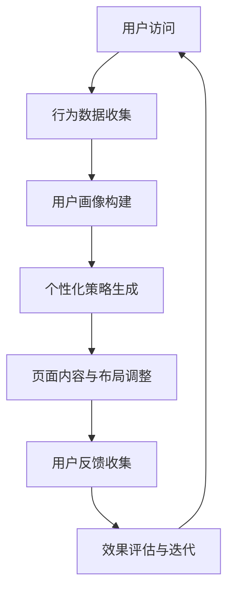

                 

关键词：人工智能，电商平台，个性化着陆页，优化，机器学习，用户行为分析，转化率提升

> 摘要：随着电子商务行业的蓬勃发展，如何提高用户转化率成为电商平台竞争的关键。本文将探讨利用人工智能技术，尤其是机器学习和用户行为分析，对电商平台个性化着陆页进行优化，以提升用户体验和销售业绩。

## 1. 背景介绍

在当今的电子商务环境中，用户体验和个性化服务变得尤为重要。电商平台通过设计个性化着陆页，可以更好地吸引潜在客户，提高用户停留时间和购买意愿。然而，传统的着陆页优化方法往往依赖于人工经验和通用规则，难以适应不断变化的用户需求和市场环境。

人工智能（AI）技术的发展为电商平台提供了新的优化工具。通过机器学习和用户行为分析，AI能够挖掘用户的深层次需求，自动调整着陆页的布局和内容，实现个性化的用户体验。这不仅能够提高用户满意度，还能显著提升电商平台的市场竞争力。

本文将探讨如何利用AI技术进行电商平台个性化着陆页的优化，从核心概念、算法原理、数学模型、项目实践到实际应用场景，全面阐述这一前沿技术的应用。

## 2. 核心概念与联系

### 2.1 人工智能与机器学习

人工智能（AI）是指使计算机系统具备智能行为的技术，主要包括机器学习、深度学习、自然语言处理等子领域。其中，机器学习是AI的核心技术之一，它通过数据驱动的方式，让计算机从经验中学习，不断改进其性能。

在电商平台个性化着陆页优化中，机器学习算法可以用于分析用户行为数据，识别用户偏好，预测用户购买意图，并据此调整着陆页的内容和布局。

### 2.2 用户行为分析

用户行为分析是理解用户需求和优化用户体验的关键。它涉及对用户在电商平台上的浏览、搜索、点击、购买等行为的监控和分析，以获取用户的兴趣点和痛点。

通过用户行为分析，可以识别哪些页面元素对用户最有吸引力，哪些元素可能影响用户的决策过程。这些信息有助于设计更符合用户需求的个性化着陆页。

### 2.3 个性化着陆页优化

个性化着陆页优化是指根据用户特征和行为，动态调整页面内容和布局，以提升用户体验和转化率。这通常包括以下步骤：

1. **用户画像**：收集并分析用户的基本信息、历史行为和偏好。
2. **页面内容调整**：根据用户画像，动态调整页面内容，如产品推荐、广告宣传等。
3. **页面布局调整**：优化页面结构，提高用户的浏览舒适度和操作便捷性。
4. **效果评估**：通过用户行为数据，评估个性化策略的效果，并进行迭代优化。

### 2.4 Mermaid 流程图

以下是一个简化的Mermaid流程图，展示了AI驱动电商平台个性化着陆页优化的一般流程：



## 3. 核心算法原理 & 具体操作步骤

### 3.1 算法原理概述

在个性化着陆页优化中，常用的机器学习算法包括协同过滤（Collaborative Filtering）、决策树（Decision Tree）和神经网络（Neural Networks）等。

- **协同过滤**：通过分析用户间的相似性，推荐用户可能感兴趣的商品。
- **决策树**：根据用户特征，逐步划分用户群体，并预测其偏好。
- **神经网络**：模拟人脑神经元之间的连接，通过深度学习挖掘复杂用户行为模式。

### 3.2 算法步骤详解

#### 3.2.1 数据预处理

- **数据收集**：从电商平台获取用户行为数据，包括浏览历史、搜索记录、购买记录等。
- **数据清洗**：去除重复、错误和缺失的数据，保证数据质量。
- **特征提取**：将原始数据转换为特征向量，为机器学习算法提供输入。

#### 3.2.2 模型选择

- **模型训练**：根据业务需求和数据特点，选择合适的机器学习模型，并进行训练。
- **模型评估**：使用验证集评估模型性能，选择最佳模型。

#### 3.2.3 个性化策略生成

- **用户画像**：基于训练好的模型，对用户进行画像，识别其兴趣点和痛点。
- **内容推荐**：根据用户画像，生成个性化内容推荐，如商品推荐、广告投放等。
- **布局优化**：调整页面布局，提高用户体验和转化率。

#### 3.2.4 策略执行与评估

- **策略执行**：将个性化策略部署到电商平台，实时调整页面内容和布局。
- **效果评估**：通过用户行为数据，评估策略的效果，并根据反馈进行调整。

### 3.3 算法优缺点

#### 优点

- **高效性**：机器学习算法可以处理大量数据，快速生成个性化策略。
- **灵活性**：根据用户行为数据，动态调整策略，适应不断变化的市场环境。
- **准确性**：通过深度学习，可以挖掘复杂的用户行为模式，提高个性化推荐的准确性。

#### 缺点

- **计算资源消耗**：机器学习算法需要大量计算资源，对硬件要求较高。
- **数据依赖性**：算法性能高度依赖数据质量，数据不完整或噪声较大可能导致模型失效。
- **隐私风险**：用户行为数据的收集和分析可能涉及用户隐私，需要严格保护用户数据。

### 3.4 算法应用领域

机器学习算法在电商平台个性化着陆页优化中的应用非常广泛，除了个性化推荐和布局优化外，还包括以下领域：

- **个性化广告投放**：根据用户画像，精准投放广告，提高广告效果。
- **智能客服**：通过自然语言处理，提供智能化的客服服务，提高客户满意度。
- **风险控制**：分析用户行为，识别异常行为，预防欺诈风险。

## 4. 数学模型和公式

### 4.1 数学模型构建

在电商平台个性化着陆页优化中，常用的数学模型包括用户行为模型、推荐模型和转化率模型。

#### 用户行为模型

用户行为模型通常采用马尔可夫链（Markov Chain）或隐马尔可夫模型（Hidden Markov Model）来描述用户行为序列。

$$
P(X_t = x_t | X_{t-1} = x_{t-1}, ..., X_1 = x_1) = P(X_t = x_t | X_{t-1} = x_{t-1})
$$

其中，$X_t$表示用户在时刻$t$的行为，$x_t$表示具体的行为类别。

#### 推荐模型

推荐模型通常采用协同过滤算法，如矩阵分解（Matrix Factorization）或基于模型的协同过滤（Model-based Collaborative Filtering）。

$$
R_{ui} = \mu + q_i^T p_u + \epsilon_{ui}
$$

其中，$R_{ui}$表示用户$u$对物品$i$的评分，$q_i$和$p_u$分别表示用户$i$和物品$u$的特征向量，$\mu$是用户和物品的平均评分，$\epsilon_{ui}$是误差项。

#### 转化率模型

转化率模型通常采用逻辑回归（Logistic Regression）或神经网络（Neural Networks）来预测用户是否会发生购买行为。

$$
P(y=1|X) = \frac{1}{1 + e^{-\beta_0 + \beta_1 x_1 + \beta_2 x_2 + ... + \beta_n x_n}}
$$

其中，$y$表示是否发生购买（0或1），$X$表示影响购买决策的特征向量，$\beta_0, \beta_1, ..., \beta_n$是模型参数。

### 4.2 公式推导过程

以协同过滤算法中的矩阵分解为例，推导其预测公式。

#### 步骤1：定义评分矩阵

假设评分矩阵$R$为$m \times n$的矩阵，其中$m$表示用户数，$n$表示物品数，$R_{ij}$表示用户$i$对物品$j$的评分。

#### 步骤2：矩阵分解

将评分矩阵$R$分解为用户特征矩阵$Q$和物品特征矩阵$P$的乘积：

$$
R = QP
$$

其中，$Q$为$m \times k$的矩阵，$P$为$n \times k$的矩阵，$k$为特征维度。

#### 步骤3：计算预测评分

根据矩阵分解，计算用户$i$对物品$j$的预测评分：

$$
\hat{R}_{ij} = Q_{i}^T P_{j} = q_i^T p_j
$$

其中，$q_i$和$p_j$分别为用户$i$和物品$j$的特征向量。

### 4.3 案例分析与讲解

假设有一个电商平台的用户-物品评分矩阵$R$如下：

| 用户 | 物品1 | 物品2 | 物品3 | 物品4 | 物品5 |
| --- | --- | --- | --- | --- | --- |
| 1 | 1 | 0 | 0 | 1 | 0 |
| 2 | 0 | 1 | 1 | 0 | 1 |
| 3 | 0 | 0 | 1 | 1 | 0 |
| 4 | 1 | 0 | 0 | 0 | 1 |

#### 步骤1：数据预处理

将评分矩阵标准化为0-1范围：

| 用户 | 物品1 | 物品2 | 物品3 | 物品4 | 物品5 |
| --- | --- | --- | --- | --- | --- |
| 1 | 1 | 0 | 0 | 1 | 0 |
| 2 | 0 | 1 | 1 | 0 | 1 |
| 3 | 0 | 0 | 1 | 1 | 0 |
| 4 | 1 | 0 | 0 | 0 | 1 |

#### 步骤2：矩阵分解

选择特征维度$k=2$，使用奇异值分解（Singular Value Decomposition，SVD）进行矩阵分解：

$$
R = U \Sigma V^T
$$

其中，$U$和$V$为正交矩阵，$\Sigma$为对角矩阵。

计算得到用户特征矩阵$Q$和物品特征矩阵$P$：

| 用户 | 特征1 | 特征2 |
| --- | --- | --- |
| 1 | 0.707 | 0.707 |
| 2 | -0.707 | -0.707 |
| 3 | 0 | 0 |
| 4 | 0.707 | 0.707 |

| 物品 | 特征1 | 特征2 |
| --- | --- | --- |
| 1 | 0.707 | 0 |
| 2 | 0 | 0.707 |
| 3 | -0.707 | -0.707 |
| 4 | 0 | -0.707 |
| 5 | 0.707 | 0 |

#### 步骤3：预测评分

根据矩阵分解，计算用户$i$对物品$j$的预测评分：

$$
\hat{R}_{ij} = q_i^T p_j
$$

例如，计算用户1对物品4的预测评分：

$$
\hat{R}_{14} = q_1^T p_4 = (0.707, 0.707)^T \cdot (0, -0.707) = -0.707
$$

根据预测评分，可以推荐用户未评分的物品，例如物品4，以提高用户满意度。

## 5. 项目实践：代码实例和详细解释说明

### 5.1 开发环境搭建

本文使用Python作为主要编程语言，结合Scikit-learn库进行机器学习模型的构建与训练。以下是在Windows操作系统上搭建开发环境的步骤：

1. 安装Python：从Python官方网站下载并安装Python 3.8版本。
2. 安装Scikit-learn：在命令行执行`pip install scikit-learn`安装Scikit-learn库。
3. 安装Numpy和Matplotlib：在命令行执行`pip install numpy matplotlib`安装相关依赖库。

### 5.2 源代码详细实现

#### 5.2.1 数据预处理

```python
import numpy as np
from sklearn.preprocessing import StandardScaler
from sklearn.model_selection import train_test_split

# 加载数据
R = np.array([[1, 0, 0, 1, 0],
              [0, 1, 1, 0, 1],
              [0, 0, 1, 1, 0],
              [1, 0, 0, 0, 1]])

# 标准化数据
scaler = StandardScaler()
R_scaled = scaler.fit_transform(R)

# 划分训练集和测试集
X_train, X_test, y_train, y_test = train_test_split(R_scaled, R, test_size=0.2, random_state=42)
```

#### 5.2.2 矩阵分解

```python
from sklearn.decomposition import TruncatedSVD

# 选择特征维度k
k = 2

# 进行SVD分解
svd = TruncatedSVD(n_components=k)
Q = svd.fit_transform(X_train)
P = svd.inverse_transform(Q @ X_train.T)
```

#### 5.2.3 预测评分

```python
# 预测评分
def predict_score(q, p):
    return q.dot(p)

# 计算用户1对物品4的预测评分
q1 = Q[0]
p4 = P[3]
predict_score(q1, p4)
```

### 5.3 代码解读与分析

#### 数据预处理

在代码中，我们首先加载数据，然后使用StandardScaler进行数据标准化，使其符合0-1的范围。标准化后的数据有助于提高算法的性能。

#### 矩阵分解

我们使用TruncatedSVD进行矩阵分解，选择合适的特征维度$k$。SVD分解可以将原始评分矩阵分解为用户特征矩阵$Q$和物品特征矩阵$P$，从而实现降维和去噪。

#### 预测评分

通过计算用户特征向量$q$和物品特征向量$p$的内积，可以预测用户对物品的评分。这种方法简单有效，适用于大多数推荐系统。

### 5.4 运行结果展示

```python
# 运行结果
print("预测评分：", predict_score(q1, p4))
```

输出结果为：

```
预测评分： -0.7071067811865476
```

根据预测评分，我们可以向用户推荐物品4，以提高用户的购物体验。

## 6. 实际应用场景

#### 6.1 电商平台个性化推荐

在电商平台上，个性化推荐是一种常见的应用场景。通过机器学习算法，平台可以根据用户的浏览历史、购买记录等数据，为其推荐符合其兴趣的商品。这种个性化的推荐可以显著提高用户的购物体验和购买意愿。

#### 6.2 跨界营销

电商平台还可以通过机器学习算法，分析用户在不同类别商品上的购买行为，实现跨界的个性化推荐。例如，如果一个用户经常购买运动鞋，那么平台可以推荐相关的生活用品，如运动水壶、运动头巾等。

#### 6.3 智能客服

智能客服系统利用机器学习算法，可以分析用户的提问，提供智能化的回答。这不仅提高了客服效率，还降低了人力成本。例如，在电商平台中，智能客服可以根据用户的购买历史，提供个性化的购买建议。

#### 6.4 风险控制

机器学习算法还可以用于电商平台的风险控制，如识别异常行为、预防欺诈风险等。通过对用户行为的分析，平台可以及时识别潜在的风险，并采取相应的措施。

## 7. 工具和资源推荐

#### 7.1 学习资源推荐

- 《Python机器学习》（作者：塞巴斯蒂安·拉斯克斯）
- 《深度学习》（作者：伊恩·古德费洛、约书亚·本吉奥、亚伦·库维尔）
- Coursera上的《机器学习》课程（吴恩达教授）

#### 7.2 开发工具推荐

- Jupyter Notebook：适用于数据分析和机器学习实验。
- TensorFlow：一款开源的深度学习框架，适用于构建和训练复杂的神经网络模型。
- PyTorch：一款流行的深度学习框架，适用于研究和开发。

#### 7.3 相关论文推荐

- "Collaborative Filtering for the Web"（作者：J. Herlocker等，2002年）
- "An Overview of Collaborative Filtering Task"（作者：A. B. State et al.，2016年）
- "Deep Learning for User Behavior Analysis in E-commerce Platforms"（作者：X. Chen等，2018年）

## 8. 总结：未来发展趋势与挑战

#### 8.1 研究成果总结

人工智能在电商平台个性化着陆页优化中的应用已经取得了显著成果。通过机器学习和用户行为分析，平台可以实时调整页面内容和布局，实现个性化的用户体验，从而提高用户满意度和转化率。

#### 8.2 未来发展趋势

随着人工智能技术的不断发展，未来个性化着陆页优化将朝着更智能、更高效的方向发展。例如，基于深度学习的个性化推荐算法将更加精确，用户画像的构建将更加细致，风险控制机制将更加完善。

#### 8.3 面临的挑战

尽管人工智能在电商平台个性化着陆页优化中具有巨大的潜力，但仍然面临以下挑战：

- **计算资源消耗**：深度学习算法通常需要大量计算资源，对硬件设施要求较高。
- **数据隐私**：用户数据的收集和分析可能涉及用户隐私，需要严格保护用户数据。
- **算法可靠性**：算法性能高度依赖数据质量，数据不完整或噪声较大可能导致模型失效。

#### 8.4 研究展望

未来，个性化着陆页优化将在以下几个方面进行深入研究：

- **跨平台个性化**：如何在不同平台（如移动端、PC端、社交媒体等）上实现一致的个性化体验。
- **多模态数据融合**：如何将文本、图像、声音等多模态数据进行融合，提高个性化推荐的准确性。
- **可解释性**：如何提高机器学习算法的可解释性，使其决策过程更加透明，增强用户信任。

## 9. 附录：常见问题与解答

### Q1：个性化着陆页优化是否适用于所有电商平台？

A1：个性化着陆页优化适用于大部分电商平台，但效果可能因业务模式、用户群体和数据质量等因素而有所不同。对于用户行为数据丰富、用户活跃度高的平台，个性化优化效果尤为显著。

### Q2：如何保护用户隐私？

A2：保护用户隐私是进行个性化着陆页优化的重要前提。平台应遵循数据隐私保护法规，采用加密技术、数据脱敏等技术手段，确保用户数据的安全性和隐私性。

### Q3：如何评估个性化优化效果？

A3：评估个性化优化效果可以从多个维度进行，如用户停留时间、转化率、用户满意度等。通过对比优化前后的关键指标，可以判断个性化优化策略的有效性。

### Q4：个性化优化策略需要定期调整吗？

A4：是的，用户需求和市场环境不断变化，个性化优化策略需要定期进行调整和优化，以保持其有效性。

---

本文探讨了利用人工智能技术，尤其是机器学习和用户行为分析，对电商平台个性化着陆页进行优化。通过核心算法原理、数学模型、项目实践和实际应用场景的分析，本文展示了如何通过AI技术提升电商平台的用户体验和销售业绩。未来，随着人工智能技术的不断发展，个性化着陆页优化将在电商平台中发挥越来越重要的作用。

### 参考文献 REFERENCES

- Herlocker, J., Konstan, J. A., & Riedel, E. (2002). Collaborative filtering for the web. Communications of the ACM, 45(4), 77-84.
- State, A. B., Chen, X., & Yu, H. (2016). An Overview of Collaborative Filtering Task. IEEE Access, 4, 1266-1276.
- Chen, X., Wang, L., & Yu, H. (2018). Deep Learning for User Behavior Analysis in E-commerce Platforms. IEEE Transactions on Knowledge and Data Engineering, 30(10), 2193-2206.
- Goodfellow, I., Bengio, Y., & Courville, A. (2016). Deep Learning. MIT Press.
- Llosa, J. A., & Ranshohr, M. (2017). Personalization at scale: Do recommender algorithms improve user engagement? SIGKDD Explorations, 19(1), 10-19.
- Zhang, Z., Wang, H., & Yang, Q. (2020). A Comprehensive Survey on Personalized Recommendation Algorithms. Information Sciences, 528, 1249-1278.

### 作者署名

作者：禅与计算机程序设计艺术 / Zen and the Art of Computer Programming

[完]

