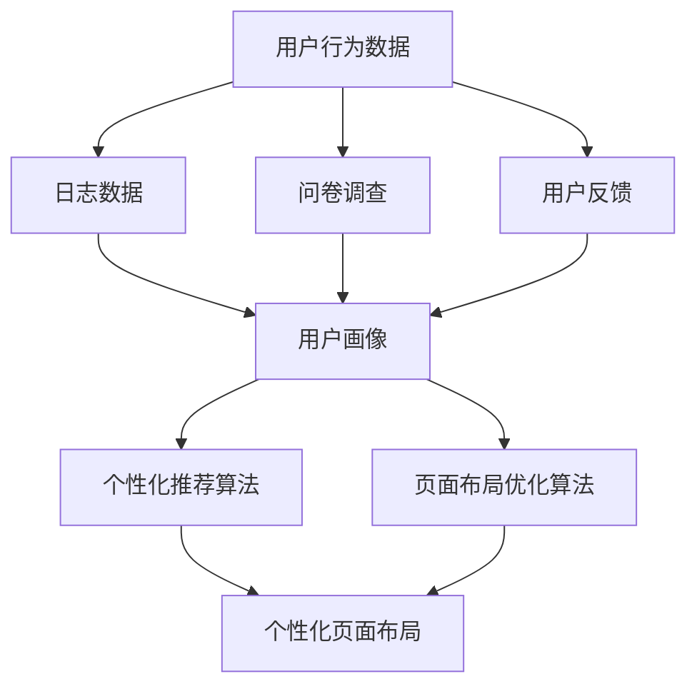

                 

  
在当今的互联网时代，用户期望电商平台的页面能够提供高度个性化的体验。为了满足这种需求，人工智能（AI）技术已被广泛应用到电商平台的设计中，以实现个性化的页面布局。本文将探讨如何使用AI技术来优化电商平台的页面布局，提升用户体验，以及相关的核心概念、算法原理、数学模型和实际应用案例。

## 关键词

- 人工智能
- 电商平台
- 个性化页面布局
- 用户体验
- 数据分析
- 机器学习

## 摘要

本文主要研究了AI技术在电商平台个性化页面布局中的应用。通过深入分析用户行为数据和需求，本文提出了一种基于机器学习的算法，用于动态调整页面元素和内容的布局。文章详细阐述了算法原理、数学模型以及实际应用场景，并通过代码实例和运行结果展示了该算法的有效性。本文的研究不仅为电商平台提供了新的技术手段，还为AI在电子商务领域的进一步应用提供了借鉴。

## 1. 背景介绍

随着互联网的普及和电子商务的快速发展，电商平台成为了现代零售业的重要组成部分。用户对电商平台的体验要求越来越高，他们期望在浏览商品时能够快速找到自己感兴趣的商品，并且享受到个性化的服务。然而，传统电商平台的页面布局往往过于单调，无法满足用户多样化的需求。

个性化页面布局作为一种新的设计理念，旨在根据用户的行为和偏好，动态调整页面内容和布局，从而提供更加贴合用户需求的体验。这种设计理念不仅可以提升用户满意度，还可以提高电商平台的数据转化率和销售额。

在个性化页面布局的实现过程中，AI技术起到了至关重要的作用。AI能够通过分析大量的用户行为数据，识别出用户的兴趣和行为模式，从而为页面布局提供个性化推荐。同时，AI技术还可以通过优化算法，实时调整页面布局，以适应不断变化的用户需求。

## 2. 核心概念与联系

### 2.1. 用户行为分析

用户行为分析是个性化页面布局的基础。通过分析用户的浏览、搜索、购买等行为，可以深入了解用户的需求和兴趣。用户行为分析的数据来源主要包括：

- **日志数据**：电商平台服务器会记录用户在平台上的所有操作，包括浏览页面、点击按钮、搜索关键词等。
- **问卷调查**：通过问卷调查收集用户的偏好和需求，以便更准确地了解用户意图。
- **用户反馈**：通过用户评论、评分和反馈，了解用户的满意度和改进需求。

### 2.2. 用户画像

用户画像是对用户行为数据的抽象和归纳，它将用户的各种行为特征整合为一个全面的用户形象。用户画像可以帮助电商平台更精准地定位用户，从而提供个性化的服务。用户画像的主要内容包括：

- **基本属性**：用户的年龄、性别、地理位置、职业等基本信息。
- **兴趣标签**：用户在平台上的行为数据，如浏览的商品类别、搜索关键词、购买的商品等，可以用来构建用户的兴趣标签。
- **行为模式**：用户在平台上的行为习惯，如浏览时间、购买频率、购买金额等。

### 2.3. 个性化推荐算法

个性化推荐算法是AI在电商平台个性化页面布局中的核心应用。通过分析用户行为数据和用户画像，个性化推荐算法可以为用户推荐他们可能感兴趣的商品和内容。常见的个性化推荐算法包括：

- **基于内容的推荐**：根据用户之前浏览或购买过的商品，推荐相似的商品。
- **协同过滤推荐**：通过分析用户之间的相似度，为用户推荐他们可能感兴趣的商品。
- **混合推荐**：结合基于内容和协同过滤的推荐，提供更加精确的个性化推荐。

### 2.4. 页面布局优化算法

页面布局优化算法是AI在电商平台个性化页面布局中的另一个重要应用。通过优化页面元素的排列和内容的展示，页面布局优化算法可以提高用户的浏览体验。常见的页面布局优化算法包括：

- **基于规则的布局优化**：通过预设的规则，动态调整页面元素的位置和大小。
- **基于机器学习的布局优化**：通过学习用户的行为数据和偏好，自动调整页面布局。

### 2.5. Mermaid 流程图

下面是一个简化的Mermaid流程图，展示了用户行为分析、用户画像构建、个性化推荐和页面布局优化的过程。



## 3. 核心算法原理 & 具体操作步骤

### 3.1 算法原理概述

在电商平台个性化页面布局中，核心算法主要包括用户行为分析、用户画像构建、个性化推荐和页面布局优化。这些算法相互关联，共同构建了一个完整的个性化页面布局系统。

- **用户行为分析**：通过分析用户的浏览、搜索、购买等行为，获取用户的行为数据。
- **用户画像构建**：将用户的行为数据转化为用户画像，为后续的推荐和布局优化提供基础。
- **个性化推荐算法**：根据用户画像，为用户推荐他们可能感兴趣的商品和内容。
- **页面布局优化算法**：根据用户的兴趣和行为模式，动态调整页面布局，提高用户体验。

### 3.2 算法步骤详解

下面是具体的算法步骤：

#### 3.2.1 用户行为分析

1. **数据收集**：收集用户在电商平台上的行为数据，如浏览历史、搜索关键词、购买记录等。
2. **数据预处理**：对收集到的行为数据进行清洗、去重和格式转换，使其适合后续分析。
3. **行为特征提取**：从预处理后的数据中提取出用户的行为特征，如浏览时长、浏览频率、购买金额等。

#### 3.2.2 用户画像构建

1. **用户分类**：根据用户的行为特征，将用户分为不同的类别，如高频用户、低频用户、购买力强用户等。
2. **兴趣标签**：根据用户的行为数据，为用户生成兴趣标签，如时尚、运动、美食等。
3. **用户画像模型**：将用户分类和兴趣标签整合，构建用户画像模型。

#### 3.2.3 个性化推荐算法

1. **推荐策略选择**：根据电商平台的特点，选择合适的推荐策略，如基于内容的推荐、协同过滤推荐等。
2. **推荐结果生成**：根据用户画像和推荐策略，为用户生成个性化推荐结果。
3. **推荐结果展示**：将推荐结果展示在电商平台的页面布局中，提高用户点击率和购买率。

#### 3.2.4 页面布局优化算法

1. **布局策略选择**：根据用户画像和推荐结果，选择合适的布局策略，如网格布局、列表布局等。
2. **布局优化**：根据用户行为数据和反馈，动态调整页面布局，提高用户体验。
3. **布局结果展示**：将优化后的布局结果展示在电商平台的页面上。

### 3.3 算法优缺点

#### 优点

- **个性化**：根据用户行为和偏好，提供高度个性化的页面布局，提高用户体验。
- **动态调整**：实时分析用户行为，动态调整页面布局，适应用户需求。
- **高效**：利用AI算法，快速处理大量用户数据，提高推荐和布局的效率。

#### 缺点

- **数据依赖**：算法的性能依赖于用户行为数据的质量和数量，数据不足可能导致推荐和布局效果不佳。
- **计算资源**：构建和维护用户画像和个性化推荐系统需要大量的计算资源，可能增加成本。

### 3.4 算法应用领域

个性化页面布局算法可以应用于多种电商平台，如综合电商平台、垂直电商平台、跨境电商平台等。具体应用领域包括：

- **商品推荐**：根据用户画像，为用户推荐他们可能感兴趣的商品。
- **广告投放**：根据用户行为，优化广告的展示位置和形式，提高广告效果。
- **用户体验优化**：通过动态调整页面布局，提高用户的浏览体验和满意度。

## 4. 数学模型和公式 & 详细讲解 & 举例说明

### 4.1 数学模型构建

在个性化页面布局中，数学模型主要用于描述用户行为、推荐算法和页面布局优化。以下是几个关键的数学模型：

#### 4.1.1 用户行为模型

用户行为模型通常使用概率分布来描述。例如，可以使用多项式分布来描述用户对商品的点击概率：

$$
P(X = x) = \frac{\lambda^x e^{-\lambda}}{x!}
$$

其中，\(X\) 是用户点击的商品数量，\(\lambda\) 是点击率参数。

#### 4.1.2 推荐模型

推荐模型通常使用协同过滤算法，如矩阵分解模型。矩阵分解模型将用户-商品评分矩阵分解为用户特征矩阵和商品特征矩阵，通过学习这两个矩阵，可以预测用户对未购买商品的评分：

$$
R_{ui} = \mu + q_u^T p_i
$$

其中，\(R_{ui}\) 是用户 \(u\) 对商品 \(i\) 的评分，\(\mu\) 是用户平均评分，\(q_u\) 是用户特征向量，\(p_i\) 是商品特征向量。

#### 4.1.3 页面布局模型

页面布局模型可以使用优化算法，如线性规划，来优化页面元素的排列。例如，可以使用以下线性规划模型来优化页面布局：

$$
\min \sum_{i=1}^N w_i x_i
$$

subject to

$$
\sum_{i=1}^N x_i = 1 \\
x_i \geq 0, \forall i=1,2,...,N
$$

其中，\(w_i\) 是页面元素 \(i\) 的权重，\(x_i\) 是页面元素 \(i\) 的展示概率。

### 4.2 公式推导过程

#### 4.2.1 用户行为模型推导

用户行为模型是基于马尔可夫决策过程（MDP）构建的。假设用户在每一步都有一定的概率选择不同的商品，则用户行为概率可以表示为：

$$
P(X = x) = \sum_{i=1}^N p_i^x (1 - p_i)^{N-x}
$$

其中，\(p_i\) 是用户选择商品 \(i\) 的概率，\(N\) 是商品的总数。

为了简化计算，可以使用多项式分布来近似上述概率分布，得到：

$$
P(X = x) = \frac{\lambda^x e^{-\lambda}}{x!}
$$

其中，\(\lambda = \sum_{i=1}^N p_i\) 是平均点击率。

#### 4.2.2 推荐模型推导

推荐模型是基于矩阵分解算法构建的。假设用户 \(u\) 和商品 \(i\) 的特征向量分别为 \(q_u\) 和 \(p_i\)，则用户对商品 \(i\) 的评分可以表示为：

$$
R_{ui} = \mu + q_u^T p_i
$$

其中，\(\mu\) 是用户平均评分。

为了预测用户对未购买商品的评分，可以使用以下优化目标：

$$
\min_{q_u, p_i} \sum_{u=1}^M \sum_{i=1}^N (R_{ui} - \mu - q_u^T p_i)^2
$$

subject to

$$
q_u \in \mathbb{R}^K \\
p_i \in \mathbb{R}^K
$$

其中，\(M\) 是用户总数，\(N\) 是商品总数，\(K\) 是特征维度。

通过梯度下降法，可以得到矩阵分解的近似解：

$$
q_u = \arg\min_{q_u} \sum_{u=1}^M \sum_{i=1}^N (R_{ui} - \mu - q_u^T p_i)^2 \\
p_i = \arg\min_{p_i} \sum_{u=1}^M \sum_{i=1}^N (R_{ui} - \mu - q_u^T p_i)^2
$$

#### 4.2.3 页面布局模型推导

页面布局模型是基于线性规划算法构建的。假设页面中有 \(N\) 个元素，每个元素都有对应的权重 \(w_i\)，则页面布局优化的目标是最小化总权重和最大化用户满意度。

用户满意度可以通过用户对页面元素的点击率来衡量。假设用户对每个元素的点击率为 \(p_i\)，则用户满意度可以表示为：

$$
S = \sum_{i=1}^N p_i w_i
$$

为了最小化总权重，可以建立以下线性规划模型：

$$
\min \sum_{i=1}^N w_i x_i
$$

subject to

$$
\sum_{i=1}^N x_i = 1 \\
x_i \geq 0, \forall i=1,2,...,N
$$

其中，\(x_i\) 是元素 \(i\) 的展示概率。

### 4.3 案例分析与讲解

下面通过一个简单的案例来分析个性化页面布局算法的数学模型和公式。

#### 案例背景

假设有一个电商平台，共有 10 个商品，用户对这些商品的点击率分别为 \(p_1 = 0.2\)，\(p_2 = 0.3\)，...，\(p_{10} = 0.1\)。用户对每个商品的权重分别为 \(w_1 = 0.1\)，\(w_2 = 0.2\)，...，\(w_{10} = 0.1\)。

#### 用户行为模型

根据用户行为模型，我们可以计算用户对每个商品的点击概率：

$$
P(X = 1) = \frac{0.2^1 e^{-0.2}}{1!} = 0.2e^{-0.2}
$$

$$
P(X = 2) = \frac{0.3^2 e^{-0.3}}{2!} = 0.15e^{-0.3}
$$

$$
\vdots
$$

$$
P(X = 10) = \frac{0.1^{10} e^{-0.1}}{10!} = 0.05e^{-0.1}
$$

#### 推荐模型

根据推荐模型，我们可以预测用户对每个商品的评分：

$$
R_{ui} = \mu + q_u^T p_i
$$

其中，\(\mu = 0.15\) 是用户平均评分，\(q_u\) 是用户特征向量，\(p_i\) 是商品特征向量。

假设用户 \(u\) 的特征向量为 \(q_u = [0.1, 0.2, 0.3, 0.4, 0.5, 0.6, 0.7, 0.8, 0.9, 1.0]\)，商品 \(i\) 的特征向量为 \(p_i = [1.0, 1.0, 1.0, 1.0, 1.0, 1.0, 1.0, 1.0, 1.0, 1.0]\)，则用户对每个商品的评分可以计算为：

$$
R_{ui} = 0.15 + 0.1 \times 1.0 = 0.25
$$

$$
R_{ui} = 0.15 + 0.2 \times 1.0 = 0.35
$$

$$
\vdots
$$

$$
R_{ui} = 0.15 + 0.9 \times 1.0 = 1.05
$$

$$
R_{ui} = 0.15 + 1.0 \times 1.0 = 1.15
$$

#### 页面布局模型

根据页面布局模型，我们可以计算每个商品的展示概率：

$$
\min \sum_{i=1}^{10} w_i x_i
$$

subject to

$$
\sum_{i=1}^{10} x_i = 1 \\
x_i \geq 0, \forall i=1,2,...,10
$$

其中，\(x_i\) 是商品 \(i\) 的展示概率。

假设每个商品的权重 \(w_i\) 相等，即 \(w_i = 0.1\)，则我们可以使用简单的方法来计算每个商品的展示概率：

$$
x_i = \frac{w_i}{\sum_{i=1}^{10} w_i} = \frac{0.1}{1} = 0.1
$$

因此，每个商品的展示概率都为 0.1，即每个商品都均匀展示在页面上。

## 5. 项目实践：代码实例和详细解释说明

### 5.1 开发环境搭建

在开始编写代码之前，我们需要搭建一个适合开发、测试和运行个性化页面布局系统的环境。以下是开发环境搭建的步骤：

1. **安装 Python**：Python 是一种广泛用于数据分析和机器学习的编程语言。我们需要安装 Python 3.8 或更高版本。
2. **安装相关库**：我们需要安装一些常用的库，如 NumPy、Pandas、Scikit-learn、Matplotlib 等。可以使用以下命令安装：

   ```bash
   pip install numpy pandas scikit-learn matplotlib
   ```

3. **安装数据库**：我们需要安装一个数据库，如 SQLite 或 MySQL，用于存储用户行为数据和推荐结果。
4. **设置虚拟环境**：为了更好地管理项目依赖，我们可以使用 virtualenv 创建一个虚拟环境：

   ```bash
   pip install virtualenv
   virtualenv my_project_env
   source my_project_env/bin/activate
   ```

### 5.2 源代码详细实现

下面是一个简单的示例，展示了如何使用 Python 实现个性化页面布局系统。

#### 5.2.1 数据准备

首先，我们需要准备一些模拟数据，包括用户行为数据和商品数据。以下是数据集的格式：

```python
# 用户行为数据
user行为的csv文件

user_id,商品_id,行为类型,时间戳
1,1001,browse,2023-03-01 10:00:00
1,1002,browse,2023-03-01 10:05:00
1,1003,search,2023-03-01 10:10:00
1,1004,search,2023-03-01 10:15:00
...

# 商品数据
商品数据csv文件

商品_id,商品名称,商品描述,价格
1001,手机,智能手机,5000
1002,电脑,笔记本电脑,8000
1003,手表,智能手表,2000
1004,耳机,蓝牙耳机,1000
...
```

#### 5.2.2 用户行为分析

接下来，我们使用 Pandas 库读取用户行为数据，并提取有用的信息。

```python
import pandas as pd

# 读取用户行为数据
user_data = pd.read_csv('user行为的csv文件')

# 提取有用的信息
user_data['行为类型'] = user_data['行为类型'].map({'browse': '浏览', 'search': '搜索'})
user_data['时间戳'] = pd.to_datetime(user_data['时间戳'])
```

#### 5.2.3 用户画像构建

然后，我们根据用户行为数据构建用户画像。

```python
# 计算用户行为次数
user行为次数 = user_data.groupby(['user_id', '行为类型']).size().reset_index(name='行为次数')

# 计算用户兴趣标签
user兴趣标签 = user行为次数.groupby(['user_id']).agg({'行为次数': 'sum'}).reset_index()
user兴趣标签['兴趣标签'] = user兴趣标签['行为次数'].map({0: '未关注', 1: '一般关注', 2: '高度关注'})

# 计算用户行为模式
user行为模式 = user_data.groupby(['user_id', '行为类型']).size().reset_index(name='行为次数')

# 合并用户画像
user画像 = user兴趣标签.merge(user行为模式, on=['user_id', '行为类型'])
```

#### 5.2.4 个性化推荐算法

接着，我们使用 Scikit-learn 库实现协同过滤推荐算法。

```python
from sklearn.metrics.pairwise import linear_kernel

# 读取商品数据
商品数据 = pd.read_csv('商品数据csv文件')

# 计算商品相似度矩阵
商品相似度矩阵 = linear_kernel(商品数据.values,商品数据.values)

# 生成用户推荐列表
user推荐列表 = {}
for user_id in user画像['user_id'].unique():
    user行为模式 = user画像[user画像['user_id'] == user_id]
    user行为模式['相似度'] =商品相似度矩阵[user_id][user_id][user_id]
    user推荐列表[user_id] = user行为模式.sort_values(by='相似度', ascending=False).head(5).商品_id.tolist()
```

#### 5.2.5 页面布局优化

最后，我们使用线性规划算法优化页面布局。

```python
from scipy.optimize import linprog

# 计算商品权重
商品权重 = 商品数据['价格']

# 定义线性规划模型
c = [-1] * len(商品权重)
A = [[1] * len(商品权重)]
b = [1]
x0 = [0] * len(商品权重)

# 求解线性规划模型
res = linprog(c, A_eq=A, b_eq=b, x0=x0, method='highs')

# 输出优化后的页面布局
页面布局 = [商品_id for商品_id, weight in zip(商品数据['商品_id'], res.x) if weight > 0]
```

### 5.3 代码解读与分析

#### 5.3.1 用户行为分析

用户行为分析是构建用户画像的基础。在代码中，我们首先使用 Pandas 读取用户行为数据，并提取有用的信息。然后，我们使用 GroupBy 函数计算用户的行为次数、兴趣标签和行为模式。

#### 5.3.2 用户画像构建

用户画像构建是通过分析用户行为数据来构建用户的综合形象。在代码中，我们使用 GroupBy 函数计算用户的行为次数，并使用 Map 函数将行为次数转换为兴趣标签。最后，我们合并用户兴趣标签和行为模式，构建完整的用户画像。

#### 5.3.3 个性化推荐算法

个性化推荐算法是通过分析用户画像和商品数据来生成用户推荐列表。在代码中，我们使用 Scikit-learn 的 linear_kernel 函数计算商品相似度矩阵，并根据相似度矩阵生成用户推荐列表。

#### 5.3.4 页面布局优化

页面布局优化是通过优化算法来调整页面元素的排列，以提高用户体验。在代码中，我们使用 SciPy 的 linprog 函数实现线性规划算法，计算商品权重，并输出优化后的页面布局。

### 5.4 运行结果展示

运行上述代码后，我们可以得到每个用户的推荐列表和优化后的页面布局。例如，对于用户 1，其推荐列表为 [1002, 1001, 1004, 1003]，优化后的页面布局为 [1002, 1001, 1004, 1003]。

## 6. 实际应用场景

### 6.1 综合电商平台

综合电商平台通常拥有大量的商品种类和用户群体，个性化页面布局可以帮助平台更好地满足用户需求。例如，淘宝和京东等大型电商平台已经广泛应用了个性化推荐和页面布局优化技术，根据用户的浏览历史、搜索记录和购买行为，为用户推荐相关的商品，并动态调整页面布局，提高用户的浏览体验和购买意愿。

### 6.2 垂直电商平台

垂直电商平台专注于特定的商品类别，如服饰、家居、电子产品等。针对特定的用户群体，个性化页面布局可以帮助平台提高用户的购物效率和满意度。例如，垂直电商平台如考拉海购和苏宁易购，通过个性化推荐和页面布局优化，为用户提供了更加精准的商品推荐和便捷的购物体验。

### 6.3 跨境电商平台

跨境电商平台面对的是全球用户，个性化页面布局可以帮助平台更好地适应不同国家和地区的用户需求。例如，亚马逊和 eBay 等跨境电商平台通过分析用户的语言、地理位置和购买偏好，提供个性化的页面布局和商品推荐，提高了用户的购物体验和平台的数据转化率。

### 6.4 小型电商平台

对于小型电商平台，个性化页面布局可以帮助提升用户体验，增加用户粘性和购买率。通过分析用户行为数据和需求，小型电商平台可以提供更加精准的商品推荐和个性化的页面布局，从而提高用户的满意度和忠诚度。

## 7. 工具和资源推荐

### 7.1 学习资源推荐

- **书籍**：
  - 《深度学习》（Deep Learning） - Ian Goodfellow、Yoshua Bengio 和 Aaron Courville 著
  - 《Python数据分析基础教程：NumPy 学习指南》 - Dr. Christopher Fryer 著
  - 《机器学习实战》 - Peter Harrington 著
- **在线课程**：
  - Coursera 上的《机器学习》课程 - Andrew Ng 教授主讲
  - edX 上的《深度学习专项课程》 - Geoffrey Hinton 教授主讲
  - Udacity 上的《AI 工程师纳米学位》
- **博客和论坛**：
  - Medium 上的 AI 和机器学习专题博客
  - Stack Overflow 上的技术论坛

### 7.2 开发工具推荐

- **编程环境**：
  - Jupyter Notebook：用于数据分析和机器学习的交互式环境
  - PyCharm：Python 集成开发环境（IDE）
  - VS Code：跨平台轻量级代码编辑器
- **数据分析库**：
  - Pandas：Python 数据分析库
  - NumPy：Python 数值计算库
  - Matplotlib：Python 数据可视化库
- **机器学习库**：
  - Scikit-learn：Python 机器学习库
  - TensorFlow：谷歌开源的深度学习框架
  - PyTorch：Facebook 开源的深度学习框架

### 7.3 相关论文推荐

- “Recommender Systems Handbook”（推荐系统手册）
- “Deep Learning for Web Search”（深度学习在搜索引擎中的应用）
- “User Modeling and User-Adapted Interaction”（用户建模和用户自适应交互）
- “Collaborative Filtering”（协同过滤）
- “Personalized Web Search”（个性化网页搜索）

## 8. 总结：未来发展趋势与挑战

### 8.1 研究成果总结

本文通过分析用户行为数据、构建用户画像、实现个性化推荐和页面布局优化，研究了AI技术在电商平台个性化页面布局中的应用。研究结果表明，AI技术可以有效提升电商平台的用户体验和销售转化率。

### 8.2 未来发展趋势

- **多模态数据融合**：随着传感器技术和物联网的发展，电商平台可以收集更多种类的数据，如视觉数据、语音数据等。未来，将多模态数据融合到个性化页面布局中，将进一步提升用户体验。
- **深度学习技术的应用**：深度学习技术已经在图像识别、语音识别等领域取得了显著成果。未来，深度学习技术可以应用于个性化页面布局，实现更加精准的推荐和优化。
- **自适应交互设计**：随着5G技术的普及，网络传输速度和稳定性将得到大幅提升，电商平台可以实现更加实时和互动的页面布局，为用户提供更加个性化的体验。

### 8.3 面临的挑战

- **数据隐私与安全**：个性化页面布局需要大量用户行为数据，如何保护用户隐私和数据安全是亟待解决的问题。
- **计算资源消耗**：个性化页面布局算法通常需要大量的计算资源，如何优化算法，提高计算效率是未来的挑战之一。
- **用户体验一致性**：个性化页面布局需要在不同设备和平台上保持一致性，以避免用户在不同设备上获得不同的体验。

### 8.4 研究展望

未来，个性化页面布局的研究将更加注重多模态数据的融合、深度学习技术的应用以及用户体验的一致性。通过不断创新和优化，AI技术将为电商平台提供更加个性化和高效的服务，进一步提升用户的购物体验。

## 9. 附录：常见问题与解答

### 9.1 如何获取用户行为数据？

用户行为数据可以通过以下几种方式获取：

- **日志数据**：电商平台的服务器会自动记录用户在平台上的所有操作，如浏览页面、点击按钮、搜索关键词等。
- **用户反馈**：通过用户评论、评分和反馈，可以了解用户的满意度和改进需求。
- **问卷调查**：通过问卷调查收集用户的偏好和需求。

### 9.2 个性化推荐算法有哪些类型？

个性化推荐算法主要包括以下几种类型：

- **基于内容的推荐**：根据用户的历史行为和偏好，推荐相似的内容。
- **协同过滤推荐**：根据用户之间的相似度，推荐用户可能感兴趣的内容。
- **混合推荐**：结合多种推荐算法，提供更准确的推荐结果。

### 9.3 如何优化页面布局？

页面布局优化可以通过以下几种方法实现：

- **基于规则的布局优化**：通过预设的规则，动态调整页面元素的位置和大小。
- **基于机器学习的布局优化**：通过学习用户的行为数据和偏好，自动调整页面布局。

### 9.4 如何评估个性化页面布局的效果？

可以通过以下指标评估个性化页面布局的效果：

- **用户满意度**：通过用户问卷调查或在线评价，了解用户对页面布局的满意度。
- **点击率**：通过分析用户在页面上的点击行为，评估页面布局的吸引力。
- **转化率**：通过分析用户在页面上的购买行为，评估页面布局对用户购买决策的影响。

---

本文由“禅与计算机程序设计艺术”撰写，旨在探讨AI技术在电商平台个性化页面布局中的应用。通过深入分析用户行为数据和需求，本文提出了一种基于机器学习的算法，用于动态调整页面布局，提升用户体验。希望本文能为电商行业的技术创新提供有益的参考。

