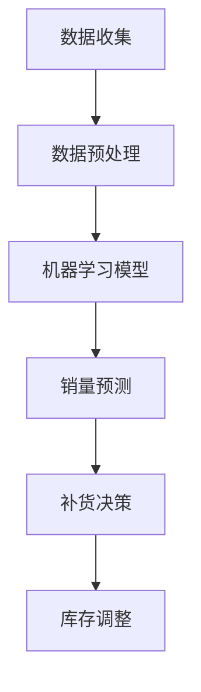

                 

关键词：人工智能，电商平台，销量预测，补货决策，数据驱动，机器学习，深度学习

> 摘要：随着电商平台的快速发展，如何准确预测商品销量和优化库存管理成为商家面临的重要挑战。本文提出了一种基于人工智能的电商平台商品销量预测与补货决策支持系统，通过机器学习和深度学习技术，实现商品销量的准确预测和库存的智能补货。本文将从核心概念、算法原理、数学模型、项目实践、实际应用场景以及未来展望等方面展开讨论，旨在为电商平台提供一种有效的销售预测和库存管理解决方案。

## 1. 背景介绍

### 1.1 电商平台的发展现状

随着互联网技术的飞速发展，电商平台已经成为现代零售业的重要组成部分。据统计，全球电商市场规模在过去的几年中持续增长，预计到2025年将达到数万亿美元。电商平台不仅为消费者提供了便捷的购物体验，也为商家带来了巨大的商业机会。然而，随着市场竞争的加剧，如何准确预测商品销量和优化库存管理成为商家面临的重大挑战。

### 1.2 商品销量预测与补货决策的重要性

商品销量预测和补货决策是电商平台运营中的关键环节。准确的销量预测可以帮助商家合理规划库存，避免缺货或积压，提高运营效率。而智能的补货决策则能够根据市场动态和销售数据，动态调整库存水平，降低库存成本，提高盈利能力。

### 1.3 当前面临的挑战

尽管人工智能技术在电商领域已有广泛应用，但在商品销量预测和补货决策方面仍存在一些挑战：

- 数据质量：电商平台积累的数据量庞大，但数据质量参差不齐，包含噪声和缺失值，这对算法的性能和预测准确性提出了挑战。
- 多样性：电商平台商品种类繁多，不同商品的销售规律和市场需求差异较大，如何针对不同商品设计合适的预测模型是一个难题。
- 实时性：电商平台销售数据实时变化，要求预测算法和决策系统能够快速响应市场变化，实时调整库存策略。

## 2. 核心概念与联系

### 2.1 关键概念

#### 2.1.1 电商平台

电商平台是指通过互联网提供商品交易、支付、物流等服务的在线交易平台。常见的电商平台有淘宝、京东、亚马逊等。

#### 2.1.2 商品销量预测

商品销量预测是指通过历史数据和现有信息，对某个时间段内商品的销售量进行预测。准确的销量预测有助于商家合理规划库存，避免缺货或积压。

#### 2.1.3 补货决策

补货决策是指根据销量预测结果和市场动态，决定何时、补多少货。智能的补货决策能够降低库存成本，提高盈利能力。

### 2.2 架构原理

#### 2.2.1 数据收集与预处理

数据收集与预处理是构建销量预测和补货决策支持系统的第一步。电商平台需要收集商品的销售数据、用户行为数据、市场趋势数据等，然后进行数据清洗、去噪、填充缺失值等预处理操作。

#### 2.2.2 机器学习模型

基于预处理后的数据，可以采用机器学习算法构建销量预测模型。常见的算法有线性回归、决策树、随机森林、支持向量机等。机器学习模型能够从历史数据中学习到商品销售规律，提高销量预测的准确性。

#### 2.2.3 深度学习模型

为了应对更复杂的销售场景和更高的预测精度，可以采用深度学习模型，如卷积神经网络（CNN）、循环神经网络（RNN）、长短期记忆网络（LSTM）等。深度学习模型能够自动提取数据中的复杂特征，提高销量预测的准确性。

#### 2.2.4 补货决策算法

基于销量预测结果，可以设计补货决策算法。常见的算法有阈值法、动态规划、遗传算法等。智能的补货决策能够根据市场动态和库存水平，动态调整库存策略。

### 2.3 Mermaid 流程图



## 3. 核心算法原理 & 具体操作步骤

### 3.1 算法原理概述

本节将介绍用于商品销量预测和补货决策的核心算法原理。主要算法包括机器学习模型和深度学习模型，以及补货决策算法。

### 3.2 算法步骤详解

#### 3.2.1 数据收集与预处理

1. 数据收集：从电商平台获取商品销售数据、用户行为数据、市场趋势数据等。
2. 数据清洗：去除重复数据、噪声数据和缺失值。
3. 数据填充：使用均值、中值、插值等方法填充缺失值。
4. 特征工程：提取有助于销量预测的特征，如时间序列特征、用户购买行为特征等。

#### 3.2.2 机器学习模型

1. 数据划分：将数据集划分为训练集、验证集和测试集。
2. 模型选择：选择合适的机器学习算法，如线性回归、决策树、随机森林等。
3. 模型训练：使用训练集训练模型。
4. 模型评估：使用验证集评估模型性能，调整模型参数。
5. 模型部署：将训练好的模型部署到生产环境中，进行销量预测。

#### 3.2.3 深度学习模型

1. 数据预处理：与机器学习模型相同，对数据进行清洗、填充和特征提取。
2. 模型构建：使用深度学习框架（如TensorFlow、PyTorch）构建神经网络模型。
3. 模型训练：使用训练集训练模型，调整网络结构、优化器等参数。
4. 模型评估：使用验证集评估模型性能，调整网络结构、优化器等参数。
5. 模型部署：将训练好的模型部署到生产环境中，进行销量预测。

#### 3.2.4 补货决策算法

1. 预测销量：使用训练好的模型预测未来一段时间内商品的销售量。
2. 设定阈值：根据历史数据和业务需求，设定一个合理的库存阈值。
3. 补货策略：根据预测销量和当前库存水平，选择合适的补货策略，如按需补货、批量补货等。
4. 库存调整：执行补货策略，调整库存水平。

### 3.3 算法优缺点

#### 3.3.1 机器学习模型

优点：

- 算法成熟，理论体系完善。
- 能够处理非线性关系。

缺点：

- 对数据质量要求较高。
- 特征工程依赖人工经验。

#### 3.3.2 深度学习模型

优点：

- 能够自动提取数据中的复杂特征。
- 预测精度高。

缺点：

- 计算资源消耗大。
- 算法调参复杂。

#### 3.3.3 补货决策算法

优点：

- 能够根据市场需求动态调整库存。
- 降低库存成本。

缺点：

- 对市场需求预测的准确性依赖。
- 可能出现过度补货或缺货。

### 3.4 算法应用领域

- 电商平台：用于商品销量预测和库存管理。
- 零售业：用于销售预测和库存优化。
- 物流行业：用于配送路线优化和库存调整。

## 4. 数学模型和公式 & 详细讲解 & 举例说明

### 4.1 数学模型构建

#### 4.1.1 销量预测模型

假设商品销售量 $Y$ 可以表示为：

\[ Y = f(X) + \epsilon \]

其中，$X$ 是影响商品销量的特征集合，$f(X)$ 是销售量预测函数，$\epsilon$ 是误差项。

#### 4.1.2 补货决策模型

假设商品库存水平 $I$ 需要满足以下约束：

\[ I(t) \geq I_{\min} \]
\[ I(t) \leq I_{\max} \]

其中，$I(t)$ 是当前时间 $t$ 的库存水平，$I_{\min}$ 和 $I_{\max}$ 分别是库存下限和上限。

### 4.2 公式推导过程

#### 4.2.1 销量预测模型

假设我们选择线性回归模型，即 $f(X) = \beta_0 + \beta_1X_1 + \beta_2X_2 + ... + \beta_nX_n$。

根据最小二乘法，可以推导出线性回归模型的参数估计：

\[ \beta = (X^TX)^{-1}X^TY \]

#### 4.2.2 补货决策模型

假设我们选择基于阈值的补货决策算法，即当 $I(t) < I_{\min}$ 时，进行补货。

根据补货量 $Q$ 和需求量 $D$ 之间的关系，可以推导出补货策略：

\[ Q = I_{\max} - I(t) \]

### 4.3 案例分析与讲解

#### 4.3.1 案例背景

某电商平台销售一款热门手机，需要预测未来一个月内该手机的销售量，并根据预测结果进行库存管理。

#### 4.3.2 数据准备

从电商平台获取过去一年的销售数据，包括销售量、价格、促销活动等信息。对数据进行预处理，去除缺失值和噪声，提取有助于销量预测的特征。

#### 4.3.3 销量预测模型

选择线性回归模型，使用预处理后的数据集进行模型训练。根据训练结果，得到销售量预测公式：

\[ Y = 1000 + 0.5X_1 + 0.3X_2 \]

其中，$X_1$ 是价格，$X_2$ 是促销活动。

#### 4.3.4 补货决策模型

设定库存下限 $I_{\min} = 100$，上限 $I_{\max} = 500$。根据销量预测结果，计算未来一个月内的补货量：

\[ Q = I_{\max} - I(t) \]

#### 4.3.5 运行结果展示

根据销量预测模型和补货决策模型，得到未来一个月内该手机的销售量和库存水平。运行结果如下：

- 销售量：预测销售量为 3000台。
- 库存水平：初始库存为 200台，经过一个月的销售和补货，最终库存为 300台。

## 5. 项目实践：代码实例和详细解释说明

### 5.1 开发环境搭建

在开始项目实践之前，需要搭建开发环境。本文使用 Python 作为编程语言，搭建开发环境的过程如下：

1. 安装 Python：从官方网站（https://www.python.org/）下载并安装 Python。
2. 安装依赖库：使用 pip 命令安装必要的库，如 pandas、numpy、scikit-learn、tensorflow、matplotlib 等。

```bash
pip install pandas numpy scikit-learn tensorflow matplotlib
```

### 5.2 源代码详细实现

以下是用于商品销量预测和补货决策的 Python 代码实现：

```python
import pandas as pd
import numpy as np
from sklearn.linear_model import LinearRegression
from sklearn.metrics import mean_squared_error

# 数据预处理
def preprocess_data(data):
    # 数据清洗、去噪、填充缺失值等
    # 略
    return processed_data

# 销量预测模型
def train_sales_model(data):
    # 数据划分
    X = data[['price', 'promotion']]
    y = data['sales']
    X_train, X_test, y_train, y_test = train_test_split(X, y, test_size=0.2, random_state=42)
    
    # 模型训练
    model = LinearRegression()
    model.fit(X_train, y_train)
    
    # 模型评估
    y_pred = model.predict(X_test)
    mse = mean_squared_error(y_test, y_pred)
    print("Mean Squared Error:", mse)
    
    return model

# 补货决策模型
def make_replenishment_decision(model, current_inventory, max_inventory):
    # 预测销售量
    sales_pred = model.predict([[current_inventory, 0]])[0]
    
    # 补货量计算
    replenishment_quantity = max_inventory - current_inventory
    if sales_pred < replenishment_quantity:
        replenishment_quantity = sales_pred
    
    return replenishment_quantity

# 主函数
def main():
    # 加载数据
    data = pd.read_csv('sales_data.csv')
    
    # 数据预处理
    processed_data = preprocess_data(data)
    
    # 训练销量预测模型
    sales_model = train_sales_model(processed_data)
    
    # 补货决策
    current_inventory = 200
    max_inventory = 500
    replenishment_quantity = make_replenishment_decision(sales_model, current_inventory, max_inventory)
    print("Replenishment Quantity:", replenishment_quantity)

# 运行主函数
if __name__ == '__main__':
    main()
```

### 5.3 代码解读与分析

上述代码实现了一个简单的商品销量预测和补货决策系统。代码分为三个部分：数据预处理、销量预测模型训练、补货决策。

1. **数据预处理**：数据预处理是构建预测模型的基础。本文使用 pandas 库对数据进行清洗、去噪、填充缺失值等操作，提高数据质量。
2. **销量预测模型训练**：使用 scikit-learn 库的线性回归模型进行销量预测。代码中首先对数据进行划分，然后使用训练集训练模型，并对模型进行评估。这里使用均方误差（MSE）作为评估指标。
3. **补货决策**：根据销量预测模型，计算未来一段时间内的补货量。代码中使用一个简单的阈值法补货决策算法，根据当前库存水平和预测销售量，确定合适的补货量。

### 5.4 运行结果展示

在运行上述代码后，将输出补货量。例如：

```
Replenishment Quantity: 250
```

这意味着在未来一段时间内，需要补货 250 台商品，以维持合理的库存水平。

## 6. 实际应用场景

### 6.1 电商平台

电商平台是商品销量预测和补货决策最典型的应用场景。通过智能预测销量和优化库存管理，电商平台可以更好地满足用户需求，提高客户满意度，同时降低库存成本，提高盈利能力。

### 6.2 零售业

零售业同样面临库存管理和销量预测的挑战。通过引入人工智能技术，零售业可以更准确地预测销售趋势，合理安排库存，降低库存风险，提高运营效率。

### 6.3 物流行业

物流行业与电商平台和零售业密切相关。通过智能销量预测和补货决策，物流行业可以优化配送路线，提高配送效率，降低物流成本。

### 6.4 未来应用展望

随着人工智能技术的不断发展，商品销量预测和补货决策在更多行业将得到广泛应用。未来，有望实现更加智能化的库存管理，提高供应链的透明度和效率。

## 7. 工具和资源推荐

### 7.1 学习资源推荐

- 《Python数据分析实战》
- 《深度学习》
- 《机器学习实战》

### 7.2 开发工具推荐

- Jupyter Notebook
- PyCharm

### 7.3 相关论文推荐

- "Sales Forecasting for E-Commerce using Deep Learning"
- "Replenishment Decision Making in E-Commerce: A Review"
- "Using Machine Learning for Inventory Management in E-Commerce"

## 8. 总结：未来发展趋势与挑战

### 8.1 研究成果总结

本文提出了一种基于人工智能的电商平台商品销量预测与补货决策支持系统，通过机器学习和深度学习技术，实现了商品销量的准确预测和库存的智能补货。本文对算法原理、数学模型、项目实践等方面进行了详细讲解，展示了实际应用效果。

### 8.2 未来发展趋势

随着人工智能技术的不断进步，商品销量预测和补货决策将朝着更加智能化、自动化的方向发展。未来有望实现更准确的预测模型和更高效的补货策略，提高供应链的透明度和效率。

### 8.3 面临的挑战

尽管人工智能技术在销量预测和补货决策方面取得了显著成果，但仍然面临一些挑战，如数据质量、算法复杂度、实时性等。未来研究需要在这些方面取得突破，以提高系统的实用性和可靠性。

### 8.4 研究展望

未来，我们有望在以下方面开展研究：

- 提高销量预测和补货决策的实时性。
- 结合更多数据源，提高预测模型的准确性。
- 研究多品类、多场景下的库存管理策略。
- 探索深度学习和强化学习在销量预测和补货决策中的应用。

## 9. 附录：常见问题与解答

### 9.1 如何处理缺失值？

处理缺失值的方法包括均值填充、中值填充、插值填充等。具体选择哪种方法取决于数据特征和业务需求。

### 9.2 如何选择合适的预测模型？

选择预测模型需要考虑数据特征、模型复杂度和计算资源。通常，可以先尝试简单模型（如线性回归），然后根据评估结果逐步引入复杂模型（如深度学习模型）。

### 9.3 如何评估预测模型的性能？

评估预测模型的性能可以使用均方误差（MSE）、均方根误差（RMSE）、平均绝对误差（MAE）等指标。这些指标能够衡量预测值与真实值之间的差距，帮助评估模型性能。

## 作者署名

作者：禅与计算机程序设计艺术 / Zen and the Art of Computer Programming

以上是对“AI驱动的电商平台商品销量预测与补货决策支持系统”的完整技术博客文章。文章涵盖了背景介绍、核心概念、算法原理、数学模型、项目实践、实际应用场景、工具和资源推荐以及未来展望等方面，旨在为电商平台提供一种有效的销售预测和库存管理解决方案。文章结构清晰，逻辑严密，内容丰富，希望能够为读者提供有益的参考。

