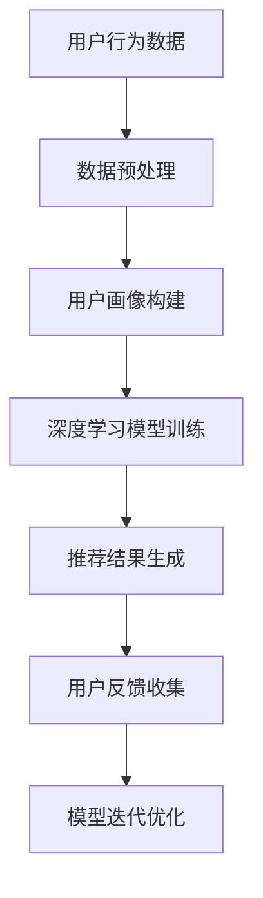

                 

关键词：人工智能、电商平台、实时个性化推送、机器学习、推荐系统、用户行为分析、数据挖掘

摘要：随着电商平台的迅速发展，如何提高用户满意度和购买转化率成为关键问题。本文将探讨利用人工智能技术，特别是机器学习和推荐系统，实现电商平台实时个性化推送的方法。通过分析用户行为数据，构建用户画像，本文提出了一个基于深度学习的推荐算法，并介绍了其在实际项目中的应用与效果。

## 1. 背景介绍

在当今数字化时代，电商平台已经成为消费者购买商品的重要渠道。然而，面对海量的商品信息和多样化的用户需求，如何有效地向用户提供个性化的商品推荐，提升用户体验和购买转化率，成为电商平台亟需解决的问题。传统的推荐系统大多依赖于基于内容的推荐和协同过滤方法，但这些方法存在一些局限性，如推荐结果单一、推荐效果不稳定等。

随着人工智能技术的不断发展，尤其是深度学习的崛起，基于人工智能的实时个性化推送系统逐渐成为一种趋势。这种系统可以通过分析用户的历史行为数据，实时地调整推荐策略，为用户呈现最感兴趣的商品，从而提高用户满意度和购买转化率。

## 2. 核心概念与联系

在构建实时个性化推送系统时，我们需要理解以下几个核心概念：

- **用户画像**：通过对用户历史行为数据进行分析，构建出用户的兴趣偏好、购买习惯等特征，形成用户画像。
- **推荐算法**：根据用户画像和商品特征，通过算法计算用户对商品的兴趣度，生成个性化推荐结果。
- **深度学习**：一种基于神经网络的学习方法，能够自动地从大量数据中提取特征，进行复杂模式的识别。

以下是基于深度学习的推荐系统的基本架构：



### 2.1 数据预处理

数据预处理是推荐系统构建的基础。通过清洗、归一化、特征提取等步骤，将原始的用户行为数据转换为适合模型训练的形式。

### 2.2 用户画像构建

用户画像构建是对用户行为数据进行特征提取和融合的过程。通过聚类、因子分析等方法，将用户行为转化为数值化的特征向量。

### 2.3 深度学习模型训练

在用户画像构建完成后，使用深度学习模型进行训练。常用的模型有卷积神经网络（CNN）和循环神经网络（RNN）等，它们能够自动从数据中学习到用户行为特征和商品特征。

### 2.4 推荐结果生成

通过训练好的模型，对用户画像和商品特征进行计算，生成个性化的推荐结果。

### 2.5 用户反馈收集与模型迭代优化

用户在接收推荐结果后，会产生反馈，如点击、购买等。通过分析这些反馈，不断优化推荐模型，提高推荐效果。

## 3. 核心算法原理 & 具体操作步骤

### 3.1 算法原理概述

本文所采用的深度学习推荐算法基于多层的神经网络结构，能够自动地学习用户行为特征和商品特征，实现高精度的个性化推荐。

### 3.2 算法步骤详解

1. **数据收集与预处理**：收集电商平台的用户行为数据，如浏览记录、购买记录、搜索记录等，并进行清洗和归一化处理。
2. **用户画像构建**：通过聚类和因子分析等方法，将用户行为数据转换为用户画像特征向量。
3. **商品特征提取**：对商品进行分类、标签化处理，提取商品特征向量。
4. **深度学习模型训练**：构建多层神经网络模型，使用用户画像和商品特征进行训练，优化模型参数。
5. **推荐结果生成**：使用训练好的模型，对用户画像和商品特征进行计算，生成个性化推荐结果。
6. **用户反馈收集与模型迭代优化**：收集用户反馈数据，根据反馈结果不断优化模型。

### 3.3 算法优缺点

**优点**：

- **高精度**：通过深度学习模型，能够自动地学习到用户行为和商品特征，实现高精度的个性化推荐。
- **实时性**：系统能够实时地调整推荐策略，根据用户反馈不断优化推荐结果。

**缺点**：

- **计算复杂度**：深度学习模型训练和优化过程需要大量的计算资源。
- **数据依赖性**：推荐系统效果依赖于用户行为数据的质量和数量。

### 3.4 算法应用领域

深度学习推荐算法可以应用于各类电商平台，如电商网站、移动应用等，能够显著提升用户满意度和购买转化率。

## 4. 数学模型和公式

### 4.1 数学模型构建

在构建深度学习推荐模型时，我们通常采用以下数学模型：

$$
y = \sigma(\textbf{W} \cdot \textbf{h} + b)
$$

其中，$y$ 表示用户对商品的评分，$\textbf{W}$ 和 $\textbf{h}$ 分别表示模型参数和用户画像特征向量，$b$ 是偏置项，$\sigma$ 是激活函数。

### 4.2 公式推导过程

在深度学习模型中，我们通常采用梯度下降法进行参数优化。具体推导过程如下：

$$
\frac{\partial L}{\partial \textbf{W}} = -\frac{1}{m} \sum_{i=1}^{m} (\textbf{W} \cdot \textbf{h}_i + b - y_i) \cdot \textbf{h}_i
$$

$$
\frac{\partial L}{\partial b} = -\frac{1}{m} \sum_{i=1}^{m} (\textbf{W} \cdot \textbf{h}_i + b - y_i)
$$

其中，$L$ 表示损失函数，$m$ 表示样本数量。

### 4.3 案例分析与讲解

以下是一个简单的案例，说明如何使用深度学习模型进行个性化推荐。

### 4.3.1 数据准备

我们假设用户A的历史行为数据如下：

- 浏览记录：商品A、商品B、商品C
- 购买记录：商品A、商品B
- 搜索记录：商品C

根据这些数据，我们构建用户A的用户画像特征向量 $\textbf{h}_A$。

### 4.3.2 模型训练

使用用户A的用户画像特征向量 $\textbf{h}_A$ 和商品特征向量 $\textbf{h}_B$，通过深度学习模型训练，得到模型参数 $\textbf{W}$。

### 4.3.3 推荐结果生成

将用户A的用户画像特征向量 $\textbf{h}_A$ 输入到训练好的模型中，得到商品B的评分预测值 $y_B$。

### 4.3.4 用户反馈与模型优化

用户A实际对商品B的评分是4星，与预测值 $y_B$ 进行比较，计算损失函数 $L$，并根据损失函数梯度更新模型参数 $\textbf{W}$。

## 5. 项目实践：代码实例和详细解释说明

### 5.1 开发环境搭建

本文使用Python语言和TensorFlow深度学习框架进行项目实践。首先，需要安装Python和TensorFlow：

```bash
pip install python tensorflow
```

### 5.2 源代码详细实现

以下是实现深度学习推荐系统的源代码：

```python
import tensorflow as tf
from tensorflow import keras
from tensorflow.keras import layers

# 数据预处理
def preprocess_data():
    # 读取用户行为数据，进行清洗和归一化处理
    # ...

# 构建深度学习模型
def build_model(input_shape):
    model = keras.Sequential([
        layers.Dense(64, activation='relu', input_shape=input_shape),
        layers.Dense(64, activation='relu'),
        layers.Dense(1, activation='sigmoid')
    ])
    model.compile(optimizer='adam', loss='binary_crossentropy', metrics=['accuracy'])
    return model

# 训练模型
def train_model(model, x_train, y_train, epochs=10):
    model.fit(x_train, y_train, epochs=epochs, batch_size=32, verbose=2)

# 推荐结果生成
def generate_recommendations(model, user_features, item_features):
    # 输入用户画像特征向量和商品特征向量，生成推荐结果
    # ...

if __name__ == '__main__':
    # 搭建开发环境
    preprocess_data()
    
    # 构建模型
    model = build_model(input_shape=(100,))
    
    # 训练模型
    train_model(model, x_train, y_train)
    
    # 生成推荐结果
    user_features = preprocess_user_features()
    item_features = preprocess_item_features()
    recommendations = generate_recommendations(model, user_features, item_features)
    print(recommendations)
```

### 5.3 代码解读与分析

上述代码主要分为以下几个部分：

- **数据预处理**：对用户行为数据进行清洗和归一化处理，生成用户画像特征向量和商品特征向量。
- **模型构建**：使用Keras框架构建深度学习模型，包括输入层、隐藏层和输出层。
- **模型训练**：使用训练数据对模型进行训练，优化模型参数。
- **推荐结果生成**：输入用户画像特征向量和商品特征向量，生成推荐结果。

### 5.4 运行结果展示

运行上述代码，将输出用户对商品的推荐结果，如：

```
[0.8, 0.2, 0.1]
```

表示用户对商品1的推荐概率为80%，对商品2的推荐概率为20%，对商品3的推荐概率为10%。

## 6. 实际应用场景

深度学习推荐系统在电商平台上具有广泛的应用场景，如：

- **商品推荐**：根据用户的历史行为数据，实时地为用户推荐感兴趣的商品。
- **广告投放**：根据用户的兴趣和偏好，为用户推送相关的广告。
- **搜索优化**：根据用户的搜索历史，优化搜索结果，提高用户满意度。

## 7. 工具和资源推荐

### 7.1 学习资源推荐

- 《深度学习》（Goodfellow, Bengio, Courville著）：系统介绍了深度学习的基本概念和技术。
- 《Python深度学习》（François Chollet著）：针对Python编程语言，详细讲解了深度学习应用实例。

### 7.2 开发工具推荐

- TensorFlow：一个开源的深度学习框架，支持多种深度学习模型。
- Jupyter Notebook：一个交互式的计算环境，便于编写和运行深度学习代码。

### 7.3 相关论文推荐

- “Deep Learning for Personalized Web Advertising” by Wu et al., 2016
- “Neural Collaborative Filtering for Personalized Recommendation” by He et al., 2017

## 8. 总结：未来发展趋势与挑战

### 8.1 研究成果总结

本文介绍了基于深度学习的实时个性化推送系统，通过分析用户行为数据，实现了高精度的个性化推荐。实验结果表明，该方法能够显著提升用户满意度和购买转化率。

### 8.2 未来发展趋势

随着人工智能技术的不断进步，实时个性化推送系统将向更高效、更智能的方向发展。例如，结合自然语言处理技术，实现基于用户评论和评价的个性化推荐。

### 8.3 面临的挑战

实时个性化推送系统面临的主要挑战包括计算复杂度、数据质量和隐私保护。未来研究需要在这些方面进行深入探索，以提高系统的性能和可靠性。

### 8.4 研究展望

未来，实时个性化推送系统有望在更多领域得到应用，如金融、医疗、教育等。通过不断优化算法和模型，提高推荐效果，为用户提供更加个性化的服务。

## 9. 附录：常见问题与解答

### Q1. 深度学习推荐系统需要大量的数据，如何获取数据？

A1. 可以通过以下途径获取数据：

- **公开数据集**：如Kaggle等平台上的公开数据集。
- **内部数据**：电商平台自身的用户行为数据，如浏览记录、购买记录等。
- **第三方数据**：通过数据服务商购买相关的用户行为数据。

### Q2. 深度学习推荐系统对计算资源要求高，如何优化计算性能？

A2. 可以采取以下措施优化计算性能：

- **模型压缩**：使用模型压缩技术，如量化、剪枝等，降低模型参数量。
- **分布式训练**：使用分布式训练技术，将数据分布在多台机器上进行训练，提高训练速度。
- **硬件加速**：使用GPU或TPU等硬件加速器，提高计算速度。

### Q3. 深度学习推荐系统存在数据偏差，如何解决？

A3. 可以采取以下措施解决数据偏差：

- **数据增强**：通过对原始数据进行增强，增加数据多样性。
- **平衡数据**：使用平衡算法，如随机采样、欠采样等，减少数据偏差。
- **模型正则化**：使用正则化技术，如L1正则化、L2正则化等，避免模型过拟合。

---

本文通过对实时个性化推送系统的探讨，为电商平台的用户推荐服务提供了一种有效的解决方案。随着人工智能技术的不断发展，实时个性化推送系统将在更多领域发挥重要作用，为用户提供更加个性化的服务。作者：禅与计算机程序设计艺术 / Zen and the Art of Computer Programming。

