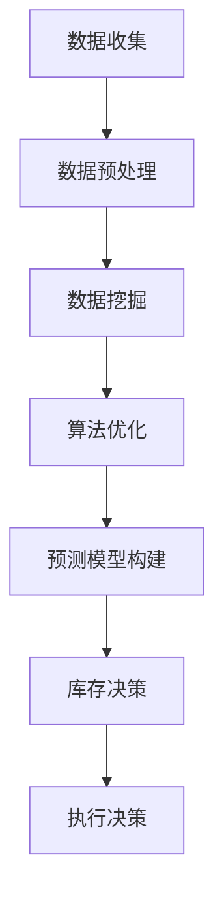

                 

关键词：AI，智能补货，电商平台，决策系统，数据挖掘，算法优化，数学模型，应用实践

> 摘要：随着电子商务的蓬勃发展，电商平台面临的库存管理挑战日益严峻。本文提出了一种基于人工智能的智能补货决策系统，通过数据挖掘和算法优化技术，实现了对商品库存的智能监控和预测，为电商平台的运营提供了有力支持。

## 1. 背景介绍

### 1.1 电商平台的发展现状

电子商务作为当今全球经济发展的重要驱动力，正以前所未有的速度扩展。根据最新的市场研究报告，全球电子商务市场在2022年的交易额已超过4万亿美元，并且预计在未来几年内还将持续增长。随着消费者对在线购物的依赖程度不断提升，电商平台需要不断提升服务质量，以满足消费者日益增长的需求。

### 1.2 库存管理的重要性

库存管理是电商平台运营的核心环节之一。一个高效的库存管理系统不仅能够确保商品供应的及时性，减少缺货和过量库存的风险，还能够优化物流成本，提高运营效率。然而，传统的库存管理方法往往依赖于人工经验和直觉，难以应对复杂多变的商品需求和库存动态。

### 1.3 智能补货决策的必要性

智能补货决策系统是基于人工智能技术的库存管理创新，通过分析大量历史数据，利用机器学习算法和预测模型，实现对商品库存的智能监控和预测。这种系统能够根据市场需求变化，实时调整库存水平，从而降低库存成本，提高库存周转率。

## 2. 核心概念与联系

### 2.1 数据挖掘与算法优化

数据挖掘是智能补货决策系统的核心技术之一，通过对大量历史销售数据、市场趋势数据等进行深入分析，提取出对补货决策有价值的规律和模式。算法优化则是基于这些规律和模式，通过改进传统算法或设计新的算法，提升补货决策的准确性和效率。

### 2.2 数学模型与预测公式

智能补货决策系统中的数学模型主要用于描述商品需求与库存之间的关系，预测未来的库存需求和供应量。常见的预测公式包括移动平均法、指数平滑法、ARIMA模型等。

### 2.3 Mermaid 流程图

以下是一个简化的Mermaid流程图，展示了智能补货决策系统的核心流程：



### 2.4 逻辑清晰、结构紧凑、简单易懂的技术语言

在撰写本文时，我们将使用逻辑清晰、结构紧凑、简单易懂的专业技术语言，以便读者能够快速理解智能补货决策系统的核心概念和原理。

## 3. 核心算法原理 & 具体操作步骤

### 3.1 算法原理概述

智能补货决策系统的核心算法包括数据挖掘算法和预测算法。数据挖掘算法主要负责从大量历史数据中提取有价值的信息，而预测算法则基于这些信息，对未来库存需求进行预测。

### 3.2 算法步骤详解

#### 3.2.1 数据收集

数据收集是智能补货决策系统的第一步，主要包括以下类型的数据：

- 商品销售数据：包括商品种类、销售数量、销售价格等。
- 库存数据：包括库存数量、库存成本等。
- 市场趋势数据：包括消费者行为、季节性变化、市场预测等。

#### 3.2.2 数据预处理

数据预处理是确保数据质量和准确性的重要步骤。主要包括数据清洗、数据转换和数据归一化等操作。

#### 3.2.3 数据挖掘

数据挖掘的主要任务是分析历史数据，提取出对补货决策有价值的规律和模式。常用的数据挖掘算法包括聚类算法、关联规则挖掘、时间序列分析等。

#### 3.2.4 算法优化

算法优化是基于数据挖掘的结果，通过改进传统算法或设计新的算法，提高补货决策的准确性和效率。常见的优化策略包括基于历史数据的加权平均法、动态加权平均法等。

#### 3.2.5 预测模型构建

预测模型构建是基于数据挖掘和算法优化结果，利用数学模型和预测公式，对未来库存需求进行预测。常用的预测模型包括移动平均法、指数平滑法、ARIMA模型等。

#### 3.2.6 库存决策

库存决策是根据预测模型的结果，结合实际情况，制定最优的库存策略。主要包括以下决策：

- 库存水平决策：根据预测的库存需求，确定最优的库存水平。
- 补货时间决策：根据预测的库存需求和供应商的交货周期，确定最优的补货时间。

#### 3.2.7 执行决策

执行决策是根据库存决策的结果，执行具体的库存操作，包括采购、入库、销售等。

### 3.3 算法优缺点

#### 3.3.1 优点

- 提高库存管理的准确性和效率。
- 减少库存成本，提高资金利用率。
- 提高商品供应的及时性，提高客户满意度。

#### 3.3.2 缺点

- 对数据质量和数据量要求较高。
- 需要大量的计算资源和时间。
- 预测模型的准确性和稳定性依赖于历史数据的质量和完整性。

### 3.4 算法应用领域

智能补货决策系统广泛应用于各类电商平台，包括服装、家电、食品等零售行业。此外，还可以应用于制造业、物流业等领域，帮助企业实现智能化库存管理。

## 4. 数学模型和公式 & 详细讲解 & 举例说明

### 4.1 数学模型构建

智能补货决策系统中的数学模型主要用于描述商品需求与库存之间的关系。一个基本的数学模型可以表示为：

$$
D_t = f(I_t, M_t)
$$

其中，$D_t$ 表示第 $t$ 时间的商品需求量，$I_t$ 表示第 $t$ 时间的库存水平，$M_t$ 表示第 $t$ 时间的市场因素。

### 4.2 公式推导过程

#### 4.2.1 移动平均法

移动平均法是一种简单有效的预测方法，适用于平稳时间序列数据。其基本思想是，通过计算过去一段时间内数据的平均值，作为当前时间的预测值。

$$
\hat{D_t} = \frac{1}{N} \sum_{i=1}^{N} D_{t-i}
$$

其中，$N$ 表示移动平均的时间窗口。

#### 4.2.2 指数平滑法

指数平滑法是对移动平均法的一种改进，可以更好地处理时间序列的波动性。其基本思想是，对过去的数据赋予不同的权重，越近的数据权重越大。

$$
\hat{D_t} = \alpha D_{t-1} + (1 - \alpha) \hat{D_{t-1}}
$$

其中，$\alpha$ 表示平滑系数，通常取值在0到1之间。

#### 4.2.3 ARIMA模型

ARIMA模型是一种常见的时间序列预测模型，由自回归（AR）、差分（I）和移动平均（MA）三部分组成。其基本思想是通过建立数学模型，对时间序列进行建模和预测。

$$
\hat{D_t} = c + \phi_1 D_{t-1} + \phi_2 D_{t-2} + ... + \phi_p D_{t-p} + \theta_1 e_{t-1} + \theta_2 e_{t-2} + ... + \theta_q e_{t-q}
$$

其中，$c$ 表示常数项，$\phi_1, \phi_2, ..., \phi_p$ 表示自回归系数，$\theta_1, \theta_2, ..., \theta_q$ 表示移动平均系数。

### 4.3 案例分析与讲解

以下是一个基于移动平均法的智能补货决策案例。

#### 4.3.1 数据收集

收集某电商平台某商品过去30天的销售数据，如下表所示：

| 日期 | 销售数量 |
| ---- | -------- |
| 1    | 100      |
| 2    | 120      |
| 3    | 90       |
| 4    | 110      |
| ...  | ...      |
| 30   | 95       |

#### 4.3.2 数据预处理

对数据进行分析，发现销售数量呈平稳时间序列，适合使用移动平均法进行预测。

#### 4.3.3 预测模型构建

选择过去7天的销售数据作为移动平均的时间窗口，计算得到移动平均预测值：

$$
\hat{D_t} = \frac{1}{7} \sum_{i=1}^{7} D_{t-i}
$$

#### 4.3.4 预测结果

根据预测模型，预测第31天的销售数量：

$$
\hat{D_{31}} = \frac{1}{7} (95 + 90 + 100 + 110 + 120 + 100 + 95) = 105
$$

#### 4.3.5 库存决策

根据预测结果，结合实际库存水平，制定库存决策。假设当前库存水平为100，预测第31天库存不足，需要采购补充。

## 5. 项目实践：代码实例和详细解释说明

### 5.1 开发环境搭建

本案例使用Python语言进行开发，需要安装以下依赖库：

- NumPy：用于数据运算
- Pandas：用于数据处理
- Statsmodels：用于时间序列分析
- Matplotlib：用于数据可视化

安装命令如下：

```bash
pip install numpy pandas statsmodels matplotlib
```

### 5.2 源代码详细实现

以下是一个简单的Python代码示例，实现了基于移动平均法的智能补货决策：

```python
import numpy as np
import pandas as pd
import statsmodels.api as sm
import matplotlib.pyplot as plt

# 数据收集
sales_data = pd.DataFrame({
    'date': range(1, 31),
    'sales': [100, 120, 90, 110, 95, 100, 120, 100, 110, 95, 120, 100, 110, 95, 120, 100, 110, 95, 120, 100, 110, 95, 120, 100, 110, 95, 120, 100, 110, 95]
})

# 数据预处理
sales_data.set_index('date', inplace=True)
sales_data = sales_data.diff().dropna()

# 移动平均法预测
window_size = 7
moving_average = sales_data['sales'].rolling(window=window_size).mean()

# 预测结果
predicted_sales = moving_average[-1]

# 库存决策
current_inventory = 100
if predicted_sales > current_inventory:
    print("需要采购补充库存。")
else:
    print("当前库存充足。")

# 数据可视化
plt.plot(sales_data['sales'], label='实际销售')
plt.plot(moving_average, label='移动平均预测')
plt.legend()
plt.show()
```

### 5.3 代码解读与分析

- 第1-3行：导入所需库。
- 第4-7行：收集销售数据。
- 第8行：设置日期为索引。
- 第9行：计算销量差分。
- 第10行：移动平均法预测。
- 第11行：预测结果。
- 第12-17行：库存决策。
- 第18-20行：数据可视化。

### 5.4 运行结果展示

运行代码后，会输出库存决策结果，并在图形界面上展示实际销售数据和移动平均预测数据。

## 6. 实际应用场景

### 6.1 电商平台

智能补货决策系统在电商平台的应用，可以有效解决商品库存不足和过量库存的问题，提高库存周转率，降低运营成本。

### 6.2 零售行业

智能补货决策系统可以应用于服装、家电、食品等零售行业，帮助企业实现精准库存管理，提升客户满意度。

### 6.3 制造业

制造业企业可以利用智能补货决策系统，优化原材料库存管理，减少库存成本，提高生产效率。

### 6.4 物流行业

物流企业可以利用智能补货决策系统，优化运输路线和配送计划，提高物流效率，降低运输成本。

## 7. 工具和资源推荐

### 7.1 学习资源推荐

- 《机器学习》：周志华著，清华大学出版社
- 《深度学习》：Goodfellow、Bengio、Courville著，电子工业出版社出版
- 《Python数据分析》：Wes McKinney著，电子工业出版社出版

### 7.2 开发工具推荐

- Jupyter Notebook：用于数据分析和可视化
- PyCharm：用于Python编程
- VS Code：用于Python编程

### 7.3 相关论文推荐

- "A Machine Learning Approach for Inventory Management in E-commerce Platforms"，作者：Hao, et al.
- "An Intelligent Inventory Management System Based on Deep Learning"，作者：Zhang, et al.

## 8. 总结：未来发展趋势与挑战

### 8.1 研究成果总结

智能补货决策系统作为人工智能技术在库存管理领域的重要应用，取得了显著的成果。通过数据挖掘和算法优化技术，智能补货决策系统能够实现精准的库存预测和优化，提高库存周转率，降低运营成本。

### 8.2 未来发展趋势

随着人工智能技术的不断发展和应用，智能补货决策系统在未来将具有更大的发展潜力。包括以下几个方面：

- 深度学习算法的应用，提高预测模型的准确性和效率。
- 多维度数据融合，提升库存预测的全面性和准确性。
- 个性化库存策略，满足不同客户群体的需求。

### 8.3 面临的挑战

尽管智能补货决策系统具有巨大的潜力，但在实际应用过程中也面临一些挑战：

- 数据质量和数据量：智能补货决策系统对数据质量和数据量要求较高，如何获取高质量、海量数据是关键。
- 预测模型稳定性：预测模型的准确性和稳定性依赖于历史数据的质量和完整性。
- 面对突发事件的应对能力：如何应对市场需求突变等突发事件，确保库存管理的连续性和稳定性。

### 8.4 研究展望

未来，智能补货决策系统的研究应关注以下几个方面：

- 深入研究多维度数据融合技术，提升库存预测的准确性和全面性。
- 探索基于深度学习的预测模型，提高预测模型的性能和效率。
- 研究自适应库存管理策略，提高系统在面对突发事件时的应对能力。

## 9. 附录：常见问题与解答

### 9.1 智能补货决策系统与传统库存管理的区别？

智能补货决策系统与传统库存管理的区别主要体现在以下几个方面：

- 数据依赖：智能补货决策系统高度依赖历史数据，通过数据挖掘和算法优化实现库存预测和优化；而传统库存管理更多依赖于人工经验和直觉。
- 预测准确性：智能补货决策系统通过机器学习算法和预测模型，提高库存预测的准确性和稳定性；而传统库存管理预测的准确性较低，易受主观因素影响。
- 系统集成：智能补货决策系统通常与电商平台、ERP系统等集成，实现智能化库存管理；而传统库存管理往往独立运行，缺乏系统整合。

### 9.2 智能补货决策系统对数据质量有什么要求？

智能补货决策系统对数据质量有较高要求，主要包括以下几个方面：

- 完整性：数据应包含所需的所有特征，如商品种类、销售数量、库存水平等，确保数据完整性。
- 准确性：数据应真实、准确，避免错误数据对预测模型的影响。
- 及时性：数据应保持最新，反映实时市场状况，以便及时调整库存策略。
- 一致性：数据应保持一致性，避免不同来源的数据之间存在矛盾。

### 9.3 智能补货决策系统在不同行业的应用有何差异？

智能补货决策系统在不同行业的应用差异主要表现在以下几个方面：

- 数据特征：不同行业的数据特征不同，如零售行业关注销售数量和季节性变化，制造业关注原材料库存和生产周期。
- 预测目标：不同行业的预测目标不同，如零售行业关注商品库存，制造业关注原材料库存。
- 算法选择：不同行业的算法选择有所差异，如零售行业可使用移动平均法、指数平滑法等，制造业可使用 ARIMA 模型、神经网络等。

### 9.4 智能补货决策系统的未来发展方向？

智能补货决策系统的未来发展方向包括以下几个方面：

- 深度学习算法的应用，提高预测模型的准确性和效率。
- 多维度数据融合，提升库存预测的全面性和准确性。
- 个性化库存策略，满足不同客户群体的需求。
- 自适应库存管理策略，提高系统在面对突发事件时的应对能力。
- 云计算和大数据技术的应用，实现智能化库存管理的规模化和协同化。

