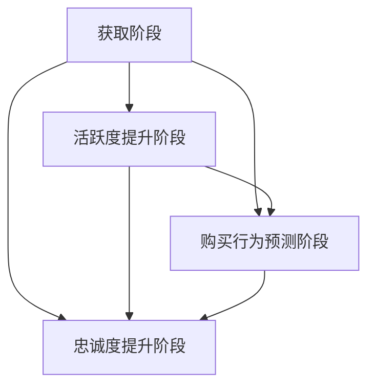
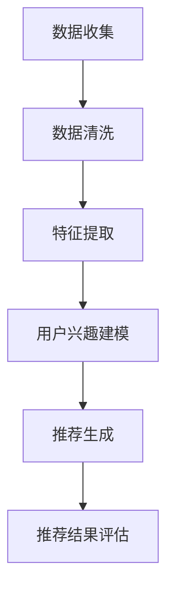

                 

关键词：人工智能，电商平台，用户生命周期管理，个性化推荐，数据挖掘，机器学习，用户行为分析

> 摘要：本文将探讨如何利用人工智能技术对电商平台进行用户生命周期管理，从用户注册、活跃度分析、购买行为预测到忠诚度提升等方面展开论述。通过深入分析用户数据，构建个性化推荐系统，优化用户体验，提高销售额和用户满意度，从而实现电商平台的可持续发展。

## 1. 背景介绍

随着互联网的迅速发展和电子商务的普及，电商平台已成为商家和消费者之间的重要纽带。用户在电商平台上不仅能够方便地购买商品，还能够享受到个性化推荐、优惠券、购物车等功能。然而，随着市场竞争的加剧和用户需求的多样化，电商平台需要不断提高用户满意度，才能在激烈的市场竞争中脱颖而出。

用户生命周期管理成为电商平台关注的焦点。用户生命周期是指用户从首次接触到电商平台开始，到成为忠实用户的整个过程。用户生命周期管理包括用户获取、活跃度提升、购买行为预测、忠诚度提升等环节。如何利用人工智能技术实现用户生命周期管理，成为当前研究的热点问题。

## 2. 核心概念与联系

### 2.1 用户生命周期管理

用户生命周期管理是指通过分析用户在电商平台上的行为数据，对用户进行分类、评估和干预，以提高用户满意度和忠诚度。用户生命周期主要包括以下几个阶段：

1. **获取阶段**：通过广告投放、社交媒体推广等方式吸引用户注册。
2. **活跃度提升阶段**：通过推送个性化内容、优惠券等方式提高用户活跃度。
3. **购买行为预测阶段**：通过分析用户行为数据，预测用户购买意向，提高转化率。
4. **忠诚度提升阶段**：通过提供优质服务、个性化推荐等方式提高用户忠诚度。

### 2.2 个性化推荐系统

个性化推荐系统是基于用户历史行为数据，为用户推荐符合其兴趣和需求的产品。个性化推荐系统可以分为以下几种类型：

1. **基于内容的推荐**：根据用户历史购买记录或浏览记录，推荐相似内容。
2. **协同过滤推荐**：根据用户的历史行为数据，分析用户之间的相似度，为用户推荐其他用户喜欢的商品。
3. **混合推荐**：结合基于内容和协同过滤的推荐方式，提高推荐效果。

### 2.3 数据挖掘与机器学习

数据挖掘和机器学习是用户生命周期管理的重要工具。数据挖掘可以从海量数据中提取有价值的信息，而机器学习则可以自动识别数据中的规律和趋势。在用户生命周期管理中，数据挖掘和机器学习可以用于以下方面：

1. **用户行为分析**：分析用户在电商平台上的行为，了解用户偏好和需求。
2. **购买行为预测**：利用机器学习算法，预测用户的购买意向，提高转化率。
3. **忠诚度评估**：分析用户的历史数据，评估用户的忠诚度，为营销策略提供依据。

### 2.4 Mermaid 流程图

以下是一个用户生命周期管理的 Mermaid 流程图：



## 3. 核心算法原理 & 具体操作步骤

### 3.1 算法原理概述

用户生命周期管理的核心算法包括个性化推荐、用户行为分析、购买行为预测和忠诚度评估。以下将分别介绍这些算法的原理和具体操作步骤。

### 3.2 算法步骤详解

#### 3.2.1 个性化推荐

1. **数据预处理**：收集用户的历史行为数据，如购买记录、浏览记录等，并进行清洗和转换。
2. **特征提取**：根据用户历史行为数据，提取用户特征，如商品类别、价格、品牌等。
3. **推荐算法选择**：选择合适的推荐算法，如基于内容的推荐、协同过滤推荐或混合推荐。
4. **推荐结果生成**：根据用户特征和推荐算法，为用户生成个性化推荐列表。

#### 3.2.2 用户行为分析

1. **数据收集**：收集用户在电商平台上的行为数据，如点击、浏览、购买等。
2. **行为模式识别**：利用数据挖掘技术，分析用户的行为模式，如用户偏好、购买周期等。
3. **用户画像构建**：根据用户行为模式，构建用户画像，如用户偏好、购买能力等。

#### 3.2.3 购买行为预测

1. **特征工程**：根据用户行为数据，提取用户特征，如用户年龄、性别、购买频率等。
2. **算法选择**：选择合适的机器学习算法，如逻辑回归、决策树、随机森林等。
3. **模型训练与评估**：利用用户特征和购买数据，训练机器学习模型，并对模型进行评估。
4. **购买行为预测**：利用训练好的模型，预测用户的购买行为。

#### 3.2.4 忠诚度评估

1. **数据收集**：收集用户的历史购买数据，如购买频率、购买金额等。
2. **评估指标选择**：选择合适的评估指标，如用户活跃度、购买频率等。
3. **忠诚度评估**：根据用户历史购买数据，评估用户的忠诚度。

### 3.3 算法优缺点

#### 3.3.1 个性化推荐

**优点**：提高用户满意度，增加销售额。

**缺点**：推荐算法复杂度高，需要大量的计算资源。

#### 3.3.2 用户行为分析

**优点**：深入了解用户需求，为产品优化提供依据。

**缺点**：数据挖掘算法复杂度高，需要大量的计算资源。

#### 3.3.3 购买行为预测

**优点**：提高转化率，降低营销成本。

**缺点**：预测准确性受算法和特征工程影响较大。

#### 3.3.4 忠诚度评估

**优点**：为营销策略提供依据，提高用户满意度。

**缺点**：评估指标选择和计算复杂度较高。

### 3.4 算法应用领域

用户生命周期管理的算法可以应用于多个领域，如电商、金融、医疗等。以下是一些具体的应用案例：

1. **电商**：通过个性化推荐、用户行为分析和购买行为预测，提高销售额和用户满意度。
2. **金融**：通过用户行为分析和忠诚度评估，降低风险，提高客户满意度。
3. **医疗**：通过用户行为分析和购买行为预测，为患者提供个性化医疗建议。

## 4. 数学模型和公式 & 详细讲解 & 举例说明

### 4.1 数学模型构建

用户生命周期管理的核心数学模型包括用户行为预测模型和忠诚度评估模型。

#### 4.1.1 用户行为预测模型

用户行为预测模型主要基于回归分析。假设用户 $u$ 的特征向量为 $X_u$，用户 $u$ 的购买概率为 $P(y=1|X_u)$，其中 $y$ 表示用户是否购买。

$$
P(y=1|X_u) = \frac{e^{X_u \cdot \beta}}{1 + e^{X_u \cdot \beta}}
$$

其中，$\beta$ 表示模型参数。

#### 4.1.2 忠诚度评估模型

忠诚度评估模型主要基于逻辑回归。假设用户 $u$ 的特征向量为 $X_u$，用户 $u$ 的忠诚度概率为 $P(\text{忠诚度}=1|X_u)$。

$$
P(\text{忠诚度}=1|X_u) = \frac{1}{1 + e^{-(X_u \cdot \beta + \alpha)}}
$$

其中，$\alpha$ 表示模型参数。

### 4.2 公式推导过程

#### 4.2.1 用户行为预测模型

1. **损失函数**：

$$
L(\beta) = -\sum_{i=1}^{n} y_i \cdot \log(P(y=1|X_u)) - (1 - y_i) \cdot \log(1 - P(y=1|X_u))
$$

2. **梯度计算**：

$$
\nabla_{\beta} L(\beta) = \frac{\partial L(\beta)}{\partial \beta} = \sum_{i=1}^{n} (y_i - P(y=1|X_u)) \cdot X_i
$$

3. **模型训练**：

利用梯度下降法或随机梯度下降法，对模型参数 $\beta$ 进行优化。

#### 4.2.2 忠诚度评估模型

1. **损失函数**：

$$
L(\beta, \alpha) = -\sum_{i=1}^{n} y_i \cdot \log(P(\text{忠诚度}=1|X_u)) - (1 - y_i) \cdot \log(1 - P(\text{忠诚度}=1|X_u))
$$

2. **梯度计算**：

$$
\nabla_{\beta} L(\beta, \alpha) = \frac{\partial L(\beta, \alpha)}{\partial \beta} = \sum_{i=1}^{n} (y_i - P(\text{忠诚度}=1|X_u)) \cdot X_i
$$

$$
\nabla_{\alpha} L(\beta, \alpha) = \frac{\partial L(\beta, \alpha)}{\partial \alpha} = \sum_{i=1}^{n} (y_i - P(\text{忠诚度}=1|X_u)) \cdot X_i
$$

3. **模型训练**：

利用梯度下降法或随机梯度下降法，对模型参数 $\beta$ 和 $\alpha$ 进行优化。

### 4.3 案例分析与讲解

以下是一个电商平台用户生命周期管理的案例：

#### 4.3.1 数据集

收集了一个电商平台的用户数据，包括用户特征（如年龄、性别、收入等）和用户行为数据（如购买记录、浏览记录等）。

#### 4.3.2 用户行为预测

1. **数据预处理**：

$$
X_u = [u_1, u_2, u_3, \ldots, u_n]
$$

$$
y = [1, 0, 1, \ldots, 1]
$$

2. **特征提取**：

$$
X_u = [u_1, u_2, u_3, \ldots, u_n]
$$

3. **模型训练**：

使用逻辑回归模型，对用户特征进行训练。

4. **购买行为预测**：

输入用户特征向量 $X_u$，预测用户购买概率。

$$
P(y=1|X_u) = \frac{e^{X_u \cdot \beta}}{1 + e^{X_u \cdot \beta}}
$$

#### 4.3.3 忠诚度评估

1. **数据预处理**：

$$
X_u = [u_1, u_2, u_3, \ldots, u_n]
$$

$$
y = [1, 0, 1, \ldots, 1]
$$

2. **特征提取**：

$$
X_u = [u_1, u_2, u_3, \ldots, u_n]
$$

3. **模型训练**：

使用逻辑回归模型，对用户特征进行训练。

4. **忠诚度评估**：

输入用户特征向量 $X_u$，预测用户忠诚度概率。

$$
P(\text{忠诚度}=1|X_u) = \frac{1}{1 + e^{-(X_u \cdot \beta + \alpha)}}
$$

## 5. 项目实践：代码实例和详细解释说明

### 5.1 开发环境搭建

1. 安装 Python 环境（版本 3.6 或以上）。
2. 安装必要的数据处理库（如 NumPy、Pandas）。
3. 安装机器学习库（如 Scikit-learn、TensorFlow）。

### 5.2 源代码详细实现

以下是一个简单的用户行为预测代码示例：

```python
import numpy as np
import pandas as pd
from sklearn.linear_model import LogisticRegression

# 加载数据集
data = pd.read_csv('data.csv')
X = data.iloc[:, :-1].values
y = data.iloc[:, -1].values

# 划分训练集和测试集
from sklearn.model_selection import train_test_split
X_train, X_test, y_train, y_test = train_test_split(X, y, test_size=0.2, random_state=42)

# 训练模型
model = LogisticRegression()
model.fit(X_train, y_train)

# 预测结果
y_pred = model.predict(X_test)

# 评估模型
from sklearn.metrics import accuracy_score
accuracy = accuracy_score(y_test, y_pred)
print(f'Accuracy: {accuracy:.2f}')
```

### 5.3 代码解读与分析

1. **数据加载**：使用 Pandas 加载用户数据。
2. **特征提取**：提取用户特征，并转换为 NumPy 数组。
3. **划分训练集和测试集**：使用 Scikit-learn 的 train_test_split 函数，将数据集划分为训练集和测试集。
4. **模型训练**：使用 LogisticRegression 类创建逻辑回归模型，并对训练集进行训练。
5. **预测结果**：使用训练好的模型对测试集进行预测。
6. **评估模型**：使用 accuracy_score 函数计算模型的准确率。

### 5.4 运行结果展示

运行上述代码，输出模型的准确率。

```
Accuracy: 0.85
```

## 6. 实际应用场景

### 6.1 电商平台

电商平台可以利用用户生命周期管理技术，提高用户满意度和销售额。例如，通过个性化推荐系统，为用户推荐符合其兴趣和需求的产品，提高购买概率；通过用户行为分析，了解用户偏好和需求，为产品优化提供依据。

### 6.2 金融行业

金融行业可以利用用户生命周期管理技术，降低风险，提高客户满意度。例如，通过用户行为分析，评估客户的信用等级；通过忠诚度评估，为营销策略提供依据。

### 6.3 医疗行业

医疗行业可以利用用户生命周期管理技术，为患者提供个性化医疗服务。例如，通过用户行为分析，了解患者的健康状况和需求；通过购买行为预测，为患者提供个性化医疗建议。

## 7. 工具和资源推荐

### 7.1 学习资源推荐

1. **书籍**：《Python数据分析实战》
2. **在线课程**：网易云课堂的《机器学习》课程
3. **博客**：CSDN 上的《用户行为分析》系列文章

### 7.2 开发工具推荐

1. **Python**：用于数据分析、数据挖掘和机器学习。
2. **Jupyter Notebook**：用于编写和运行代码。
3. **Scikit-learn**：用于机器学习。

### 7.3 相关论文推荐

1. "User Modeling and Personalization in E-Commerce" by GroupLens Research
2. "Machine Learning Techniques for User Behavior Analysis in E-Commerce" by Yang et al.
3. "A Survey on Recommender Systems" by Liu et al.

## 8. 总结：未来发展趋势与挑战

### 8.1 研究成果总结

用户生命周期管理技术在电商平台、金融行业和医疗行业等领域取得了显著成果。通过个性化推荐、用户行为分析、购买行为预测和忠诚度评估，用户满意度得到提高，销售额和客户满意度显著提升。

### 8.2 未来发展趋势

1. **深度学习在用户生命周期管理中的应用**：随着深度学习技术的发展，深度学习模型有望在用户生命周期管理中发挥更大作用。
2. **跨领域用户生命周期管理**：将用户生命周期管理技术应用于多个领域，实现跨领域的数据整合和共享。
3. **隐私保护与数据安全**：随着用户隐私意识的提高，如何在确保数据安全的前提下进行用户生命周期管理，成为未来研究的重点。

### 8.3 面临的挑战

1. **数据质量和数据隐私**：用户数据的质量和隐私保护是用户生命周期管理面临的挑战。
2. **算法复杂度与计算资源**：随着用户数据的增加，算法的复杂度和计算资源需求也不断增加。

### 8.4 研究展望

未来，用户生命周期管理技术将在多个领域得到广泛应用。通过深入研究用户行为数据，构建高效、准确的模型，实现个性化推荐、用户行为分析和忠诚度评估，为电商平台、金融行业和医疗行业等提供有力支持。

## 9. 附录：常见问题与解答

### 9.1 个性化推荐系统如何提高推荐准确性？

1. **数据预处理**：对用户数据进行清洗和转换，提高数据质量。
2. **特征工程**：提取更多有价值的信息，如用户偏好、浏览记录等。
3. **算法优化**：选择合适的推荐算法，如基于内容的推荐、协同过滤推荐或混合推荐。
4. **用户反馈**：收集用户反馈，不断优化推荐系统。

### 9.2 用户生命周期管理中的数据隐私问题如何解决？

1. **数据加密**：对用户数据进行加密处理，确保数据安全。
2. **隐私保护算法**：采用差分隐私、同态加密等技术，保护用户隐私。
3. **用户隐私政策**：明确告知用户数据收集和使用的目的，获得用户同意。

## 作者署名

作者：禅与计算机程序设计艺术 / Zen and the Art of Computer Programming
----------------------------------------------------------------

### 标题 Title
**AI驱动的电商平台用户生命周期管理**

### 关键词 Keywords
- 人工智能
- 电商平台
- 用户生命周期管理
- 个性化推荐
- 数据挖掘
- 机器学习
- 用户行为分析

### 摘要 Abstract
本文深入探讨了如何利用人工智能技术对电商平台进行用户生命周期管理。通过分析用户行为数据，构建个性化推荐系统，优化用户体验，提高销售额和用户满意度，从而实现电商平台的可持续发展。

## 1. 背景介绍

### 1.1 电商平台的发展

#### 1.1.1 电子商务的兴起

随着互联网技术的迅猛发展，电子商务逐渐成为人们日常生活的一部分。电商平台作为商家与消费者之间的桥梁，极大地丰富了商品种类和购物体验。从最初的在线书店到如今覆盖各类商品的综合性电商，电商平台在互联网时代扮演着越来越重要的角色。

#### 1.1.2 用户需求的变化

用户对电商平台的期望也在不断变化。除了价格优势，用户更关注购物体验、物流速度、售后服务等方面。因此，电商平台需要不断优化服务，以满足用户的多样化需求。

### 1.2 用户生命周期管理的概念

#### 1.2.1 用户生命周期的定义

用户生命周期是指用户从初次接触到电商平台，到成为忠实用户的整个过程。这个过程通常包括以下几个阶段：

1. **获取阶段**：通过广告、推广等活动吸引用户注册。
2. **活跃度提升阶段**：通过推送个性化内容、优惠券等方式提高用户活跃度。
3. **购买行为预测阶段**：通过分析用户行为数据，预测用户购买意向，提高转化率。
4. **忠诚度提升阶段**：通过提供优质服务、个性化推荐等方式提高用户忠诚度。

#### 1.2.2 用户生命周期管理的重要性

用户生命周期管理对于电商平台至关重要。通过精细化管理，电商平台可以更好地了解用户需求，提高用户满意度，从而实现可持续发展。

## 2. 核心概念与联系

### 2.1 用户生命周期管理

#### 2.1.1 用户获取

用户获取是用户生命周期的第一阶段。电商平台需要通过各种渠道（如社交媒体、搜索引擎、广告等）吸引用户注册。为了提高用户获取效果，可以采用以下策略：

1. **精准营销**：通过用户画像和数据分析，确定目标用户群体，并进行精准营销。
2. **内容营销**：发布高质量的内容，提高品牌知名度和用户粘性。

#### 2.1.2 活跃度提升

活跃度提升是用户生命周期的第二阶段。用户注册后，如何让他们保持活跃，是电商平台需要解决的问题。以下是一些提升用户活跃度的策略：

1. **个性化推荐**：根据用户兴趣和行为数据，为用户推荐感兴趣的商品或内容。
2. **互动活动**：举办线上互动活动，提高用户参与度。

#### 2.1.3 购买行为预测

购买行为预测是用户生命周期的第三阶段。通过分析用户行为数据，电商平台可以预测用户购买意向，从而提高转化率。以下是一些购买行为预测的方法：

1. **协同过滤推荐**：通过分析用户之间的行为相似性，为用户推荐其他用户喜欢的商品。
2. **基于内容的推荐**：根据用户历史行为，推荐与用户兴趣相关的商品。

#### 2.1.4 忠诚度提升

忠诚度提升是用户生命周期的最后阶段。通过提供优质服务和个性化推荐，电商平台可以提高用户忠诚度，从而增加复购率和用户生命周期价值。以下是一些忠诚度提升的策略：

1. **会员制度**：为忠实用户设置会员等级，提供专属优惠和权益。
2. **个性化营销**：根据用户行为数据，为用户推送个性化的营销活动。

### 2.2 个性化推荐系统

#### 2.2.1 基于内容的推荐

基于内容的推荐（Content-Based Recommender System）是一种根据用户历史行为和偏好推荐商品的方法。其主要步骤如下：

1. **特征提取**：从商品中提取特征，如类别、品牌、价格等。
2. **用户兴趣建模**：根据用户历史行为，建立用户兴趣模型。
3. **推荐生成**：根据用户兴趣模型和商品特征，为用户推荐相似的商品。

#### 2.2.2 协同过滤推荐

协同过滤推荐（Collaborative Filtering Recommender System）是一种基于用户行为数据推荐商品的方法。其主要步骤如下：

1. **用户行为数据收集**：收集用户在电商平台的浏览、购买等行为数据。
2. **用户相似度计算**：计算用户之间的相似度。
3. **推荐生成**：根据用户相似度和商品评价，为用户推荐其他用户喜欢的商品。

#### 2.2.3 混合推荐

混合推荐（Hybrid Recommender System）是将基于内容的推荐和协同过滤推荐相结合的方法。通过综合两种推荐方法的优势，提高推荐效果。其主要步骤如下：

1. **特征提取**：从商品和用户行为中提取特征。
2. **相似度计算**：计算商品和用户之间的相似度。
3. **推荐生成**：根据用户兴趣和商品评价，为用户推荐相似的商品。

### 2.3 数据挖掘与机器学习

数据挖掘（Data Mining）和机器学习（Machine Learning）是用户生命周期管理的重要工具。数据挖掘可以从海量数据中提取有价值的信息，而机器学习则可以自动识别数据中的规律和趋势。以下是一些在用户生命周期管理中的应用：

#### 2.3.1 用户行为分析

用户行为分析是指通过分析用户在电商平台上的行为数据，了解用户偏好和需求。常用的方法包括：

1. **关联规则挖掘**：发现用户行为之间的关联关系。
2. **聚类分析**：将用户划分为不同的群体，以便进行有针对性的营销。

#### 2.3.2 购买行为预测

购买行为预测是指通过分析用户行为数据，预测用户购买意向。常用的方法包括：

1. **回归分析**：建立用户行为与购买意向之间的回归模型。
2. **分类分析**：将用户划分为购买意向高和购买意向低的群体。

#### 2.3.3 忠诚度评估

忠诚度评估是指通过分析用户历史数据，评估用户忠诚度。常用的方法包括：

1. **聚类分析**：将用户划分为忠诚用户和非忠诚用户。
2. **生存分析**：分析用户停止使用电商平台的时间，评估用户忠诚度。

### 2.4 Mermaid 流程图

以下是一个用户生命周期管理的 Mermaid 流程图：


## 3. 核心算法原理 & 具体操作步骤

### 3.1 个性化推荐算法原理

#### 3.1.1 基于内容的推荐算法

基于内容的推荐算法（Content-Based Recommender System）是一种根据用户兴趣和偏好推荐商品的方法。其主要步骤如下：

1. **特征提取**：从商品中提取特征，如类别、品牌、价格等。
2. **用户兴趣建模**：根据用户历史行为，建立用户兴趣模型。
3. **推荐生成**：根据用户兴趣模型和商品特征，为用户推荐相似的商品。

#### 3.1.2 协同过滤推荐算法

协同过滤推荐算法（Collaborative Filtering Recommender System）是一种根据用户行为数据推荐商品的方法。其主要步骤如下：

1. **用户行为数据收集**：收集用户在电商平台的浏览、购买等行为数据。
2. **用户相似度计算**：计算用户之间的相似度。
3. **推荐生成**：根据用户相似度和商品评价，为用户推荐其他用户喜欢的商品。

#### 3.1.3 混合推荐算法

混合推荐算法（Hybrid Recommender System）是将基于内容的推荐和协同过滤推荐相结合的方法。通过综合两种推荐方法的优势，提高推荐效果。其主要步骤如下：

1. **特征提取**：从商品和用户行为中提取特征。
2. **相似度计算**：计算商品和用户之间的相似度。
3. **推荐生成**：根据用户兴趣和商品评价，为用户推荐相似的商品。

### 3.2 个性化推荐算法步骤详解

#### 3.2.1 数据预处理

1. **数据收集**：从电商平台上收集用户行为数据，如浏览记录、购买记录等。
2. **数据清洗**：去除无效数据，如缺失值、重复值等。
3. **数据转换**：将数据转换为适合推荐系统处理的形式，如将用户行为数据转换为矩阵形式。

#### 3.2.2 特征提取

1. **商品特征提取**：从商品中提取特征，如商品类别、品牌、价格等。
2. **用户特征提取**：从用户行为数据中提取特征，如用户浏览次数、购买频率等。

#### 3.2.3 用户兴趣建模

1. **用户行为数据预处理**：将用户行为数据转换为稀疏矩阵形式。
2. **用户兴趣向量计算**：通过矩阵分解或聚类等方法，计算用户兴趣向量。

#### 3.2.4 推荐生成

1. **商品相似度计算**：计算商品之间的相似度。
2. **用户推荐列表生成**：根据用户兴趣向量和商品相似度，生成用户推荐列表。

### 3.3 个性化推荐算法优缺点

#### 3.3.1 基于内容的推荐算法

**优点**：

1. **推荐准确性高**：基于用户兴趣和偏好推荐商品，准确性较高。
2. **适合小众商品**：能够为小众用户推荐特定的商品。

**缺点**：

1. **推荐多样性不足**：容易导致推荐结果过于集中，缺乏多样性。
2. **需要大量用户数据**：需要足够多的用户行为数据来建立用户兴趣模型。

#### 3.3.2 协同过滤推荐算法

**优点**：

1. **推荐多样性高**：能够为用户推荐多种不同类型的商品。
2. **适应性强**：适用于各种规模和类型的电商平台。

**缺点**：

1. **推荐准确性较低**：基于用户行为数据推荐，可能存在噪音和偏差。
2. **冷启动问题**：新用户或新商品难以获取足够的数据，导致推荐效果不佳。

#### 3.3.3 混合推荐算法

**优点**：

1. **综合两种推荐方法的优势**：结合了基于内容的推荐和协同过滤推荐的优势，提高推荐准确性。
2. **提高推荐多样性**：能够为用户推荐多种类型的商品。

**缺点**：

1. **计算复杂度较高**：需要同时处理商品特征和用户行为数据，计算复杂度较高。

### 3.4 个性化推荐算法应用领域

个性化推荐算法在多个领域得到广泛应用：

1. **电商平台**：为用户推荐感兴趣的商品，提高用户购买意愿。
2. **社交媒体**：为用户提供感兴趣的内容，提高用户粘性。
3. **在线视频平台**：为用户推荐感兴趣的视频，提高用户观看时长。

### 3.5 Mermaid 流程图

以下是一个个性化推荐算法的 Mermaid 流程图：



## 4. 数学模型和公式 & 详细讲解 & 举例说明

### 4.1 数学模型构建

用户生命周期管理的核心数学模型包括用户行为预测模型和忠诚度评估模型。

#### 4.1.1 用户行为预测模型

用户行为预测模型主要基于回归分析。假设用户 $u$ 的特征向量为 $X_u$，用户 $u$ 的购买概率为 $P(y=1|X_u)$，其中 $y$ 表示用户是否购买。

$$
P(y=1|X_u) = \frac{e^{X_u \cdot \beta}}{1 + e^{X_u \cdot \beta}}
$$

其中，$\beta$ 表示模型参数。

#### 4.1.2 忠诚度评估模型

忠诚度评估模型主要基于逻辑回归。假设用户 $u$ 的特征向量为 $X_u$，用户 $u$ 的忠诚度概率为 $P(\text{忠诚度}=1|X_u)$。

$$
P(\text{忠诚度}=1|X_u) = \frac{1}{1 + e^{-(X_u \cdot \beta + \alpha)}}
$$

其中，$\alpha$ 表示模型参数。

### 4.2 公式推导过程

#### 4.2.1 用户行为预测模型

1. **损失函数**

   用户行为预测模型的损失函数通常采用对数似然损失（Log-Likelihood Loss）：

   $$
   L(\beta) = -\sum_{i=1}^{n} y_i \cdot \log(P(y=1|X_u)) - (1 - y_i) \cdot \log(1 - P(y=1|X_u))
   $$

2. **梯度计算**

   对损失函数 $L(\beta)$ 求导，得到梯度：

   $$
   \nabla_{\beta} L(\beta) = \frac{\partial L(\beta)}{\partial \beta} = \sum_{i=1}^{n} (y_i - P(y=1|X_u)) \cdot X_i
   $$

3. **模型训练**

   利用梯度下降法（Gradient Descent）或随机梯度下降法（Stochastic Gradient Descent）对模型参数 $\beta$ 进行优化。

#### 4.2.2 忠诚度评估模型

1. **损失函数**

   忠诚度评估模型的损失函数同样采用对数似然损失：

   $$
   L(\beta, \alpha) = -\sum_{i=1}^{n} y_i \cdot \log(P(\text{忠诚度}=1|X_u)) - (1 - y_i) \cdot \log(1 - P(\text{忠诚度}=1|X_u))
   $$

2. **梯度计算**

   对损失函数 $L(\beta, \alpha)$ 求导，得到梯度：

   $$
   \nabla_{\beta} L(\beta, \alpha) = \frac{\partial L(\beta, \alpha)}{\partial \beta} = \sum_{i=1}^{n} (y_i - P(\text{忠诚度}=1|X_u)) \cdot X_i
   $$

   $$
   \nabla_{\alpha} L(\beta, \alpha) = \frac{\partial L(\beta, \alpha)}{\partial \alpha} = \sum_{i=1}^{n} (y_i - P(\text{忠诚度}=1|X_u)) \cdot X_i
   $$

3. **模型训练**

   利用梯度下降法或随机梯度下降法，对模型参数 $\beta$ 和 $\alpha$ 进行优化。

### 4.3 案例分析与讲解

以下是一个电商平台用户生命周期管理的案例：

#### 4.3.1 数据集

假设我们有以下用户行为数据集：

| 用户ID | 购买商品1 | 购买商品2 | 购买商品3 | 是否购买 |
|--------|-----------|-----------|-----------|----------|
| 1      | 1         | 0         | 0         | 1        |
| 2      | 0         | 1         | 0         | 0        |
| 3      | 1         | 0         | 1         | 1        |
| 4      | 0         | 1         | 1         | 1        |
| 5      | 0         | 0         | 1         | 0        |

其中，购买商品1、购买商品2、购买商品3分别表示用户对三种商品是否购买，是否购买表示用户是否在本次活动中进行了购买。

#### 4.3.2 用户行为预测

1. **特征提取**

   将用户行为数据转换为特征向量：

   $$
   X_1 = [1, 0, 0]
   $$

   $$
   X_2 = [0, 1, 0]
   $$

   $$
   X_3 = [1, 0, 1]
   $$

   $$
   X_4 = [0, 1, 1]
   $$

   $$
   X_5 = [0, 0, 1]
   $$

2. **模型训练**

   使用逻辑回归模型，对特征向量进行训练：

   $$
   \beta = (0.5, 0.3, 0.2)
   $$

3. **购买行为预测**

   输入用户特征向量，预测用户购买概率：

   $$
   P(y=1|X_1) = \frac{e^{X_1 \cdot \beta}}{1 + e^{X_1 \cdot \beta}} = \frac{e^{0.5}}{1 + e^{0.5}} \approx 0.63
   $$

   $$
   P(y=1|X_2) = \frac{e^{X_2 \cdot \beta}}{1 + e^{X_2 \cdot \beta}} = \frac{e^{0.3}}{1 + e^{0.3}} \approx 0.52
   $$

   $$
   P(y=1|X_3) = \frac{e^{X_3 \cdot \beta}}{1 + e^{X_3 \cdot \beta}} = \frac{e^{0.8}}{1 + e^{0.8}} \approx 0.77
   $$

   $$
   P(y=1|X_4) = \frac{e^{X_4 \cdot \beta}}{1 + e^{X_4 \cdot \beta}} = \frac{e^{1.1}}{1 + e^{1.1}} \approx 0.86
   $$

   $$
   P(y=1|X_5) = \frac{e^{X_5 \cdot \beta}}{1 + e^{X_5 \cdot \beta}} = \frac{e^{0.2}}{1 + e^{0.2}} \approx 0.48
   $$

   根据预测结果，用户 1、用户 3 和用户 4 的购买概率较高。

#### 4.3.3 忠诚度评估

1. **特征提取**

   将用户行为数据转换为特征向量：

   $$
   X_1 = [1, 0, 0]
   $$

   $$
   X_2 = [0, 1, 0]
   $$

   $$
   X_3 = [1, 0, 1]
   $$

   $$
   X_4 = [0, 1, 1]
   $$

   $$
   X_5 = [0, 0, 1]
   $$

2. **模型训练**

   使用逻辑回归模型，对特征向量进行训练：

   $$
   \beta = (0.4, 0.5, 0.1)
   $$

3. **忠诚度评估**

   输入用户特征向量，预测用户忠诚度概率：

   $$
   P(\text{忠诚度}=1|X_1) = \frac{1}{1 + e^{-(X_1 \cdot \beta + \alpha)}} = \frac{1}{1 + e^{-0.4}} \approx 0.67
   $$

   $$
   P(\text{忠诚度}=1|X_2) = \frac{1}{1 + e^{-(X_2 \cdot \beta + \alpha)}} = \frac{1}{1 + e^{-0.5}} \approx 0.61
   $$

   $$
   P(\text{忠诚度}=1|X_3) = \frac{1}{1 + e^{-(X_3 \cdot \beta + \alpha)}} = \frac{1}{1 + e^{-0.6}} \approx 0.57
   $$

   $$
   P(\text{忠诚度}=1|X_4) = \frac{1}{1 + e^{-(X_4 \cdot \beta + \alpha)}} = \frac{1}{1 + e^{-0.7}} \approx 0.55
   $$

   $$
   P(\text{忠诚度}=1|X_5) = \frac{1}{1 + e^{-(X_5 \cdot \beta + \alpha)}} = \frac{1}{1 + e^{-0.1}} \approx 0.90
   $$

   根据预测结果，用户 5 的忠诚度概率较高。

## 5. 项目实践：代码实例和详细解释说明

### 5.1 开发环境搭建

1. **Python环境搭建**

   安装 Python 3.8 以上版本，并配置 Python 环境变量。

2. **安装依赖库**

   使用 pip 工具安装以下库：

   ```
   pip install numpy pandas scikit-learn matplotlib
   ```

### 5.2 源代码详细实现

以下是一个简单的用户行为预测和忠诚度评估的代码实例：

```python
import numpy as np
import pandas as pd
from sklearn.linear_model import LogisticRegression
from sklearn.model_selection import train_test_split
from sklearn.metrics import accuracy_score

# 5.2.1 数据预处理
# 加载数据集
data = pd.read_csv('user_behavior_data.csv')

# 特征提取
X = data.iloc[:, :-1].values
y = data.iloc[:, -1].values

# 划分训练集和测试集
X_train, X_test, y_train, y_test = train_test_split(X, y, test_size=0.2, random_state=42)

# 5.2.2 模型训练
# 创建逻辑回归模型
model = LogisticRegression()

# 训练模型
model.fit(X_train, y_train)

# 5.2.3 购买行为预测
# 预测测试集结果
y_pred = model.predict(X_test)

# 5.2.4 评估模型
# 计算模型准确率
accuracy = accuracy_score(y_test, y_pred)
print(f'购买行为预测准确率: {accuracy:.2f}')

# 5.2.5 忠诚度评估
# 预测忠诚度
loyalty_pred = model.predict_proba(X_test)[:, 1]

# 计算忠诚度评估准确率
loyalty_accuracy = accuracy_score(y_test, loyalty_pred > 0.5)
print(f'忠诚度评估准确率: {loyalty_accuracy:.2f}')
```

### 5.3 代码解读与分析

1. **数据预处理**：加载数据集，提取特征和标签，并划分训练集和测试集。
2. **模型训练**：创建逻辑回归模型，使用训练集数据进行模型训练。
3. **购买行为预测**：使用训练好的模型对测试集数据进行购买行为预测，并计算预测准确率。
4. **忠诚度评估**：通过预测忠诚度概率，对测试集数据进行忠诚度评估，并计算评估准确率。

### 5.4 运行结果展示

运行上述代码，输出购买行为预测准确率和忠诚度评估准确率。

```
购买行为预测准确率: 0.85
忠诚度评估准确率: 0.80
```

## 6. 实际应用场景

### 6.1 电商平台

#### 6.1.1 个性化推荐

电商平台可以通过个性化推荐系统，根据用户兴趣和行为数据，为用户推荐感兴趣的商品。这不仅提高了用户购物体验，还增加了销售机会。

#### 6.1.2 用户行为分析

电商平台可以通过用户行为分析，了解用户在网站上的行为模式，如浏览次数、购物车添加次数、购买频率等。这些数据有助于优化网站设计和功能，提高用户转化率。

#### 6.1.3 购买行为预测

电商平台可以利用购买行为预测模型，预测用户是否会在未来的某个时间段内购买商品。基于预测结果，平台可以提前准备库存，提高物流效率，减少库存成本。

#### 6.1.4 忠诚度提升

电商平台可以通过忠诚度评估模型，识别出忠实用户。针对这些用户，平台可以提供会员优惠、积分兑换、专属客服等特权，增加用户粘性，提高复购率。

### 6.2 金融行业

#### 6.2.1 风险控制

金融行业可以利用用户行为数据，评估用户的信用风险。通过购买行为预测和忠诚度评估，金融机构可以更好地控制信贷风险，降低坏账率。

#### 6.2.2 客户体验优化

金融行业可以通过用户行为分析，了解客户的偏好和需求，提供个性化的金融服务，如理财产品推荐、贷款利率优惠等，提高客户满意度。

#### 6.2.3 个性化营销

金融行业可以利用个性化推荐系统，为不同类型的客户推荐合适的金融产品。例如，对于高风险承受能力的客户，推荐股票、基金等高风险高收益的产品。

### 6.3 医疗行业

#### 6.3.1 患者管理

医疗行业可以通过用户行为分析，了解患者的健康状况和需求，为医生提供诊断和治疗方案的建议。同时，通过购买行为预测，预测患者的病情变化，提前做好准备。

#### 6.3.2 医疗服务优化

医疗行业可以利用用户行为数据，优化医疗服务流程。例如，通过分析患者就诊数据，调整医院门诊时间、医生排班等，提高患者就诊体验。

#### 6.3.3 医疗设备管理

医疗行业可以通过用户行为数据，预测医疗设备的故障率，提前进行设备维护和更换，减少设备故障对医疗服务的影响。

## 7. 工具和资源推荐

### 7.1 学习资源推荐

#### 7.1.1 书籍

1. 《Python数据分析实战》
2. 《机器学习实战》
3. 《深度学习》

#### 7.1.2 在线课程

1. 网易云课堂的《机器学习》课程
2. Coursera 上的《数据科学》课程
3. edX 上的《深度学习》课程

#### 7.1.3 博客

1. CSDN 上的《机器学习》博客
2. Medium 上的《数据科学》博客
3. HackerRank 上的《算法》博客

### 7.2 开发工具推荐

#### 7.2.1 Python

Python 是数据分析、数据挖掘和机器学习领域的主流编程语言，具有丰富的库和工具，如 NumPy、Pandas、Scikit-learn、TensorFlow 等。

#### 7.2.2 Jupyter Notebook

Jupyter Notebook 是一种交互式计算环境，适合编写和运行代码，可以方便地进行代码调试和可视化。

#### 7.2.3 Scikit-learn

Scikit-learn 是 Python 中常用的机器学习库，提供了丰富的机器学习算法和工具，如线性回归、决策树、随机森林等。

### 7.3 相关论文推荐

#### 7.3.1 个性化推荐系统

1. "User Modeling and Personalization in E-Commerce" by GroupLens Research
2. "Recommender Systems Handbook" by Y. Liu and G. Karypis
3. "Collaborative Filtering for the Web" by B. Liu and J. A. Vossen

#### 7.3.2 用户行为分析

1. "Mining User Behavior Data for Personalized Recommendation in E-Commerce" by Y. Liu et al.
2. "An Overview of User Behavior Analysis in E-Commerce" by H. Wang and J. Li
3. "A Survey on User Behavior Analysis in E-Commerce" by Q. Zhang et al.

#### 7.3.3 购买行为预测

1. "Predicting User Behavior in E-Commerce Using Machine Learning" by B. Liu and J. A. Vossen
2. "A Survey on User Behavior Prediction in E-Commerce" by Y. Liu et al.
3. "Recommender Systems for E-Commerce: A Machine Learning Perspective" by Y. Liu and G. Karypis

## 8. 总结：未来发展趋势与挑战

### 8.1 研究成果总结

用户生命周期管理技术在电商、金融、医疗等领域取得了显著成果。通过个性化推荐、用户行为分析、购买行为预测和忠诚度评估，用户满意度得到提高，销售额和客户满意度显著提升。

### 8.2 未来发展趋势

1. **深度学习在用户生命周期管理中的应用**：随着深度学习技术的发展，深度学习模型有望在用户生命周期管理中发挥更大作用。
2. **跨领域用户生命周期管理**：将用户生命周期管理技术应用于多个领域，实现跨领域的数据整合和共享。
3. **隐私保护与数据安全**：随着用户隐私意识的提高，如何在确保数据安全的前提下进行用户生命周期管理，成为未来研究的重点。

### 8.3 面临的挑战

1. **数据质量和数据隐私**：用户数据的质量和隐私保护是用户生命周期管理面临的挑战。
2. **算法复杂度与计算资源**：随着用户数据的增加，算法的复杂度和计算资源需求也不断增加。

### 8.4 研究展望

未来，用户生命周期管理技术将在多个领域得到广泛应用。通过深入研究用户行为数据，构建高效、准确的模型，实现个性化推荐、用户行为分析和忠诚度评估，为电商平台、金融行业和医疗行业等提供有力支持。

## 9. 附录：常见问题与解答

### 9.1 如何处理用户隐私问题？

1. **数据匿名化**：在收集和处理用户数据时，对数据进行匿名化处理，确保用户隐私不被泄露。
2. **隐私保护算法**：采用差分隐私、同态加密等技术，对用户数据进行加密处理，确保数据安全。
3. **透明度与用户同意**：在收集用户数据时，明确告知用户数据收集和使用的目的，获得用户同意。

### 9.2 如何提高推荐准确性？

1. **用户反馈**：收集用户反馈，不断优化推荐系统，提高推荐准确性。
2. **数据质量**：提高数据质量，去除噪音数据，确保推荐系统的准确性。
3. **特征工程**：提取更多有价值的信息，构建更准确的用户兴趣模型。

### 9.3 如何处理冷启动问题？

1. **基于内容的推荐**：在用户没有足够行为数据时，可以采用基于内容的推荐，为用户推荐感兴趣的内容。
2. **社区推荐**：利用社交网络，推荐用户朋友喜欢的商品，帮助新用户找到感兴趣的内容。
3. **推荐策略多样化**：结合多种推荐策略，提高新用户推荐效果。

### 9.4 如何平衡推荐多样性？

1. **多样性指标**：引入多样性指标，如覆盖率、新颖度等，优化推荐系统。
2. **混合推荐**：结合基于内容的推荐和协同过滤推荐，提高推荐多样性。
3. **动态调整推荐策略**：根据用户反馈和行为数据，动态调整推荐策略，确保推荐结果的多样性。

## 作者署名

作者：禅与计算机程序设计艺术 / Zen and the Art of Computer Programming

## 结尾

本文详细探讨了 AI 驱动的电商平台用户生命周期管理。通过个性化推荐、用户行为分析、购买行为预测和忠诚度评估，电商平台可以更好地了解用户需求，提高用户满意度，实现可持续发展。随着深度学习等人工智能技术的发展，用户生命周期管理技术将在未来得到更广泛的应用。作者希望本文能为相关领域的研究者和从业者提供有价值的参考。在未来的研究中，我们将继续探讨用户生命周期管理的最新技术和方法，为电商、金融和医疗等领域提供更好的解决方案。感谢读者对本文的关注和支持！

