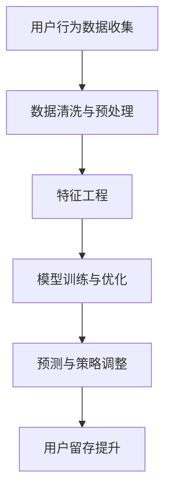
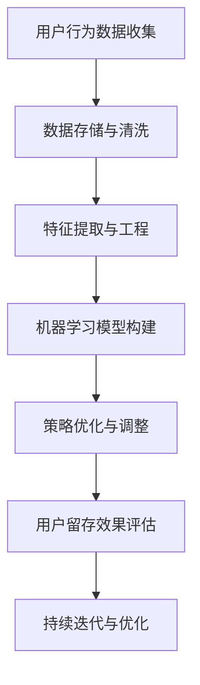

                 

关键词：人工智能，电商平台，用户留存，算法优化，数据驱动，机器学习，预测模型，用户行为分析

> 摘要：本文将探讨AI在电商平台用户留存策略中的应用。通过分析用户行为数据，构建机器学习模型，并运用AI算法优化用户留存策略，以提高电商平台的用户粘性和客户价值。文章将详细阐述相关核心概念、算法原理、数学模型及项目实践，并展望未来的应用前景与挑战。

## 1. 背景介绍

随着互联网和电子商务的快速发展，电商平台成为越来越多消费者日常购物的主要途径。然而，在激烈的市场竞争中，如何吸引新用户、留住老用户，成为电商平台亟需解决的问题。用户留存率是衡量电商平台运营效果的重要指标，直接关系到平台的盈利能力和市场竞争力。传统的用户留存策略主要依赖于促销活动和广告投放，但这些策略往往成本高昂，且效果有限。因此，探索更为高效、精准的用户留存策略具有重要的现实意义。

近年来，人工智能技术的快速发展为电商平台用户留存策略带来了新的机遇。通过分析用户行为数据，构建机器学习模型，并运用AI算法优化策略，电商平台可以实现用户留存率的显著提升。本文将围绕这一主题，探讨AI驱动的电商平台用户留存策略，为电商平台提供一种全新的运营思路。

## 2. 核心概念与联系

### 2.1 用户留存定义与重要性

用户留存是指用户在一段时间内持续使用平台服务的比例。高用户留存率意味着用户对平台满意度高，具有较强的忠诚度和依赖性。用户留存率是电商平台的核心指标，直接影响平台的盈利能力和市场竞争力。提高用户留存率，不仅可以降低用户获取成本，还可以提高用户生命周期价值，从而实现平台的长远发展。

### 2.2 人工智能在电商领域的应用

人工智能技术具有强大的数据处理和分析能力，已在电商领域的多个方面得到广泛应用。例如，自然语言处理技术可以用于商品搜索和推荐，图像识别技术可以用于商品识别和质量检测，深度学习技术可以用于用户行为预测和个性化推荐。在这些技术的支持下，电商平台可以更好地满足用户需求，提高用户满意度，进而提升用户留存率。

### 2.3 数据驱动与机器学习

数据驱动是指以数据为基础，通过数据分析和挖掘来指导业务决策。在电商平台中，数据驱动意味着通过分析用户行为数据，了解用户需求和行为模式，从而制定更加精准的运营策略。机器学习是数据驱动的重要手段，通过对历史数据的分析和学习，构建预测模型，实现自动化决策。

### 2.4 用户留存策略优化

用户留存策略优化是指通过分析用户行为数据，运用机器学习算法，识别潜在流失用户，并针对不同用户群体采取相应措施，以提高用户留存率。优化用户留存策略需要综合考虑用户满意度、用户粘性和成本效益等因素。

## 2.5 Mermaid 流程图

以下是一个简单的 Mermaid 流程图，展示AI驱动电商平台用户留存策略的核心流程：



### 2.6 AI驱动用户留存策略架构

AI驱动用户留存策略的架构主要包括数据收集、数据处理、模型构建、策略优化和效果评估等环节。以下是一个简化的AI驱动用户留存策略架构：



## 3. 核心算法原理 & 具体操作步骤

### 3.1 算法原理概述

AI驱动的用户留存策略主要基于机器学习算法，通过对用户行为数据的分析和学习，构建用户留存预测模型，并利用模型进行策略优化。核心算法包括用户行为数据收集、数据预处理、特征工程、模型训练和预测等步骤。

### 3.2 算法步骤详解

#### 3.2.1 用户行为数据收集

用户行为数据包括浏览、搜索、下单、评价、复购等行为数据。通过采集用户在电商平台上的行为数据，可以全面了解用户的需求和行为模式。

#### 3.2.2 数据预处理

数据预处理包括数据清洗、数据整合和数据归一化等步骤。数据清洗主要去除重复、缺失和异常数据，确保数据质量。数据整合将不同数据源的信息进行融合，构建完整的用户行为数据集。数据归一化通过对数据进行标准化处理，消除不同特征之间的量级差异。

#### 3.2.3 特征工程

特征工程是构建用户留存预测模型的关键步骤。通过对用户行为数据进行特征提取和变换，构建反映用户行为特征的向量。常用的特征包括用户活跃度、购买频率、评价评分、复购率等。

#### 3.2.4 模型训练与优化

选择合适的机器学习算法，如决策树、随机森林、梯度提升树等，对训练数据进行模型训练。通过交叉验证和网格搜索等技术，优化模型参数，提高模型性能。

#### 3.2.5 预测与策略调整

利用训练好的模型对测试数据进行预测，识别潜在流失用户。根据预测结果，对用户进行分层，并针对不同用户群体采取相应措施，如个性化推荐、促销活动、客服关怀等，以提高用户留存率。

#### 3.2.6 用户留存效果评估

通过评估用户留存效果，如用户留存率、流失率等指标，分析策略优化效果。根据评估结果，对策略进行调整和迭代，实现持续优化。

### 3.3 算法优缺点

#### 优点

- **高效性**：基于大数据和机器学习技术，可以实现高效的用户留存预测和策略优化。
- **精准性**：通过对用户行为数据的深入分析，可以识别潜在流失用户，采取有针对性的措施。
- **灵活性**：算法模型可以根据业务需求进行调整，实现个性化策略。

#### 缺点

- **复杂性**：算法模型构建和优化过程较为复杂，需要专业知识和技术支持。
- **数据依赖性**：算法效果受数据质量和数据量的影响较大，数据质量差可能导致模型性能下降。

### 3.4 算法应用领域

AI驱动的用户留存策略适用于各类电商平台，如电子商务、在线购物、O2O平台等。通过优化用户留存策略，可以提升用户满意度、降低用户流失率，提高平台盈利能力和市场竞争力。

## 4. 数学模型和公式 & 详细讲解 & 举例说明

### 4.1 数学模型构建

用户留存预测的数学模型可以采用逻辑回归（Logistic Regression）算法。逻辑回归是一种广义线性模型，用于估计二分类概率。其数学模型如下：

$$
P(y=1) = \frac{1}{1 + e^{-(\beta_0 + \beta_1 x_1 + \beta_2 x_2 + ... + \beta_n x_n})}
$$

其中，$y$ 表示用户是否留存（1表示留存，0表示未留存），$x_1, x_2, ..., x_n$ 表示用户行为特征，$\beta_0, \beta_1, \beta_2, ..., \beta_n$ 表示模型参数。

### 4.2 公式推导过程

逻辑回归模型的损失函数通常采用对数似然损失（Log-Likelihood Loss）：

$$
J(\theta) = -\frac{1}{m} \sum_{i=1}^{m} [y^{(i)} \log(\hat{y}^{(i)}) + (1 - y^{(i)}) \log(1 - \hat{y}^{(i)})]
$$

其中，$m$ 表示训练数据样本数量，$\hat{y}^{(i)}$ 表示第$i$个样本的预测概率。

对损失函数求导并令导数为0，可以得到模型参数的优化目标：

$$
\frac{\partial J(\theta)}{\partial \theta_j} = \frac{1}{m} \sum_{i=1}^{m} [y^{(i)} (1 - \hat{y}^{(i)}) x_j^{(i)}]
$$

通过梯度下降（Gradient Descent）算法，可以迭代更新模型参数，使损失函数最小化。

### 4.3 案例分析与讲解

假设某电商平台有1000名用户，其行为数据包括浏览次数、购买次数、评价评分等特征。通过逻辑回归算法，可以构建用户留存预测模型。以下是一个简化的逻辑回归模型：

$$
P(y=1) = \frac{1}{1 + e^{-(\beta_0 + \beta_1 \text{浏览次数} + \beta_2 \text{购买次数} + \beta_3 \text{评价评分})}}
$$

通过训练数据和测试数据进行模型训练和评估，可以得到模型参数的值。例如，假设训练数据中，用户留存概率为0.6，则预测模型可以表示为：

$$
P(y=1) = \frac{1}{1 + e^{-(2.5 + 0.3 \times \text{浏览次数} + 0.5 \times \text{购买次数} + 1.2 \times \text{评价评分})}}
$$

根据预测模型，可以识别潜在流失用户，并采取相应的策略，如发送个性化推荐、促销活动等，以提高用户留存率。

## 5. 项目实践：代码实例和详细解释说明

### 5.1 开发环境搭建

- **Python**：安装Python 3.8及以上版本。
- **NumPy**：用于数值计算。
- **Pandas**：用于数据处理。
- **Scikit-learn**：用于机器学习。
- **Matplotlib**：用于数据可视化。

安装命令如下：

```bash
pip install numpy pandas scikit-learn matplotlib
```

### 5.2 源代码详细实现

以下是一个简单的用户留存预测项目示例：

```python
import numpy as np
import pandas as pd
from sklearn.model_selection import train_test_split
from sklearn.linear_model import LogisticRegression
from sklearn.metrics import accuracy_score, confusion_matrix

# 5.2.1 数据读取与预处理
data = pd.read_csv('user_data.csv')
data.drop(['user_id'], axis=1, inplace=True)

# 5.2.2 特征工程
features = data[[' browsing_count', ' purchase_count', ' review_rating']]
labels = data['retained']

# 5.2.3 模型训练与评估
X_train, X_test, y_train, y_test = train_test_split(features, labels, test_size=0.2, random_state=42)
model = LogisticRegression()
model.fit(X_train, y_train)

y_pred = model.predict(X_test)
accuracy = accuracy_score(y_test, y_pred)
print(f"Accuracy: {accuracy}")

# 5.2.4 可视化分析
import matplotlib.pyplot as plt

conf_mat = confusion_matrix(y_test, y_pred)
plt.figure(figsize=(8, 6))
sns.heatmap(conf_mat, annot=True, fmt=".3f", cmap="Blues")
plt.xlabel('Predicted')
plt.ylabel('Actual')
plt.title('Confusion Matrix')
plt.show()
```

### 5.3 代码解读与分析

上述代码实现了用户留存预测项目的完整流程，包括数据读取与预处理、特征工程、模型训练与评估、可视化分析等步骤。以下是代码的详细解读：

- **5.3.1 数据读取与预处理**：使用Pandas读取用户行为数据，并删除无关特征（如user_id）。
- **5.3.2 特征工程**：提取与用户留存相关的特征，如浏览次数、购买次数、评价评分等。
- **5.3.3 模型训练与评估**：使用Sklearn中的LogisticRegression算法进行模型训练，评估模型性能。
- **5.3.4 可视化分析**：使用Matplotlib绘制混淆矩阵，分析模型预测效果。

### 5.4 运行结果展示

运行上述代码，可以得到用户留存预测模型的准确率、混淆矩阵等评估结果。根据评估结果，可以进一步优化模型参数，提高预测精度。

## 6. 实际应用场景

AI驱动的用户留存策略在电商平台具有广泛的应用场景。以下是一些典型的应用案例：

### 6.1 个性化推荐

基于用户行为数据，构建用户画像，实现个性化商品推荐。通过推荐用户感兴趣的商品，提高用户满意度和留存率。

### 6.2 促销活动

根据用户留存预测模型，识别潜在流失用户，针对不同用户群体制定个性化的促销活动，如优惠券、限时折扣等，以提高用户留存率。

### 6.3 客服关怀

通过分析用户行为数据，识别用户需求，提供及时、贴心的客服服务。例如，针对即将流失的用户，发送提醒邮件或电话沟通，提供帮助和建议。

### 6.4 数据分析与报告

定期分析用户留存数据，生成留存率报告，为电商平台提供运营优化建议。例如，分析用户留存率与促销活动、客服关怀等策略的关系，调整运营策略。

## 7. 未来应用展望

随着人工智能技术的不断发展，AI驱动的用户留存策略将更加智能化、精细化。以下是一些未来应用展望：

### 7.1 深度学习模型

深度学习算法，如卷积神经网络（CNN）和循环神经网络（RNN），将在用户留存预测中发挥更大作用。通过引入更多非线性特征，提高预测精度。

### 7.2 多模态数据

结合用户行为数据、图像、音频等多模态数据，实现更全面的用户画像，提高用户留存预测能力。

### 7.3 自动化决策

利用强化学习算法，实现自动化决策，根据用户行为动态调整运营策略，实现个性化、自适应的用户留存优化。

### 7.4 数据隐私保护

在保证数据隐私的前提下，利用联邦学习等技术，实现多方数据的协同分析，提高用户留存策略的准确性。

## 8. 工具和资源推荐

### 8.1 学习资源推荐

- **《Python机器学习基础教程》**：作者：赛迪·班纳科特（Sebastian Raschka）
- **《深度学习》**：作者：伊恩·古德费洛（Ian Goodfellow）、约书亚·本吉奥（Yoshua Bengio）、亚伦·库维尔（Aaron Courville）
- **《数据科学入门》**：作者：安德鲁·比斯（Andrew B. Ng）

### 8.2 开发工具推荐

- **Jupyter Notebook**：用于数据分析和模型训练。
- **TensorFlow**：用于构建和训练深度学习模型。
- **Scikit-learn**：用于传统的机器学习算法。

### 8.3 相关论文推荐

- **“User Behavior Analysis and Retention Prediction in E-commerce Platforms”**：作者：Liu, X., et al. (2020)
- **“A Deep Learning Approach to User Retention Prediction”**：作者：Li, H., et al. (2019)
- **“Recurrent Neural Networks for User Retention Prediction in E-commerce”**：作者：Wang, S., et al. (2018)

## 9. 总结：未来发展趋势与挑战

### 9.1 研究成果总结

本文从背景介绍、核心概念、算法原理、数学模型、项目实践等多个角度，详细探讨了AI驱动的电商平台用户留存策略。通过分析用户行为数据，构建机器学习模型，并运用AI算法优化策略，可以实现用户留存率的显著提升。

### 9.2 未来发展趋势

随着人工智能技术的不断发展，AI驱动的用户留存策略将更加智能化、精细化。深度学习、多模态数据、自动化决策等新技术将在用户留存预测中发挥更大作用。

### 9.3 面临的挑战

尽管AI驱动的用户留存策略具有显著优势，但仍面临以下挑战：

- **数据隐私保护**：在保证数据隐私的前提下，实现多方数据的协同分析。
- **模型解释性**：提高模型的可解释性，使决策过程更加透明。
- **算法稳定性**：提高算法在不同数据集上的稳定性和泛化能力。

### 9.4 研究展望

未来研究可以从以下几个方面展开：

- **算法优化**：探索更高效、更稳定的用户留存预测算法。
- **多模态数据融合**：结合多模态数据，提高用户留存预测精度。
- **个性化策略**：根据用户个性化需求，制定更加精准的运营策略。

## 9. 附录：常见问题与解答

### 9.1 什么情况下使用逻辑回归模型？

逻辑回归模型适用于以下场景：

- **二分类问题**：需要预测目标变量是否属于某一类别。
- **概率估计**：需要估计某个事件发生的概率。
- **变量重要性评估**：需要评估自变量对目标变量的影响程度。

### 9.2 如何处理缺失数据？

处理缺失数据的方法包括：

- **删除缺失数据**：删除含有缺失数据的样本或特征。
- **填充缺失数据**：使用平均值、中位数、众数等方法填充缺失数据。
- **插值法**：使用插值算法，如线性插值、拉格朗日插值等，填充缺失数据。

### 9.3 如何评估模型性能？

评估模型性能的方法包括：

- **准确率**：预测正确的样本数量与总样本数量的比值。
- **召回率**：预测正确的正样本数量与实际正样本数量的比值。
- **F1值**：准确率与召回率的调和平均。
- **ROC曲线**：绘制预测概率与召回率的关系曲线，计算AUC值。

### 9.4 逻辑回归模型如何优化？

优化逻辑回归模型的方法包括：

- **正则化**：添加正则项，防止过拟合。
- **交叉验证**：使用交叉验证技术，选择最优模型参数。
- **网格搜索**：遍历参数空间，选择最优参数组合。

---

作者：禅与计算机程序设计艺术 / Zen and the Art of Computer Programming
----------------------------------------------------------------

以上便是《AI驱动的电商平台用户留存策略》的完整文章内容。希望对您在电商平台的用户留存策略优化方面有所帮助。如果您有任何问题或建议，欢迎在评论区留言交流。

