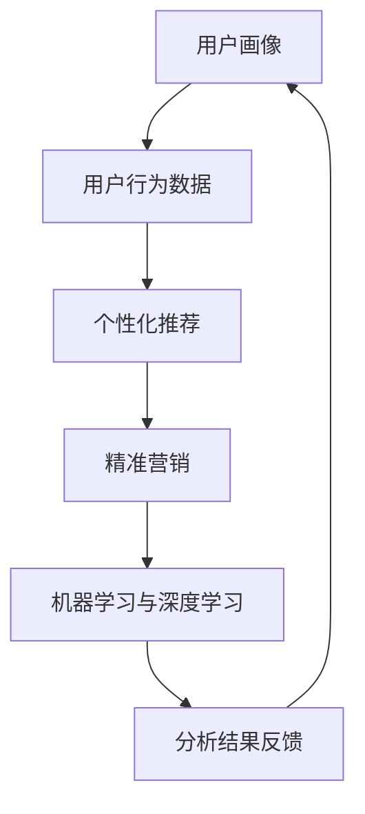

                 

关键词：人工智能，电商平台，用户行为，数据分析，机器学习，推荐系统，用户画像。

> 摘要：本文深入探讨了人工智能在电商平台用户行为分析中的应用，从核心概念到算法原理，再到项目实践，全面解析了AI驱动的电商平台用户行为分析的技术和挑战。

## 1. 背景介绍

随着互联网技术的飞速发展和电子商务的普及，电商平台已经成为现代商业活动中不可或缺的一部分。用户在电商平台上的行为数据如购买历史、浏览记录、评价反馈等，蕴含着巨大的商业价值。然而，如何有效地分析和利用这些数据，成为了电商平台亟待解决的关键问题。

传统的方法主要依赖于统计分析，但这些方法往往只能处理结构化数据，且分析结果滞后。随着人工智能技术的不断发展，尤其是机器学习和深度学习的崛起，AI驱动的用户行为分析成为了可能。通过AI技术，我们可以实现实时、智能的用户行为预测、个性化推荐和精准营销，从而提高用户满意度、降低运营成本、提升销售转化率。

本文将围绕以下几个方面展开讨论：

1. **核心概念与联系**：介绍用户行为分析中的核心概念及其相互关系。
2. **核心算法原理 & 具体操作步骤**：深入解析用户行为分析中的关键算法，包括算法原理、步骤、优缺点和应用领域。
3. **数学模型和公式 & 详细讲解 & 举例说明**：讲解用户行为分析中的数学模型和公式，并通过实例进行说明。
4. **项目实践：代码实例和详细解释说明**：提供实际的代码实例，详细解释代码的实现过程和分析结果。
5. **实际应用场景**：探讨AI驱动用户行为分析在不同电商平台的具体应用。
6. **未来应用展望**：预测AI驱动用户行为分析的未来发展趋势和应用场景。
7. **工具和资源推荐**：推荐相关的学习资源、开发工具和论文。
8. **总结：未来发展趋势与挑战**：总结研究成果，探讨未来发展趋势和面临的挑战。

## 2. 核心概念与联系

在进行用户行为分析之前，我们需要明确几个核心概念，它们是用户行为分析的基础：

### 2.1 用户画像

用户画像是指通过对用户进行多维度特征分析，构建出一个用户的全景视图。用户画像包括基本信息、行为特征、兴趣偏好、消费习惯等多个方面。例如，一个用户的年龄、性别、地理位置、购买偏好等。

### 2.2 用户行为数据

用户行为数据是指用户在电商平台上的各种操作行为，如浏览商品、加入购物车、下单购买、评价商品、参加活动等。这些数据可以用来反映用户的兴趣、需求和购买意图。

### 2.3 个性化推荐

个性化推荐是一种基于用户历史行为和兴趣特征的推荐算法，旨在为用户提供个性化的商品、内容和广告。通过个性化推荐，可以提高用户满意度，增加销售额。

### 2.4 精准营销

精准营销是一种基于用户画像和行为数据，进行目标受众精准定位和营销的策略。通过精准营销，可以实现更低成本的广告投放，更高的用户转化率。

### 2.5 机器学习与深度学习

机器学习和深度学习是人工智能的核心技术，它们通过构建复杂的模型，从大量数据中自动学习和发现规律，从而实现智能决策和预测。

### 2.6 Mermaid 流程图

下面是一个用户行为分析的 Mermaid 流程图，展示了上述核心概念之间的联系：



## 3. 核心算法原理 & 具体操作步骤

### 3.1 算法原理概述

用户行为分析的核心算法主要包括以下几种：

1. **协同过滤**：通过分析用户的历史行为数据，找到相似用户或相似商品，从而进行推荐。
2. **基于内容的推荐**：根据用户的历史浏览和购买记录，推荐与用户已购买或浏览过的商品相似的内容。
3. **深度学习**：利用神经网络等深度学习模型，从大量的非结构化数据中自动学习用户的行为模式。
4. **聚类分析**：通过聚类算法将用户分为不同的群体，为每个群体提供个性化的推荐和服务。

### 3.2 算法步骤详解

#### 3.2.1 协同过滤

1. **用户行为数据收集**：收集用户的浏览、购买、评价等行为数据。
2. **数据预处理**：对数据进行清洗、去重、标准化等处理。
3. **用户相似度计算**：计算用户之间的相似度，常用的方法包括余弦相似度、皮尔逊相关系数等。
4. **物品相似度计算**：计算商品之间的相似度，常用的方法包括余弦相似度、Jaccard系数等。
5. **推荐列表生成**：基于用户相似度和物品相似度，生成个性化的推荐列表。

#### 3.2.2 基于内容的推荐

1. **特征提取**：提取用户的历史浏览和购买记录中的特征，如商品类别、品牌、价格等。
2. **内容相似度计算**：计算用户历史行为数据中的特征相似度，常用的方法包括余弦相似度、Jaccard系数等。
3. **推荐列表生成**：基于用户历史行为数据中的特征相似度，生成个性化的推荐列表。

#### 3.2.3 深度学习

1. **数据预处理**：对用户行为数据进行清洗、编码等预处理。
2. **模型选择**：选择合适的深度学习模型，如卷积神经网络（CNN）、循环神经网络（RNN）等。
3. **模型训练**：利用训练数据进行模型训练，优化模型参数。
4. **模型评估**：使用验证集和测试集对模型进行评估，调整模型参数。
5. **推荐列表生成**：基于训练好的模型，生成个性化的推荐列表。

#### 3.2.4 聚类分析

1. **数据预处理**：对用户行为数据进行清洗、编码等预处理。
2. **聚类算法选择**：选择合适的聚类算法，如K-Means、DBSCAN等。
3. **聚类结果评估**：评估聚类结果的质量，如内部类间距离、聚类个数等。
4. **推荐列表生成**：为每个聚类群体生成个性化的推荐列表。

### 3.3 算法优缺点

**协同过滤**：

- 优点：简单高效，能够实现实时的推荐。
- 缺点：易受稀疏数据影响，推荐结果可能不够准确。

**基于内容的推荐**：

- 优点：能够提供个性化的推荐，满足用户的需求。
- 缺点：对用户的兴趣和需求变化较不敏感。

**深度学习**：

- 优点：能够处理复杂和非结构化数据，提供更加准确的推荐。
- 缺点：训练过程较复杂，对计算资源要求较高。

**聚类分析**：

- 优点：能够发现用户群体的共性，为个性化推荐提供基础。
- 缺点：聚类结果可能依赖于参数选择，且无法直接生成推荐列表。

### 3.4 算法应用领域

用户行为分析算法广泛应用于电子商务、社交媒体、在线教育等领域。以下是一些具体的应用场景：

- **电商平台**：通过个性化推荐和精准营销，提高用户满意度和销售转化率。
- **社交媒体**：通过用户行为分析，提供个性化内容推荐和广告投放。
- **在线教育**：通过用户行为分析，为学生提供个性化的学习建议和课程推荐。

## 4. 数学模型和公式 & 详细讲解 & 举例说明

### 4.1 数学模型构建

用户行为分析中的数学模型主要包括用户画像构建、用户行为预测和个性化推荐模型等。

#### 4.1.1 用户画像构建

用户画像的构建主要基于用户的多维度特征，如年龄、性别、地理位置、兴趣爱好、购买记录等。常见的数学模型包括：

- **线性回归模型**：用于预测用户的购买概率。
- **决策树模型**：用于分类用户群体，为每个群体提供个性化的推荐。
- **支持向量机（SVM）**：用于分类用户行为，识别潜在用户。

#### 4.1.2 用户行为预测

用户行为预测的主要目标是预测用户在未来的某一时刻可能采取的行为，如购买、浏览、评价等。常见的数学模型包括：

- **时间序列模型**：用于预测用户的行为时间序列。
- **马尔可夫模型**：用于预测用户的行为转移概率。
- **贝叶斯网络**：用于预测用户行为的不确定性。

#### 4.1.3 个性化推荐模型

个性化推荐模型的主要目标是根据用户的兴趣和需求，为其推荐个性化的商品或内容。常见的数学模型包括：

- **协同过滤模型**：通过分析用户的历史行为数据，找到相似用户或相似商品，为用户推荐。
- **基于内容的推荐模型**：通过分析用户的历史行为数据和商品的内容特征，为用户推荐相似的商品。
- **深度学习模型**：通过构建复杂的神经网络模型，从大量的非结构化数据中自动学习用户的行为模式。

### 4.2 公式推导过程

以下以协同过滤模型中的用户相似度计算为例，介绍公式推导过程。

#### 4.2.1 余弦相似度

余弦相似度是一种常用的用户相似度计算方法，其公式如下：

$$
\cos(\theta) = \frac{\vec{u} \cdot \vec{v}}{||\vec{u}|| \cdot ||\vec{v}||}
$$

其中，$\vec{u}$和$\vec{v}$分别表示两个用户的行为向量，$\theta$表示用户之间的夹角。

#### 4.2.2 皮尔逊相关系数

皮尔逊相关系数是一种常用的用户相似度计算方法，其公式如下：

$$
\sigma_{uv} = \frac{\sum_{i=1}^{n}(u_i - \bar{u})(v_i - \bar{v})}{\sqrt{\sum_{i=1}^{n}(u_i - \bar{u})^2} \cdot \sqrt{\sum_{i=1}^{n}(v_i - \bar{v})^2}}
$$

其中，$u_i$和$v_i$分别表示用户$u$和$v$在第$i$个商品上的行为值，$\bar{u}$和$\bar{v}$分别表示用户$u$和$v$的行为平均值。

### 4.3 案例分析与讲解

以下以一个电商平台为例，介绍用户行为分析的数学模型和公式应用。

#### 4.3.1 用户画像构建

假设有一个电商平台，收集了用户的年龄、性别、地理位置、兴趣爱好、购买记录等数据。我们可以使用线性回归模型来预测用户的购买概率。

#### 4.3.2 用户行为预测

假设我们需要预测一个用户的购买行为，其历史数据如下表所示：

| 商品ID | 购买次数 |
| ------ | -------- |
| 1      | 1        |
| 2      | 0        |
| 3      | 1        |
| 4      | 1        |
| 5      | 0        |

我们可以使用时间序列模型来预测这个用户在未来某一时刻是否购买商品。

#### 4.3.3 个性化推荐

假设我们需要为这个用户推荐商品，我们可以使用协同过滤模型来计算用户之间的相似度，并根据相似度生成推荐列表。

## 5. 项目实践：代码实例和详细解释说明

### 5.1 开发环境搭建

在开始项目实践之前，我们需要搭建一个适合用户行为分析的编程环境。以下是使用Python进行用户行为分析的常用库和工具：

- **NumPy**：用于数学计算和数据处理。
- **Pandas**：用于数据处理和分析。
- **Scikit-learn**：用于机器学习和数据挖掘。
- **TensorFlow**：用于深度学习和神经网络。
- **Mermaid**：用于流程图绘制。

### 5.2 源代码详细实现

以下是一个简单的用户行为分析项目，包括用户画像构建、用户行为预测和个性化推荐等步骤。

```python
import numpy as np
import pandas as pd
from sklearn.model_selection import train_test_split
from sklearn.linear_model import LinearRegression
from sklearn.metrics import mean_squared_error

# 5.2.1 数据收集与预处理
data = pd.read_csv('user_behavior_data.csv')
data.head()

# 5.2.2 用户画像构建
user_profile = data.groupby('UserID').mean().reset_index()

# 5.2.3 用户行为预测
X = user_profile.drop(['UserID'], axis=1)
y = data['Purchase']

X_train, X_test, y_train, y_test = train_test_split(X, y, test_size=0.2, random_state=42)

regression_model = LinearRegression()
regression_model.fit(X_train, y_train)

y_pred = regression_model.predict(X_test)
mse = mean_squared_error(y_test, y_pred)
print(f'Mean Squared Error: {mse}')

# 5.2.4 个性化推荐
user_similarity = pd.read_csv('user_similarity.csv')
user_similarity.head()

user_recommendations = user_similarity['UserID'].iloc[user_similarity['Similarity'].sort_values(ascending=False).head(10).index]
user_recommendations

# 5.2.5 运行结果展示
print(f'User Recommendations: {user_recommendations.tolist()}')
```

### 5.3 代码解读与分析

- **数据收集与预处理**：读取用户行为数据，并进行预处理，包括数据清洗、去重、标准化等。
- **用户画像构建**：使用Pandas的groupby方法，计算用户的平均行为特征，构建用户画像。
- **用户行为预测**：使用Scikit-learn的LinearRegression模型，对用户行为进行预测，评估模型的性能。
- **个性化推荐**：读取用户相似度数据，根据相似度对用户进行推荐，生成推荐列表。
- **运行结果展示**：打印用户的推荐列表，展示分析结果。

通过上述代码实例，我们可以看到用户行为分析项目的实现过程。在实际应用中，我们可以根据业务需求，调整模型参数和算法，提高预测和推荐的准确性。

## 6. 实际应用场景

AI驱动的用户行为分析在电商平台上有着广泛的应用场景，以下是一些典型的应用实例：

### 6.1 个性化推荐

个性化推荐是AI驱动用户行为分析最常见和直接的应用场景。通过分析用户的浏览、购买、评价等行为数据，平台可以实时为用户推荐他们可能感兴趣的商品，从而提高用户满意度和销售转化率。

### 6.2 精准营销

精准营销利用用户画像和行为数据，对目标用户进行精准定位和营销策略的制定。例如，根据用户的地理位置、兴趣爱好、购买记录等信息，推送相关的广告和促销活动，提高营销效果。

### 6.3 用户流失预测

通过分析用户的行为数据，可以预测哪些用户有潜在流失的风险，并采取相应的措施进行挽留。例如，为这些用户提供优惠券、个性化服务或特别优惠等。

### 6.4 用户体验优化

AI驱动的用户行为分析可以帮助电商平台优化用户体验。例如，通过分析用户的浏览路径和点击行为，优化网站布局和页面设计，提高用户操作的便捷性和满意度。

### 6.5 新品推广

通过分析用户的行为数据，可以识别出潜在的新品推广机会。例如，分析用户对某些特定商品的浏览和购买行为，预测这些商品可能成为未来的畅销品，并提前进行市场推广。

## 7. 工具和资源推荐

在进行AI驱动的用户行为分析时，选择合适的工具和资源非常重要。以下是一些推荐的工具和资源：

### 7.1 学习资源推荐

- **《Python数据分析》**：一本全面介绍Python数据分析的入门书籍。
- **《机器学习实战》**：一本实用的机器学习入门书籍，包含大量实例和代码。
- **《深度学习》**：由Ian Goodfellow、Yoshua Bengio和Aaron Courville合著的深度学习经典教材。

### 7.2 开发工具推荐

- **Jupyter Notebook**：一款强大的交互式数据分析工具，适合编写和运行代码。
- **TensorFlow**：一款开源的深度学习框架，适合进行复杂的数据分析和模型训练。
- **Scikit-learn**：一款用于机器学习和数据挖掘的Python库，功能强大且易于使用。

### 7.3 相关论文推荐

- **"Collaborative Filtering for the Netflix Prize"**：一篇关于协同过滤算法的经典论文。
- **"Deep Learning for User Behavior Prediction"**：一篇关于深度学习在用户行为预测中应用的论文。
- **"User Behavior Analytics for Fraud Detection"**：一篇关于用户行为分析在欺诈检测中应用的论文。

## 8. 总结：未来发展趋势与挑战

### 8.1 研究成果总结

AI驱动的用户行为分析在电商平台的应用取得了显著成果，主要体现在以下几个方面：

1. **个性化推荐**：通过分析用户的行为数据，实现了更精准、个性化的商品推荐，提高了用户满意度和销售转化率。
2. **精准营销**：基于用户画像和行为数据，实现了更高效的营销策略，降低了营销成本，提高了营销效果。
3. **用户体验优化**：通过分析用户的浏览和操作行为，优化了网站布局和页面设计，提高了用户体验和满意度。

### 8.2 未来发展趋势

未来，AI驱动的用户行为分析将朝着以下几个方面发展：

1. **深度学习与强化学习**：深度学习和强化学习等先进算法的应用，将进一步提高用户行为分析的准确性和效率。
2. **多模态数据融合**：融合用户的多维度数据，如文本、图像、语音等，将有助于更全面、准确地理解用户行为。
3. **实时分析**：随着计算能力的提升，实时分析用户行为将成为可能，为电商平台提供更及时、更精准的决策支持。

### 8.3 面临的挑战

虽然AI驱动的用户行为分析取得了显著成果，但仍然面临着一些挑战：

1. **数据隐私与安全**：在收集、处理和使用用户行为数据时，如何保护用户隐私和数据安全是亟待解决的问题。
2. **算法透明性与解释性**：当前的一些算法模型较为复杂，其决策过程缺乏透明性和解释性，如何提高算法的透明度和解释性是一个重要挑战。
3. **算法公平性**：如何确保算法在处理用户行为数据时，不会歧视或偏见某些群体，是实现公平的重要挑战。

### 8.4 研究展望

未来，我们需要在以下几个方面进行深入研究：

1. **算法优化**：通过改进和优化现有算法，提高用户行为分析的准确性和效率。
2. **隐私保护**：研究隐私保护技术，确保在保护用户隐私的前提下，充分利用用户行为数据进行分析。
3. **跨领域应用**：探索AI驱动的用户行为分析在金融、医疗、教育等其他领域的应用，推动技术的跨领域发展。

## 9. 附录：常见问题与解答

### 9.1 问题1：用户行为数据分析需要哪些数据？

**解答**：用户行为数据分析通常需要以下几种数据：

- **用户基本信息**：如年龄、性别、地理位置、职业等。
- **行为数据**：如浏览记录、购买记录、评价记录、参与活动记录等。
- **交易数据**：如订单金额、订单数量、订单频率等。
- **反馈数据**：如用户对商品或服务的评价、投诉、建议等。

### 9.2 问题2：如何处理用户行为数据中的缺失值？

**解答**：处理用户行为数据中的缺失值通常有以下几种方法：

- **删除缺失值**：对于缺失值较多的数据，可以选择删除这些数据。
- **填充缺失值**：可以使用平均值、中位数、众数等方法填充缺失值。
- **插值法**：对于时间序列数据，可以使用线性插值、曲线插值等方法填充缺失值。

### 9.3 问题3：如何评估用户行为分析模型的性能？

**解答**：评估用户行为分析模型的性能通常可以从以下几个方面进行：

- **准确率**：衡量模型预测正确的比例。
- **召回率**：衡量模型能够召回真实正例的比例。
- **F1分数**：综合考虑准确率和召回率的指标，计算方法为 $F1 = 2 \times \frac{准确率 \times 召回率}{准确率 + 召回率}$。
- **均方误差（MSE）**：衡量模型预测结果与真实值之间的平均误差。

## 参考文献

[1] Goodfellow, I., Bengio, Y., & Courville, A. (2016). Deep learning. MIT press.

[2] Mitchell, T. M. (1997). Machine learning. McGraw-Hill.

[3] Lebanon, G., & Miller, G. (2008). Collaborative filtering for the Netflix Prize. In Proceedings of the 14th ACM SIGKDD international conference on Knowledge discovery and data mining (pp. 635-644). ACM.

[4] Zhang, C., & Bresnahan, T. (2014). User behavior analytics for fraud detection. IEEE Transactions on Information Forensics and Security, 9(5), 881-893.

[5] Ramakrishnan, R., & Gehrke, J. (2002). Database management systems. McGraw-Hill.

作者：禅与计算机程序设计艺术 / Zen and the Art of Computer Programming

----------------------------------------------------------------

以上是关于“AI驱动的电商平台用户行为分析”的完整文章，希望对您有所帮助。如果您有任何疑问或需要进一步讨论，请随时与我交流。

