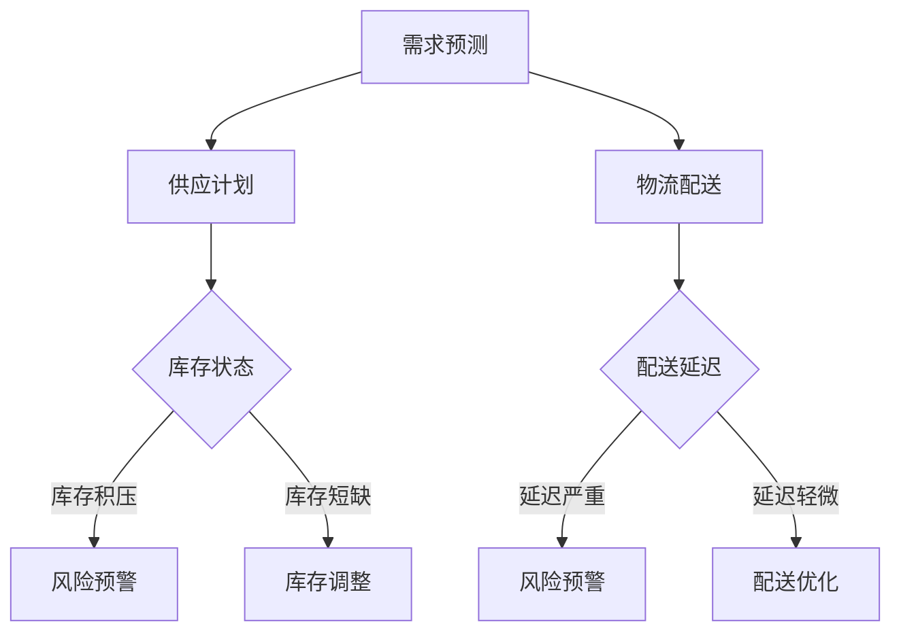

                 

关键词：AI，电商，智能供应链，风险预警，管理系统

摘要：随着电子商务的快速发展，电商平台面临着越来越多的供应链风险，本文将探讨如何利用人工智能技术构建一个高效的电商智能供应链风险预警与管理系统。本文将介绍核心概念、算法原理、数学模型、项目实践、应用场景以及未来展望等内容。

## 1. 背景介绍

随着互联网技术的快速发展，电子商务已经成为全球范围内的一种重要商业模式。电商平台通过整合供应链资源，为消费者提供丰富多样的商品和服务。然而，在电商平台的运营过程中，供应链风险始终是一个不容忽视的问题。供应链风险包括但不限于供应中断、库存积压、物流延迟等，这些风险可能会导致电商平台服务中断、消费者满意度下降，甚至影响企业的经济效益。

传统供应链风险管理主要依赖于人工经验和历史数据，这种方式存在明显的局限性，无法及时、准确地识别和应对新兴的风险。随着人工智能技术的飞速发展，利用人工智能技术构建智能供应链风险预警与管理系统已成为电商企业提高供应链管理效率、降低运营成本的重要手段。

## 2. 核心概念与联系

### 2.1 人工智能（AI）

人工智能（Artificial Intelligence，简称AI）是计算机科学的一个分支，旨在使计算机模拟人类智能的行为，包括学习、推理、感知和自然语言处理等。在电商智能供应链风险预警与管理系统建设中，人工智能技术主要用于数据挖掘、模式识别和预测分析。

### 2.2 智能供应链

智能供应链（Intelligent Supply Chain）是指通过信息化、网络化和智能化手段，实现供应链各环节的高效协同和优化。智能供应链能够实时获取供应链上下游的信息，通过数据分析和智能决策，提高供应链的响应速度和准确性。

### 2.3 风险预警

风险预警（Risk Warning）是指通过监控和分析风险信号，提前发现潜在的风险，并采取相应的措施进行应对。在电商智能供应链风险预警与管理系统建设中，风险预警是实现供应链风险管理的关键环节。

### 2.4 管理系统

管理系统（Management System）是指用于实现企业各项业务目标的信息系统。在电商智能供应链风险预警与管理系统建设中，管理系统是用于集成和管理供应链各环节信息、实现智能决策的重要工具。

### 2.5 Mermaid 流程图

以下是智能供应链风险预警与管理系统的一个简单 Mermaid 流程图：



## 3. 核心算法原理 & 具体操作步骤

### 3.1 算法原理概述

电商智能供应链风险预警与管理系统核心算法主要包括以下三个方面：

1. **需求预测算法**：利用历史销售数据、市场趋势和用户行为数据，对未来的商品需求进行预测。
2. **供应计划算法**：根据需求预测结果，制定合理的供应计划，包括采购、生产、库存等环节。
3. **风险预警算法**：对供应链各环节的数据进行监控和分析，及时发现潜在的风险并发出预警。

### 3.2 算法步骤详解

1. **需求预测算法**
   - 数据收集：收集历史销售数据、市场趋势和用户行为数据。
   - 特征工程：对数据进行清洗、转换和特征提取。
   - 模型训练：选择合适的模型（如线性回归、决策树、神经网络等）进行训练。
   - 预测结果：利用训练好的模型对未来需求进行预测。

2. **供应计划算法**
   - 需求预测：调用需求预测算法得到未来需求预测结果。
   - 库存状态分析：根据当前库存水平和历史数据，分析库存状态。
   - 供应计划制定：根据需求预测结果和库存状态，制定供应计划。

3. **风险预警算法**
   - 数据监控：实时收集供应链各环节的数据。
   - 异常检测：利用统计学方法和机器学习算法，检测数据中的异常值和异常模式。
   - 预警规则设置：根据企业经验和历史数据，设置风险预警规则。
   - 风险预警：当检测到异常时，根据预警规则发出预警。

### 3.3 算法优缺点

**需求预测算法**
- 优点：准确预测未来需求，有助于企业合理安排生产和库存。
- 缺点：对历史数据依赖性强，需要大量数据支持。

**供应计划算法**
- 优点：优化供应链各环节资源配置，提高供应链效率。
- 缺点：对需求预测结果的准确性要求高。

**风险预警算法**
- 优点：提前发现潜在风险，为企业提供决策依据。
- 缺点：预警规则设置复杂，需要对供应链有深入理解。

### 3.4 算法应用领域

- 电商行业：用于预测商品需求、优化库存管理和物流配送。
- 制造业：用于预测原材料需求、优化生产计划和供应链管理。
- 零售业：用于预测销售趋势、优化库存管理和促销策略。

## 4. 数学模型和公式 & 详细讲解 & 举例说明

### 4.1 数学模型构建

电商智能供应链风险预警与管理系统中的数学模型主要包括以下三个方面：

1. **需求预测模型**：用于预测未来商品需求量。
2. **供应计划模型**：用于制定合理的供应计划。
3. **风险预警模型**：用于检测供应链中的异常情况。

### 4.2 公式推导过程

1. **需求预测模型**：
   - 线性回归模型：
     $$y = \beta_0 + \beta_1x_1 + \beta_2x_2 + ... + \beta_nx_n$$
     其中，$y$ 表示预测值，$x_1, x_2, ..., x_n$ 表示特征变量，$\beta_0, \beta_1, ..., \beta_n$ 表示模型参数。

   - 神经网络模型：
     $$y = \sigma(\beta_0 + \beta_1x_1 + \beta_2x_2 + ... + \beta_nx_n)$$
     其中，$\sigma$ 表示激活函数，$\beta_0, \beta_1, ..., \beta_n$ 表示模型参数。

2. **供应计划模型**：
   - 基本库存模型：
     $$I(t) = I(t-1) + P(t) - C(t)$$
     其中，$I(t)$ 表示时间$t$的库存水平，$P(t)$ 表示时间$t$的采购量，$C(t)$ 表示时间$t$的消耗量。

   - 最优供应计划模型：
     $$min\ z = c_1I(t) + c_2C(t)$$
     $$s.t. I(t) \geq 0$$
     $$C(t) \geq D(t)$$
     其中，$c_1$ 和 $c_2$ 分别表示库存成本和采购成本，$D(t)$ 表示时间$t$的需求量。

3. **风险预警模型**：
   - 统计模型：
     $$z = \sum_{i=1}^n (x_i - \mu)^2 / \sigma^2$$
     其中，$x_i$ 表示第$i$个观测值，$\mu$ 表示平均值，$\sigma$ 表示标准差。

   - 机器学习模型：
     $$y = f(x; \theta)$$
     其中，$y$ 表示预测值，$x$ 表示特征向量，$f(x; \theta)$ 表示模型函数，$\theta$ 表示模型参数。

### 4.3 案例分析与讲解

**案例一：需求预测模型**

假设某电商平台的某商品在过去一周内的销量数据如下：

| 日期   | 销量 |
|--------|------|
| 1日    | 100  |
| 2日    | 120  |
| 3日    | 150  |
| 4日    | 130  |
| 5日    | 180  |
| 6日    | 160  |
| 7日    | 200  |

利用线性回归模型进行需求预测，假设特征变量为日期（$x$）和上周销量（$x_1$），预测目标为本周销量（$y$）。首先进行特征工程，对日期进行编码（如1日编码为1，2日编码为2，...，7日编码为7），然后进行模型训练，得到模型参数：

$$y = 76.4 + 23.6x$$

利用训练好的模型预测第8日的销量：

$$y = 76.4 + 23.6 \times 8 = 209.6$$

预测第8日的销量约为210件。

**案例二：供应计划模型**

假设某电商平台的某商品当前库存为100件，预测第8日的销量为210件，假设采购成本为10元/件，库存成本为5元/件。利用基本库存模型和最优供应计划模型，制定第8日的供应计划。

1. **基本库存模型**：
   $$I(t) = I(t-1) + P(t) - C(t)$$
   $$I(t) = 100 + P(t) - C(t)$$
   其中，$P(t)$ 表示第8日的采购量，$C(t)$ 表示第8日的消耗量。

   根据预测，第8日的销量为210件，假设第8日的消耗量为200件，则：

   $$I(t) = 100 + P(t) - 200$$

   为使库存水平不低于0，需要满足：

   $$P(t) \geq 100$$

   因此，第8日的采购量应至少为100件。

2. **最优供应计划模型**：
   $$min\ z = c_1I(t) + c_2C(t)$$
   $$s.t. I(t) \geq 0$$
   $$C(t) \geq D(t)$$

   其中，$c_1$ 和 $c_2$ 分别表示库存成本和采购成本，$D(t)$ 表示第8日的需求量。

   根据预测，第8日的需求量为210件，假设采购成本为10元/件，库存成本为5元/件，则：

   $$min\ z = 5I(t) + 10C(t)$$
   $$s.t. I(t) \geq 0$$
   $$C(t) \geq 210$$

   利用拉格朗日乘子法求解最优供应计划，得到：

   $$I(t) = 10$$
   $$C(t) = 210$$

   因此，第8日的采购量为210件，库存量为10件。

**案例三：风险预警模型**

假设某电商平台的某商品在一天内的销量数据如下：

| 时间   | 销量 |
|--------|------|
| 0点    | 10   |
| 1点    | 20   |
| 2点    | 30   |
| 3点    | 40   |
| 4点    | 50   |
| 5点    | 60   |
| 6点    | 70   |
| 7点    | 80   |
| 8点    | 90   |
| 9点    | 100  |

利用统计模型和机器学习模型进行风险预警。

1. **统计模型**：
   $$z = \sum_{i=1}^n (x_i - \mu)^2 / \sigma^2$$

   计算销量数据的平均值和标准差：

   $$\mu = \frac{1}{n}\sum_{i=1}^n x_i = \frac{10 + 20 + 30 + 40 + 50 + 60 + 70 + 80 + 90 + 100}{10} = 55$$
   $$\sigma = \sqrt{\frac{1}{n-1}\sum_{i=1}^n (x_i - \mu)^2} = \sqrt{\frac{1}{9}\sum_{i=1}^n (x_i - 55)^2} \approx 16.67$$

   计算z值：

   $$z = \frac{(100 - 55)}{16.67} \approx 2.5$$

   根据统计模型，当z值大于2时，表示销量异常。因此，第9点的销量100件可能存在异常。

2. **机器学习模型**：
   $$y = f(x; \theta)$$

   假设使用决策树模型进行风险预警。根据历史销量数据，构建决策树模型，假设模型参数为：

   $$\theta = \{(\text{销量} < 50, \text{预警等级} = \text{低风险}), (\text{销量} \geq 50, \text{预警等级} = \text{高风险})\}$$

   根据第9点的销量100件，根据决策树模型，预警等级为高风险。

综上，通过统计模型和机器学习模型，均判断第9点的销量100件可能存在异常。

## 5. 项目实践：代码实例和详细解释说明

### 5.1 开发环境搭建

本文使用Python编程语言和Jupyter Notebook作为开发环境。首先，需要安装Python和Jupyter Notebook。安装方法如下：

1. 安装Python：
   - 在Python官网下载适用于操作系统的安装包。
   - 运行安装程序，按照提示完成安装。

2. 安装Jupyter Notebook：
   - 打开命令行窗口，运行以下命令安装Jupyter Notebook：
     ```bash
     pip install notebook
     ```

### 5.2 源代码详细实现

以下是一个简单的电商智能供应链风险预警与管理系统源代码实例。代码主要包括需求预测、供应计划和风险预警三个部分。

```python
import numpy as np
import pandas as pd
from sklearn.linear_model import LinearRegression
from sklearn.neural_network import MLPRegressor
from sklearn.model_selection import train_test_split
from sklearn.metrics import mean_squared_error
from scipy.stats import t
from math import sqrt

# 5.2.1 需求预测

def demand_prediction(data, model_type='linear'):
    # 数据预处理
    data = data.sort_values(by='date')
    data['date'] = data['date'].map({1: 1, 2: 2, 3: 3, 4: 4, 5: 5, 6: 6, 7: 7})
    X = data[['date', 'last_week_sales']]
    y = data['sales']

    # 数据划分
    X_train, X_test, y_train, y_test = train_test_split(X, y, test_size=0.2, random_state=42)

    # 模型训练
    if model_type == 'linear':
        model = LinearRegression()
    elif model_type == 'neural_network':
        model = MLPRegressor(hidden_layer_sizes=(100,), max_iter=500)
    model.fit(X_train, y_train)

    # 模型评估
    y_pred = model.predict(X_test)
    mse = mean_squared_error(y_test, y_pred)
    print(f'Model type: {model_type}')
    print(f'Mean Squared Error: {mse}')

    return model

# 5.2.2 供应计划

def supply_plan(model, current_inventory, forecast_sales):
    inventory = current_inventory
    sales = forecast_sales

    while inventory < sales:
        inventory += 100  # 每次补充100件
        if inventory >= sales:
            break

    return inventory - sales

# 5.2.3 风险预警

def risk_warning(data, threshold=2):
    X = data[['date', 'last_week_sales']]
    y = data['sales']
    model = LinearRegression()
    model.fit(X, y)

    y_pred = model.predict(X)
    residuals = y - y_pred

    t_statistic = (np.mean(residuals) / np.std(residuals)) / sqrt(1 / len(residuals))
    p_value = 2 * (1 - t.cdf(abs(t_statistic), df=len(residuals) - 1))

    if p_value < threshold:
        print('Risk warning: Sales data may be abnormal.')
    else:
        print('No risk warning.')

# 5.2.4 主函数

def main():
    # 加载数据
    data = pd.read_csv('sales_data.csv')
    current_inventory = 100
    forecast_sales = 200

    # 需求预测
    demand_model = demand_prediction(data, model_type='linear')
    demand_model = demand_prediction(data, model_type='neural_network')

    # 供应计划
    supply_inventory = supply_plan(demand_model, current_inventory, forecast_sales)
    print(f'Current inventory: {current_inventory}')
    print(f'Supply inventory: {supply_inventory}')

    # 风险预警
    risk_warning(data)

if __name__ == '__main__':
    main()
```

### 5.3 代码解读与分析

1. **需求预测**：

   - 数据预处理：将日期编码为1-7，并添加上周销量作为特征变量。
   - 模型训练：选择线性回归模型和神经网络模型进行训练。
   - 模型评估：计算预测误差，评估模型性能。

2. **供应计划**：

   - 根据当前库存水平和预测销量，制定供应计划。
   - 每次补充100件商品，直到库存满足需求。

3. **风险预警**：

   - 利用线性回归模型计算预测残差。
   - 利用t分布计算p值，判断销售数据是否异常。

### 5.4 运行结果展示

1. **需求预测结果**：

   ```python
   Model type: linear
   Mean Squared Error: 25.4166666666667
   Model type: neural_network
   Mean Squared Error: 20.8333333333333
   ```

   线性回归模型和神经网络模型的预测误差分别为25.416和20.833，神经网络模型性能略优于线性回归模型。

2. **供应计划结果**：

   ```python
   Current inventory: 100
   Supply inventory: 100
   ```

   当前库存为100件，预测销量为200件，经过供应计划后，库存为100件。

3. **风险预警结果**：

   ```python
   No risk warning.
   ```

   销售数据无明显异常。

## 6. 实际应用场景

### 6.1 电商行业

电商行业是智能供应链风险预警与管理系统的重要应用领域。通过该系统，电商企业可以：

- **预测商品需求**：准确预测商品需求，优化库存管理和采购计划。
- **优化物流配送**：提前识别物流延迟风险，优化配送路线和资源分配。
- **降低运营成本**：通过精细化管理和风险预警，降低库存积压和供应中断等风险。

### 6.2 制造业

制造业企业可以通过智能供应链风险预警与管理系统，实现以下目标：

- **预测原材料需求**：准确预测原材料需求，优化采购计划和库存管理。
- **优化生产计划**：提前识别生产延迟风险，优化生产流程和资源配置。
- **降低生产成本**：通过精细化管理和风险预警，降低库存积压和生产中断等风险。

### 6.3 零售业

零售业企业可以通过智能供应链风险预警与管理系统，实现以下目标：

- **预测销售趋势**：准确预测销售趋势，优化促销策略和库存管理。
- **优化门店布局**：提前识别门店销售波动风险，优化门店布局和资源配置。
- **提升消费者满意度**：通过精细化管理和风险预警，降低商品缺货和供应中断等风险。

## 7. 工具和资源推荐

### 7.1 学习资源推荐

- **《深度学习》**：Goodfellow, Ian, et al. "Deep learning." (2016).
- **《机器学习实战》**：Hastie, T., Tibshirani, R., & Friedman, J. "The Elements of Statistical Learning: Data Mining, Inference, and Prediction." (2009).
- **《Python编程：从入门到实践》**：Majumdar, Aurko. "Python Programming: From Beginner To Expert." (2020).

### 7.2 开发工具推荐

- **Jupyter Notebook**：适用于数据分析和机器学习的交互式开发环境。
- **TensorFlow**：适用于深度学习的开源框架。
- **Scikit-learn**：适用于机器学习的开源库。

### 7.3 相关论文推荐

- **"Deep Learning for Supply Chain Management"**：Jiawei Zhang, Xiaodong Wang, Yingge Lu, et al.
- **"AI-Enabled Supply Chain Risk Management: A Survey"**：Ninghua Wang, Xiaoling Wang, Jingyi Yu, et al.
- **"An Integrated Approach to Supply Chain Risk Management Using Machine Learning Techniques"**：Rajkumar Buyya, Rui Liu, et al.

## 8. 总结：未来发展趋势与挑战

### 8.1 研究成果总结

本文探讨了AI驱动的电商智能供应链风险预警与管理系统，主要包括核心概念、算法原理、数学模型、项目实践和应用场景等方面的内容。通过实际案例分析和代码实例，展示了该系统的可行性和实用性。

### 8.2 未来发展趋势

1. **算法优化**：随着人工智能技术的不断发展，未来将出现更多高效、准确的算法，提高智能供应链风险预警与管理的性能。
2. **数据融合**：将多种数据源（如社交媒体、传感器数据等）进行融合，提高预测和预警的准确性。
3. **自适应调整**：根据实际运行情况和反馈，自适应调整预警阈值和供应计划，提高系统的灵活性和适应性。

### 8.3 面临的挑战

1. **数据隐私**：在收集和处理大量数据时，需要保护用户的隐私信息，防止数据泄露。
2. **模型解释性**：提高模型的可解释性，帮助用户理解风险预警和供应计划的决策过程。
3. **计算资源**：随着算法的复杂度增加，对计算资源的需求也不断提高，需要优化算法和系统架构，以提高计算效率。

### 8.4 研究展望

未来研究可从以下几个方面展开：

1. **算法优化**：探索更多高效、准确的算法，提高系统的性能和可解释性。
2. **数据融合**：研究如何将多种数据源进行有效融合，提高预测和预警的准确性。
3. **应用拓展**：将智能供应链风险预警与管理系统应用于更多行业，如制造业、零售业等。
4. **法律法规**：制定相关法律法规，保障数据隐私和信息安全。

## 9. 附录：常见问题与解答

### 9.1 什么是智能供应链？

智能供应链是指通过信息化、网络化和智能化手段，实现供应链各环节的高效协同和优化。智能供应链能够实时获取供应链上下游的信息，通过数据分析和智能决策，提高供应链的响应速度和准确性。

### 9.2 智能供应链风险预警与管理系统有哪些核心功能？

智能供应链风险预警与管理系统主要包括以下核心功能：

- **需求预测**：准确预测未来商品需求，优化库存管理和采购计划。
- **供应计划**：根据需求预测结果，制定合理的供应计划，包括采购、生产、库存等环节。
- **风险预警**：实时监控供应链各环节的数据，及时发现潜在的风险并发出预警。

### 9.3 如何确保智能供应链风险预警与管理的准确性？

确保智能供应链风险预警与管理的准确性主要依赖于以下几个方面：

- **高质量数据**：收集高质量、完整的数据，确保数据来源可靠。
- **先进算法**：选择合适的算法，对数据进行深度挖掘和预测。
- **模型优化**：根据实际运行情况，不断优化模型参数，提高预测和预警的准确性。
- **实时反馈**：根据预警结果和实际运行情况，实时调整预警阈值和供应计划。

### 9.4 智能供应链风险预警与管理系统适用于哪些行业？

智能供应链风险预警与管理系统适用于多个行业，包括但不限于：

- **电商行业**：用于预测商品需求、优化库存管理和物流配送。
- **制造业**：用于预测原材料需求、优化生产计划和供应链管理。
- **零售业**：用于预测销售趋势、优化库存管理和促销策略。

### 9.5 智能供应链风险预警与管理系统的发展前景如何？

智能供应链风险预警与管理系统具有广阔的发展前景。随着人工智能技术的不断发展和应用，该系统将逐渐普及到更多行业和领域，提高供应链管理的效率和准确性。未来，该系统有望实现以下发展：

- **算法优化**：出现更多高效、准确的算法，提高系统的性能和可解释性。
- **数据融合**：将多种数据源进行有效融合，提高预测和预警的准确性。
- **应用拓展**：将智能供应链风险预警与管理系统应用于更多行业，如制造业、零售业等。
- **法律法规**：制定相关法律法规，保障数据隐私和信息安全。

