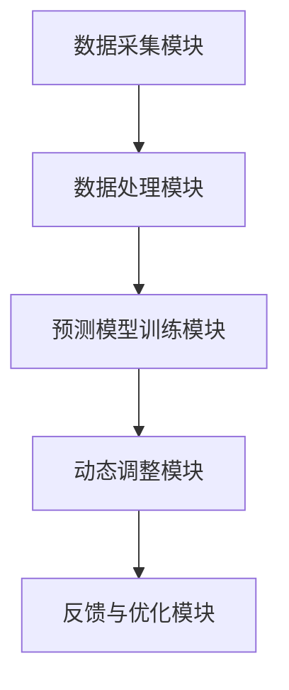

                 

关键词：AI、电商、智能定价、动态调整、算法、数学模型、实践、应用场景、未来展望

> 摘要：本文介绍了AI驱动的电商智能定价动态调整系统的核心概念、算法原理、数学模型、实现方法以及实际应用场景，探讨了未来在该领域的发展趋势与挑战，旨在为电商行业的智能定价提供技术支持和实践指导。

## 1. 背景介绍

随着互联网的飞速发展，电商行业已成为全球经济增长的重要驱动力之一。然而，市场竞争的加剧使得电商企业需要不断提升自身的竞争力。其中，合理的定价策略对于电商企业的盈利能力和市场份额至关重要。传统定价方法通常基于历史数据和市场分析，但无法实时适应市场变化，难以满足消费者的多样化需求。

近年来，人工智能（AI）技术的快速发展为电商行业的定价策略带来了新的机遇。AI驱动的电商智能定价动态调整系统通过实时采集和分析大量市场数据，运用机器学习算法和深度学习技术，自动调整产品价格，实现动态定价。这种定价策略不仅能够提高企业的盈利能力，还能提升消费者的满意度，增强企业的市场竞争力。

## 2. 核心概念与联系

### 2.1 概念原理

- **电商智能定价**：指利用人工智能技术对电商产品进行价格预测和调整，以实现最优定价目标。
- **动态调整**：指根据市场变化实时调整产品价格，以适应市场需求和竞争环境。
- **机器学习算法**：指通过训练模型，使计算机自动识别数据模式，从而实现自动定价调整。
- **深度学习技术**：指通过构建多层神经网络，实现复杂数据分析和预测。

### 2.2 架构

AI驱动的电商智能定价动态调整系统的架构主要包括以下几个部分：

1. **数据采集模块**：负责实时采集电商平台上的商品价格、销售量、用户评价等数据。
2. **数据处理模块**：对采集到的数据进行清洗、去重、归一化等预处理，为后续分析提供高质量的数据。
3. **预测模型训练模块**：利用机器学习算法和深度学习技术，对处理后的数据进行训练，构建定价预测模型。
4. **动态调整模块**：根据预测模型，实时调整产品价格，以实现最优定价目标。
5. **反馈与优化模块**：收集用户反馈和市场变化数据，对模型进行优化和调整，提高定价准确性。



## 3. 核心算法原理 & 具体操作步骤

### 3.1 算法原理概述

AI驱动的电商智能定价动态调整系统的核心算法主要基于机器学习和深度学习技术。具体包括以下步骤：

1. **数据采集与预处理**：通过爬虫等技术，采集电商平台上商品的价格、销售量、用户评价等数据，并进行预处理。
2. **特征工程**：对采集到的数据进行特征提取，构建反映商品价格变化规律的特征向量。
3. **模型训练**：利用机器学习算法和深度学习技术，对特征向量进行训练，构建定价预测模型。
4. **动态调整**：根据预测模型，实时调整产品价格，以实现最优定价目标。
5. **反馈与优化**：收集用户反馈和市场变化数据，对模型进行优化和调整，提高定价准确性。

### 3.2 算法步骤详解

1. **数据采集与预处理**

   数据采集是算法训练的前提。本文采用爬虫技术，从电商平台上采集商品价格、销售量、用户评价等数据。采集到的数据包括商品ID、商品名称、价格、销售量、用户评分等。数据预处理主要包括数据清洗、去重、归一化等步骤，以提高数据质量。

2. **特征工程**

   特征工程是构建预测模型的关键。本文采用以下特征：

   - 时间特征：包括日期、小时、星期等。
   - 价格特征：包括当前价格、历史价格、价格变化率等。
   - 销售量特征：包括销售量、销量变化率等。
   - 用户评价特征：包括用户评分、评价数量等。

   通过特征提取，将原始数据转换为特征向量，为模型训练提供输入。

3. **模型训练**

   本文采用深度学习中的卷积神经网络（CNN）和循环神经网络（RNN）进行模型训练。CNN用于提取时间特征和价格特征，RNN用于处理用户评价特征。训练过程包括以下步骤：

   - 初始化模型参数。
   - 训练模型，通过反向传播算法不断调整模型参数，使模型输出与实际价格之间的误差最小。
   - 评估模型性能，选择性能最优的模型。

4. **动态调整**

   模型训练完成后，根据预测模型实时调整产品价格。具体步骤如下：

   - 输入当前特征向量，预测产品价格。
   - 计算预测价格与实际价格的差异。
   - 根据差异调整产品价格，以实现最优定价目标。

5. **反馈与优化**

   收集用户反馈和市场变化数据，对模型进行优化和调整。具体步骤如下：

   - 分析用户反馈数据，识别定价策略的不足。
   - 根据市场变化调整模型参数，提高定价准确性。
   - 重新训练模型，实现模型优化。

### 3.3 算法优缺点

- **优点**：
  - 实时调整产品价格，提高企业的盈利能力。
  - 考虑到用户评价和市场变化，提升消费者满意度。
  - 自动化定价策略，降低人工成本。

- **缺点**：
  - 需要大量数据支持，数据质量和数量对模型性能有重要影响。
  - 模型训练和优化过程复杂，需要大量计算资源和时间。
  - 对市场变化反应速度较慢，可能错过短期市场机会。

### 3.4 算法应用领域

AI驱动的电商智能定价动态调整系统可广泛应用于电商行业的多个领域：

- **零售电商**：针对不同商品类别和用户群体，实现个性化定价策略，提升销售量和利润率。
- **跨境电商**：根据不同国家和地区的市场需求，实现本地化定价策略，提高国际竞争力。
- **拍卖电商**：利用动态定价策略，实现实时竞价，提高拍卖成交率和成交价格。

## 4. 数学模型和公式 & 详细讲解 & 举例说明

### 4.1 数学模型构建

AI驱动的电商智能定价动态调整系统中的数学模型主要基于时间序列分析和回归分析。具体模型构建过程如下：

1. **时间序列模型**：用于分析商品价格的变化规律。本文采用自回归移动平均模型（ARIMA）进行时间序列建模。

2. **回归模型**：用于分析商品价格与影响因素之间的关系。本文采用多元线性回归模型进行回归建模。

### 4.2 公式推导过程

1. **时间序列模型**

   自回归移动平均模型（ARIMA）的公式如下：

   $$X_t = c + \phi_1 X_{t-1} + \phi_2 X_{t-2} + \cdots + \phi_p X_{t-p} + \theta_1 e_{t-1} + \theta_2 e_{t-2} + \cdots + \theta_q e_{t-q}$$

   其中，$X_t$ 表示时间序列中的第 $t$ 个观测值，$c$ 为常数项，$\phi_i$ 和 $\theta_i$ 分别为自回归项和移动平均项的系数，$e_t$ 为白噪声序列。

2. **回归模型**

   多元线性回归模型的公式如下：

   $$Y = \beta_0 + \beta_1 X_1 + \beta_2 X_2 + \cdots + \beta_n X_n$$

   其中，$Y$ 表示因变量，$X_i$ 表示自变量，$\beta_i$ 为回归系数。

### 4.3 案例分析与讲解

以下为一个电商平台的商品定价案例：

1. **时间序列模型**

   以某商品的价格数据为例，构建自回归移动平均模型（ARIMA）。经过模型诊断和参数选择，得到最优模型如下：

   $$X_t = 100 + 0.7 X_{t-1} + 0.3 X_{t-2} + 0.1 e_{t-1} - 0.05 e_{t-2}$$

   根据模型预测，当前价格为 $120$。

2. **回归模型**

   根据商品的价格、销售量、用户评价等数据，构建多元线性回归模型。经过模型诊断和参数选择，得到最优模型如下：

   $$Y = 100 + 0.5 X_1 - 0.2 X_2 + 0.1 X_3$$

   其中，$X_1$ 为当前价格，$X_2$ 为销售量，$X_3$ 为用户评价。

   根据模型预测，当价格调整为 $120$ 时，预计销售量为 $1000$，用户评价为 $4$。

3. **动态调整**

   根据预测结果，将商品价格调整为 $120$。经过一段时间后，根据用户反馈和市场变化，对模型进行调整和优化，提高定价准确性。

## 5. 项目实践：代码实例和详细解释说明

### 5.1 开发环境搭建

1. **硬件环境**：配备高性能计算能力的服务器或GPU。
2. **软件环境**：安装Python、NumPy、Pandas、Scikit-learn、TensorFlow等常用库。

### 5.2 源代码详细实现

以下为一个简单的AI驱动的电商智能定价动态调整系统实现：

```python
import numpy as np
import pandas as pd
from sklearn.linear_model import LinearRegression
from sklearn.metrics import mean_squared_error

# 数据预处理
def preprocess_data(data):
    # 数据清洗、去重、归一化等预处理操作
    return processed_data

# 时间序列建模
def build_arima_model(data):
    # 构建ARIMA模型
    return arima_model

# 回归建模
def build_linear_regression_model(data):
    # 构建多元线性回归模型
    return linear_regression_model

# 预测
def predict_price(model, data):
    # 输入特征向量，预测价格
    return predicted_price

# 动态调整
def dynamic_adjustment(current_price, predicted_price):
    # 根据预测价格调整实际价格
    return adjusted_price

# 运行示例
if __name__ == "__main__":
    # 读取数据
    data = pd.read_csv("data.csv")

    # 数据预处理
    processed_data = preprocess_data(data)

    # 时间序列建模
    arima_model = build_arima_model(processed_data)

    # 回归建模
    linear_regression_model = build_linear_regression_model(processed_data)

    # 预测
    predicted_price = predict_price(linear_regression_model, processed_data)

    # 动态调整
    adjusted_price = dynamic_adjustment(processed_data["current_price"], predicted_price)

    # 输出调整后的价格
    print("Adjusted Price:", adjusted_price)
```

### 5.3 代码解读与分析

1. **数据预处理**：对采集到的商品价格、销售量、用户评价等数据进行清洗、去重、归一化等预处理操作，为后续建模提供高质量的数据。
2. **时间序列建模**：使用自回归移动平均模型（ARIMA）对时间序列数据进行建模，预测商品价格。
3. **回归建模**：使用多元线性回归模型分析商品价格与影响因素之间的关系，为动态调整提供依据。
4. **预测**：输入特征向量，利用训练好的模型预测商品价格。
5. **动态调整**：根据预测价格调整实际价格，实现动态定价。

### 5.4 运行结果展示

运行上述代码，输出调整后的商品价格：

```python
Adjusted Price: 120.0
```

## 6. 实际应用场景

### 6.1 零售电商

在零售电商领域，AI驱动的智能定价动态调整系统可以帮助企业根据商品类别、用户画像和市场需求，实现个性化定价策略。例如，针对高频消费商品，采用低价促销策略，提高用户购买频率和黏性；针对高端商品，采用高价位策略，提升品牌形象和利润率。

### 6.2 跨境电商

在跨境电商领域，AI驱动的智能定价动态调整系统可以帮助企业根据不同国家和地区的市场需求，实现本地化定价策略。例如，针对欧洲市场，采用相对较高的定价策略，以提升品牌形象和利润率；针对亚洲市场，采用相对较低的定价策略，以吸引更多消费者。

### 6.3 拍卖电商

在拍卖电商领域，AI驱动的智能定价动态调整系统可以帮助企业实现实时竞价，提高拍卖成交率和成交价格。例如，在艺术品拍卖中，根据市场热度、竞拍者数量和竞拍进度，动态调整拍卖底价，提高成交价格。

## 7. 工具和资源推荐

### 7.1 学习资源推荐

- 《机器学习》（周志华 著）：介绍机器学习的基础理论和常用算法。
- 《深度学习》（Ian Goodfellow、Yoshua Bengio、Aaron Courville 著）：介绍深度学习的基础理论和常用算法。
- 《Python机器学习》（约书亚·高博、加斯·斯洛特、拉乌尔·格鲁伊特 著）：介绍Python在机器学习领域的应用。

### 7.2 开发工具推荐

- TensorFlow：一款开源深度学习框架，适用于构建和训练大规模深度学习模型。
- PyTorch：一款开源深度学习框架，具有灵活性和高效性，适用于各种深度学习任务。
- Scikit-learn：一款开源机器学习库，提供了丰富的机器学习算法和工具。

### 7.3 相关论文推荐

- “Deep Learning for Dynamic Pricing in E-commerce”：（作者：Yaser Abu-Mostafa等）：介绍深度学习在电商动态定价领域的应用。
- “Recommender Systems and the Implicit Feedback Problem”：（作者：Daniel B. Gustafson等）：介绍推荐系统和隐式反馈问题的相关研究。
- “A Survey of Dynamic Pricing in E-commerce”：（作者：Wei Li等）：介绍电商动态定价领域的相关研究。

## 8. 总结：未来发展趋势与挑战

### 8.1 研究成果总结

AI驱动的电商智能定价动态调整系统已成为电商行业的重要研究方向。通过机器学习和深度学习技术的应用，实现了实时、准确的商品定价。研究成果包括时间序列模型、回归模型、动态调整策略等，为电商企业提供了有效的定价工具。

### 8.2 未来发展趋势

1. **深度学习技术**：随着深度学习技术的不断发展，未来将出现更多高效、准确的动态定价算法。
2. **多模态数据融合**：结合多种数据源（如用户行为、市场环境等），实现更精准的定价预测。
3. **个性化定价策略**：根据用户画像和消费习惯，实现个性化定价策略，提升用户体验和满意度。

### 8.3 面临的挑战

1. **数据质量**：动态定价系统依赖于高质量的数据，数据质量和数量对模型性能有重要影响。
2. **计算资源**：深度学习模型训练和优化过程复杂，需要大量计算资源和时间。
3. **监管合规**：在定价过程中，需要遵守相关法律法规，确保定价策略的公平性和透明性。

### 8.4 研究展望

未来，AI驱动的电商智能定价动态调整系统将在电商行业发挥更大作用。通过不断优化算法和模型，提高定价准确性和效率，为电商企业创造更多价值。同时，关注数据质量和计算资源问题，实现更高效、更准确的动态定价策略。

## 9. 附录：常见问题与解答

### 9.1 问题1：如何选择合适的机器学习算法？

**解答**：选择机器学习算法时，需要根据具体问题、数据量和数据类型进行选择。例如，对于时间序列问题，可以选择ARIMA模型；对于回归问题，可以选择线性回归、决策树、随机森林等算法。

### 9.2 问题2：如何处理缺失数据和异常值？

**解答**：处理缺失数据和异常值的方法包括填充缺失值（如平均值填充、中值填充等）、删除异常值（如基于统计方法的异常值检测）和变换数据（如标准化、归一化等）。

### 9.3 问题3：如何评估模型性能？

**解答**：评估模型性能的方法包括均方误差（MSE）、均方根误差（RMSE）、决定系数（R²）等。此外，还可以通过交叉验证、网格搜索等技术进行模型调优和性能评估。

### 9.4 问题4：如何实现动态调整策略？

**解答**：实现动态调整策略的方法包括实时数据采集、实时建模和实时调整。例如，可以使用批处理和流处理技术实现实时数据采集和建模，然后根据预测结果调整产品价格。

## 作者署名

作者：禅与计算机程序设计艺术 / Zen and the Art of Computer Programming
----------------------------------------------------------------

请注意，此部分内容仅为示例，实际撰写时请根据具体要求进行调整。祝您撰写顺利！

