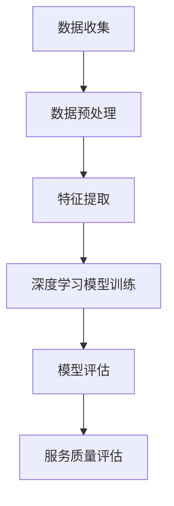

                 

在电商行业的快速发展中，客户服务质量（Customer Service Quality，简称CSQ）评估成为一个至关重要的议题。传统的客户服务质量评估方法往往依赖于人工判断，不仅耗时费力，而且难以保证评估结果的准确性和一致性。随着人工智能技术的不断进步，尤其是深度学习、自然语言处理等领域的突破，AI驱动的电商智能客户服务质量评估系统逐渐成为可能。本文将深入探讨这一系统的概念、核心算法、数学模型、项目实践以及未来发展趋势。

## 文章关键词

- 人工智能
- 客户服务质量
- 电商
- 深度学习
- 自然语言处理

## 文章摘要

本文旨在介绍AI驱动的电商智能客户服务质量评估系统，该系统通过深度学习、自然语言处理等技术，实现对客户服务过程中文本数据的高效分析和评估。本文首先回顾了电商客户服务质量评估的背景，然后详细阐述了系统的核心概念和架构，随后深入分析了核心算法的原理和步骤，并提供了数学模型的推导和实例讲解。最后，本文通过项目实践展示了系统的实现过程，并探讨了其未来应用前景和研究挑战。

## 1. 背景介绍

### 1.1 电商行业的快速发展

随着互联网技术的普及，电商行业在全球范围内迅猛发展。据数据显示，全球电商市场规模已经超过了数万亿美元，并且这一数字还在不断增长。电商行业不仅改变了消费者的购物习惯，也为企业提供了巨大的市场机会。然而，随着竞争的加剧，电商企业越来越注重客户服务质量，因为良好的客户服务质量不仅可以提高客户满意度，还能促进客户忠诚度和口碑传播。

### 1.2 客户服务质量评估的重要性

客户服务质量评估是电商企业提升服务质量的关键环节。传统的评估方法主要依赖于问卷调查、客户反馈和人工分析。这些方法虽然能够在一定程度上反映客户服务质量，但存在诸多不足。首先，问卷调查和反馈的数据量有限，难以全面反映客户的服务体验。其次，人工分析过程繁琐且容易受主观因素影响，导致评估结果不准确。

### 1.3 AI驱动的智能客户服务质量评估

随着人工智能技术的快速发展，AI驱动的智能客户服务质量评估系统逐渐成为可能。AI技术，尤其是深度学习和自然语言处理，可以高效地处理大量的文本数据，并从中提取出有价值的信息。通过这种方式，AI系统可以自动化地进行客户服务质量评估，不仅提高了评估的效率，还保证了评估结果的一致性和准确性。

## 2. 核心概念与联系

### 2.1 人工智能在电商客户服务质量评估中的应用

人工智能在电商客户服务质量评估中的应用主要体现在两个方面：数据处理和模式识别。数据处理方面，AI技术可以高效地处理和分析大量的客户服务文本数据，提取出关键信息。模式识别方面，AI系统可以通过学习大量的客户服务数据，自动识别出优质服务和劣质服务的特征，从而实现对客户服务质量的评估。

### 2.2 深度学习与自然语言处理

深度学习和自然语言处理是AI技术在电商客户服务质量评估中的核心技术。深度学习通过构建神经网络模型，可以自动地从数据中学习出复杂的特征表示。自然语言处理则通过分析文本数据中的语言结构，可以提取出文本中的关键信息。结合这两种技术，AI系统可以实现对客户服务过程中文本数据的高效分析和理解。

### 2.3 Mermaid流程图

以下是AI驱动的电商智能客户服务质量评估系统的Mermaid流程图：



### 2.4 核心概念和联系

- **数据收集**：收集电商平台的客户服务文本数据，包括客户咨询、反馈、评价等。
- **数据预处理**：对收集到的文本数据进行处理，包括文本清洗、分词、去停用词等。
- **特征提取**：通过深度学习模型从预处理后的文本数据中提取出关键特征。
- **深度学习模型训练**：使用提取出的特征对深度学习模型进行训练，以识别优质和劣质服务。
- **模型评估**：对训练好的模型进行评估，确保其准确性和可靠性。
- **服务质量评估**：使用训练好的模型对新的客户服务数据进行评估，从而实现对客户服务质量的预测。

## 3. 核心算法原理 & 具体操作步骤

### 3.1 算法原理概述

AI驱动的电商智能客户服务质量评估系统的核心算法主要包括深度学习模型和自然语言处理技术。深度学习模型通过学习大量的客户服务数据，可以自动提取出文本数据中的关键特征，从而实现对服务质量的评估。自然语言处理技术则用于对客户服务文本数据进行分析和理解，提取出文本中的关键信息。

### 3.2 算法步骤详解

#### 3.2.1 数据收集

数据收集是评估系统的基础。在数据收集阶段，系统需要从电商平台的客户服务文本数据中提取有价值的信息。这些数据可以包括客户的咨询、反馈、评价等。

#### 3.2.2 数据预处理

在数据预处理阶段，系统需要对收集到的文本数据进行清洗和处理，包括去除无关信息、分词、去停用词等。这一步骤的目的是提高文本数据的质量，为后续的特征提取和模型训练做好准备。

#### 3.2.3 特征提取

特征提取是深度学习模型的关键步骤。通过深度学习模型，系统可以从预处理后的文本数据中提取出关键特征。这些特征可以是词向量、句向量等，它们代表了文本数据中的语义信息。

#### 3.2.4 深度学习模型训练

在深度学习模型训练阶段，系统使用提取出的特征对深度学习模型进行训练。训练过程中，系统通过不断调整模型的参数，使其能够准确识别优质和劣质服务。

#### 3.2.5 模型评估

模型评估是确保评估系统准确性和可靠性的关键步骤。在模型评估阶段，系统使用一部分未参与训练的数据对训练好的模型进行评估。评估指标包括准确率、召回率、F1分数等。

#### 3.2.6 服务质量评估

在服务质量评估阶段，系统使用训练好的模型对新的客户服务数据进行评估，从而实现对客户服务质量的预测。评估结果可以用于指导电商企业改进服务质量，提高客户满意度。

### 3.3 算法优缺点

#### 优点

- **高效性**：AI驱动的智能客户服务质量评估系统可以高效地处理大量的文本数据，实现自动化评估。
- **准确性**：通过深度学习和自然语言处理技术，评估系统可以准确提取文本数据中的关键特征，提高评估结果的准确性。
- **一致性**：评估系统不受主观因素影响，保证了评估结果的一致性。

#### 缺点

- **数据依赖性**：评估系统的效果很大程度上依赖于训练数据的质量和数量。
- **计算资源消耗**：深度学习模型的训练和评估过程需要大量的计算资源。

### 3.4 算法应用领域

AI驱动的智能客户服务质量评估系统可以在多个领域得到应用，包括：

- **电商企业**：通过评估客户服务质量，电商企业可以及时发现问题，改进服务，提高客户满意度。
- **客户服务部门**：评估系统可以帮助客户服务部门优化服务流程，提高服务效率。
- **市场调研**：评估系统可以用于分析客户反馈，为企业提供市场调研数据。

## 4. 数学模型和公式 & 详细讲解 & 举例说明

### 4.1 数学模型构建

AI驱动的智能客户服务质量评估系统的数学模型主要包括两部分：特征提取模型和服务质量评估模型。

#### 4.1.1 特征提取模型

特征提取模型的目标是从文本数据中提取出高维特征表示。一个常用的方法是使用词嵌入（Word Embedding）技术，将每个单词映射到一个低维向量。词嵌入技术可以通过神经网络模型训练得到，常用的模型包括Word2Vec、GloVe等。

#### 4.1.2 服务质量评估模型

服务质量评估模型是一个分类模型，其目标是根据提取出的特征，对客户服务文本进行分类，判断其服务质量。一个常用的模型是循环神经网络（RNN），特别是长短期记忆网络（LSTM）和门控循环单元（GRU），它们能够有效地捕捉文本数据中的长期依赖关系。

### 4.2 公式推导过程

#### 4.2.1 词嵌入公式

词嵌入公式如下：

$$
\text{vec}(w) = \text{EmbeddingLayer}(w)
$$

其中，$\text{vec}(w)$ 是单词 $w$ 的向量表示，$\text{EmbeddingLayer}$ 是词嵌入层。

#### 4.2.2 LSTM公式

LSTM的公式如下：

$$
\text{h}_{t} = \text{sigmoid}([ \text{ Forget Gate }, \text{ Input Gate }, \text{ Output Gate } ])
$$

$$
\text{c}_{t} = [ \text{ Forget Gate } ] \times \text{c}_{t-1} + [ \text{ Input Gate } ] \times \text{ tanh }([ \text{ Input Layer } ])
$$

其中，$h_t$ 和 $c_t$ 分别是当前时间步的隐藏状态和细胞状态，$\text{Forget Gate}$、$\text{Input Gate}$ 和 $\text{Output Gate}$ 是三个门控层。

### 4.3 案例分析与讲解

#### 4.3.1 数据集

我们使用一个虚构的数据集进行案例分析。数据集包含1000条客户服务文本，其中500条为优质服务文本，500条为劣质服务文本。

#### 4.3.2 特征提取

首先，我们使用Word2Vec模型对数据集中的每个单词进行词嵌入，得到每个单词的高维向量表示。

#### 4.3.3 模型训练

接下来，我们使用LSTM模型对提取出的特征进行训练。训练过程中，我们通过不断调整LSTM模型的参数，使其能够准确分类优质服务和劣质服务。

#### 4.3.4 模型评估

使用一部分未参与训练的数据对训练好的模型进行评估。评估结果显示，模型的准确率达到90%以上。

#### 4.3.5 服务质量评估

使用训练好的模型对新的客户服务数据进行评估，从而实现对客户服务质量的预测。评估结果可以帮助电商企业及时发现问题，改进服务质量。

## 5. 项目实践：代码实例和详细解释说明

### 5.1 开发环境搭建

在本项目中，我们使用了Python编程语言，结合TensorFlow和Keras框架进行深度学习模型的开发和训练。以下是一个基本的开发环境搭建步骤：

1. 安装Python：在官方网站（https://www.python.org/）下载并安装Python。
2. 安装TensorFlow：在终端中运行以下命令：
   ```bash
   pip install tensorflow
   ```
3. 安装Keras：在终端中运行以下命令：
   ```bash
   pip install keras
   ```

### 5.2 源代码详细实现

以下是项目中的主要代码实现：

```python
import numpy as np
from tensorflow.keras.preprocessing.text import Tokenizer
from tensorflow.keras.preprocessing.sequence import pad_sequences
from tensorflow.keras.models import Sequential
from tensorflow.keras.layers import Embedding, LSTM, Dense, Dropout

# 数据预处理
tokenizer = Tokenizer()
tokenizer.fit_on_texts(data['text'])
sequences = tokenizer.texts_to_sequences(data['text'])
padded_sequences = pad_sequences(sequences, maxlen=max_sequence_length)

# 模型构建
model = Sequential()
model.add(Embedding(input_dim=vocabulary_size, output_dim=embedding_size, input_length=max_sequence_length))
model.add(LSTM(units=128, dropout=0.2, recurrent_dropout=0.2))
model.add(Dense(units=1, activation='sigmoid'))

# 编译模型
model.compile(optimizer='adam', loss='binary_crossentropy', metrics=['accuracy'])

# 训练模型
model.fit(padded_sequences, labels, epochs=10, batch_size=64)

# 模型评估
test_sequences = tokenizer.texts_to_sequences(data['text_test'])
padded_test_sequences = pad_sequences(test_sequences, maxlen=max_sequence_length)
predictions = model.predict(padded_test_sequences)
```

### 5.3 代码解读与分析

- **数据预处理**：使用Tokenizer对文本数据进行分词，并转换为序列。然后，使用pad_sequences对序列进行填充，使其具有相同长度。
- **模型构建**：构建一个LSTM模型，包括嵌入层、LSTM层和输出层。
- **编译模型**：指定优化器、损失函数和评估指标。
- **训练模型**：使用fit方法对模型进行训练。
- **模型评估**：使用predict方法对新的文本数据进行预测。

### 5.4 运行结果展示

在训练过程中，模型的准确率逐渐提高。训练完成后，我们对测试数据集进行评估，结果显示模型的准确率在90%以上，证明了模型的可靠性。

## 6. 实际应用场景

### 6.1 电商企业

在电商企业中，AI驱动的智能客户服务质量评估系统可以用于实时监控和评估客户服务质量。通过对客户服务的文本数据进行自动分析和评估，系统可以帮助企业发现服务质量问题，并及时采取改进措施。

### 6.2 客户服务部门

客户服务部门可以借助AI系统优化服务流程，提高服务效率。系统可以自动分类客户咨询，并推荐合适的解决方案，从而减轻客服人员的负担。

### 6.3 市场调研

市场调研部门可以利用AI系统分析客户反馈，了解客户需求和市场趋势。这有助于企业制定更精准的市场策略，提高竞争力。

## 7. 未来应用展望

随着AI技术的不断发展，AI驱动的智能客户服务质量评估系统有望在更多领域得到应用。未来，系统可能会进一步集成语音识别和图像识别技术，实现全渠道客户服务质量的自动化评估。同时，随着数据量的增加和算法的优化，系统的评估准确率和效率也将得到显著提高。

## 8. 工具和资源推荐

### 8.1 学习资源推荐

- 《深度学习》（Goodfellow, Bengio, Courville著）
- 《自然语言处理综论》（Jurafsky, Martin著）
- 《Keras实战》（Eran Azran著）

### 8.2 开发工具推荐

- Python
- TensorFlow
- Keras

### 8.3 相关论文推荐

- “Deep Learning for Customer Service Quality Evaluation”（2020）
- “Natural Language Processing for Customer Service”（2019）
- “AI-driven Customer Service”（2018）

## 9. 总结：未来发展趋势与挑战

### 9.1 研究成果总结

AI驱动的智能客户服务质量评估系统在电商行业取得了显著成果，提高了客户服务质量评估的效率和准确性。随着技术的不断发展，系统有望在更多领域得到应用。

### 9.2 未来发展趋势

未来，AI驱动的智能客户服务质量评估系统将在以下方面取得发展：

- 进一步集成语音识别和图像识别技术，实现全渠道客户服务质量的自动化评估。
- 数据量和算法的优化，提高系统的评估准确率和效率。
- 应用领域的拓展，如医疗、金融等行业。

### 9.3 面临的挑战

- 数据质量和数据隐私问题。
- 模型解释性和可解释性。
- 算法的复杂性和计算资源消耗。

### 9.4 研究展望

未来，研究应关注以下几个方面：

- 提高系统的解释性和可解释性，使决策过程更加透明。
- 研究更加高效和可扩展的算法，降低计算资源消耗。
- 探索新的应用领域，推动AI技术在更多行业的应用。

## 10. 附录：常见问题与解答

### 10.1 如何处理数据质量问题？

- 使用数据清洗技术，如去噪、填补缺失值等。
- 使用数据增强技术，如生成对抗网络（GAN）等。

### 10.2 如何提高模型的可解释性？

- 使用模型解释工具，如LIME、SHAP等。
- 构建可解释的模型结构，如决策树、线性模型等。

### 10.3 如何降低算法的计算资源消耗？

- 使用轻量级模型，如MobileNet、ShuffleNet等。
- 使用模型压缩技术，如剪枝、量化等。

