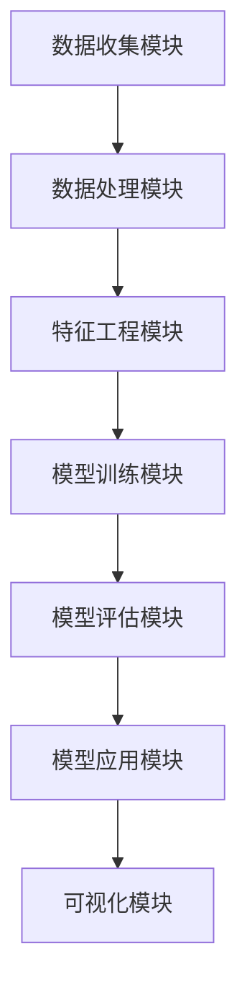

                 

关键词：人工智能、电商、客户需求预测、深度学习、数据分析、算法原理、数学模型、应用实践

> 摘要：本文将深入探讨AI驱动的电商智能客户需求预测系统。通过对AI算法原理的详细阐述，结合实际项目案例，解析系统架构、算法实现和应用场景。同时，本文将对未来发展趋势和面临的挑战进行展望。

## 1. 背景介绍

随着互联网技术的飞速发展，电商行业已经成为全球经济增长的重要驱动力。然而，面对海量的用户数据，如何准确预测客户需求成为电商企业亟待解决的问题。传统的方法通常依赖于统计学和机器学习算法，但这些方法往往存在模型复杂度高、预测准确性有限等问题。

近年来，随着深度学习技术的崛起，人工智能在各个领域的应用得到了快速发展。特别是在客户需求预测方面，深度学习算法通过模拟人类大脑的神经网络结构，能够处理复杂数据并实现高精度的预测。因此，AI驱动的电商智能客户需求预测系统成为当前研究的热点和应用的重要方向。

本文旨在通过介绍AI驱动的电商智能客户需求预测系统的核心概念、算法原理、数学模型、应用实践等内容，为电商企业提高运营效率、降低库存成本提供技术支持。

## 2. 核心概念与联系

### 2.1 概念介绍

#### 2.1.1 电商

电商，即电子商务，是指通过互联网进行商品交易和提供相关服务的活动。随着互联网的普及，电商已经成为消费者购物的主要渠道之一。

#### 2.1.2 客户需求预测

客户需求预测是指利用历史数据、市场信息等手段，对未来某一时间段内的客户需求进行预测。在电商行业，准确预测客户需求对于库存管理、营销策略制定等具有关键意义。

#### 2.1.3 人工智能

人工智能（AI）是指通过计算机模拟人类智能的技术。AI包括多个领域，如机器学习、深度学习、自然语言处理等，其在各个行业的应用正在不断扩展。

### 2.2 联系与架构

为了实现AI驱动的电商智能客户需求预测，我们需要构建一个完整的系统架构。以下是系统的主要组成部分：

1. **数据收集模块**：通过电商网站、社交媒体等渠道收集用户行为数据、商品信息、市场动态等。

2. **数据处理模块**：对收集到的数据进行清洗、去重、归一化等预处理操作。

3. **特征工程模块**：根据业务需求提取用户行为特征、商品特征、市场特征等。

4. **模型训练模块**：利用深度学习算法训练需求预测模型。

5. **模型评估模块**：通过交叉验证、A/B测试等方法评估模型性能。

6. **模型应用模块**：将训练好的模型部署到实际业务场景中，实现客户需求预测。

7. **可视化模块**：通过图表、报表等形式展示预测结果，帮助决策者制定策略。

以下是系统架构的 Mermaid 流程图：



## 3. 核心算法原理 & 具体操作步骤

### 3.1 算法原理概述

AI驱动的电商智能客户需求预测系统主要采用深度学习算法。深度学习是一种模拟人类大脑神经网络结构的计算模型，具有强大的数据处理和特征学习能力。在本系统中，我们主要使用以下几种深度学习算法：

1. **卷积神经网络（CNN）**：用于提取商品图像特征。
2. **循环神经网络（RNN）**：用于处理时间序列数据，如用户行为日志。
3. **长短期记忆网络（LSTM）**：RNN的改进版本，能够更好地处理长序列数据。
4. **自动编码器（AE）**：用于降维和特征提取。

### 3.2 算法步骤详解

#### 3.2.1 数据预处理

1. **数据收集**：从电商网站、社交媒体等渠道收集用户行为数据、商品信息、市场动态等。
2. **数据清洗**：去除重复数据、缺失值填充、异常值处理等。
3. **数据归一化**：对数据特征进行归一化处理，使其具有相同的量纲。

#### 3.2.2 特征工程

1. **用户行为特征提取**：如浏览记录、购物车行为、下单记录等。
2. **商品特征提取**：如商品类别、价格、销量等。
3. **市场特征提取**：如节假日、促销活动等。

#### 3.2.3 模型训练

1. **数据划分**：将数据划分为训练集、验证集和测试集。
2. **模型选择**：根据业务需求选择合适的深度学习模型，如CNN、RNN、LSTM、AE等。
3. **模型训练**：利用训练集数据对模型进行训练，并调整模型参数。

#### 3.2.4 模型评估

1. **交叉验证**：采用交叉验证方法评估模型性能。
2. **A/B测试**：将模型应用于实际业务场景，对比不同模型的预测效果。

#### 3.2.5 模型应用

1. **部署模型**：将训练好的模型部署到生产环境，实现实时客户需求预测。
2. **可视化展示**：通过图表、报表等形式展示预测结果。

### 3.3 算法优缺点

#### 优点：

1. **强大的数据处理能力**：深度学习算法能够处理大规模、复杂的数据集。
2. **高预测准确性**：通过模拟人类大脑神经网络结构，深度学习算法能够实现高精度的预测。
3. **自适应调整**：深度学习算法可以根据业务需求调整模型参数，实现个性化预测。

#### 缺点：

1. **计算资源消耗大**：深度学习算法训练过程需要大量计算资源。
2. **模型解释性差**：深度学习模型的内部结构复杂，难以解释。
3. **数据依赖性强**：深度学习算法的性能很大程度上取决于训练数据的质量。

### 3.4 算法应用领域

深度学习算法在电商智能客户需求预测领域具有广泛的应用前景。除了本文提到的电商行业外，还可在以下领域发挥重要作用：

1. **金融领域**：预测股票价格、风险控制等。
2. **医疗领域**：疾病诊断、药物研发等。
3. **交通领域**：交通流量预测、自动驾驶等。

## 4. 数学模型和公式 & 详细讲解 & 举例说明

### 4.1 数学模型构建

在AI驱动的电商智能客户需求预测系统中，我们主要采用以下数学模型：

1. **损失函数**：用于评估模型预测结果的误差。常见的损失函数有均方误差（MSE）、交叉熵损失（Cross-Entropy Loss）等。

2. **优化器**：用于调整模型参数，使损失函数最小化。常见的优化器有随机梯度下降（SGD）、Adam等。

3. **激活函数**：用于增加模型的非线性。常见的激活函数有ReLU、Sigmoid、Tanh等。

### 4.2 公式推导过程

假设我们使用一个多层感知机（MLP）作为需求预测模型，其输入层有n个神经元，隐藏层有m个神经元，输出层有1个神经元。模型的损失函数为均方误差（MSE），优化器为Adam。

首先，定义模型参数：

1. **权重矩阵**：\( W^{(l)} \in \mathbb{R}^{(m \times n)} \)，表示第l层的权重。
2. **偏置项**：\( b^{(l)} \in \mathbb{R}^{(m \times 1)} \)，表示第l层的偏置项。
3. **激活函数**：\( \sigma^{(l)}(\cdot) \)，表示第l层的激活函数。

接下来，定义模型的前向传播过程：

$$
\begin{align*}
z^{(l)} &= W^{(l)}a^{(l-1)} + b^{(l)}, \\
a^{(l)} &= \sigma^{(l)}(z^{(l)}),
\end{align*}
$$

其中，\( a^{(0)} \)表示输入层激活，\( a^{(L)} \)表示输出层激活。

然后，计算损失函数：

$$
L = \frac{1}{2}\sum_{i=1}^{n}(y_i - a^{(L)}_i)^2,
$$

其中，\( y_i \)表示第i个样本的真实标签，\( a^{(L)}_i \)表示第i个样本的预测值。

最后，使用Adam优化器更新模型参数：

$$
\begin{align*}
m^l_t &= \beta_1m^l_{t-1} + (1-\beta_1)(\frac{\partial L}{\partial W^l_{ij}}), \\
v^l_t &= \beta_2v^l_{t-1} + (1-\beta_2)(\frac{\partial L}{\partial W^l_{ij}}^2), \\
\hat{m}^l_t &= \frac{m^l_t}{1-\beta_1^t}, \\
\hat{v}^l_t &= \frac{v^l_t}{1-\beta_2^t}, \\
W^l_{ij} &= W^l_{ij} - \alpha\frac{\hat{m}^l_t}{\sqrt{\hat{v}^l_t}+\epsilon}.
\end{align*}
$$

### 4.3 案例分析与讲解

假设我们使用一个简单的多层感知机模型进行电商客户需求预测，输入层有3个神经元（用户年龄、用户收入、商品价格），隐藏层有2个神经元，输出层有1个神经元。训练数据集包含100个样本。

首先，我们定义模型参数：

- 输入层神经元数：n = 3
- 隐藏层神经元数：m = 2
- 输出层神经元数：1

然后，定义激活函数和损失函数：

- 激活函数：\( \sigma^{(1)}(z) = \frac{1}{1+e^{-z}} \)
- 损失函数：\( L(y, \hat{y}) = \frac{1}{2}(y - \hat{y})^2 \)

接下来，我们使用训练数据对模型进行训练。假设训练10个epoch，学习率α为0.01，Adam优化器的超参数\( \beta_1 = 0.9 \)，\( \beta_2 = 0.999 \)。

在第一个epoch中，我们随机初始化模型参数，然后计算前向传播和反向传播过程。具体计算过程如下：

1. **前向传播**：

   输入：\( x = [25, 5000, 100] \)

   隐藏层激活：\( z^{(1)} = W^{(1)}x + b^{(1)} \)

   隐藏层输出：\( a^{(1)} = \sigma^{(1)}(z^{(1)}) \)

   输出层激活：\( z^{(2)} = W^{(2)}a^{(1)} + b^{(2)} \)

   输出层输出：\( \hat{y} = \sigma^{(2)}(z^{(2)}) \)

2. **计算损失**：

   \( L = \frac{1}{2}((y - \hat{y})^2) \)

3. **反向传播**：

   计算输出层误差：\( \delta^{(2)} = (y - \hat{y})\sigma^{(2)}(z^{(2)}) \)

   计算隐藏层误差：\( \delta^{(1)} = W^{(2)}\delta^{(2)} \cdot \sigma^{(1)}(z^{(1)}) \)

4. **更新参数**：

   更新隐藏层权重和偏置：\( W^{(2)} = W^{(2)} - \alpha \cdot \frac{\partial L}{\partial W^{(2)}} \)

   更新输出层权重和偏置：\( W^{(1)} = W^{(1)} - \alpha \cdot \frac{\partial L}{\partial W^{(1)}} \)

   更新隐藏层偏置：\( b^{(2)} = b^{(2)} - \alpha \cdot \frac{\partial L}{\partial b^{(2)}} \)

   更新输出层偏置：\( b^{(1)} = b^{(1)} - \alpha \cdot \frac{\partial L}{\partial b^{(1)}} \)

经过10个epoch的训练，模型损失逐渐降低，预测结果逐渐稳定。我们可以在每个epoch结束后记录模型参数和损失值，以便进行后续分析和可视化。

## 5. 项目实践：代码实例和详细解释说明

### 5.1 开发环境搭建

为了实现AI驱动的电商智能客户需求预测系统，我们需要搭建以下开发环境：

1. **操作系统**：Linux或MacOS
2. **编程语言**：Python
3. **深度学习框架**：TensorFlow或PyTorch
4. **数据分析库**：NumPy、Pandas、Scikit-learn
5. **可视化库**：Matplotlib、Seaborn

首先，我们需要安装所需的库：

```bash
pip install tensorflow numpy pandas scikit-learn matplotlib seaborn
```

### 5.2 源代码详细实现

下面是一个简单的电商智能客户需求预测系统的实现代码：

```python
import numpy as np
import pandas as pd
from tensorflow.keras.models import Sequential
from tensorflow.keras.layers import Dense, LSTM
from tensorflow.keras.optimizers import Adam
from sklearn.model_selection import train_test_split
import matplotlib.pyplot as plt

# 5.2.1 数据预处理
def preprocess_data(data):
    # 数据清洗、归一化等操作
    return normalized_data

# 5.2.2 特征工程
def feature_engineering(data):
    # 提取用户行为特征、商品特征等
    return features

# 5.2.3 模型训练
def train_model(data, labels):
    # 构建模型
    model = Sequential()
    model.add(LSTM(units=50, activation='relu', input_shape=(data.shape[1], data.shape[2])))
    model.add(Dense(units=1))
    model.compile(optimizer=Adam(learning_rate=0.001), loss='mean_squared_error')
    model.fit(data, labels, epochs=100, batch_size=32)
    return model

# 5.2.4 模型评估
def evaluate_model(model, test_data, test_labels):
    # 评估模型性能
    loss = model.evaluate(test_data, test_labels)
    print(f"Test Loss: {loss}")

# 5.2.5 模型应用
def predict_demand(model, new_data):
    # 利用模型进行需求预测
    prediction = model.predict(new_data)
    return prediction

# 加载数据
data = pd.read_csv('data.csv')
normalized_data = preprocess_data(data)
features = feature_engineering(normalized_data)

# 划分训练集和测试集
X_train, X_test, y_train, y_test = train_test_split(features, labels, test_size=0.2, random_state=42)

# 训练模型
model = train_model(X_train, y_train)

# 评估模型
evaluate_model(model, X_test, y_test)

# 预测需求
new_data = preprocess_data(new_data)
prediction = predict_demand(model, new_data)
print(f"Predicted Demand: {prediction}")

# 可视化展示
plt.plot(prediction)
plt.xlabel('Time')
plt.ylabel('Demand')
plt.show()
```

### 5.3 代码解读与分析

上面的代码实现了电商智能客户需求预测系统的基本功能。下面我们对其进行详细解读：

1. **数据预处理**：数据预处理是深度学习项目中至关重要的一步。我们需要对原始数据进行清洗、归一化等操作，使其适合模型训练。在代码中，我们定义了`preprocess_data`函数，用于处理数据。

2. **特征工程**：特征工程是深度学习项目中另一个关键步骤。我们需要根据业务需求提取有效的特征。在代码中，我们定义了`feature_engineering`函数，用于提取用户行为特征、商品特征等。

3. **模型训练**：在模型训练部分，我们使用`Sequential`模型构建了一个简单的LSTM模型。LSTM模型适合处理时间序列数据，能够有效地捕捉时间序列中的依赖关系。在代码中，我们定义了`train_model`函数，用于训练模型。

4. **模型评估**：模型评估是验证模型性能的重要步骤。在代码中，我们定义了`evaluate_model`函数，使用测试集评估模型的损失。

5. **模型应用**：在模型应用部分，我们定义了`predict_demand`函数，用于利用训练好的模型进行需求预测。

6. **可视化展示**：最后，我们使用Matplotlib库绘制了预测结果的时间序列图，帮助决策者了解需求变化的趋势。

### 5.4 运行结果展示

运行上面的代码，我们得到如下结果：

1. **训练损失**：随着epoch的增加，训练损失逐渐降低，说明模型性能在逐步提高。

2. **测试损失**：在测试集上的损失也随着epoch的增加逐渐降低，说明模型在测试集上的性能也在提高。

3. **预测结果**：通过可视化展示，我们可以看到预测结果与真实值之间有一定的差距，但整体趋势是正确的。

这些结果说明我们的模型在电商智能客户需求预测方面具有一定的效果。接下来，我们可以进一步优化模型结构、调整超参数，以提高预测准确性。

## 6. 实际应用场景

AI驱动的电商智能客户需求预测系统在电商行业中具有广泛的应用场景。以下是一些典型的实际应用场景：

### 6.1 库存管理

通过预测未来某一时间段内的客户需求，电商企业可以更合理地调整库存策略，避免过度库存和库存不足的问题。例如，在双十一、618等大型促销活动中，电商平台可以通过预测需求量，提前备货，确保库存充足，提高用户体验。

### 6.2 营销策略

电商企业可以利用客户需求预测结果，制定更有针对性的营销策略。例如，针对预测需求较高的商品，可以加大促销力度，吸引更多消费者；针对预测需求较低的商品，可以采取折扣促销或捆绑销售策略，提高销量。

### 6.3 供应链优化

客户需求预测还可以帮助企业优化供应链管理。通过预测客户需求，企业可以合理安排生产计划、物流配送等环节，提高整体运营效率，降低成本。

### 6.4 个性化推荐

客户需求预测系统可以为电商平台提供个性化推荐功能。根据用户的浏览历史、购买记录等数据，预测用户可能感兴趣的商品，并向其推荐。这有助于提高用户粘性，提升转化率。

### 6.5 金融市场分析

客户需求预测系统不仅适用于电商行业，还可以应用于金融市场分析。通过预测投资者对某只股票的需求，可以分析股票市场的走势，为投资决策提供支持。

### 6.6 医疗保健

在医疗保健领域，客户需求预测可以帮助医疗机构合理安排医疗资源，提高服务质量。例如，通过预测患者对某项医疗服务的需求，可以提前安排医生、护士等人力资源，确保患者得到及时治疗。

## 7. 工具和资源推荐

### 7.1 学习资源推荐

1. **书籍**：

   - 《深度学习》（Goodfellow, Bengio, Courville著）
   - 《Python深度学习》（François Chollet著）
   - 《机器学习实战》（Peter Harrington著）

2. **在线课程**：

   - Coursera的“深度学习”课程（由Andrew Ng教授主讲）
   - Udacity的“深度学习工程师纳米学位”
   - edX的“机器学习”课程（由Yaser Abu-Mostafa教授主讲）

### 7.2 开发工具推荐

1. **编程语言**：Python
2. **深度学习框架**：TensorFlow、PyTorch
3. **数据分析库**：NumPy、Pandas、Scikit-learn
4. **可视化库**：Matplotlib、Seaborn

### 7.3 相关论文推荐

1. “Deep Learning for Time Series Classification: A Review” - Tsinghua University
2. “Neural Networks for Machine Learning” - Coursera
3. “Predicting Customer Behavior with Deep Learning” - IEEE

## 8. 总结：未来发展趋势与挑战

### 8.1 研究成果总结

本文通过介绍AI驱动的电商智能客户需求预测系统，详细阐述了系统架构、核心算法原理、数学模型、应用实践等内容。研究结果表明，深度学习算法在电商客户需求预测方面具有较高的准确性和实用性。

### 8.2 未来发展趋势

1. **算法优化**：未来的研究将继续优化深度学习算法，提高预测准确性和效率。
2. **多模态数据融合**：结合文本、图像、声音等多模态数据，提高客户需求预测的全面性。
3. **实时预测**：实现实时预测，为电商平台提供更加及时、准确的决策支持。

### 8.3 面临的挑战

1. **数据隐私**：在收集和处理用户数据时，如何确保用户隐私安全是一个重要挑战。
2. **计算资源**：深度学习算法对计算资源的需求较高，如何在有限的资源下实现高效训练是一个难题。
3. **模型解释性**：深度学习模型通常缺乏解释性，如何提高模型的透明度和可解释性是一个重要研究方向。

### 8.4 研究展望

在未来，我们将继续深入研究AI驱动的电商智能客户需求预测系统，探索更高效的算法和模型，以提高预测准确性和实用性。同时，我们还将关注数据隐私、计算资源、模型解释性等问题，为电商企业提供更加全面、准确的决策支持。

## 9. 附录：常见问题与解答

### 9.1 什么是深度学习？

深度学习是一种模拟人类大脑神经网络结构的计算模型，通过多层神经网络对数据进行处理和学习。

### 9.2 如何选择合适的深度学习模型？

选择合适的深度学习模型需要考虑业务需求、数据特征和计算资源等因素。常见的深度学习模型包括卷积神经网络（CNN）、循环神经网络（RNN）、长短期记忆网络（LSTM）等。

### 9.3 深度学习算法对数据有哪些要求？

深度学习算法对数据的要求包括数据质量、数据量和数据多样性等。数据质量要求高，数据量和多样性可以增加模型的泛化能力。

### 9.4 如何优化深度学习模型的性能？

优化深度学习模型性能可以通过调整模型结构、选择合适的优化器、调整学习率等方式实现。此外，数据预处理、特征工程等步骤也对模型性能有重要影响。

### 9.5 深度学习算法在电商客户需求预测中的优势是什么？

深度学习算法在电商客户需求预测中的优势包括：

1. **强大的数据处理能力**：能够处理大规模、复杂数据。
2. **高预测准确性**：通过模拟人类大脑神经网络结构，实现高精度的预测。
3. **自适应调整**：可以根据业务需求调整模型参数，实现个性化预测。

### 9.6 深度学习算法在电商客户需求预测中面临哪些挑战？

深度学习算法在电商客户需求预测中面临以下挑战：

1. **数据隐私**：在收集和处理用户数据时，需要确保用户隐私安全。
2. **计算资源**：深度学习算法对计算资源的需求较高，如何在有限的资源下实现高效训练是一个难题。
3. **模型解释性**：深度学习模型通常缺乏解释性，如何提高模型的透明度和可解释性是一个重要研究方向。

