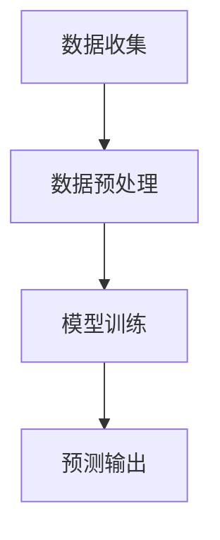

                 

关键词：人工智能，电商，智能库存预测，大模型，算法原理，数学模型，应用实践

> 摘要：本文深入探讨了人工智能在电商领域中的应用，特别是大模型技术在智能库存预测中的重要作用。文章从背景介绍、核心概念与联系、算法原理与操作步骤、数学模型与公式、项目实践、实际应用场景、未来展望等多个角度，详细阐述了AI驱动的电商智能库存预测的技术路径与发展趋势。

## 1. 背景介绍

### 1.1 电商行业现状

随着互联网技术的快速发展，电商行业已经成为全球经济增长的重要驱动力之一。然而，电商行业也面临着库存管理的巨大挑战。库存管理不当会导致库存过剩或不足，从而影响企业的运营效率和客户满意度。因此，如何提高库存预测的准确性成为电商企业亟待解决的问题。

### 1.2 智能库存预测的需求

智能库存预测是指利用人工智能技术，通过对历史销售数据、市场趋势、消费者行为等多方面数据的分析，预测未来的库存需求。智能库存预测的需求主要体现在以下几个方面：

- **降低库存成本**：通过准确预测库存需求，可以减少库存过剩或不足的风险，从而降低库存成本。

- **提高供应链效率**：智能库存预测可以帮助企业优化供应链管理，提高供应链的整体效率。

- **提升客户满意度**：准确的库存预测可以确保商品随时可供，提升客户的购物体验。

## 2. 核心概念与联系

### 2.1 人工智能与大数据分析

人工智能（AI）是计算机科学的一个分支，致力于使计算机具备模拟、延伸和扩展人的智能。大数据分析则是通过处理和分析大量数据，从中提取有价值的信息。

### 2.2 大模型与深度学习

大模型（Large Model）是指参数数量庞大的深度学习模型，如GPT、BERT等。深度学习是人工智能的一个重要分支，通过模拟人脑神经网络结构，实现对数据的自动学习和特征提取。

### 2.3 智能库存预测的架构

智能库存预测的架构通常包括数据收集、数据预处理、模型训练、预测输出等环节。其核心在于如何有效地整合人工智能、大数据分析和深度学习技术，构建一个高效、准确的预测模型。

### 2.4 Mermaid 流程图



## 3. 核心算法原理 & 具体操作步骤

### 3.1 算法原理概述

智能库存预测的核心算法是深度学习模型，特别是大模型。大模型通过学习历史数据中的规律和模式，实现对未来库存需求的准确预测。

### 3.2 算法步骤详解

#### 3.2.1 数据收集

数据收集是智能库存预测的基础。需要收集的数据包括销售数据、库存数据、市场趋势数据、消费者行为数据等。

#### 3.2.2 数据预处理

数据预处理是数据收集后的重要步骤，主要包括数据清洗、数据归一化、特征提取等。

#### 3.2.3 模型训练

模型训练是智能库存预测的关键环节。通常使用深度学习框架（如TensorFlow、PyTorch等）训练大模型，通过调整模型参数，使其能够准确地预测未来库存需求。

#### 3.2.4 预测输出

模型训练完成后，可以通过输入当前的数据，预测未来的库存需求。预测结果可以用于库存管理、供应链优化等实际应用。

### 3.3 算法优缺点

#### 优点：

- **高准确性**：大模型具有强大的学习能力，可以处理复杂的数据模式，提高预测准确性。

- **自适应性强**：大模型可以根据新的数据自动调整，适应不断变化的市场环境。

- **自动化程度高**：智能库存预测系统可以自动化地进行数据收集、预处理、模型训练和预测输出，减少人工干预。

#### 缺点：

- **计算资源消耗大**：大模型的训练需要大量的计算资源和时间。

- **数据依赖性强**：智能库存预测的准确性高度依赖数据的完整性和质量。

### 3.4 算法应用领域

智能库存预测算法可以应用于电商、制造业、零售业等多个领域，帮助企业管理库存、优化供应链、提高运营效率。

## 4. 数学模型和公式 & 详细讲解 & 举例说明

### 4.1 数学模型构建

智能库存预测的数学模型通常是基于时间序列分析的方法，如ARIMA、LSTM等。以下是一个基于LSTM的数学模型构建过程：

$$
I_t = f(S_t, I_{t-1}, \theta)
$$

其中，$I_t$ 表示第t期的库存量，$S_t$ 表示第t期的销售量，$I_{t-1}$ 表示第t-1期的库存量，$\theta$ 表示模型的参数。

### 4.2 公式推导过程

LSTM模型的公式推导过程较为复杂，这里仅简要介绍：

$$
\begin{aligned}
&\text{输入门：} f_t = \sigma(W_f \cdot [h_{t-1}, x_t] + b_f) \\
&\text{遗忘门：} g_t = \sigma(W_g \cdot [h_{t-1}, x_t] + b_g) \\
&\text{输入门：} i_t = \sigma(W_i \cdot [h_{t-1}, x_t] + b_i) \\
&\text{输出门：} o_t = \sigma(W_o \cdot [h_{t-1}, x_t] + b_o) \\
&\text{单元状态：} C_t = f_t \odot \text{Forget} + i_t \odot \text{Input} \\
&\text{隐藏状态：} h_t = o_t \odot \text{Tanh}(C_t)
\end{aligned}
$$

### 4.3 案例分析与讲解

假设某电商平台的某商品历史销售数据如下：

| 日期 | 销售量 |
| ---- | ------ |
| 2021-01-01 | 100 |
| 2021-01-02 | 120 |
| 2021-01-03 | 150 |
| ... | ... |

使用LSTM模型预测未来一周的销售量，可以按照以下步骤进行：

#### 4.3.1 数据预处理

- 数据清洗：去除异常值和缺失值。
- 数据归一化：将销售量归一化到0-1之间。

#### 4.3.2 模型训练

- 初始化模型参数。
- 使用历史数据训练LSTM模型。
- 调整模型参数，提高预测准确性。

#### 4.3.3 预测输出

- 输入当前一周的销售数据。
- 使用训练好的LSTM模型预测未来一周的销售量。

## 5. 项目实践：代码实例和详细解释说明

### 5.1 开发环境搭建

- 安装Python环境。
- 安装TensorFlow库。

### 5.2 源代码详细实现

```python
import tensorflow as tf
from tensorflow.keras.models import Sequential
from tensorflow.keras.layers import LSTM, Dense

# 数据预处理
# ...

# 模型构建
model = Sequential()
model.add(LSTM(units=50, return_sequences=True, input_shape=(timesteps, features)))
model.add(LSTM(units=50))
model.add(Dense(units=1))

# 模型编译
model.compile(optimizer='adam', loss='mean_squared_error')

# 模型训练
model.fit(x_train, y_train, epochs=100, batch_size=32)

# 预测输出
predictions = model.predict(x_test)
```

### 5.3 代码解读与分析

- 数据预处理：将销售数据转化为适合LSTM模型训练的格式。
- 模型构建：构建一个LSTM模型，包括输入层、隐藏层和输出层。
- 模型编译：编译模型，设置优化器和损失函数。
- 模型训练：使用历史数据训练模型。
- 预测输出：使用训练好的模型预测未来销售量。

## 6. 实际应用场景

### 6.1 电商行业

电商行业可以利用智能库存预测技术，优化库存管理，降低库存成本，提高运营效率。

### 6.2 制造业

制造业可以通过智能库存预测，优化生产计划，减少库存积压，提高生产效率。

### 6.3 零售业

零售业可以利用智能库存预测，准确预测销售趋势，调整商品采购策略，提高客户满意度。

## 7. 未来应用展望

随着人工智能技术的不断发展，智能库存预测技术将在更多领域得到应用。未来，有望实现更加精准、高效的库存管理，为企业和消费者创造更大的价值。

## 8. 总结：未来发展趋势与挑战

### 8.1 研究成果总结

智能库存预测技术已经在电商、制造业、零售业等领域取得了显著的应用成果。

### 8.2 未来发展趋势

随着大数据、云计算、物联网等技术的不断发展，智能库存预测技术将更加成熟、精准。

### 8.3 面临的挑战

智能库存预测技术面临的主要挑战包括数据质量、计算资源消耗、算法优化等方面。

### 8.4 研究展望

未来，智能库存预测技术将继续向精准、高效、自适应方向发展，为企业和消费者创造更大的价值。

## 9. 附录：常见问题与解答

### 9.1 如何处理缺失数据？

缺失数据可以通过数据插值、数据删除、数据填充等方法进行处理。

### 9.2 如何优化模型性能？

可以通过调整模型参数、增加训练数据、改进数据预处理方法等方法来优化模型性能。

### 9.3 如何评估模型效果？

可以通过均方误差（MSE）、均方根误差（RMSE）等指标来评估模型效果。

### 9.4 如何提高预测准确性？

可以通过增加数据维度、改进算法模型、增加训练时间等方法来提高预测准确性。

作者：禅与计算机程序设计艺术 / Zen and the Art of Computer Programming
```

请根据上述结构撰写完整文章。在撰写过程中，请注意确保内容的专业性和完整性，以及符合要求的格式和字数。如果需要进一步的具体化或者细化某个部分的内容，请及时告知。

