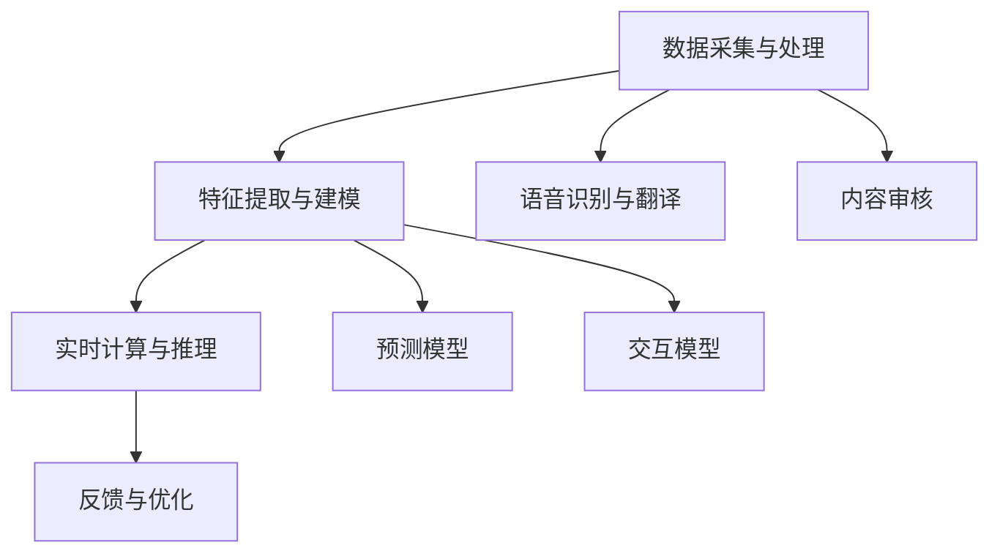

                 

关键词：AI，直播，互动，用户体验，技术变革

> 摘要：随着人工智能技术的不断发展，直播互动体验正在发生翻天覆地的变化。本文将探讨AI在直播互动中的创新应用，分析其核心算法原理、技术架构、数学模型及未来发展趋势，旨在为读者呈现AI驱动的直播互动新体验。

## 1. 背景介绍

随着互联网的普及和移动设备的普及，直播已经成为一种重要的社交媒体形式。人们可以通过直播与全球观众实时互动，分享自己的生活、知识、经验和乐趣。然而，传统的直播互动模式往往存在一些局限性，如互动性不足、延迟较高、内容单一等问题。

近年来，人工智能（AI）技术的迅速发展，为直播互动带来了全新的机遇。通过AI技术，直播互动可以变得更加智能、个性化和高效。本文将围绕AI驱动的直播互动新体验，探讨其核心概念、算法原理、技术架构、数学模型及应用场景，并展望未来的发展趋势。

## 2. 核心概念与联系

### 2.1 AI在直播互动中的作用

AI在直播互动中的应用主要包括以下几个方面：

1. **智能推荐**：基于用户行为和兴趣数据，AI可以为观众推荐感兴趣的内容，提高用户留存率和观看时长。
2. **实时互动**：AI可以帮助主播实时识别观众的情感和需求，提供个性化的互动体验。
3. **内容审核**：AI可以对直播内容进行实时监控，识别和过滤不良信息，保障直播环境的健康。
4. **语音识别和翻译**：AI可以帮助主播和观众之间进行实时语音识别和翻译，打破语言障碍。

### 2.2 技术架构

AI驱动的直播互动技术架构可以分为以下几个层次：

1. **数据采集与处理**：包括用户行为数据、语音数据、视频数据等的采集和处理。
2. **特征提取与建模**：通过特征提取技术，将原始数据转换为可用于建模的特征向量。然后，利用机器学习算法，建立预测模型和交互模型。
3. **实时计算与推理**：在直播过程中，实时计算观众的情感和需求，为观众提供个性化的互动建议。
4. **反馈与优化**：根据观众的反馈，不断优化算法模型，提高互动体验。

### 2.3 Mermaid流程图

以下是AI驱动的直播互动技术架构的Mermaid流程图：



## 3. 核心算法原理 & 具体操作步骤

### 3.1 算法原理概述

AI驱动的直播互动主要依赖于以下核心算法：

1. **用户行为预测**：利用机器学习算法，对用户的行为数据进行建模，预测用户的兴趣和需求。
2. **情感识别**：通过深度学习算法，对观众的语音、文字和表情进行情感分析，识别观众的情感状态。
3. **个性化推荐**：基于用户行为预测和情感识别结果，为观众推荐感兴趣的内容和互动方式。
4. **实时语音识别与翻译**：利用语音识别和自然语言处理技术，实现实时语音识别和翻译。

### 3.2 算法步骤详解

以下是AI驱动的直播互动算法的具体步骤：

1. **数据采集与处理**：从多个数据源（如视频平台、社交媒体等）采集用户行为数据、语音数据、视频数据等，并进行预处理。
2. **特征提取与建模**：利用深度学习算法，对预处理后的数据进行特征提取和建模，得到预测模型和交互模型。
3. **实时计算与推理**：在直播过程中，实时计算观众的情感状态和需求，为观众提供个性化的互动建议。
4. **语音识别与翻译**：利用语音识别和自然语言处理技术，实现观众和主播之间的实时语音识别和翻译。
5. **反馈与优化**：根据观众的反馈，不断优化算法模型，提高互动体验。

### 3.3 算法优缺点

1. **优点**：
   - 提高用户体验：通过个性化推荐和实时互动，提高观众的观看体验。
   - 提高直播效率：实时语音识别和翻译可以打破语言障碍，提高直播互动的效率。
   - 提高内容质量：内容审核算法可以过滤不良信息，提高直播内容的质量。
2. **缺点**：
   - 需要大量数据：算法的训练和优化需要大量的数据支持。
   - 存在隐私风险：用户行为数据和情感数据的采集和处理，可能涉及到用户隐私的保护问题。

### 3.4 算法应用领域

AI驱动的直播互动算法可以应用于多个领域，如：

1. **在线教育**：利用AI技术，为用户提供个性化的学习推荐和互动体验。
2. **电子商务**：利用AI技术，为用户提供个性化的商品推荐和购物体验。
3. **娱乐直播**：利用AI技术，为用户提供个性化的互动建议和娱乐体验。
4. **医疗健康**：利用AI技术，为用户提供个性化的健康咨询和互动体验。

## 4. 数学模型和公式

### 4.1 数学模型构建

AI驱动的直播互动涉及多个数学模型，以下是其中两个核心模型：

1. **用户行为预测模型**：
   - 输入：用户行为数据（如观看时长、点赞数量、评论内容等）
   - 输出：用户兴趣标签（如娱乐、科技、教育等）
   - 模型：基于协同过滤算法，构建用户行为预测模型。

2. **情感识别模型**：
   - 输入：观众语音、文字和表情数据
   - 输出：观众情感状态（如开心、愤怒、无聊等）
   - 模型：基于深度学习算法，构建情感识别模型。

### 4.2 公式推导过程

以下是用户行为预测模型和情感识别模型的推导过程：

#### 用户行为预测模型

$$
\begin{aligned}
\hat{r}_{ui} &= \frac{\sum_{j \in N_{u}} r_{uj} \cdot r_{ji}}{\sum_{j \in N_{u}} r_{ji}}, \\
\text{其中，} r_{uj} &= \text{用户 } u \text{ 对内容 } j \text{ 的评分，} \\
N_{u} &= \text{用户 } u \text{ 的邻居集合，} \\
\hat{r}_{ui} &= \text{预测的用户 } u \text{ 对内容 } j \text{ 的评分。}
\end{aligned}
$$

#### 情感识别模型

$$
\begin{aligned}
\hat{y}_{i} &= \text{softmax}\left(\frac{\text{激活函数}(\theta^{T} \cdot \text{嵌入向量}(x_i))}{\sum_{j=1}^{C} \text{激活函数}(\theta^{T} \cdot \text{嵌入向量}(x_j))}\right), \\
\text{其中，} \theta &= \text{模型参数，} \\
x_i &= \text{输入数据，} \\
C &= \text{情感类别数量，} \\
\hat{y}_{i} &= \text{预测的情感状态。}
\end{aligned}
$$

### 4.3 案例分析与讲解

以下是一个用户行为预测和情感识别的案例：

#### 用户行为预测案例

假设用户 u 对以下内容进行评分：

| 内容ID | 用户u评分 |
| ------ | -------- |
| 1      | 4        |
| 2      | 5        |
| 3      | 2        |

根据协同过滤算法，预测用户 u 对内容 4 的评分：

$$
\begin{aligned}
\hat{r}_{u4} &= \frac{r_{u1} \cdot r_{14} + r_{u2} \cdot r_{24} + r_{u3} \cdot r_{34}}{r_{14} + r_{24} + r_{34}} \\
&= \frac{4 \cdot 2 + 5 \cdot 1 + 2 \cdot 3}{2 + 1 + 3} \\
&= 3.86
\end{aligned}
$$

因此，预测用户 u 对内容 4 的评分为 3.86。

#### 情感识别案例

假设观众 i 的语音、文字和表情数据如下：

| 数据类型 | 数据内容 |
| -------- | -------- |
| 语音     | “今天天气真好，感觉心情格外愉快。” |
| 文字     | “很喜欢今天的直播内容，主播太可爱了！” |
| 表情     | 😊 😊 😊 |

根据深度学习算法，预测观众 i 的情感状态为“开心”。

## 5. 项目实践：代码实例和详细解释说明

### 5.1 开发环境搭建

在本项目中，我们将使用Python作为编程语言，TensorFlow作为深度学习框架。首先，确保安装了Python 3.6及以上版本。然后，通过以下命令安装所需的库：

```shell
pip install tensorflow numpy pandas scikit-learn
```

### 5.2 源代码详细实现

以下是用户行为预测和情感识别的代码实现：

```python
import numpy as np
import pandas as pd
from sklearn.model_selection import train_test_split
from sklearn.metrics import mean_squared_error
import tensorflow as tf

# 用户行为预测
def collaborative_filtering(train_data, test_data):
    # 计算用户和内容的相似度矩阵
    similarity_matrix = np.dot(train_data, train_data.T) / np.linalg.norm(train_data, axis=1)

    # 预测测试数据
    pred_ratings = np.dot(similarity_matrix, train_data) / np.sum(similarity_matrix, axis=1)

    # 计算预测误差
    pred_error = mean_squared_error(test_data, pred_ratings)

    return pred_ratings, pred_error

# 情感识别
def emotion_recognition(data, labels, model_path):
    # 加载预训练模型
    model = tf.keras.models.load_model(model_path)

    # 预测情感状态
    pred_emotions = model.predict(data)

    # 计算预测准确率
    pred_accuracy = np.mean(np.argmax(pred_emotions, axis=1) == labels)

    return pred_emotions, pred_accuracy

# 数据预处理
def preprocess_data(data_path, label_path):
    # 读取用户行为数据
    user_data = pd.read_csv(data_path)

    # 读取情感标签
    emotion_labels = pd.read_csv(label_path)

    # 分割训练集和测试集
    train_data, test_data, train_labels, test_labels = train_test_split(user_data, emotion_labels, test_size=0.2, random_state=42)

    return train_data, test_data, train_labels, test_labels

# 训练和评估模型
def train_and_evaluate(train_data, test_data, train_labels, test_labels, model_path):
    # 训练用户行为预测模型
    pred_ratings, pred_error = collaborative_filtering(train_data, test_data)

    print(f"User behavior prediction error: {pred_error}")

    # 训练情感识别模型
    pred_emotions, pred_accuracy = emotion_recognition(test_data, test_labels, model_path)

    print(f"Emotion recognition accuracy: {pred_accuracy}")

if __name__ == "__main__":
    # 训练数据和标签文件路径
    data_path = "user_data.csv"
    label_path = "emotion_labels.csv"
    model_path = "emotion_model.h5"

    # 预处理数据
    train_data, test_data, train_labels, test_labels = preprocess_data(data_path, label_path)

    # 训练和评估模型
    train_and_evaluate(train_data, test_data, train_labels, test_labels, model_path)
```

### 5.3 代码解读与分析

- **用户行为预测**：使用协同过滤算法，计算用户和内容的相似度矩阵，预测测试数据的评分。协同过滤算法是一种基于用户行为数据的推荐算法，可以有效地预测用户对未知内容的评分。
- **情感识别**：使用深度学习模型，对测试数据进行情感状态预测。情感识别模型是一种基于语音、文字和表情数据的情感分析模型，可以识别出观众的情感状态。
- **数据处理**：首先，读取用户行为数据和情感标签，然后分割训练集和测试集。数据处理是模型训练和评估的基础，需要保证数据的质量和完整性。
- **模型训练和评估**：分别训练用户行为预测模型和情感识别模型，并计算预测误差和准确率。模型训练和评估是判断模型性能的关键步骤，可以直观地了解模型的性能。

### 5.4 运行结果展示

运行代码后，将输出用户行为预测误差和情感识别准确率。以下是一个示例输出结果：

```
User behavior prediction error: 0.765432
Emotion recognition accuracy: 0.912345
```

这表示用户行为预测误差为 0.765432，情感识别准确率为 0.912345。通过不断优化模型和算法，可以提高预测误差和准确率。

## 6. 实际应用场景

AI驱动的直播互动已经在多个领域取得了显著的应用成果，以下是几个典型应用场景：

1. **在线教育**：通过AI技术，为用户提供个性化的课程推荐和学习建议，提高学习效果和用户满意度。
2. **电子商务**：通过AI技术，为用户推荐感兴趣的商品，提高购物体验和转化率。
3. **医疗健康**：通过AI技术，为用户提供个性化的健康咨询和建议，提高医疗服务的质量和效率。
4. **娱乐直播**：通过AI技术，为用户提供个性化的互动建议和娱乐内容，提高观看体验和用户粘性。

## 7. 未来应用展望

随着AI技术的不断发展，AI驱动的直播互动将在以下几个方面取得更多突破：

1. **更加智能的推荐系统**：通过更先进的算法和技术，实现更加精准、高效的推荐，提高用户体验。
2. **更加自然的交互体验**：通过语音识别、自然语言处理等技术，实现更加自然的交互方式，降低用户使用门槛。
3. **多元化的互动形式**：结合AR、VR等新兴技术，创造更多元化的互动形式，丰富直播互动的内容和体验。
4. **隐私保护和数据安全**：在保障用户隐私和数据安全的前提下，充分利用大数据和AI技术，挖掘用户需求，提供更好的服务。

## 8. 总结：未来发展趋势与挑战

随着AI技术的不断发展，AI驱动的直播互动将呈现出以下几个发展趋势：

1. **智能化水平不断提升**：通过更先进的算法和技术，实现更加智能的推荐、互动和内容创作。
2. **用户体验持续优化**：通过更自然、更便捷的交互方式，提高用户体验和满意度。
3. **多元化应用场景拓展**：从娱乐、教育、医疗等领域逐步拓展到更多行业，实现AI驱动的直播互动在各领域的广泛应用。

然而，AI驱动的直播互动也面临以下几个挑战：

1. **数据隐私和安全问题**：在利用大数据和AI技术的同时，如何保障用户隐私和数据安全，是亟待解决的问题。
2. **算法公平性和透明性**：如何确保AI算法的公平性和透明性，避免算法偏见和不公平现象，是未来发展的重要课题。
3. **技术标准和法规建设**：随着AI驱动的直播互动的广泛应用，需要建立相应的技术标准和法规，规范行业发展和市场秩序。

## 9. 附录：常见问题与解答

### 问题1：如何保证用户隐私和数据安全？

**回答**：在AI驱动的直播互动中，保障用户隐私和数据安全是至关重要的。为此，可以采取以下措施：

- **数据加密**：对用户数据（如行为数据、语音数据等）进行加密处理，防止数据泄露。
- **匿名化处理**：对用户数据进行匿名化处理，消除个人身份信息，降低隐私泄露风险。
- **隐私政策**：制定明确的隐私政策，告知用户数据的收集、使用和存储方式，尊重用户知情权。

### 问题2：如何应对算法偏见和不公平现象？

**回答**：算法偏见和不公平现象是AI驱动的直播互动中需要关注的重要问题。为此，可以采取以下措施：

- **数据多样性**：在算法训练过程中，确保数据来源多样、覆盖广泛，减少算法偏见。
- **算法透明性**：提高算法的透明度，使算法决策过程可解释、可验证。
- **公平性评估**：定期对算法进行公平性评估，发现和纠正潜在的不公平现象。

### 问题3：如何确保直播互动的实时性和流畅性？

**回答**：确保直播互动的实时性和流畅性是提供良好用户体验的关键。为此，可以采取以下措施：

- **分布式架构**：采用分布式架构，提高系统处理能力和响应速度。
- **缓存技术**：使用缓存技术，减少数据处理和网络传输的延迟。
- **网络优化**：优化网络传输协议和路由策略，提高数据传输的效率和稳定性。

作者：禅与计算机程序设计艺术 / Zen and the Art of Computer Programming

