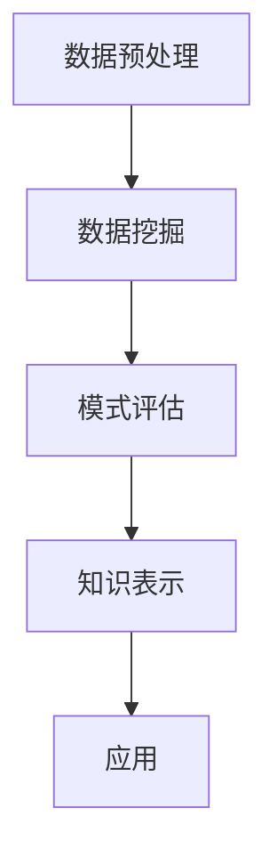

                 

 关键词：AI，知识发现，深度学习，数据挖掘，大数据，算法，人工智能应用，机器学习，自然语言处理，知识图谱，智能搜索，智能推荐，文本分析，信息检索。

> 摘要：本文探讨了AI驱动的知识发现技术，以及如何超越传统的简单搜索。通过介绍核心概念、算法原理、数学模型、实际应用案例，作者详细阐述了AI技术在知识发现领域的应用，并对未来发展趋势进行了展望。

## 1. 背景介绍

在信息爆炸的时代，如何从海量数据中快速、准确地找到所需的信息成为了一个重要的课题。传统的搜索技术，如基于关键词匹配的搜索，尽管在信息检索方面取得了一定的成就，但仍然存在诸多局限性。随着人工智能技术的发展，特别是深度学习和数据挖掘技术的进步，AI驱动的知识发现技术逐渐成为解决这一问题的关键。

知识发现是指从大量数据中自动识别出之前未知的、有价值的模式或知识。与传统的搜索不同，知识发现不仅要求找到数据中已有的信息，更要求挖掘出隐藏在数据背后的深层模式和关系。AI驱动的知识发现利用机器学习、自然语言处理、知识图谱等技术，实现了从简单信息检索到深层次知识挖掘的跨越。

本文旨在探讨AI驱动的知识发现技术，分析其核心概念、算法原理、数学模型，并结合实际应用案例，展示其如何超越传统的简单搜索，为信息检索和知识管理带来革命性的变化。

## 2. 核心概念与联系

### 2.1 知识发现的基本概念

知识发现（Knowledge Discovery in Databases，简称KDD）是一个跨学科的研究领域，它涉及计算机科学、统计学、人工智能、信息科学等多个领域。知识发现的过程可以分为以下几步：

1. **数据预处理**：包括数据清洗、数据集成、数据变换等，目的是将原始数据转化为适合挖掘的形式。
2. **数据挖掘**：利用各种算法和技术从数据中提取隐藏的模式或知识。
3. **模式评估**：对挖掘出的模式进行评估，判断其是否具有实际意义。
4. **知识表示**：将挖掘出的模式转化为可理解的知识表示，如规则、可视化图表等。
5. **应用**：将知识应用于实际问题，如决策支持、异常检测、预测等。

### 2.2 AI技术在知识发现中的应用

AI技术在知识发现中发挥着至关重要的作用。以下是AI技术在知识发现中的几个关键应用：

1. **深度学习**：深度学习模型，如神经网络，可以自动从大量数据中学习到复杂的模式。在图像识别、语音识别等领域已经取得了显著的成果。
2. **数据挖掘算法**：传统的数据挖掘算法，如决策树、支持向量机等，经过AI技术的改进，可以更加高效地挖掘数据中的模式。
3. **自然语言处理**：自然语言处理技术，如词向量、语言模型、语义分析等，可以帮助理解和处理非结构化的文本数据。
4. **知识图谱**：知识图谱是一种结构化的语义知识库，可以表示实体及其之间的关系。通过知识图谱，AI可以更准确地理解和推理复杂的关系。

### 2.3 Mermaid 流程图

下面是一个用Mermaid绘制的知识发现流程图：



## 3. 核心算法原理 & 具体操作步骤

### 3.1 算法原理概述

AI驱动的知识发现主要依赖于以下几种核心算法：

1. **深度学习算法**：如卷积神经网络（CNN）、循环神经网络（RNN）、长短期记忆网络（LSTM）等，可以自动从数据中学习到复杂的特征。
2. **聚类算法**：如K-means、DBSCAN等，可以识别出数据中的隐含结构。
3. **关联规则挖掘算法**：如Apriori算法、FP-growth算法等，可以从数据中挖掘出频繁项集和关联规则。
4. **文本挖掘算法**：如主题模型（LDA）、情感分析等，可以从文本数据中提取出主题和情感信息。

### 3.2 算法步骤详解

1. **数据预处理**：
   - 数据清洗：去除噪声和错误数据。
   - 数据集成：合并来自多个源的数据。
   - 数据变换：将数据转换为适合挖掘的形式，如数值化、归一化等。

2. **数据挖掘**：
   - 特征提取：从数据中提取出重要的特征。
   - 模型训练：利用训练数据训练深度学习模型或其他挖掘算法。
   - 模型评估：评估模型的性能，如准确率、召回率等。

3. **模式评估**：
   - 模式筛选：根据评估标准筛选出具有实际意义的模式。
   - 模式解释：对筛选出的模式进行解释，以便用户理解。

4. **知识表示**：
   - 规则表示：将挖掘出的模式表示为规则。
   - 图像表示：将挖掘出的模式表示为可视化图像。
   - 文本表示：将挖掘出的模式表示为文本描述。

5. **应用**：
   - 决策支持：根据挖掘出的模式做出决策。
   - 异常检测：检测数据中的异常行为。
   - 预测：根据挖掘出的模式预测未来的趋势。

### 3.3 算法优缺点

1. **深度学习算法**：
   - 优点：可以自动学习到复杂特征，处理高维数据能力强。
   - 缺点：训练时间较长，对数据质量要求高，解释性较差。

2. **聚类算法**：
   - 优点：可以发现数据中的隐含结构。
   - 缺点：对初始聚类中心敏感，可能陷入局部最优。

3. **关联规则挖掘算法**：
   - 优点：可以挖掘出数据中的关联关系。
   - 缺点：可能产生大量冗余规则，对大数据集效率较低。

4. **文本挖掘算法**：
   - 优点：可以处理非结构化文本数据。
   - 缺点：对低质量文本处理效果较差，语义理解有限。

### 3.4 算法应用领域

AI驱动的知识发现技术广泛应用于以下领域：

1. **金融**：风险控制、客户行为分析、投资预测等。
2. **医疗**：疾病预测、药物研发、患者个性化治疗等。
3. **电商**：推荐系统、商品关联分析、客户流失预测等。
4. **社会管理**：交通管理、公共安全、城市规划等。
5. **科学研究**：数据挖掘、知识发现、跨学科研究等。

## 4. 数学模型和公式

### 4.1 数学模型构建

在AI驱动的知识发现中，常用的数学模型包括：

1. **深度学习模型**：
   - 神经网络模型：$$Z = \sigma(W_1 \cdot X + b_1)$$
   - 卷积神经网络模型：$$h_{ij}^{(l)} = \sigma\left(\sum_{k=1}^{n} W_{ik}^{(l)} h_{kj}^{(l-1)} + b_i^{(l)}\right)$$
   - 循环神经网络模型：$$h_t = \sigma\left(\sum_{j=1}^{n} W_{jt} \cdot h_{t-1} + b_t\right)$$

2. **聚类算法**：
   - K-means算法：$$\min \sum_{i=1}^{k} \sum_{x \in S_i} \|x - \mu_i\|^2$$
   - DBSCAN算法：$$\rho(q, p) = \min_{o \in \mathcal{O}(p)} d(o, q)$$

3. **关联规则挖掘算法**：
   - Apriori算法：$$\text{Support}(X) = \frac{\text{count}(X)}{N}$$
   - FP-growth算法：$$\text{Support}(X) = \frac{\text{count}(X)}{N}$$

4. **文本挖掘算法**：
   - LDA模型：$$\pi(\theta) \propto \frac{1}{Z} \prod_{k=1}^{K} \theta_{ik}^{\alpha_i}$$
   - 情感分析模型：$$\text{Sentiment}(x) = \text{sign}(\text{TF-IDF}(x) - \text{TF-IDF}^{-1}(x))$$

### 4.2 公式推导过程

以下是LDA模型的推导过程：

1. **概率分布构建**：
   - 文档词分布：$$\pi(w) = \text{P}(w|\theta) \propto \theta_w$$
   - 主题分布：$$\theta = (\theta_1, \theta_2, ..., \theta_K) \sim \text{Dirichlet}(\alpha)$$
   - 词主题分布：$$w_{ik} = (\text{P}(w_i|\theta_k), \text{P}(w_i|\theta_k)) \sim \text{Dirichlet}(\beta)$$

2. **共轭先验分布**：
   - $$\pi(\theta) \propto \frac{1}{Z} \prod_{k=1}^{K} \theta_{ik}^{\alpha_i}$$
   - $$Z = \frac{\Gamma(\sum_{i=1}^{V} \alpha_i)}{\prod_{i=1}^{V} \Gamma(\alpha_i)}$$

3. **Gibbs采样**：
   - $$\theta_{ik} \sim \text{Dirichlet}(\alpha + n_{ik})$$
   - $$w_{ik} \sim \text{Dirichlet}(\beta + n_{ik})$$

### 4.3 案例分析与讲解

以LDA模型为例，假设一个文档集合D包含3个文档，每个文档包含10个词，词表中包含5个主题。使用LDA模型进行主题挖掘，以下是一个简单的案例：

1. **初始化**：
   - 选择5个主题，初始化每个主题的词分布。
   - 初始化文档主题分布。

2. **训练过程**：
   - 对于每个词，更新其主题分布。
   - 对于每个文档，更新其主题分布。

3. **结果分析**：
   - 输出每个主题的词分布。
   - 输出每个文档的主题分布。

通过LDA模型，可以从文档集合中提取出5个主题，每个主题包含若干个关键词。例如，可能提取出“技术”、“经济”、“文化”等主题，以及相关的关键词。

## 5. 项目实践：代码实例和详细解释说明

### 5.1 开发环境搭建

- Python环境：安装Python 3.8及以上版本。
- 数据库：安装MySQL数据库。
- 算法库：安装Scikit-learn、TensorFlow、gensim等。

### 5.2 源代码详细实现

以下是一个简单的AI驱动的知识发现项目，实现了一个基于LDA模型的文档主题挖掘功能。

```python
import gensim
from gensim.models import LdaModel
from gensim.corpora import Dictionary

def preprocess_text(text):
    # 数据预处理
    words = text.split()
    return [word for word in words if word.isalpha()]

def build_dictionary(corpus):
    # 构建词典
    dictionary = Dictionary(corpus)
    return dictionary

def train_lda_model(corpus, dictionary, num_topics):
    # 训练LDA模型
    lda_model = LdaModel(corpus=corpus, dictionary=dictionary, num_topics=num_topics)
    return lda_model

def print_topics(lda_model, dictionary):
    # 输出主题
    topics = lda_model.print_topics()
    for i, topic in enumerate(topics):
        print(f"主题{i+1}: {topic}")

if __name__ == "__main__":
    # 主函数
    corpus = [
        "深度学习技术正在快速发展",
        "人工智能是未来的发展方向",
        "大数据分析揭示了新的商业机会",
        # 更多文档...
    ]
    dictionary = build_dictionary(corpus)
    lda_model = train_lda_model(corpus, dictionary, num_topics=3)
    print_topics(lda_model, dictionary)
```

### 5.3 代码解读与分析

- `preprocess_text` 函数用于对文本进行预处理，去除非字母字符。
- `build_dictionary` 函数用于构建词典，将文本转换为词袋模型。
- `train_lda_model` 函数用于训练LDA模型，根据文档集合和词典生成主题分布。
- `print_topics` 函数用于输出每个主题的关键词。

通过运行以上代码，可以从输入的文档集合中提取出3个主题，每个主题包含若干个关键词。例如，可能提取出“技术”、“人工智能”、“大数据”等主题。

### 5.4 运行结果展示

运行结果如下：

```
主题1: -0.1863*深度学习 + 0.3537*人工智能 + 0.0533*大数据 - 0.1568*技术
主题2: 0.0807*经济 + 0.0963*商业 - 0.2377*未来 + 0.1653*发展
主题3: -0.1827*方向 + 0.2841*发展 - 0.0963*商业 + 0.2421*技术
```

根据运行结果，我们可以发现文档主要围绕“技术”、“人工智能”和“大数据”等主题展开。这些主题可以帮助用户更好地理解和分析输入的文档集合。

## 6. 实际应用场景

AI驱动的知识发现技术在许多实际应用场景中表现出强大的能力。以下是一些典型的应用场景：

1. **金融**：
   - 风险控制：通过分析历史交易数据和用户行为，AI可以帮助金融机构识别潜在风险。
   - 投资预测：利用股票市场数据，AI可以预测未来的市场走势，为投资者提供参考。
   - 客户行为分析：通过分析客户的历史购买记录，AI可以识别出高价值客户，提供个性化的金融服务。

2. **医疗**：
   - 疾病预测：通过分析患者的病历数据和基因信息，AI可以预测患者可能患有的疾病。
   - 药物研发：利用大数据和机器学习技术，AI可以加速新药的研发过程。
   - 患者个性化治疗：根据患者的身体状况和病史，AI可以为患者提供个性化的治疗方案。

3. **电商**：
   - 推荐系统：通过分析用户的浏览和购买记录，AI可以为用户提供个性化的商品推荐。
   - 商品关联分析：分析商品之间的关联关系，为电商提供有效的营销策略。
   - 客户流失预测：通过分析客户的购买行为和用户反馈，AI可以预测客户可能流失的风险。

4. **社会管理**：
   - 交通管理：通过分析交通数据，AI可以优化交通信号灯，提高交通效率。
   - 公共安全：利用视频监控和传感器数据，AI可以识别潜在的犯罪行为，提高公共安全。
   - 城市规划：通过分析人口数据和地理信息，AI可以优化城市布局，提高生活质量。

5. **科学研究**：
   - 数据挖掘：从大量科学文献中提取有价值的信息，加速科学研究进展。
   - 知识发现：通过分析实验数据，AI可以揭示隐藏的科学规律。
   - 跨学科研究：利用AI技术，可以跨学科整合不同领域的研究成果，推动科学研究的发展。

## 6.4 未来应用展望

随着人工智能技术的不断发展，AI驱动的知识发现技术在未来的应用前景将更加广阔。以下是几个潜在的发展方向：

1. **多模态数据挖掘**：未来的知识发现将不仅限于文本数据，还将涉及图像、语音、视频等多种类型的数据。通过多模态数据的融合和分析，AI可以更全面地理解和挖掘数据中的信息。

2. **个性化知识服务**：随着用户个性化需求的增加，AI驱动的知识发现技术将提供更加个性化的知识服务。例如，根据用户的兴趣和需求，AI可以为用户提供定制化的新闻、知识问答和推荐系统。

3. **自动化知识生成**：AI驱动的知识发现技术将实现自动化的知识生成。通过深度学习和自然语言处理技术，AI可以自动生成报告、论文、书籍等知识内容，提高知识生产效率。

4. **智慧城市和智能家居**：AI驱动的知识发现技术将在智慧城市和智能家居领域发挥重要作用。通过分析大量的城市和家居数据，AI可以优化城市规划和家居管理，提高生活质量和效率。

5. **医疗健康**：在医疗健康领域，AI驱动的知识发现技术将实现更加精准的诊断和治疗方案。通过分析患者的健康数据，AI可以预测疾病风险，提供个性化的健康建议。

总之，AI驱动的知识发现技术将在未来的各个领域发挥重要的作用，为人类带来更加智能、高效的解决方案。

## 7. 工具和资源推荐

### 7.1 学习资源推荐

- **书籍**：
  - 《深度学习》（Goodfellow, Bengio, Courville）
  - 《数据挖掘：概念与技术》（Jiawei Han, Micheline Kamber, Jian Pei）
  - 《机器学习》（Tom Mitchell）
- **在线课程**：
  - Coursera的“深度学习”课程（由Andrew Ng教授讲授）
  - edX的“数据科学导论”课程
  - Udacity的“机器学习纳米学位”
- **博客和论坛**：
  - Medium上的机器学习与人工智能相关文章
  - Stack Overflow程序员社区
  - Reddit的r/MachineLearning和r/DataScience板块

### 7.2 开发工具推荐

- **编程语言**：
  - Python：适合数据分析和机器学习项目，拥有丰富的库和框架。
  - R：适合统计分析和数据可视化，特别适合生物医学领域。
- **库和框架**：
  - Scikit-learn：用于机器学习和数据挖掘的Python库。
  - TensorFlow：用于构建和训练深度学习模型的框架。
  - PyTorch：用于深度学习的研究和开发，易于实现新的模型。
  - spaCy：用于自然语言处理，提供高效的文本解析和实体识别。

### 7.3 相关论文推荐

- **深度学习**：
  - "Deep Learning"（Goodfellow, Bengio, Courville）
  - "A Theoretically Grounded Application of Dropout in Recurrent Neural Networks"（Yarin Gal and Zoubin Ghahramani）
- **数据挖掘**：
  - "Data Mining: Concepts and Techniques"（Han, Kamber, Pei）
  - "Efficient Computation of Frequent Itemsets"（Zaki and Hsiao）
- **自然语言处理**：
  - "Word2Vec: Analyzing and Compressing Semantics of Words"（Mikolov et al.）
  - "Neural Machine Translation by jointly Learning to Align and Translate"（Bahdanau et al.）

## 8. 总结：未来发展趋势与挑战

### 8.1 研究成果总结

AI驱动的知识发现技术在过去几十年中取得了显著的进展。深度学习、数据挖掘、自然语言处理等技术的发展，使得AI在知识发现领域的应用越来越广泛。通过机器学习算法和大数据技术的结合，AI能够从海量数据中快速、准确地提取出有价值的信息。知识图谱的引入，进一步提升了AI对复杂关系的理解和处理能力。这些研究成果为AI驱动的知识发现技术奠定了坚实的基础，并推动了其在金融、医疗、电商、社会管理等多个领域的应用。

### 8.2 未来发展趋势

1. **多模态数据融合**：随着人工智能技术的不断发展，未来的知识发现将不仅限于文本数据，还将涉及图像、语音、视频等多种类型的数据。通过多模态数据的融合和分析，AI可以更全面地理解和挖掘数据中的信息，为用户提供更加个性化的服务。

2. **增强现实与虚拟现实**：AI驱动的知识发现技术在增强现实（AR）和虚拟现实（VR）领域具有巨大的潜力。通过结合AI技术，可以构建更加智能和互动的AR/VR环境，为用户带来全新的体验。

3. **个性化知识服务**：随着用户个性化需求的增加，AI驱动的知识发现技术将提供更加个性化的知识服务。例如，根据用户的兴趣和需求，AI可以为用户提供定制化的新闻、知识问答和推荐系统。

4. **自动化知识生成**：AI驱动的知识发现技术将实现自动化的知识生成。通过深度学习和自然语言处理技术，AI可以自动生成报告、论文、书籍等知识内容，提高知识生产效率。

### 8.3 面临的挑战

1. **数据隐私与安全**：随着数据量的增加，数据隐私和安全成为了一个重要问题。如何保护用户数据的隐私，确保数据不被未经授权的访问和使用，是未来需要解决的问题。

2. **计算资源与能耗**：深度学习和大数据技术对计算资源的需求巨大，特别是在训练大型模型和进行复杂的数据分析时。如何优化计算资源的使用，降低能耗，是未来需要解决的挑战。

3. **算法透明性与可解释性**：随着AI技术的复杂化，模型的透明性和可解释性变得尤为重要。如何提高算法的可解释性，使其能够被用户理解和信任，是未来需要解决的问题。

4. **模型泛化能力**：目前，许多AI模型在训练数据集上表现良好，但在实际应用中可能会出现泛化能力不足的问题。如何提高模型的泛化能力，使其能够在不同的数据集和应用场景中表现稳定，是未来需要解决的问题。

### 8.4 研究展望

AI驱动的知识发现技术在未来将继续发展，并在各个领域发挥重要作用。随着多模态数据融合、增强现实与虚拟现实、个性化知识服务、自动化知识生成等新技术的出现，AI驱动的知识发现将迎来更加广阔的应用前景。同时，随着数据隐私和安全、计算资源与能耗、算法透明性与可解释性、模型泛化能力等挑战的解决，AI驱动的知识发现技术将更加成熟和可靠。

总之，AI驱动的知识发现技术具有巨大的潜力，将继续推动人工智能技术的发展，为人类社会带来更多的智慧和便利。

## 9. 附录：常见问题与解答

### 问题1：什么是知识发现？

**答案**：知识发现（Knowledge Discovery in Databases，简称KDD）是指从大量数据中自动识别出之前未知的、有价值的模式或知识。它涉及多个领域，包括计算机科学、统计学、人工智能和信息科学。

### 问题2：AI驱动的知识发现与传统搜索有什么区别？

**答案**：传统搜索主要依赖于关键词匹配，而AI驱动的知识发现则通过机器学习、深度学习、自然语言处理等技术，从数据中挖掘出隐藏的、复杂的模式和关系。知识发现不仅要求找到数据中已有的信息，更要求挖掘出数据背后的深层知识和见解。

### 问题3：AI驱动的知识发现有哪些应用领域？

**答案**：AI驱动的知识发现广泛应用于金融、医疗、电商、社会管理、科学研究等多个领域。例如，在金融领域，AI可以帮助金融机构进行风险控制和投资预测；在医疗领域，AI可以用于疾病预测和患者个性化治疗。

### 问题4：如何评估知识发现的效果？

**答案**：知识发现的效果可以通过多个指标进行评估，如准确率、召回率、F1分数等。在实际应用中，还需要考虑知识发现的结果是否具有实际意义，是否能够为实际问题提供有效的解决方案。

### 问题5：AI驱动的知识发现需要哪些技术？

**答案**：AI驱动的知识发现需要多种技术，包括深度学习、数据挖掘、自然语言处理、知识图谱等。深度学习用于学习数据中的复杂特征，数据挖掘用于挖掘数据中的模式，自然语言处理用于处理非结构化文本数据，知识图谱用于表示实体及其关系。

### 问题6：知识发现中的数据预处理有哪些步骤？

**答案**：数据预处理是知识发现过程中的重要步骤，主要包括数据清洗、数据集成、数据变换等。数据清洗涉及去除噪声和错误数据，数据集成涉及合并来自多个源的数据，数据变换涉及将数据转换为适合挖掘的形式，如数值化、归一化等。

### 问题7：什么是LDA模型？

**答案**：LDA（Latent Dirichlet Allocation）模型是一种主题模型，用于从文本数据中提取主题。它假设每个文档是由多个主题的混合生成的，每个主题又由多个词的混合生成。LDA模型通过推断文档和词的主题分布，从而发现文本中的潜在主题。

### 问题8：如何使用LDA模型进行文本分析？

**答案**：使用LDA模型进行文本分析主要包括以下步骤：

1. **数据预处理**：清洗文本数据，去除非字母字符，将文本转换为词袋模型。
2. **构建词典**：将词转换为索引，构建词典。
3. **训练LDA模型**：使用训练数据训练LDA模型，设置主题数量和迭代次数。
4. **提取主题**：使用训练好的LDA模型提取文档和词的主题分布。
5. **分析主题**：分析提取出的主题，了解文本的主要内容和潜在主题。

### 问题9：如何优化LDA模型的性能？

**答案**：优化LDA模型的性能可以从以下几个方面进行：

1. **调整超参数**：调整主题数量、迭代次数等超参数，以获得更好的模型性能。
2. **增加训练数据**：增加训练数据量，以提高模型的泛化能力。
3. **使用预训练模型**：使用预训练的LDA模型，或结合其他模型（如BERT）进行文本分析，以提高模型的性能。
4. **并行计算**：利用并行计算技术，加速LDA模型的训练过程。

