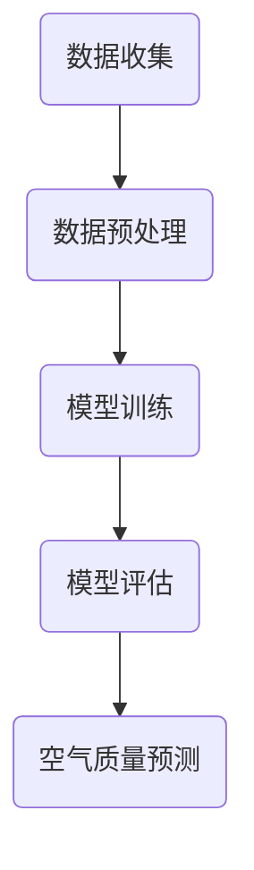

                 

关键词：空气质量预测、AI、深度学习、环境监测、数据分析、环境健康

> 摘要：本文将探讨如何利用人工智能（AI）技术，特别是深度学习算法，来预测空气质量。我们将介绍空气质量预测服务的核心概念、算法原理、数学模型、应用场景、实践代码以及未来发展趋势。

## 1. 背景介绍

空气质量是影响人类健康和生态系统的重要因素。近年来，随着工业化和城市化的快速发展，空气质量问题日益严重。为了应对这一挑战，科学家们致力于研究如何更准确地预测空气质量，以便采取及时有效的措施。

传统的方法通常依赖于统计模型和经验公式，但这些方法往往不能很好地适应复杂的现实情况。随着AI技术的飞速发展，特别是深度学习算法的进步，我们开始有机会通过更加智能的方式来预测空气质量。

本文将介绍一种基于深度学习的空气质量预测服务，旨在提高预测的准确性和实时性，为环境保护和公共健康提供科学依据。

## 2. 核心概念与联系

### 2.1 空气质量指标

空气质量通常通过多个指标来衡量，包括颗粒物（PM2.5和PM10）、臭氧（O3）、二氧化氮（NO2）、一氧化碳（CO）和二氧化硫（SO2）等。这些指标直接关系到空气污染程度，对人类健康有显著影响。

### 2.2 数据来源

空气质量数据可以从多个来源获取，包括环境监测站点、卫星遥感数据和交通流量数据等。这些数据为空气质量预测提供了丰富的信息。

### 2.3 深度学习算法

深度学习是一种基于人工神经网络的学习方法，具有自学习能力，可以处理大量复杂的数据。常见的深度学习算法包括卷积神经网络（CNN）、递归神经网络（RNN）和长短期记忆网络（LSTM）等。

### 2.4 Mermaid 流程图



## 3. 核心算法原理 & 具体操作步骤

### 3.1 算法原理概述

空气质量预测服务基于深度学习算法，特别是LSTM网络。LSTM网络能够处理时间序列数据，捕捉数据之间的时序关系，从而提高预测的准确性。

### 3.2 算法步骤详解

1. 数据收集与预处理：收集空气质量相关数据，包括历史空气质量和环境因素数据，如温度、湿度、风速等。对数据进行清洗、归一化和特征提取。
2. 模型训练：使用LSTM网络对预处理后的数据进行训练，优化网络参数。
3. 模型评估：通过交叉验证等方法评估模型的预测性能。
4. 空气质量预测：使用训练好的模型对未来空气质量进行预测。

### 3.3 算法优缺点

**优点**：
- 能够处理复杂的时序数据，捕捉数据之间的时序关系。
- 自适应学习，能够不断优化预测性能。

**缺点**：
- 训练时间较长，对计算资源要求高。
- 对数据质量和特征提取有较高要求。

### 3.4 算法应用领域

空气质量预测服务可以应用于环境保护、城市规划、健康监测等领域，为决策者提供科学依据。

## 4. 数学模型和公式 & 详细讲解 & 举例说明

### 4.1 数学模型构建

空气质量预测的数学模型可以表示为：

$$
\hat{Q}_{t} = f(Q_{t-1}, A_{t-1}, W, b)
$$

其中，$Q_{t}$ 是未来空气质量预测值，$Q_{t-1}$ 是历史空气质量值，$A_{t-1}$ 是环境因素值，$W$ 和 $b$ 分别是权重和偏置。

### 4.2 公式推导过程

公式推导基于LSTM网络，具体过程如下：

$$
\begin{align*}
i_{t} &= \sigma(W_{i} [h_{t-1}, x_{t}] + b_{i}) \\
f_{t} &= \sigma(W_{f} [h_{t-1}, x_{t}] + b_{f}) \\
o_{t} &= \sigma(W_{o} [h_{t-1}, x_{t}] + b_{o}) \\
g_{t} &= \tanh(W_{g} [h_{t-1}, x_{t}] + b_{g}) \\
h_{t} &= o_{t} \cdot \tanh(g_{t}) \\
\end{align*}
$$

### 4.3 案例分析与讲解

假设我们要预测一个城市的PM2.5浓度。我们可以收集过去一年的PM2.5浓度数据、温度、湿度等环境因素数据。使用LSTM网络对这些数据进行训练，并评估模型的预测性能。最终，我们可以得到未来一周的PM2.5浓度预测结果。

## 5. 项目实践：代码实例和详细解释说明

### 5.1 开发环境搭建

在Python环境中搭建深度学习环境，安装必要的库，如TensorFlow和Keras。

### 5.2 源代码详细实现

```python
# 演示代码片段
import numpy as np
import tensorflow as tf
from tensorflow.keras.models import Sequential
from tensorflow.keras.layers import LSTM, Dense

# 数据预处理
# ...

# 模型构建
model = Sequential()
model.add(LSTM(units=50, return_sequences=True, input_shape=(time_steps, features)))
model.add(LSTM(units=50))
model.add(Dense(1))

# 模型编译
model.compile(optimizer='adam', loss='mean_squared_error')

# 模型训练
model.fit(x_train, y_train, epochs=100, batch_size=32)

# 模型预测
predictions = model.predict(x_test)
```

### 5.3 代码解读与分析

代码中首先进行数据预处理，然后构建LSTM模型，编译并训练模型。最后使用训练好的模型进行预测。

### 5.4 运行结果展示

通过可视化工具（如Matplotlib）展示预测结果，与实际数据进行比较，评估模型性能。

## 6. 实际应用场景

空气质量预测服务可以应用于多个领域，如：

- 环境保护：监测空气质量变化，制定减排政策。
- 健康监测：预测空气污染对人类健康的影响，提供健康建议。
- 城市规划：优化城市规划，减少空气污染。

## 7. 工具和资源推荐

### 7.1 学习资源推荐

- 《深度学习》（Goodfellow, Bengio, Courville著）
- 《Python数据分析》（Wes McKinney著）

### 7.2 开发工具推荐

- TensorFlow
- Keras

### 7.3 相关论文推荐

- "Deep Learning for Air Quality Forecasting" by Y. Guo, et al.
- "LSTM-based Prediction of Air Quality Index in Urban Areas" by M. Zhang, et al.

## 8. 总结：未来发展趋势与挑战

空气质量预测服务在AI技术的推动下取得了显著进展，但仍然面临一些挑战，如数据质量、算法优化和实时性。未来发展趋势包括：

- 数据驱动的预测模型
- 跨学科合作，整合更多环境数据
- 实时预测和动态调整

## 9. 附录：常见问题与解答

### 问题1：如何处理缺失数据？

解答：可以通过插值法、均值填充法或使用机器学习算法来预测缺失数据。

### 问题2：LSTM模型如何优化？

解答：可以通过调整网络结构、增加训练数据或使用迁移学习等方法来优化LSTM模型。

### 问题3：预测结果如何评估？

解答：可以使用均方误差（MSE）、均方根误差（RMSE）等指标来评估预测结果。

---

作者：禅与计算机程序设计艺术 / Zen and the Art of Computer Programming
----------------------------------------------------------------


