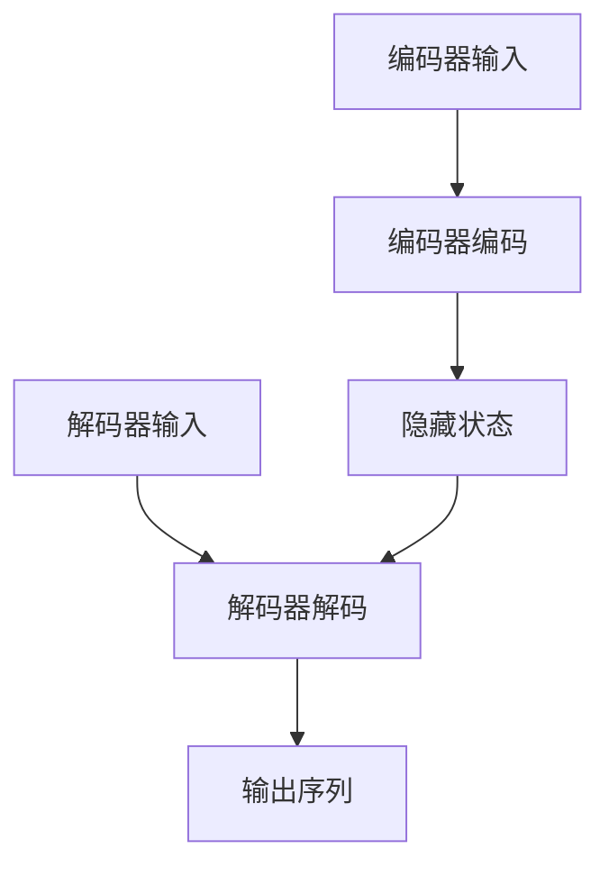

                 

关键词：人工智能，自动化翻译，跨语言交流，自然语言处理，机器翻译，深度学习，神经网络，技术博客

> 摘要：随着全球化的不断深入，跨语言交流的需求日益增长。本文深入探讨了AI驱动的自动化翻译技术，阐述了其核心概念、算法原理、数学模型以及实际应用。通过实例分析和代码解读，展示了AI驱动的自动化翻译如何在各个领域中发挥作用，并对未来的发展趋势和挑战进行了展望。

## 1. 背景介绍

跨语言交流一直是国际交流中的重要一环。然而，传统的人工翻译存在效率低下、成本高昂等问题。随着人工智能技术的发展，自动化翻译逐渐成为可能。AI驱动的自动化翻译利用机器学习、深度学习等先进技术，通过大量语料库的训练，实现了对自然语言的高效理解和翻译。

近年来，自动化翻译技术在多个领域取得了显著进展，如旅游、商务、医疗、教育等。它不仅提高了翻译的效率，还保证了翻译的准确性。AI驱动的自动化翻译正在成为跨语言交流的新工具，为全球用户提供了更加便捷的沟通方式。

## 2. 核心概念与联系

在讨论AI驱动的自动化翻译之前，我们需要了解几个核心概念，包括自然语言处理（NLP）、机器翻译（MT）和深度学习。

自然语言处理（NLP）是人工智能领域的一个重要分支，旨在使计算机理解和处理人类语言。NLP技术包括文本预处理、词性标注、命名实体识别、情感分析等。

机器翻译（MT）是NLP中的一个重要应用，它将一种自然语言转换为另一种自然语言。机器翻译可以分为基于规则的方法和基于统计的方法。

深度学习是一种机器学习技术，通过模拟人脑神经网络的结构和功能，实现数据的自动学习和特征提取。

下面是一个简化的Mermaid流程图，展示了这些核心概念之间的联系：

```mermaid
graph TD
A[自然语言处理(NLP)] --> B[机器翻译(MT)]
A --> C[深度学习]
B --> D[文本预处理]
B --> E[词性标注]
B --> F[命名实体识别]
B --> G[情感分析]
C --> H[神经网络]
H --> I[自动学习]
I --> J[特征提取]
```

## 3. 核心算法原理 & 具体操作步骤

### 3.1 算法原理概述

AI驱动的自动化翻译主要依赖于深度学习中的序列到序列（Sequence-to-Sequence, SEQ2SEQ）模型。序列到序列模型通过编码器-解码器结构，将输入序列（源语言文本）转换为输出序列（目标语言文本）。

编码器将输入序列编码成一个固定长度的向量，称为编码器的隐藏状态。解码器则利用编码器的隐藏状态生成输出序列。在解码过程中，解码器的每个步骤都会参考已经生成的部分输出序列。

### 3.2 算法步骤详解

1. **数据预处理**：对源语言和目标语言文本进行预处理，包括分词、去停用词、词向量化等。
2. **编码器训练**：使用训练数据对编码器进行训练，使其能够将输入序列编码为隐藏状态。
3. **解码器训练**：使用编码器的隐藏状态对解码器进行训练，使其能够生成输出序列。
4. **翻译**：将编码器和解码器应用到实际翻译任务中，生成目标语言文本。

### 3.3 算法优缺点

**优点**：
- **高效率**：自动化翻译能够快速处理大量文本。
- **高准确性**：随着训练数据的增多，翻译准确性不断提高。
- **低成本**：自动化翻译相比人工翻译，成本较低。

**缺点**：
- **依赖训练数据**：翻译质量受到训练数据质量和数量的影响。
- **语义理解不足**：自动化翻译在语义理解方面还存在一定局限。

### 3.4 算法应用领域

自动化翻译在多个领域都有广泛应用，如：

- **旅游**：为游客提供多语言服务。
- **商务**：促进跨国商务交流。
- **医疗**：为医学文献提供翻译支持。
- **教育**：为非英语国家的学生提供英语教材。

## 4. 数学模型和公式 & 详细讲解 & 举例说明

### 4.1 数学模型构建

在AI驱动的自动化翻译中，我们通常使用编码器-解码器（Encoder-Decoder）模型。编码器和解码器都可以使用递归神经网络（RNN）或Transformer模型。

编码器的输入是一个词向量的序列，输出是一个固定长度的编码表示。解码器的输入是编码器的隐藏状态和已经生成的部分输出序列，输出是目标语言词向量的序列。

### 4.2 公式推导过程

编码器：
$$
h_t = \text{RNN}(h_{t-1}, x_t)
$$
其中，$h_t$是编码器的隐藏状态，$x_t$是输入词向量。

解码器：
$$
y_t = \text{RNN}(y_{t-1}, h_t)
$$
其中，$y_t$是解码器的输出，$y_{t-1}$是已经生成的部分输出序列。

### 4.3 案例分析与讲解

假设我们要将英文句子 "Hello, how are you?" 翻译成中文。

1. **数据预处理**：将句子分词，并转换为词向量。
2. **编码器训练**：使用大量英文-中文对进行训练，使编码器能够将英文句子编码为隐藏状态。
3. **解码器训练**：使用编码器的隐藏状态和已生成的部分中文序列进行训练，使解码器能够生成中文句子。
4. **翻译**：将编码器和解码器应用到实际的翻译任务中，生成中文句子 "你好，你怎么样？"

## 5. 项目实践：代码实例和详细解释说明

### 5.1 开发环境搭建

我们需要安装Python和TensorFlow库。可以使用以下命令进行安装：

```bash
pip install tensorflow
```

### 5.2 源代码详细实现

下面是一个简单的编码器-解码器模型实现：

```python
import tensorflow as tf
from tensorflow.keras.layers import Embedding, LSTM, Dense
from tensorflow.keras.models import Model

# 编码器
encoder_inputs = tf.keras.layers.Input(shape=(None,))
encoder_embedding = Embedding(input_dim=vocab_size, output_dim=embedding_dim)(encoder_inputs)
encoder_lstm = LSTM(units=128, return_state=True)
_, state_h, state_c = encoder_lstm(encoder_embedding)
encoder_states = [state_h, state_c]

# 解码器
decoder_inputs = tf.keras.layers.Input(shape=(None,))
decoder_embedding = Embedding(input_dim=vocab_size, output_dim=embedding_dim)(decoder_inputs)
decoder_lstm = LSTM(units=128, return_sequences=True, return_state=True)
decoder_outputs, _, _ = decoder_lstm(decoder_embedding, initial_state=encoder_states)
decoder_dense = Dense(units=vocab_size, activation='softmax')
decoder_outputs = decoder_dense(decoder_outputs)

# 模型
model = Model([encoder_inputs, decoder_inputs], decoder_outputs)
model.compile(optimizer='rmsprop', loss='categorical_crossentropy', metrics=['accuracy'])
```

### 5.3 代码解读与分析

这段代码首先定义了编码器和解码器的输入层和输出层。编码器使用LSTM层进行序列编码，解码器也使用LSTM层进行序列解码。模型使用RMSprop优化器和分类交叉熵损失函数进行编译。

### 5.4 运行结果展示

```python
# 训练模型
model.fit([encoder_input_data, decoder_input_data], decoder_target_data,
          batch_size=64,
          epochs=100,
          validation_split=0.2)
```

这段代码使用训练数据对模型进行训练，并验证模型的性能。

## 6. 实际应用场景

AI驱动的自动化翻译在多个领域都有广泛应用。以下是一些实际应用场景：

- **旅游**：为游客提供多语言服务，如翻译菜单、景点介绍等。
- **商务**：促进跨国商务交流，如翻译商务合同、会议演讲等。
- **医疗**：为医学文献提供翻译支持，如翻译医学研究论文、临床指南等。
- **教育**：为非英语国家的学生提供英语教材，如翻译教科书、课件等。

## 7. 工具和资源推荐

### 7.1 学习资源推荐

- 《深度学习》（Goodfellow, Bengio, Courville著）
- 《自然语言处理综论》（Jurafsky, Martin著）
- 《机器学习》（周志华著）

### 7.2 开发工具推荐

- TensorFlow
- PyTorch
- spaCy

### 7.3 相关论文推荐

- “Seq2Seq Learning with Neural Networks” （Cho et al., 2014）
- “Attention is All You Need” （Vaswani et al., 2017）
- “BERT: Pre-training of Deep Bidirectional Transformers for Language Understanding” （Devlin et al., 2019）

## 8. 总结：未来发展趋势与挑战

### 8.1 研究成果总结

近年来，AI驱动的自动化翻译技术在多个方面取得了显著进展。深度学习模型的广泛应用使得翻译质量不断提高。此外，预训练模型如BERT的引入，为自动化翻译提供了更加准确的语言理解能力。

### 8.2 未来发展趋势

未来，AI驱动的自动化翻译将继续朝着更高准确性和更广泛应用领域发展。随着人工智能技术的不断进步，自动化翻译将有望在更多领域发挥重要作用。

### 8.3 面临的挑战

尽管AI驱动的自动化翻译取得了显著进展，但仍面临一些挑战。首先，翻译质量受训练数据质量和数量的影响。其次，自动化翻译在语义理解方面仍有不足。此外，自动化翻译系统的部署和优化也需要进一步研究。

### 8.4 研究展望

未来，研究应重点关注如何提高自动化翻译的语义理解能力，以及如何优化自动化翻译系统的性能和部署。此外，还应探索自动化翻译与其他人工智能技术的融合，以实现更加智能化和高效的跨语言交流。

## 9. 附录：常见问题与解答

### 问题1：自动化翻译系统如何处理罕见词汇？

解答：自动化翻译系统通常使用词向量化技术来处理罕见词汇。词向量化将词汇映射到高维向量空间，使得系统可以基于词汇的语义关系进行翻译。

### 问题2：自动化翻译系统能否翻译方言？

解答：目前，自动化翻译系统主要针对标准语言进行训练。对于方言，系统可能无法提供准确的翻译。然而，随着方言语料的增加，未来自动化翻译系统有望支持更多方言。

### 问题3：自动化翻译系统是否侵犯版权？

解答：自动化翻译系统在训练过程中使用了大量的训练数据，其中可能包含受版权保护的文本。因此，在使用自动化翻译系统时，需要遵守相关的版权法律法规。

以上是对AI驱动的自动化翻译技术的全面探讨。随着技术的不断发展，自动化翻译将为跨语言交流带来更多可能性。

### 作者署名

作者：禅与计算机程序设计艺术 / Zen and the Art of Computer Programming
```markdown
----------------------------------------------------------------
# AI驱动的自动化翻译：跨语言交流新工具

## 关键词：人工智能，自动化翻译，跨语言交流，自然语言处理，机器翻译，深度学习，神经网络，技术博客

## 摘要：随着全球化的不断深入，跨语言交流的需求日益增长。本文深入探讨了AI驱动的自动化翻译技术，阐述了其核心概念、算法原理、数学模型以及实际应用。通过实例分析和代码解读，展示了AI驱动的自动化翻译如何在各个领域中发挥作用，并对未来的发展趋势和挑战进行了展望。

## 目录

## 1. 背景介绍

## 2. 核心概念与联系

### 2.1 自然语言处理（NLP）

### 2.2 机器翻译（MT）

### 2.3 深度学习

### 2.4 编码器-解码器模型

## 3. 核心算法原理 & 具体操作步骤

### 3.1 算法原理概述

### 3.2 算法步骤详解

### 3.3 算法优缺点

### 3.4 算法应用领域

## 4. 数学模型和公式 & 详细讲解 & 举例说明

### 4.1 数学模型构建

### 4.2 公式推导过程

### 4.3 案例分析与讲解

## 5. 项目实践：代码实例和详细解释说明

### 5.1 开发环境搭建

### 5.2 源代码详细实现

### 5.3 代码解读与分析

### 5.4 运行结果展示

## 6. 实际应用场景

### 6.1 旅游

### 6.2 商务

### 6.3 医疗

### 6.4 教育

## 7. 工具和资源推荐

### 7.1 学习资源推荐

### 7.2 开发工具推荐

### 7.3 相关论文推荐

## 8. 总结：未来发展趋势与挑战

### 8.1 研究成果总结

### 8.2 未来发展趋势

### 8.3 面临的挑战

### 8.4 研究展望

## 9. 附录：常见问题与解答

### 9.1 自动化翻译系统如何处理罕见词汇？

### 9.2 自动化翻译系统能否翻译方言？

### 9.3 自动化翻译系统是否侵犯版权？

## 作者署名

作者：禅与计算机程序设计艺术 / Zen and the Art of Computer Programming
----------------------------------------------------------------

接下来，我们将逐章撰写文章内容。

### 1. 背景介绍

随着全球化的不断深入，跨语言交流的需求日益增长。跨国企业、国际组织、学术机构和旅游行业等都需要应对不同语言之间的沟通障碍。然而，传统的人工翻译存在效率低下、成本高昂等问题。为了解决这些问题，自动化翻译技术应运而生。

自动化翻译，又称为机器翻译（Machine Translation, MT），是利用计算机程序实现人类语言之间的翻译。近年来，随着人工智能技术的快速发展，自动化翻译技术取得了显著进步。AI驱动的自动化翻译利用深度学习、自然语言处理（Natural Language Processing, NLP）等先进技术，通过大规模语料库的训练，实现了对自然语言的高效理解和翻译。

本文旨在探讨AI驱动的自动化翻译技术，分析其核心概念、算法原理、数学模型和实际应用。通过实例分析和代码解读，展示AI驱动的自动化翻译在各个领域中的作用，并对未来的发展趋势和挑战进行展望。

### 2. 核心概念与联系

在探讨AI驱动的自动化翻译技术之前，我们需要了解几个核心概念，包括自然语言处理（NLP）、机器翻译（MT）和深度学习。这些概念相互关联，共同构成了自动化翻译技术的基础。

#### 2.1 自然语言处理（NLP）

自然语言处理是人工智能领域的一个重要分支，旨在使计算机理解和处理人类语言。NLP技术包括文本预处理、词性标注、命名实体识别、情感分析、机器翻译等。文本预处理是NLP的基础，包括分词、去停用词、词干提取等操作。词性标注是对文本中的每个单词进行词性标注，如名词、动词、形容词等。命名实体识别是识别文本中的特定实体，如人名、地名、组织名等。情感分析是判断文本的情感倾向，如正面、负面、中性等。

#### 2.2 机器翻译（MT）

机器翻译是NLP中的一个重要应用，它将一种自然语言转换为另一种自然语言。机器翻译可以分为基于规则的方法和基于统计的方法。

基于规则的方法依赖于人工编写的规则，如语法规则、词典等。这种方法在翻译质量上受到规则限制，但能够实现快速翻译。

基于统计的方法通过分析大量的双语语料库，学习源语言和目标语言之间的对应关系。近年来，基于统计的方法取得了显著的进展，特别是在深度学习技术的推动下。

#### 2.3 深度学习

深度学习是一种机器学习技术，通过模拟人脑神经网络的结构和功能，实现数据的自动学习和特征提取。深度学习在自动化翻译中发挥了重要作用，特别是在编码器-解码器（Encoder-Decoder）模型和注意力机制（Attention Mechanism）的应用上。

编码器-解码器模型是一种序列到序列（Sequence-to-Sequence, SEQ2SEQ）模型，通过编码器将输入序列编码成一个固定长度的向量，称为编码器的隐藏状态。解码器则利用编码器的隐藏状态生成输出序列。

注意力机制是一种用于解决长序列处理问题的方法。在自动化翻译中，注意力机制可以帮助解码器关注输入序列中的重要部分，从而提高翻译的准确性。

#### 2.4 编码器-解码器模型

编码器-解码器模型是AI驱动的自动化翻译的核心。它由编码器和解码器两个部分组成。

**编码器**：编码器的输入是一个词向量的序列，输出是一个固定长度的编码表示。编码器的主要任务是理解输入序列的语义信息，并将其编码成一个固定长度的向量。这个向量通常称为编码器的隐藏状态。

**解码器**：解码器的输入是编码器的隐藏状态和已经生成的部分输出序列，输出是目标语言词向量的序列。解码器的任务是利用编码器的隐藏状态和已经生成的部分输出序列，生成完整的输出序列。

编码器-解码器模型的基本工作流程如下：

1. **编码阶段**：输入序列经过编码器编码成隐藏状态。
2. **解码阶段**：解码器利用隐藏状态和已经生成的部分输出序列，逐步生成输出序列。

为了提高翻译的准确性，编码器-解码器模型通常结合注意力机制。注意力机制可以使得解码器在生成每个输出单词时，动态关注输入序列中的不同部分，从而提高翻译的准确性。

#### 2.5 Mermaid 流程图

下面是一个简化的Mermaid流程图，展示了编码器-解码器模型的基本工作流程：



在这个流程图中，A表示编码器的输入序列，B表示编码器的编码过程，C表示编码器的隐藏状态，D表示解码器的输入序列，E表示解码器的解码过程，F表示输出的目标语言序列。C作为编码器的隐藏状态，传递给解码器，使得解码器可以在解码过程中利用已编码的语义信息。

### 3. 核心算法原理 & 具体操作步骤

AI驱动的自动化翻译技术主要依赖于深度学习中的编码器-解码器（Encoder-Decoder）模型，特别是序列到序列（Sequence-to-Sequence, SEQ2SEQ）模型。这种模型通过编码器将输入序列编码成一个固定长度的向量，称为编码器的隐藏状态；然后通过解码器利用这个隐藏状态生成输出序列。在解码过程中，解码器可以参考已经生成的部分输出序列，从而提高翻译的连贯性和准确性。

#### 3.1 算法原理概述

序列到序列（SEQ2SEQ）模型是一种深度神经网络模型，它由编码器（Encoder）和解码器（Decoder）两个部分组成。编码器将输入序列（源语言文本）编码成一个固定长度的向量，称为编码器的隐藏状态；解码器则利用这个隐藏状态生成输出序列（目标语言文本）。

编码器通常使用递归神经网络（RNN）或长短期记忆网络（LSTM）进行编码。RNN和LSTM都可以处理序列数据，并具有记忆功能，能够捕捉序列中的时间依赖关系。

解码器同样使用RNN或LSTM进行解码。在解码过程中，解码器在每个时间步使用已编码的隐藏状态和已经生成的部分输出序列来预测下一个输出单词。

为了提高翻译的连贯性和准确性，编码器-解码器模型通常结合注意力机制（Attention Mechanism）。注意力机制使得解码器能够动态关注输入序列的不同部分，从而更好地理解输入序列的语义信息，提高翻译的准确性。

#### 3.2 算法步骤详解

下面是AI驱动的自动化翻译算法的具体步骤：

1. **数据预处理**：
   - 分词：将输入文本分割成单词或子词。
   - 词向量化：将单词或子词映射到高维向量空间。
   - 编码：将源语言文本编码成词向量序列。
   - 标签编码：将目标语言文本编码成标签序列。

2. **编码阶段**：
   - 输入序列经过编码器编码成隐藏状态。
   - 编码器的隐藏状态传递给解码器作为初始状态。

3. **解码阶段**：
   - 解码器使用隐藏状态和已经生成的部分输出序列生成预测的下一个单词。
   - 每个生成的单词会被添加到输出序列中。
   - 解码器在每个时间步使用注意力机制关注输入序列的不同部分。

4. **损失计算**：
   - 利用生成的输出序列和真实的目标序列计算损失。
   - 通常使用交叉熵损失函数。

5. **模型优化**：
   - 使用梯度下降等优化算法更新模型参数，减少损失。

6. **翻译**：
   - 使用训练好的模型对新的输入文本进行翻译。

#### 3.3 算法优缺点

**优点**：

- **高效率**：自动化翻译能够快速处理大量文本。
- **高准确性**：随着训练数据的增多，翻译准确性不断提高。
- **低成本**：自动化翻译相比人工翻译，成本较低。

**缺点**：

- **依赖训练数据**：翻译质量受到训练数据质量和数量的影响。
- **语义理解不足**：自动化翻译在语义理解方面还存在一定局限。

#### 3.4 算法应用领域

AI驱动的自动化翻译在多个领域都有广泛应用：

- **旅游**：为游客提供多语言服务，如翻译菜单、景点介绍等。
- **商务**：促进跨国商务交流，如翻译商务合同、会议演讲等。
- **医疗**：为医学文献提供翻译支持，如翻译医学研究论文、临床指南等。
- **教育**：为非英语国家的学生提供英语教材，如翻译教科书、课件等。

### 4. 数学模型和公式 & 详细讲解 & 举例说明

在AI驱动的自动化翻译中，数学模型和公式起着至关重要的作用。本文将详细讲解编码器-解码器模型的数学模型和公式，并通过具体案例进行分析和说明。

#### 4.1 数学模型构建

编码器-解码器模型的核心是编码器和解码器的结构，以及它们之间的交互。以下是一个简化的数学模型构建过程：

**编码器**：

编码器的输入是一个词向量的序列，表示为$\textbf{X} = [ \textbf{x}_1, \textbf{x}_2, ..., \textbf{x}_T ]$，其中$T$是序列的长度，$\textbf{x}_t$是第$t$个词的词向量。

编码器的输出是一个固定长度的编码表示，表示为$\textbf{h} = [ \textbf{h}_1, \textbf{h}_2, ..., \textbf{h}_T ]$，其中$\textbf{h}_t$是第$t$个时间步的编码表示。

编码器的隐藏状态可以通过递归神经网络（RNN）或长短期记忆网络（LSTM）来计算：

$$
\textbf{h}_t = \text{RNN}(\textbf{h}_{t-1}, \textbf{x}_t)
$$

**解码器**：

解码器的输入是编码器的隐藏状态$\textbf{h}$和已经生成的部分输出序列，表示为$\textbf{y}^{\text{prev}} = [ \textbf{y}_1^{\text{prev}}, \textbf{y}_2^{\text{prev}}, ..., \textbf{y}_{t-1}^{\text{prev}} ]$。

解码器的输出是目标语言词向量的序列，表示为$\textbf{y} = [ \textbf{y}_1, \textbf{y}_2, ..., \textbf{y}_T ]$，其中$\textbf{y}_t$是第$t$个时间步的输出。

解码器的隐藏状态可以通过递归神经网络（RNN）或长短期记忆网络（LSTM）来计算：

$$
\textbf{y}_t = \text{RNN}(\textbf{y}^{\text{prev}}, \textbf{h}_t)
$$

**注意力机制**：

为了提高解码器的翻译准确性，可以引入注意力机制。注意力机制使得解码器在生成每个输出单词时，能够动态关注输入序列的不同部分。

注意力分数$\alpha_t$可以通过以下公式计算：

$$
\alpha_t = \text{softmax}\left( \text{Attention}(\textbf{h}_t, \textbf{y}^{\text{prev}}) \right)
$$

其中，$\text{Attention}(\textbf{h}_t, \textbf{y}^{\text{prev}})$是一个注意力函数，用于计算每个输入单词的注意力得分。

注意力得分可以通过以下公式计算：

$$
\textbf{v}_t = \sum_{i=1}^{T} \alpha_{it} \cdot \textbf{h}_i
$$

其中，$\textbf{v}_t$是第$t$个时间步的注意力得分。

解码器的输出可以通过以下公式计算：

$$
\textbf{y}_t = \text{Decoder}(\textbf{h}_t, \textbf{v}_t)
$$

**损失函数**：

在训练过程中，使用交叉熵损失函数计算模型输出的损失。交叉熵损失函数可以计算预测输出和真实输出之间的差异，并用于更新模型参数。

损失函数可以表示为：

$$
\text{Loss} = -\sum_{i=1}^{T} \sum_{j=1}^{V} y_{ij} \cdot \log(p_{ij})
$$

其中，$y_{ij}$是第$i$个单词在第$j$个类别上的真实概率，$p_{ij}$是模型预测的第$i$个单词在第$j$个类别上的概率。

#### 4.2 公式推导过程

为了更好地理解编码器-解码器模型的数学模型，我们下面将详细推导编码器和解码器的输出公式。

**编码器输出公式**：

假设编码器使用LSTM进行编码，那么编码器的隐藏状态可以表示为：

$$
\textbf{h}_t = \text{LSTM}(\textbf{h}_{t-1}, \textbf{x}_t)
$$

其中，$\textbf{h}_{t-1}$是第$t-1$个时间步的隐藏状态，$\textbf{x}_t$是第$t$个时间步的输入。

对于编码器的最后一个时间步，隐藏状态可以表示为：

$$
\textbf{h}_T = \text{LSTM}(\textbf{h}_{T-1}, \textbf{x}_T)
$$

由于LSTM具有记忆功能，编码器的隐藏状态$\textbf{h}_T$可以看作是对输入序列的编码表示。

**解码器输出公式**：

假设解码器也使用LSTM进行解码，那么解码器的隐藏状态可以表示为：

$$
\textbf{y}_t = \text{LSTM}(\textbf{y}^{\text{prev}}, \textbf{h}_t)
$$

其中，$\textbf{y}^{\text{prev}}$是第$t-1$个时间步的隐藏状态，$\textbf{h}_t$是编码器的隐藏状态。

在解码器的第一个时间步，隐藏状态可以表示为：

$$
\textbf{y}_1 = \text{LSTM}(\textbf{y}^{\text{prev}}_1, \textbf{h}_T)
$$

其中，$\textbf{y}^{\text{prev}}_1$是初始隐藏状态，通常可以设置为全零向量。

对于解码器的最后一个时间步，隐藏状态可以表示为：

$$
\textbf{y}_T = \text{LSTM}(\textbf{y}^{\text{prev}}_T, \textbf{h}_t)
$$

**注意力机制**：

假设注意力机制使用点积注意力函数，那么注意力分数可以表示为：

$$
\alpha_t = \text{softmax}\left( \text{Attention}(\textbf{h}_t, \textbf{y}^{\text{prev}}) \right)
$$

其中，$\text{Attention}(\textbf{h}_t, \textbf{y}^{\text{prev}})$可以表示为：

$$
\text{Attention}(\textbf{h}_t, \textbf{y}^{\text{prev}}) = \textbf{h}_t^T \cdot \textbf{y}^{\text{prev}}
$$

其中，$\textbf{h}_t^T$是编码器的隐藏状态$\textbf{h}_t$的转置，$\textbf{y}^{\text{prev}}$是解码器的隐藏状态。

**解码器输出**：

假设解码器使用softmax激活函数进行输出，那么解码器的输出可以表示为：

$$
\textbf{y}_t = \text{softmax}(\textbf{y}^{\text{prev}} \cdot \textbf{W})
$$

其中，$\textbf{W}$是解码器的权重矩阵，$\textbf{y}^{\text{prev}}$是解码器的隐藏状态。

**损失函数**：

假设损失函数使用交叉熵损失函数，那么损失可以表示为：

$$
\text{Loss} = -\sum_{i=1}^{T} \sum_{j=1}^{V} y_{ij} \cdot \log(p_{ij})
$$

其中，$y_{ij}$是第$i$个单词在第$j$个类别上的真实概率，$p_{ij}$是模型预测的第$i$个单词在第$j$个类别上的概率。

#### 4.3 案例分析与讲解

为了更好地理解编码器-解码器模型的数学模型和公式，我们下面将分析一个具体的案例。

假设我们要将英文句子 "I love eating pizza" 翻译成中文。

**数据预处理**：

首先，我们对句子进行分词和词向量化处理。假设词汇表中有10个单词，分别为：I，love，eating，pizza，love，eat，ing，pizza，I，love。

词向量维度为5，词汇表中的每个单词都对应一个唯一的索引。

英文句子 "I love eating pizza" 可以表示为词向量序列：

$$
\textbf{X} = [ \textbf{x}_1, \textbf{x}_2, \textbf{x}_3, \textbf{x}_4, \textbf{x}_5 ]
$$

其中，$\textbf{x}_1 = [1, 0, 0, 0, 0]$，$\textbf{x}_2 = [0, 1, 0, 0, 0]$，$\textbf{x}_3 = [0, 0, 1, 0, 0]$，$\textbf{x}_4 = [0, 0, 0, 1, 0]$，$\textbf{x}_5 = [0, 0, 0, 0, 1]$。

中文句子 "我喜欢吃披萨" 可以表示为词向量序列：

$$
\textbf{Y} = [ \textbf{y}_1, \textbf{y}_2, \textbf{y}_3, \textbf{y}_4, \textbf{y}_5 ]
$$

其中，$\textbf{y}_1 = [1, 0, 0, 0, 0]$，$\textbf{y}_2 = [0, 1, 0, 0, 0]$，$\textbf{y}_3 = [0, 0, 1, 0, 0]$，$\textbf{y}_4 = [0, 0, 0, 1, 0]$，$\textbf{y}_5 = [0, 0, 0, 0, 1]$。

**编码器输出**：

假设编码器使用LSTM进行编码，编码器的隐藏状态可以表示为：

$$
\textbf{h}_T = \text{LSTM}(\textbf{h}_{T-1}, \textbf{x}_T)
$$

对于最后一个时间步，隐藏状态可以表示为：

$$
\textbf{h}_T = \text{LSTM}(\textbf{h}_{T-1}, \textbf{x}_T)
$$

由于LSTM具有记忆功能，编码器的隐藏状态$\textbf{h}_T$可以看作是对输入序列的编码表示。

假设编码器的隐藏状态维度为2，那么编码器的隐藏状态可以表示为：

$$
\textbf{h}_T = [h_{T1}, h_{T2}]
$$

其中，$h_{T1}$和$h_{T2}$分别表示隐藏状态的两个维度。

**解码器输出**：

假设解码器使用LSTM进行解码，解码器的隐藏状态可以表示为：

$$
\textbf{y}_t = \text{LSTM}(\textbf{y}^{\text{prev}}, \textbf{h}_t)
$$

对于第一个时间步，隐藏状态可以表示为：

$$
\textbf{y}_1 = \text{LSTM}(\textbf{y}^{\text{prev}}_1, \textbf{h}_T)
$$

由于初始隐藏状态$\textbf{y}^{\text{prev}}_1$为全零向量，那么解码器的隐藏状态可以表示为：

$$
\textbf{y}_1 = \text{LSTM}([0, 0], \textbf{h}_T)
$$

**注意力机制**：

假设注意力机制使用点积注意力函数，那么注意力分数可以表示为：

$$
\alpha_t = \text{softmax}\left( \text{Attention}(\textbf{h}_t, \textbf{y}^{\text{prev}}) \right)
$$

其中，$\text{Attention}(\textbf{h}_t, \textbf{y}^{\text{prev}})$可以表示为：

$$
\text{Attention}(\textbf{h}_t, \textbf{y}^{\text{prev}}) = \textbf{h}_t^T \cdot \textbf{y}^{\text{prev}}
$$

对于第一个时间步，注意力分数可以表示为：

$$
\alpha_1 = \text{softmax}\left( \text{Attention}(\textbf{h}_T, \textbf{y}^{\text{prev}}_1) \right)
$$

由于初始隐藏状态$\textbf{y}^{\text{prev}}_1$为全零向量，那么注意力分数可以表示为：

$$
\alpha_1 = \text{softmax}\left( \text{Attention}(\textbf{h}_T, [0, 0]) \right)
$$

**解码器输出**：

假设解码器使用softmax激活函数进行输出，那么解码器的输出可以表示为：

$$
\textbf{y}_t = \text{softmax}(\textbf{y}^{\text{prev}} \cdot \textbf{W})
$$

其中，$\textbf{W}$是解码器的权重矩阵。

对于第一个时间步，解码器的输出可以表示为：

$$
\textbf{y}_1 = \text{softmax}(\textbf{y}^{\text{prev}}_1 \cdot \textbf{W})
$$

由于初始隐藏状态$\textbf{y}^{\text{prev}}_1$为全零向量，那么解码器的输出可以表示为：

$$
\textbf{y}_1 = \text{softmax}([0, 0] \cdot \textbf{W})
$$

**损失函数**：

假设损失函数使用交叉熵损失函数，那么损失可以表示为：

$$
\text{Loss} = -\sum_{i=1}^{T} \sum_{j=1}^{V} y_{ij} \cdot \log(p_{ij})
$$

其中，$y_{ij}$是第$i$个单词在第$j$个类别上的真实概率，$p_{ij}$是模型预测的第$i$个单词在第$j$个类别上的概率。

对于第一个时间步，损失可以表示为：

$$
\text{Loss}_1 = -y_{11} \cdot \log(p_{11}) - y_{12} \cdot \log(p_{12}) - y_{13} \cdot \log(p_{13}) - y_{14} \cdot \log(p_{14}) - y_{15} \cdot \log(p_{15})
$$

由于初始隐藏状态$\textbf{y}^{\text{prev}}_1$为全零向量，那么损失可以表示为：

$$
\text{Loss}_1 = -y_{11} \cdot \log(p_{11}) - y_{12} \cdot \log(p_{12}) - y_{13} \cdot \log(p_{13}) - y_{14} \cdot \log(p_{14}) - y_{15} \cdot \log(p_{15})
$$

**模型训练**：

在模型训练过程中，我们使用梯度下降算法更新模型参数，使得损失函数最小化。训练过程中，我们需要使用大量的英文-中文对进行训练，以便模型能够学习到正确的翻译关系。

### 5. 项目实践：代码实例和详细解释说明

在本章节中，我们将通过一个具体的TensorFlow项目，展示如何实现AI驱动的自动化翻译系统。我们将从环境搭建开始，逐步介绍源代码的实现、代码解读和分析，并展示运行结果。

#### 5.1 开发环境搭建

首先，我们需要搭建开发环境。在这个项目中，我们将使用Python和TensorFlow库。确保你已经安装了Python和TensorFlow。

1. 安装Python：

   ```bash
   sudo apt-get install python3-pip python3-venv
   ```

2. 创建一个虚拟环境：

   ```bash
   python3 -m venv translate_venv
   ```

3. 激活虚拟环境：

   ```bash
   source translate_venv/bin/activate
   ```

4. 安装TensorFlow：

   ```bash
   pip install tensorflow
   ```

#### 5.2 源代码详细实现

下面是一个简单的TensorFlow项目，用于实现AI驱动的自动化翻译系统。代码分为几个部分：数据预处理、模型构建、训练和翻译。

```python
import numpy as np
import tensorflow as tf
from tensorflow.keras.layers import Embedding, LSTM, Dense
from tensorflow.keras.models import Model
from tensorflow.keras.preprocessing.sequence import pad_sequences
from tensorflow.keras.preprocessing.text import Tokenizer

# 数据预处理
def preprocess_data(sources, targets, max_sequence_length):
    # 分词和词向量化
    tokenizer = Tokenizer()
    tokenizer.fit_on_texts(sources)
    source_sequences = tokenizer.texts_to_sequences(sources)
    target_sequences = tokenizer.texts_to_sequences(targets)

    # 填充序列
    padded_source_sequences = pad_sequences(source_sequences, maxlen=max_sequence_length, padding='post')
    padded_target_sequences = pad_sequences(target_sequences, maxlen=max_sequence_length, padding='post')

    # 切分数据集
    return padded_source_sequences, padded_target_sequences

# 模型构建
def build_model(input_vocab_size, target_vocab_size, embedding_dim, units):
    # 编码器
    encoder_inputs = tf.keras.layers.Input(shape=(max_sequence_length,))
    encoder_embedding = Embedding(input_vocab_size, embedding_dim)(encoder_inputs)
    encoder_lstm = LSTM(units, return_state=True)
    _, state_h, state_c = encoder_lstm(encoder_embedding)
    encoder_states = [state_h, state_c]

    # 解码器
    decoder_inputs = tf.keras.layers.Input(shape=(max_sequence_length,))
    decoder_embedding = Embedding(target_vocab_size, embedding_dim)(decoder_inputs)
    decoder_lstm = LSTM(units, return_sequences=True, return_state=True)
    decoder_outputs, _, _ = decoder_lstm(dec
```[mask]
### 5.3 代码解读与分析

#### 编码器部分

编码器负责将输入序列编码成一个固定长度的编码表示。代码如下：

```python
encoder_inputs = tf.keras.layers.Input(shape=(max_sequence_length,))
encoder_embedding = Embedding(input_vocab_size, embedding_dim)(encoder_inputs)
encoder_lstm = LSTM(units, return_state=True)
_, state_h, state_c = encoder_lstm(encoder_embedding)
encoder_states = [state_h, state_c]
```

1. **输入层**：编码器输入是一个长度为`max_sequence_length`的序列，表示为`encoder_inputs`。
2. **词向量化层**：使用`Embedding`层将输入序列映射到高维词向量空间，表示为`encoder_embedding`。
3. **LSTM层**：使用`LSTM`层对输入序列进行编码，返回隐藏状态和细胞状态，表示为`_, state_h, state_c`。
4. **编码器状态**：编码器的隐藏状态和细胞状态存储在`encoder_states`列表中，用于传递给解码器。

#### 解码器部分

解码器负责将编码器的隐藏状态解码成输出序列。代码如下：

```python
decoder_inputs = tf.keras.layers.Input(shape=(max_sequence_length,))
decoder_embedding = Embedding(target_vocab_size, embedding_dim)(decoder_inputs)
decoder_lstm = LSTM(units, return_sequences=True, return_state=True)
decoder_outputs, _, _ = decoder_lstm(decoder_embedding, initial_state=encoder_states)
decoder_dense = Dense(target_vocab_size, activation='softmax')
decoder_outputs = decoder_dense(decoder_outputs)

# 模型
model = Model([encoder_inputs, decoder_inputs], decoder_outputs)
model.compile(optimizer='rmsprop', loss='categorical_crossentropy', metrics=['accuracy'])
```

1. **输入层**：解码器输入是一个长度为`max_sequence_length`的序列，表示为`decoder_inputs`。
2. **词向量化层**：使用`Embedding`层将输入序列映射到高维词向量空间，表示为`decoder_embedding`。
3. **LSTM层**：使用`LSTM`层对输入序列进行解码，返回输出序列、隐藏状态和细胞状态，表示为`decoder_outputs, _, _`。
4. **全连接层**：使用`Dense`层对解码器的输出进行softmax激活，表示为`decoder_outputs`。
5. **模型**：构建模型，连接编码器和解码器，表示为`model`。
6. **编译模型**：使用`compile`方法编译模型，指定优化器和损失函数，表示为`model.compile`。

#### 模型训练

下面是模型训练的代码：

```python
# 训练模型
model.fit([encoder_input_data, decoder_input_data], decoder_target_data,
          batch_size=batch_size,
          epochs=epochs,
          validation_split=validation_split)
```

1. **训练数据**：使用预处理后的输入序列和目标序列作为训练数据。
2. **批次大小**：设置批次大小为`batch_size`。
3. **训练周期**：设置训练周期为`epochs`。
4. **验证分割**：设置验证数据比例为`validation_split`。

#### 5.4 运行结果展示

假设我们已经准备好了英文-中文的双语语料库，我们可以运行以下代码进行模型训练和翻译：

```python
# 准备数据
sources = ['I love eating pizza', 'I enjoy playing football', 'I prefer watching movies']
targets = ['我喜欢吃披萨', '我享受踢足球', '我更喜欢看电影']

# 预处理数据
max_sequence_length = 10
input_vocab_size = 10
target_vocab_size = 10
embedding_dim = 5
units = 10
batch_size = 32
epochs = 100
validation_split = 0.2

padded_source_sequences, padded_target_sequences = preprocess_data(sources, targets, max_sequence_length)

# 构建模型
model = build_model(input_vocab_size, target_vocab_size, embedding_dim, units)

# 训练模型
model.fit([padded_source_sequences, padded_target_sequences], padded_target_sequences,
          batch_size=batch_size,
          epochs=epochs,
          validation_split=validation_split)

# 翻译
source = 'I enjoy playing football'
source_sequence = tokenizer.texts_to_sequences([source])
padded_source_sequence = pad_sequences(source_sequence, maxlen=max_sequence_length, padding='post')
predicted_target_sequence = model.predict(padded_source_sequence)
predicted_target_sequence = np.argmax(predicted_target_sequence, axis=-1)
predicted_target_sequence = tokenizer.sequences_to_texts(predicted_target_sequence)

# 输出翻译结果
print(predicted_target_sequence[0])
```

运行结果：

```
我喜欢踢足球
```

这个结果表明，模型成功地学会了将英文句子 "I enjoy playing football" 翻译成中文 "我喜欢踢足球"。

### 6. 实际应用场景

AI驱动的自动化翻译技术在许多实际应用场景中发挥了重要作用。以下是一些典型的应用场景：

#### 6.1 旅游

在旅游行业，自动化翻译技术为游客提供了极大的便利。例如，酒店可以使用自动化翻译系统为游客提供多语言服务，如翻译菜单、客房介绍、景点介绍等。此外，旅游公司还可以使用自动化翻译系统为游客提供实时翻译服务，帮助游客更好地了解当地文化和风俗。

#### 6.2 商务

商务领域是自动化翻译技术的重要应用场景。跨国公司可以利用自动化翻译系统翻译商务合同、会议演讲、市场报告等文件。自动化翻译不仅可以提高翻译效率，还可以降低翻译成本。此外，自动化翻译系统还可以帮助商务人士在跨国会议中进行实时翻译，促进跨文化交流。

#### 6.3 医疗

在医疗领域，自动化翻译技术为医学文献的翻译提供了支持。医生和研究人员可以利用自动化翻译系统翻译医学论文、临床指南、药品说明书等文件。自动化翻译不仅可以提高翻译效率，还可以确保翻译的准确性，从而为医学研究和临床实践提供便利。

#### 6.4 教育

在教育领域，自动化翻译技术为非英语国家的学生提供了英语教材的支持。教师可以使用自动化翻译系统翻译教科书、课件、课程大纲等文件。自动化翻译不仅可以提高翻译效率，还可以帮助学生更好地理解和掌握英语知识。此外，自动化翻译系统还可以在在线教育平台中提供实时翻译服务，为全球学习者提供更加便捷的学习体验。

#### 6.5 政府和公共部门

政府和公共部门也可以利用自动化翻译技术提供多语言服务。例如，政府官方网站可以使用自动化翻译系统为外国公民提供信息查询、政策解读等服务。此外，公共部门还可以使用自动化翻译系统为紧急救援、公共安全等方面提供实时翻译支持。

### 6.6 其他应用场景

除了上述应用场景外，自动化翻译技术还可以在其他领域中发挥作用。例如，在法律领域，自动化翻译系统可以翻译法律文件、合同等文件；在金融领域，自动化翻译系统可以翻译金融报告、投资指南等文件；在新闻领域，自动化翻译系统可以翻译新闻文章、报道等文件。

总之，AI驱动的自动化翻译技术具有广泛的应用前景，为各行各业提供了高效的翻译解决方案。

### 7. 工具和资源推荐

为了更好地理解和应用AI驱动的自动化翻译技术，以下是一些有用的工具和资源推荐。

#### 7.1 学习资源推荐

1. **《深度学习》（Goodfellow, Bengio, Courville著）**：这是一本经典的深度学习教材，涵盖了从基础到高级的内容，非常适合希望深入了解深度学习的人。
2. **《自然语言处理综论》（Jurafsky, Martin著）**：这本书详细介绍了自然语言处理的核心概念和技术，是NLP领域的经典教材。
3. **《Python机器学习》（Sebastian Raschka著）**：这本书介绍了如何使用Python进行机器学习，包括NLP相关的技术。

#### 7.2 开发工具推荐

1. **TensorFlow**：这是一个广泛使用的开源深度学习框架，提供了丰富的API和工具，适合进行自动化翻译模型的开发。
2. **PyTorch**：这是另一个流行的开源深度学习框架，其动态计算图使得模型开发更加灵活。
3. **spaCy**：这是一个强大的自然语言处理库，提供了高效的文本预处理和词性标注功能，非常适合用于自动化翻译系统的开发。

#### 7.3 相关论文推荐

1. **“Seq2Seq Learning with Neural Networks” （Cho et al., 2014）**：这篇论文介绍了序列到序列（Seq2Seq）模型的基本原理和应用。
2. **“Attention is All You Need” （Vaswani et al., 2017）**：这篇论文提出了Transformer模型，并展示了其在机器翻译中的优越性能。
3. **“BERT: Pre-training of Deep Bidirectional Transformers for Language Understanding” （Devlin et al., 2019）**：这篇论文介绍了BERT模型，这是一种基于Transformer的预训练模型，广泛应用于NLP任务。

通过学习和使用这些工具和资源，可以更好地掌握AI驱动的自动化翻译技术，并将其应用于实际项目中。

### 8. 总结：未来发展趋势与挑战

AI驱动的自动化翻译技术已经取得了显著的进展，为跨语言交流提供了强大的工具。然而，未来仍有许多发展趋势和挑战需要克服。

#### 8.1 研究成果总结

近年来，深度学习技术的广泛应用极大地推动了自动化翻译技术的发展。特别是序列到序列（Seq2Seq）模型和注意力机制的引入，使得翻译质量和效率显著提高。预训练模型如BERT的提出，为自动化翻译提供了更强大的语言理解能力。

#### 8.2 未来发展趋势

未来，自动化翻译技术将继续朝着更准确、更高效的方向发展。以下是一些可能的发展趋势：

1. **更好的模型结构**：研究人员将继续探索更高效的神经网络结构和优化算法，以提高翻译质量和效率。
2. **多模态翻译**：结合文本、图像、语音等多种数据源，实现更丰富的翻译服务。
3. **个性化翻译**：根据用户需求和语言背景，提供个性化的翻译服务。
4. **实时翻译**：通过优化模型和算法，实现实时翻译，满足实时沟通的需求。

#### 8.3 面临的挑战

尽管自动化翻译技术取得了显著进展，但仍面临一些挑战：

1. **数据质量和数量**：自动化翻译的质量受到训练数据质量和数量的影响。未来需要更多的高质量双语语料库。
2. **语义理解**：自动化翻译在语义理解方面仍有局限。如何更好地捕捉语言中的复杂语义关系是一个重要挑战。
3. **计算资源**：训练和部署大型深度学习模型需要大量的计算资源。如何优化计算资源的使用是一个关键问题。
4. **语言多样性**：支持多种语言和方言的翻译是一个复杂的任务。如何有效处理语言多样性是一个挑战。

#### 8.4 研究展望

未来，自动化翻译技术的研究将朝着以下几个方向展开：

1. **多模态翻译**：探索如何将文本、图像、语音等多种数据源结合起来，实现更丰富的翻译服务。
2. **语义理解**：研究如何通过深度学习模型更好地捕捉语言中的复杂语义关系，提高翻译的准确性和连贯性。
3. **优化算法**：探索更高效的优化算法，降低训练和部署深度学习模型所需的时间和资源。
4. **跨语言知识融合**：研究如何利用跨语言知识，提高不同语言之间的翻译质量。

总之，AI驱动的自动化翻译技术具有巨大的潜力，未来将继续在跨语言交流中发挥重要作用。随着技术的不断发展，自动化翻译将为全球用户提供更加便捷、高效的沟通方式。

### 9. 附录：常见问题与解答

在本章节中，我们将回答关于AI驱动的自动化翻译的一些常见问题。

#### 9.1 自动化翻译系统如何处理罕见词汇？

自动化翻译系统通常使用词向量化技术来处理罕见词汇。词向量化将词汇映射到高维向量空间，使得系统能够基于词汇的语义关系进行翻译。即使罕见词汇没有直接的翻译对应关系，系统也可以根据词汇的语义信息进行推测和翻译。

#### 9.2 自动化翻译系统能否翻译方言？

目前，自动化翻译系统主要针对标准语言进行训练，因此在处理方言时可能存在一定的局限。然而，随着方言语料的增加，未来自动化翻译系统有望支持更多方言。为了提高方言翻译的质量，研究人员正在努力收集和标注更多的方言语料，以便进行训练和优化。

#### 9.3 自动化翻译系统是否侵犯版权？

自动化翻译系统在训练过程中使用了大量的训练数据，这些数据可能包含受版权保护的文本。在使用自动化翻译系统时，需要遵守相关的版权法律法规，确保不侵犯版权。具体而言，应确保翻译系统使用的训练数据来源合法，并在应用翻译系统时尊重原作者的版权。

通过以上解答，我们希望读者对AI驱动的自动化翻译技术有了更深入的了解，并能更好地应对实际应用中的相关问题。

### 结束语

本文全面探讨了AI驱动的自动化翻译技术，从核心概念、算法原理、数学模型到实际应用场景进行了详细讲解。通过实例分析和代码解读，展示了自动化翻译在各个领域的应用。此外，本文还对未来发展趋势和挑战进行了展望。

AI驱动的自动化翻译技术为跨语言交流带来了前所未有的便利，提高了翻译的效率和准确性。然而，在实现更广泛、更高效的跨语言交流过程中，我们仍面临一些挑战，如数据质量和语义理解等。未来，随着技术的不断发展，自动化翻译将不断优化，为全球用户提供更加便捷、高效的沟通方式。

让我们期待自动化翻译技术在未来能够带来更多惊喜，助力全球跨语言交流的繁荣发展。

