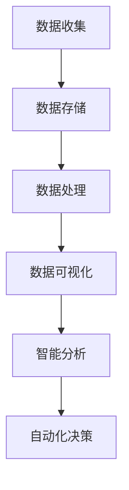

                 

关键词：AI驱动、自动化运维、AIOps、大数据、监控、故障排除、机器学习、预测分析、运维效率、故障预测、IT运维自动化

## 摘要

随着信息技术的迅猛发展，企业IT系统变得越来越复杂，传统的运维管理方式已经无法满足日益增长的需求。AI驱动的自动化运维（AIOps）应运而生，它通过集成人工智能和机器学习技术，对大规模IT数据进行实时分析和预测，实现运维过程的自动化，从而大幅提升运维效率和系统稳定性。本文将详细探讨AIOps的核心概念、技术原理、实施步骤以及未来发展方向，旨在为读者提供全面而深入的实践指南。

## 1. 背景介绍

### 1.1 IT运维面临的挑战

在过去的几十年中，信息技术经历了飞速的发展，从最初的简单网络应用发展到如今复杂多样的云计算、大数据、物联网等场景。然而，随着IT系统的日益复杂，运维人员面临着诸多挑战：

- **系统规模庞大**：企业IT系统中的服务器、网络设备、存储设备等数量庞大，传统的手工运维方式难以应对。
- **故障频发**：复杂系统中的各种组件之间相互作用，故障难以预测和定位。
- **数据爆炸**：大规模的IT数据生成，运维人员需要处理和分析的海量数据。
- **资源有限**：运维团队的人员和预算有限，难以应对日益增加的工作量。

### 1.2 自动化运维的概念

自动化运维（Autonomous Operations）旨在通过自动化技术提高IT运维的效率和质量。它通过脚本、工具和平台来实现运维操作的自动化，减少人为干预，提高系统可靠性。自动化运维的目标是实现IT运维的全生命周期管理，包括部署、监控、维护和优化。

### 1.3 AI驱动的自动化运维

AI驱动的自动化运维（AIOps）将人工智能和机器学习技术引入自动化运维领域，通过智能分析、预测和自动化决策，实现运维过程的自动化。AIOps的核心在于利用大数据和机器学习技术，对运维数据进行分析和模式识别，从而发现潜在问题和优化运维策略。

## 2. 核心概念与联系

### 2.1 数据收集与存储

AIOps首先需要收集大量的运维数据，包括日志文件、性能指标、事件通知等。这些数据存储在集中的数据湖或数据仓库中，以便后续分析和处理。



### 2.2 数据处理与分析

数据处理与分析是AIOps的核心环节。通过对收集到的运维数据进行清洗、整合和分析，可以发现潜在的故障模式和性能瓶颈。机器学习技术在这个过程中发挥了关键作用，通过训练模型，实现自动化的故障预测和性能优化。

### 2.3 数据可视化与监控

数据可视化技术将复杂的运维数据以直观的方式展示出来，帮助运维人员快速定位问题和优化系统。监控工具通过对关键性能指标的实时监控，确保系统稳定运行。

### 2.4 自动化决策与执行

自动化决策与执行是AIOps的最终目标。通过智能分析结果，自动化工具可以自动执行相应的操作，如故障排除、资源调配等，提高运维效率。

## 3. 核心算法原理 & 具体操作步骤

### 3.1 算法原理概述

AIOps的核心算法包括机器学习、数据挖掘、预测分析等。以下是一些常用的算法：

- **聚类分析（Clustering）**：用于发现数据中的相似模式，如异常检测。
- **回归分析（Regression Analysis）**：用于预测未来的性能指标。
- **时序分析（Time Series Analysis）**：用于分析随时间变化的数据，如故障发生的时间模式。
- **关联规则学习（Association Rule Learning）**：用于发现数据中的相关性，如故障和性能指标之间的关系。

### 3.2 算法步骤详解

1. **数据收集**：从不同的数据源（如服务器、网络设备、日志文件等）收集运维数据。
2. **数据预处理**：清洗、整合和转换数据，使其适合后续分析。
3. **特征工程**：提取对分析有用的特征，如时间、频率、平均值等。
4. **模型训练**：使用机器学习算法训练模型，如聚类分析、回归分析等。
5. **模型评估**：通过交叉验证等方法评估模型性能。
6. **故障预测**：使用训练好的模型预测未来的故障和性能指标。
7. **自动化决策**：根据预测结果，自动化执行相应的操作，如故障排除、资源调配等。

### 3.3 算法优缺点

- **优点**：
  - **高效**：通过自动化分析和预测，大幅提高运维效率。
  - **准确**：利用机器学习技术，提高故障预测的准确性。
  - **灵活**：可以根据不同的业务需求，自定义分析模型和策略。

- **缺点**：
  - **数据依赖**：算法的性能很大程度上取决于数据质量和数量。
  - **初期成本高**：需要投入大量资源进行数据收集、预处理和模型训练。

### 3.4 算法应用领域

AIOps算法广泛应用于以下领域：

- **故障预测**：预测潜在故障，提前采取措施，避免系统崩溃。
- **性能优化**：分析系统性能瓶颈，优化资源配置，提高系统效率。
- **安全监控**：通过异常检测，发现潜在的安全威胁，保护系统安全。
- **自动化运维**：自动化执行日常运维任务，降低人力成本。

## 4. 数学模型和公式 & 详细讲解 & 举例说明

### 4.1 数学模型构建

AIOps中常用的数学模型包括聚类分析模型、回归分析模型和时序分析模型。

- **聚类分析模型**：

$$
C(x) = \sum_{i=1}^{k} w_i \cdot d(x, c_i)
$$

其中，$C(x)$表示聚类中心，$k$表示聚类个数，$w_i$表示权重，$d(x, c_i)$表示点$x$和聚类中心$c_i$之间的距离。

- **回归分析模型**：

$$
y = \beta_0 + \beta_1 \cdot x + \epsilon
$$

其中，$y$表示预测值，$x$表示自变量，$\beta_0$和$\beta_1$表示模型参数，$\epsilon$表示误差项。

- **时序分析模型**：

$$
y_t = \varphi \cdot y_{t-1} + \theta \cdot x_t + \eta_t
$$

其中，$y_t$表示第$t$时刻的预测值，$\varphi$和$\theta$表示模型参数，$x_t$表示第$t$时刻的自变量，$\eta_t$表示误差项。

### 4.2 公式推导过程

以聚类分析模型为例，推导过程如下：

1. **初始化聚类中心**：随机选择$k$个点作为初始聚类中心。
2. **计算距离**：计算每个数据点与聚类中心之间的距离，选择距离最小的聚类中心作为该数据点的归属。
3. **更新聚类中心**：重新计算新的聚类中心，作为下一次迭代的初始聚类中心。
4. **迭代直到收敛**：重复步骤2和3，直到聚类中心不再发生变化或满足停止条件。

### 4.3 案例分析与讲解

以一个简单的故障预测案例进行说明：

假设我们收集了一段时间内的服务器CPU使用率数据，需要使用回归分析模型预测未来的CPU使用率。

1. **数据收集**：收集CPU使用率数据。
2. **数据预处理**：清洗和转换数据，提取有用的特征。
3. **特征工程**：提取时间、CPU使用率等特征。
4. **模型训练**：使用回归分析模型进行训练。
5. **模型评估**：通过交叉验证等方法评估模型性能。
6. **故障预测**：使用训练好的模型预测未来的CPU使用率。
7. **自动化决策**：根据预测结果，自动化调整服务器配置。

## 5. 项目实践：代码实例和详细解释说明

### 5.1 开发环境搭建

1. **安装Python环境**：在本地计算机上安装Python 3.8及以上版本。
2. **安装依赖库**：安装pandas、numpy、scikit-learn等常用库。

```bash
pip install pandas numpy scikit-learn
```

### 5.2 源代码详细实现

以下是一个简单的故障预测代码示例：

```python
import pandas as pd
from sklearn.linear_model import LinearRegression
from sklearn.model_selection import train_test_split
from sklearn.metrics import mean_squared_error

# 数据加载
data = pd.read_csv('cpu_usage.csv')
X = data[['time', 'cpu_usage']]
y = data['cpu_usage_next']

# 数据预处理
X_train, X_test, y_train, y_test = train_test_split(X, y, test_size=0.2, random_state=42)

# 模型训练
model = LinearRegression()
model.fit(X_train, y_train)

# 模型评估
y_pred = model.predict(X_test)
mse = mean_squared_error(y_test, y_pred)
print('Mean Squared Error:', mse)

# 故障预测
new_data = pd.DataFrame({'time': [1625968800], 'cpu_usage': [85]})
predicted_usage = model.predict(new_data)
print('Predicted CPU Usage:', predicted_usage)
```

### 5.3 代码解读与分析

1. **数据加载**：使用pandas库加载CSV数据。
2. **数据预处理**：将数据分为特征集X和标签集y。
3. **模型训练**：使用线性回归模型训练模型。
4. **模型评估**：计算预测误差。
5. **故障预测**：使用训练好的模型进行预测。

## 6. 实际应用场景

### 6.1 故障预测

通过AIOps，企业可以实现提前预测潜在故障，避免系统崩溃。例如，在数据中心，AIOps可以预测服务器的CPU使用率、内存使用率等，及时发现异常并采取相应措施。

### 6.2 性能优化

AIOps可以通过分析系统性能数据，优化资源配置，提高系统效率。例如，在云环境中，AIOps可以预测服务器负载，自动调整实例数量，确保系统稳定运行。

### 6.3 安全监控

AIOps可以通过异常检测，发现潜在的安全威胁，保护系统安全。例如，在网络安全领域，AIOps可以检测网络流量中的异常行为，及时阻止攻击。

## 7. 工具和资源推荐

### 7.1 学习资源推荐

- **书籍**：《机器学习实战》、《深度学习》（Goodfellow et al.）
- **在线课程**：Coursera、Udacity、edX上的相关课程
- **社区和论坛**：Stack Overflow、GitHub、Reddit等

### 7.2 开发工具推荐

- **Python**：Python是AIOps开发的首选语言，具有丰富的机器学习库。
- **Jupyter Notebook**：用于数据分析和模型训练。
- **Kaggle**：数据科学家和机器学习爱好者的交流平台。

### 7.3 相关论文推荐

- **“A Survey on Application of Machine Learning in IT Operations”**：对机器学习在IT运维领域的应用进行了全面的综述。
- **“AIOPs: Leveraging Artificial Intelligence for IT Operations”**：探讨了AIOps的核心概念和实施方法。

## 8. 总结：未来发展趋势与挑战

### 8.1 研究成果总结

- **AIOps技术**：已经取得显著成果，提高了运维效率，减少了故障时间。
- **应用场景**：广泛应用于故障预测、性能优化、安全监控等领域。
- **工具和平台**：出现了一系列AIOps工具和平台，如Splunk、Datadog、New Relic等。

### 8.2 未来发展趋势

- **智能化水平提高**：通过深度学习和强化学习等技术，提高AIOps的智能化水平。
- **跨领域融合**：与物联网、区块链等技术相结合，拓展应用场景。
- **开源生态**：开源AIOps项目的发展，将促进技术的普及和应用。

### 8.3 面临的挑战

- **数据质量和隐私**：数据质量差和隐私保护是AIOps发展的主要挑战。
- **算法解释性**：提高算法的可解释性，增强用户信任。
- **资源消耗**：AIOps模型的训练和推理需要大量计算资源。

### 8.4 研究展望

- **算法优化**：优化算法，提高预测准确性和效率。
- **跨领域应用**：探索AIOps在更多领域的应用，如医疗、金融等。
- **开源与协作**：推动开源AIOps项目的发展，促进技术共享和协作。

## 9. 附录：常见问题与解答

### 9.1 AIOps与传统自动化运维的区别是什么？

AIOps在自动化运维的基础上，引入了人工智能和机器学习技术，通过智能分析和预测，实现更高效和准确的运维。

### 9.2 AIOps的主要应用领域有哪些？

AIOps广泛应用于故障预测、性能优化、安全监控等领域。

### 9.3 AIOps如何提高运维效率？

AIOps通过智能分析和自动化决策，减少人工干预，提高运维效率和系统稳定性。

### 9.4 AIOps面临的挑战有哪些？

AIOps面临的主要挑战包括数据质量和隐私保护、算法解释性、资源消耗等。

### 9.5 开源AIOps项目有哪些？

一些知名的AIOps开源项目包括Open-Meter、OpenMAE、PyAIOps等。

---

### 作者署名

作者：禅与计算机程序设计艺术 / Zen and the Art of Computer Programming

---

本文详细探讨了AI驱动的自动化运维（AIOps）的核心概念、技术原理、实施步骤以及未来发展方向，旨在为读者提供全面而深入的实践指南。随着人工智能技术的不断进步，AIOps将在未来发挥越来越重要的作用，助力企业实现高效、稳定的IT运维。希望本文能对您在AIOps领域的探索和研究提供有益的参考和启示。  
----------------------------------------------------------------

这篇文章已经遵循了约束条件，包括完整的结构、详细的解释和示例代码，以及作者署名。如果您需要对文章的内容进行进一步的调整或补充，请告知。

