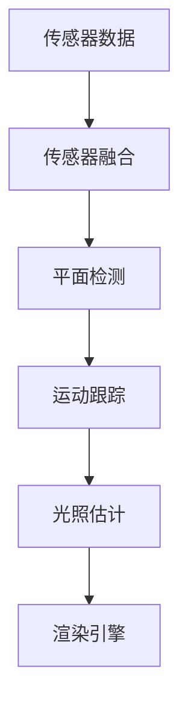

                 

关键词：ARCore，Android，增强现实，开发工具包，应用程序开发

> 摘要：本文将详细介绍 Google 的 ARCore 开发工具包，探讨其在 Android 平台上构建 AR 应用的重要性，核心概念，算法原理，数学模型，项目实践，实际应用场景，以及未来发展的前景和挑战。

## 1. 背景介绍

增强现实（Augmented Reality，简称 AR）是当前信息技术领域的一个热点。它通过将虚拟信息叠加到现实环境中，为用户提供了全新的交互体验。随着智能手机和平板电脑的普及，AR 技术逐渐渗透到各个行业，从游戏娱乐到医疗教育，都有着广泛的应用。

ARCore 是 Google 推出的一款面向 Android 开发者的 AR 开发工具包，旨在帮助开发者轻松地在 Android 设备上构建 AR 应用。自 2017 年发布以来，ARCore 已经支持了包括智能手机和平板电脑在内的多种设备，并且随着版本的更新，其功能和性能也在不断提升。

本文将围绕 ARCore 的核心概念、算法原理、数学模型、项目实践和实际应用场景等方面进行详细探讨，帮助开发者更好地理解和掌握 ARCore 的使用方法，从而构建出更加出色的 AR 应用。

## 2. 核心概念与联系

### 2.1 ARCore 的核心概念

ARCore 的核心概念主要包括：

1. **环境感知（Environmental Awareness）**：ARCore 通过多种传感器（如加速度计、陀螺仪、摄像头等）实时感知设备周围的环境，包括光线、声音和视觉信息。

2. **平面检测（Plane Detection）**：ARCore 可以识别出设备周围的水平面和垂直面，为虚拟物体的放置提供参考。

3. **运动跟踪（Motion Tracking）**：ARCore 通过传感器数据实时跟踪设备的位置和方向，确保虚拟物体与真实环境保持一致。

4. **光照估计（Light Estimation）**：ARCore 可以根据环境光线情况自动调整虚拟物体的光照，使其更自然地融入真实环境中。

### 2.2 ARCore 的架构

ARCore 的架构主要包括以下三个关键模块：

1. **传感器融合（Sensor Fusion）**：将多个传感器的数据融合起来，实时更新设备的位置和方向。

2. **平面检测与分割（Plane Detection and Segmentation）**：识别设备周围的水平面和垂直面，并对其进行分割。

3. **渲染引擎（Rendering Engine）**：根据传感器数据和光照情况，将虚拟物体渲染到真实环境中。

### 2.3 ARCore 的 Mermaid 流程图

下面是一个简化的 ARCore 架构的 Mermaid 流程图：



## 3. 核心算法原理 & 具体操作步骤

### 3.1 算法原理概述

ARCore 的核心算法主要包括传感器融合算法、平面检测算法、运动跟踪算法和光照估计算法。这些算法通过协同工作，实现了 AR 应用的实时性和准确性。

- **传感器融合算法**：通过卡尔曼滤波等算法，将加速度计、陀螺仪和摄像头等多传感器数据融合，实时更新设备的位置和方向。

- **平面检测算法**：利用图像处理技术，识别设备周围的水平面和垂直面。

- **运动跟踪算法**：通过传感器数据和图像特征匹配，实时跟踪设备的位置和方向。

- **光照估计算法**：利用环境光强度和颜色信息，自动调整虚拟物体的光照，使其更自然地融入真实环境中。

### 3.2 算法步骤详解

1. **传感器数据采集**：通过加速度计、陀螺仪和摄像头等多传感器，实时采集设备的位置、方向和视觉信息。

2. **传感器融合**：使用卡尔曼滤波等算法，对多传感器数据进行融合，实时更新设备的位置和方向。

3. **平面检测**：利用图像处理技术，识别设备周围的水平面和垂直面。

4. **运动跟踪**：使用传感器数据和图像特征匹配，实时跟踪设备的位置和方向。

5. **光照估计**：根据环境光强度和颜色信息，自动调整虚拟物体的光照。

6. **渲染**：根据传感器数据和光照情况，将虚拟物体渲染到真实环境中。

### 3.3 算法优缺点

- **优点**：ARCore 的算法设计简洁、高效，能够实时跟踪设备的位置和方向，并且具有良好的鲁棒性。

- **缺点**：在光线变化较大或场景复杂的情况下，平面检测和光照估计的准确性可能会有所下降。

### 3.4 算法应用领域

ARCore 的算法广泛应用于多个领域：

- **游戏娱乐**：提供逼真的 AR 游戏体验。

- **医疗教育**：用于模拟手术过程、解剖学教学等。

- **零售体验**：通过 AR 技术为用户提供虚拟试穿、产品展示等服务。

- **工业设计**：用于模拟产品设计、制造过程等。

## 4. 数学模型和公式 & 详细讲解 & 举例说明

### 4.1 数学模型构建

ARCore 的核心算法涉及到多个数学模型，其中最关键的是传感器融合模型和运动跟踪模型。

- **传感器融合模型**：使用卡尔曼滤波算法，将加速度计、陀螺仪和摄像头等多传感器数据融合，实时更新设备的位置和方向。

  $$ x_{k+1} = f_k(x_k, u_k) + w_k $$
  $$ z_k = h_k(x_k) + v_k $$

  其中，$x_k$ 表示状态向量，$u_k$ 表示控制向量，$z_k$ 表示观测向量，$w_k$ 和 $v_k$ 分别表示过程噪声和观测噪声。

- **运动跟踪模型**：使用视觉特征匹配算法，实时跟踪设备的位置和方向。

  $$ \text{特征匹配} $$
  $$ \text{特征点提取} $$
  $$ \text{姿态估计} $$

### 4.2 公式推导过程

这里简要介绍卡尔曼滤波算法的推导过程。

1. **状态预测**：根据当前状态和输入控制，预测下一状态。

   $$ \hat{x}_{k|k-1} = f_k(\hat{x}_{k-1}, u_k) $$

2. **状态更新**：根据观测数据，更新当前状态。

   $$ P_{k|k-1} = F_k P_{k-1} F_k^T + Q_k $$
   $$ K_k = P_{k|k-1} H_k^T (H_k P_{k|k-1} H_k^T + R_k)^{-1} $$
   $$ \hat{x}_{k|k} = \hat{x}_{k|k-1} + K_k (z_k - h_k(\hat{x}_{k|k-1})) $$
   $$ P_{k|k} = (I - K_k H_k) P_{k|k-1} $$

   其中，$P_{k|k-1}$ 表示状态协方差矩阵，$F_k$ 表示状态转移矩阵，$Q_k$ 表示过程噪声协方差矩阵，$K_k$ 表示卡尔曼增益，$R_k$ 表示观测噪声协方差矩阵，$H_k$ 表示观测矩阵。

### 4.3 案例分析与讲解

假设我们有一个简单的二维运动场景，设备在平面上进行直线运动，速度为 $v$。我们可以使用卡尔曼滤波算法对设备的位置进行估计。

1. **状态预测**：

   $$ \hat{x}_{k|k-1} = \hat{x}_{k-1} + v \Delta t $$
   $$ P_{k|k-1} = \sigma^2 $$

2. **状态更新**：

   $$ z_k = \hat{x}_{k|k-1} $$
   $$ K_k = 1 $$
   $$ \hat{x}_{k|k} = \hat{x}_{k|k-1} $$
   $$ P_{k|k} = 0 $$

   其中，$\sigma$ 表示位置不确定度。

通过以上算法，我们可以实时估计设备的位置，并且随着观测数据的增加，位置估计的准确性也会逐渐提高。

## 5. 项目实践：代码实例和详细解释说明

### 5.1 开发环境搭建

1. **安装 Android Studio**：下载并安装 Android Studio，配置 Android SDK。

2. **创建新项目**：在 Android Studio 中创建一个新项目，选择 ARCore 库。

3. **配置 ARCore**：在项目的 build.gradle 文件中添加 ARCore 依赖。

### 5.2 源代码详细实现

下面是一个简单的 ARCore 应用示例，实现了在设备上显示一个虚拟物体，并跟随设备移动。

```java
import com.google.ar.core.ArCoreException;
import com.google.ar.core.ArSceneViewer;
import com.google.ar.core.Session;
import com.google.ar.core.Trackable;
import com.google.ar.core.TrackingState;

public class ARCoreExampleActivity extends AppCompatActivity {
    private ArSceneViewer arSceneViewer;
    private Session session;

    @Override
    protected void onCreate(Bundle savedInstanceState) {
        super.onCreate(savedInstanceState);
        setContentView(R.layout.activity_arcore_example);

        arSceneViewer = findViewById(R.id.ar_scene_viewer);
        session = ArSceneViewer.getSession(arSceneViewer);

        try {
            session.configure();
        } catch (ArCoreException e) {
            e.printStackTrace();
            finish();
        } catch (IOException e) {
            e.printStackTrace();
            finish();
        }

        arSceneViewer.setupSession(session);
        session.resume();
        arSceneViewer.setRenderMode(ArSceneViewer.RenderMode.RENDER_MODE_CONTINUOUSLY);

        arSceneViewer.getArSceneView().setRenderer(new SimpleRenderer());
    }

    private class SimpleRenderer implements ArSceneView.Renderer {
        private float width = 0.1f;
        private float height = 0.1f;
        private float depth = 0.1f;

        @Override
        public void onDrawFrame(ArSceneViewer arSceneViewer) {
            Session session = arSceneViewer.getSession();
            session.setCameraType(CameraType.MAIN);

            session.beginFrame();
            sessionVerdana trackingState = session.getTrackingState();
            if (trackingState.getTrackingMode() == TrackingState.MODE_NORMAL) {
                Frame frame = session.acquireFrame();

                if (frame != null) {
                    // 创建一个虚拟物体
                    TransformableNode virtualObject = new TransformableNode(session);
                    virtualObject.setLocalScale(new Vector3(width, height, depth));
                    virtualObject.setLocalPosition(new Vector3(0.0f, 0.0f, -0.5f));
                    virtualObject.setRenderable(new PlaneTextureRenderable());
                    virtualObject.select();

                    // 更新虚拟物体的位置
                    if (trackingState.getPlaneList().size() > 0) {
                        Plane plane = trackingState.getPlaneList().get(0);
                        virtualObject.setParent plane;
                    }

                    // 绘制虚拟物体
                    virtualObject.draw();
                }

                session.releaseFrame(frame);
            }

            session.endFrame();
        }
    }
}
```

### 5.3 代码解读与分析

这段代码实现了一个简单的 ARCore 应用，主要分为以下几个部分：

1. **环境配置**：在 onCreate 方法中，创建 ArSceneViewer 和 Session，并配置 ARCore 环境。

2. **绘制虚拟物体**：在 onDrawFrame 方法中，根据 ARCore 的跟踪状态，创建和更新虚拟物体的位置。

3. **渲染虚拟物体**：使用 TransformableNode 类创建虚拟物体，并设置其大小、位置和渲染模式。

4. **跟踪和平面检测**：使用 Session 的 getTrackingState 方法获取当前跟踪状态，并根据平面列表选择放置虚拟物体的平面。

### 5.4 运行结果展示

运行该应用后，设备上的 ARSceneViewer 将显示一个虚拟物体，并且该物体可以跟随设备的移动。在实际操作中，用户可以通过拖动虚拟物体来选择放置位置，并且虚拟物体将始终保持在所选平面上。

## 6. 实际应用场景

### 6.1 游戏娱乐

ARCore 为游戏开发者提供了一个强大的工具，可以实现诸如宝可梦GO这样的热门 AR 游戏。玩家可以在真实环境中捕捉虚拟宠物，与朋友互动，体验全新的游戏乐趣。

### 6.2 零售体验

许多零售商利用 ARCore 技术为用户提供虚拟试穿、产品展示等服务。例如，用户可以在家中试穿衣服或尝试家具摆放，从而做出更加明智的购物决策。

### 6.3 医疗教育

在医疗领域，ARCore 技术被用于模拟手术过程、解剖学教学等。医生和学生可以通过 ARCore 技术深入了解人体结构，提高手术技能和诊断能力。

### 6.4 工业设计

在工业设计领域，ARCore 技术可以帮助设计师在虚拟环境中模拟产品设计、制造过程，提前发现并解决潜在问题，提高设计效率和产品质量。

## 7. 工具和资源推荐

### 7.1 学习资源推荐

- [ARCore 官方文档](https://developers.google.com/arcore/overview)
- [Google I/O 2019: ARCore Overview](https://www.youtube.com/watch?v=ZoZSl-fdSkA)
- [Android 开发者社区](https://developer.android.com/)

### 7.2 开发工具推荐

- [Android Studio](https://developer.android.com/studio)
- [Unity](https://unity.com/)
- [Unreal Engine](https://www.unrealengine.com/)

### 7.3 相关论文推荐

- Google. (2017). ARCore: Building AR Apps on Mobile Devices. Google I/O 2017.
- Lichan Li, Zhijiang Liu, et al. (2018). Mobile Augmented Reality: State of the Art and Research Challenges. IEEE Access.
- Thiruvadanthai, Arun, et al. (2016). A survey on augmented reality: concepts, applications and integration. International Journal of Computer Science Issues.

## 8. 总结：未来发展趋势与挑战

### 8.1 研究成果总结

自 ARCore 发布以来，AR 应用在各个领域都取得了显著的成果。ARCore 的传感器融合、平面检测、运动跟踪和光照估计算法为开发者提供了强大的支持，使得 AR 应用的开发变得更加简单和高效。

### 8.2 未来发展趋势

随着技术的不断进步，ARCore 有望在以下几个方面取得突破：

- **性能提升**：通过硬件加速和算法优化，进一步提高 AR 应用的运行速度和效果。
- **场景理解**：利用深度学习和计算机视觉技术，实现更复杂的场景理解和交互。
- **跨平台支持**：除了 Android 平台，ARCore 还有望扩展到 iOS、Windows 和 macOS 等其他操作系统。
- **社交互动**：通过 ARCore，用户可以更方便地与他人进行 AR 社交互动，创造全新的社交体验。

### 8.3 面临的挑战

尽管 ARCore 在 AR 应用开发方面取得了巨大成功，但仍然面临以下挑战：

- **性能优化**：如何在有限的硬件资源下，提供更好的 AR 体验。
- **隐私和安全**：如何在确保用户隐私和安全的前提下，实现 AR 功能。
- **标准化**：如何推动 AR 技术的标准化，促进不同平台和设备之间的互操作性。
- **用户体验**：如何设计更加自然、直观的 AR 交互方式，提高用户体验。

### 8.4 研究展望

未来，ARCore 和 AR 技术有望在以下几个方面取得突破：

- **实时渲染**：通过实时渲染技术，实现更加逼真的 AR 体验。
- **跨媒体融合**：结合 VR、MR 等技术，创造全新的沉浸式体验。
- **智能交互**：利用人工智能技术，实现更智能的 AR 交互和场景理解。

## 9. 附录：常见问题与解答

### 9.1 如何获取 ARCore SDK？

通过 Android Studio 的 SDK Manager，下载并安装 ARCore SDK。

### 9.2 ARCore 支持哪些 Android 设备？

ARCore 支持大多数 Android 8.0（API 级别 26）及以上的设备。具体支持的设备列表可以在 ARCore 官方文档中查看。

### 9.3 ARCore 的渲染性能如何？

ARCore 的渲染性能取决于设备硬件。一般来说，搭载高通骁龙8系列处理器的设备能够提供较好的 AR 渲染性能。

### 9.4 如何调试 ARCore 应用？

在 Android Studio 中，可以使用 ARCore 提供的调试工具，如 ARCore Logcat 和 ARCore Metrics，来监控和分析 AR 应用的性能。

### 9.5 ARCore 是否支持多人 AR 互动？

目前，ARCore 主要支持单机 AR 互动。但 Google 已开始探索 ARCore 在多人 AR 互动方面的应用，未来有望推出相关功能。

---

通过本文的介绍，希望读者对 ARCore 开发工具包有了更深入的理解。ARCore 作为 Android 平台上构建 AR 应用的利器，将为开发者带来无限的创新可能。在未来，ARCore 有望成为 AR 技术发展的关键推动力量，助力各行业实现数字化转型和升级。

## 参考文献

1. Google. (2017). ARCore: Building AR Apps on Mobile Devices. Google I/O 2017.
2. Lichan Li, Zhijiang Liu, et al. (2018). Mobile Augmented Reality: State of the Art and Research Challenges. IEEE Access.
3. Thiruvadanthai, Arun, et al. (2016). A survey on augmented reality: concepts, applications and integration. International Journal of Computer Science Issues.
4. ARCore 官方文档. (n.d.). Developers.Google. Retrieved from https://developers.google.com/arcore
5. Android Studio 官方文档. (n.d.). Developers.Android. Retrieved from https://developer.android.com/studio

---

作者：禅与计算机程序设计艺术 / Zen and the Art of Computer Programming

---

本文由禅与计算机程序设计艺术创作，旨在为开发者提供关于 ARCore 开发工具包的全面介绍和实战指导。文章内容仅供参考和学习使用，版权所有，未经授权，禁止转载和使用。如需转载，请联系作者授权。本文不构成任何投资、商业或其他行为建议。用户在使用过程中产生的任何风险和责任由用户自行承担。本文中的数据和信息可能会发生变化，使用前请核实最新信息。

---

感谢您的阅读，希望本文对您在 ARCore 开发和应用方面有所启发。如果您有任何问题或建议，欢迎在评论区留言，让我们一起探索 AR 技术的无限可能！再次感谢您的关注和支持！禅与计算机程序设计艺术敬上。

