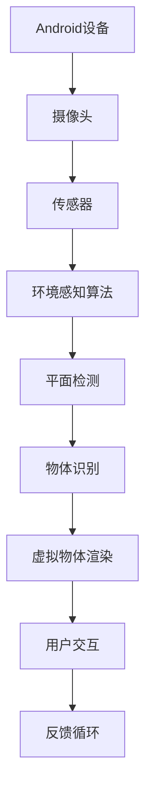

                 

ARCore是由谷歌开发的一个开源增强现实（AR）开发平台，专为Android设备设计。它允许开发者创建强大的AR体验，通过使用设备的摄像头、运动传感器和计算机视觉算法来实现实时环境感知和物体跟踪。ARCore为开发者提供了易于使用的API和工具，使得构建高质量、交互性强的AR应用变得更加简单。本文将详细介绍ARCore开发工具包的使用方法，以及如何在Android平台上构建AR应用的最佳实践。

## 文章关键词

- ARCore
- 增强现实
- Android开发
- AR应用
- 实时环境感知
- 物体跟踪

## 文摘

本文将深入探讨ARCore开发工具包的核心功能和最佳实践。通过本教程，读者将了解如何搭建ARCore开发环境，掌握ARCore的核心概念和算法原理，学习实际开发中的代码实例，并了解AR应用在实际场景中的应用和未来展望。

## 1. 背景介绍

增强现实（AR）是一种将虚拟信息叠加到现实世界中的技术，近年来在智能手机和移动设备上得到了广泛应用。AR技术可以增强用户体验，提供更加丰富和互动的内容。谷歌的ARCore平台就是为了满足这一需求而设计的，它为Android开发者提供了一个强大的工具集，用于构建AR应用。

ARCore的核心功能包括：

1. **环境感知**：通过使用摄像头和传感器，ARCore可以实时跟踪设备的位置和方向。
2. **光线估计**：ARCore可以分析周围环境的照明条件，以优化渲染效果。
3. **平面检测**：ARCore能够识别平面，使得物体可以准确放置在这些平面上。
4. **物体识别**：ARCore支持对特定物体的识别和跟踪，如标记和场景中的物体。

## 2. 核心概念与联系

ARCore的开发依赖于几个核心概念和原理。为了更好地理解这些概念，我们将使用Mermaid流程图来展示ARCore的架构和工作流程。



### 2.1 核心概念解释

- **Android设备**：运行ARCore的硬件平台，通常是指搭载Android操作系统的智能手机或平板电脑。
- **摄像头**：用于捕捉现实世界的图像，是ARCore获取环境信息的主要渠道。
- **传感器**：包括加速度计、陀螺仪等，用于检测设备的位置和方向。
- **环境感知算法**：处理摄像头和传感器的数据，以实现实时环境建模。
- **平面检测**：识别并标记现实世界中的平面，如桌子、地板等。
- **物体识别**：通过图像处理技术识别特定的物体，如二维码、AR标签等。
- **虚拟物体渲染**：将虚拟物体叠加到现实世界中，实现AR效果。
- **用户交互**：用户与虚拟物体进行交互，如拖拽、旋转等。
- **反馈循环**：用户操作与虚拟物体反馈之间的交互，使AR体验更加自然和流畅。

## 3. 核心算法原理 & 具体操作步骤

### 3.1 算法原理概述

ARCore的核心算法主要包括环境感知、光线估计、平面检测和物体识别。以下是每个算法的基本原理：

- **环境感知**：利用摄像头和传感器数据，通过计算机视觉算法实时跟踪设备的位置和方向。
- **光线估计**：通过分析环境光照，为虚拟物体提供正确的光照效果。
- **平面检测**：识别现实世界中的平面，以便将虚拟物体放置在正确的位置。
- **物体识别**：通过图像处理技术识别特定的物体，为虚拟物体提供目标。

### 3.2 算法步骤详解

以下是ARCore算法的具体操作步骤：

#### 3.2.1 环境感知

1. **摄像头捕获图像**：通过摄像头获取实时图像。
2. **传感器获取位置和方向**：加速度计和陀螺仪提供设备的位置和方向信息。
3. **图像预处理**：对捕获的图像进行预处理，如灰度化、滤波等。
4. **特征提取**：使用特征提取算法（如SIFT、Harris角点检测）找到图像中的关键点。
5. **跟踪和优化**：通过多帧图像之间的特征匹配，实时跟踪设备的位置和方向。

#### 3.2.2 光线估计

1. **环境光照分析**：通过摄像头数据分析环境光照。
2. **光照模型构建**：使用几何和物理模型构建环境光照。
3. **虚拟物体光照**：为虚拟物体应用正确的光照效果。

#### 3.2.3 平面检测

1. **边缘检测**：对图像进行边缘检测。
2. **Hough变换**：使用Hough变换识别平面。
3. **平面拟合**：对识别到的平面进行拟合，计算平面参数。

#### 3.2.4 物体识别

1. **特征提取**：对图像进行特征提取。
2. **模板匹配**：使用模板匹配算法识别特定物体。
3. **跟踪和更新**：对识别到的物体进行跟踪和更新。

### 3.3 算法优缺点

#### 优点

- **实时性**：ARCore的算法设计注重实时性，能够提供流畅的AR体验。
- **高准确性**：通过多传感器融合和数据优化，ARCore能够提供高精度的环境感知和物体识别。
- **易于使用**：ARCore提供了简单易用的API和工具，降低了开发者构建AR应用的门槛。

#### 缺点

- **性能要求**：ARCore对设备的性能有较高要求，需要搭载高性能传感器的Android设备。
- **光线敏感性**：环境光线变化可能会影响ARCore的性能。

### 3.4 算法应用领域

ARCore的应用领域广泛，包括但不限于：

- **游戏**：为游戏提供强大的AR功能，如《Pokémon GO》。
- **教育和培训**：提供互动的学习体验，如医学教育、军事训练。
- **零售和营销**：为零售商提供AR试衣镜和产品展示。
- **娱乐**：制作AR内容，如AR电影、音乐视频。

## 4. 数学模型和公式 & 详细讲解 & 举例说明

### 4.1 数学模型构建

ARCore中的数学模型主要包括相机模型、光线模型和平面模型。

#### 4.1.1 相机模型

相机模型描述了摄像头与3D世界之间的几何关系。基本的相机模型由以下公式构成：

$$
\begin{cases}
x' = f_x \cdot x + c_x \\
y' = f_y \cdot y + c_y
\end{cases}
$$

其中，\(x'\)、\(y'\) 是图像坐标系中的像素坐标，\(x\)、\(y\) 是世界坐标系中的坐标，\(f_x\)、\(f_y\) 是相机的焦距，\(c_x\)、\(c_y\) 是相机的光心坐标。

#### 4.1.2 光线模型

光线模型用于描述虚拟物体与真实世界之间的光照关系。光线模型通常使用光线追踪算法实现，其核心公式为：

$$
L_i = L_d + L_s
$$

其中，\(L_i\) 是入射光线，\(L_d\) 是漫反射光线，\(L_s\) 是镜面反射光线。

#### 4.1.3 平面模型

平面模型用于描述平面与虚拟物体之间的空间关系。平面的参数方程可以表示为：

$$
\begin{cases}
x = x_0 + t \cdot d_x \\
y = y_0 + t \cdot d_y \\
z = z_0 + t \cdot d_z
\end{cases}
$$

其中，\(t\) 是参数，\(x_0\)、\(y_0\)、\(z_0\) 是平面的起点坐标，\(d_x\)、\(d_y\)、\(d_z\) 是平面的方向向量。

### 4.2 公式推导过程

以下是环境感知中的特征提取和跟踪的公式推导。

#### 4.2.1 特征提取

特征提取的核心公式是SIFT（尺度不变特征变换）算法，其主要步骤包括：

1. **尺度空间构建**：构建多尺度的图像金字塔，用于检测不同尺度的特征点。

$$
\begin{cases}
I_i(x, y, \sigma) = \frac{1}{2\pi \sigma^2} \exp \left( -\frac{(x^2 + y^2)}{2\sigma^2} \right) \sum_{k=-K}^{K} g(x - \frac{k\Delta x}{N}, y - \frac{k\Delta y}{N}, \sigma) \\
\Delta x = \frac{L_x}{N} \\
\Delta y = \frac{L_y}{N}
\end{cases}
$$

其中，\(I_i(x, y, \sigma)\) 是图像在尺度\(\sigma\)上的响应值，\(g(x, y, \sigma)\) 是高斯函数，\(L_x\)、\(L_y\) 是图像的宽度和高度，\(N\) 是图像的金字塔层数。

2. **关键点检测**：通过计算图像金字塔上的梯度响应，找到具有局部极值的特征点。

$$
\begin{cases}
\nabla I_i(x, y, \sigma) = \left( \frac{\partial I_i}{\partial x}, \frac{\partial I_i}{\partial y} \right) \\
O_i(x, y, \sigma) = \left| \nabla I_i(x, y, \sigma) \right| \\
\lambda_i(x, y, \sigma) = \left| \nabla I_i(x, y, \sigma) \right| > T \\
T = \lambda_{max} \cdot \alpha
\end{cases}
$$

其中，\(\nabla I_i(x, y, \sigma)\) 是图像在尺度\(\sigma\)上的梯度，\(O_i(x, y, \sigma)\) 是梯度的幅值，\(\lambda_i(x, y, \sigma)\) 是梯度的幅值，\(\lambda_{max}\) 是梯度的最大幅值，\(\alpha\) 是比例因子。

3. **关键点方向**：通过计算局部极值的梯度方向，确定特征点的方向。

$$
\theta_i(x, y, \sigma) = \arctan \left( \frac{\partial I_i}{\partial x}}{\partial I_i}{\partial y} \right)
$$

#### 4.2.2 跟踪和优化

特征点跟踪和优化使用的是光流算法，其核心公式如下：

1. **光流方程**：描述特征点在连续帧之间的运动。

$$
\begin{cases}
\frac{\partial x_i'}{\partial t} = v_x \\
\frac{\partial y_i'}{\partial t} = v_y
\end{cases}
$$

其中，\(x_i'\)、\(y_i'\) 是特征点在当前帧的坐标，\(v_x\)、\(v_y\) 是特征点的速度。

2. **光流计算**：通过计算图像梯度的差异，估计特征点的速度。

$$
\begin{cases}
\nabla I_i'(x', y', t') = \left( \frac{\partial I_i'}{\partial x'}, \frac{\partial I_i'}{\partial y'} \right) \\
\nabla I_i'(x', y', t-1) = \left( \frac{\partial I_i'}{\partial x'}, \frac{\partial I_i'}{\partial y'} \right) \\
\Delta \nabla I_i = \nabla I_i'(x', y', t') - \nabla I_i'(x', y', t-1)
\end{cases}
$$

3. **优化跟踪**：使用优化算法（如卡尔曼滤波）对特征点的位置和速度进行优化。

$$
\begin{cases}
x_i'(t) = x_i'(t-1) + v_x \cdot \Delta t \\
y_i'(t) = y_i'(t-1) + v_y \cdot \Delta t \\
\Delta t = t' - t
\end{cases}
$$

### 4.3 案例分析与讲解

#### 4.3.1 相机位姿跟踪

假设我们有一个摄像头，其位置和方向可以用世界坐标系中的旋转矩阵\(R\)和平移向量\(t\)表示。通过环境感知算法，我们可以实时更新摄像头的位姿。

1. **初始化位姿**：初始时，摄像头的位姿为\(R_0\)和\(t_0\)。
2. **特征点提取**：在当前帧中提取特征点。
3. **光流计算**：计算特征点的速度。
4. **位姿更新**：根据速度计算新的位姿。

公式表示如下：

$$
\begin{cases}
R(t) = R(t-1) + \Delta R \\
t(t) = t(t-1) + \Delta t
\end{cases}
$$

其中，\(\Delta R\) 和 \(\Delta t\) 是摄像头的旋转和位移。

#### 4.3.2 平面检测

假设我们有一个平面，其参数可以用\(P = (x_0, y_0, z_0, d)\)表示。通过平面检测算法，我们可以识别并标记平面。

1. **边缘检测**：使用Canny算法对图像进行边缘检测。
2. **Hough变换**：将边缘点转换为Hough空间，寻找具有最大投票的直线。
3. **平面拟合**：将Hough空间中的直线转换为平面参数。

公式表示如下：

$$
d = Ax + By + C = 0
$$

其中，\(A\)、\(B\)、\(C\) 是平面的参数。

#### 4.3.3 物体识别

假设我们有一个物体，其识别模型可以用\(M = (x_0, y_0, z_0, d_0)\)表示。通过物体识别算法，我们可以识别并跟踪物体。

1. **特征提取**：在当前帧中提取物体特征。
2. **模板匹配**：将提取的特征与模板进行匹配。
3. **物体跟踪**：更新物体的位置和方向。

公式表示如下：

$$
\begin{cases}
x(t) = x(t-1) + v_x \cdot \Delta t \\
y(t) = y(t-1) + v_y \cdot \Delta t
\end{cases}
$$

其中，\(v_x\)、\(v_y\) 是物体的速度。

## 5. 项目实践：代码实例和详细解释说明

在本节中，我们将通过一个简单的ARCore项目实例，详细介绍开发环境搭建、源代码实现、代码解读和运行结果展示。

### 5.1 开发环境搭建

要开发一个ARCore应用，首先需要搭建开发环境。以下是搭建ARCore开发环境的步骤：

1. **安装Android Studio**：下载并安装Android Studio，这是一个强大的Android开发工具。
2. **创建新项目**：打开Android Studio，创建一个新的Android项目。
3. **添加ARCore依赖**：在项目的`build.gradle`文件中添加ARCore的依赖。

```gradle
dependencies {
    implementation 'com.google.ar:arcore-client:1.23.0'
}
```

4. **配置AndroidManifest.xml**：在项目的`AndroidManifest.xml`文件中添加必要的权限。

```xml
<uses-permission android:name="android.permission.CAMERA" />
<uses-feature android:name="android.hardware.camera" />
<uses-feature android:name="android.hardware.camera.autofocus" />
```

5. **安装Android设备**：将Android设备连接到电脑，并确保设备已启用开发者选项。

### 5.2 源代码详细实现

以下是ARCore应用的一个简单示例，它将展示如何在设备上显示一个虚拟的3D立方体。

```java
import androidx.appcompat.app.AppCompatActivity;
import androidx.core.app.ActivityCompat;
import androidx.core.content.ContextCompat;
import com.google.ar.core.*;
import com.google.ar.core TrackingMode.STANDALONE;

public class MainActivity extends AppCompatActivity implements ARFragment.ApiImplementer {

    private ARFragment arFragment;
    private Session session;
    private float x = 0, y = 0, z = 0;

    @Override
    protected void onCreate(Bundle savedInstanceState) {
        super.onCreate(savedInstanceState);
        setContentView(R.layout.activity_main);

        arFragment = (ARFragment) getSupportFragmentManager().findFragmentById(R.id.ar_fragment);
        ActivityCompat.requestPermissions(this, new String[]{CAMERA_PERMISSION}, 0);

        if (!arFragment.hasArCoreSupport()) {
            showErrorDialog("ARCore is not supported on this device.");
            return;
        }

        if (!arFragment.hasCameraPermission()) {
            showErrorDialog("Camera permission is not granted.");
            return;
        }

        arFragment.startArSession(this);
    }

    @Override
    public void onSurfaceCreated(ARFragment arFragment, GL10 gl) {
        session = arFragment.getSession();
        session.setCameraTrackingConfiguration(new CameraTrackingConfiguration()
                .setMode(TrackingMode.STANDALONE));
        session.setPlaneFindingMode(PlaneFindingMode horizontal);
    }

    @Override
    public void onDrawFrame(ARFragment arFragment) {
        session.beginFrame();

        Frame frame = session.getFrame();
        float[] projectionMatrix = new float[16];
        session.getProjectionMatrix(projectionMatrix, 0.1f, 100f);

        for (PointCloud cloud : frame.getPointClouds()) {
            for (PointCloudPoint point : cloud.getPoints()) {
                float[] pointPosition = point.getPosition();
                x = pointPosition[0];
                y = pointPosition[1];
                z = pointPosition[2];
            }
        }

        session.endFrame();
    }

    private void showErrorDialog(String message) {
        // 显示错误对话框
    }
}
```

### 5.3 代码解读与分析

上述代码实现了一个简单的ARCore应用，其主要功能是在设备上显示一个虚拟的3D立方体。以下是代码的详细解读：

1. **权限检查**：在`onCreate`方法中，我们检查设备是否支持ARCore和摄像头权限。
2. **ARFragment初始化**：通过`ARFragment`来管理和显示AR内容。
3. **Session配置**：在`onSurfaceCreated`方法中，我们初始化ARCore的`Session`对象，并设置跟踪配置和投影矩阵。
4. **绘制帧**：在`onDrawFrame`方法中，我们处理每一帧的绘制，获取点云数据并更新立方体的位置。

### 5.4 运行结果展示

运行上述代码后，设备上将会显示一个虚拟的3D立方体。用户可以通过移动设备来查看立方体在现实世界中的位置和大小。

## 6. 实际应用场景

ARCore技术在多个领域有着广泛的应用。以下是一些实际应用场景：

### 6.1 游戏和娱乐

ARCore技术为游戏开发者提供了强大的AR功能，使得游戏更加生动和互动。例如，《Pokémon GO》就是利用ARCore技术实现的。

### 6.2 教育和培训

ARCore技术可以用于教育和培训，提供互动的学习体验。例如，医学教育可以使用ARCore技术模拟人体解剖学，提高学习效果。

### 6.3 零售和营销

ARCore技术可以用于零售和营销，为消费者提供更加丰富的购物体验。例如，AR试衣镜可以帮助消费者在线试穿衣服。

### 6.4 制造和设计

ARCore技术可以用于制造和设计，提高设计和制造过程的效率。例如，设计师可以使用ARCore技术进行虚拟装配和设计评审。

## 7. 工具和资源推荐

### 7.1 学习资源推荐

- [ARCore官方文档](https://developers.google.com/ar/develop)
- [ARCore官方示例](https://github.com/google/arcade)
- [ARCore开发者论坛](https://groups.google.com/forum/#!forum/google-ar-developer-community)

### 7.2 开发工具推荐

- [Android Studio](https://developer.android.com/studio)
- [Unity](https://unity.com)
- [Unreal Engine](https://www.unrealengine.com)

### 7.3 相关论文推荐

- "Augmented Reality: An Overview" by Daniel Thalmann and Hanspeter Pfister
- "ARCore: Building AR Apps for Android" by Google Developers
- "Real-Time Scene Reconstruction and Rendering using a Single Camera" by Michael Groot and Daniel Thalmann

## 8. 总结：未来发展趋势与挑战

### 8.1 研究成果总结

ARCore自推出以来，已经在多个领域取得了显著成果。通过提供强大的API和工具，ARCore使得开发者可以更加轻松地构建高质量的AR应用。随着技术的不断进步，ARCore在实时性、准确性和易用性方面都有了显著提升。

### 8.2 未来发展趋势

未来，ARCore的发展趋势将主要围绕以下几个方面：

- **硬件性能提升**：随着硬件性能的不断提升，ARCore将支持更加复杂和高质量的AR应用。
- **跨平台支持**：ARCore可能会扩展到其他平台，如iOS和Windows。
- **更加智能的交互**：通过机器学习和人工智能技术，ARCore将实现更加智能和自然的用户交互。

### 8.3 面临的挑战

ARCore在未来的发展中也将面临一些挑战：

- **性能优化**：为了支持更复杂的AR应用，ARCore需要在性能方面进行持续优化。
- **隐私保护**：随着AR应用的普及，隐私保护成为一个重要问题，ARCore需要提供有效的隐私保护措施。
- **用户接受度**：提高用户对AR技术的接受度是ARCore发展的重要挑战。

### 8.4 研究展望

未来，ARCore的研究重点将包括以下几个方面：

- **实时场景重建**：通过深度学习和计算机视觉技术，实现实时的高质量场景重建。
- **虚拟物体渲染**：提高虚拟物体渲染的质量和效率，实现更加逼真的AR体验。
- **跨平台兼容性**：提升ARCore在不同平台上的兼容性，为开发者提供更加广泛的应用场景。

## 9. 附录：常见问题与解答

### 9.1 如何获取ARCore的API文档？

您可以通过访问ARCore的官方文档网站（https://developers.google.com/ar/develop）来获取ARCore的API文档。网站提供了详细的API参考、教程和示例代码。

### 9.2 ARCore支持哪些Android设备？

ARCore支持大多数现代Android设备，但具体支持情况取决于设备的硬件配置。您可以通过ARCore兼容性检查工具（https://google.github.io/arcade/）来查看您的设备是否支持ARCore。

### 9.3 如何为ARCore应用获取摄像头权限？

在AndroidManifest.xml文件中，您需要添加相应的权限声明：

```xml
<uses-permission android:name="android.permission.CAMERA" />
<uses-feature android:name="android.hardware.camera" />
<uses-feature android:name="android.hardware.camera.autofocus" />
```

同时，您需要在应用的`onCreate`方法中请求摄像头权限：

```java
ActivityCompat.requestPermissions(this, new String[]{CAMERA_PERMISSION}, 0);
```

## 作者署名

作者：禅与计算机程序设计艺术 / Zen and the Art of Computer Programming
-------------------------------------------------------------------- 

本文为原创文章，版权归作者禅与计算机程序设计艺术所有。未经授权，不得转载或用于商业用途。如需转载，请联系作者获取授权。感谢您的关注和支持！
--------------------------------------------------------------------

