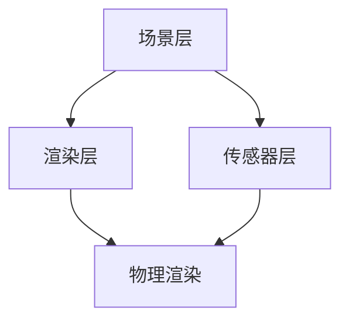

                 

关键词：增强现实（AR）、ARKit、iOS、开发者、AR 应用、AR 模型、用户体验、3D 图形、视觉处理

摘要：本文将深入探讨苹果公司推出的 ARKit 增强现实框架，探讨如何在 iOS 上利用 ARKit 创建令人印象深刻的增强现实体验。文章将介绍 ARKit 的核心概念、算法原理、数学模型以及实际应用案例，帮助开发者掌握 AR 技术的基础，开启 AR 时代的大门。

## 1. 背景介绍

### 1.1 增强现实的定义与历史发展

增强现实（Augmented Reality，简称 AR）是一种将虚拟信息与现实世界融合的技术。它通过计算机生成的图像、视频、3D 模型等，叠加在用户的真实视野中，创造出一种虚实结合的体验。AR 技术的历史可以追溯到 20 世纪 60 年代，当时以“虚拟现实”（Virtual Reality，简称 VR）为主的技术开始萌芽。随着时间的推移，AR 技术逐渐发展，并在 21 世纪初迎来了爆发式增长。

### 1.2 ARKit 的诞生

ARKit 是苹果公司在 2017 年推出的增强现实开发框架，旨在为 iOS 开发者提供简单、高效的方式创建 AR 应用。ARKit 的推出极大地简化了 AR 应用的开发流程，使得开发者可以更轻松地将 AR 功能集成到他们的应用程序中。ARKit 的推出标志着苹果公司在 AR 领域的进一步布局，也为 iOS 设备的用户带来了全新的互动体验。

## 2. 核心概念与联系

### 2.1 ARKit 的核心概念

ARKit 包含了多个核心组件，如：

- **环境理解**：通过计算机视觉算法识别和跟踪平面、物体和场景。
- **增强现实场景**：创建一个虚拟的三维空间，其中可以放置和交互虚拟对象。
- **物理渲染**：利用图形处理单元（GPU）实现高质量的图形渲染。

### 2.2 ARKit 的架构

ARKit 的架构设计简单而高效，主要包括以下三个层次：

- **场景层**：定义 AR 场景的物理布局和交互逻辑。
- **渲染层**：负责渲染虚拟对象和场景。
- **传感器层**：获取设备的传感器数据，如加速度计、陀螺仪等。

### 2.3 Mermaid 流程图



## 3. 核心算法原理 & 具体操作步骤

### 3.1 算法原理概述

ARKit 采用了多种先进的算法来实现增强现实功能，包括：

- **SLAM（Simultaneous Localization and Mapping）**：同时定位与建图，用于在现实世界中定位设备并创建三维地图。
- **深度感知**：通过相机数据估计场景的深度信息，用于渲染和交互。
- **人体追踪**：识别和跟踪用户身体部分，用于创建更具交互性的 AR 体验。

### 3.2 算法步骤详解

ARKit 的算法实现大致可分为以下步骤：

1. **捕获相机数据**：从设备的相机捕获实时视频流。
2. **预处理**：对视频流进行降噪、增强等预处理操作。
3. **环境理解**：利用 SLAM 和深度感知算法识别和跟踪场景中的平面、物体和人体。
4. **渲染虚拟对象**：根据跟踪数据在场景中放置虚拟对象，并使用物理渲染技术进行渲染。
5. **交互**：允许用户与虚拟对象进行交互，如移动、旋转、缩放等。

### 3.3 算法优缺点

ARKit 优点：

- **高效性**：ARKit 的算法设计高效，能够快速处理大量数据。
- **易用性**：提供了丰富的 API 和文档，降低了 AR 应用开发的难度。
- **稳定性**：经过苹果多年的优化，ARKit 在各种设备和场景下都有良好的表现。

ARKit 缺点：

- **硬件限制**：ARKit 的性能依赖于设备的硬件配置，较低的硬件配置可能导致 AR 体验不佳。
- **适用场景限制**：ARKit 适用于大多数场景，但在复杂、动态的场景下可能表现不足。

### 3.4 算法应用领域

ARKit 的算法可以应用于多个领域，包括：

- **游戏**：利用 ARKit 创建沉浸式游戏体验。
- **教育**：通过 AR 技术让学习更加生动有趣。
- **广告营销**：利用 AR 技术增强广告的互动性和吸引力。
- **医疗**：辅助医生进行手术规划、医学成像等。

## 4. 数学模型和公式 & 详细讲解 & 举例说明

### 4.1 数学模型构建

ARKit 的数学模型主要包括：

- **坐标系转换**：用于将虚拟对象的位置、方向与设备坐标系相匹配。
- **相机模型**：用于描述相机成像过程，包括透视变换等。
- **深度估计**：利用激光扫描或其他传感器数据估计场景的深度。

### 4.2 公式推导过程

以下是一个简单的坐标系转换公式推导：

```latex
\begin{aligned}
    P' &= K \cdot [R | t] \cdot P \\
    x' &= f \cdot x / z + c_x \\
    y' &= f \cdot y / z + c_y
\end{aligned}
```

其中，$P'$ 是目标坐标系下的点，$P$ 是原始坐标系下的点，$K$ 是相机内参矩阵，$R$ 是旋转矩阵，$t$ 是平移向量，$f$ 是焦距，$c_x$ 和 $c_y$ 是光学中心坐标。

### 4.3 案例分析与讲解

假设我们有一个立方体，其中心点在原始坐标系中的坐标为 $(x, y, z) = (1, 1, 1)$，我们需要将其映射到相机坐标系中。

1. **构建相机模型**：

```latex
K = \begin{bmatrix}
    f & 0 & c_x \\
    0 & f & c_y \\
    0 & 0 & 1
\end{bmatrix}
R = \begin{bmatrix}
    1 & 0 & 0 \\
    0 & 1 & 0 \\
    0 & 0 & 1
\end{bmatrix}
t = \begin{bmatrix}
    0 \\
    0 \\
    -f
\end{bmatrix}
```

2. **坐标系转换**：

```latex
P' = K \cdot [R | t] \cdot \begin{bmatrix}
    x \\
    y \\
    z \\
    1
\end{bmatrix}
    = \begin{bmatrix}
    f \cdot x / z + c_x \\
    f \cdot y / z + c_y \\
    1
\end{bmatrix}
```

3. **映射到相机坐标系**：

```latex
x' = f \cdot x / z + c_x = 1 \\
y' = f \cdot y / z + c_y = 1
```

因此，立方体的中心点在相机坐标系中的坐标为 $(1, 1)$。

## 5. 项目实践：代码实例和详细解释说明

### 5.1 开发环境搭建

要开始使用 ARKit 开发，首先需要在 Xcode 中创建一个新的 iOS 项目，并确保设备支持 ARKit。在项目的 Capabilities 页面中，勾选 ARKit 选项。

### 5.2 源代码详细实现

以下是一个简单的 ARKit 应用示例，它使用 ARKit 创建一个简单的 3D 立方体。

```swift
import ARKit

class ViewController: UIViewController, ARSCNViewDelegate {

    let sceneView = ARSCNView()

    override func viewDidLoad() {
        super.viewDidLoad()

        sceneView.delegate = self
        sceneView.showsStatistics = true
        sceneView.translatesAutoresizingMaskIntoConstraints = false
        view.addSubview(sceneView)

        NSLayoutConstraint.activate([
            sceneView.topAnchor.constraint(equalTo: view.safeAreaLayoutGuide.topAnchor),
            sceneView.bottomAnchor.constraint(equalTo: view.safeAreaLayoutGuide.bottomAnchor),
            sceneView.leadingAnchor.constraint(equalTo: view.safeAreaLayoutGuide.leadingAnchor),
            sceneView.trailingAnchor.constraint(equalTo: view.safeAreaLayoutGuide.trailingAnchor)
        ])

        let configuration = ARWorldTrackingConfiguration()
        sceneView.session.run(configuration)
    }

    func renderer(_ renderer: SCNSceneRenderer, nodeFor anchor: ARAnchor) -> SCNNode? {
        let node = SCNNode()

        if anchor is ARCameraAnchor {
            let camera = SCNCamera()
            camera.zFar = 10
            camera.zNear = 0.1
            node.camera = camera
        } else if anchor is ARPlaneAnchor {
            let plane = SCNPlane(width: 0.1, height: 0.1)
            plane.firstMaterial?.diffuse.contents = UIColor.blue
            let planeNode = SCNNode(geometry: plane)
            planeNode.position = anchor.position
            node.addChildNode(planeNode)
        }

        return node
    }
}
```

### 5.3 代码解读与分析

1. **创建 ARSCNView**：

   我们首先创建了一个 ARSCNView，并将其作为子视图添加到视图中。ARSCNView 是 ARKit 的核心组件，用于渲染增强现实场景。

2. **配置 ARWorldTrackingConfiguration**：

   我们使用 ARWorldTrackingConfiguration 配置 ARSession，该配置可以处理现实世界的运动和平移。

3. **渲染节点**：

   在 renderer(_:nodeFor:) 方法中，我们为每个 ARAnchor 创建了一个 SCNNode。如果 anchor 是 ARCameraAnchor，我们创建了一个摄像机节点；如果 anchor 是 ARPlaneAnchor，我们创建了一个平面节点。

### 5.4 运行结果展示

运行应用后，我们可以在设备上看到屏幕上的蓝色平面，表示 ARKit 已经成功识别到了平面并创建了相应的节点。

## 6. 实际应用场景

ARKit 在多个领域有着广泛的应用：

- **游戏**：通过 ARKit，开发者可以创建沉浸式的游戏体验，如《Pokemon GO》。
- **教育**：利用 ARKit，学生可以更加直观地学习抽象概念，如分子结构。
- **零售**：商家可以利用 ARKit 为顾客提供虚拟试衣间等服务。

### 6.4 未来应用展望

随着 AR 技术的不断进步，ARKit 的应用场景将更加广泛。未来，我们可以期待 ARKit 在以下领域的应用：

- **远程协作**：通过 ARKit，人们可以更加直观地参与远程会议和协作。
- **医疗**：ARKit 可以辅助医生进行手术规划、医学成像等。
- **城市规划**：利用 ARKit，城市规划师可以更加直观地展示城市规划方案。

## 7. 工具和资源推荐

### 7.1 学习资源推荐

- **官方文档**：苹果的官方 ARKit 文档是最权威的学习资源。
- **ARKit 实战**：推荐阅读《ARKit 实战》一书，了解 ARKit 的实际应用。

### 7.2 开发工具推荐

- **Xcode**：苹果官方的开发工具，用于开发 ARKit 应用。
- **Unity**：一个跨平台的游戏开发引擎，支持 ARKit 开发。

### 7.3 相关论文推荐

- **SLAM 算法**：了解 SLAM 算法对于掌握 ARKit 非常重要，推荐阅读相关论文。
- **深度感知**：深度感知技术在 ARKit 中至关重要，推荐阅读相关论文。

## 8. 总结：未来发展趋势与挑战

ARKit 作为苹果公司的 AR 开发框架，已经成为 iOS 开发者不可或缺的工具。随着 AR 技术的不断进步，ARKit 的应用场景将更加广泛。未来，ARKit 在远程协作、医疗、城市规划等领域有着巨大的潜力。然而，ARKit 也面临着硬件性能、算法优化等方面的挑战。我们期待 ARKit 在未来的发展中能够更好地满足开发者需求，为用户带来更加精彩的 AR 体验。

### 8.1 研究成果总结

本文详细介绍了 ARKit 的核心概念、算法原理、数学模型以及实际应用案例，帮助开发者全面了解 ARKit 的开发和应用。

### 8.2 未来发展趋势

未来，ARKit 将在远程协作、医疗、城市规划等领域迎来新的应用机遇。随着技术的进步，ARKit 的性能和功能将不断提升。

### 8.3 面临的挑战

ARKit 面临的挑战包括硬件性能、算法优化、用户隐私保护等方面。

### 8.4 研究展望

随着 AR 技术的不断发展，ARKit 在未来有望成为跨领域、跨平台的核心技术，为开发者带来更多的创新可能。

## 9. 附录：常见问题与解答

### 9.1 ARKit 与 VR 的区别

ARKit 是用于增强现实，将虚拟信息叠加在现实世界中。VR 是虚拟现实，用户完全沉浸在一个虚拟环境中。两者的主要区别在于体验方式和应用场景。

### 9.2 ARKit 是否支持所有 iOS 设备

ARKit 支持大多数现代 iOS 设备，但性能会根据设备的硬件配置而有所不同。一些老旧设备可能不支持 ARKit。

### 9.3 如何处理 AR 应用中的性能问题

优化 AR 应用的性能可以通过以下方法实现：减少渲染物体数量、优化渲染流程、合理使用 GPU 等。

### 9.4 ARKit 是否支持多用户协作

ARKit 主要支持单用户协作，但可以通过其他技术（如网络编程）实现多用户协作。

---

作者：禅与计算机程序设计艺术 / Zen and the Art of Computer Programming
----------------------------------------------------------------

完成了一篇关于 ARKit 的详细技术博客，从背景介绍到算法原理，再到实际应用和未来展望，希望这篇文章能帮助开发者更好地理解和应用 ARKit 技术。在 AR 时代的大潮中，让我们一起探索和创造更多令人惊叹的 AR 体验！

