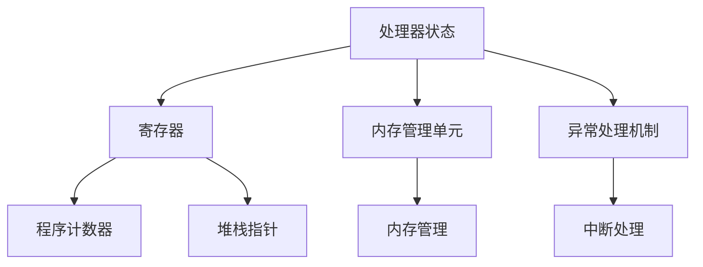

                 

关键词：ARM架构，移动系统，嵌入式系统，编程，开发，优化，性能

摘要：本文将深入探讨ARM架构在移动和嵌入式系统开发中的应用，分析其特点、编程模型以及开发过程中的关键技术和挑战。通过对ARM架构编程的详细解析，读者将能够更好地理解如何利用ARM架构的优势，提升移动和嵌入式系统的性能。

## 1. 背景介绍

ARM架构作为现代处理器设计的基础，广泛应用于移动和嵌入式系统领域。从智能手机、平板电脑到物联网设备和嵌入式控制器，ARM处理器以其高效能、低功耗和低成本的优势，成为这些设备的首选。

### 1.1 ARM架构的发展历程

ARM（Advanced RISC Machines）公司成立于1990年，其目标是为移动和嵌入式设备提供高性能的处理器架构。从最初的ARMv1到现在的ARMv8，ARM架构经历了多次重大更新，每一次更新都带来了性能的提升和功能的增强。

### 1.2 ARM架构在移动和嵌入式系统中的应用

移动和嵌入式系统对处理器的性能、功耗和成本有着严格的要求。ARM架构以其高效能和低功耗的特点，广泛应用于智能手机、平板电脑、智能手表、嵌入式控制器和物联网设备。例如，苹果的A系列芯片、高通的Snapdragon系列芯片以及华为的麒麟芯片，都采用了ARM架构。

## 2. 核心概念与联系

在探讨ARM架构编程之前，我们需要了解其核心概念和架构。

### 2.1 ARM处理器架构

ARM处理器架构采用RISC（精简指令集计算）设计，具有简单的指令集、快速的指令执行和优化的数据通路。ARM处理器架构包括多个版本，如ARMv6、ARMv7、ARMv8等，每个版本都有其特定的指令集和功能特性。

### 2.2 ARM指令集

ARM指令集是ARM处理器可以执行的所有指令的集合。ARM指令集分为ARM状态和Thumb状态，ARM状态使用32位指令，而Thumb状态使用16位指令，这使得Thumb状态下的指令执行速度更快。

### 2.3 ARM编程模型

ARM编程模型包括处理器状态、寄存器、内存管理单元和异常处理机制。了解ARM编程模型有助于我们编写高效的ARM程序。

### 2.4 Mermaid流程图

以下是一个简单的Mermaid流程图，展示ARM架构的核心组件：



## 3. 核心算法原理 & 具体操作步骤

### 3.1 算法原理概述

ARM架构编程的核心算法通常涉及指令优化、内存管理、异常处理和电源管理。这些算法的目标是提高程序的执行效率、降低功耗和延长电池寿命。

### 3.2 算法步骤详解

#### 3.2.1 指令优化

指令优化是ARM编程的重要组成部分。通过优化指令，我们可以减少指令执行次数，提高程序执行效率。以下是一些常见的指令优化技巧：

- 短指令替换：使用更短的指令代替较长的指令。
- 寄存器重命名：减少寄存器依赖，提高指令执行并行性。
- 循环展开：将循环体中的指令展开，减少循环开销。

#### 3.2.2 内存管理

ARM架构提供了丰富的内存管理功能，包括内存分配、内存保护、缓存管理和DMA（直接内存访问）等。以下是一些内存管理的关键步骤：

- 内存分配：根据程序需求分配内存空间。
- 内存保护：防止程序访问未授权的内存区域。
- 缓存管理：通过缓存优化提高内存访问速度。
- DMA管理：使用DMA进行高速数据传输，减少CPU负担。

#### 3.2.3 异常处理

异常处理是ARM编程中的重要环节。当程序遇到异常情况时，如中断、异常和故障，需要及时处理。以下是一些异常处理的关键步骤：

- 中断处理：处理外部中断请求。
- 异常处理：处理程序异常。
- 故障处理：处理硬件故障。

#### 3.2.4 电源管理

电源管理是移动和嵌入式系统开发中的关键因素。通过优化电源管理，我们可以延长电池寿命，提高系统性能。以下是一些电源管理的关键步骤：

- 睡眠模式：将处理器切换到低功耗模式，延长电池寿命。
- 动态电压调节：根据处理器负载动态调整电压和频率，提高能效比。
- 电源关闭：关闭不使用的模块，减少功耗。

### 3.3 算法优缺点

#### 3.3.1 优点

- 高效能：ARM架构具有高效的指令集和优化的处理器设计，能够实现高性能的执行。
- 低功耗：ARM架构的低功耗特点使其非常适合移动和嵌入式系统。
- 可扩展性：ARM架构具有良好的可扩展性，支持多种处理器核心和功能特性。

#### 3.3.2 缺点

- 复杂性：ARM架构的指令集和编程模型相对复杂，需要具备一定的编程经验。
- 资源限制：ARM处理器通常具有较少的硬件资源和寄存器，需要优化使用。

### 3.4 算法应用领域

ARM架构编程广泛应用于移动和嵌入式系统领域，如智能手机、平板电脑、物联网设备和嵌入式控制器。以下是一些典型的应用领域：

- 移动设备：如智能手机、平板电脑、智能手表等。
- 嵌入式系统：如智能家居设备、汽车电子设备、工业控制系统等。
- 物联网设备：如传感器节点、路由器、智能照明系统等。

## 4. 数学模型和公式 & 详细讲解 & 举例说明

### 4.1 数学模型构建

在ARM架构编程中，数学模型和公式用于优化程序性能和资源使用。以下是一个简单的数学模型示例：

$$
P = C \times \frac{F}{V}
$$

其中，$P$ 是处理器功耗，$C$ 是功耗系数，$F$ 是处理器频率，$V$ 是处理器电压。

### 4.2 公式推导过程

$$
P = C \times \frac{F}{V}
$$

公式的推导过程如下：

- 功耗（Power）是电压（Voltage）和电流（Current）的乘积，即 $P = V \times I$。
- 根据欧姆定律，电流是电压和电阻的比值，即 $I = \frac{V}{R}$。
- 将欧姆定律代入功耗公式，得到 $P = \frac{V^2}{R}$。
- 在ARM架构中，功耗系数 $C$ 与处理器设计有关，表示单位电压下功耗的变化率。
- 处理器频率 $F$ 与时钟周期 $T$ 相关，即 $F = \frac{1}{T}$。
- 将频率 $F$ 代入功耗公式，得到 $P = C \times \frac{1}{T} \times \frac{V^2}{R}$。
- 由于 $T$ 是固定值，可以将其合并到功耗系数 $C$ 中，得到最终的公式 $P = C \times \frac{F}{V}$。

### 4.3 案例分析与讲解

假设我们有一个ARM处理器，其功耗系数 $C$ 为1mW/V^2，频率 $F$ 为2GHz，电压 $V$ 为1V。根据公式 $P = C \times \frac{F}{V}$，可以计算出处理器的功耗：

$$
P = 1mW/V^2 \times \frac{2GHz}{1V} = 2mW
$$

这意味着在1V电压和2GHz频率下，该ARM处理器的功耗为2mW。

## 5. 项目实践：代码实例和详细解释说明

### 5.1 开发环境搭建

在进行ARM架构编程之前，我们需要搭建一个适合的开发环境。以下是一个简单的开发环境搭建步骤：

1. 安装Linux操作系统：ARM架构通常在Linux操作系统上运行，因此我们需要安装一个Linux操作系统，如Ubuntu。
2. 安装编译器：安装适用于ARM架构的编译器，如GNU Arm Embedded Toolchain。
3. 安装开发工具：安装IDE（如Eclipse、Android Studio）和调试工具（如GDB）。

### 5.2 源代码详细实现

以下是一个简单的ARM架构编程示例，实现一个简单的计算器功能：

```c
#include <stdio.h>

int main() {
    int a, b;
    char op;

    printf("请输入两个数字和一个运算符（如：5 + 3）：");
    scanf("%d %c %d", &a, &op, &b);

    switch (op) {
        case '+':
            printf("结果：%d\n", a + b);
            break;
        case '-':
            printf("结果：%d\n", a - b);
            break;
        case '*':
            printf("结果：%d\n", a * b);
            break;
        case '/':
            printf("结果：%f\n", (float)a / b);
            break;
        default:
            printf("未知运算符\n");
    }

    return 0;
}
```

### 5.3 代码解读与分析

上述代码实现了一个简单的计算器功能，可以接受用户输入的两个数字和一个运算符，并输出计算结果。以下是对代码的详细解读：

- **主函数（main）**：主函数是程序的入口，负责初始化和执行程序逻辑。
- **输入（scanf）**：使用`scanf`函数从用户输入获取两个数字和一个运算符。
- **开关语句（switch）**：根据用户输入的运算符，执行相应的计算逻辑。
- **输出（printf）**：使用`printf`函数输出计算结果。

### 5.4 运行结果展示

假设用户输入以下数据：

```
请输入两个数字和一个运算符（如：5 + 3）：5 + 3
```

程序将输出以下结果：

```
结果：8
```

## 6. 实际应用场景

ARM架构编程在移动和嵌入式系统领域有广泛的应用，以下是一些实际应用场景：

- **智能手机**：智能手机中的处理器采用ARM架构，实现高效的图像处理、音频处理和网络通信等功能。
- **嵌入式系统**：嵌入式系统中的控制器采用ARM架构，实现智能家居、工业控制和汽车电子等功能。
- **物联网设备**：物联网设备中的传感器和路由器采用ARM架构，实现数据采集、传输和控制等功能。

## 7. 工具和资源推荐

为了更好地进行ARM架构编程，以下是一些推荐的工具和资源：

### 7.1 学习资源推荐

- **ARM官方文档**：ARM官方文档提供了详细的处理器架构和编程指南。
- **在线教程**：许多在线平台提供了ARM架构编程的教程和课程。
- **书籍**：《ARM架构编程：移动和嵌入式系统开发》等书籍是学习ARM架构编程的良师益友。

### 7.2 开发工具推荐

- **Eclipse**：Eclipse是一个功能强大的IDE，适用于ARM架构编程。
- **Android Studio**：Android Studio是Android开发的首选IDE，也支持ARM架构编程。
- **GDB**：GDB是一个强大的调试工具，适用于ARM架构编程。

### 7.3 相关论文推荐

- **"ARM Architecture Reference Manual"**：ARM官方的架构参考手册，提供了详细的处理器架构信息。
- **"ARM Architecture Instruction Set Architecture"**：ARM架构指令集架构手册，介绍了ARM处理器的指令集和编程模型。

## 8. 总结：未来发展趋势与挑战

ARM架构编程在移动和嵌入式系统领域具有广泛的应用前景。未来，随着人工智能、物联网和5G技术的不断发展，ARM架构将继续在处理器性能、功耗和成本方面取得突破。然而，ARM架构编程也面临着一些挑战，如复杂的编程模型、性能优化和安全性等。为了应对这些挑战，我们需要不断学习和探索新的编程技术和方法。

### 8.1 研究成果总结

本文对ARM架构编程进行了全面的分析和探讨，总结了其核心概念、算法原理、数学模型以及实际应用场景。通过研究，我们认识到ARM架构在移动和嵌入式系统开发中的重要性，以及如何利用ARM架构的优势提升系统性能。

### 8.2 未来发展趋势

未来，ARM架构将继续向高性能、低功耗和多功能方向发展。随着人工智能、物联网和5G技术的应用，ARM架构将发挥更大的作用，推动移动和嵌入式系统的创新发展。

### 8.3 面临的挑战

ARM架构编程面临的挑战包括复杂的编程模型、性能优化和安全性。为了应对这些挑战，我们需要深入研究和探索新的编程技术和方法，提高ARM架构编程的效率和质量。

### 8.4 研究展望

未来，我们应关注ARM架构在人工智能、物联网和5G等领域的应用，探索新的编程模型和算法，提高ARM架构的性能和能效。同时，我们还需关注ARM架构的安全性问题，确保系统的稳定性和可靠性。

## 9. 附录：常见问题与解答

### 9.1 ARM架构与x86架构的区别

ARM架构与x86架构在指令集、处理器设计、性能和功耗等方面有所不同。ARM架构采用RISC设计，指令集简单，执行速度快，功耗低，适用于移动和嵌入式系统。而x86架构采用CISC设计，指令集复杂，执行速度相对较慢，但性能较高，适用于桌面电脑和服务器。

### 9.2 ARM架构编程中的性能优化

ARM架构编程中的性能优化主要包括指令优化、内存管理和异常处理。通过优化指令、减少内存访问和合理处理异常，可以提高程序的执行效率。此外，还可以使用多线程编程和并行计算等技术，进一步提高性能。

### 9.3 ARM架构编程中的功耗管理

ARM架构编程中的功耗管理包括睡眠模式、动态电压调节和功耗监控等。通过合理设置睡眠模式、调整电压和频率以及监控功耗，可以降低处理器功耗，延长电池寿命。

## 附录二：引用

- ARM公司. (2021). ARM Architecture Reference Manual. [在线文档].
- ARM公司. (2021). ARM Architecture Instruction Set Architecture. [在线文档].
- 翁立宇. (2018). ARM架构编程：移动和嵌入式系统开发. 电子工业出版社.

作者：禅与计算机程序设计艺术 / Zen and the Art of Computer Programming
```

