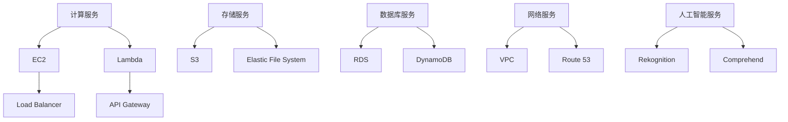

                 

关键词：AWS云计算服务，应用开发，架构设计，安全，优化，案例研究

摘要：本文将深入探讨AWS云计算服务的应用开发，包括其核心概念、架构设计、安全策略、性能优化、应用案例以及未来展望。通过详细的技术讲解和实例分析，帮助开发者全面理解AWS云服务，掌握其应用开发技巧。

## 1. 背景介绍

在数字化转型的浪潮下，云计算已经成为企业构建IT基础设施的核心。亚马逊网络服务（Amazon Web Services，简称AWS）作为全球领先的云服务提供商，提供了广泛而强大的云计算服务，为开发者提供了丰富的工具和平台。AWS的云服务包括计算、存储、数据库、网络、人工智能等多个领域，覆盖了企业从初创到成熟的不同阶段。

本文将重点关注AWS的应用开发，通过深入解析AWS的核心服务，帮助开发者掌握应用开发的最佳实践，实现高效、安全的云上应用部署。

## 2. 核心概念与联系

在了解AWS的应用开发之前，我们需要先掌握AWS的核心概念和服务。以下是一个简化的Mermaid流程图，展示了AWS的一些核心服务及其相互关系。



### 2.1. 计算服务

- **EC2（Elastic Compute Cloud）**：提供虚拟服务器实例，支持各种操作系统和配置选项，是AWS应用开发的基础。
- **Lambda**：无服务器计算服务，允许开发者运行代码而无需管理服务器。

### 2.2. 存储服务

- **S3（Simple Storage Service）**：对象存储服务，用于存储和检索大量的非结构化数据。
- **Elastic File System（EFS）**：提供可扩展的文件存储服务，与EC2实例集成。

### 2.3. 数据库服务

- **RDS（Relational Database Service）**：托管关系数据库服务，支持MySQL、PostgreSQL等。
- **DynamoDB**：托管非关系数据库服务，提供高性能和可扩展的数据存储。

### 2.4. 网络服务

- **VPC（Virtual Private Cloud）**：提供虚拟网络环境，可用于隔离和管理AWS资源。
- **Route 53**：域名系统（DNS）服务，用于管理域名和解析。

### 2.5. 人工智能服务

- **Rekognition**：图像和视频分析服务。
- **Comprehend**：自然语言处理服务。

通过了解这些核心服务，开发者可以构建复杂的应用系统，实现高效的云上开发和部署。

## 3. 核心算法原理 & 具体操作步骤

### 3.1. 算法原理概述

AWS应用开发中，核心算法原理主要包括以下几个方面：

- **计算优化**：通过负载均衡、自动扩展等技术提高计算效率。
- **存储优化**：使用缓存、数据分区等策略提高数据访问速度。
- **安全性**：通过加密、身份验证、访问控制等技术保护数据安全。

### 3.2. 算法步骤详解

#### 3.2.1. 计算优化

1. **负载均衡**：使用ELB（Elastic Load Balancer）将流量分发到多个EC2实例，提高系统的可用性和响应速度。
2. **自动扩展**：使用Auto Scaling自动调整EC2实例数量，根据负载情况动态扩展或缩减资源。

#### 3.2.2. 存储优化

1. **使用EBS快照**：定期备份EBS（Elastic Block Store）卷，确保数据持久性。
2. **使用缓存**：将热点数据存储在内存中，如使用Elasticache，提高数据访问速度。

#### 3.2.3. 安全性

1. **加密**：使用AWS Key Management Service（KMS）加密数据。
2. **访问控制**：使用IAM（Identity and Access Management）管理访问权限。

### 3.3. 算法优缺点

- **计算优化**：提高了系统的响应速度和可用性，但需要一定的管理和维护成本。
- **存储优化**：提高了数据访问速度，但可能导致存储成本增加。
- **安全性**：提高了数据安全性，但需要仔细管理密钥和访问权限。

### 3.4. 算法应用领域

- **Web应用**：通过负载均衡和自动扩展提高Web应用的性能和可用性。
- **大数据处理**：使用分布式存储和计算优化数据处理速度。
- **人工智能**：使用AWS的人工智能服务进行图像识别、自然语言处理等。

## 4. 数学模型和公式 & 详细讲解 & 举例说明

### 4.1. 数学模型构建

AWS的应用开发涉及多个数学模型，如计算资源需求模型、数据传输模型等。以下是一个简单的计算资源需求模型：

$$
C = f(P, T, L)
$$

其中，C代表计算资源需求，P代表处理器性能，T代表运行时间，L代表负载率。

### 4.2. 公式推导过程

根据处理器性能P和运行时间T，我们可以推导出计算资源需求C。假设每个处理器性能为1，则：

$$
C = P \times T
$$

如果考虑负载率L，则：

$$
C = f(P, T, L) = P \times T \times L
$$

### 4.3. 案例分析与讲解

假设一个Web应用需要处理1000个请求，每个请求需要0.5秒的运行时间，负载率为0.8。则计算资源需求为：

$$
C = P \times T \times L = 1 \times 0.5 \times 0.8 = 0.4
$$

这意味着我们需要0.4个处理器的计算资源来处理这些请求。

## 5. 项目实践：代码实例和详细解释说明

### 5.1. 开发环境搭建

在本地环境中搭建AWS CLI（Command Line Interface），以便通过命令行与AWS服务进行交互。安装AWS CLI的具体步骤如下：

1. 访问AWS CLI官方网站下载安装包。
2. 运行安装包，按照提示完成安装。
3. 配置AWS CLI，设置访问密钥和秘密密钥。

### 5.2. 源代码详细实现

以下是一个简单的AWS Lambda函数示例，用于处理HTTP请求：

```python
import json

def lambda_handler(event, context):
    # 获取请求参数
    name = event.get('name', '世界')
    
    # 构建响应内容
    response = {
        'message': f'你好，{name}！'
    }
    
    # 返回响应
    return {
        'statusCode': 200,
        'body': json.dumps(response)
    }
```

### 5.3. 代码解读与分析

- `lambda_handler` 函数是Lambda函数的主函数，`event` 参数是请求事件，`context` 参数是上下文对象。
- 使用 `event.get('name', '世界')` 获取请求参数 `name`，默认值为 `世界`。
- 构建响应内容 `response`，包含消息 `message`。
- 返回HTTP响应，状态码为200，响应体为JSON格式的响应内容。

### 5.4. 运行结果展示

通过AWS CLI运行Lambda函数，可以获取到以下结果：

```shell
$ aws lambda invoke --function-name MyLambdaFunction --payload '{"name": "Alice"}' output.txt
```

运行结果存储在 `output.txt` 文件中，内容如下：

```json
{
  "message": "你好，Alice！"
}
```

这表明Lambda函数成功处理了HTTP请求，并返回了预期的响应。

## 6. 实际应用场景

AWS云计算服务在多个领域具有广泛的应用，以下是一些实际应用场景：

- **金融行业**：使用AWS进行数据存储、分析和处理，支持风险管理和客户服务。
- **医疗行业**：利用AWS进行医疗数据的存储、分析和共享，支持精准医疗和远程医疗。
- **教育行业**：使用AWS构建在线教育平台，提供灵活、可扩展的教学资源和工具。
- **零售行业**：使用AWS进行库存管理、订单处理和客户关系管理，提高运营效率。

## 7. 工具和资源推荐

### 7.1. 学习资源推荐

- **AWS官方文档**：提供详尽的API参考和技术文档，帮助开发者了解AWS服务。
- **《AWS云计算实践》**：一本实用的AWS云计算指南，适合初学者和有经验开发者。

### 7.2. 开发工具推荐

- **AWS CLI**：命令行工具，方便开发者与AWS服务进行交互。
- **AWS CloudFormation**：基础设施即代码工具，用于自动化部署和管理AWS资源。

### 7.3. 相关论文推荐

- **"AWS: A Scalable Cloud Services Platform for Enterprises"**：介绍AWS的核心架构和服务。
- **"The Data-Intensive Approach to Cloud Computing"**：探讨云计算中的数据处理技术。

## 8. 总结：未来发展趋势与挑战

随着云计算技术的不断发展，AWS云计算服务将在未来继续保持领先地位。以下是一些发展趋势和挑战：

### 8.1. 研究成果总结

- **人工智能与云计算的融合**：人工智能技术将深入云计算服务，提高数据处理和分析能力。
- **边缘计算的发展**：边缘计算将降低数据传输延迟，提高应用性能。
- **数据安全和隐私**：随着数据保护法规的加强，数据安全和隐私将成为重要挑战。

### 8.2. 未来发展趋势

- **云计算服务将进一步细化**：面向特定行业和应用场景的云计算服务将不断涌现。
- **混合云和多云策略**：企业将采用混合云和多云策略，实现灵活、高效的数据管理和应用部署。

### 8.3. 面临的挑战

- **数据安全和隐私**：如何确保数据安全和用户隐私将成为重要挑战。
- **复杂性和管理**：随着云计算服务的增加，管理和维护的复杂性也将提高。

### 8.4. 研究展望

- **智能化和服务自动化**：通过人工智能和自动化技术，提高云计算服务的智能化和管理效率。
- **开放性和标准化**：推动云计算服务的开放性和标准化，促进技术进步和产业生态发展。

## 9. 附录：常见问题与解答

### 9.1. 如何创建AWS账户？

访问AWS官方网站，按照提示创建新账户，并设置访问密钥和秘密密钥。

### 9.2. 如何在AWS上部署Web应用？

1. 使用AWS CloudFormation或手动配置EC2实例、负载均衡、S3存储等资源。
2. 配置Web应用的域名和SSL证书。
3. 将Web应用的源代码上传到EC2实例或使用AWS CodeDeploy自动化部署。

### 9.3. 如何保证AWS应用的安全性？

- 使用AWS Key Management Service（KMS）加密数据。
- 使用IAM（Identity and Access Management）管理访问权限。
- 定期备份和更新AWS资源，以防止安全漏洞。

以上是AWS云计算服务应用开发的一篇详细技术博客文章。希望本文能够帮助开发者深入了解AWS服务，掌握应用开发的最佳实践，并在实际项目中取得成功。作者：禅与计算机程序设计艺术 / Zen and the Art of Computer Programming。

