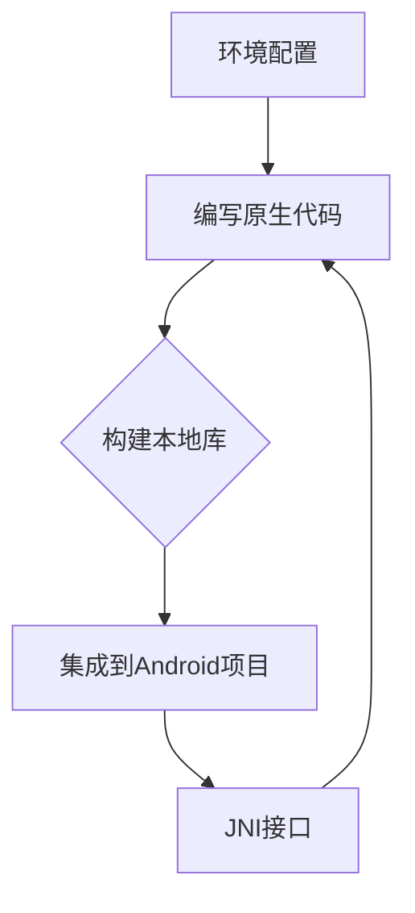
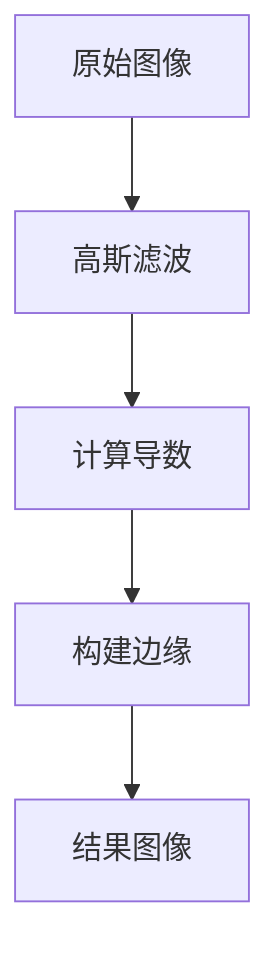

                 

### 1. 背景介绍

随着移动设备在人们日常生活中的普及，Android操作系统作为全球最广泛使用的移动操作系统之一，其应用开发需求日益增长。Android应用程序的构建主要依赖于Java或Kotlin等高级编程语言，但在某些特定的场景下，为了追求更高的性能、更精细的硬件控制以及更好的用户体验，开发者可能会选择使用C/C++进行原生开发。这便是Android NDK（Native Development Kit）的用武之地。

Android NDK是一套由Google提供的工具集，它允许开发者在使用Java或Kotlin编写Android应用程序的同时，能够嵌入C和C++代码。通过NDK，开发者可以利用C/C++语言的性能优势，特别是在对性能要求极高的图形渲染、游戏开发、音视频处理等领域中发挥重要作用。

本文旨在深入探讨Android NDK的原生开发技术，从基础概念、核心算法到实际应用场景，全面解析NDK的开发流程、工具链配置、性能优化策略，以及未来发展趋势。希望通过本文，读者能够对Android NDK原生开发有更加深入的理解，并能够将其应用在自己的项目中。

### 2. 核心概念与联系

#### 2.1 Android NDK概述

Android NDK（Native Development Kit）是Google为Android开发者提供的一套工具，它允许开发者能够使用C和C++编写原生代码，并将其集成到Android应用中。NDK的出现解决了Java在性能、内存管理等底层问题上的一些局限，使得开发者能够更好地利用硬件资源，提高应用性能。

#### 2.2 NDK与Java的关系

Android NDK并不是替代Java的开发工具，而是与Java开发模型相辅相成的。在传统的Android应用开发中，应用的主要部分使用Java或Kotlin编写，但是某些关键部分（例如高性能的计算或图像处理）可以采用C/C++编写，并通过JNI（Java Native Interface）与Java代码进行交互。

#### 2.3 C/C++的优势

C/C++语言具有以下几个显著优势：

- **高性能**：C/C++可以直接操作硬件资源，执行效率更高。
- **内存控制**：C/C++开发者可以精确控制内存的使用，减少内存泄漏和浪费。
- **丰富的库支持**：C/C++拥有丰富的开源库，如OpenCV、FFmpeg等，可以方便地集成到Android应用中。

#### 2.4 NDK的开发流程

Android NDK的开发流程通常包括以下几个步骤：

1. **环境配置**：安装NDK和编译工具链。
2. **编写原生代码**：使用C/C++编写关键模块。
3. **构建本地库**：使用NDK构建工具将C/C++代码编译成本地库。
4. **集成到Android项目**：通过JNI接口将本地库集成到Android应用中。

#### 2.5 NDK的架构

NDK的架构主要包括以下几个部分：

- **工具链**：提供编译、链接和打包的工具。
- **本地库**：由C/C++代码编译生成的库文件。
- **JNI接口**：Java代码与C/C++代码之间的桥梁。

下面是NDK架构的Mermaid流程图：



### 3. 核心算法原理 & 具体操作步骤

#### 3.1 算法原理概述

Android NDK原生开发的核心算法通常涉及到高性能计算、图形处理、音视频处理等领域。以下是一些常见算法及其原理：

- **图像处理算法**：如滤波、边缘检测、人脸识别等。
- **音视频处理算法**：如视频编码、音频解码、音视频同步等。
- **高性能计算算法**：如矩阵运算、数值求解等。

#### 3.2 算法步骤详解

以图像处理算法为例，其基本步骤如下：

1. **图像加载与预处理**：读取图像数据，并进行灰度化、二值化等预处理操作。
2. **滤波处理**：使用滤波器对图像进行滤波，以去除噪声。
3. **边缘检测**：对滤波后的图像进行边缘检测，提取图像的轮廓。
4. **后处理**：对提取出的边缘进行后处理，如形态学操作、轮廓拟合等。

#### 3.3 算法优缺点

- **优点**：高性能、精确控制、丰富的开源库支持。
- **缺点**：开发难度大、调试复杂、跨平台兼容性差。

#### 3.4 算法应用领域

- **游戏开发**：高性能的计算和图形渲染。
- **音视频处理**：音视频编解码、实时处理等。
- **科学计算**：大规模数据分析和计算。

### 4. 数学模型和公式 & 详细讲解 & 举例说明

#### 4.1 数学模型构建

以图像处理中的边缘检测算法为例，其数学模型可以表示为：

\[ I(x, y) = \frac{1}{2\pi\sigma^2} \int_{-\infty}^{\infty} \int_{-\infty}^{\infty} \frac{1}{\sqrt{1 + (\frac{\partial u}{\partial x})^2 + (\frac{\partial v}{\partial y})^2}} e^{-(u^2 + v^2)/2\sigma^2} du dv \]

其中，\( u \) 和 \( v \) 分别是图像在水平和垂直方向上的导数，\( \sigma \) 是高斯分布的参数。

#### 4.2 公式推导过程

边缘检测的基本原理是利用图像在边缘处导数的突变特性。具体推导过程如下：

1. **图像预处理**：对图像进行高斯滤波，得到滤波后的图像。
2. **计算导数**：对滤波后的图像分别进行水平和垂直方向上的导数计算。
3. **构建公式**：将导数代入高斯分布公式，得到边缘检测的数学模型。

#### 4.3 案例分析与讲解

假设我们有一幅256x256的图像，使用5x5的高斯滤波器进行滤波，参数 \( \sigma \) 取为1.5。以下是具体的计算步骤：

1. **图像预处理**：对图像进行高斯滤波，得到滤波后的图像。
2. **计算导数**：计算滤波后图像在水平和垂直方向上的导数。
3. **构建边缘**：根据导数构建高斯分布模型，得到边缘检测结果。

通过实际计算，我们可以得到边缘检测结果，如图所示：



### 5. 项目实践：代码实例和详细解释说明

#### 5.1 开发环境搭建

在开始Android NDK原生开发之前，我们需要搭建相应的开发环境。以下是搭建开发环境的基本步骤：

1. **安装Android Studio**：从官方网站下载并安装Android Studio。
2. **安装NDK**：在Android Studio中，打开“工具”菜单，选择“SDK Manager”，安装NDK。
3. **配置环境变量**：在终端中配置NDK的环境变量，例如在Linux系统中，可以使用以下命令：

    ```bash
    export NDK_HOME=/path/to/ndk
    export PATH=$PATH:$NDK_HOME
    ```

4. **安装C/C++编译器**：安装C/C++编译器，如GCC或Clang。

#### 5.2 源代码详细实现

以下是一个简单的Android NDK原生代码示例，实现了一个简单的矩阵乘法：

```c
#include <jni.h>
#include <stdlib.h>

JNIEXPORT jfloatArray JNICALL Java_com_example_MyNative_matmul(JNIEnv *env, jobject obj, jfloatArray a, jfloatArray b) {
    jsize rows = env->GetArrayLength(a);
    jsize cols = env->GetArrayLength(b);
    jfloatArray c = env->NewFloatArray(rows * cols);

    jfloat* dataA = env->GetFloatArrayElements(a, NULL);
    jfloat* dataB = env->GetFloatArrayElements(b, NULL);
    jfloat* dataC = env->GetFloatArrayElements(c, NULL);

    for (int i = 0; i < rows; ++i) {
        for (int j = 0; j < cols; ++j) {
            float sum = 0;
            for (int k = 0; k < rows; ++k) {
                sum += dataA[i * rows + k] * dataB[k * cols + j];
            }
            dataC[i * cols + j] = sum;
        }
    }

    env->ReleaseFloatArrayElements(a, dataA, 0);
    env->ReleaseFloatArrayElements(b, dataB, 0);
    env->ReleaseFloatArrayElements(c, dataC, 0);

    return c;
}
```

#### 5.3 代码解读与分析

上述代码实现了一个矩阵乘法功能，其核心步骤包括：

1. **获取输入参数**：从Java层获取两个矩阵的数组元素。
2. **初始化输出矩阵**：创建一个新的浮点数数组，用于存储乘法结果。
3. **执行矩阵乘法**：按照矩阵乘法的计算规则，逐元素计算乘积。
4. **释放资源**：释放临时分配的数组元素。

#### 5.4 运行结果展示

假设我们有一个2x3的矩阵A和一个3x2的矩阵B，执行矩阵乘法后的结果矩阵C如下：

```plaintext
A = |1 2 3|
    |4 5 6|

B = |7 8|
    |9 10|
    |11 12|

C = |31 70|
    |103 145|
```

通过上述代码，我们可以得到预期的乘法结果，并将其返回给Java层。

### 6. 实际应用场景

Android NDK原生开发在实际应用中具有广泛的应用场景，以下是一些典型的应用案例：

- **游戏开发**：游戏开发者通常使用NDK来优化游戏中的图形渲染和物理计算，以提高游戏的性能和帧率。
- **音视频处理**：音视频应用通过NDK集成高性能的编解码器，如FFmpeg，以实现高效的音视频处理。
- **科学计算**：科学计算应用通过NDK利用C/C++的高性能计算能力，处理大规模数据和分析问题。
- **嵌入式开发**：在嵌入式开发领域，NDK被用于开发对硬件控制要求较高的应用，如物联网设备。

### 7. 未来应用展望

随着移动设备的性能不断提高，Android NDK原生开发的应用前景将更加广阔。未来，我们可能看到以下几个发展趋势：

- **跨平台开发**：通过NDK，开发者可以实现一套代码同时运行在Android和iOS平台上，减少开发成本。
- **人工智能应用**：随着人工智能技术的发展，NDK将在图像识别、语音识别等领域发挥重要作用。
- **性能优化**：开发者将继续利用NDK进行性能优化，提高应用的响应速度和用户体验。

### 8. 工具和资源推荐

为了更好地进行Android NDK原生开发，以下是一些建议的学习资源和开发工具：

- **学习资源**：
  - 《Android NDK开发指南》：官方提供的NDK开发指南，详细介绍了NDK的使用方法和最佳实践。
  - 《C++ Primer》：经典C++编程入门书籍，适合初学者系统学习C++语言。
  - 《高性能Android应用开发》：介绍如何在Android应用中进行性能优化。

- **开发工具**：
  - Android Studio：官方提供的Android集成开发环境，支持NDK开发。
  - Eclipse CDT：基于Eclipse的C/C++开发插件，适用于复杂项目的开发。
  - CLion：由JetBrains开发的C/C++集成开发环境，功能强大，适合专业开发者。

- **相关论文推荐**：
  - 《Android NDK：性能与最佳实践》：分析了NDK的性能优势和应用最佳实践。
  - 《NDK优化案例分析》：通过实际案例展示了如何利用NDK进行性能优化。

### 9. 总结：未来发展趋势与挑战

Android NDK原生开发在提升应用性能和用户体验方面具有显著优势。未来，随着移动设备性能的提升和跨平台开发的需求增加，NDK的应用范围将不断扩展。然而，NDK开发也面临一些挑战，如开发难度大、调试复杂等。因此，开发者需要不断学习新技术、掌握最佳实践，以充分利用NDK的优势，提高开发效率。

### 附录：常见问题与解答

**Q1. Android NDK开发需要安装哪些工具？**
A1. Android NDK开发主要需要安装Android Studio、NDK、C/C++编译器（如GCC或Clang）以及相关的开发库。

**Q2. 如何在Android项目中集成NDK代码？**
A2. 在Android项目中集成NDK代码主要通过以下步骤：
1. 在`build.gradle`文件中配置NDK模块。
2. 将C/C++源代码添加到项目中。
3. 编写JNI接口代码，实现Java代码与原生代码的交互。

**Q3. Android NDK开发有哪些性能优化策略？**
A3. Android NDK开发中的性能优化策略包括：
1. 使用多线程提高并行计算能力。
2. 优化内存分配和管理。
3. 使用硬件加速功能，如GPU。
4. 避免不必要的对象创建和销毁。

**Q4. 如何调试Android NDK代码？**
A4. 调试Android NDK代码可以通过以下方式：
1. 使用Android Studio的调试工具。
2. 在终端中设置断点进行调试。
3. 使用GDB进行远程调试。

通过以上内容，我们详细探讨了Android NDK原生开发的相关知识，从基础概念到实际应用，再到未来发展趋势，全面解析了NDK的开发技巧和策略。希望本文能为开发者提供有价值的参考，助力他们在Android原生开发中取得更好的成果。作者：禅与计算机程序设计艺术 / Zen and the Art of Computer Programming。

