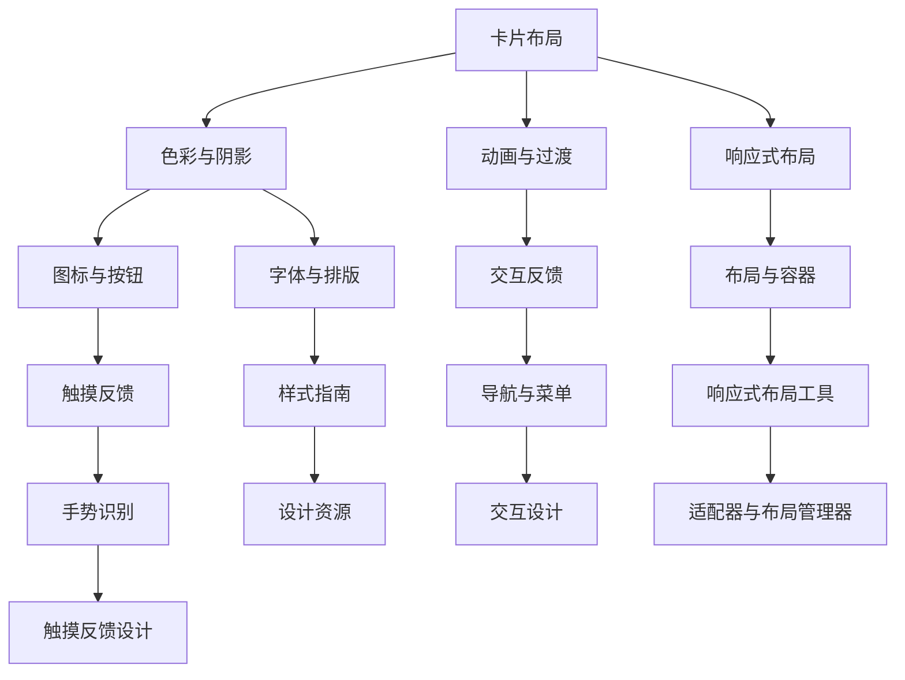

                 

关键词：Android，材料设计，高级功能，用户界面，开发框架，最佳实践，性能优化

> 摘要：本文将深入探讨Android平台中的材料设计原则及其实现方法，同时介绍一系列高级功能，帮助开发者构建高效、直观的用户界面。我们将通过详细的技术讲解和实践示例，为读者提供实用的指导，以提升Android应用的开发水平。

## 1. 背景介绍

Android作为全球最流行的移动操作系统，其用户基础庞大，开发者社区活跃。随着时间的推移，Android平台不断演进，不仅提供了丰富的硬件支持，还引入了新的设计理念和开发工具。其中，材料设计（Material Design）是Google推出的一套全新的设计语言，旨在统一不同平台（包括Android和iOS）的应用界面风格，提升用户体验。

材料设计不仅仅是一个视觉风格指南，更是一种设计哲学，它强调界面元素的一致性、交互的直观性以及内容的清晰表达。通过这种设计方法，开发者能够创建既美观又易于使用的应用。

本文将围绕材料设计的核心概念展开，详细介绍其组成部分，并通过实例讲解如何实现高级功能，包括性能优化、动画效果、以及自定义控件等。通过本文的阅读，开发者可以掌握材料设计的关键技巧，并将之应用到实际项目中，提升应用的竞争力。

### 1.1 材料设计的发展历程

材料设计最早在2014年Google I/O大会上正式推出，随着时间的推移，Google不断对其进行完善和更新。以下是其主要发展历程：

- **2014年**：Google I/O大会，材料设计首次亮相。
- **2015年**：Android Lollipop 5.0版本发布，全面引入材料设计。
- **2016年**：Google I/O大会，推出更详细的视觉和交互指南。
- **2018年**：Android P版本发布，进一步优化材料设计。
- **2020年**：Android 11版本发布，持续改进材料设计的细节。

### 1.2 材料设计的核心概念

材料设计基于物理世界的物质和光影原理，通过二维和三维空间的表现，创造出逼真的视觉效果。其核心概念包括：

- **卡片布局**（Cards）：将内容组织成卡片形式，方便用户浏览和操作。
- **色彩与阴影**（Color & Shadows）：使用阴影和色彩对比，增强界面的层次感和立体感。
- **动画与过渡**（Animations & Transitions）：通过流畅的动画效果，提升用户交互体验。
- **响应式布局**（Responsive Design）：适应不同屏幕尺寸和分辨率，提供一致的用户体验。

## 2. 核心概念与联系

### 2.1 材料设计的组成部分

材料设计由多个部分组成，每个部分都有其特定的功能和实现方式。以下是一个简化的Mermaid流程图，展示了材料设计的核心组成部分及其关系：



### 2.2 材料设计的基本原则

- **一致性**（Consistency）：确保应用在不同设备和屏幕上提供一致的用户体验。
- **反馈**（Feedback）：通过视觉和动画效果，明确用户的交互结果。
- **简洁**（Simplicity）：去除不必要的元素，使界面简洁直观。
- **可访问性**（Accessibility）：确保应用对各种用户群体（包括残障人士）的可访问性。

## 3. 核心算法原理 & 具体操作步骤

### 3.1 算法原理概述

材料设计的实现主要依赖于Android SDK提供的各种组件和API。开发者需要了解以下几个方面：

- **ViewGroup**：布局容器，用于组织和管理子视图。
- **RecyclerView**：高效的列表视图，支持卡片布局和滑动删除等效果。
- **Material Components for Android**：Google提供的UI组件库，包括按钮、卡片、文本输入框等。
- **Animation API**：用于实现动画效果。

### 3.2 算法步骤详解

#### 3.2.1 创建卡片布局

1. **定义布局文件**：在XML布局文件中，使用`<androidx.cardview.widget.CardView>`组件创建卡片布局。
2. **设置卡片属性**：包括卡片颜色、阴影、圆角等。
3. **添加子视图**：将文本、图片、按钮等子视图添加到卡片布局中。

#### 3.2.2 实现阴影效果

1. **使用`CardView`组件**：`CardView`组件内置阴影效果，通过设置`app:cardElevation`属性可以调整阴影大小。
2. **自定义阴影**：如果需要自定义阴影效果，可以使用`<shape>`标签定义形状，并通过`android:shadowXXX`属性设置阴影参数。

#### 3.2.3 添加动画效果

1. **使用`Animation` API**：通过`Animation`类创建动画效果，如平移、缩放、旋转等。
2. **设置动画属性**：包括动画时长、重复次数、延迟等。
3. **绑定动画到视图**：使用`startAnimation()`方法将动画应用到视图上。

#### 3.2.4 实现响应式布局

1. **使用约束布局**（ConstraintLayout）：通过约束布局实现复杂布局的响应式设计。
2. **设置视图属性**：根据屏幕尺寸和分辨率，设置视图的宽度、高度、对齐方式等。
3. **使用适配器**：使用适配器（Adapter）来处理列表视图的数据绑定和刷新。

### 3.3 算法优缺点

#### 优点

- **提高用户体验**：通过一致的视觉风格和直观的交互设计，提升用户满意度。
- **提高开发效率**：使用预定义的UI组件和工具，减少开发工作量。
- **响应式设计**：适应不同屏幕尺寸和分辨率，提供一致的用户体验。

#### 缺点

- **学习成本**：对于新手开发者来说，材料设计的实现可能需要一定时间来学习和适应。
- **兼容性问题**：部分旧版本Android系统可能不支持某些新特性，需要额外处理兼容性问题。

### 3.4 算法应用领域

材料设计适用于各种类型的Android应用，包括社交媒体、电子商务、视频播放、新闻阅读等。通过应用材料设计原则，开发者可以创建美观、高效、易用的应用界面。

## 4. 数学模型和公式 & 详细讲解 & 举例说明

### 4.1 数学模型构建

材料设计的实现涉及到一些基本的数学模型，如线性代数、微积分等。以下是一个简单的数学模型示例：

- **2D变换**：用于实现视图的平移、缩放、旋转等效果。
  $$ T(x, y) = (x', y') = (x + dx, y + dy) $$
  $$ S(x, y) = (x', y') = (x \cdot s, y \cdot s) $$
  $$ R(\theta) = (x', y') = (x \cos \theta - y \sin \theta, x \sin \theta + y \cos \theta) $$

### 4.2 公式推导过程

以平移变换为例，推导过程如下：

1. **初始状态**：设点P的坐标为(x, y)。
2. **变换**：将点P沿x轴和y轴分别移动dx和dy，得到新坐标P'。
3. **结果**：根据坐标变换公式，得到P'的坐标为(x + dx, y + dy)。

### 4.3 案例分析与讲解

#### 案例背景

假设有一个视图View，其初始位置在屏幕中央，需要实现一个向右平移的动画效果。

#### 解题步骤

1. **创建动画**：使用`TranslateAnimation`类创建一个平移动画。
2. **设置动画参数**：设置动画时长、重复次数、起始位置和结束位置。
3. **绑定动画到视图**：使用`startAnimation()`方法将动画应用到视图上。
4. **执行动画**：当动画开始时，视图将按照设定的参数进行平移。

```java
// 创建平移动画
Animation animation = new TranslateAnimation(
    Animation.RELATIVE_TO_SELF, 0.5f,
    Animation.RELATIVE_TO_SELF, 1.0f,
    Animation.RELATIVE_TO_PARENT, 0,
    Animation.RELATIVE_TO_PARENT, 0
);

// 设置动画参数
animation.setDuration(1000);
animation.setRepeatCount(Animation.INFINITE);
animation.setFillBefore(true);

// 绑定动画到视图
view.startAnimation(animation);
```

通过上述步骤，视图将实现一个持续的向右平移动画效果。

## 5. 项目实践：代码实例和详细解释说明

### 5.1 开发环境搭建

为了实践材料设计，我们需要搭建一个Android开发环境。以下是搭建步骤：

1. **安装Android Studio**：从[Android Studio官网](https://developer.android.com/studio)下载并安装Android Studio。
2. **创建新项目**：打开Android Studio，创建一个名为"MaterialDesignDemo"的新项目。
3. **选择API级别**：选择一个适当的API级别，例如API 30。
4. **配置项目依赖**：在`build.gradle`文件中添加Material Design相关依赖。

```groovy
dependencies {
    implementation 'com.google.android.material:material:1.4.0'
}
```

### 5.2 源代码详细实现

以下是实现一个简单的Material Design应用的源代码：

**activity_main.xml**：

```xml
<?xml version="1.0" encoding="utf-8"?>
<androidx.coordinatorlayout.widget.CoordinatorLayout xmlns:android="http://schemas.android.com/apk/res/android"
    xmlns:app="http://schemas.android.com/apk/res-auto"
    xmlns:tools="http://schemas.android.com/tools"
    android:layout_width="match_parent"
    android:layout_height="match_parent"
    tools:context=".MainActivity">

    <com.google.android.material.appbar.AppBarLayout
        android:layout_width="match_parent"
        android:layout_height="wrap_content"
        android:theme="@style/ThemeOverlay.AppCompat.Dark.ActionBar">

        <androidx.appcompat.widget.Toolbar
            android:id="@+id/toolbar"
            android:layout_width="match_parent"
            android:layout_height="?attr/actionBarSize"
            app:popupTheme="@style/ThemeOverlay.AppCompat.Light" />

    </com.google.android.material.appbar.AppBarLayout>

    <com.google.android.material.floatingactionbutton.FloatingActionButton
        android:id="@+id/fab"
        android:layout_width="wrap_content"
        android:layout_height="wrap_content"
        android:layout_margin="16dp"
        android:src="@android:drawable/ic_input_add"
        app:layout_anchor="@id/toolbar"
        app:layout_anchorGravity="bottom|end" />

    <TextView
        android:layout_width="wrap_content"
        android:layout_height="wrap_content"
        android:layout_margin="16dp"
        android:text="这是一个Material Design示例"
        app:layout_behavior="@string/appbar_scrolling_view_behavior" />

</androidx.coordinatorlayout.widget.CoordinatorLayout>
```

**MainActivity.java**：

```java
import android.os.Bundle;
import androidx.appcompat.app.AppCompatActivity;
import androidx.coordinatorlayout.widget.CoordinatorLayout;
import com.google.android.material.floatingactionbutton.FloatingActionButton;

public class MainActivity extends AppCompatActivity {

    @Override
    protected void onCreate(Bundle savedInstanceState) {
        super.onCreate(savedInstanceState);
        setContentView(R.layout.activity_main);

        FloatingActionButton fab = findViewById(R.id.fab);
        fab.setOnClickListener(view -> {
            // 添加新的内容或触发其他动作
        });

        CoordinatorLayout.LayoutParams params = (CoordinatorLayout.LayoutParams) fab.getLayoutParams();
        params.setBehavior(new FloatingActionButton.Behavior());
    }
}
```

### 5.3 代码解读与分析

**activity_main.xml**：

- 使用了`<androidx.coordinatorlayout.widget.CoordinatorLayout>`作为根布局，用于协调各种布局组件的交互。
- 包含一个`<com.google.android.material.appbar.AppBarLayout>`，用于实现卷动效果和顶部栏。
- 使用了`<androidx.appcompat.widget.Toolbar>`作为顶部栏，用于展示应用的标题。
- 包含一个`<com.google.android.material.floatingactionbutton.FloatingActionButton>`，用于展示一个悬浮按钮，用于触发操作。

**MainActivity.java**：

- 继承了`AppCompatActivity`类，并实现了`onCreate`方法。
- 在`onCreate`方法中，获取了`FloatingActionButton`的引用，并设置了一个点击监听器。

通过上述代码，我们实现了一个简单的Material Design示例，展示了卡片布局、悬浮按钮和顶部栏的基本使用方法。

### 5.4 运行结果展示

运行应用后，我们将看到一个具有Material Design风格的界面，包括顶部栏、悬浮按钮和一个文本视图。用户可以拖动顶部栏，查看卷动效果；点击悬浮按钮，可以触发自定义的操作。

## 6. 实际应用场景

### 6.1 社交媒体应用

社交媒体应用，如Facebook、Twitter等，广泛采用了Material Design。通过卡片布局和动画效果，用户可以轻松浏览和操作动态内容。

### 6.2 电子商务应用

电子商务应用，如Amazon、eBay等，利用Material Design的设计原则，提升用户的购物体验。通过色彩和阴影的运用，产品的展示更加吸引人。

### 6.3 新闻阅读应用

新闻阅读应用，如Google News、BBC News等，利用Material Design的响应式布局和卡片布局，提供流畅的阅读体验。

### 6.4 未来应用展望

随着Android平台的不断发展，Material Design也将持续更新和优化。未来，我们可以期待更多高级功能的出现，如基于AI的个性化推荐、增强现实（AR）体验等。开发者需要不断学习和适应新的设计趋势，以提升应用的竞争力。

## 7. 工具和资源推荐

### 7.1 学习资源推荐

- **Google官方文档**：[Material Design文档](https://material.io/)
- **Android开发者文档**：[Android UI设计](https://developer.android.com/topic/ui)
- **图书推荐**：《Android应用开发实战》、《Material Design实战》

### 7.2 开发工具推荐

- **Android Studio**：官方IDE，提供丰富的插件和工具，支持Material Design开发。
- **Material Design 器**：[Material Design 器](https://material.io/tools/prototyping/)

### 7.3 相关论文推荐

- **“Material Design: A Design Guide for Digital Products”**：介绍了Material Design的核心概念和设计原则。
- **“Material Design in Mobile Apps”**：探讨了Material Design在移动应用中的应用和实践。

## 8. 总结：未来发展趋势与挑战

### 8.1 研究成果总结

材料设计自推出以来，得到了广泛的认可和应用。通过一系列的研究和实践，开发者们掌握了如何将材料设计原则应用到实际项目中，提升了用户体验和开发效率。

### 8.2 未来发展趋势

- **智能化**：随着AI技术的发展，材料设计将更加智能化，如自适应UI、个性化推荐等。
- **跨平台**：Material Design将与其他平台的设计语言（如iOS）进一步融合，提供一致的用户体验。
- **增强现实**：结合增强现实（AR）技术，材料设计将带来全新的交互体验。

### 8.3 面临的挑战

- **兼容性问题**：Android系统版本众多，部分新特性可能不支持旧版本，开发者需要处理兼容性问题。
- **设计复杂性**：随着功能不断丰富，材料设计可能变得过于复杂，影响开发效率。

### 8.4 研究展望

未来，材料设计将继续发展，结合新技术和新理念，为开发者提供更强大的工具和资源。开发者需要不断学习和适应，以应对不断变化的设计趋势。

## 9. 附录：常见问题与解答

### 9.1 如何实现卡片布局？

答：使用`<androidx.cardview.widget.CardView>`组件即可实现卡片布局。在XML布局文件中，将需要显示为卡片的视图包装在`CardView`组件中，并设置相关属性，如卡片颜色、阴影等。

### 9.2 如何实现动画效果？

答：可以使用Android SDK提供的`Animation` API实现动画效果。包括平移、缩放、旋转等基本动画。具体实现步骤包括创建动画对象、设置动画参数、绑定动画到视图等。

### 9.3 材料设计是否适用于旧版Android系统？

答：部分旧版Android系统可能不支持某些新特性，但大多数材料设计组件在旧版系统中仍然可以正常使用。开发者可以使用兼容性库和设计工具确保应用在旧版系统中也能提供良好的用户体验。

## 作者署名

作者：禅与计算机程序设计艺术 / Zen and the Art of Computer Programming
```

