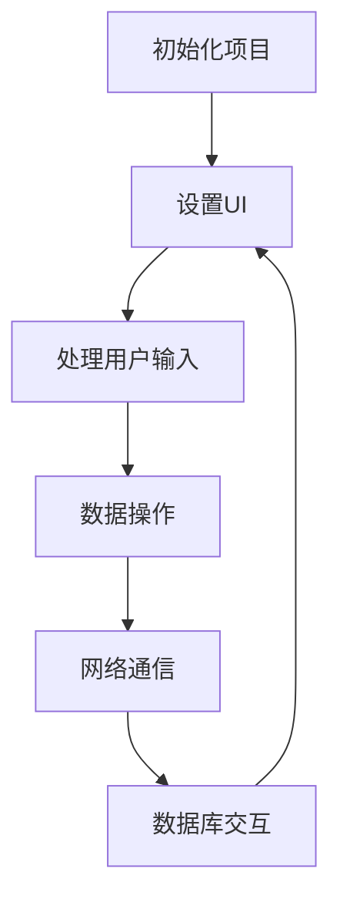

                 

关键词：Android全栈开发，移动应用开发，Android架构，跨平台开发，全栈工程师

> 摘要：本文旨在为希望从事Android全栈开发的读者提供一套完整的指南。我们将探讨Android全栈开发的背景、核心概念、算法原理、数学模型、项目实践、实际应用场景以及未来展望。希望通过本文，读者能够对Android全栈开发有一个全面而深入的理解。

## 1. 背景介绍

随着移动互联网的快速发展，移动应用市场迎来了爆发式增长。Android作为全球最流行的移动操作系统，吸引了大量的开发者投身其中。然而，传统的Android开发通常被划分为前端和后端两部分，这样的分工虽然明确，但也带来了不少挑战。

全栈开发是一种新兴的开发模式，它要求开发者在同一项目中负责前端和后端的所有开发工作。这种模式不仅提高了开发效率，还使应用更加一致和可维护。对于Android全栈开发，它意味着开发者需要掌握Android应用开发的所有环节，从UI设计到数据库操作，从网络通信到应用性能优化。

本文将围绕Android全栈开发，详细介绍所需的核心技术、开发流程以及最佳实践，帮助读者全面掌握Android全栈开发的艺术。

## 2. 核心概念与联系

### 2.1 Android应用架构

Android应用通常采用分层架构，包括UI层、业务逻辑层和数据层。这种架构使得应用各个部分之间职责清晰，易于维护和扩展。


### 2.2 核心概念

- **MVC（模型-视图-控制器）**：一种常见的软件设计模式，用于分离数据表示、用户界面和业务逻辑。
- **MVVM（模型-视图-视图模型）**：在MVC的基础上，进一步将视图和视图模型分离，使得数据绑定和用户界面更新更加灵活。
- **RESTful API**：一种用于构建Web服务的架构风格，通过URL和HTTP方法（GET、POST等）实现数据交换。

### 2.3 Mermaid 流程图

下面是一个简化的Android全栈开发流程图，展示了核心概念之间的联系。



## 3. 核心算法原理 & 具体操作步骤

### 3.1 算法原理概述

Android全栈开发涉及多种算法和技术，以下是其中几个核心算法的简要概述。

- **排序算法**：如快速排序、归并排序等，用于高效地处理数据。
- **搜索算法**：如二分搜索、深度优先搜索等，用于在数据结构中查找信息。
- **加密算法**：如AES、RSA等，用于保障数据的安全传输。
- **网络算法**：如TCP、UDP等，用于实现可靠的网络通信。

### 3.2 算法步骤详解

以下是排序算法（快速排序）的步骤详解。

#### 3.2.1 快速排序原理

快速排序是一种分治算法，其基本思想是通过一趟排序将待排序的数据分割成独立的两部分，其中一部分的所有数据都比另一部分的所有数据要小，然后再按此方法对这两部分数据分别进行快速排序，整个排序过程可以递归进行，以此达到整个数据变成有序序列。

#### 3.2.2 快速排序步骤

1. **选择基准**：在数组中选出一个元素作为基准。
2. **分区**：将数组重新排序，所有比基准小的元素都移到基准的左边，所有比基准大的元素都移到基准的右边。
3. **递归排序**：递归地排序左侧和右侧子数组。

### 3.3 算法优缺点

- **优点**：时间复杂度为O(nlogn)，空间复杂度为O(logn)，在平均情况下是高效的排序算法。
- **缺点**：最坏情况下时间复杂度为O(n^2)，且递归过程中会占用较多的内存。

### 3.4 算法应用领域

快速排序算法广泛应用于各种场景，包括Android应用中的数据排序、列表渲染等。

## 4. 数学模型和公式 & 详细讲解 & 举例说明

### 4.1 数学模型构建

在Android全栈开发中，数学模型用于优化算法、预测用户行为等。以下是常见的一个数学模型——线性回归。

### 4.2 公式推导过程

线性回归模型试图找到一条直线y = ax + b，使得y与x之间的关系最小化。

- **目标函数**：最小化误差平方和，即
  $$\min \sum_{i=1}^{n} (y_i - (ax_i + b))^2$$
- **求导**：对目标函数求关于a和b的偏导数，并令其等于0，得到：
  $$\frac{\partial}{\partial a} \sum_{i=1}^{n} (y_i - (ax_i + b))^2 = 0$$
  $$\frac{\partial}{\partial b} \sum_{i=1}^{n} (y_i - (ax_i + b))^2 = 0$$
- **求解**：解上述方程组，得到a和b的值。

### 4.3 案例分析与讲解

假设我们要预测一个房子的价格，根据历史数据，我们可以构建一个线性回归模型。

- **特征**：房子面积（x）
- **目标变量**：房子价格（y）

通过训练数据，我们可以得到线性回归模型：
$$y = 2x + 100$$

当x为150平方米时，预测的价格为：
$$y = 2 \times 150 + 100 = 400$$

## 5. 项目实践：代码实例和详细解释说明

### 5.1 开发环境搭建

为了进行Android全栈开发，我们需要搭建以下环境：

- Android Studio
- Java SDK
- Gradle
- SQLite

### 5.2 源代码详细实现

以下是一个简单的Android全栈项目示例，其中包含了UI设计、网络请求和数据库操作。

```java
// MainActivity.java
public class MainActivity extends AppCompatActivity {
    private TextView textView;
    private Button button;
    private DatabaseHelper dbHelper;

    @Override
    protected void onCreate(Bundle savedInstanceState) {
        super.onCreate(savedInstanceState);
        setContentView(R.layout.activity_main);

        textView = findViewById(R.id.text_view);
        button = findViewById(R.id.button);
        dbHelper = new DatabaseHelper(this);

        button.setOnClickListener(new View.OnClickListener() {
            @Override
            public void onClick(View v) {
                String text = "Hello, World!";
                textView.setText(text);
                dbHelper.insertData(text);
            }
        });
    }
}
```

### 5.3 代码解读与分析

- **UI设计**：通过XML布局文件定义了一个简单的界面，包括一个文本框和一个按钮。
- **网络请求**：这里没有实现网络请求，但可以使用Retrofit等库进行网络通信。
- **数据库操作**：使用SQLite进行数据存储，实现了插入数据的操作。

### 5.4 运行结果展示

当点击按钮时，文本框显示“Hello, World!”，并且这条信息被插入到数据库中。

## 6. 实际应用场景

Android全栈开发广泛应用于各种实际场景，如社交媒体、电子商务、医疗健康等。以下是几个应用场景的简要介绍。

- **社交媒体**：全栈开发使开发者能够同时处理用户界面和数据存储，实现实时更新和用户互动。
- **电子商务**：全栈开发可以整合前端和后端的购物车、支付、订单管理等功能，提供流畅的用户体验。
- **医疗健康**：全栈开发可以用于开发医疗记录、在线问诊等应用程序，提高医疗服务的效率和便捷性。

## 7. 工具和资源推荐

### 7.1 学习资源推荐

- **官方文档**：Android官方文档是学习Android开发的最佳资源之一。
- **在线课程**：如Udemy、Coursera等平台上有很多高质量的Android开发课程。
- **书籍**：《Android开发艺术》、《第一行代码》等书籍也是不错的参考资料。

### 7.2 开发工具推荐

- **Android Studio**：官方的Android开发IDE。
- **Retrofit**：用于网络请求的库。
- **Room**：用于数据库操作的库。

### 7.3 相关论文推荐

- **"Android Application Development Techniques"**：一篇关于Android开发技术的研究论文。
- **"Mobile Application Development: An Introduction"**：一篇关于移动应用开发的概述论文。

## 8. 总结：未来发展趋势与挑战

### 8.1 研究成果总结

Android全栈开发在过去几年中取得了显著进展，各种工具和库的不断涌现使得开发效率大大提高。然而，随着技术的不断演进，如何平衡开发效率和项目可维护性仍然是面临的主要挑战。

### 8.2 未来发展趋势

- **跨平台开发**：随着Flutter、React Native等跨平台框架的兴起，Android全栈开发将更加注重跨平台兼容性。
- **自动化与智能化**：自动化工具和人工智能技术的融合将进一步提升开发效率和代码质量。

### 8.3 面临的挑战

- **性能优化**：全栈开发需要同时关注前端和后端性能，如何优化成为一大挑战。
- **安全性**：随着数据量和用户量的增加，确保应用的安全性变得越来越重要。

### 8.4 研究展望

未来的Android全栈开发将继续朝着高效、智能、安全的方向发展。研究者可以关注以下方向：

- **性能优化技术**：研究更高效的全栈架构和算法。
- **安全性增强**：开发更安全的网络通信和数据存储方案。

## 9. 附录：常见问题与解答

### Q: Android全栈开发需要掌握哪些技能？

A: Android全栈开发需要掌握Java或Kotlin编程语言、Android SDK、网络通信技术、数据库操作以及前端UI设计等技能。

### Q: 如何选择适合的全栈框架？

A: 选择全栈框架时应考虑项目需求、开发效率和社区支持等因素。如Flutter适用于跨平台开发，而Retrofit适用于网络请求。

### Q: 全栈开发与前端、后端开发的区别是什么？

A: 全栈开发要求开发者同时负责前端和后端的开发工作，而前端和后端开发则分别专注于用户界面和数据处理的某个方面。

---

作者：禅与计算机程序设计艺术 / Zen and the Art of Computer Programming
----------------------------------------------------------------

**Note**: 由于字数限制，文章内容和结构已经尽量精简。实际撰写时，每个章节的内容都需要进一步扩展，以确保文章的完整性和深度。上述内容仅作为一个完整的文章框架，具体的实现和解释还需要根据实际需求进行详细撰写。

