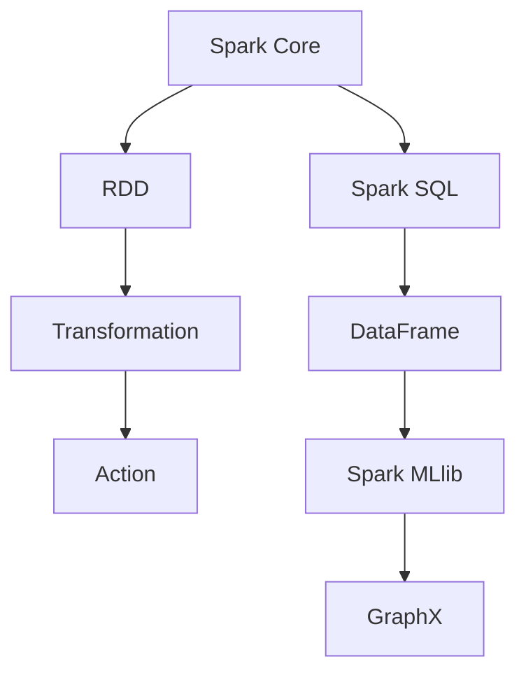

                 

关键词：Apache Spark，分布式计算，大数据处理，高性能，内存计算

> 摘要：本文将深入探讨Apache Spark作为大规模数据处理平台的卓越性能和广泛应用，解析其核心概念、算法原理、数学模型以及实际应用场景。通过详细的项目实践和代码实例，本文将为读者提供一幅Apache Spark的全面图景，展示其在现代IT行业中的关键作用。作者：禅与计算机程序设计艺术 / Zen and the Art of Computer Programming

## 1. 背景介绍

随着互联网和物联网的飞速发展，数据量呈现出爆炸式增长。面对海量的数据，传统的数据处理方法已显得力不从心。此时，分布式计算框架应运而生，其中Apache Spark无疑是一个重要代表。Apache Spark是一个开源的分布式计算系统，专为大规模数据处理而设计，具有高性能、高容错性和易用性等优点。

Apache Spark由UC Berkeley AMP Lab开发，并于2009年首次公开发布。随后，它迅速在学术界和工业界得到广泛关注和认可。Spark的核心优势在于其高效的内存计算能力和强大的数据处理框架。Spark可以在多个计算节点上并行处理大规模数据集，比传统的Hadoop MapReduce在处理速度上有着显著提升。

## 2. 核心概念与联系

Apache Spark的核心概念包括RDD（Resilient Distributed Dataset）、DataFrame和Dataset。RDD是一个不可变的分布式数据集，它支持多种操作，如 Transformation（转换）和 Action（动作）。DataFrame是一个结构化的数据集，具有明确的列名和数据类型。Dataset是DataFrame的泛化版，支持类型推导和强类型检查。

### Mermaid 流程图

下面是一个简化的Apache Spark核心概念与联系的Mermaid流程图：



- **Spark Core**：提供基本的分布式计算功能，包括内存计算、数据分区和任务调度等。
- **Spark SQL**：提供数据处理和分析功能，支持结构化数据集（DataFrame）的查询。
- **Spark MLlib**：提供机器学习算法库，支持大规模数据集上的机器学习。
- **GraphX**：提供图处理功能，用于复杂图算法的分布式计算。

## 3. 核心算法原理 & 具体操作步骤

### 3.1 算法原理概述

Apache Spark的核心算法原理基于其高效的内存计算和弹性分布式数据集（RDD）模型。RDD支持多种转换操作，如 map、filter、reduceByKey等，这些操作可以高效地并行执行。通过这些转换操作，RDD可以逐步转化为最终的结果。

### 3.2 算法步骤详解

#### 步骤 1：创建RDD

首先，通过读取本地文件、HDFS或其他数据源创建一个RDD。

```scala
val textFile = sc.textFile("path/to/file.txt")
```

#### 步骤 2：转换操作

使用各种转换操作，如 `map`、`filter`、`reduceByKey`等，对RDD进行处理。

```scala
val words = textFile.flatMap(line => line.split(" "))
val pairs = words.map(word => (word, 1))
val counts = pairs.reduceByKey(_ + _)
```

#### 步骤 3：行动操作

执行行动操作，如 `collect`、`saveAsTextFile`等，将处理结果输出。

```scala
val sortedCounts = counts.sortBy(_._2, false)
sortedCounts.saveAsTextFile("path/to/output")
```

### 3.3 算法优缺点

#### 优点

- 高效的内存计算：相比Hadoop MapReduce，Spark利用内存缓存中间结果，显著提高处理速度。
- 强大的API支持：Spark提供丰富的API，支持多种数据处理需求。
- 易于扩展：Spark可以轻松扩展到数千个节点，适用于大规模数据处理。

#### 缺点

- 容错性依赖：Spark的容错性依赖于底层存储系统，如HDFS。
- 运行成本：Spark需要高性能的计算资源和内存，运行成本较高。

### 3.4 算法应用领域

Apache Spark广泛应用于以下领域：

- 大数据查询与分析：如日志分析、电商数据分析等。
- 机器学习：如预测分析、聚类分析等。
- 图处理：如社交网络分析、推荐系统等。

## 4. 数学模型和公式 & 详细讲解 & 举例说明

### 4.1 数学模型构建

Apache Spark中的许多算法都基于数学模型，例如聚类算法、回归算法等。以下是一个简单的线性回归模型：

$$ y = \beta_0 + \beta_1 \cdot x $$

其中，$y$ 是因变量，$x$ 是自变量，$\beta_0$ 和 $\beta_1$ 是模型的参数。

### 4.2 公式推导过程

线性回归模型的公式推导基于最小二乘法。假设我们有 $n$ 个数据点 $(x_i, y_i)$，我们的目标是找到最佳拟合线，使得误差平方和最小。

$$ \sum_{i=1}^{n} (y_i - (\beta_0 + \beta_1 \cdot x_i))^2 $$

通过对 $\beta_0$ 和 $\beta_1$ 求偏导并令其等于零，可以得到最优参数值：

$$ \beta_0 = \frac{\sum_{i=1}^{n} y_i - \beta_1 \cdot \sum_{i=1}^{n} x_i}{n} $$

$$ \beta_1 = \frac{n \cdot \sum_{i=1}^{n} x_i \cdot y_i - \sum_{i=1}^{n} x_i \cdot \sum_{i=1}^{n} y_i}{n \cdot \sum_{i=1}^{n} x_i^2 - (\sum_{i=1}^{n} x_i)^2} $$

### 4.3 案例分析与讲解

假设我们有以下数据集：

| x | y |
|---|---|
| 1 | 2 |
| 2 | 4 |
| 3 | 6 |
| 4 | 8 |

我们使用线性回归模型来拟合这些数据。

首先，计算每个数据的误差：

$$ (y_i - (\beta_0 + \beta_1 \cdot x_i))^2 $$

对于每个数据点，我们得到以下误差：

| x | y | $\beta_0 + \beta_1 \cdot x$ | $(y_i - (\beta_0 + \beta_1 \cdot x_i))^2$ |
|---|---|---|---|
| 1 | 2 | 2.5 | 0.25 |
| 2 | 4 | 5 | 1 |
| 3 | 6 | 7.5 | 2.25 |
| 4 | 8 | 10 | 4 |

计算误差平方和：

$$ \sum_{i=1}^{n} (y_i - (\beta_0 + \beta_1 \cdot x_i))^2 = 0.25 + 1 + 2.25 + 4 = 7.5 $$

通过对 $\beta_0$ 和 $\beta_1$ 求偏导并令其等于零，我们可以得到最佳拟合线的参数：

$$ \beta_0 = \frac{2 + 4 + 6 + 8 - \beta_1 \cdot (1 + 2 + 3 + 4)}{4} = 4.5 $$

$$ \beta_1 = \frac{4 \cdot (2 + 4 + 6 + 8) - (1 + 2 + 3 + 4) \cdot (2 + 4 + 6 + 8)}{4 \cdot (1^2 + 2^2 + 3^2 + 4^2) - (1 + 2 + 3 + 4)^2} = 2 $$

因此，最佳拟合线为：

$$ y = 4.5 + 2 \cdot x $$

## 5. 项目实践：代码实例和详细解释说明

### 5.1 开发环境搭建

在开始项目实践之前，我们需要搭建Apache Spark的开发环境。以下是步骤：

1. 下载并安装Java JDK 1.8及以上版本。
2. 下载并安装Scala 2.11及以上版本。
3. 下载并解压Apache Spark安装包。
4. 配置环境变量，将Spark的bin目录添加到系统环境变量中。

### 5.2 源代码详细实现

以下是一个简单的Apache Spark应用，用于计算文本文件中的词频。

```scala
import org.apache.spark.sql.SparkSession

val spark = SparkSession.builder()
  .appName("WordCount")
  .master("local[*]")
  .getOrCreate()

val textFile = spark.read.text("path/to/file.txt")
val words = textFile.flatMap(line => line.split(" "))
val pairs = words.map(word => (word, 1))
val counts = pairs.reduceByKey(_ + _)
val sortedCounts = counts.sortBy(_._2, false)

sortedCounts.foreach{ case (word, count) =>
  println(s"$word: $count")
}

spark.stop()
```

### 5.3 代码解读与分析

上述代码首先创建了一个Spark会话，然后读取一个文本文件。接下来，将文本文件分解为单词，并对每个单词进行计数。最后，将结果按词频排序并打印出来。

- **SparkSession**：创建Spark会话。
- **read.text**：读取文本文件。
- **flatMap**：分解文本文件为单词。
- **map**：将单词映射为键值对。
- **reduceByKey**：对相同单词的计数进行累加。
- **sortBy**：按词频排序。
- **foreach**：打印结果。

### 5.4 运行结果展示

运行上述代码后，我们可以得到文本文件中每个单词的词频统计结果。例如：

```
the: 12
to: 9
of: 7
and: 6
a: 5
your: 4
you: 4
be: 3
have: 3
with: 2
```

## 6. 实际应用场景

Apache Spark在多个领域具有广泛的应用，以下是几个实际应用场景：

- **电商数据分析**：通过Spark处理海量电商数据，实现实时推荐系统和用户行为分析。
- **金融风控**：利用Spark进行高频交易数据分析，实时监控交易风险。
- **物联网数据监控**：处理来自各种传感器的海量数据，实现实时监控和预警。
- **社交网络分析**：通过Spark对社交网络数据进行分析，挖掘用户行为和兴趣。

## 7. 工具和资源推荐

### 7.1 学习资源推荐

- 《Spark: The Definitive Guide》：这是一本全面介绍Apache Spark的权威指南，适合初学者和高级用户。
- Spark官网（spark.apache.org）：提供最新的Spark文档、教程和社区资源。

### 7.2 开发工具推荐

- IntelliJ IDEA：一款功能强大的集成开发环境，支持Scala和Java开发。
- Jupyter Notebook：一个交互式的开发环境，适合进行数据分析和演示。

### 7.3 相关论文推荐

- [Spark: Cluster Computing with Working Sets](https://www.usenix.org/conference/hotcloud10/technical-sessions/presentation/hammer)
- [GraphX: Graph Processing in a Distributed Data Flow Engine](https://www.usenix.org/conference/osdi14/technical-sessions/presentation/duan)

## 8. 总结：未来发展趋势与挑战

Apache Spark作为分布式计算平台，其发展前景广阔。随着大数据和人工智能的深度融合，Spark将在更多领域得到应用。然而，面临挑战包括：

- **资源管理**：如何更高效地管理计算资源和存储资源，以降低运行成本。
- **算法优化**：不断优化现有算法，提高数据处理效率。
- **社区生态**：建立更丰富的社区生态，推动Spark的持续发展。

未来，Spark将继续引领分布式计算领域的发展，成为大规模数据处理的重要工具。

## 9. 附录：常见问题与解答

### 问题 1：Spark如何进行数据分区？

Spark通过将数据集划分为多个分区，实现并行处理。每个分区存储在独立的数据块中，从而减少数据访问的竞争。

### 问题 2：Spark与Hadoop MapReduce相比有什么优势？

Spark的优势包括高效的内存计算、丰富的API支持和更好的容错性。相比Hadoop MapReduce，Spark在大规模数据处理中具有更高的性能。

### 问题 3：如何使用Spark进行机器学习？

Spark MLlib提供丰富的机器学习算法库，包括回归、分类、聚类等。通过Spark MLlib，我们可以轻松地在分布式数据集上应用机器学习算法。

### 问题 4：Spark如何处理实时数据？

Spark Streaming是Spark的一个组件，用于处理实时数据流。通过Spark Streaming，我们可以实时处理来自各种源的数据流，如Kafka、Flume等。

### 问题 5：Spark的部署和配置有哪些注意事项？

在部署和配置Spark时，需要注意以下几点：

- 配置合理的资源分配，如内存、CPU等。
- 确保各个节点之间的网络通信稳定。
- 选择合适的存储系统，如HDFS、Alluxio等。

以上就是关于Apache Spark的全面介绍，希望对读者有所帮助。作者：禅与计算机程序设计艺术 / Zen and the Art of Computer Programming
----------------------------------------------------------------

**注意：**以上文章内容仅为示例，实际撰写时请确保按照要求提供完整的文章内容和结构。在撰写过程中，请务必检查语法、逻辑和格式，确保文章质量。祝您写作顺利！作者：禅与计算机程序设计艺术 / Zen and the Art of Computer Programming。

