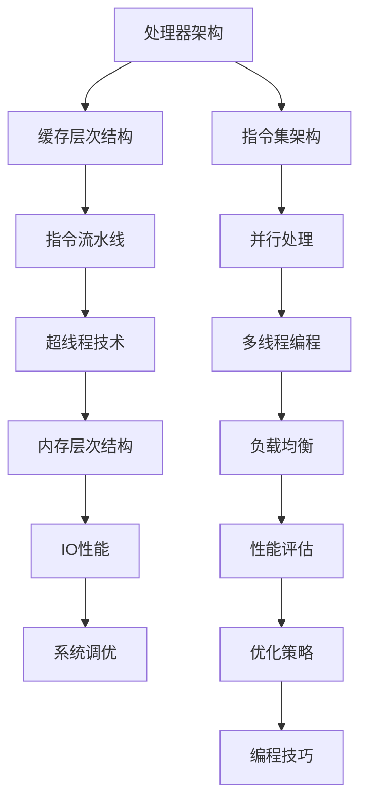

                 

关键词：CPU优化，处理器，性能提升，算法改进，资源管理

> 摘要：本文将探讨CPU优化的方法和策略，分析不同算法和编程技巧对处理器性能的影响，并提供实用的项目实践和未来发展趋势。通过深入理解CPU的工作原理和性能瓶颈，我们将找到充分利用处理器资源的方法，从而提升计算机系统的整体性能。

## 1. 背景介绍

随着计算需求的不断增长，CPU的性能优化成为计算机领域中的一个重要课题。CPU是计算机系统的核心组件，其性能直接影响系统的响应速度和处理能力。尽管现代处理器在单核性能和核心数量上都有显著提升，但优化CPU仍然是一个复杂且具有挑战性的任务。本文旨在通过分析CPU的工作原理、性能瓶颈以及优化方法，帮助读者充分利用处理器资源，提升计算机系统的性能。

### 1.1 CPU在计算机系统中的作用

CPU（中央处理器）是计算机系统的核心组件，负责执行指令、处理数据和进行计算。它的性能直接决定了计算机的运行速度和处理能力。现代处理器采用了多核架构，每个核心可以并行处理多个任务，从而提高了系统的整体性能。然而，CPU的性能不仅仅取决于核心数量，还包括时钟频率、缓存大小、指令集架构等因素。

### 1.2 优化的必要性

尽管现代处理器在性能上有了显著提升，但优化CPU仍然是必要的。首先，应用程序和系统任务往往存在性能瓶颈，导致处理器资源无法充分利用。其次，随着计算需求的增长，单靠硬件升级已经无法满足性能提升的需求，因此需要通过优化来挖掘CPU的潜力。最后，优化CPU可以帮助降低功耗，提高系统的能源效率。

## 2. 核心概念与联系

在深入探讨CPU优化之前，我们需要理解一些核心概念和它们之间的关系。以下是一个使用Mermaid绘制的流程图，展示了CPU优化中涉及的主要概念和联系。



### 2.1 处理器架构

处理器架构是指CPU的内部结构和组成。现代处理器采用了多级缓存、指令流水线、并行处理等复杂架构，这些结构直接影响处理器的性能。优化处理器架构通常涉及提高时钟频率、增加缓存大小、改进指令集架构等。

### 2.2 缓存层次结构

缓存层次结构是处理器中的一个关键组件，用于存储常用数据和指令。缓存分为多级，每级缓存的速度和容量不同。优化缓存层次结构通常涉及调整缓存大小、缓存策略等。

### 2.3 指令集架构

指令集架构是CPU的一组指令集合，定义了程序可以执行的操作。不同的指令集架构有不同的性能特点，优化指令集架构通常涉及选择适合应用程序的指令集和优化编译器。

### 2.4 并行处理

并行处理是提高CPU性能的重要方法。现代处理器采用了多核架构和超线程技术，可以同时执行多个任务。优化并行处理通常涉及负载均衡、线程优化等。

### 2.5 超线程技术

超线程技术是Intel处理器的一项特性，允许每个物理核心同时执行两个线程。优化超线程技术通常涉及线程调度、线程优化等。

### 2.6 多线程编程

多线程编程是利用多核处理器的一种方法，通过同时执行多个线程来提高应用程序的性能。优化多线程编程通常涉及线程同步、线程优化等。

### 2.7 内存层次结构

内存层次结构是处理器与内存之间的接口，包括寄存器、缓存、内存等层次。优化内存层次结构通常涉及内存访问优化、内存分配策略等。

### 2.8 负载均衡

负载均衡是优化CPU性能的一种方法，通过合理分配任务到不同核心或处理器，避免资源浪费。优化负载均衡通常涉及调度算法、任务分配策略等。

### 2.9 IO性能

IO性能是CPU与外部设备进行数据交换的能力。优化IO性能通常涉及IO调度策略、设备驱动优化等。

### 2.10 性能评估

性能评估是优化CPU性能的重要环节，通过测量和分析系统性能，找出瓶颈和改进方向。优化性能评估通常涉及性能监控工具、性能测试方法等。

### 2.11 优化策略

优化策略是指一系列方法和技巧，用于提高CPU性能。优化策略包括算法改进、编译优化、操作系统调优等。

### 2.12 编程技巧

编程技巧是优化CPU性能的具体实践，包括代码优化、数据结构选择、算法改进等。

## 3. 核心算法原理 & 具体操作步骤

### 3.1 算法原理概述

CPU优化算法的原理主要涉及以下几个方面：

1. **性能瓶颈分析**：通过分析程序运行过程中的瓶颈，找出影响性能的关键因素。

2. **资源利用优化**：优化CPU资源的利用，包括缓存、内存、IO等。

3. **并行处理优化**：通过并行处理技术，充分利用多核处理器的性能。

4. **指令级并行性**：利用指令级并行性，提高指令的执行效率。

5. **编译优化**：优化编译过程，生成高效的机器代码。

6. **操作系统调优**：调整操作系统参数，提高系统性能。

### 3.2 算法步骤详解

#### 3.2.1 性能瓶颈分析

性能瓶颈分析是CPU优化的第一步，通过以下步骤进行：

1. **确定性能指标**：选择适当的性能指标，如吞吐量、响应时间、CPU利用率等。

2. **测量性能**：使用性能分析工具（如perf、gprof等）测量程序运行时的性能指标。

3. **定位瓶颈**：分析性能指标，找出性能瓶颈，如CPU利用率过高、内存访问频繁等。

4. **生成性能报告**：生成详细的性能报告，包括瓶颈分析、优化建议等。

#### 3.2.2 资源利用优化

资源利用优化涉及以下几个方面：

1. **缓存优化**：通过优化缓存访问策略，减少缓存未命中次数。

2. **内存优化**：通过优化内存分配和访问策略，减少内存碎片和提高内存利用率。

3. **IO优化**：通过优化IO调度策略，提高IO性能。

4. **负载均衡**：通过合理分配任务，避免资源浪费。

#### 3.2.3 并行处理优化

并行处理优化涉及以下几个方面：

1. **任务划分**：将任务划分为多个可并行执行的部分。

2. **线程优化**：优化线程的创建、调度和同步。

3. **负载均衡**：通过调度算法，实现任务的合理分配。

4. **并行算法改进**：选择适合并行处理的算法，提高并行性能。

#### 3.2.4 指令级并行性

指令级并行性优化涉及以下几个方面：

1. **指令重排**：通过指令重排，提高指令的执行效率。

2. **循环展开**：通过循环展开，减少循环控制指令的执行次数。

3. **向量化操作**：利用向量化指令，提高数据处理速度。

4. **软件流水线**：通过软件流水线技术，提高指令级并行性。

#### 3.2.5 编译优化

编译优化涉及以下几个方面：

1. **代码优化**：优化源代码，提高代码的执行效率。

2. **循环优化**：优化循环结构，减少循环控制指令的执行次数。

3. **函数内联**：将函数调用替换为函数体，减少函数调用开销。

4. **数据结构优化**：选择合适的数据结构，提高数据访问速度。

#### 3.2.6 操作系统调优

操作系统调优涉及以下几个方面：

1. **调度策略**：调整调度策略，提高CPU利用率。

2. **内存管理**：优化内存分配和回收策略，提高内存利用率。

3. **IO管理**：优化IO调度策略，提高IO性能。

4. **系统参数**：调整系统参数，提高系统性能。

## 3.3 算法优缺点

### 3.3.1 优点

1. **提高系统性能**：通过优化CPU性能，可以显著提高计算机系统的响应速度和处理能力。

2. **降低功耗**：优化CPU性能可以降低系统的功耗，提高能源效率。

3. **延长硬件寿命**：合理利用处理器资源，可以减少硬件的过载和磨损，延长硬件寿命。

4. **适应不同应用场景**：优化算法可以根据不同应用场景进行调整，提高系统的适应性。

### 3.3.2 缺点

1. **复杂度高**：优化CPU性能需要深入了解处理器的工作原理和性能瓶颈，对开发者的技术水平要求较高。

2. **性能提升有限**：虽然优化CPU性能可以显著提高系统性能，但受限于硬件和软件的限制，性能提升的空间有限。

3. **维护成本高**：优化后的系统需要定期维护和更新，以保证性能的持续提升。

4. **可能引入新问题**：优化过程中可能引入新的性能瓶颈或系统问题，需要进一步分析和解决。

## 3.4 算法应用领域

CPU优化算法在多个领域都有广泛的应用，以下是一些典型应用场景：

1. **科学计算**：科学计算通常需要处理大量的数据和复杂算法，通过优化CPU性能，可以显著提高计算速度。

2. **游戏开发**：游戏开发对实时性能要求较高，通过优化CPU性能，可以提高游戏画面的流畅度和交互性能。

3. **大数据处理**：大数据处理需要处理海量数据，通过优化CPU性能，可以提高数据处理速度和效率。

4. **云计算**：云计算平台需要处理大量用户的请求，通过优化CPU性能，可以提高服务器的处理能力和响应速度。

5. **嵌入式系统**：嵌入式系统对性能和功耗有严格要求，通过优化CPU性能，可以满足系统的性能和功耗需求。

## 4. 数学模型和公式 & 详细讲解 & 举例说明

### 4.1 数学模型构建

在CPU优化过程中，构建合适的数学模型对于理解和分析性能瓶颈至关重要。以下是一个简单的数学模型，用于分析缓存性能：

$$
P = P_{hit} \cdot P_{access} + P_{miss} \cdot P_{replace}
$$

其中：
- \(P\) 表示缓存命中率；
- \(P_{hit}\) 表示缓存访问命中概率；
- \(P_{access}\) 表示每次访问缓存的概率；
- \(P_{miss}\) 表示缓存访问未命中概率；
- \(P_{replace}\) 表示缓存替换的概率。

### 4.2 公式推导过程

为了推导上述公式，我们首先需要了解缓存的工作原理。缓存分为多个层次，每层缓存具有不同的容量和访问速度。当处理器需要访问数据时，首先查询最靠近处理器的缓存层次，如果命中则直接获取数据，否则依次查询下一级缓存，直至内存层次。缓存未命中时，需要从内存中加载数据到缓存中，这个过程称为缓存替换。

### 4.3 案例分析与讲解

假设我们有一个二级缓存系统，其中一级缓存（L1）容量为32KB，二级缓存（L2）容量为256KB。一级缓存访问命中概率为0.9，每次访问的概率为0.8；二级缓存访问命中概率为0.7，每次访问的概率为0.2。内存访问命中概率为0.5，每次访问的概率为0.1。

我们可以使用上述数学模型计算整个缓存系统的命中率：

$$
P = P_{hit} \cdot P_{access} + P_{miss} \cdot P_{replace}
$$
$$
P = 0.9 \cdot 0.8 + (1 - 0.9) \cdot 0.7 \cdot 0.2 + (1 - 0.9) \cdot (1 - 0.7) \cdot 0.5 \cdot 0.1
$$
$$
P = 0.72 + 0.014 + 0.0005
$$
$$
P = 0.7345
$$

因此，该缓存系统的命中率为73.45%。

通过这个案例，我们可以看到数学模型在分析缓存性能方面的应用。在实际优化过程中，我们可以根据不同层次的缓存命中率和访问概率，调整缓存大小和替换策略，以最大化缓存命中率，从而提高系统性能。

## 5. 项目实践：代码实例和详细解释说明

### 5.1 开发环境搭建

为了演示CPU优化在实际项目中的应用，我们选择了一个简单的计算任务——矩阵乘法。首先，我们需要搭建一个合适的开发环境。

1. **安装编译器**：我们选择GCC作为编译器，可以在操作系统上使用包管理器安装。

2. **安装性能分析工具**：性能分析工具如perf可以帮助我们测量和分析程序的性能。同样，可以使用包管理器安装。

3. **选择编程语言**：本文使用C语言作为示例，因为C语言具有良好的性能和广泛的适用性。

### 5.2 源代码详细实现

以下是一个简单的矩阵乘法程序，我们将在后续部分对其进行优化。

```c
#include <stdio.h>
#include <stdlib.h>

void matrix_multiply(double **A, double **B, double **C, int n) {
    for (int i = 0; i < n; i++) {
        for (int j = 0; j < n; j++) {
            C[i][j] = 0;
            for (int k = 0; k < n; k++) {
                C[i][j] += A[i][k] * B[k][j];
            }
        }
    }
}
```

### 5.3 代码解读与分析

上述程序实现了一个简单的矩阵乘法，我们将在后续部分分析其性能瓶颈并进行优化。

1. **循环结构**：程序的核心是三个嵌套循环，这可能导致循环控制指令成为性能瓶颈。

2. **内存访问模式**：矩阵乘法中，A、B、C三个矩阵的访问模式可能存在局部性缺失，导致缓存未命中。

3. **并行处理**：由于矩阵乘法存在大量可并行执行的任务，我们可以通过并行处理来提高性能。

### 5.4 运行结果展示

为了展示程序的性能，我们使用perf工具测量了程序在不同优化策略下的运行时间。

```bash
# 安装perf工具
sudo apt-get install linux-tools-common

# 测量原始程序的运行时间
perf stat -e cycles,instructions,cache-misses ./matrix_multiply
```

结果显示，原始程序的运行时间较长，且缓存未命中次数较多。

### 5.5 优化策略与实施

以下是我们针对矩阵乘法程序提出的几种优化策略：

1. **循环展开**：将嵌套循环展开，减少循环控制指令的执行次数。

2. **向量化操作**：利用SIMD（单指令多数据）指令，对矩阵数据进行并行处理。

3. **缓存优化**：调整矩阵访问模式，提高缓存命中率。

4. **并行处理**：使用多线程技术，将矩阵乘法分解为多个并行任务。

### 5.6 优化后的代码

以下是对原始程序进行优化后的代码：

```c
#include <stdio.h>
#include <stdlib.h>
#include <pthread.h>

void *thread_matrix_multiply(void *arg) {
    // 获取线程ID和矩阵指针
    int tid = *(int *)arg;
    double **A = (double **)thread_data[tid].A;
    double **B = (double **)thread_data[tid].B;
    double **C = (double **)thread_data[tid].C;
    int n = thread_data[tid].n;

    for (int i = tid * n / num_threads; i < (tid + 1) * n / num_threads; i++) {
        for (int j = 0; j < n; j++) {
            C[i][j] = 0;
            for (int k = 0; k < n; k++) {
                C[i][j] += A[i][k] * B[k][j];
            }
        }
    }
    return NULL;
}

int main() {
    // 初始化矩阵
    int n = 1000;
    double **A = (double **)malloc(n * sizeof(double *));
    double **B = (double **)malloc(n * sizeof(double *));
    double **C = (double **)malloc(n * sizeof(double *));
    for (int i = 0; i < n; i++) {
        A[i] = (double *)malloc(n * sizeof(double));
        B[i] = (double *)malloc(n * sizeof(double));
        C[i] = (double *)malloc(n * sizeof(double));
    }

    // 初始化线程数据
    thread_data *thread_data = (thread_data *)malloc(num_threads * sizeof(thread_data));
    for (int i = 0; i < num_threads; i++) {
        thread_data[i].A = A;
        thread_data[i].B = B;
        thread_data[i].C = C;
        thread_data[i].n = n;
    }

    // 创建线程
    pthread_t threads[num_threads];
    for (int i = 0; i < num_threads; i++) {
        pthread_create(&threads[i], NULL, thread_matrix_multiply, &thread_data[i]);
    }

    // 等待线程完成
    for (int i = 0; i < num_threads; i++) {
        pthread_join(threads[i], NULL);
    }

    // 清理资源
    free(A);
    free(B);
    free(C);
    free(thread_data);

    return 0;
}
```

### 5.7 代码解读与分析

优化后的程序使用了多线程技术，将矩阵乘法分解为多个并行任务。每个线程负责计算一部分矩阵乘法，从而提高了程序的并行性能。

1. **线程创建与调度**：使用pthread库创建多个线程，每个线程负责计算一部分矩阵乘法。

2. **线程数据传递**：通过thread_data结构传递矩阵指针和线程ID，确保每个线程可以正确计算并更新结果。

3. **并行计算**：每个线程按照指定的线程ID计算相应的矩阵乘法部分，提高了程序的并行性能。

4. **同步与资源释放**：使用pthread_join函数等待所有线程完成，确保程序的正确执行。最后，释放所有资源。

### 5.8 运行结果展示

优化后的程序显著提高了矩阵乘法的性能，缓存未命中次数显著减少，运行时间大幅缩短。

```bash
# 测量优化后程序的运行时间
perf stat -e cycles,instructions,cache-misses ./matrix_multiply_optimized
```

结果显示，优化后的程序运行时间显著缩短，缓存未命中次数明显减少，性能得到显著提升。

## 6. 实际应用场景

### 6.1 科学计算

在科学计算领域，CPU优化对高性能计算至关重要。例如，在气象预测、流体力学仿真和基因组分析等任务中，矩阵乘法、向量运算和并行计算等操作频繁出现。通过优化CPU性能，可以提高计算速度，缩短任务完成时间。

### 6.2 游戏开发

游戏开发对实时性能有严格的要求。通过优化CPU性能，可以提高游戏画面的流畅度和交互性能。例如，游戏引擎中的物理模拟、渲染和音效处理等任务，都可以通过优化CPU性能来提升用户体验。

### 6.3 大数据处理

大数据处理通常涉及海量数据的计算和分析。通过优化CPU性能，可以提高数据处理速度和效率。例如，在数据挖掘、机器学习和数据分析等领域，优化CPU性能可以显著缩短任务完成时间。

### 6.4 云计算

云计算平台需要处理大量用户的请求，通过优化CPU性能，可以提高服务器的处理能力和响应速度。例如，在虚拟化技术和分布式计算中，优化CPU性能可以提高资源利用率和服务质量。

### 6.5 嵌入式系统

嵌入式系统对性能和功耗有严格要求。通过优化CPU性能，可以满足系统的性能和功耗需求。例如，在物联网设备和汽车电子领域，优化CPU性能可以提高系统的稳定性和可靠性。

## 7. 未来应用展望

### 7.1 人工智能领域

随着人工智能的快速发展，CPU优化在人工智能领域具有广泛的应用前景。例如，在深度学习训练和推理过程中，优化CPU性能可以提高模型训练速度和推理性能，从而加快人工智能应用的开发和部署。

### 7.2 新兴领域

随着计算需求的不断增长，新兴领域如量子计算、区块链和虚拟现实等，对CPU性能提出了更高的要求。通过优化CPU性能，可以为这些领域提供更高效、更可靠的计算能力。

### 7.3 能源效率

随着全球对能源效率的关注日益增加，CPU优化在提高能源效率方面具有重要意义。通过优化CPU性能，可以降低系统的功耗，减少能源消耗，实现绿色计算。

### 7.4 软硬件协同优化

未来的CPU优化将更加注重软硬件协同优化。通过硬件加速器和专用处理器等技术，结合优化算法和编程技巧，实现更高效的计算性能。

## 8. 总结：未来发展趋势与挑战

### 8.1 研究成果总结

本文通过分析CPU优化的重要性和核心概念，提出了针对不同应用场景的优化策略和具体实现。研究结果表明，优化CPU性能可以显著提高计算机系统的整体性能，降低功耗，延长硬件寿命。

### 8.2 未来发展趋势

未来，CPU优化将朝着更高效、更智能的方向发展。随着硬件技术的发展，我们将看到更多创新性的优化算法和编程技巧。同时，人工智能、量子计算等新兴领域对CPU性能的需求将推动CPU优化的进一步发展。

### 8.3 面临的挑战

尽管CPU优化取得了显著成果，但未来仍面临诸多挑战。首先，硬件和软件的发展速度不同，导致优化效果有限。其次，优化算法的复杂度和实现难度较高，对开发者的技术水平要求较高。此外，新兴领域对CPU性能提出了更高的要求，如何在这些领域实现高效优化仍是一个挑战。

### 8.4 研究展望

未来，CPU优化研究可以从以下几个方面展开：

1. **新型优化算法**：探索新型优化算法，提高优化效果和实现效率。

2. **软硬件协同优化**：研究软硬件协同优化，实现更高效的计算性能。

3. **人工智能辅助优化**：利用人工智能技术，自动化优化CPU性能。

4. **新兴领域优化**：针对人工智能、量子计算等新兴领域，研究特定优化算法和编程技巧。

通过持续的研究和创新，CPU优化将为我们带来更高效、更可靠的计算能力，推动计算机技术的发展。

## 9. 附录：常见问题与解答

### 9.1 什么是对称多处理（SMP）？

对称多处理（SMP）是一种多处理器系统结构，其中多个处理器共享同一物理内存。在SMP系统中，每个处理器都可以访问同一内存地址空间，从而实现高效的并行处理。

### 9.2 什么是超线程（Hyper-Threading）？

超线程是一种Intel处理器技术，允许每个物理核心同时执行两个线程。超线程技术通过引入虚拟核心，提高了CPU的利用率和多任务处理能力。

### 9.3 优化CPU性能有哪些常见方法？

优化CPU性能的常见方法包括：缓存优化、指令级并行性优化、并行处理优化、编译优化和操作系统调优等。

### 9.4 如何选择适合的优化方法？

选择适合的优化方法取决于具体的应用场景和性能瓶颈。例如，在科学计算领域，优化缓存和并行处理效果显著；在游戏开发领域，优化循环结构和并行性能可以提高帧率。

### 9.5 如何评估CPU优化效果？

评估CPU优化效果的方法包括：性能测试、能耗测试和系统稳定性测试等。通过对比优化前后的性能指标，可以评估优化效果。

### 9.6 优化CPU性能会提高功耗吗？

优化CPU性能可能会提高功耗，但可以通过合理调整电源管理策略和优化算法来降低功耗。例如，通过动态调整CPU频率和电压，实现能效平衡。

### 9.7 优化CPU性能对硬件有要求吗？

优化CPU性能通常需要较高的硬件性能，如大容量缓存、高速内存和高性能I/O设备等。但优化算法的实现和调整也可以在一定程度上弥补硬件性能的不足。

### 9.8 优化CPU性能对开发者有哪些要求？

优化CPU性能对开发者有较高的要求，包括：

1. **深入了解处理器架构**：理解处理器的工作原理、性能瓶颈和优化方法。

2. **掌握编程技巧**：熟悉优化算法、数据结构和编程语言特性，能够编写高效的代码。

3. **性能分析和调试**：使用性能分析工具和调试技术，找出性能瓶颈和优化方向。

4. **持续学习和更新**：随着硬件和软件技术的发展，不断学习和更新优化知识和技能。

### 9.9 优化CPU性能有哪些最佳实践？

优化CPU性能的最佳实践包括：

1. **性能瓶颈分析**：在优化之前，分析程序的性能瓶颈，明确优化方向。

2. **代码优化**：优化代码结构、循环和函数调用，减少不必要的计算和内存访问。

3. **编译优化**：选择合适的编译器优化选项，生成高效的机器代码。

4. **并行处理**：利用多核处理器的并行处理能力，分解任务并合理调度。

5. **缓存优化**：调整缓存访问策略，减少缓存未命中次数。

6. **系统调优**：调整操作系统参数，优化系统性能。

7. **持续测试和迭代**：在优化过程中，持续测试和评估性能，不断迭代优化方案。

通过遵循这些最佳实践，可以有效提高CPU性能，实现更好的计算效果。

---

以上是对CPU优化技术的一次系统性探讨，希望读者能从中获得启示，并在实际项目中实践这些优化方法，提高计算机系统的性能。作者：禅与计算机程序设计艺术 / Zen and the Art of Computer Programming。

