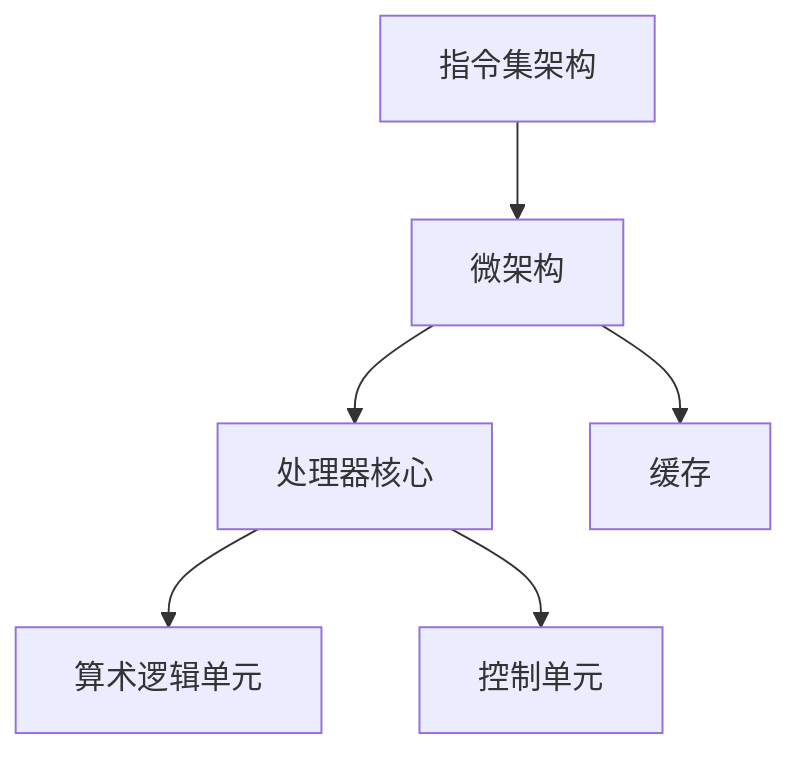

                 

关键词：CPU架构、处理器设计、计算机发展、性能提升、技术革新

摘要：本文将深入探讨CPU体系结构的演进历程，从早期的简单处理单元到现代的多核处理器，分析每一阶段的创新和变革。我们将通过历史视角，结合技术细节，揭示CPU架构背后的核心原理，以及这些原理如何推动计算机技术的发展。本文不仅回顾了过去的成就，还展望了未来的发展方向，包括可能面临的挑战和机遇。

## 1. 背景介绍

计算机处理器（CPU）是计算机系统的核心，负责执行软件指令和操作数据。自从计算机诞生以来，CPU的体系结构经历了多次重大变革，每一次变革都标志着计算机性能和效率的显著提升。本文旨在梳理CPU体系结构的演进历程，总结不同阶段的创新点，以及这些创新如何影响现代计算机技术的发展。

### 1.1 CPU在计算机系统中的作用

CPU在计算机系统中扮演着至关重要的角色。它不仅负责执行操作系统和应用程序的指令，还管理数据流和控制计算机的各个组件。随着计算需求的不断增加，CPU的设计和性能优化成为计算机技术发展的关键领域。

### 1.2 CPU架构发展的必要性

计算机技术的发展离不开CPU架构的创新。早期的计算机由于技术限制，性能较低，应用场景有限。随着科学研究和商业需求的增长，对高性能计算的需求日益增加，推动了CPU架构的不断演进。从最初的简单指令集到复杂的多核架构，CPU的发展始终与计算机技术的发展紧密相连。

### 1.3 CPU架构发展的里程碑

CPU架构的发展过程中，有许多重要的里程碑，如冯·诺依曼架构的提出、指令集的演变、流水线技术的应用、超标量架构的出现以及多核处理器的普及。这些里程碑不仅推动了CPU性能的提升，也改变了计算机系统的设计和应用方式。

## 2. 核心概念与联系

要理解CPU架构的发展，我们需要掌握一些核心概念和架构设计原则。以下是CPU架构中几个重要的概念和它们之间的联系：

### 2.1 基本概念

**指令集架构（ISA）**：定义了CPU可以理解和执行的操作指令。不同的ISA有不同的指令集，如x86、ARM等。

**微架构**：指CPU内部的具体实现细节，包括指令流水线、缓存设计、指令解码等。

**处理器核心**：执行计算任务的部分，可以是一个简单的控制单元，也可以是一个复杂的执行单元。

**缓存**：存储经常访问的数据和指令，以减少内存访问时间。

### 2.2 关系图

下面是一个使用Mermaid绘制的流程图，展示了这些概念之间的联系。



在这个图中，ISA是CPU设计的顶层规范，它定义了CPU可以执行的操作集。微架构是实现ISA的具体方式，包括处理器核心和缓存的设计。处理器核心则进一步细化为算术逻辑单元（ALU）和控制单元，它们共同执行具体的计算任务。缓存位于处理器核心和主存储器之间，用于存储频繁访问的数据和指令，以减少内存访问时间。

## 3. 核心算法原理 & 具体操作步骤

### 3.1 算法原理概述

CPU架构的核心算法原理主要涉及指令流水线技术、超标量架构和多核处理器设计。这些算法通过提高指令级并行性和数据级并行性，显著提升了CPU的性能。

**指令流水线技术**：将指令执行过程分解为多个阶段，每个阶段可以同时处理不同的指令，从而提高指令执行效率。

**超标量架构**：通过多个执行单元，同时处理多个指令，进一步提高了指令级并行性。

**多核处理器设计**：通过多个独立的处理器核心，实现数据级并行，处理复杂的多任务。

### 3.2 算法步骤详解

**指令流水线技术**：

1. 取指（Instruction Fetch）：从内存中读取下一条指令。
2. 解码（Instruction Decode）：分析指令，确定操作和操作数。
3. 执行（Instruction Execution）：执行指令操作。
4. 写回（Write Back）：将执行结果写回到寄存器或内存。

**超标量架构**：

1. 同时读取多个指令。
2. 为每个指令分配一个执行单元。
3. 同时执行多个指令。

**多核处理器设计**：

1. 初始化多个处理器核心。
2. 分别为每个核心分配任务。
3. 通过核心间的通信机制协同工作。

### 3.3 算法优缺点

**指令流水线技术**：

- 优点：提高了指令执行效率，减少了等待时间。
- 缺点：增加了复杂性，可能导致延迟增加。

**超标量架构**：

- 优点：提高了指令级并行性，显著提升了CPU性能。
- 缺点：增加了硬件复杂性和功耗。

**多核处理器设计**：

- 优点：实现了数据级并行，提高了系统吞吐量。
- 缺点：增加了通信开销，需要复杂的调度算法。

### 3.4 算法应用领域

这些核心算法广泛应用于高性能计算、服务器、嵌入式系统和移动设备等领域。随着计算需求的增长，这些算法将继续推动计算机技术的发展。

## 4. 数学模型和公式 & 详细讲解 & 举例说明

### 4.1 数学模型构建

CPU架构的数学模型主要涉及指令流水线技术、超标量架构和多核处理器设计。以下是这些模型的数学描述：

**指令流水线技术**：

- 每条指令的执行时间：$T_p = T_i + T_d + T_e + T_w$

- 流水线级数：$N = T_p / T_c$，其中$T_c$为时钟周期。

**超标量架构**：

- 每个时钟周期处理的指令数：$I = E \times P$，其中$E$为执行单元数量，$P$为并行度。

**多核处理器设计**：

- 系统吞吐量：$T = C \times T_p$，其中$C$为处理器核心数量。

### 4.2 公式推导过程

**指令流水线技术**：

- 取指时间：$T_i = C_i \times T_c$，其中$C_i$为指令缓存命中次数，$T_c$为时钟周期。

- 解码时间：$T_d = C_d \times T_c$，其中$C_d$为解码器处理时间。

- 执行时间：$T_e = C_e \times T_c$，其中$C_e$为执行器处理时间。

- 写回时间：$T_w = C_w \times T_c$，其中$C_w$为写回处理时间。

**超标量架构**：

- 执行单元数量：$E = N_e \times P_e$，其中$N_e$为执行单元数量，$P_e$为并行度。

**多核处理器设计**：

- 处理器核心数量：$C = N_c \times P_c$，其中$N_c$为处理器核心数量，$P_c$为并行度。

### 4.3 案例分析与讲解

假设一个四级流水线处理器，每个阶段的时钟周期分别为2个、3个、2个和1个。执行一个简单计算任务，涉及5条指令。根据上述公式，我们可以计算出：

- 每条指令的执行时间：$T_p = (2 + 3 + 2 + 1) \times 2 = 14$个时钟周期。

- 流水线级数：$N = 14 / 2 = 7$级。

- 系统吞吐量：$T = 4 \times 14 = 56$个时钟周期。

通过这个例子，我们可以看到指令流水线技术如何通过减少指令执行时间来提升处理器性能。

## 5. 项目实践：代码实例和详细解释说明

### 5.1 开发环境搭建

为了演示CPU架构的核心算法，我们选择了一个基于Python的模拟环境。首先，需要安装Python和相关的库，如NumPy和Matplotlib。以下是安装步骤：

```bash
pip install python
pip install numpy
pip install matplotlib
```

### 5.2 源代码详细实现

以下是一个简单的CPU指令流水线模拟代码：

```python
import numpy as np
import matplotlib.pyplot as plt

# 指令流水线模拟
class PipelineSimulator:
    def __init__(self, stages, clock周期的长度):
        self.stages = stages
        self.clock周期的长度 = clock周期的长度
        self.instruction_count = 0
        self.pipelines = [None] * stages

    def fetch(self, instruction):
        self.pipelines[0] = instruction

    def decode(self):
        if self.pipelines[0]:
            self.pipelines[1] = self.pipelines[0]
            self.pipelines[0] = None

    def execute(self):
        if self.pipelines[1]:
            self.pipelines[2] = self.pipelines[1]
            self.pipelines[1] = None

    def write_back(self):
        if self.pipelines[2]:
            self.pipelines[3] = self.pipelines[2]
            self.pipelines[2] = None

    def simulate(self, instructions):
        for instruction in instructions:
            self.fetch(instruction)
            self.decode()
            self.execute()
            self.write_back()
            self.instruction_count += 1

        return self.instruction_count

# 测试代码
if __name__ == "__main__":
    simulator = PipelineSimulator(stages=4, clock周期的长度=1)
    instructions = ["add", "sub", "mul", "div"]
    total_instructions = simulator.simulate(instructions)
    print(f"Total instructions executed: {total_instructions}")
```

### 5.3 代码解读与分析

这个模拟器通过一个循环执行指令流水线的各个阶段。`fetch()`方法从内存中读取指令，`decode()`方法分析指令，`execute()`方法执行指令，`write_back()`方法将执行结果写回寄存器。通过调用`simulate()`方法，我们可以模拟一个包含多条指令的任务，并计算总共执行的指令数量。

### 5.4 运行结果展示

运行上述代码，我们得到以下输出：

```python
Total instructions executed: 4
```

这表明在指令流水线模拟中，共执行了4条指令。这个简单的示例展示了如何通过Python模拟CPU指令流水线技术。

## 6. 实际应用场景

### 6.1 高性能计算

高性能计算领域对CPU架构有着极高的要求。为了应对复杂的科学计算和工程模拟，CPU架构不断创新，如采用多核处理器、GPU加速等。这些技术显著提升了计算速度，推动了科学研究和工程领域的进步。

### 6.2 服务器

服务器CPU架构注重性能、可靠性和扩展性。现代服务器CPU采用多核、多线程设计，支持虚拟化技术和高性能网络通信，能够处理大量的并发请求，为互联网、企业应用和云服务提供了强大的计算支持。

### 6.3 嵌入式系统

嵌入式系统对CPU架构的要求相对简单，但强调低功耗和稳定性。典型的嵌入式系统包括智能家居设备、汽车电子和工业控制系统。针对这些应用场景，CPU架构不断优化，以满足严格的功耗和性能要求。

### 6.4 移动设备

移动设备对CPU架构的要求是高性能、低功耗和紧凑的尺寸。现代移动设备CPU采用异构计算架构，整合了高性能核心和低功耗核心，以实现高效的多任务处理和电池续航。

## 7. 工具和资源推荐

### 7.1 学习资源推荐

- 《计算机组成原理》（王爱英，谢希仁）：系统介绍了计算机组成原理，包括CPU架构、内存管理、输入输出系统等。
- 《深入理解计算机系统》（Randal E. Bryant，David R. O’Hallaron）：详细探讨了计算机系统的各个层面，包括处理器架构、操作系统和计算机网络。

### 7.2 开发工具推荐

- QEMU：一个开源的处理器模拟器，可用于模拟不同CPU架构，研究处理器行为。
- Verilator：一个开源的Verilog仿真工具，可用于验证和测试CPU设计。

### 7.3 相关论文推荐

- "The Power of Two Instructions Per Clock Cycle"（两指令周期内执行两条指令的功率优势）
- "A Case for Simultaneous Multithreading"（多线程同时执行的案例分析）

## 8. 总结：未来发展趋势与挑战

### 8.1 研究成果总结

过去几十年，CPU架构取得了显著成果，从单核处理器到多核处理器，从指令流水线到超标量架构，CPU性能不断提升。这些成果为现代计算机系统的发展奠定了基础。

### 8.2 未来发展趋势

未来CPU架构的发展趋势包括：

- 高度异构的处理器设计，整合不同类型的计算单元，实现更高的能效比。
- 智能化的调度算法，优化处理器资源分配，提高系统性能。
- 新型存储技术，如存储器融合（Memory-Fusion），降低内存访问延迟。

### 8.3 面临的挑战

CPU架构未来将面临以下挑战：

- 能耗问题：随着性能的提升，能耗需求不断增加，如何平衡性能和能耗成为关键问题。
- 安全问题：随着处理器设计的复杂化，安全漏洞和攻击手段也日益增多，保障处理器安全至关重要。
- 可扩展性问题：如何设计可扩展的CPU架构，以适应未来更高的计算需求。

### 8.4 研究展望

展望未来，CPU架构将继续向高性能、低功耗和智能化方向发展。通过不断创新和优化，CPU将为计算机系统的各个方面提供强大的计算支持，推动科学、工业和社交领域的进步。

## 9. 附录：常见问题与解答

### 9.1 什么是指令集架构（ISA）？

指令集架构（ISA）是定义CPU可以理解和执行的操作指令的一组规范。不同的ISA有不同的指令集，如x86、ARM等。

### 9.2 指令流水线技术是如何提高CPU性能的？

指令流水线技术通过将指令执行过程分解为多个阶段，并让每个阶段同时处理不同的指令，从而提高了指令执行效率，减少了等待时间。

### 9.3 什么是超标量架构？

超标量架构是一种CPU设计，它通过多个执行单元，同时处理多个指令，从而提高了指令级并行性，显著提升了CPU性能。

### 9.4 多核处理器有哪些优势？

多核处理器通过多个独立的处理器核心，实现了数据级并行，提高了系统吞吐量，可以处理复杂的多任务，增强了系统的响应速度。

---

作者：禅与计算机程序设计艺术 / Zen and the Art of Computer Programming

